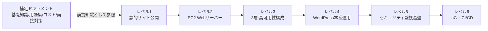

# AWS構築案件パック - 未経験からサーバー構築エンジニアを目指すポートフォリオ

未経験からサーバー構築エンジニア(インフラエンジニア)への転職を目指して作成した、AWSでのインフラ構築ポートフォリオです。

「静的サイトの公開」という一番シンプルな案件から、「可用性を高めた本番相当システム」「セキュリティ監視基盤」「コードによる自動構築(IaC/CI-CD)」まで、実務でよくある構築案件を**レベル1〜6の6段階**に分けて、段階的に難易度を上げながら構築しました。専門用語は初出のたびに言い換え・たとえ話つきで解説し、随所に「🧠 覚え方のコツ」を入れることで、初心者でも読みながら理解し、記憶に残せるように設計しています。

## 自己紹介

はじめまして、◯◯(氏名)と申します。

未経験からサーバー構築エンジニアへの転職を目指し、独学でAWSの学習を進めてきました。「手を動かして理解する」ことを重視し、マネジメントコンソールでの手作業構築から、最終的にはコードによる自動構築(IaC)まで、実務で求められるステップを一通り自分の手で辿ることを目標にこのポートフォリオを作成しました。

- 学習期間: ◯◯ヶ月(◯◯年◯◯月〜)
- 学習方法: ◯◯(書籍名/学習サービス名など)、AWS公式ドキュメント
- 保有資格: ◯◯(取得済み・学習中の資格があれば記載)
- このポートフォリオで意識したこと: 「作って終わり」にせず、**なぜその構成にしたのか**をセキュリティ・コスト・可用性の観点から自分の言葉で説明できるようにすること

> 🧠 **このセクションの使い方**: 上記の「◯◯」部分はテンプレートです。実際の学習期間・学習方法・資格・志望動機に書き換えてご利用ください。

## このポートフォリオの構成

> 🧠 **覚え方のコツ**: 6つの案件は「①公開する→②自分でサーバーを建てる→③壊れなくする→④実運用に耐える→⑤守り続ける→⑥自動化する」という、実際のインフラエンジニアのキャリアで踏む順番そのままに並べています。レベル番号=成長のステップ、と覚えてください。

## 案件一覧(スキルマップ)

| Lv | 案件名 | 主なAWSサービス | 身につくスキル | リンク |
|---|---|---|---|---|
| 1 | 静的Webサイト公開環境の構築 | S3, CloudFront, Route 53, ACM | AWS基本操作、CDN配信の仕組み、独自ドメイン+HTTPS化 | [→ projects/01-static-website](projects/01-static-website/README.md) |
| 2 | EC2で自分のWebサーバーを構築する | VPC, EC2, セキュリティグループ, Elastic IP | VPC・サブネット設計、SSH接続、Webサーバー構築の基礎 | [→ projects/02-ec2-web-server](projects/02-ec2-web-server/README.md) |
| 3 | 可用性を高めた3層Webシステム構築 | ALB, Auto Scaling, Multi-AZ RDS, NATゲートウェイ | 冗長化設計、負荷分散、多層防御のSG設計 | [→ projects/03-ha-three-tier](projects/03-ha-three-tier/README.md) |
| 4 | 本番運用を想定したWordPress環境構築 | ElastiCache, S3, CloudFront, AWS Backup, CloudWatch | パフォーマンス設計、バックアップ運用、監視アラート設計 | [→ projects/04-wordpress-production](projects/04-wordpress-production/README.md) |
| 5 | セキュアな監視・ガバナンス基盤の構築 | IAM, CloudTrail, AWS Config, GuardDuty, WAF | 最小権限設計、証跡管理、脅威検知、Webアプリ防御 | [→ projects/05-security-monitoring](projects/05-security-monitoring/README.md) |
| 6 | IaCとCI/CDによる自動構築 | Terraform, S3, DynamoDB, CodePipeline, CodeBuild | Infrastructure as Code、state管理、CI/CDパイプライン設計 | [→ projects/06-iac-cicd](projects/06-iac-cicd/README.md) |

## 読み方ガイド

1. **AWSにまだ慣れていない方は** まず [docs/01-aws-basics-for-beginners.md](docs/01-aws-basics-for-beginners.md) で全体像をつかんでから、レベル1から順番に読み進めてください。
2. **各案件の中で知らない用語が出てきたら** [docs/02-glossary.md](docs/02-glossary.md) を辞書として参照してください。すべての案件からリンクしています。
3. **手を動かして検証する場合は** 必ず [docs/03-cost-management.md](docs/03-cost-management.md) の無料利用枠・削除チェックリストを先に確認してから進めてください(課金事故防止)。
4. **採用担当者・面接官の方へ**: 各案件のREADMEには構成図・構築手順に加えて「セキュリティのポイント」「コスト概算」「面接でのアピールポイント」まで記載しています。特に各案件末尾の想定Q&Aから読んでいただくと、設計意図が伝わりやすいかと思います。

## 補足ドキュメント

| ドキュメント | 内容 |
|---|---|
| [AWS基礎知識(超入門)](docs/01-aws-basics-for-beginners.md) | クラウドとは何か、リージョン/AZ、サービスカテゴリの全体像 |
| [AWS用語集(覚え方付き)](docs/02-glossary.md) | 全案件に登場する用語を1箇所に整理した辞書、混同しやすい用語の比較表 |
| [コスト管理と無料利用枠ガイド](docs/03-cost-management.md) | 無料利用枠の考え方、課金事故を防ぐ削除チェックリスト、各案件の費用概算まとめ |
| [このポートフォリオの面接での伝え方](docs/04-interview-prep.md) | 自己紹介テンプレート、案件ごとのエレベーターピッチ、想定質問と回答の型 |

## 設計方針

このポートフォリオは、単に「動くものを作る」だけでなく、以下を意識して設計しています。

- **段階的な難易度設計**: レベル1〜6で、コンソール操作の基礎からセキュリティ運用・IaC化まで、実務で求められるステップを段階的に踏めるようにしています。
- **初心者が理解・記憶できる説明**: 専門用語は初出時に必ず言い換えを添え、各所に「🧠 覚え方のコツ」としてたとえ話・語呂合わせを入れています。
- **手を動かせる具体性**: 構築手順はCIDR・ポート番号・設定画面の項目名まで具体的に記載し、実際にAWSマネジメントコンソールで再現できるレベルまで書いています。
- **セキュリティ・コストを最初から意識する**: 各案件に「セキュリティのポイント」「コスト概算」を必ず設け、「作って終わり」にしない視点を組み込んでいます。
- **面接で語れる形にする**: 各案件に想定Q&Aを用意し、構成の「なぜ」を自分の言葉で説明できることを重視しています。

## ライセンス

このリポジトリは [MIT License](LICENSE) のもとで公開しています。学習目的での参照・流用は自由です。

## 関連ドキュメント

- [AWS基礎知識(超入門)](docs/01-aws-basics-for-beginners.md)
- [AWS用語集(覚え方付き)](docs/02-glossary.md)
- [最初の案件(レベル1: 静的Webサイト公開)](projects/01-static-website/README.md)
