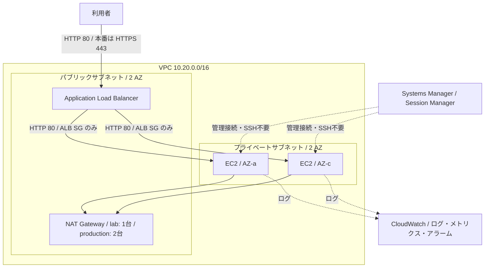

# AWS 構築案件パック

未経験からサーバー構築エンジニアを目指す人が、AWS の設計・構築・試験・運用・障害対応を一つの案件として説明できるようになるための学習用ポートフォリオです。

> [!IMPORTANT]
> Terraform の静的検査はできますが、実 AWS 環境への `plan` / `apply` / 疎通試験は実施していません（`NOT RUN`）。料金が発生し得るため、予算アラートを設定し、演習後に削除してください。

## 30秒でわかる案件

| 項目 | 内容 |
|---|---|
| 顧客要望 | Web サービスを止まりにくく、安全に公開したい |
| 構成 | 2 AZ、ALB、プライベート EC2、Auto Scaling、CloudWatch、SSM |
| セキュリティ | EC2 に公開 IP と SSH 受信規則を持たせず、ALB からの HTTP のみ許可 |
| 可用性 | 2 AZ に分散し、異常な EC2 を ALB/Auto Scaling で切り離し・置換 |
| 運用 | メトリクス、ログ、アラーム、Runbook、試験・証跡テンプレート |
| 構築方式 | Terraform（再現可能な Infrastructure as Code） |

## 覚え方は「要・設・作・試・運・戻」

1. **要**件: 何を、どの水準で守るか決める
2. **設**計: 要件を AWS の構成と設定値に変換する
3. **作**業: Terraform で同じ環境を再現できるようにする
4. **試**験: 正常系・異常系・セキュリティを確認する
5. **運**用: 監視、変更、バックアップ、障害対応を定義する
6. **戻**し: 失敗時のロールバックと演習後の削除を行う

## 構成図



## 7日間の学習順序

| Day | ゴール | 教材 |
|---:|---|---|
| 1 | 案件と用語を説明する | [ロードマップ](docs/00-learning-roadmap.md)、[要件定義](docs/01-requirements.md) |
| 2 | IP、経路、通信許可を説明する | [基本・詳細設計](docs/02-design.md) |
| 3 | コードを読み、静的検査する | [構築手順](docs/03-build-guide.md)、`terraform/` |
| 4 | 合否基準を使って試験する | [試験計画](docs/04-test-plan.md) |
| 5 | 監視と障害の初動を説明する | [運用手順](docs/05-operations.md)、[障害対応](docs/06-incident-response.md) |
| 6 | 成果を証拠として整理する | [証跡ガイド](docs/07-evidence-guide.md) |
| 7 | 面接で判断理由を話す | [面接説明ガイド](docs/08-interview-guide.md) |

学習後に「次に何を足すべきか」で迷った場合は、[不足点チェックと発展計画](docs/10-gap-analysis.md) を使い、まず実測証跡、次に自動検査、その後に本番向け機能の順で改善してください。

## クイックスタート（静的検査）

前提: Terraform 1.6 以降、Python 3.10 以降。AWS CLI は実環境を使う場合のみ必要です。

```powershell
terraform -chdir=terraform fmt -check -recursive
terraform -chdir=terraform init -backend=false
terraform -chdir=terraform validate
python tests/static_checks.py
```

実環境での作業前には、[構築手順](docs/03-build-guide.md) の認証・課金・ロールバックのゲートを完了してください。いきなり `apply` しないでください。

## ポートフォリオの完了条件

- [ ] 要件と設計判断を自分の言葉で説明できる
- [ ] `fmt` / `validate` / 静的チェックが成功する
- [ ] AWS 上での `plan` と `apply` の結果を、秘密情報を除いて保存する
- [ ] ALB 疎通、2 AZ 配置、SSM 接続、ログ、アラームを実測する
- [ ] 障害訓練を1件行い、検知から復旧までを時系列で記録する
- [ ] `destroy` 後、残存リソースと請求画面を確認する

現時点では実環境項目は `NOT RUN` です。テンプレートの存在は実績ではありません。

## AWS 公式資料

- [VPC のセキュリティベストプラクティス](https://docs.aws.amazon.com/vpc/latest/userguide/vpc-security-best-practices.html)
- [プライベートサブネットと NAT の構成例](https://docs.aws.amazon.com/vpc/latest/userguide/vpc-example-private-subnets-nat.html)
- [ALB のヘルスチェック](https://docs.aws.amazon.com/elasticloadbalancing/latest/application/target-group-health-checks.html)
- [Session Manager](https://docs.aws.amazon.com/systems-manager/latest/userguide/session-manager.html)
- [CloudWatch Agent](https://docs.aws.amazon.com/AmazonCloudWatch/latest/monitoring/Install-CloudWatch-Agent.html)

## ライセンス

[MIT License](LICENSE)
