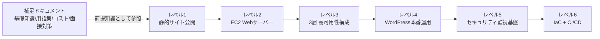

# AWS構築案件パック - 未経験からサーバー構築エンジニアを目指すポートフォリオ

島田則幸 ([ns7jp](https://github.com/ns7jp)) の、AWSインフラの設計・構築手順・自動化コードをまとめた学習ポートフォリオです。

「静的サイトの公開」から「可用性を高めた構成」「セキュリティ監視基盤」「コードによる自動構築(IaC/CI-CD)」まで、**レベル1〜6の6段階**の教材・キットを用意しています。構成図、設計理由、構築・削除手順を確認できます。

## 現在確認できること

| 区分 | 状態と確認先 |
|---|---|
| 文書・コード | 6案件の設計・手順、AWS CLI／Terraformのキットを作成済み |
| 静的検証 | [検証スクリプト](scripts/validate.sh)と[CI](.github/workflows/validate.yml)を用意。構文・リンク等の検査であり、AWSでの動作証明ではありません |
| 実AWSでの構築・疎通・監視・削除 | **未実施（NOT RUN）**。[実行証跡](evidence/README.md)には、2026-09-17時点で本人の実測記録がありません |
| 独力再現・運用経験 | このリポジトリだけでは未確認。手順や想定問答を本人の実績として扱いません |

採用担当者の方は、[レベル2の構成図・設計](projects/02-ec2-web-server/README.md) → [構築・削除コード](projects/02-ec2-web-server/handson/README.md) → [証跡の現在地](evidence/README.md)の順でご覧ください。次の実習は、既存のEC2キット1件で[構築から削除確認まで](evidence/level02/README.md)を記録する形に絞っています。

## 自己紹介

島田則幸です。サーバー構築・運用を行うインフラエンジニアを目指しています。このリポジトリでは、セキュリティ・コスト・可用性を踏まえて設計を説明し、実行結果を別途記録できる形を重視しています。学習期間や資格など、このリポジトリ内で裏付けを確認できない項目は掲載していません。全体の取り組みは[プロフィール](https://github.com/ns7jp)をご覧ください。

## このポートフォリオの構成



> 🧠 **覚え方のコツ**: 6つの案件は「①公開する→②自分でサーバーを建てる→③壊れなくする→④実運用に耐える→⑤守り続ける→⑥自動化する」という、実際のインフラエンジニアのキャリアで踏む順番そのままに並べています。レベル番号=成長のステップ、と覚えてください。

## 案件一覧(スキルマップ)

| Lv | 案件名 | 主なAWSサービス | 身につくスキル | リンク |
|---|---|---|---|---|
| 1 | 静的Webサイト公開環境の構築 | S3, CloudFront, Route 53, ACM | AWS基本操作、CDN配信の仕組み、独自ドメイン+HTTPS化 | [→ projects/01-static-website](projects/01-static-website/README.md) |
| 2 | EC2で自分のWebサーバーを構築する | VPC, EC2, セキュリティグループ, Elastic IP | VPC・サブネット設計、SSH接続、Webサーバー構築の基礎 | [→ projects/02-ec2-web-server](projects/02-ec2-web-server/README.md) |
| 3 | 可用性を高めた3層Webシステム構築 | ALB, Auto Scaling, Multi-AZ RDS, NATゲートウェイ | 冗長化設計、負荷分散、多層防御のSG設計 | [→ projects/03-ha-three-tier](projects/03-ha-three-tier/README.md) |
| 4 | 本番運用を想定したWordPress環境構築 | ElastiCache, S3, CloudFront, AWS Backup, CloudWatch | パフォーマンス設計、バックアップ運用、監視アラート設計 | [→ projects/04-wordpress-production](projects/04-wordpress-production/README.md) |
| 5 | セキュアな監視・ガバナンス基盤の構築 | IAM, CloudTrail, AWS Config, GuardDuty, WAF | 最小権限設計、証跡管理、脅威検知、Webアプリ防御 | [→ projects/05-security-monitoring](projects/05-security-monitoring/README.md) |
| 6 | IaCとCI/CDによる自動構築 | Terraform, S3, DynamoDB, CodePipeline, CodeBuild | Infrastructure as Code、state管理、CI/CDパイプライン設計 | [→ projects/06-iac-cicd](projects/06-iac-cicd/README.md) |

## ハンズオンキット(手を動かして構築する)

各案件の `handson/` ディレクトリに、本編の構成を **AWS CLI スクリプト(レベル1〜5)/ Terraform(レベル6)で構築・削除するためのキット**を用意しています。実AWSでの成功は未確認です。まず対象1件のコードと手順を読み、実行条件を確認してください。

| Lv | キット | 構築方式 | 主な内容 |
|---|---|---|---|
| 1 | [01-static-website/handson](projects/01-static-website/handson/README.md) | AWS CLI | S3 + CloudFront(OAC)構築、HTMLサンプル、削除スクリプト |
| 2 | [02-ec2-web-server/handson](projects/02-ec2-web-server/handson/README.md) | AWS CLI | VPC〜EC2〜Elastic IP を一括構築、user-data で Apache 自動導入 |
| 3 | [03-ha-three-tier/handson](projects/03-ha-three-tier/handson/README.md) | AWS CLI | 6サブネット、NAT、3層SG、ALB、Auto Scaling、RDS Multi-AZ |
| 4 | [04-wordpress-production/handson](projects/04-wordpress-production/handson/README.md) | AWS CLI(レベル3の差分) | Secrets Manager、ElastiCache、S3メディア、AWS Backup、CloudWatchアラーム |
| 5 | [05-security-monitoring/handson](projects/05-security-monitoring/handson/README.md) | AWS CLI | IAMグループ+MFA強制、CloudTrail、Config、GuardDuty、WAF |
| 6 | [06-iac-cicd/handson](projects/06-iac-cicd/handson/README.md) | Terraform | state用S3/DynamoDB、VPC/SG/EC2モジュール、CodeBuild buildspec |

> ⚠️ **必ず読んでください**: キットは実AWS環境での動作検証を行っていません(構文チェックのみ)。実行前に各 `handson/README.md` と [コスト管理ガイド](docs/03-cost-management.md) を読み、予算アラートを設定し、検証後は `cleanup.sh` / `terraform destroy` で必ず削除してください。

## 構築証跡と自動検証

- **[evidence/](evidence/README.md)**: キットを実際のAWSアカウントで実行した記録(所要時間・費用・スクリーンショット・つまずきと解決)を残す場所です。テンプレート [evidence/templates/handson-record.md](evidence/templates/handson-record.md) をコピーして使います。「本当に手を動かした」ことを示す、面接で最も効く材料です。
- **[scripts/validate.sh](scripts/validate.sh)**: シェル構文・shellcheck・JSON/YAML・Markdownリンク・Terraform fmt をまとめて検証します。GitHub Actions([.github/workflows/validate.yml](.github/workflows/validate.yml))で push のたびに自動実行され、実AWS環境には接続しません。

```bash
./scripts/validate.sh   # ローカルでも同じチェックを実行できます
```

## 読み方ガイド

1. **AWSにまだ慣れていない方は** まず [docs/01-aws-basics-for-beginners.md](docs/01-aws-basics-for-beginners.md) で全体像をつかんでから、レベル1から順番に読み進めてください。
2. **各案件の中で知らない用語が出てきたら** [docs/02-glossary.md](docs/02-glossary.md) を辞書として参照してください。すべての案件からリンクしています。索引から、1用語ごとに「なぜ必要か・どこでハマるか」まで掘り下げた[詳細用語集(全10章・478項目)](docs/glossary/01-cloud-basics.md)へ飛べます。
3. **手を動かして検証する場合は** 必ず [docs/03-cost-management.md](docs/03-cost-management.md) の無料利用枠・削除チェックリストを先に確認してから進めてください(課金事故防止)。
4. **採用担当者・面接官の方へ**: 各案件のREADMEには構成図・構築手順に加えて「セキュリティのポイント」「コスト概算」「面接でのアピールポイント」まで記載しています。特に各案件末尾の想定Q&Aから読んでいただくと、設計意図が伝わりやすいかと思います。

## 補足ドキュメント

| ドキュメント | 内容 |
|---|---|
| [AWS基礎知識(超入門)](docs/01-aws-basics-for-beginners.md) | クラウドとは何か、リージョン/AZ、サービスカテゴリの全体像 |
| [AWS用語集(覚え方付き)](docs/02-glossary.md) | **用語集のトップ(索引)**。全478項目のアイウエオ順索引、カテゴリ別ひとこと早見表、混同しやすい用語の比較表、ミニハンズオン |
| [詳細用語集 全10章](docs/glossary/01-cloud-basics.md) | 1用語ごとに「正式名称/読み方/重要度/たとえるなら/もう少し詳しく/サーバー構築での勘所/よくあるつまずき/コスト/関連用語」まで解説。Linux・サーバー運用の基礎と全50問の総まとめテストも収録 |
| [コスト管理と無料利用枠ガイド](docs/03-cost-management.md) | 無料プランの確認、削除チェックリスト、各案件の見積もり項目 |
| [このポートフォリオの面接での伝え方](docs/04-interview-prep.md) | 自己紹介テンプレート、案件ごとのエレベーターピッチ、想定質問と回答の型 |

## 設計方針

このポートフォリオは、単に「動くものを作る」だけでなく、以下を意識して設計しています。

- **段階的な難易度設計**: レベル1〜6で、コンソール操作の基礎からセキュリティ運用・IaC化まで、実務で求められるステップを段階的に踏めるようにしています。
- **初心者が理解・記憶できる説明**: 専門用語は初出時に必ず言い換えを添え、各所に「🧠 覚え方のコツ」としてたとえ話・語呂合わせを入れています。
- **手を動かせる具体性**: 構築手順はCIDR・ポート番号・設定画面の項目名まで具体的に記載し、実際にAWSマネジメントコンソールで再現できるレベルまで書いています。
- **セキュリティ・コストを最初から意識する**: 各案件に「セキュリティのポイント」「コスト概算」を必ず設け、「作って終わり」にしない視点を組み込んでいます。
- **面接で語れる形にする**: 各案件に想定Q&Aを用意し、構成の「なぜ」を自分の言葉で説明できることを重視しています。

## ライセンス

このリポジトリは [MIT License](LICENSE) のもとで公開しています。学習目的での参照・流用は自由です。

## 関連ドキュメント

- [AWS基礎知識(超入門)](docs/01-aws-basics-for-beginners.md)
- [AWS用語集(覚え方付き・索引)](docs/02-glossary.md)
- [詳細用語集 ②ネットワーク編(最重要)](docs/glossary/02-network.md)
- [詳細用語集 ⑨Linux・サーバー運用の基礎](docs/glossary/09-linux-server-basics.md)
- [詳細用語集 ⑩略語一覧と総まとめテスト(全50問)](docs/glossary/10-abbreviations-and-quiz.md)
- [最初の案件(レベル1: 静的Webサイト公開)](projects/01-static-website/README.md)
