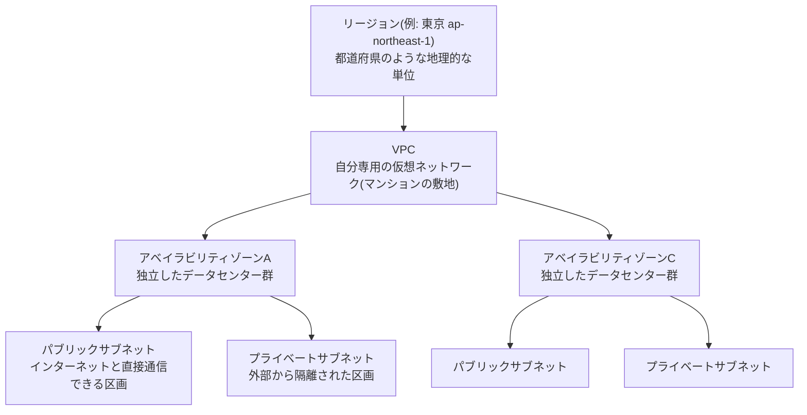

# AWS基礎知識(超入門): このポートフォリオを読む前に

このドキュメントは、`projects/` 配下にある6つの案件を読み始める前に目を通していただく「準備運動」です。想定読者は、(1) このポートフォリオを見てくださる採用担当者・面接官の方、(2) これから同じ構成を自分の手で作りながら学びたい初心者エンジニアの方、の両方です。専門用語はすべて初出時に「用語(かんたんな言い換え)」の形で補足していますので、AWSに触れたことがなくても最後まで読み進められる内容になっています。

## 1. クラウドとは何か

サーバーを自分で用意する昔ながらの方法(オンプレミス。自社の建物内に自前でサーバー機器を購入・設置して運用する方式)では、機器の購入・設置場所の確保・電源や空調・故障時の交換まで、すべて自分たちで抱え込む必要がありました。

クラウド(Cloud Computing。サーバーやストレージ、ネットワークといったコンピューター資源を、自分で所有せずインターネット経由で必要な分だけ借りて使う仕組み)は、この「機器を買う」という発想を「必要な時に必要なだけ借りる」という発想に変えるものです。AWS(Amazon Web Services。Amazon社が提供するクラウドサービスの総称)はそのクラウドサービスの世界最大手の1つで、このポートフォリオではAWSを使ってインフラを構築していきます。

> 🧠 **覚え方のコツ**: クラウドは「マンスリーマンション」だと考えてください。一戸建てを買う(オンプレミス)と初期費用も維持費も自分持ちですが、マンスリーマンション(クラウド)なら必要な期間だけ借りて、使わなくなったらすぐ解約できます。AWSの料金が基本的に「使った分だけ支払う」従量課金なのはこのためです。

## 2. AWSアカウントとIAMユーザーの違い

AWSを使い始めるとき、最初に作るのが**AWSアカウント**です。このアカウントには自動的に**ルートユーザー**(そのAWSアカウントに対してあらゆる操作ができる、最強かつ唯一無二の管理者アカウント)が1つ紐づいています。

ここで重要な注意点があります。**ルートユーザーは普段の作業には使いません。** 理由は次の通りです。

| 理由 | 説明 |
|---|---|
| 権限が強すぎる | ルートユーザーは請求情報の変更やアカウント自体の解約まで、あらゆる操作ができてしまいます。誤操作や情報漏えい時の被害が最大化します |
| 権限を絞れない | ルートユーザーには「この操作だけ許可する」という制限をかけられません |
| 監査がしづらい | 複数人で作業する場合、誰が何をしたかを個人単位で追いにくくなります |

そこで登場するのが**IAM**(Identity and Access Management。「誰が」「何に対して」「何をしてよいか」を管理するAWSの権限管理サービス)です。普段の作業は、IAMで作成した**IAMユーザー**(必要な権限だけを与えられた、個人やシステムごとの作業用アカウント)で行うのが鉄則です。ルートユーザーは、IAMユーザーを作った後は初期設定や緊急時以外は金庫にしまっておくイメージです。

> 🧠 **覚え方のコツ**: IAMのポリシー(「誰が」「何に対して」「何をしてよいか」をまとめた許可のルール)は「誰が(Principal。操作する人やシステム)」「何に対して(Resource。操作対象のAWSリソース)」「何をしてよいか(Action。許可する操作内容)」の3要素で決まります。頭文字を取ると **P・R・A(プラ)** です。「権限は“プラ”で決まる」と唱えて覚えてください。この3つが1セット揃って初めて、1つのIAMポリシーが意味を持ちます。

### 実際にやってみる: コンソールでIAMユーザーを作る大まかな流れ

文章だけでは実感がわきにくいので、実際のコンソール画面での操作をイメージできるように、大まかな流れを番号付きで示します(詳細な画面キャプチャ付きの手順は各案件のREADMEにあります)。

1. ルートユーザーでログイン後、画面上部の検索バーに「IAM」と入力し、IAMのダッシュボードを開きます。
2. 左側のナビゲーションメニューから「ユーザー」を選び、右上の「ユーザーを作成」ボタンをクリックします。
3. 「ユーザー名」の入力欄に、例えば `handson-user` と入力します。
4. 「AWSマネジメントコンソールへのユーザーアクセスを提供する」にチェックを入れ、「IAMユーザーを作成します」を選んで任意のパスワードを設定します。
5. 「許可を設定」の画面で「ポリシーを直接アタッチする」を選び、検索窓に `AdministratorAccess` と入力してチェックを入れます(これは学習用途向けの設定です。実務では**最小権限の原則**(必要な作業に必要な権限だけを与える考え方)に従い、もっと絞り込んだ権限だけを与えます)。
6. 内容を確認し、「ユーザーを作成」をクリックします。作成完了画面に表示されるサインインURLを控えておき、次回からはこのURLとIAMユーザーでログインします。

AWS CLI(後述)を設定済みであれば、今どのユーザーとしてログインしているかを次のコマンドで確認できます。

```bash
aws sts get-caller-identity
```

実行すると `Account`(アカウントID)、`UserId`、`Arn`(Amazon Resource Name。そのユーザーやリソースをAWS全体で一意に指定する識別子)の3つが表示され、自分がルートユーザーではなく想定したIAMユーザーとして操作できているかを確認できます。

## 3. リージョンとアベイラビリティゾーン(AZ)

AWSのサーバーは世界中の拠点に分散しています。この地理的な単位を理解するために、次のたとえ話が役立ちます。

- **リージョン**(世界各地に存在する、独立したAWSのデータセンター群が集まる地理的な単位。例: 東京 `ap-northeast-1`、バージニア北部 `us-east-1`)は「都道府県」のようなものです。
- **アベイラビリティゾーン**(AZ。1つのリージョンの中にある、電源や回線が独立した複数のデータセンター群)は、その都道府県の中にある「独立した市区町村」のようなものです。1つのリージョンには通常3つ以上のAZが存在します。

なぜAZを分ける必要があるのでしょうか。1つのAZ(データセンター)で火災や停電などの障害が起きても、他のAZは影響を受けない設計になっているためです。レベル3の案件で扱う「マルチAZ構成」は、この仕組みを使って可用性(サービスが止まらずに使い続けられる度合い)を高める代表的な手法です。

AWS上でサーバーを置くための土台になるのが**VPC**(Virtual Private Cloud。AWS上に自分専用に区切って作る仮想ネットワーク。マンションの敷地のようなもの)です。VPCを作成するときは**CIDR**(Classless Inter-Domain Routing。IPアドレスの範囲を「10.0.0.0/16」のような表記でまとめて指定する方式)でネットワークの大きさを決め、その内側をさらに**サブネット**(VPCの中をさらに細かく区切った区画)という単位に分割して使います。次の図は、リージョン→VPC→AZ→サブネットという階層関係を表したものです。



> 🧠 **覚え方のコツ**: 「リージョンは都道府県、VPCはそこに持っている自分の敷地、AZはその中の市区町村、サブネットはその中の1つの建物」と覚えてください。都道府県が丸ごと止まることは滅多にありませんが、市区町村レベルの停電はゼロではない、だから同じ敷地(VPC)の中でも複数のAZに建物(サブネット)を分散させておく、とイメージすると腹落ちします。

図にある**パブリックサブネット**(インターネットゲートウェイを経由して外部と直接通信できる区画)と**プライベートサブネット**(外部から直接アクセスできない、内部専用の区画)の使い分けは、レベル2以降で繰り返し登場する超重要な考え方です。

> 🧠 **覚え方のコツ**: パブリックサブネットは「受付ロビー(誰でも入れる)」、プライベートサブネットは「バックヤードの倉庫(社員証がないと入れない)」です。Webサーバーやロードバランサー(複数台のサーバーへ通信を振り分けて負荷を分散させる装置)のように外部からの通信を受け付ける機器はパブリックサブネットに、データベースのように外部に直接さらしたくない機器はプライベートサブネットに置く、と覚えてください。

## 4. AWSサービス早見表(カテゴリ別)

AWSには数百のサービスがありますが、最初からすべてを覚える必要はありません。このポートフォリオで扱うサービスをカテゴリ別に整理すると、次の7つに分類できます。

| カテゴリ | 主なサービス | ひとこと覚え方 |
|---|---|---|
| コンピューティング | EC2(Elastic Compute Cloud。自分専用の仮想サーバーを借りられるサービス)、Lambda(サーバー管理をせずにコードの断片だけを実行できるサービス) | 「処理を実行する頭脳」担当 |
| ネットワーキング | VPC(前述のとおり、AWS上に自分専用に区切って作る仮想ネットワーク)、Route 53(ドメイン名とサーバーの住所を結びつけるDNSサービス)、CloudFront(世界中の拠点からコンテンツを高速配信するCDN) | 「つなぐ・届ける」担当 |
| ストレージ | S3(Simple Storage Service。ファイルを保管する倉庫のようなストレージサービス)、EBS(EC2に取り付ける仮想ハードディスク) | 「しまう場所」担当 |
| データベース | RDS(MySQLやPostgreSQLなどをAWSが管理・運用してくれるマネージド型データベースサービス)、ElastiCache(データを高速に読み書きできるインメモリキャッシュサービス) | 「記憶して素早く引き出す」担当 |
| セキュリティ | IAM、GuardDuty(不審な通信や操作を自動検知する脅威検知サービス)、WAF(Web Application Firewall。Webアプリケーションへの攻撃をブロックするファイアウォール) | 「見張る・防ぐ」担当 |
| 監視 | CloudWatch(サーバーの状態やログを収集・可視化する監視サービス)、CloudTrail(「誰が・いつ・何を操作したか」を記録する証跡サービス) | 「気づく・記録する」担当 |
| 運用自動化 | CloudFormation(AWSリソースの構成をコードで定義し自動構築する仕組み)、Terraform(HashiCorp社が提供するIaCツール)、CodePipeline(コードの変更を検知し、自動でビルド・デプロイまで行うCI/CD(継続的インテグレーション/継続的デリバリー。コードの変更を自動でテスト・反映する一連の仕組み)サービス) | 「繰り返し作業を自動化する」担当 |

> 🧠 **覚え方のコツ**: 7カテゴリを「頭脳(コンピューティング)・血管(ネットワーキング)・倉庫(ストレージ)・記憶(データベース)・警備員(セキュリティ)・監視カメラ(監視)・自動化ロボット(運用自動化)」という1つの建物の設備にたとえると覚えやすいです。案件が進むごとに、この建物に少しずつ設備が増えていくイメージで各レベルを読み進めてください。

## 5. 操作方法の3つの選択肢:コンソール・CLI・IaC

AWSを操作する方法は、大きく3種類あります。

| 操作方法 | 説明 | 特徴 |
|---|---|---|
| マネジメントコンソール | ブラウザからログインして、画面をクリックしながら操作するGUI(画面上のボタンやメニューを見ながら操作する方式) | 直感的で初心者に優しいが、手順が記録に残りにくい |
| AWS CLI(Command Line Interface。コマンドを打ち込んでAWSを操作するツール) | ターミナルからコマンドでAWSを操作する方法 | 繰り返し作業の自動化やスクリプト化がしやすい |
| IaC(Infrastructure as Code。インフラの構成をコード(設定ファイル)として記述し、実行することで環境を再現できるようにする考え方) | CloudFormationやTerraformを使い、構成そのものをコードで管理する方法 | 誰が実行しても同じ環境を再現でき、変更履歴もGitで管理できる |

### 具体例で見る3つの違い:S3バケットを1つ作るとしたら

同じ「S3バケットを1つ作る」という作業でも、方法によって見え方がまったく異なります。

- **コンソール**: S3の画面を開き、「バケットを作成」ボタンをクリックし、バケット名に `my-handson-bucket-2026` のような一意な名前を入力、リージョンで「アジアパシフィック(東京)ap-northeast-1」を選んで「バケットを作成」をクリックします。
- **CLI**: ターミナルで次の1行を実行するだけです。

```bash
aws s3 mb s3://my-handson-bucket-2026 --region ap-northeast-1
```

- **IaC(Terraform)**: 次のような設定ファイルを書いておき、`terraform apply` というコマンドを実行すると、同じバケットが再現可能な形で作成されます。

```hcl
resource "aws_s3_bucket" "example" {
  bucket = "my-handson-bucket-2026"
}
```

このポートフォリオは、レベル1から6に進むにつれて、この3つを段階的にステップアップしていく設計になっています。

| レベル | 案件名 | 操作方法の重心 |
|---|---|---|
| レベル1 | 静的Webサイト公開環境の構築 | コンソール中心 |
| レベル2 | EC2で自分のWebサーバーを構築する | コンソール中心(VPCをゼロから手作業設計) |
| レベル3 | 可用性を高めた3層Webシステム構築 | コンソール中心 + 構成の複雑化 |
| レベル4 | 本番運用を想定したWordPress環境構築 | コンソール + 運用設計(バックアップ等) |
| レベル5 | セキュアな監視・ガバナンス基盤の構築 | コンソール + 監視・セキュリティ設定 |
| レベル6 | Infrastructure as CodeとCI/CDによる自動構築 | Terraform + CodePipelineによる完全コード化 |

> 🧠 **覚え方のコツ**: 「まずは手で覚え、慣れたら道具で楽をする」の順番です。料理に例えるなら、レベル1〜5は「手切り・手作業(コンソール)」でレシピの勘所を体に叩き込む段階、レベル6は「フードプロセッサー(IaC・CI/CD)」で同じ料理を毎回同じ品質で再現できるようにする段階です。手作業を知らずに自動化だけ覚えると、エラーが起きたときに中身がブラックボックスになってしまいます。

## 💰 無料利用枠の基本方針

AWSには、一定の範囲内であれば無料で利用できる**無料利用枠**(AWS Free Tier。EC2やS3などの主要サービスを、一定の使用量まで無料で試せる制度)が用意されています。このポートフォリオの案件は、基本的に無料利用枠の範囲内、または数百円程度の実費で完了できるように設計しています。

ただし、無料利用枠には「12ヶ月間無料」「常に無料」「一定期間のみ無料」など複数の種類があり、対象サービスや条件も変わることがあります。詳しい考え方・請求アラート(利用金額が設定した金額を超えたときにメール等で知らせてくれる仕組み)の設定方法・使い終わった後の削除手順は [docs/03-cost-management.md](03-cost-management.md) にまとめていますので、必ず事前に目を通してから構築を始めてください。最新の条件は必ず [AWS無料利用枠](https://aws.amazon.com/jp/free/) の公式ページでご確認ください。

## 📌 この章のまとめ

- ✅ クラウドは「サーバーを買う」から「必要な分だけ借りる」への発想転換
- ✅ 普段の作業はルートユーザーではなく、権限を絞ったIAMユーザーで行う
- ✅ リージョン=都道府県、VPC=自分の敷地、AZ=市区町村、パブリック/プライベートサブネット=受付ロビーとバックヤード
- ✅ AWSサービスは7カテゴリに整理して理解する
- ✅ 操作方法はコンソール→CLI→IaCの順に段階を踏んで身につける

## 参考リンク

- [Amazon VPCのドキュメント](https://docs.aws.amazon.com/vpc/)
- [AWS IAMのドキュメント](https://docs.aws.amazon.com/IAM/latest/UserGuide/introduction.html)
- [Amazon EC2のドキュメント](https://docs.aws.amazon.com/ec2/)
- [AWS無料利用枠](https://aws.amazon.com/jp/free/)
- [AWS Well-Architected フレームワーク](https://aws.amazon.com/jp/architecture/well-architected/)
- [Terraformのドキュメント](https://developer.hashicorp.com/terraform/docs)

## この後どう読み進めるか

準備は整いました。次は用語でつまずいたときに立ち返るための [docs/02-glossary.md](02-glossary.md)(用語集)を軽く眺めてから、[projects/01-static-website/README.md](../projects/01-static-website/README.md)(レベル1: 静的Webサイト公開環境の構築)から順番に読み進めることをおすすめします。各案件のREADMEでも、初出の専門用語にはその都度この基礎知識を補う説明を入れていますので、わからない言葉が出てきても安心して読み進めてください。

## 関連ドキュメント

- [ポートフォリオ全体トップ](../README.md)
- [用語集](02-glossary.md)
- [コスト管理ガイド](03-cost-management.md)
- [最初の案件(レベル1: 静的Webサイト公開環境の構築)](../projects/01-static-website/README.md)
