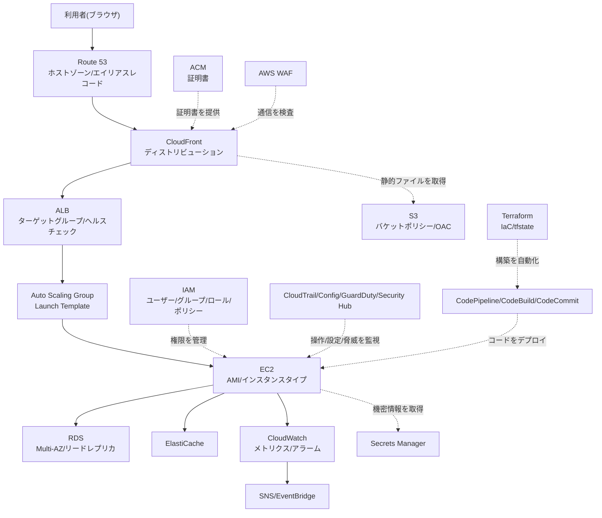

# AWS用語集(覚え方付き)

## この用語集の使い方

この用語集は、`projects/`配下にある6つの案件(レベル1〜6)に登場するAWS関連用語を1箇所にまとめた辞書です。案件のREADME(各案件の構築手順やアーキテクチャをまとめたドキュメント)を読んでいて知らない単語に出会ったら、ブラウザの検索機能(Windows/Linuxは`Ctrl+F`、Macは`Cmd+F`)でこのページ内を検索してください。各案件のREADMEからもこのページへリンクしています。最初から全部を暗記しようとせず、「わからなくなったら戻ってくる辞書」として使うのがおすすめです。ネットワーク編の後には、実際にコンソールで手を動かして体感できる小さなハンズオンも用意しています。

## AWSサービスの全体像(このページの用語がどこに登場するか)

言葉だけを丸暗記すると忘れやすいので、まずは「典型的なWebシステムの中で、どのサービスがどの位置にいるか」を図で見てみましょう。ここに出てくる箱の名前は、すべて下の各カテゴリの表で説明しています。



> 🧠 **覚え方のコツ**: 全体の流れは「外(インターネット)→受付(DNS/CDN/ALB)→中の作業員(EC2)→書庫(RDS/S3)→警備(IAM/監視系)」という1つの建物の中の動きだとイメージすると、どのサービスがどの役割かで迷わなくなります。

## ネットワーク編

| 用語 | ひとことで言うと | 覚え方・たとえ話 |
|---|---|---|
| VPC | AWS上に自分専用に区切って作る仮想ネットワーク | マンションの「敷地」。この中に建物(サブネット)を建てていく |
| サブネット(パブリック/プライベート) | VPCをさらに小さく区切った部屋。パブリックはネットに直結、プライベートは非公開 | パブリックは「道路に面した1階の店舗」、プライベートは「奥にある事務所・倉庫」 |
| CIDR | IPアドレスの範囲をまとめて表す書き方(例: `10.0.0.0/16`) | 「/16」は町の番地の桁数。数字が小さいほど広い範囲(部屋数)を表す |
| ルートテーブル | 「この行き先の通信はここへ送る」という交通標識の一覧 | マンションの「案内板」。行き先ごとにどの出口を使うか書いてある |
| インターネットゲートウェイ(IGW) | VPCをインターネットにつなぐための出入り口 | マンションの「正面玄関」。ここを通らないと外に出られない |
| NATゲートウェイ | プライベートサブネットから外部への「片道通行」の出口 | 「宅配の受け取り専用ドア」。中から外へ発送はできるが、外から勝手には入れない |
| セキュリティグループ | EC2などモノ単位につける通信許可リスト。ステートフル(行きの通信を許可すると、戻りの通信も自動的に許可される性質)が特徴 | 「個人につけるIDカード」。入室できれば退室も自動でOK |
| ネットワークACL(NACL) | サブネット単位で通信を許可/拒否するルール。ステートレス(行きと戻り、それぞれに個別の許可ルールが必要な性質)が特徴 | 「フロア入口に立つ警備員」。入るときも出るときも毎回チェックされる |
| ELB/ALB | 利用者からの通信を複数のサーバーに振り分ける負荷分散装置 | 飲食店の「受付・案内係」。お客をどの席(サーバー)に案内するか決める |
| ターゲットグループ | ALBが振り分け先として管理するサーバーのグループ | 受付係(ALB)が持っている「案内できる席のリスト」 |
| ヘルスチェック | サーバーが正常に動いているかを定期的に確認する仕組み | 案内係が「この席のお客さん、対応中?」と定期的に見回る作業 |
| CloudFront | 世界中のエッジ拠点(利用者の近くに置かれた配信用の中継地点)からコンテンツを配信するCDN(コンテンツ配信網) | 「町ごとにある出張コンビニ」。近くの店から受け取れるので速い |
| ディストリビューション | CloudFrontにおける、1サイト分の配信設定のかたまり | 出張コンビニの「この店舗ではこの品揃えで売る」という運営マニュアル |
| キャッシュ無効化(invalidation) | CloudFrontに溜まった古いコピーを強制的に破棄させる操作 | 出張コンビニに「古い在庫は捨てて本店から取り寄せて」と指示すること |
| Route 53 | ドメイン名とIPアドレスを結びつけるDNS(電話帳)サービス | インターネットの「電話帳」。名前(ドメイン)から住所(IP)を調べる |
| ホストゾーン | Route 53で管理する、1つのドメインぶんの設定台帳 | 電話帳の中にある「自分の会社のページ」 |
| エイリアスレコード | Route 53独自の、AWSリソースを直接指せる特殊なDNSレコード | 電話帳に「代表電話ではなく直通番号」を書いておくイメージ |
| リージョン | 世界各地にあるAWSの独立したデータセンター群のまとまり | 「国・地域ごとの支社」。東京リージョン、大阪リージョンなど |
| アベイラビリティゾーン(AZ) | リージョン内にある、独立した電源・空調・回線を持つデータセンター群 | 支社(リージョン)の中にある「複数の独立した建物(棟)」 |

## 用語を実際に手を動かして確認してみよう(ミニハンズオン)

言葉の意味を読むだけでなく、実際にAWSマネジメントコンソール(ブラウザからAWSの各サービスを操作できる管理画面)で手を動かすと、驚くほど記憶に残ります。ここでは上の表で出てきた「VPC」「CIDR」「サブネット」「セキュリティグループ」の4つを、実際に作りながら体感してみましょう。無料利用枠の範囲内で完了できる操作です(詳しくは[無料利用枠](https://aws.amazon.com/jp/free/)を参照してください)。

1. **VPCを作成する**: AWSマネジメントコンソールの検索バーに「VPC」と入力してVPCダッシュボードを開き、「VPCを作成」→「VPCのみ」を選択します。名前タグに `glossary-demo-vpc`、IPv4 CIDRブロックに `10.0.0.0/16`(約65,536個のIPアドレスを使える範囲)を入力して作成します。
2. **パブリックサブネットを作成する**: 左メニューの「サブネット」→「サブネットを作成」を選び、手順1で作ったVPCを選択します。サブネット名に `glossary-demo-public-1a`、アベイラビリティゾーンに `ap-northeast-1a`(東京リージョンの中にある1つのAZ)、IPv4 CIDRブロックに `10.0.1.0/24`(256個のIPアドレスを使える範囲)を入力します。
3. **セキュリティグループを作成する**: 左メニューの「セキュリティグループ」→「セキュリティグループを作成」を選び、名前に `glossary-demo-sg` を入力します。インバウンド(外部から内部方向へ入ってくる通信)ルールの「ルールを追加」で、次の3行を追加します。

   | タイプ | プロトコル | ポート範囲 | ソース | 用途 |
   |---|---|---|---|---|
   | SSH | TCP | 22 | マイIP | 管理者の接続専用(全世界には公開しない) |
   | HTTP | TCP | 80 | 0.0.0.0/0 | 一般利用者のWebアクセス |
   | HTTPS | TCP | 443 | 0.0.0.0/0 | 一般利用者の暗号化されたWebアクセス |

4. **確認したら削除する**: 課金事故を防ぐため、検証が終わったらすぐに後片付けをします。削除の順番は作成した順の「逆」です。セキュリティグループ→サブネット→VPCの順に削除してください(先にVPCを消そうとすると、中にサブネットが残っているためエラーになります)。

AWS CLI(コマンドラインからAWSを操作するためのツール)を使うと、手順1〜2と同じ操作を次のように再現できます。

```bash
# 1. VPCを作成(CIDRブロック 10.0.0.0/16)
aws ec2 create-vpc \
  --cidr-block 10.0.0.0/16 \
  --tag-specifications 'ResourceType=vpc,Tags=[{Key=Name,Value=glossary-demo-vpc}]'

# 2. 手順1で作成されたVPCのIDを控えて、パブリックサブネットを作成(CIDRブロック 10.0.1.0/24)
aws ec2 create-subnet \
  --vpc-id <手順1で控えたvpc-id> \
  --cidr-block 10.0.1.0/24 \
  --availability-zone ap-northeast-1a \
  --tag-specifications 'ResourceType=subnet,Tags=[{Key=Name,Value=glossary-demo-public-1a}]'
```

> 🧠 **覚え方のコツ**: CIDRの「/(スラッシュ)の後ろの数字」は、数字が小さいほど部屋数(使えるIPアドレスの数)が多くなります。「VPC全体=`/16`(マンション一棟まるごと、約65,000部屋)」「サブネット=`/24`(そのうちの1フロア、256部屋)」とセットで覚えると、CIDRの数字を見ただけで「これは全体設計か、フロア単位の設計か」を判断できるようになります。

この4つの用語を組み合わせた本格的な構築手順は、[レベル2の案件(EC2 Webサーバー構築)](../projects/02-ec2-web-server/README.md)で詳しく扱っています。

## コンピューティング編

| 用語 | ひとことで言うと | 覚え方・たとえ話 |
|---|---|---|
| EC2 | クラウド上で借りられる仮想サーバー | 「レンタルパソコン」。使いたい時だけ起動して使える |
| AMI | EC2を起動するための「テンプレート(OSやソフトの初期状態)」 | パソコンの「復元イメージ」。同じ状態のパソコンを何台でも量産できる |
| インスタンスタイプ | CPU・メモリなどEC2のスペック(性能・大きさ)の種類 | レンタカーの「車種選び」。軽自動車〜トラックまで用途に応じて選ぶ |
| キーペア | EC2にSSH接続するための鍵(秘密鍵と公開鍵のペア) | 「合鍵システム」。公開鍵はドアの錠前、秘密鍵は自分だけが持つ鍵 |
| Elastic IP | 固定して使える静的なパブリックIPアドレス | 「専用の電話番号」。サーバーを作り直しても番号が変わらない |
| Auto Scaling(Auto Scaling Group) | サーバー台数を自動で増減・復旧させる仕組み | 「自動人員配置システム」。混雑時は増員、空いてる時は減員、倒れたら補充 |
| Launch Template | 「どのAMIで、どのインスタンスタイプで起動するか」を定義した設計図 | Auto Scalingが新しいサーバーを作るときに使う「発注書のひな形」 |

## ストレージ編

| 用語 | ひとことで言うと | 覚え方・たとえ話 |
|---|---|---|
| S3(Simple Storage Service) | ファイルを「オブジェクト」という単位でそのまま保存できるストレージ(容量ほぼ無制限) | 「巨大な貸倉庫」。写真や動画、静的サイトのファイルなどを保管する |
| バケットポリシー | S3バケット(保管庫)単位で「誰が何をできるか」を決めるルール | 貸倉庫の「入館規則」。契約書としてドア全体に貼ってある |
| OAC(Origin Access Control) | CloudFrontだけがS3の中身を取得できるようにする仕組み | 貸倉庫の「専用通用口」。出張コンビニ(CloudFront)専用の裏口で、一般客は正面から入れない |
| AWS Backup | 複数サービスのバックアップを一元的にスケジュール管理するサービス | 「バックアップの司令塔」。複数の倉庫の定期点検予約をまとめて管理できる |
| スナップショット | ある時点のディスクやDBの状態をまるごと保存したコピー | 「ある瞬間の写真」。壊れた時にその時点まで巻き戻せる |

## データベース編

| 用語 | ひとことで言うと | 覚え方・たとえ話 |
|---|---|---|
| RDS | AWSが運用・保守を代行してくれるマネージド型のリレーショナルデータベース(表形式でデータを管理し、テーブル同士を関連付けて扱えるデータベース。MySQLやPostgreSQLなど) | 「お手入れ不要の水槽」。掃除や点検はAWSが代わりにやってくれる |
| Multi-AZ | 別AZに待機系DBを同期複製(更新と同時にリアルタイムで反映する複製方式)し、障害時に自動切替する高可用性(障害が起きてもサービスが止まりにくい性質)構成 | 「本番の代役俳優」。舞台裏で待機し、主役が倒れたら即座に交代する |
| リードレプリカ | 読み取り専用の複製DBを作り、参照処理を分散させる仕組み | 「サイン会の分身」。同じ答えを返せる複製が複数いて行列(読み取り)をさばく |
| ElastiCache | データを高速なメモリ上に一時保存するインメモリキャッシュサービス | 「よく聞かれる質問の早見表」。DBに毎回聞きに行かず、手元の早見表で即答する |

## セキュリティ・監視編

| 用語 | ひとことで言うと | 覚え方・たとえ話 |
|---|---|---|
| ACM(AWS Certificate Manager) | HTTPS通信に使うSSL/TLS証明書を無料で発行・自動更新するサービス | 「身分証明書の自動更新窓口」。期限が切れる前に勝手に更新してくれる |
| IAM | AWSの「誰が・何に・何をできるか」を管理する認証認可の仕組み | ビル全体の「入館管理システム」 |
| IAMユーザー | 人が使う、パスワードやアクセスキーを持つ恒久的な身分証 | 「社員証」。その人専用でずっと使える |
| IAMグループ | 同じ権限を持つIAMユーザーをまとめるための入れ物 | 「部署ごとの権限セット」。部署に配属すれば必要な権限がまとめて付く |
| IAMロール | サービスや他人が一時的に借りる、期限付きの身分証 | 「来客用の一時入館証」。用が済めば自動的に無効になる |
| IAMポリシー | 「何にどんな操作を許可/拒否するか」を書いたJSON(テキストでデータの構造を表す代表的なファイル形式)形式のルール文書 | 「入館証に書き込む許可事項リスト」。どのドアを開けられるかを明記する |
| 最小権限の原則 | 業務に必要な最小限の権限だけを与えるセキュリティの基本方針 | 「必要な部屋の鍵しか渡さない」。全部屋の鍵を全員には配らない |
| MFA(Multi-Factor Authentication、多要素認証) | パスワードに加えて認証アプリなどでもう一段階本人確認する仕組み | 「鍵とパスコードの二重ロック」。片方が盗まれてももう片方が守る |
| CloudTrail | 「誰が・いつ・何をしたか」というAWS操作の証跡を記録するサービス | ビルの「防犯カメラの録画+入退室記録」 |
| AWS Config | AWSリソースの設定状態を継続的に記録・評価するサービス | 「設備の定期点検簿」。あるべき設定から外れていないか常にチェックする |
| GuardDuty | 通信ログなどをAIで分析し、不審な挙動を自動検知するサービス | 「AI警備員」。怪しい動きを24時間見張って知らせてくれる |
| AWS WAF(Web Application Firewall) | Webアプリケーションへの攻撃(不正なリクエスト)を検知・遮断するファイアウォール | 「入口の手荷物検査」。怪しいリクエストを建物に入れる前に止める |
| Security Hub | 複数のセキュリティサービスの検知結果を1画面に集約するダッシュボード | 「警備室の統合モニター」。各所のカメラ映像を1箇所にまとめて表示する |
| CloudWatch | AWSリソースの状態を監視し、メトリクスやログを収集・可視化するサービス | 「ビル全体の管理室モニター」。温度や人の出入りなど各種計器をまとめて見る |
| メトリクス | CPU使用率など、監視のために収集される数値データ | 管理室モニターに表示される「個々の計器の数字」 |
| アラーム | メトリクスがしきい値を超えたときに通知・アクションを発動する仕組み | 「異常値を検知したら鳴るブザー」 |
| SNS(Simple Notification Service) | メール・SMSなど複数の宛先にメッセージを配信できる通知サービス | 「一斉放送システム」。1回の放送を複数の窓口に同時に届ける |
| EventBridge | AWS内外のイベントをきっかけに、別の処理を自動的に起動する仕組み | 「センサー付き自動ドア」。何かが起きたら自動で次の動作を始める |
| Secrets Manager | パスワードやAPIキーなどの機密情報を暗号化して安全に保管・自動ローテーションするサービス | 「デジタル金庫」。合言葉を定期的に自動で変えてくれる金庫番付き |

> 🧠 **覚え方のコツ**: 5つの監視・セキュリティ系サービスは「警備チームの1日」というストーリーで覚えましょう。①入口の手荷物検査(WAF)が怪しいリクエストをまず止める → ②それでも中に入られたら防犯カメラ(CloudTrail)が「誰が・いつ・何をしたか」を録画する → ③点検簿(Config)が「設定があるべき状態からズレていないか」を毎日チェックする → ④AI警備員(GuardDuty)が怪しい挙動をAIで自動検知する → ⑤最後に統合モニター(Security Hub)が①〜④の結果を1画面にまとめて表示する。「検査→記録→点検→検知→集約」の順で唱えると、5つの役割分担が頭に入りやすくなります。

## 運用自動化編

| 用語 | ひとことで言うと | 覚え方・たとえ話 |
|---|---|---|
| Terraform | コードでインフラを定義・構築できるIaCツール(HashiCorp社製) | 「設計図から自動で建物を建てる工務店」。同じ設計図なら何度でも同じ建物を再現できる |
| IaC(Infrastructure as Code) | インフラの構成をコード(文章)として管理する考え方 | 手作業の「口頭伝達」ではなく「設計図の文書化」。誰が読んでも同じものが作れる |
| tfstate | Terraformが「今どんな状態か」を記録する管理台帳ファイル | 工務店が持つ「現在の建築状況を記した台帳」。これを見て差分だけ工事する |
| CodePipeline | ビルド・テスト・デプロイを自動でつなげて実行するCI/CDの司令塔 | 「工場のベルトコンベア」。コードが流れてくると自動で次々工程が進む |
| CodeBuild | ソースコードのビルドやテストを実行するマネージド型サービス | ベルトコンベア上の「組み立て工程」 |
| CodeCommit | AWSが提供するプライベートなGitリポジトリサービス | 「社内専用の保管庫つきGit」 |
| SSM(Systems Manager) Session Manager | 鍵不要・SSHポート開放不要でEC2に安全に接続できる仕組み | 「顔パス入館」。鍵(キーペア)も専用ドア(22番ポート)もなく、身分(IAMロール)確認だけで入れる |

## そのほか: 学習・コストの前提になる用語

| 用語 | ひとことで言うと | 覚え方・たとえ話 |
|---|---|---|
| 無料利用枠(Free Tier) | 一定の範囲内でAWSの主要サービスを無料で試せる制度 | 「お試し無料券」。範囲を超えると課金されるので上限に注意 |
| Well-Architected Framework | AWSが定める「良い設計」を判断するための考え方(複数の観点の柱) | 「建築の設計指針集」。安全性・コスト・性能などの観点でセルフチェックできる |

## 混同しやすい用語を比較する

用語を暗記していても、似た概念とペアで出てくると混乱しがちです。ここでは特に間違えやすい3組を、対比表で整理します。

### セキュリティグループ vs ネットワークACL(NACL)

どちらも「通信を許可/拒否するルールの集まり」という点で似ていますが、適用される場所と挙動が異なります。

| 観点 | セキュリティグループ | ネットワークACL(NACL) |
|---|---|---|
| 適用単位 | EC2インスタンスなど「モノ」単位 | サブネット単位 |
| ルールの種類 | 許可(Allow)のみ設定できる | 許可(Allow)と拒否(Deny)の両方を設定できる |
| 状態管理 | ステートフル(戻りの通信は自動的に許可される) | ステートレス(戻りの通信にも別途ルールが必要) |
| 評価方法 | 設定した全ルールをまとめて評価する | 番号の若い順に評価し、最初に一致したルールを適用する |
| デフォルトの挙動 | 新規作成時はインバウンドをすべて拒否 | デフォルトNACLはすべて許可 |

> 🧠 **覚え方のコツ**: セキュリティグループは「一人ひとりの制服につけるIDカード」、NACLは「建物の入口に立つ警備員」です。IDカード(SG)は「入れたら出るのも自由(ステートフル)」、警備員(NACL)は「入るときも出るときも毎回チェック(ステートレス)」と覚えましょう。

### IAMロール vs IAMユーザー

| 観点 | IAMユーザー | IAMロール |
|---|---|---|
| 誰が使うか | 人間(運用担当者など)が主に使う恒久的な身分証 | AWSのサービス(EC2やLambdaなど)や他人が一時的に「借りる」身分証 |
| 認証情報 | パスワードやアクセスキー(プログラムやCLIからAWSを操作するためのID/シークレットの組)を持つ(長期間有効) | 一時的なセキュリティ認証情報(自動的に発行・失効する) |
| 典型的な使い方 | マネジメントコンソールにログインする担当者 | EC2にS3への読み書き権限を渡す、他人に一時的に権限を貸す |
| セキュリティ上の推奨 | 極力減らし、必要な人だけに最小権限で付与する | 長期の鍵を持たせずに済むため、可能な限りロールの利用が推奨される |

> 🧠 **覚え方のコツ**: IAMユーザーは「社員証(その人専用、ずっと使える)」、IAMロールは「来客用の一時入館証(その場だけ使えて、用が済んだら自動的に無効になる)」です。EC2やLambdaには社員証を持たせず、来客証(ロール)を都度発行するのが安全な設計です。

### Multi-AZ vs リードレプリカ

| 観点 | Multi-AZ | リードレプリカ |
|---|---|---|
| 主な目的 | 可用性の確保(障害時の自動切替) | 性能の向上(読み取り負荷の分散) |
| 構成 | 別AZに待機系(スタンバイ)を同期レプリケーション(更新と同時にリアルタイムで反映する複製方式)で保持 | 同一/別リージョンに複製を非同期レプリケーション(反映まで数秒程度の遅延が生じうる複製方式)で保持可能 |
| 通常時の使われ方 | スタンバイ側には通常アクセスしない(待機のみ) | 読み取り専用としてアプリから直接クエリを投げられる |
| 障害時の動作 | 自動でスタンバイに切り替わる(フェイルオーバー) | 自動フェイルオーバーの対象ではなく、書き込み可能な独立したDBへの昇格(プロモート)には手動操作が必要 |
| コストと効果 | 冗長化のためのコストで、性能向上そのものは目的ではない | 読み取りスループットは増えるが、可用性向上そのものは目的ではない |

> 🧠 **覚え方のコツ**: Multi-AZは「本番の代役俳優(舞台裏で待機し、主役が倒れたら即座に交代)」、リードレプリカは「サイン会の分身(同じ内容を答えられる複製が複数いて、行列=読み取りリクエストをさばく)」とイメージしましょう。

## 参考リンク(公式ドキュメント)

- [VPC](https://docs.aws.amazon.com/vpc/)
- [EC2](https://docs.aws.amazon.com/ec2/)
- [S3](https://docs.aws.amazon.com/AmazonS3/latest/userguide/Welcome.html)
- [ELB/ALB](https://docs.aws.amazon.com/elasticloadbalancing/)
- [Auto Scaling](https://docs.aws.amazon.com/autoscaling/)
- [RDS](https://docs.aws.amazon.com/AmazonRDS/latest/UserGuide/Welcome.html)
- [ElastiCache](https://docs.aws.amazon.com/AmazonElastiCache/latest/red-ug/WhatIs.html)
- [IAM](https://docs.aws.amazon.com/IAM/latest/UserGuide/introduction.html)
- [CloudTrail](https://docs.aws.amazon.com/awscloudtrail/latest/userguide/cloudtrail-user-guide.html)
- [AWS Config](https://docs.aws.amazon.com/config/latest/developerguide/WhatIsConfig.html)
- [GuardDuty](https://docs.aws.amazon.com/guardduty/latest/ug/what-is-guardduty.html)
- [AWS WAF](https://docs.aws.amazon.com/waf/latest/developerguide/waf-chapter.html)
- [CloudWatch](https://docs.aws.amazon.com/AmazonCloudWatch/latest/monitoring/WhatIsCloudWatch.html)
- [CloudFront](https://docs.aws.amazon.com/AmazonCloudFront/latest/DeveloperGuide/Introduction.html)
- [Route 53](https://docs.aws.amazon.com/Route53/latest/DeveloperGuide/Welcome.html)
- [CodePipeline](https://docs.aws.amazon.com/codepipeline/latest/userguide/welcome.html)
- [CodeBuild](https://docs.aws.amazon.com/codebuild/latest/userguide/welcome.html)
- [Secrets Manager](https://docs.aws.amazon.com/secretsmanager/latest/userguide/intro.html)
- [AWS Backup](https://docs.aws.amazon.com/aws-backup/latest/devguide/whatisbackup.html)
- [Terraform](https://developer.hashicorp.com/terraform/docs)
- [無料利用枠(Free Tier)](https://aws.amazon.com/jp/free/)
- [Well-Architected Framework](https://aws.amazon.com/jp/architecture/well-architected/)

## 関連ドキュメント

- [ポートフォリオ全体トップ](../README.md)
- [AWS基礎知識(超入門)](01-aws-basics-for-beginners.md)
- [コスト管理と無料利用枠ガイド](03-cost-management.md)
- [面接での伝え方](04-interview-prep.md)
- [レベル2: EC2 Webサーバー構築(このページのミニハンズオンの本編)](../projects/02-ec2-web-server/README.md)
