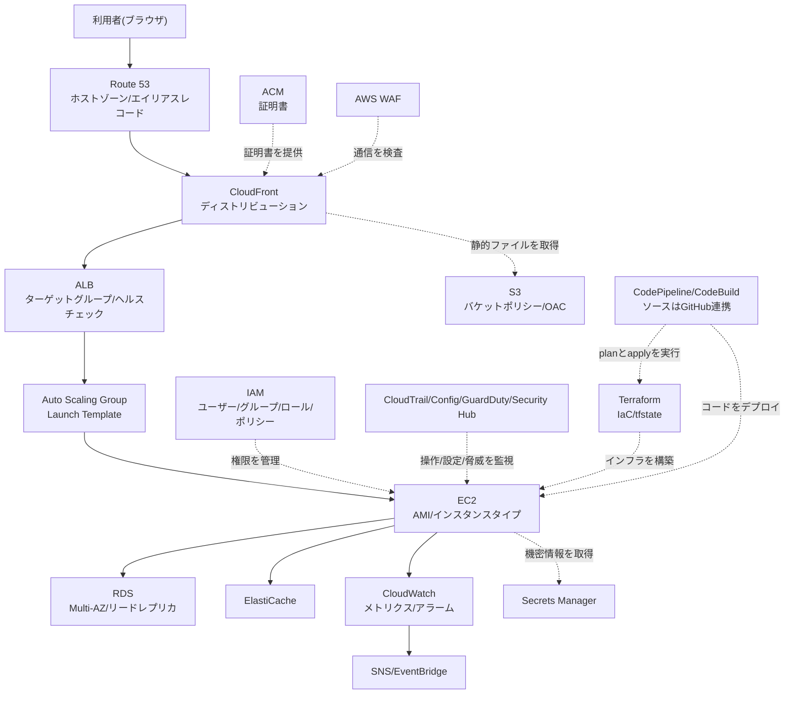

# AWS用語集(覚え方付き)

## この用語集の使い方

この用語集は、`projects/`配下にある6つの案件(レベル1〜6)に登場するAWS関連用語を1箇所にまとめた辞書です。案件のREADME(各案件の構築手順やアーキテクチャをまとめたドキュメント)を読んでいて知らない単語に出会ったら、ブラウザの検索機能(Windows/Linuxは`Ctrl+F`、Macは`Cmd+F`)でこのページ内を検索してください。各案件のREADMEからもこのページへリンクしています。

用語集は**2階建て**になっています。用途に応じて使い分けてください。

| 階層 | 中身 | こんなときに |
|---|---|---|
| **1階: このページ** | 索引(全用語をアイウエオ順・アルファベット順に一覧)、カテゴリ別のひとこと早見表、混同しやすい用語の比較、ミニハンズオン | 「この単語、なんだっけ?」を数秒で解決したいとき |
| **2階: [詳細用語集(全10章)](#詳細用語集全10章)** | 1用語あたり「正式名称/読み方/ひとことで言うと/たとえるなら/もう少し詳しく/サーバー構築での勘所/よくあるつまずき/コスト/関連用語」まで掘り下げた解説 | 意味は分かったが「なぜ必要なのか」「どこでハマるのか」まで理解したいとき、面接前に説明できるレベルまで固めたいとき |

最初から全部を暗記しようとせず、「わからなくなったら戻ってくる辞書」として使うのがおすすめです。

> 🧠 **覚え方のコツ**: 用語は「単語カードで丸暗記」よりも「**役割**で覚える」ほうが定着します。この用語集は全編を通じて、AWSを1つの建物にたとえています。**敷地(VPC)→ 建物と部屋(サブネット)→ 受付(ALB)→ 作業員(EC2)→ 書庫(RDS/S3)→ 警備員(IAM/監視系)→ 設計図(IaC)**。新しい用語に出会ったら、まず「この建物のどこの話か?」を考えてください。

## AWSサービスの全体像(このページの用語がどこに登場するか)

言葉だけを丸暗記すると忘れやすいので、まずは「典型的なWebシステムの中で、どのサービスがどの位置にいるか」を図で見てみましょう。ここに出てくる箱の名前は、すべて下の各カテゴリの表で説明しています。



> 🧠 **覚え方のコツ**: 全体の流れは「外(インターネット)→受付(DNS/CDN/ALB)→中の作業員(EC2)→書庫(RDS/S3)→警備(IAM/監視系)」という1つの建物の中の動きだとイメージすると、どのサービスがどの役割かで迷わなくなります。

## 詳細用語集(全10章)

「ひとことの意味」では足りない、**なぜ必要か・どこでハマるか・どう設計判断するか**まで踏み込んだ詳細版です。1用語につき「正式名称/読み方/重要度/ひとことで言うと/たとえるなら/もう少し詳しく/サーバー構築での勘所/よくあるつまずき/💰コスト/関連用語/登場する案件」の形式で解説しています。**全478項目**を収録しました。

| 章 | ページ | 収録 | 主な内容 | 先に読むべき人 |
|---|---|---|---|---|
| ① | [クラウドとAWSアカウントの基礎](glossary/01-cloud-basics.md) | 46語 | クラウド/オンプレミス、責任共有モデル、アカウントとルートユーザー、リージョンとAZ、ARN、料金体系、可用性・冗長化・RTO/RPO | AWSを触るのが初めての人 |
| ② | [ネットワーク](glossary/02-network.md) | 80語 | IP/CIDR/ポート/TCP/DNS/HTTPSの基礎、VPC・サブネット・ルートテーブル、セキュリティグループとNACL、ELB、Route 53、CloudFront | **全章で最重要**。サーバー構築の土台 |
| ③ | [コンピューティング](glossary/03-compute.md) | 45語 | EC2、AMI、インスタンスタイプ、キーペア、ユーザーデータ、Auto Scaling、Lambda、コンテナ(ECS/Fargate) | サーバーを立てる前に |
| ④ | [ストレージ](glossary/04-storage.md) | 39語 | オブジェクト/ブロック/ファイルの違い、S3(バケット・ストレージクラス・バージョニング・暗号化)、EBS、EFS、AWS Backup | レベル1の静的サイトの前に |
| ⑤ | [データベース](glossary/05-database.md) | 45語 | RDSの構成要素、Multi-AZとリードレプリカの違い、バックアップとPITR、Aurora、DynamoDB、ElastiCache | レベル3の3層構成の前に |
| ⑥ | [セキュリティ・ID管理](glossary/06-security-identity.md) | 63語 | IAMユーザー/グループ/ロール/ポリシー、最小権限、MFA、KMS、Secrets Manager、ACM、WAF、GuardDuty、CloudTrail、Config | 最初のIAMユーザーを作る前に |
| ⑦ | [監視・運用](glossary/07-monitoring-operations.md) | 47語 | CloudWatchのメトリクス/ログ/アラーム、SNS、EventBridge、Systems Manager(Session Manager等)、SLI/SLO、MTTR | 「作った後」を語れるようにしたい人 |
| ⑧ | [IaCとCI/CD](glossary/08-iac-cicd.md) | 61語 | IaCと冪等性、CloudFormation、Terraform(HCL・モジュール・tfstate・plan/apply)、Git、CodePipeline、デプロイ戦略 | レベル6に進む前に |
| ⑨ | [Linux・サーバー運用の基礎](glossary/09-linux-server-basics.md) | 52語 | Linux/シェル/パーミッション、systemd、SSH公開鍵認証、Apache/Nginx、ファイルシステム、調査コマンド(top/df/ss/curl/dig) | **AWSだけでなくサーバーも触れる**と示したい人 |
| ⑩ | [略語一覧と総まとめテスト](glossary/10-abbreviations-and-quiz.md) | 略語100+ | アルファベット略語早見表、まぎらわしい用語28組の対比、通しストーリー、全50問テスト、30日学習ロードマップ | 面接前の総復習に |

> 🧠 **覚え方のコツ**: 10章は「**土台 → 通り道 → 動かす → しまう → 覚える → 守る → 見張る → 自動化する → 中身を触る → 総復習**」の順に並んでいます。①〜②が土地とインフラ、③〜⑤が建物と設備、⑥〜⑦が警備と管理室、⑧〜⑨が職人の道具箱、⑩が卒業試験です。頭から順に読めば、そのままサーバー構築エンジニアの学習順序になります。

> ⚠️ **注意**: AWSの仕様・上限値・料金は改定されることがあります。実際に構築・見積もりをするときは、必ず各ページからリンクしている**AWS公式ドキュメント**で最新の情報を確認してください。

## 用語索引(全478項目)

探している用語をこの索引から引くと、詳細解説へ直接ジャンプできます。ページ内検索(`Ctrl+F` / `Cmd+F`)との併用がおすすめです。

### アルファベット・数字から始まる用語

| 用語 | ひとことで言うと | 詳しい解説 |
|---|---|---|
| **3層アーキテクチャ** | システムを「Web層(受付)・アプリケーション層(処理)・データベース層(保管)」の3つに役割分担させる、Webシステムの基本構成です | [⑨Linux基礎](glossary/09-linux-server-basics.md#3層アーキテクチャ) |
| **ACM** | HTTPS通信に使うSSL/TLS証明書を無料で発行し、期限前に自動更新してくれるサービスです | [⑥セキュリティ](glossary/06-security-identity.md#acm) |
| **ALB** | HTTP/HTTPSの中身(パスやホスト名)を見て、リクエストごとに振り分け先を変えられるロードバランサーです | [②ネットワーク](glossary/02-network.md#alb) |
| **Amazon Inspector** | EC2やコンテナイメージ、Lambda関数に既知の脆弱性がないかを自動でスキャンしてくれるサービスです | [⑥セキュリティ](glossary/06-security-identity.md#amazon-inspector) |
| **Amazon Linux** | AWSが自ら開発・保守している、EC2で使うことを前提としたLinuxディストリビューションです | [⑨Linux基礎](glossary/09-linux-server-basics.md#amazon-linux) |
| **Amazon Macie** | S3の中に個人情報などの機微なデータが置かれていないかを、自動で発見・分類してくれるサービスです | [⑥セキュリティ](glossary/06-security-identity.md#amazon-macie) |
| **AmazonSSMManagedInstanceCore** | EC2をSystems Managerの管理下に置くために必要な、最低限の権限をまとめたAWS提供のポリシーです | [⑦監視・運用](glossary/07-monitoring-operations.md#amazonssmmanagedinstancecore) |
| **AMI** | OSやインストール済みソフトウェアの初期状態をまるごと保存した、EC2起動用のひな形イメージです | [③コンピューティング](glossary/03-compute.md#ami) |
| **Apache** | 世界中で長年使われてきた、代表的なオープンソースのWebサーバーソフトです。Amazon LinuxなどRed Hat系Linuxでのサービス名・コマンド名は `httpd`(Debian/Ubuntu系では `apache2`)です | [⑨Linux基礎](glossary/09-linux-server-basics.md#apache) |
| **API** | ソフトウェア同士がやり取りするために決められた、窓口と手続きの形式のことです | [①クラウド基礎](glossary/01-cloud-basics.md#api) |
| **ARN** | AWS上のあらゆるリソースを、世界で1つに特定できる形式の識別子です | [①クラウド基礎](glossary/01-cloud-basics.md#arn) |
| **AssumeRole** | IAMロールを「引き受けて」、そのロールの権限を持つ一時的な認証情報を受け取る操作です | [⑥セキュリティ](glossary/06-security-identity.md#assumerole) |
| **Aurora** | MySQLおよびPostgreSQLと互換性を保ちながら、AWSがクラウド向けにストレージ層から作り直した高性能なデータベースです | [⑤データベース](glossary/05-database.md#aurora) |
| **Aurora Serverless** | 負荷に応じてデータベースの処理能力が自動的に増減する、Auroraの利用形態です | [⑤データベース](glossary/05-database.md#aurora-serverless) |
| **Auto Scaling Group** | EC2の台数を自動で増減させ、壊れたインスタンスを自動的に入れ替えてくれる管理の単位です | [③コンピューティング](glossary/03-compute.md#auto-scaling-group) |
| **AWS Backup** | EBSやRDSなど複数のサービスのバックアップを、1か所でまとめてスケジュール管理・保持管理できるサービスです | [④ストレージ](glossary/04-storage.md#aws-backup) |
| **AWS Budgets** | 月ごとの予算額を決めておき、実績や予測がそれを超えそうになったら通知してくれるサービスです | [①クラウド基礎](glossary/01-cloud-basics.md#aws-budgets) |
| **AWS CDK** | TypeScriptやPythonなど普通のプログラミング言語でインフラを書き、それをCloudFormationテンプレートに変換して実行する仕組みです | [⑧IaC/CI-CD](glossary/08-iac-cicd.md#aws-cdk) |
| **AWS CLI** | ターミナル(黒い画面)からコマンドを打ってAWSを操作するための公式ツールです | [①クラウド基礎](glossary/01-cloud-basics.md#aws-cli) |
| **AWS CloudShell** | ブラウザのコンソール内から起動できる、AWS CLIがあらかじめ入ったシェル(コマンドを打つ環境)です | [①クラウド基礎](glossary/01-cloud-basics.md#aws-cloudshell) |
| **AWS Config** | AWSリソースの設定状態を継続的に記録し、あらかじめ決めたルールに沿っているかを評価し続けるサービスです | [⑥セキュリティ](glossary/06-security-identity.md#aws-config) |
| **AWS Health** | AWS側で起きている障害や、これから実施される計画メンテナンスのうち、**自分のアカウントに関係するものだけ**を教えてくれる公式の通知窓口です | [⑦監視・運用](glossary/07-monitoring-operations.md#aws-health) |
| **AWS Organizations** | 複数のAWSアカウントを1つの組織としてまとめ、統制と請求を一元化するサービスです | [①クラウド基礎](glossary/01-cloud-basics.md#aws-organizations) |
| **AWS PrivateLink** | VPCとAWSサービス、あるいは他社・他アカウントのサービスを、インターネットを通らないAWS内部の経路で接続する仕組みです | [②ネットワーク](glossary/02-network.md#aws-privatelink) |
| **AWS SDK** | 自分のプログラムの中からAWSを操作するための、プログラミング言語ごとに用意された部品(ライブラリ)です | [①クラウド基礎](glossary/01-cloud-basics.md#aws-sdk) |
| **AWS Shield** | 大量の通信を浴びせてサービスを止めるDDoS攻撃から、AWSリソースを守るサービスです | [⑥セキュリティ](glossary/06-security-identity.md#aws-shield) |
| **AWS STS** | 期限付きの一時的な認証情報を発行してくれる、AWSのトークン発行所です | [⑥セキュリティ](glossary/06-security-identity.md#aws-sts) |
| **AWS WAF** | Webアプリケーションへの攻撃を、HTTP/HTTPSリクエスト単位で検知・遮断するファイアウォールです | [⑥セキュリティ](glossary/06-security-identity.md#aws-waf) |
| **AWSアカウント** | AWSを利用するための契約の単位であり、同時に請求とリソース分離の単位でもあるものです | [①クラウド基礎](glossary/01-cloud-basics.md#awsアカウント) |
| **AWSマネジメントコンソール** | ブラウザからAWSの各サービスを操作できる、公式の管理画面です | [①クラウド基礎](glossary/01-cloud-basics.md#awsマネジメントコンソール) |
| **Aレコード** | ドメイン名をIPv4アドレスに結びつける、最も基本的なDNSレコードです | [②ネットワーク](glossary/02-network.md#aレコード) |
| **base64** | 任意のデータを、英数字と一部記号だけの文字列に変換する符号化方式(およびその変換コマンド)です | [⑨Linux基礎](glossary/09-linux-server-basics.md#base64) |
| **bash** | Linuxで最も標準的に使われているシェルの実装で、対話操作にもスクリプトにも使われます | [⑨Linux基礎](glossary/09-linux-server-basics.md#bash) |
| **buildspec** | CodeBuildに「どんなコマンドを、どの順番で実行するか」を指示するYAML形式の設定ファイルです | [⑧IaC/CI-CD](glossary/08-iac-cicd.md#buildspec) |
| **CD** | テストを通った変更を、いつでも安全に本番へ届けられる状態にしておく習慣と仕組みです | [⑧IaC/CI-CD](glossary/08-iac-cicd.md#cd) |
| **CDN** | 世界中に置いた配信拠点にコンテンツのコピーを配り、利用者に最も近い拠点から届ける仕組みです | [②ネットワーク](glossary/02-network.md#cdn) |
| **chmod** | ファイルやディレクトリのパーミッション(権限)を変更するコマンドです | [⑨Linux基礎](glossary/09-linux-server-basics.md#chmod) |
| **chown** | ファイルやディレクトリの「所有者」と「所有グループ」を変更するコマンドです | [⑨Linux基礎](glossary/09-linux-server-basics.md#chown) |
| **CI** | コードを変更するたびに自動でビルド・テスト・検査を行い、壊れをできるだけ早く見つける習慣と仕組みです | [⑧IaC/CI-CD](glossary/08-iac-cicd.md#ci) |
| **CIDR** | IPアドレスの範囲を `10.0.0.0/16` のように「開始アドレス+ネットワーク部のビット数」でまとめて表す書き方です | [②ネットワーク](glossary/02-network.md#cidr) |
| **ClickOps** | AWSマネジメントコンソール(ブラウザからAWSの各サービスを操作できる管理画面)を手作業でクリックしながらインフラを作っていく運用スタイルを指す、やや皮肉を含んだ言葉です | [⑧IaC/CI-CD](glossary/08-iac-cicd.md#clickops) |
| **cloud-init** | クラウド上の仮想サーバーが初回起動するときに、ホスト名の設定・公開鍵の配置・ユーザーデータの実行といった初期設定を自動で行う仕組みです | [⑨Linux基礎](glossary/09-linux-server-basics.md#cloud-init) |
| **CloudFormation** | AWS純正のIaCサービスで、テンプレートというファイルに書いた構成を読み込んで、リソース一式をまとめて作成・更新・削除してくれます | [⑧IaC/CI-CD](glossary/08-iac-cicd.md#cloudformation) |
| **CloudFront** | 世界中のエッジロケーションからコンテンツを配信する、AWSのCDNサービスです | [②ネットワーク](glossary/02-network.md#cloudfront) |
| **CloudTrail** | 「誰が・いつ・どこから・何をしたか」というAWSへの操作をすべて記録する証跡サービスです | [⑥セキュリティ](glossary/06-security-identity.md#cloudtrail) |
| **CloudWatch** | AWSのリソースやアプリケーションから、数値(メトリクス)とログを集めて保存し、グラフにしたり、異常を検知して知らせたりしてくれる監視サービスです | [⑦監視・運用](glossary/07-monitoring-operations.md#cloudwatch) |
| **CloudWatch Logs** | サーバーやAWSサービスが出力するログを1か所に集めて保管し、検索できるようにするサービスです | [⑦監視・運用](glossary/07-monitoring-operations.md#cloudwatch-logs) |
| **CloudWatchアラーム** | 指定したメトリクスを見張り、しきい値を超えた状態が続いたら通知や自動対処を起こしてくれる見張り番です | [⑦監視・運用](glossary/07-monitoring-operations.md#cloudwatchアラーム) |
| **CloudWatchエージェント** | サーバーのOSの中にインストールして、メモリ・ディスク使用率などのメトリクスと、各種ログファイルをCloudWatchへ送り出す常駐ソフトです | [⑦監視・運用](glossary/07-monitoring-operations.md#cloudwatchエージェント) |
| **CloudWatchダッシュボード** | 見たいメトリクスのグラフやログの結果を1つの画面に並べ、システム全体の様子をひと目で見られるようにした自作の画面です | [⑦監視・運用](glossary/07-monitoring-operations.md#cloudwatchダッシュボード) |
| **CMS** | HTMLを直接書かなくても、ブラウザの管理画面から記事や画像を追加・更新できるようにするソフトウェアです | [⑨Linux基礎](glossary/09-linux-server-basics.md#cms) |
| **CNAMEレコード** | あるドメイン名の名前解決を、別のドメイン名に委ねる(別名を張る)レコードです。URLが書き換わるHTTPリダイレクトとは別物で、`example.com` のようなゾーン頂点には設定できません(そこではエイリアスレコードを使います) | [②ネットワーク](glossary/02-network.md#cnameレコード) |
| **CodeBuild** | ビルドやテストのコマンドを実行してくれる、マネージド型の使い捨て実行環境です | [⑧IaC/CI-CD](glossary/08-iac-cicd.md#codebuild) |
| **CodeCommit** | AWSが提供する、プライベートなGitリポジトリのマネージドサービスです | [⑧IaC/CI-CD](glossary/08-iac-cicd.md#codecommit) |
| **CodeConnections** | GitHubなど外部のコードリポジトリと、AWSのサービスを安全につなぐための認証済み接続機能です | [⑧IaC/CI-CD](glossary/08-iac-cicd.md#codeconnections) |
| **CodeDeploy** | EC2・オンプレミスサーバー・ECS・Lambdaに対して、アプリケーションの配布と切り替えを安全に行うサービスです | [⑧IaC/CI-CD](glossary/08-iac-cicd.md#codedeploy) |
| **CodePipeline** | ソース取得からビルド、承認、デプロイまでを自動でつなぐ、AWSのCI/CD司令塔サービスです | [⑧IaC/CI-CD](glossary/08-iac-cicd.md#codepipeline) |
| **Configルール** | 「あるべき設定」を定義し、リソースがそれを満たしているかを自動評価する判定ルールです | [⑥セキュリティ](glossary/06-security-identity.md#configルール) |
| **Cost Explorer** | 過去のAWS利用料を、サービス別・タグ別・リージョン別などのグラフで分析できるツールです | [①クラウド基礎](glossary/01-cloud-basics.md#cost-explorer) |
| **CPUUtilization** | EC2やRDSなどのCPUがどれだけ使われているかを、パーセントで表す最も基本的なメトリクスです | [⑦監視・運用](glossary/07-monitoring-operations.md#cpuutilization) |
| **cron** | 「毎日3時に」「5分おきに」といった決まったタイミングで、決まった処理を自動実行するLinuxの仕組みです | [⑨Linux基礎](glossary/09-linux-server-basics.md#cron) |
| **curl** | コマンドラインからHTTPなどの通信を送り、応答を確認できるツールです | [⑨Linux基礎](glossary/09-linux-server-basics.md#curl) |
| **DBインスタンス** | RDSにおける、データベースエンジンが動作する1台分のサーバーの単位です | [⑤データベース](glossary/05-database.md#dbインスタンス) |
| **DBインスタンスクラス** | DBインスタンスのCPU数・メモリ量・ネットワーク性能を決める、`db.t3.micro` のような型番です | [⑤データベース](glossary/05-database.md#dbインスタンスクラス) |
| **DBエンドポイント** | アプリケーションがデータベースに接続するときに指定する、接続先のホスト名(住所)です | [⑤データベース](glossary/05-database.md#dbエンドポイント) |
| **DBサブネットグループ** | RDSを配置してよいサブネットを、複数のAZ分まとめて登録しておく設定のかたまりです | [⑤データベース](glossary/05-database.md#dbサブネットグループ) |
| **DBスナップショット** | 任意のタイミングで手動取得する、明示的に削除するまで消えないRDSのバックアップです | [⑤データベース](glossary/05-database.md#dbスナップショット) |
| **df** | ファイルシステムごとの容量と空きを一覧表示するコマンドです | [⑨Linux基礎](glossary/09-linux-server-basics.md#df) |
| **dig** | ドメイン名からIPアドレスを引く名前解決(DNS)の結果を、コマンドで確認するツールです | [⑨Linux基礎](glossary/09-linux-server-basics.md#dig) |
| **dnf** | Amazon Linux 2023 などのRed Hat系ディストリビューションで使う、標準のパッケージマネージャコマンドです | [⑨Linux基礎](glossary/09-linux-server-basics.md#dnf) |
| **DNS** | `example.com` のような人間が読める名前を、通信に必要なIPアドレスへ変換する仕組みです | [②ネットワーク](glossary/02-network.md#dns) |
| **DNSホスト名** | VPCの中でホスト名による名前解決を使えるようにするための、VPC単位の設定項目です | [②ネットワーク](glossary/02-network.md#dnsホスト名) |
| **DNS伝播** | DNSの設定変更が、世界中のキャッシュに行き渡るまでにかかる時間のことです | [②ネットワーク](glossary/02-network.md#dns伝播) |
| **DNS検証** | 指定されたDNSレコードを自分のドメインに追加することで、「このドメインの持ち主は自分です」と証明する方法です | [⑥セキュリティ](glossary/06-security-identity.md#dns検証) |
| **Docker** | コンテナを作り、動かし、配布するための代表的なツール(およびその周辺の技術)です | [③コンピューティング](glossary/03-compute.md#docker) |
| **DynamoDB** | サーバーの管理が一切不要で、データ量が増えても応答速度が変わりにくい、AWSのフルマネージドなNoSQLデータベースです | [⑤データベース](glossary/05-database.md#dynamodb) |
| **DynamoDB Streams** | DynamoDBテーブルへの追加・更新・削除を時系列の記録として流し、それをきっかけに別の処理を起動できる機能です | [⑤データベース](glossary/05-database.md#dynamodb-streams) |
| **EBS** | EC2インスタンスに取り付けて使う、ネットワーク接続型の仮想ハードディスクです | [④ストレージ](glossary/04-storage.md#ebs) |
| **EBSスナップショット** | ある時点のEBSボリュームの中身を丸ごと保存した、S3上に保管されるバックアップです | [④ストレージ](glossary/04-storage.md#ebsスナップショット) |
| **EC2** | AWS上で、必要なときに必要な台数だけ借りられる仮想サーバーです | [③コンピューティング](glossary/03-compute.md#ec2) |
| **EC2 Image Builder** | AMIやコンテナイメージの作成・テスト・配布を、パイプラインとして自動化できるマネージドサービスです | [③コンピューティング](glossary/03-compute.md#ec2-image-builder) |
| **EC2 Instance Connect** | 秘密鍵ファイルを手元に持っていなくても、ブラウザやCLIから一時的な鍵でEC2にSSH接続できるAWSの機能です | [③コンピューティング](glossary/03-compute.md#ec2-instance-connect) |
| **ec2-user** | Amazon LinuxのEC2に最初から用意されている、SSHでログインするための既定の作業用ユーザーです | [⑨Linux基礎](glossary/09-linux-server-basics.md#ec2-user) |
| **ECR** | AWS上でコンテナイメージを保管する、プライベートな置き場(レジストリ)です | [③コンピューティング](glossary/03-compute.md#ecr) |
| **ECS** | 複数のコンテナを「どこで・何個・どう動かすか」を管理する、AWS独自のコンテナ管理サービスです | [③コンピューティング](glossary/03-compute.md#ecs) |
| **EFS** | 複数のEC2から同時にマウントして使える、Linux向けのマネージド型共有ファイルストレージです | [④ストレージ](glossary/04-storage.md#efs) |
| **EKS** | 業界標準のコンテナ管理基盤であるKubernetesを、AWSがマネージドで提供するサービスです | [③コンピューティング](glossary/03-compute.md#eks) |
| **Elastic Beanstalk** | アプリケーションのコードをアップロードするだけで、EC2・ALB・Auto Scalingなどの実行環境一式を自動で用意してくれるサービスです | [③コンピューティング](glossary/03-compute.md#elastic-beanstalk) |
| **Elastic IP** | 取得しておいて好きなリソースに付け替えられる、固定のパブリックIPv4アドレスです | [②ネットワーク](glossary/02-network.md#elastic-ip) |
| **ElastiCache** | よく使うデータをメモリ上に保持して即座に返す、AWSのマネージドなインメモリデータストアサービスです | [⑤データベース](glossary/05-database.md#elasticache) |
| **ELB** | AWSが提供するマネージド型ロードバランサーの総称です | [②ネットワーク](glossary/02-network.md#elb) |
| **ENI** | EC2などに取り付ける、仮想的なネットワークカード(LANポート)です | [②ネットワーク](glossary/02-network.md#eni) |
| **EstimatedCharges** | 当月これまでに発生した**推定請求額**を表す、請求監視のための特別なメトリクスです | [⑦監視・運用](glossary/07-monitoring-operations.md#estimatedcharges) |
| **EventBridge** | AWS内外で起きた「出来事(イベント)」を受け取り、条件に一致したものを別のサービスへ受け渡してくれる、イベントの中継所です | [⑦監視・運用](glossary/07-monitoring-operations.md#eventbridge) |
| **EventBridgeルール** | 「どのイベントを拾って、どこへ渡すか」を1本ぶん定義した配線です | [⑦監視・運用](glossary/07-monitoring-operations.md#eventbridgeルール) |
| **Fargate** | コンテナを動かすためのサーバー(EC2)を一切管理せずに、コンテナだけを動かせる実行基盤です | [③コンピューティング](glossary/03-compute.md#fargate) |
| **Finding** | GuardDutyなどのセキュリティサービスが「これは怪しい」と判断して出力する、検知結果1件のことです | [⑥セキュリティ](glossary/06-security-identity.md#finding) |
| **force-unlock** | 異常終了などで残ってしまった状態ファイルのロックを、手動で強制的に解除する操作です | [⑧IaC/CI-CD](glossary/08-iac-cicd.md#force-unlock) |
| **FreeStorageSpace** | RDSのDBインスタンスに残っているストレージの空き容量を、**バイト単位**で表すメトリクスです | [⑦監視・運用](glossary/07-monitoring-operations.md#freestoragespace) |
| **FSx** | Windows向けや高性能計算向けなど、特定の用途・ファイルシステムに特化した共有ファイルストレージのサービス群です | [④ストレージ](glossary/04-storage.md#fsx) |
| **Git** | ファイルの変更履歴を記録・共有し、複数人での並行作業を可能にする、事実上の標準となっているバージョン管理システムです | [⑧IaC/CI-CD](glossary/08-iac-cicd.md#git) |
| **GitHub Actions** | GitHubのリポジトリ上で、pushやプルリクエストをきっかけにワークフローを自動実行できるCI/CDの仕組みです | [⑧IaC/CI-CD](glossary/08-iac-cicd.md#github-actions) |
| **gp3** | 現在の汎用用途における標準的な選択肢となる、SSDタイプのEBSボリュームです | [④ストレージ](glossary/04-storage.md#gp3) |
| **GuardDuty** | AWS内の各種ログを機械的に分析し、不審な挙動や乗っ取りの兆候を自動検知する脅威検知サービスです | [⑥セキュリティ](glossary/06-security-identity.md#guardduty) |
| **GUI** | 画面上のボタンやメニューを見ながら、マウスやタップで操作する方式のことです | [①クラウド基礎](glossary/01-cloud-basics.md#gui) |
| **HCL** | Terraformの設定を書くための専用記法です | [⑧IaC/CI-CD](glossary/08-iac-cicd.md#hcl) |
| **HTTP** | ブラウザとWebサーバーがWebページをやり取りするための約束事で、既定では80番ポートを使います | [②ネットワーク](glossary/02-network.md#http) |
| **HTTPCode_Target_5XX_Count** | ALBの背後にいるサーバー(ターゲット)が返した、500番台のサーバーエラーの件数を数えるメトリクスです | [⑦監視・運用](glossary/07-monitoring-operations.md#httpcode_target_5xx_count) |
| **HTTPS** | HTTPの通信をTLSで暗号化した、盗み見・改ざんに強い通信方式です。既定では443番ポートを使います | [②ネットワーク](glossary/02-network.md#https) |
| **HTTPステータスコード** | リクエストの結果をサーバーが3桁の数字で返す、共通の返答コードです | [②ネットワーク](glossary/02-network.md#httpステータスコード) |
| **IaaS** | サーバー・ストレージ・ネットワークといった「インフラの素材」だけを借り、OSから上は自分で面倒を見る利用形態です | [①クラウド基礎](glossary/01-cloud-basics.md#iaas) |
| **IaC** | サーバーやネットワークの構成を「手順書」ではなく「コード」として書き、実行することで同じ環境を何度でも再現できるようにする考え方です | [⑧IaC/CI-CD](glossary/08-iac-cicd.md#iac) |
| **IAM** | AWSの「誰が・何に対して・何をしてよいか」を一元管理する、認証と認可の仕組みです | [⑥セキュリティ](glossary/06-security-identity.md#iam) |
| **IAM Access Analyzer** | 「意図せず外部に公開されている権限」や「使われていない過剰な権限」を洗い出してくれるIAMの分析機能です | [⑥セキュリティ](glossary/06-security-identity.md#iam-access-analyzer) |
| **IAM Identity Center** | 複数のAWSアカウントへのログインと権限付与を、1か所で一元管理する仕組みです | [⑥セキュリティ](glossary/06-security-identity.md#iam-identity-center) |
| **IAMグループ** | 同じ権限を与えたいIAMユーザーをまとめておく入れ物です | [⑥セキュリティ](glossary/06-security-identity.md#iamグループ) |
| **IAMポリシー** | 「誰が」「何に対して」「どの操作を」許可または拒否するかを書いた、JSON形式のルール文書です | [⑥セキュリティ](glossary/06-security-identity.md#iamポリシー) |
| **IAMユーザー** | 人やシステムに対して発行する、パスワードやアクセスキーを持つ恒久的なAWSの身分証です | [⑥セキュリティ](glossary/06-security-identity.md#iamユーザー) |
| **IAMロール** | AWSサービスや別のアカウントの利用者が、一時的に「引き受けて」使う、期限付きの身分証です | [⑥セキュリティ](glossary/06-security-identity.md#iamロール) |
| **IMDSv2** | メタデータを取得する前に必ずトークンの取得を求める、より安全なインスタンスメタデータの利用方式です | [③コンピューティング](glossary/03-compute.md#imdsv2) |
| **IOPS** | ストレージが1秒あたりに処理できる読み書き操作の回数です | [④ストレージ](glossary/04-storage.md#iops) |
| **IPアドレス** | ネットワークにつながった機器を一意に識別するための「住所」にあたる番号です | [②ネットワーク](glossary/02-network.md#ipアドレス) |
| **journalctl** | systemdが収集したログを、サービス単位・時間単位で検索・表示するためのコマンドです | [⑨Linux基礎](glossary/09-linux-server-basics.md#journalctl) |
| **jq** | JSON(構造化されたデータを表す代表的なテキスト形式)を整形したり、必要な値だけを抜き出したりできるコマンドラインツールです | [⑨Linux基礎](glossary/09-linux-server-basics.md#jq) |
| **JSON** | 波かっこ `{}` と角かっこ `[]` を使って、データの構造をテキストで表す代表的な形式です | [⑧IaC/CI-CD](glossary/08-iac-cicd.md#json) |
| **KMS** | 暗号化に使う鍵を作成・保管し、「誰がその鍵を使ってよいか」までまとめて管理するマネージドな鍵管理サービスです | [⑥セキュリティ](glossary/06-security-identity.md#kms) |
| **Lambda** | サーバーを一切用意せず、書いたコードをアップロードするだけで実行できるサービスです | [③コンピューティング](glossary/03-compute.md#lambda) |
| **LCU** | ALBの利用量を測るための単位で、時間課金とは別に処理量に応じて課金される部分の指標です | [②ネットワーク](glossary/02-network.md#lcu) |
| **Lightsail** | サーバー・ストレージ・データ転送をセットにして、月額固定価格で使える簡易版のサーバーサービスです | [③コンピューティング](glossary/03-compute.md#lightsail) |
| **Linux** | サーバー用途で最も広く使われている、無償で使えるOS(オペレーティングシステム。ハードウェアとアプリの橋渡しをする基本ソフト)です | [⑨Linux基礎](glossary/09-linux-server-basics.md#linux) |
| **Logs Insights** | CloudWatch Logsに集めたログを、専用のクエリ言語で絞り込み・集計・並べ替えできる検索機能です | [⑦監視・運用](glossary/07-monitoring-operations.md#logs-insights) |
| **Memcached** | 単純なキーと値の組だけを保存する、軽量で並列処理に強いインメモリキャッシュです | [⑤データベース](glossary/05-database.md#memcached) |
| **MFA** | パスワードに加えて、認証アプリの数字などでもう1段階本人確認を行う仕組みです | [⑥セキュリティ](glossary/06-security-identity.md#mfa) |
| **MTTR** | 障害が起きてから復旧するまでにかかった時間の平均で、「どれだけ早く直せるチームか」を表す指標です | [⑦監視・運用](glossary/07-monitoring-operations.md#mttr) |
| **Multi-AZ** | 別のAZに待機系のデータベースを持ち、障害時に自動で切り替えることで停止時間を最小化する高可用性構成です | [⑤データベース](glossary/05-database.md#multi-az) |
| **MySQL** | 世界で最も広く使われているオープンソース(ソースコードが公開され、無償で利用できる)のリレーショナルデータベース管理システムの1つです | [⑤データベース](glossary/05-database.md#mysql) |
| **NAT** | プライベートIPアドレスを外向けのパブリックIPアドレスに書き換えて、内部の機器がインターネットと通信できるようにする仕組みです | [②ネットワーク](glossary/02-network.md#nat) |
| **NATゲートウェイ** | プライベートサブネットのリソースが、インターネットへ「行きだけ」通信できるようにするAWSマネージドの出口です | [②ネットワーク](glossary/02-network.md#natゲートウェイ) |
| **Nginx** | 少ないメモリで大量の同時接続をさばくことを得意とする、Apacheと並ぶ代表的なWebサーバーソフトです | [⑨Linux基礎](glossary/09-linux-server-basics.md#nginx) |
| **Nitro System** | 現行世代のEC2を支えている、AWSが自社開発した仮想化の基盤です | [③コンピューティング](glossary/03-compute.md#nitro-system) |
| **NLB** | TCPやUDPをそのまま超高速に転送する、L4(トランスポート層)のロードバランサーです | [②ネットワーク](glossary/02-network.md#nlb) |
| **NoSQL** | 表形式とSQLにこだわらず、拡張性・速度・柔軟なデータ構造を優先したデータベースの総称です | [⑤データベース](glossary/05-database.md#nosql) |
| **NTP** | ネットワーク越しに正確な時刻を取得して、サーバーの時計のずれを自動的に補正する仕組みです | [⑨Linux基礎](glossary/09-linux-server-basics.md#ntp) |
| **OAC** | S3バケットを非公開のまま、CloudFront経由のアクセスだけを許可する現行の仕組みです | [②ネットワーク](glossary/02-network.md#oac) |
| **OAI** | OACの前身にあたる、CloudFront専用のS3アクセス許可の旧方式です | [②ネットワーク](glossary/02-network.md#oai) |
| **OIDC** | 外部のCIサービスなどが、長期のアクセスキーを持たずに、その場限りの一時認証情報でAWSを操作できるようにする連携方式です | [⑧IaC/CI-CD](glossary/08-iac-cicd.md#oidc) |
| **PaaS** | OSやミドルウェアまで整った「土台」を借り、利用者はアプリやデータだけを載せる利用形態です | [①クラウド基礎](glossary/01-cloud-basics.md#paas) |
| **Parameter Store** | 設定値や機密情報を、フォルダのような階層パスで整理して保管できるSystems Managerの機能です | [⑥セキュリティ](glossary/06-security-identity.md#parameter-store) |
| **Patch Manager** | OSやミドルウェアの更新プログラム(パッチ)の適用を、決めたルールとスケジュールに沿って自動で回す機能です | [⑦監視・運用](glossary/07-monitoring-operations.md#patch-manager) |
| **PHP** | Webページを動的に生成する用途で広く使われている、サーバー側で動くプログラミング言語です | [⑨Linux基礎](glossary/09-linux-server-basics.md#php) |
| **PHP-FPM** | PHPの実行を専用の常駐プロセス群にまかせ、Webサーバーからの依頼をそこで処理させる仕組みです | [⑨Linux基礎](glossary/09-linux-server-basics.md#php-fpm) |
| **Policy Simulator** | 実際にAPIを呼び出さずに、「この人はこの操作をできるか」を事前に判定できるIAMの検証ツールです | [⑥セキュリティ](glossary/06-security-identity.md#policy-simulator) |
| **PostgreSQL** | SQL標準への準拠度と機能の豊富さで評価が高い、オープンソースのリレーショナルデータベース管理システムです | [⑤データベース](glossary/05-database.md#postgresql) |
| **RDS** | MySQLやPostgreSQLといったリレーショナルデータベースを、AWSが運用・保守を代行するかたちで提供してくれるマネージドサービスです | [⑤データベース](glossary/05-database.md#rds) |
| **Redis** | 文字列だけでなくリストやハッシュなど多様なデータ構造を扱え、永続化やレプリケーションにも対応した高機能なインメモリデータストアです | [⑤データベース](glossary/05-database.md#redis) |
| **Redshift** | 大量のデータをまとめて集計・分析することに特化した、AWSのデータウェアハウス(分析専用のデータ置き場)サービスです | [⑤データベース](glossary/05-database.md#redshift) |
| **REST APIエンドポイント** | S3バケットに対する標準のアクセス用アドレスで、`バケット名.s3.リージョン.amazonaws.com` という形式のURLです | [④ストレージ](glossary/04-storage.md#rest-apiエンドポイント) |
| **rootユーザー** | Linuxのサーバー内部で、あらゆるファイル操作・設定変更ができる最上位の管理者アカウントです | [⑨Linux基礎](glossary/09-linux-server-basics.md#rootユーザー) |
| **Route 53** | AWSが提供するDNSサービスで、ドメイン名の登録から名前解決、ヘルスチェックまでを担当します | [②ネットワーク](glossary/02-network.md#route-53) |
| **RPO** | 障害が起きたときに、失っても許容できるデータの量(時間の幅)の目標値です | [①クラウド基礎](glossary/01-cloud-basics.md#rpo) |
| **RTO** | 障害が発生してから、サービスを復旧させるまでに許容できる時間の目標値です | [①クラウド基礎](glossary/01-cloud-basics.md#rto) |
| **Run Command** | 多数のサーバーに対して、同じコマンドやスクリプトを一斉に実行させる機能です | [⑦監視・運用](glossary/07-monitoring-operations.md#run-command) |
| **S3** | 容量をほぼ意識せずファイルを預けられる、AWSの代表的なオブジェクトストレージサービスです | [④ストレージ](glossary/04-storage.md#s3) |
| **S3 Glacier** | 滅多に取り出さないデータを、非常に安い単価で長期保管するためのS3のアーカイブ用ストレージクラス群です | [④ストレージ](glossary/04-storage.md#s3-glacier) |
| **S3イベント通知** | オブジェクトのアップロードや削除をきっかけに、他のAWSサービスへ自動で知らせる機能です | [④ストレージ](glossary/04-storage.md#s3イベント通知) |
| **SaaS** | 完成したソフトウェアを、インターネット越しにサービスとして使う利用形態です | [①クラウド基礎](glossary/01-cloud-basics.md#saas) |
| **Savings Plans** | 「1時間あたり◯ドルは必ず使います」と1年または3年コミットすることで、割引を受けられる仕組みです | [①クラウド基礎](glossary/01-cloud-basics.md#savings-plans) |
| **scp** | SSHの安全な通り道を使って、手元のPCとサーバーの間でファイルをコピーするコマンドです | [⑨Linux基礎](glossary/09-linux-server-basics.md#scp) |
| **Secrets Manager** | DBのパスワードやAPIキーなどの機密情報を暗号化して保管し、自動ローテーション(定期的な入れ替え)まで面倒を見てくれるサービスです | [⑥セキュリティ](glossary/06-security-identity.md#secrets-manager) |
| **Security Hub** | 複数のセキュリティサービスの検知結果を1画面に集約し、業界標準のベンチマークとの適合状況もまとめて確認できるダッシュボードです | [⑥セキュリティ](glossary/06-security-identity.md#security-hub) |
| **SELinux** | 通常のパーミッションとは別に、「どのプロセスがどのファイル・ポートを使ってよいか」をラベルで強制的に制限するLinuxのセキュリティ機能です | [⑨Linux基礎](glossary/09-linux-server-basics.md#selinux) |
| **Session Manager** | キーペアも22番ポートの開放もなしに、ブラウザやCLIからサーバーの中へ入れる接続機能です | [⑦監視・運用](glossary/07-monitoring-operations.md#session-manager) |
| **severity** | 検知結果がどれくらい深刻かを数値で表した指標です | [⑥セキュリティ](glossary/06-security-identity.md#severity) |
| **shellcheck** | シェルスクリプトを解析して、バグにつながる書き方を指摘してくれる静的解析ツールです | [⑧IaC/CI-CD](glossary/08-iac-cicd.md#shellcheck) |
| **SigV4** | AWSへのリクエストが「本物の権限を持つ相手から、改ざんされずに届いたか」を確認するための電子署名の方式です | [⑥セキュリティ](glossary/06-security-identity.md#sigv4) |
| **SLA** | AWSがサービスごとに公開している、稼働率についての約束(サービスレベル契約)のことです | [①クラウド基礎](glossary/01-cloud-basics.md#sla) |
| **SLI** | 「このサービスの品質を測るなら、この数字を見る」と決めた具体的な指標です | [⑦監視・運用](glossary/07-monitoring-operations.md#sli) |
| **SLO** | 選んだSLIを「どの水準まで満たすか」という、自分たちで決める目標値です | [⑦監視・運用](glossary/07-monitoring-operations.md#slo) |
| **SNS** | 1回メッセージを投げ込むだけで、登録されている複数の宛先(メール、SMS、Lambda、SQSなど)へ同時に配信してくれる通知サービスです | [⑦監視・運用](glossary/07-monitoring-operations.md#sns) |
| **SQL** | リレーショナルデータベースに対して「取り出す・入れる・書き換える・消す」を指示するための、標準化された問い合わせ言語です | [⑤データベース](glossary/05-database.md#sql) |
| **SQLインジェクション** | 入力欄やURLに悪意あるSQL文(データベースを操作する命令)を混入させ、データベースを不正に読み書きさせる攻撃です | [⑥セキュリティ](glossary/06-security-identity.md#sqlインジェクション) |
| **SQS** | 処理してほしい仕事を「待ち行列(キュー)」に貯めておき、受け取る側が自分のペースで取り出して処理できるようにするサービスです | [⑦監視・運用](glossary/07-monitoring-operations.md#sqs) |
| **ss** | どのポートで何のプロセスが待ち受けているか、どんな接続が確立しているかを一覧表示するコマンドです | [⑨Linux基礎](glossary/09-linux-server-basics.md#ss) |
| **SSE-KMS** | KMS(AWSの鍵管理サービス)で管理する鍵を使ってS3のオブジェクトを暗号化する方式です | [④ストレージ](glossary/04-storage.md#sse-kms) |
| **SSE-S3** | S3が自分で管理する鍵を使って、保存されるオブジェクトを自動的に暗号化する方式です | [④ストレージ](glossary/04-storage.md#sse-s3) |
| **sshd** | サーバー側で常駐し、SSHの接続要求を待ち受けているデーモンです | [⑨Linux基礎](glossary/09-linux-server-basics.md#sshd) |
| **SSHプロトコル** | 手元のパソコンから離れたサーバーへ、暗号化された経路でログインしてコマンド操作するための通信方式です。既定では22番ポートを使います | [②ネットワーク](glossary/02-network.md#sshプロトコル) |
| **SSH公開鍵認証** | パスワードの代わりに「秘密鍵と公開鍵のペア」で本人確認を行う、SSHの標準的なログイン方式です | [⑨Linux基礎](glossary/09-linux-server-basics.md#ssh公開鍵認証) |
| **State Manager** | 「サーバーは常にこの状態であってほしい」という定義を登録し、定期的にチェックしてズレていたら直し続ける機能です | [⑦監視・運用](glossary/07-monitoring-operations.md#state-manager) |
| **Storage Gateway** | オンプレミス(自社の建物内に自前でサーバー機器を設置して運用する方式)の環境から、AWSのストレージをローカルのディスクや共有フォルダのように使えるようにする橋渡しの仕組みです | [④ストレージ](glossary/04-storage.md#storage-gateway) |
| **sudo** | 一般ユーザーのまま、そのコマンドの実行時だけ管理者(root)権限を借りるための仕組みです | [⑨Linux基礎](glossary/09-linux-server-basics.md#sudo) |
| **syslog** | OSやミドルウェアが出すログを、重要度と種別を付けて1か所に集約する、古くからあるログの仕組みです | [⑨Linux基礎](glossary/09-linux-server-basics.md#syslog) |
| **systemctl** | systemdに対して「起動して」「止めて」「自動起動にして」「今どうなっている?」と指示・確認するためのコマンドです | [⑨Linux基礎](glossary/09-linux-server-basics.md#systemctl) |
| **systemd** | OSの起動時にどのサービスをどの順番で立ち上げるかを管理し、常駐サービスの面倒を見続ける、現在のLinuxの標準的な仕組みです | [⑨Linux基礎](glossary/09-linux-server-basics.md#systemd) |
| **Systems Manager** | サーバーへの接続・コマンド実行・パッチ適用・設定値の保管といった「運用作業」を、AWSのコンソールやAPIからまとめて行えるようにするツール群です | [⑦監視・運用](glossary/07-monitoring-operations.md#systems-manager) |
| **TCP** | 相手と接続を確立し、届かなかったデータを再送してでも確実に届けることを重視した通信の約束事です | [②ネットワーク](glossary/02-network.md#tcp) |
| **Terraform** | HashiCorp社が開発している、AWSを含む多くのクラウドを同じ書き方で構築できるIaCツールです | [⑧IaC/CI-CD](glossary/08-iac-cicd.md#terraform) |
| **terraform apply** | planで確認した差分を、実際のAWS環境へ反映するコマンドです | [⑧IaC/CI-CD](glossary/08-iac-cicd.md#terraform-apply) |
| **terraform destroy** | そのTerraform構成が管理しているリソースを、まとめて削除するコマンドです | [⑧IaC/CI-CD](glossary/08-iac-cicd.md#terraform-destroy) |
| **terraform fmt** | HCLファイルのインデントや `=` の位置を、公式の標準スタイルに自動で整形するコマンドです | [⑧IaC/CI-CD](glossary/08-iac-cicd.md#terraform-fmt) |
| **terraform init** | 作業ディレクトリを初期化し、必要なプロバイダやモジュールを取り寄せて、状態ファイルの保存先に接続するコマンドです | [⑧IaC/CI-CD](glossary/08-iac-cicd.md#terraform-init) |
| **terraform plan** | 実際に反映する前に「何が追加・変更・削除されるか」を一覧で見せてくれるコマンドです | [⑧IaC/CI-CD](glossary/08-iac-cicd.md#terraform-plan) |
| **Terraform Registry** | プロバイダと、世界中で公開されている再利用可能なモジュールが集まっている公式カタログサイトです | [⑧IaC/CI-CD](glossary/08-iac-cicd.md#terraform-registry) |
| **terraform validate** | 書いたHCLに構文エラーや設定の食い違いがないかを、AWSに接続せずに確認するコマンドです | [⑧IaC/CI-CD](glossary/08-iac-cicd.md#terraform-validate) |
| **Terraform Workspace** | 同じコードのまま、状態ファイル(tfstate)だけを複数に切り替えて使える機能です | [⑧IaC/CI-CD](glossary/08-iac-cicd.md#terraform-workspace) |
| **tfsec** | Terraformのコードを適用する前にスキャンして、セキュリティ上まずい設定を指摘してくれる静的解析ツールです | [⑧IaC/CI-CD](glossary/08-iac-cicd.md#tfsec) |
| **tfstate** | Terraformが「いま何をどこまで作ったか」を記録している状態ファイルです | [⑧IaC/CI-CD](glossary/08-iac-cicd.md#tfstate) |
| **tfvars** | 変数の値をまとめて書いておくファイル(`terraform.tfvars` など)です | [⑧IaC/CI-CD](glossary/08-iac-cicd.md#tfvars) |
| **TLS** | 通信を暗号化し、通信相手が本物であることを証明書で確認する仕組みです | [②ネットワーク](glossary/02-network.md#tls) |
| **top** | CPU・メモリの使用状況と、負荷の高いプロセスの一覧を、リアルタイムに表示するコマンドです | [⑨Linux基礎](glossary/09-linux-server-basics.md#top) |
| **Transit Gateway** | 多数のVPCやオンプレミス拠点を1か所に集約して相互接続する、中継用のハブです | [②ネットワーク](glossary/02-network.md#transit-gateway) |
| **Trusted Advisor** | 自分のAWSアカウントを、AWSがベストプラクティスに照らして自動点検し、「ここが危ない」「ここは無駄遣いです」と指摘してくれる仕組みです | [⑦監視・運用](glossary/07-monitoring-operations.md#trusted-advisor) |
| **TTL** | DNSの答えを「何秒間キャッシュしてよいか」を指定する有効期限です | [②ネットワーク](glossary/02-network.md#ttl) |
| **UDP** | 到達確認をせず、とにかく速く送ることを優先した通信の約束事です | [②ネットワーク](glossary/02-network.md#udp) |
| **UTC** | 世界共通の基準となる時刻で、AWSの各種サービスやEC2の既定の時刻はこれに従います | [⑨Linux基礎](glossary/09-linux-server-basics.md#utc) |
| **vCPU** | そのインスタンスに割り当てられている、仮想的なCPUの個数です | [③コンピューティング](glossary/03-compute.md#vcpu) |
| **Viewer Protocol Policy** | 閲覧者(ブラウザ)とCloudFrontの間で、HTTPとHTTPSをどう扱うかを決める設定です | [②ネットワーク](glossary/02-network.md#viewer-protocol-policy) |
| **VPC** | AWS上に自分専用に区切って作る、仮想的なネットワークです | [②ネットワーク](glossary/02-network.md#vpc) |
| **VPCエンドポイント** | インターネットを経由せずに、VPCの中から直接AWSのサービスへ接続するための入り口です | [②ネットワーク](glossary/02-network.md#vpcエンドポイント) |
| **VPCピアリング** | 2つのVPCを1対1で相互接続し、プライベートIPで通信できるようにする仕組みです | [②ネットワーク](glossary/02-network.md#vpcピアリング) |
| **VPCフローログ** | VPC内のネットワークインターフェイスを出入りした通信の記録(送信元・宛先・ポート・許可/拒否など)を残す機能です | [②ネットワーク](glossary/02-network.md#vpcフローログ) |
| **Web ACL** | WAFのルールをまとめ、保護したいリソースに関連付けるための単位です | [⑥セキュリティ](glossary/06-security-identity.md#web-acl) |
| **Webhook** | 何かのイベントが起きたときに、あらかじめ登録しておいたURLへ自動的にHTTPリクエストを送って知らせる仕組みです | [⑧IaC/CI-CD](glossary/08-iac-cicd.md#webhook) |
| **Webサーバー** | ブラウザからのHTTPリクエストを受け取り、HTMLや画像などを返すソフトウェア(またはその役割を担うサーバー)です | [⑨Linux基礎](glossary/09-linux-server-basics.md#webサーバー) |
| **Well-Architected Framework** | AWSがまとめた「良い設計とは何か」を判断するための、観点別のベストプラクティス集です | [①クラウド基礎](glossary/01-cloud-basics.md#well-architected-framework) |
| **WordPress** | PHPとMySQLで動く、世界中で広く使われている代表的なCMS(ブラウザからサイトを更新できるソフト)です | [⑨Linux基礎](glossary/09-linux-server-basics.md#wordpress) |
| **X-Ray** | 1件のリクエストがどのサービスを通り、どこで何ミリ秒かかったのかを追跡して、遅い箇所や失敗した箇所を可視化する分散トレーシングのサービスです | [⑦監視・運用](glossary/07-monitoring-operations.md#x-ray) |
| **XSS** | Webページに悪意あるスクリプトを埋め込み、それを閲覧した利用者のブラウザ上で実行させる攻撃です | [⑥セキュリティ](glossary/06-security-identity.md#xss) |
| **YAML** | インデント(行頭の字下げ)で階層を表現する、人が読み書きしやすい設定ファイル形式です | [⑧IaC/CI-CD](glossary/08-iac-cicd.md#yaml) |

### ア行から始まる用語

| 用語 | ひとことで言うと | 詳しい解説 |
|---|---|---|
| **アウトバウンド** | 自分側から外部へ出ていく方向の通信のことです | [②ネットワーク](glossary/02-network.md#アウトバウンド) |
| **アカウントID** | AWSアカウントを一意に識別する12桁の数字です | [①クラウド基礎](glossary/01-cloud-basics.md#アカウントid) |
| **アクセスキー** | CLIやプログラムからAWSを操作するための、IDとシークレットの2点セットになった長期の認証情報です | [⑥セキュリティ](glossary/06-security-identity.md#アクセスキー) |
| **アベイラビリティゾーン** | 1つのリージョンの中にある、電源・空調・ネットワークが独立した1つ以上のデータセンターのまとまりです | [①クラウド基礎](glossary/01-cloud-basics.md#アベイラビリティゾーン) |
| **アーティファクト** | パイプラインの各ステージが生み出し、次のステージへ受け渡す成果物ファイルのことです | [⑧IaC/CI-CD](glossary/08-iac-cicd.md#アーティファクト) |
| **イベントバス** | イベントが流れ込んでくる共有のレールで、ルールはこのレールの上を流れるイベントを見張ります | [⑦監視・運用](glossary/07-monitoring-operations.md#イベントバス) |
| **イベントパターン** | 拾いたいイベントの条件を、JSONで書いたフィルターです | [⑦監視・運用](glossary/07-monitoring-operations.md#イベントパターン) |
| **イベント駆動** | 「何かが起きたら、それをきっかけに処理が動く」という組み立て方です | [③コンピューティング](glossary/03-compute.md#イベント駆動) |
| **インシデント対応** | セキュリティ上の異常事態が起きたときに、検知から封じ込め・調査・復旧・再発防止までを進める一連の対応です | [⑥セキュリティ](glossary/06-security-identity.md#インシデント対応) |
| **インスタンスストア** | 物理ホストに直接つながった、インスタンスを止めると中身が消える一時的なディスクです | [③コンピューティング](glossary/03-compute.md#インスタンスストア) |
| **インスタンスタイプ** | CPU・メモリ・ネットワーク性能など、EC2 1台あたりの大きさを表す規格の名前です(例: `t3.micro`) | [③コンピューティング](glossary/03-compute.md#インスタンスタイプ) |
| **インスタンスのライフサイクル** | EC2が「保留中 → 実行中 → 停止 → 終了」と移り変わっていく状態の流れのことです | [③コンピューティング](glossary/03-compute.md#インスタンスのライフサイクル) |
| **インスタンスファミリー** | 「汎用」「メモリ重視」「CPU重視」といった用途別に分かれた、インスタンスタイプの系統です | [③コンピューティング](glossary/03-compute.md#インスタンスファミリー) |
| **インスタンスプロファイル** | EC2インスタンスにIAMロールを取り付けるための受け皿(コンテナ)です | [⑥セキュリティ](glossary/06-security-identity.md#インスタンスプロファイル) |
| **インスタンスメタデータ** | 「自分はどのインスタンスIDで、どのAZにいるのか」といった情報を、インスタンスの内部から取得できる仕組みです | [③コンピューティング](glossary/03-compute.md#インスタンスメタデータ) |
| **インスタンスリフレッシュ** | Auto Scaling Group配下のEC2を、サービスを止めずに少しずつ新しい構成へ入れ替える機能です | [③コンピューティング](glossary/03-compute.md#インスタンスリフレッシュ) |
| **インターネットゲートウェイ** | VPCとインターネットを接続するための出入り口となるコンポーネントです | [②ネットワーク](glossary/02-network.md#インターネットゲートウェイ) |
| **インバウンド** | 外部から自分側へ入ってくる方向の通信のことです | [②ネットワーク](glossary/02-network.md#インバウンド) |
| **インラインポリシー** | 1つのIAMユーザー・グループ・ロールに直接埋め込まれた、その相手専用のポリシーです | [⑥セキュリティ](glossary/06-security-identity.md#インラインポリシー) |
| **エイリアスレコード** | AWSのリソースを直接指し示せる、Route 53独自の特殊なレコードです | [②ネットワーク](glossary/02-network.md#エイリアスレコード) |
| **エッジロケーション** | 利用者に近い場所に多数配置された、コンテンツ配信やDNS応答のための小さな拠点です | [①クラウド基礎](glossary/01-cloud-basics.md#エッジロケーション) |
| **エンベロープ暗号化** | データ本体は高速な「データキー」で暗号化し、そのデータキーをさらにKMSの鍵で暗号化して一緒に保管する二重構造の暗号化方式です | [⑥セキュリティ](glossary/06-security-identity.md#エンベロープ暗号化) |
| **オフロード** | サーバー本体が抱えていた処理や保管の役割を、専用のサービスへ切り出して肩代わりさせることです | [④ストレージ](glossary/04-storage.md#オフロード) |
| **オブザーバビリティ** | 外から観測できる情報だけを頼りに、システムの内部で何が起きているかを説明できる状態のことです | [⑦監視・運用](glossary/07-monitoring-operations.md#オブザーバビリティ) |
| **オブジェクト** | S3に保存されるデータの1単位で、データ本体・メタデータ(付随情報)・キー(名前)をひとまとめにしたものです | [④ストレージ](glossary/04-storage.md#オブジェクト) |
| **オブジェクトキャッシュ** | データベースへの問い合わせ結果をメモリに保存しておき、同じ問い合わせが来たらDBに聞かずに即答する仕組みです | [⑤データベース](glossary/05-database.md#オブジェクトキャッシュ) |
| **オブジェクトストレージ** | ファイルを「データ本体+付随情報+一意な名前」を1セットにした**オブジェクト**という単位で、フラット(階層のない平らな構造)に保存する方式です | [④ストレージ](glossary/04-storage.md#オブジェクトストレージ) |
| **オブジェクトロック** | 指定した期間、オブジェクトの削除や上書きを誰にも(場合によっては管理者にも)させないようにする仕組みです | [④ストレージ](glossary/04-storage.md#オブジェクトロック) |
| **オリジン** | CloudFrontがコンテンツの元データを取りに行く、配信元のサーバーや保管場所のことです | [②ネットワーク](glossary/02-network.md#オリジン) |
| **オンコール** | 障害発生時に呼び出しを受けて対応する、当番制の体制のことです | [⑦監視・運用](glossary/07-monitoring-operations.md#オンコール) |
| **オンデマンド** | 事前の契約や前払いなしに、使った分だけ定価で支払う購入方式です | [①クラウド基礎](glossary/01-cloud-basics.md#オンデマンド) |
| **オンデマンドキャパシティモード** | 事前に処理能力を見積もらず、実際に発生したリクエストの数だけ課金されるDynamoDBの容量モードです | [⑤データベース](glossary/05-database.md#オンデマンドキャパシティモード) |
| **オンプレミス** | 自社の建物やデータセンターに、自前でサーバー機器を購入・設置して運用する従来型の方式です | [①クラウド基礎](glossary/01-cloud-basics.md#オンプレミス) |
| **オートヒーリング** | 異常になったものを直そうとせず、捨てて新しく作り直すことで正常な状態を保つ、という考え方です | [③コンピューティング](glossary/03-compute.md#オートヒーリング) |

### カ行から始まる用語

| 用語 | ひとことで言うと | 詳しい解説 |
|---|---|---|
| **カスタマーマネージドキー** | 利用者が自分で作成し、権限設定・ローテーション・削除まで自分で管理するKMSの鍵です | [⑥セキュリティ](glossary/06-security-identity.md#カスタマーマネージドキー) |
| **カスタムポリシー** | AWSが用意した既製品ではなく、自分の要件に合わせて自分で書いたIAMポリシーです | [⑥セキュリティ](glossary/06-security-identity.md#カスタムポリシー) |
| **カスタムメトリクス** | AWSが標準では取ってくれない数値を、自分でCloudWatchへ送り込んで作ったメトリクスです | [⑦監視・運用](glossary/07-monitoring-operations.md#カスタムメトリクス) |
| **カナリアリリース** | まず一部の利用者にだけ新版を提供し、問題がないことを確認してから全体へ広げていくデプロイ方式です | [⑧IaC/CI-CD](glossary/08-iac-cicd.md#カナリアリリース) |
| **カーネル** | CPU・メモリ・ディスク・ネットワークといったハードウェアを直接管理する、OSの中核プログラムです | [⑨Linux基礎](glossary/09-linux-server-basics.md#カーネル) |
| **ガバナンス** | 組織として統制・管理を効かせ続け、「決めたルールが守られている状態」を維持する仕組みづくりです | [⑥セキュリティ](glossary/06-security-identity.md#ガバナンス) |
| **ガードレール** | 想定外の操作や設定をあらかじめ防ぐための、予防的なルールの総称です | [⑥セキュリティ](glossary/06-security-identity.md#ガードレール) |
| **キャッシュ** | 一度取得したデータを近い場所に保存しておき、次回は元まで取りに行かずに再利用する仕組みです | [②ネットワーク](glossary/02-network.md#キャッシュ) |
| **キャッシュヒット率** | 全体の問い合わせのうち、データベースまで行かずキャッシュだけで答えられた割合です | [⑤データベース](glossary/05-database.md#キャッシュヒット率) |
| **キャッシュ無効化** | CloudFrontのエッジに残っている古いコピーを強制的に破棄させ、次のアクセスでオリジンから取り直させる操作です | [②ネットワーク](glossary/02-network.md#キャッシュ無効化) |
| **キー** | バケットの中でオブジェクトを一意に指し示す名前で、`images/2026/photo.jpg` のようなパス風の文字列です | [④ストレージ](glossary/04-storage.md#キー) |
| **キーペア** | EC2にSSHで接続するために使う、公開鍵と秘密鍵の組のことです | [③コンピューティング](glossary/03-compute.md#キーペア) |
| **クラウドコンピューティング** | サーバーやストレージ、ネットワークといったコンピューター資源を自分で所有せず、インターネット経由で必要な分だけ借りて使う仕組みです | [①クラウド基礎](glossary/01-cloud-basics.md#クラウドコンピューティング) |
| **クロスゾーン負荷分散** | ロードバランサーが、自分と同じAZのターゲットだけでなく、他のAZのターゲットにも均等に振り分ける設定です | [②ネットワーク](glossary/02-network.md#クロスゾーン負荷分散) |
| **クロスリージョンレプリケーション** | あるバケットに置かれたオブジェクトを、別のリージョンのバケットへ自動的に複製し続ける機能です | [④ストレージ](glossary/04-storage.md#クロスリージョンレプリケーション) |
| **クールダウン** | 一度スケーリングを実行した後、次の判断をするまで待つ「冷却時間」です | [③コンピューティング](glossary/03-compute.md#クールダウン) |
| **グローバルIPアドレス** | インターネット上で世界中と重複しないよう管理されているIPアドレスの総称です | [②ネットワーク](glossary/02-network.md#グローバルipアドレス) |
| **グローバルサービス** | 特定の1つのリージョンに属さず、アカウント全体・世界共通で機能するAWSサービスのことです | [①クラウド基礎](glossary/01-cloud-basics.md#グローバルサービス) |
| **グローバルセカンダリインデックス** | 主キー以外の項目をキーとして検索できるようにする、DynamoDBの「別の切り口の索引」です | [⑤データベース](glossary/05-database.md#グローバルセカンダリインデックス) |
| **コネクションプール** | データベースへの接続をあらかじめ何本か張っておき、処理のたびに使い回すための「接続の待機列」です | [⑤データベース](glossary/05-database.md#コネクションプール) |
| **コミット** | 変更内容をひとまとまりの履歴として確定させる操作、またはその履歴1つ分のことです | [⑧IaC/CI-CD](glossary/08-iac-cicd.md#コミット) |
| **コンテナ** | アプリケーションと、その動作に必要なライブラリや設定だけをひとまとめにして、隔離された状態で動かす仕組みです | [③コンピューティング](glossary/03-compute.md#コンテナ) |
| **コンテナイメージ** | コンテナを起動するための、読み取り専用のひな形ファイルです | [③コンピューティング](glossary/03-compute.md#コンテナイメージ) |
| **コールドスタート** | しばらく使われていなかったLambda関数を呼び出したときに、初回だけ実行環境の準備で余計に待たされる現象です | [③コンピューティング](glossary/03-compute.md#コールドスタート) |

### サ行から始まる用語

| 用語 | ひとことで言うと | 詳しい解説 |
|---|---|---|
| **サブスクリプション** | 「このトピックの放送を、この宛先で受け取ります」という購読の登録です | [⑦監視・運用](glossary/07-monitoring-operations.md#サブスクリプション) |
| **サブネット** | VPCの中をさらに小さく区切った、1つのAZに属するネットワークの区画です | [②ネットワーク](glossary/02-network.md#サブネット) |
| **サブネットマスク** | IPアドレスのうち「どこまでがネットワークを表す部分で、どこからが個々の機器を表す部分か」を示す区切り情報です | [②ネットワーク](glossary/02-network.md#サブネットマスク) |
| **サーバーレス** | サーバーの存在を意識せず、処理そのものだけを書いて動かす方式です | [③コンピューティング](glossary/03-compute.md#サーバーレス) |
| **サービスクォータ** | 1つのAWSアカウント・1つのリージョンあたりで使えるリソース数やAPI呼び出し回数の上限のことです | [①クラウド基礎](glossary/01-cloud-basics.md#サービスクォータ) |
| **サービスコントロールポリシー** | AWS Organizationsで複数アカウントを束ねている場合に、アカウント単位で「そもそも実行できないAPI操作」を組織的に制限する仕組みです | [⑥セキュリティ](glossary/06-security-identity.md#サービスコントロールポリシー) |
| **シェル** | 人間が入力したコマンドを解釈して、OS(カーネル)に実行を依頼してくれる対話用のプログラムです | [⑨Linux基礎](glossary/09-linux-server-basics.md#シェル) |
| **しきい値** | 「ここを超えたら異常とみなす」とあらかじめ決めておく境目の数値です | [⑦監視・運用](glossary/07-monitoring-operations.md#しきい値) |
| **スキーム** | ロードバランサーをインターネットに公開するか、VPC内部だけで使うかを決める区分です | [②ネットワーク](glossary/02-network.md#スキーム) |
| **スケーリングポリシー** | 「どんな条件になったら台数を増やす/減らすか」を定めたルールです | [③コンピューティング](glossary/03-compute.md#スケーリングポリシー) |
| **スケールアウト** | 台数を増やすことで、システム全体の処理能力を上げる方法です | [①クラウド基礎](glossary/01-cloud-basics.md#スケールアウト) |
| **スケールアップ** | 1台あたりの性能(CPUやメモリ)を大きくして、処理能力を上げる方法です | [①クラウド基礎](glossary/01-cloud-basics.md#スケールアップ) |
| **スタック** | 1つのテンプレートから作られたAWSリソースの集まりを、まとめて扱うための管理単位です | [⑧IaC/CI-CD](glossary/08-iac-cicd.md#スタック) |
| **スタンバイ** | Multi-AZ構成において、別AZで同じ内容を保持しながら待機している、通常はアクセスされない複製です | [⑤データベース](glossary/05-database.md#スタンバイ) |
| **スティッキーセッション** | 同じ利用者からのリクエストを、毎回同じサーバーへ振り分け続ける設定です | [②ネットワーク](glossary/02-network.md#スティッキーセッション) |
| **ステージ** | パイプラインを構成する1つ1つの工程のことです | [⑧IaC/CI-CD](glossary/08-iac-cicd.md#ステージ) |
| **ステートフル** | 行きの通信を許可すると、その応答(戻り)の通信も自動的に許可される性質です | [②ネットワーク](glossary/02-network.md#ステートフル) |
| **ステートフル** | サーバーやサービスが自分自身の中に状態(データ)を抱えていて、その1台が固有の意味を持っている状態のことです | [③コンピューティング](glossary/03-compute.md#ステートフル) |
| **ステートレス** | 行きと戻りをそれぞれ独立して判定するため、両方向にルールが必要になる性質です | [②ネットワーク](glossary/02-network.md#ステートレス) |
| **ステートレス** | サーバー自身が状態(データ)を持たず、どの1台に当たっても同じ結果を返せる状態のことです | [③コンピューティング](glossary/03-compute.md#ステートレス) |
| **ステートロック** | 複数人が同時にplanやapplyを実行して状態ファイルを壊すことを防ぐ、排他制御の仕組みです | [⑧IaC/CI-CD](glossary/08-iac-cicd.md#ステートロック) |
| **ストレージクラス** | アクセス頻度と取り出しの速さに応じて選べる、S3の保管グレードのことです | [④ストレージ](glossary/04-storage.md#ストレージクラス) |
| **スポットインスタンス** | AWSの余っている計算能力を、大幅な割引価格で使える代わりに、AWS側の都合で中断されることがある購入方式です | [①クラウド基礎](glossary/01-cloud-basics.md#スポットインスタンス) |
| **スループット** | 単位時間あたりに処理できるデータ量や処理件数のことです | [②ネットワーク](glossary/02-network.md#スループット) |
| **スロークエリ** | 実行に時間がかかっているSQLのことで、データベースの性能問題の原因になっているものを指します | [⑤データベース](glossary/05-database.md#スロークエリ) |
| **スワップ** | 物理メモリが足りなくなったときに、メモリの内容を一時的にディスクへ退避させて使う領域です | [⑨Linux基礎](glossary/09-linux-server-basics.md#スワップ) |
| **セキュリティグループ** | EC2やRDSなどのリソース単位で「どこからの、どのポートへの通信を許可するか」を定める仮想ファイアウォールです | [②ネットワーク](glossary/02-network.md#セキュリティグループ) |
| **セッションストア** | ログイン状態やカートの中身といった、利用者ごとの一時的な情報を、Webサーバー本体の外に置いておくための保管先です | [⑤データベース](glossary/05-database.md#セッションストア) |
| **ソートキー** | パーティションキーと組み合わせて使う第2の主キーで、同じパーティション内のデータを並べ替えたり範囲指定で取り出したりできるようにします | [⑤データベース](glossary/05-database.md#ソートキー) |

### タ行から始まる用語

| 用語 | ひとことで言うと | 詳しい解説 |
|---|---|---|
| **タイムゾーン** | そのサーバーが「どの地域の時刻」で動作し、ログを記録するかという設定です | [⑨Linux基礎](glossary/09-linux-server-basics.md#タイムゾーン) |
| **タグ** | AWSリソースに付けられる「キー(名前)と値」の組み合わせのラベルです | [①クラウド基礎](glossary/01-cloud-basics.md#タグ) |
| **ターゲットグループ** | ロードバランサーが振り分け先として管理する、サーバーの集まり(リスト)です | [②ネットワーク](glossary/02-network.md#ターゲットグループ) |
| **ターゲット追跡スケーリングポリシー** | 「平均CPU使用率を70%に保つ」のように目標値だけを指定すると、AWSが自動で台数を計算して増減してくれる方式です | [③コンピューティング](glossary/03-compute.md#ターゲット追跡スケーリングポリシー) |
| **テンプレート** | CloudFormationに渡す「何をどう作るか」を書いた設計図ファイルです | [⑧IaC/CI-CD](glossary/08-iac-cicd.md#テンプレート) |
| **ディザスタリカバリ** | 大規模災害や広域障害でシステムが使えなくなったときに、事業を復旧させるための計画と構成のことです | [①クラウド基礎](glossary/01-cloud-basics.md#ディザスタリカバリ) |
| **ディストリビューション** | CloudFrontにおける、1サイト分の配信設定をまとめた単位です | [②ネットワーク](glossary/02-network.md#ディストリビューション) |
| **ディストリビューション** | Linuxの中核部分に、必要なツールや管理の仕組みをひとまとめにして配布している「製品としてのLinux」の種類です | [⑨Linux基礎](glossary/09-linux-server-basics.md#ディストリビューション) |
| **ディメンション** | 「その数値がどのリソースのものか」を特定するための、名前と値の組です | [⑦監視・運用](glossary/07-monitoring-operations.md#ディメンション) |
| **デフォルトVPC** | AWSアカウントを作ると各リージョンにあらかじめ用意されている、すぐ使える設定済みのVPCです | [②ネットワーク](glossary/02-network.md#デフォルトvpc) |
| **デフォルトルートオブジェクト** | `https://example.com/` のようにファイル名を指定せずアクセスされたときに、代わりに返すファイルの設定です | [②ネットワーク](glossary/02-network.md#デフォルトルートオブジェクト) |
| **デプロイ** | 作った成果物(アプリやインフラ構成)を、実際に動く環境へ反映して使える状態にする作業です | [⑧IaC/CI-CD](glossary/08-iac-cicd.md#デプロイ) |
| **データイベント** | S3オブジェクトの読み書きやLambda関数の実行など、データそのものへの操作を記録する証跡です | [⑥セキュリティ](glossary/06-security-identity.md#データイベント) |
| **データソース** | すでに存在するリソースや値を、読み取り専用で参照するための仕組みです | [⑧IaC/CI-CD](glossary/08-iac-cicd.md#データソース) |
| **デーモン** | 画面を持たず、裏側で常駐し続けて要求を待っているサービスのプロセスです | [⑨Linux基礎](glossary/09-linux-server-basics.md#デーモン) |
| **トピック** | SNSで「この放送はここへ投げ込む」と決めた、通知チャンネルの単位です | [⑦監視・運用](glossary/07-monitoring-operations.md#トピック) |
| **トピックポリシー** | 「誰がこのトピックにメッセージを投げ込んでよいか」を、トピック側に書いておく許可のルールです | [⑦監視・運用](glossary/07-monitoring-operations.md#トピックポリシー) |
| **トランザクション** | 複数のデータ操作をひとまとめにして、「全部成功する」か「全部なかったことにする」かのどちらかにしてくれる仕組みです | [⑤データベース](glossary/05-database.md#トランザクション) |
| **ドキュメントルート** | Webサーバーが「このディレクトリ以下をWebで公開する」と定めた起点のディレクトリです | [⑨Linux基礎](glossary/09-linux-server-basics.md#ドキュメントルート) |
| **ドリフト** | コードに書かれた定義と、実際のAWS上のリソースの状態がズレてしまうことです | [⑧IaC/CI-CD](glossary/08-iac-cicd.md#ドリフト) |

### ナ行から始まる用語

| 用語 | ひとことで言うと | 詳しい解説 |
|---|---|---|
| **ネットワークACL** | サブネット単位で通信を許可・拒否する、番号付きのルール一覧です | [②ネットワーク](glossary/02-network.md#ネットワークacl) |
| **ネームサーバー** | そのドメインのDNSレコードを預かり、問い合わせに答える役目のサーバーです | [②ネットワーク](glossary/02-network.md#ネームサーバー) |
| **ノードタイプ** | ElastiCacheの1台(ノード)あたりのメモリ量とCPU性能を決める、`cache.t4g.micro` のような型番です | [⑤データベース](glossary/05-database.md#ノードタイプ) |

### ハ行から始まる用語

| 用語 | ひとことで言うと | 詳しい解説 |
|---|---|---|
| **バケット** | S3でオブジェクトを保存するための入れ物で、全世界で重複しない名前を持つ最上位の単位です | [④ストレージ](glossary/04-storage.md#バケット) |
| **バケットポリシー** | バケット単位で「誰に・どのオブジェクトへ・どんな操作を許可/拒否するか」をJSON形式で定義するルール文書です | [④ストレージ](glossary/04-storage.md#バケットポリシー) |
| **バックアップセレクション** | バックアッププランの対象となるリソースを、タグやリソースIDで指定する設定です(コンソールでは「リソースの割り当て」と表示されます) | [④ストレージ](glossary/04-storage.md#バックアップセレクション) |
| **バックアッププラン** | 「いつ・どのボールトへ・どれだけの期間バックアップを取るか」を定義した、AWS Backupの予定表です | [④ストレージ](glossary/04-storage.md#バックアッププラン) |
| **バックアップボールト** | AWS Backupが取得した復旧ポイントを格納しておく保管庫にあたる、論理的な入れ物です | [④ストレージ](glossary/04-storage.md#バックアップボールト) |
| **バックエンド** | tfstateをどこに保存し、どう共有するかを決める設定のことです | [⑧IaC/CI-CD](glossary/08-iac-cicd.md#バックエンド) |
| **バージョニング** | 同じキーに上書きしたり削除したりしても、以前の世代のオブジェクトを残しておくS3の機能です | [④ストレージ](glossary/04-storage.md#バージョニング) |
| **バースト可能インスタンス** | ふだんは決められた低い性能で動き、必要なときだけ一時的に高い性能を出せる、`t` ファミリーのインスタンスです | [③コンピューティング](glossary/03-compute.md#バースト可能インスタンス) |
| **パイプライン** | ソース取得→ビルド→承認→デプロイといった工程を順番につないだ、自動処理の流れ全体です | [⑧IaC/CI-CD](glossary/08-iac-cicd.md#パイプライン) |
| **パッケージマネージャ** | ソフトの導入・更新・削除と、その依存関係の解決を一括で面倒みてくれる仕組みです | [⑨Linux基礎](glossary/09-linux-server-basics.md#パッケージマネージャ) |
| **パフォーマンスインサイト** | データベースの負荷を「どのSQLが」「何を待っているせいで」重いのか、という切り口でグラフとして可視化してくれるRDSの機能です | [⑤データベース](glossary/05-database.md#パフォーマンスインサイト) |
| **パブリックIPアドレス** | インターネット側から直接到達できる、外向けのIPアドレスです | [②ネットワーク](glossary/02-network.md#パブリックipアドレス) |
| **パブリックアクセス** | DBインスタンスにインターネット側から到達できるパブリックIPアドレスを割り当てるかどうかの設定です | [⑤データベース](glossary/05-database.md#パブリックアクセス) |
| **パブリックサブネット** | ルートテーブルにインターネットゲートウェイへの経路があり、インターネットと直接通信できるサブネットです | [②ネットワーク](glossary/02-network.md#パブリックサブネット) |
| **パラメータグループ** | データベースエンジンの動作設定(接続数の上限や文字コードなど)を、まとめて管理・適用するための入れ物です | [⑤データベース](glossary/05-database.md#パラメータグループ) |
| **パーティションキー** | DynamoDBのテーブルで必ず1つ指定する、データの物理的な置き場所を決める主キー項目です | [⑤データベース](glossary/05-database.md#パーティションキー) |
| **パーミッション** | ファイルやディレクトリごとに設定された「所有者・グループ・その他の人が、それぞれ何をしてよいか」という権限のことです | [⑨Linux基礎](glossary/09-linux-server-basics.md#パーミッション) |
| **ビヘイビア** | URLのパスごとに、どのオリジンへ送るか・どうキャッシュするかを切り替えるCloudFrontの設定です | [②ネットワーク](glossary/02-network.md#ビヘイビア) |
| **ファイアウォール** | 通過してよい通信と、してはいけない通信をルールで判定して制御する仕組みです | [②ネットワーク](glossary/02-network.md#ファイアウォール) |
| **ファイルシステム** | ディスクという「ただの記憶領域」の上で、ファイルとディレクトリを整理して扱えるようにする書式・仕組みです | [⑨Linux基礎](glossary/09-linux-server-basics.md#ファイルシステム) |
| **ファイルストレージ** | 複数のサーバーから、同じディレクトリ階層を同時にマウント(OSのディレクトリツリーに接続して使える状態にすること)して共有できる方式です | [④ストレージ](glossary/04-storage.md#ファイルストレージ) |
| **フェイルオーバー** | 稼働中の系統に障害が起きたとき、待機している系統へ自動的に切り替わることです | [①クラウド基礎](glossary/01-cloud-basics.md#フェイルオーバー) |
| **ブランチ** | 本流のコードから枝分かれして、他の人の作業に影響を与えずに変更を進めるための作業線です | [⑧IaC/CI-CD](glossary/08-iac-cicd.md#ブランチ) |
| **ブランチ保護ルール** | `main` のような重要ブランチに対して、直接pushの禁止やレビュー必須といった制約を設定する機能です | [⑧IaC/CI-CD](glossary/08-iac-cicd.md#ブランチ保護ルール) |
| **ブルーグリーンデプロイ** | 現行(ブルー)と新版(グリーン)の2つの環境を並べて用意し、動作確認が済んだら通信の向き先を一気に切り替えるデプロイ方式です | [⑧IaC/CI-CD](glossary/08-iac-cicd.md#ブルーグリーンデプロイ) |
| **ブロックストレージ** | サーバーから見て「1台のハードディスク」として認識される、ブロック(固定長の小さな区画)単位で読み書きする方式です | [④ストレージ](glossary/04-storage.md#ブロックストレージ) |
| **ブロックパブリックアクセス** | バケットやオブジェクトが一般公開されてしまうことを、4つの設定でまとめて防ぐS3の安全装置です | [④ストレージ](glossary/04-storage.md#ブロックパブリックアクセス) |
| **プライベートIPアドレス** | 組織の内部やVPCの中だけで使うことが決められていて、そのままではインターネットに出られないIPアドレスです | [②ネットワーク](glossary/02-network.md#プライベートipアドレス) |
| **プライベートサブネット** | インターネットゲートウェイへの経路を持たず、インターネットから直接到達できないサブネットです | [②ネットワーク](glossary/02-network.md#プライベートサブネット) |
| **プライマリ** | 読み書きの両方を受け付けている、現在稼働中の本番データベースインスタンスです | [⑤データベース](glossary/05-database.md#プライマリ) |
| **プルリクエスト** | 「このブランチの変更を本流に取り込んでよいか」をチームに提案し、レビューを受けるための仕組みです | [⑧IaC/CI-CD](glossary/08-iac-cicd.md#プルリクエスト) |
| **プレイスメントグループ** | 複数のEC2インスタンスを、物理的に「近くに集める」か「離して置く」かを指定する仕組みです | [③コンピューティング](glossary/03-compute.md#プレイスメントグループ) |
| **プレフィックス** | キーの先頭部分にあたる共通の文字列で、コンソール上ではフォルダのように見えるまとまりです | [④ストレージ](glossary/04-storage.md#プレフィックス) |
| **プロセス** | 実行中のプログラム1つ1つを表す、OS上の管理単位です | [⑨Linux基礎](glossary/09-linux-server-basics.md#プロセス) |
| **プロバイダ** | Terraformが「どのサービスのAPIを操作するか」を担当する差し込み部品(プラグイン)です | [⑧IaC/CI-CD](glossary/08-iac-cicd.md#プロバイダ) |
| **プロモート** | リードレプリカを、書き込みもできる独立したDBインスタンスへ昇格させる操作です | [⑤データベース](glossary/05-database.md#プロモート) |
| **ヘルスチェック** | 振り分け先のサーバーが正常に応答できる状態かを、定期的に確認する仕組みです | [②ネットワーク](glossary/02-network.md#ヘルスチェック) |
| **ヘルスチェックタイプ** | Auto Scaling Groupが「そのインスタンスは正常か」を、何の情報をもとに判断するかの設定です | [③コンピューティング](glossary/03-compute.md#ヘルスチェックタイプ) |
| **ホストゾーン** | 1つのドメインぶんのDNSレコードをまとめて管理する入れ物です | [②ネットワーク](glossary/02-network.md#ホストゾーン) |
| **ホワイトリスト方式** | 「危険なものを弾く」のではなく「許可したものだけを通す」という考え方です | [②ネットワーク](glossary/02-network.md#ホワイトリスト方式) |
| **ボトルネック** | システム全体の処理速度を決めてしまっている、いちばん遅い部分のことです | [⑤データベース](glossary/05-database.md#ボトルネック) |
| **ポイントインタイムリカバリ** | 自動バックアップの保持期間内であれば、「◯月◯日◯時◯分の状態」という任意の時刻に戻せる復元機能です | [⑤データベース](glossary/05-database.md#ポイントインタイムリカバリ) |
| **ポートスキャン** | サーバーの開いているポートを機械的に探し回る、攻撃の下調べ行為です | [⑥セキュリティ](glossary/06-security-identity.md#ポートスキャン) |
| **ポートリッスン** | プロセスが特定のポート番号で接続を待ち構えている状態のことです | [⑨Linux基礎](glossary/09-linux-server-basics.md#ポートリッスン) |
| **ポート番号** | 1台のサーバーの中で「どのサービス宛ての通信か」を区別するための番号です | [②ネットワーク](glossary/02-network.md#ポート番号) |

### マ行から始まる用語

| 用語 | ひとことで言うと | 詳しい解説 |
|---|---|---|
| **マイIP** | セキュリティグループのソース欄で選ぶと、いま操作している自分のグローバルIPアドレスを自動で入力してくれる指定方法です | [②ネットワーク](glossary/02-network.md#マイip) |
| **マウント** | ディスク(ボリューム)を、ディレクトリの木構造の特定の場所に取り付けて、読み書きできる状態にする操作です | [⑨Linux基礎](glossary/09-linux-server-basics.md#マウント) |
| **マスターユーザー** | DBインスタンス作成時に作られる、そのデータベース内での管理者に相当するユーザーアカウントです | [⑤データベース](glossary/05-database.md#マスターユーザー) |
| **マネージドサービス** | サーバーの構築・監視・バックアップ・パッチ適用といった運用作業の多くを、AWS側が代行してくれるサービスの総称です | [①クラウド基礎](glossary/01-cloud-basics.md#マネージドサービス) |
| **マネージドルール** | AWSやセキュリティベンダーがあらかじめ用意し、継続的に更新してくれる既製の攻撃検知ルール集です | [⑥セキュリティ](glossary/06-security-identity.md#マネージドルール) |
| **マルチパートアップロード** | 大きなファイルを複数のパート(部分)に分割し、並列にアップロードしてからS3側で1つのオブジェクトに結合する方式です | [④ストレージ](glossary/04-storage.md#マルチパートアップロード) |
| **マルチリージョン** | 2つ以上のリージョンにまたがってシステムを構成し、地域全体の障害にも耐えられるようにする設計です | [①クラウド基礎](glossary/01-cloud-basics.md#マルチリージョン) |
| **ミドルウェア** | OSとアプリケーションの中間に位置し、Web配信やデータ管理といった土台の機能を提供するソフトウェア群の総称です | [⑨Linux基礎](glossary/09-linux-server-basics.md#ミドルウェア) |
| **メトリクス** | 「いつ・いくつだったか」という時刻と数値の組を、時系列に並べて記録したものです。CPU使用率やリクエスト件数など、監視の土台になるデータです | [⑦監視・運用](glossary/07-monitoring-operations.md#メトリクス) |
| **メンテナンスウィンドウ** | AWSがOSやDBエンジンのパッチ適用などの保守作業を実施する、週に1回・30分以上の時間帯です | [⑤データベース](glossary/05-database.md#メンテナンスウィンドウ) |
| **モジュール** | 複数のリソース定義をひとまとめにして、名前付きの部品として再利用できるようにする仕組みです | [⑧IaC/CI-CD](glossary/08-iac-cicd.md#モジュール) |

### ヤ行から始まる用語

| 用語 | ひとことで言うと | 詳しい解説 |
|---|---|---|
| **ユーザーデータ** | EC2の初回起動時に自動実行される、初期設定用のスクリプトです | [③コンピューティング](glossary/03-compute.md#ユーザーデータ) |

### ラ行から始まる用語

| 用語 | ひとことで言うと | 詳しい解説 |
|---|---|---|
| **ライフサイクルルール** | オブジェクトの経過日数に応じて、ストレージクラスの移行や削除を自動で行わせるルールです | [④ストレージ](glossary/04-storage.md#ライフサイクルルール) |
| **ランブック** | 「この事象が起きたら、この順番でこう対処する」を、当番の誰が読んでも同じように動ける形にまとめた手順書です | [⑦監視・運用](glossary/07-monitoring-operations.md#ランブック) |
| **リザーブドインスタンス** | 1年または3年の利用をあらかじめ予約することで、割引価格で使える購入方式です | [①クラウド基礎](glossary/01-cloud-basics.md#リザーブドインスタンス) |
| **リスナー** | ロードバランサーが「どのプロトコルの、どのポートで通信を受け付けるか」を定める設定です | [②ネットワーク](glossary/02-network.md#リスナー) |
| **リスナールール** | 「この条件に当てはまるリクエストは、この転送先へ」というALBの振り分けルールです | [②ネットワーク](glossary/02-network.md#リスナールール) |
| **リソースブロック** | 「このAWSリソースを1つ、この設定で作る」ことを宣言する、HCLの基本単位です | [⑧IaC/CI-CD](glossary/08-iac-cicd.md#リソースブロック) |
| **リバースプロキシ** | 利用者とサーバーの間に立ち、利用者の代わりに背後のサーバーへ問い合わせて結果を返す中継役です | [②ネットワーク](glossary/02-network.md#リバースプロキシ) |
| **リバースプロキシ設定** | Webサーバーが利用者からのリクエストをいったん受け止め、背後で動く別のプロセスやサーバーへ中継するように行う設定です | [⑨Linux基礎](glossary/09-linux-server-basics.md#リバースプロキシ設定) |
| **リポジトリ** | コード本体と、その変更履歴をまとめて保管する入れ物です | [⑧IaC/CI-CD](glossary/08-iac-cicd.md#リポジトリ) |
| **リレーショナルデータベース** | データを行と列からなる**表(テーブル)**の形で持ち、表と表を共通の項目でつなぎ合わせて扱えるようにしたデータベースです | [⑤データベース](glossary/05-database.md#リレーショナルデータベース) |
| **リージョン** | 世界各地に置かれた、独立したAWSのデータセンター群のまとまり(地理的な単位)です | [①クラウド基礎](glossary/01-cloud-basics.md#リージョン) |
| **リードレプリカ** | 読み取り専用の複製データベースを作り、参照処理をそちらへ振り分けることで、本体の負荷を下げる仕組みです | [⑤データベース](glossary/05-database.md#リードレプリカ) |
| **ルーティングポリシー** | 同じ名前のレコードが複数あるとき、どれを返すかを決めるRoute 53の振り分け方針です | [②ネットワーク](glossary/02-network.md#ルーティングポリシー) |
| **ルートテーブル** | 「この宛先に向かう通信はここへ送る」という経路の一覧表です | [②ネットワーク](glossary/02-network.md#ルートテーブル) |
| **ルートボリューム** | OSが入っていてEC2の起動に使われる、そのインスタンスの主ディスクにあたるEBSボリュームです | [④ストレージ](glossary/04-storage.md#ルートボリューム) |
| **ルートユーザー** | AWSアカウント作成時に自動的に作られる、そのアカウントのあらゆる操作ができる最強かつ唯一無二の管理者アカウントです | [①クラウド基礎](glossary/01-cloud-basics.md#ルートユーザー) |
| **レイテンシ** | リクエストを出してから最初の応答が返り始めるまでの待ち時間(遅延)です | [②ネットワーク](glossary/02-network.md#レイテンシ) |
| **レジストラ** | ドメイン名の登録手続きを取り扱う事業者のことです | [②ネットワーク](glossary/02-network.md#レジストラ) |
| **レートベースルール** | 一定時間内のリクエスト数が多すぎる送信元IPを、自動的にブロックするWAFのルールです | [⑥セキュリティ](glossary/06-security-identity.md#レートベースルール) |
| **ロググループ** | 同じ用途のログをまとめる引き出しで、**保持期間とアクセス権限をここで決めます** | [⑦監視・運用](glossary/07-monitoring-operations.md#ロググループ) |
| **ログストリーム** | 1つの送信元(1台のサーバー、1つのLambda実行環境など)から届くログの、時系列に並んだ1本の流れです | [⑦監視・運用](glossary/07-monitoring-operations.md#ログストリーム) |
| **ログファイルの検証** | CloudTrailが出力した証跡ログが、あとから改ざん・削除されていないかを検証できるようにする機能です | [⑥セキュリティ](glossary/06-security-identity.md#ログファイルの検証) |
| **ロードアベレージ** | 実行中および実行待ちのプロセス数の平均で表される、「サーバーがどれだけ混んでいるか」を示す数値です | [⑨Linux基礎](glossary/09-linux-server-basics.md#ロードアベレージ) |
| **ロードバランサー** | 利用者からの通信を複数のサーバーへ振り分けて、負荷を分散させる装置です | [②ネットワーク](glossary/02-network.md#ロードバランサー) |
| **ローリングアップデート** | サービスを動かしたまま、サーバーを何台かずつ順番に新しいものへ入れ替えていくデプロイ方式です | [⑧IaC/CI-CD](glossary/08-iac-cicd.md#ローリングアップデート) |

### 漢字・その他から始まる用語

| 用語 | ひとことで言うと | 詳しい解説 |
|---|---|---|
| **代替ドメイン名** | CloudFrontが自動発行するドメイン名の代わりに、自分の独自ドメインでアクセスできるようにする設定です | [②ネットワーク](glossary/02-network.md#代替ドメイン名) |
| **仮想MFAデバイス** | スマートフォンの認証アプリで、30秒ごとに変わる数字コードを生成するソフトウェア版のMFAデバイスです | [⑥セキュリティ](glossary/06-security-identity.md#仮想mfaデバイス) |
| **仮想化** | 1台の物理的なコンピューターを、ソフトウェアの力で複数の独立したコンピューターに見せかける技術です | [③コンピューティング](glossary/03-compute.md#仮想化) |
| **保持期間** | 取得したバックアップ(復旧ポイント)を何日間残しておくかという設定です | [④ストレージ](glossary/04-storage.md#保持期間) |
| **保管時の暗号化** | ディスクやストレージに置かれている状態(保存されたまま動いていない状態)のデータを暗号化することです | [⑥セキュリティ](glossary/06-security-identity.md#保管時の暗号化) |
| **信頼ポリシー** | 「このIAMロールを、誰が引き受けてよいか」だけを定義した専用のポリシーです | [⑥セキュリティ](glossary/06-security-identity.md#信頼ポリシー) |
| **冗長化** | 同じ役割を果たすものを複数用意しておき、片方が壊れてももう片方で処理を続けられるようにすることです | [①クラウド基礎](glossary/01-cloud-basics.md#冗長化) |
| **冪等性** | 同じ操作を何回実行しても、結果が同じ状態に落ち着く性質のことです | [⑧IaC/CI-CD](glossary/08-iac-cicd.md#冪等性) |
| **出力値** | 構築の結果として受け取りたい値(IDやIPアドレスなど)を、外に取り出すための宣言です | [⑧IaC/CI-CD](glossary/08-iac-cicd.md#出力値) |
| **単一障害点** | そこが壊れるとシステム全体が止まってしまう、代わりのきかない箇所のことです | [①クラウド基礎](glossary/01-cloud-basics.md#単一障害点) |
| **可用性** | システムが停止せずに使える状態を保てている割合(稼働率)を表す指標です | [①クラウド基礎](glossary/01-cloud-basics.md#可用性) |
| **同期レプリケーション** | 書き込みを複製先にも確実に反映し終えてから「成功しました」と応答する、遅れのない複製方式です | [⑤データベース](glossary/05-database.md#同期レプリケーション) |
| **名前空間** | メトリクスをサービスごとに分けて入れておく、いちばん外側の入れ物です | [⑦監視・運用](glossary/07-monitoring-operations.md#名前空間) |
| **増分バックアップ** | 前回のバックアップから変更があった部分だけを保存する取得方式です | [④ストレージ](glossary/04-storage.md#増分バックアップ) |
| **変数** | コード本体を書き換えずに、環境ごとに違う値を外から差し込むための入力口です | [⑧IaC/CI-CD](glossary/08-iac-cicd.md#変数) |
| **変更セット** | CloudFormationで、実際に適用する前に「何がどう変わるか」を一覧で確認できる差分プレビューです | [⑧IaC/CI-CD](glossary/08-iac-cicd.md#変更セット) |
| **多層防御** | 1つの対策に頼らず、性質の違う防御を何層も重ねることで、1つが破られても全体は守られるようにする考え方です | [⑥セキュリティ](glossary/06-security-identity.md#多層防御) |
| **宣言型** | 「どういう手順で作るか」ではなく「最終的にどうなっていてほしいか」を書く記述スタイルです | [⑧IaC/CI-CD](glossary/08-iac-cicd.md#宣言型) |
| **希望する容量** | Auto Scaling Groupが「いま維持したい」と考えているインスタンスの台数です | [③コンピューティング](glossary/03-compute.md#希望する容量) |
| **従量課金** | 使った時間や量に応じて、あとから請求される料金体系のことです | [①クラウド基礎](glossary/01-cloud-basics.md#従量課金) |
| **復旧ポイント** | 「ここまで戻せる」という1回分のバックアップ成果物のことで、AWS Backupにおけるスナップショット1世代にあたるものです | [④ストレージ](glossary/04-storage.md#復旧ポイント) |
| **手動承認** | パイプラインを次の工程へ進める前に、人が内容を確認して承認する操作を必須にするアクションです | [⑧IaC/CI-CD](glossary/08-iac-cicd.md#手動承認) |
| **攻撃対象領域** | 攻撃者が狙える侵入口の総量のことです。英語ではアタックサーフェス(attack surface)と言います | [⑥セキュリティ](glossary/06-security-identity.md#攻撃対象領域) |
| **明示的な拒否** | ポリシーにはっきり書かれた `Deny` のことで、他のどんな `Allow` よりも優先されます | [⑥セキュリティ](glossary/06-security-identity.md#明示的な拒否) |
| **最大キャパシティ** | どれだけ混んでも、これ以上には増やさないという台数の上限です | [③コンピューティング](glossary/03-compute.md#最大キャパシティ) |
| **最小キャパシティ** | どれだけ暇でも、これ以下には減らさないという台数の下限です | [③コンピューティング](glossary/03-compute.md#最小キャパシティ) |
| **最小権限の原則** | 業務に必要な最小限の権限だけを与え、それ以外は与えないというセキュリティの基本方針です | [⑥セキュリティ](glossary/06-security-identity.md#最小権限の原則) |
| **期間** | メトリクスを1つの点に集約する時間の幅です。「5分」を選べば、5分ぶんのデータが統計によって1つの値にまとめられます | [⑦監視・運用](glossary/07-monitoring-operations.md#期間) |
| **条件キー** | 「MFA済みなら」「この送信元IPからなら」のように、許可や拒否に条件を付けるためのキーです | [⑥セキュリティ](glossary/06-security-identity.md#条件キー) |
| **構成スナップショット** | ある時点における、対象リソースすべての設定内容をまとめて書き出した記録です | [⑥セキュリティ](glossary/06-security-identity.md#構成スナップショット) |
| **権限境界** | そのIAMユーザーやロールが「最大でどこまでの権限を持てるか」の上限を定める枠です | [⑥セキュリティ](glossary/06-security-identity.md#権限境界) |
| **死活監視** | サーバーやサービスが「生きているか、死んでいるか」だけを、外側から定期的に確かめる最も基本的な監視です | [⑦監視・運用](glossary/07-monitoring-operations.md#死活監視) |
| **無料利用枠** | 一定の条件・範囲内でAWSの主要サービスを無料で試せる制度です | [①クラウド基礎](glossary/01-cloud-basics.md#無料利用枠) |
| **独自ドメイン** | 自分で取得して所有する `example.com` のようなインターネット上の名前です | [②ネットワーク](glossary/02-network.md#独自ドメイン) |
| **環境分離** | 開発(dev)・検証(stg)・本番(prod)といった環境を、互いに影響しないように分けて持つ設計のことです | [⑧IaC/CI-CD](glossary/08-iac-cicd.md#環境分離) |
| **管理イベント** | リソースの作成・変更・削除や権限操作など、AWSの「設定を触る操作」に関する証跡です | [⑥セキュリティ](glossary/06-security-identity.md#管理イベント) |
| **管理ポリシー** | 独立したリソースとして作られ、複数のユーザー・グループ・ロールに付け回せるIAMポリシーです | [⑥セキュリティ](glossary/06-security-identity.md#管理ポリシー) |
| **終了保護** | 誤操作でEC2を削除してしまわないようにする、削除禁止のロックです | [③コンピューティング](glossary/03-compute.md#終了保護) |
| **統計** | 1つの期間の中に集まった複数の値を、1つの代表値にまとめる計算方法です。平均・合計・最大・最小などがあります | [⑦監視・運用](glossary/07-monitoring-operations.md#統計) |
| **総当たり攻撃** | パスワードや認証情報を片っ端から試し、当たるまで繰り返してログインを突破しようとする攻撃です | [⑥セキュリティ](glossary/06-security-identity.md#総当たり攻撃) |
| **署名付きURL** | 有効期限などの条件を埋め込んだ特別なURLを発行し、その期間だけ非公開コンテンツへのアクセスを許す仕組みです | [②ネットワーク](glossary/02-network.md#署名付きurl) |
| **耐久性** | 預けたデータを、機器の故障などで失わずに保ち続けられる度合いのことです | [④ストレージ](glossary/04-storage.md#耐久性) |
| **脆弱性** | ソフトウェアや設定に潜む、攻撃に悪用されうる弱点のことです | [⑥セキュリティ](glossary/06-security-identity.md#脆弱性) |
| **自動バックアップ** | RDSが毎日決まった時間帯にDBインスタンス全体のバックアップと更新ログを自動取得し、指定した日数だけ保持してくれる機能です | [⑤データベース](glossary/05-database.md#自動バックアップ) |
| **自動復旧** | サーバーが壊れたときに、人が対応しなくても自動的に元の状態へ戻る仕組みです | [③コンピューティング](glossary/03-compute.md#自動復旧) |
| **複合アラーム** | 複数のアラームの状態を `AND` / `OR` の条件式で束ね、「本当に対応が必要なとき」だけ鳴らす親アラームです | [⑦監視・運用](glossary/07-monitoring-operations.md#複合アラーム) |
| **証跡** | 後から「誰が何をしたか」を追跡できるように残された操作ログそのもの、およびCloudTrailでそれを記録する設定単位のことです | [⑥セキュリティ](glossary/06-security-identity.md#証跡) |
| **評価期間** | 「何回ぶんのデータを見て異常と判定するか」を決める回数です。期間が1回の長さ、評価期間が回数だと考えてください | [⑦監視・運用](glossary/07-monitoring-operations.md#評価期間) |
| **詳細モニタリング** | EC2インスタンスのメトリクス送信間隔を、既定の5分から1分に上げる有料のオプションです | [⑦監視・運用](glossary/07-monitoring-operations.md#詳細モニタリング) |
| **請求アラート** | 推定請求額があらかじめ決めた金額を超えたときに、メールなどで知らせてくれる仕組みです | [①クラウド基礎](glossary/01-cloud-basics.md#請求アラート) |
| **責任共有モデル** | セキュリティと法令順守の責任を、AWS側と利用者側で分担するという考え方です | [①クラウド基礎](glossary/01-cloud-basics.md#責任共有モデル) |
| **起動テンプレート** | 「どのAMIで、どのインスタンスタイプで、どんな初期設定でEC2を起動するか」をまとめて保存しておく設計図です | [③コンピューティング](glossary/03-compute.md#起動テンプレート) |
| **転送中の暗号化** | ネットワークを流れている最中のデータを暗号化し、途中で盗み見・改ざんされないようにすることです | [⑥セキュリティ](glossary/06-security-identity.md#転送中の暗号化) |
| **静的ウェブサイトホスティング** | S3バケット単体でWebサイトとしてファイルを配信できるようにする、S3のオプション機能です | [④ストレージ](glossary/04-storage.md#静的ウェブサイトホスティング) |
| **非同期レプリケーション** | 複製先への反映を待たずに書き込み成功を返す、多少の遅れを許容する複製方式です | [⑤データベース](glossary/05-database.md#非同期レプリケーション) |
| **非準拠** | Configルールの条件を満たしていない状態、つまり「あるべき設定から外れている」と判定された状態(Noncompliant)です | [⑥セキュリティ](glossary/06-security-identity.md#非準拠) |
| **高可用性** | 障害が起きてもサービスが止まりにくいように作られた状態、またはそのための設計方針です | [①クラウド基礎](glossary/01-cloud-basics.md#高可用性) |

## カテゴリ別クイックリファレンス(ひとこと早見表)

ここから下は「意味だけ手早く確認したい」とき用の早見表です。もっと詳しく知りたい用語は、上の[用語索引](#用語索引全478項目)か[詳細用語集](#詳細用語集全10章)から該当ページへ進んでください。

### ネットワーク編

| 用語 | ひとことで言うと | 覚え方・たとえ話 |
|---|---|---|
| VPC | AWS上に自分専用に区切って作る仮想ネットワーク | マンションの「敷地」。この中に建物(サブネット)を建てていく |
| サブネット(パブリック/プライベート) | VPCをさらに小さく区切った部屋。パブリックはネットに直結、プライベートは非公開 | パブリックは「道路に面した1階の店舗」、プライベートは「奥にある事務所・倉庫」 |
| CIDR | IPアドレスの範囲をまとめて表す書き方(例: `10.0.0.0/16`) | 「/16」は町の番地の桁数。数字が小さいほど広い範囲(部屋数)を表す |
| ルートテーブル | 「この行き先の通信はここへ送る」という交通標識の一覧 | マンションの「案内板」。行き先ごとにどの出口を使うか書いてある |
| インターネットゲートウェイ(IGW) | VPCをインターネットにつなぐための出入り口 | マンションの「正面玄関」。ここを通らないと外に出られない |
| NATゲートウェイ | プライベートサブネットから外部へ通信を開始できるようにする出口(外から始まる通信は通さない) | 「代表者だけが外へ買い出しに行けるマンションの通用口」。中から出した通信の返事は受け取れるが、外から勝手に押しかけて入ることはできない |
| セキュリティグループ | EC2などモノ単位につける通信許可リスト。ステートフル(行きの通信を許可すると、戻りの通信も自動的に許可される性質)が特徴 | 「個人につけるIDカード」。入室できれば退室も自動でOK |
| ネットワークACL(NACL) | サブネット単位で通信を許可/拒否するルール。ステートレス(行きと戻り、それぞれに個別の許可ルールが必要な性質)が特徴 | 「フロア入口に立つ警備員」。入るときも出るときも毎回チェックされる |
| ELB/ALB | 利用者からの通信を複数のサーバーに振り分ける負荷分散装置 | 飲食店の「受付・案内係」。お客をどの席(サーバー)に案内するか決める |
| ターゲットグループ | ALBが振り分け先として管理するサーバーのグループ | 受付係(ALB)が持っている「案内できる席のリスト」 |
| ヘルスチェック | サーバーが正常に動いているかを定期的に確認する仕組み | 案内係が「この席のお客さん、対応中?」と定期的に見回る作業 |
| CloudFront | 世界中のエッジ拠点(利用者の近くに置かれた配信用の中継地点)からコンテンツを配信するCDN(コンテンツ配信網) | 「町ごとにある出張コンビニ」。近くの店から受け取れるので速い |
| ディストリビューション | CloudFrontにおける、1サイト分の配信設定のかたまり | 出張コンビニの「この店舗ではこの品揃えで売る」という運営マニュアル |
| キャッシュ無効化(invalidation) | CloudFrontに溜まった古いコピーを強制的に破棄させる操作 | 出張コンビニに「古い在庫は捨てて本店から取り寄せて」と指示すること |
| Route 53 | ドメイン名とIPアドレスを結びつけるDNS(電話帳)サービス | インターネットの「電話帳」。名前(ドメイン)から住所(IP)を調べる |
| ホストゾーン | Route 53で管理する、1つのドメインぶんの設定台帳 | 電話帳の中にある「自分の会社のページ」 |
| エイリアスレコード | Route 53独自の、AWSリソースを直接指せる特殊なDNSレコード | 電話帳に「代表電話ではなく直通番号」を書いておくイメージ |
| リージョン | 世界各地にあるAWSの独立したデータセンター群のまとまり | 「国・地域ごとの支社」。東京リージョン、大阪リージョンなど |
| アベイラビリティゾーン(AZ) | リージョン内にある、独立した電源・空調・回線を持つデータセンター群 | 支社(リージョン)の中にある「複数の独立した建物(棟)」 |

### コンピューティング編

| 用語 | ひとことで言うと | 覚え方・たとえ話 |
|---|---|---|
| EC2 | クラウド上で借りられる仮想サーバー | 「レンタルパソコン」。使いたい時だけ起動して使える |
| AMI | EC2を起動するための「テンプレート(OSやソフトの初期状態)」 | パソコンの「復元イメージ」。同じ状態のパソコンを何台でも量産できる |
| インスタンスタイプ | CPU・メモリなどEC2のスペック(性能・大きさ)の種類 | レンタカーの「車種選び」。軽自動車〜トラックまで用途に応じて選ぶ |
| キーペア | EC2にSSH接続するための鍵(秘密鍵と公開鍵のペア) | 「合鍵システム」。公開鍵はドアの錠前、秘密鍵は自分だけが持つ鍵 |
| Elastic IP | 固定して使える静的なパブリックIPアドレス | 「専用の電話番号」。サーバーを作り直しても番号が変わらない |
| Auto Scaling(Auto Scaling Group) | サーバー台数を自動で増減・復旧させる仕組み | 「自動人員配置システム」。混雑時は増員、空いてる時は減員、倒れたら補充 |
| Launch Template | 「どのAMIで、どのインスタンスタイプで起動するか」を定義した設計図 | Auto Scalingが新しいサーバーを作るときに使う「発注書のひな形」 |

### ストレージ編

| 用語 | ひとことで言うと | 覚え方・たとえ話 |
|---|---|---|
| S3(Simple Storage Service) | ファイルを「オブジェクト」という単位でそのまま保存できるストレージ(容量ほぼ無制限) | 「巨大な貸倉庫」。写真や動画、静的サイトのファイルなどを保管する |
| バケットポリシー | S3バケット(保管庫)単位で「誰が何をできるか」を決めるルール | 貸倉庫の「入館規則」。契約書としてドア全体に貼ってある |
| OAC(Origin Access Control) | CloudFrontだけがS3の中身を取得できるようにする仕組み | 貸倉庫の「専用通用口」。出張コンビニ(CloudFront)専用の裏口で、一般客は正面から入れない |
| AWS Backup | 複数サービスのバックアップを一元的にスケジュール管理するサービス | 「バックアップの司令塔」。複数の倉庫の定期点検予約をまとめて管理できる |
| スナップショット | ある時点のディスクやDBの状態をまるごと保存したコピー | 「ある瞬間の写真」。壊れた時にその時点まで巻き戻せる |

### データベース編

| 用語 | ひとことで言うと | 覚え方・たとえ話 |
|---|---|---|
| RDS | AWSが運用・保守を代行してくれるマネージド型のリレーショナルデータベース(表形式でデータを管理し、テーブル同士を関連付けて扱えるデータベース。MySQLやPostgreSQLなど) | 「お手入れ不要の水槽」。掃除や点検はAWSが代わりにやってくれる |
| Multi-AZ | 別AZに待機系DBを同期複製(更新と同時にリアルタイムで反映する複製方式)し、障害時に自動切替する高可用性(障害が起きてもサービスが止まりにくい性質)構成 | 「本番の代役俳優」。舞台裏で待機し、主役が倒れたら即座に交代する |
| リードレプリカ | 読み取り専用の複製DBを作り、参照処理を分散させる仕組み | 「サイン会の分身」。同じ答えを返せる複製が複数いて行列(読み取り)をさばく |
| ElastiCache | データを高速なメモリ上に一時保存するインメモリキャッシュサービス | 「よく聞かれる質問の早見表」。DBに毎回聞きに行かず、手元の早見表で即答する |

### セキュリティ・監視編

| 用語 | ひとことで言うと | 覚え方・たとえ話 |
|---|---|---|
| ACM(AWS Certificate Manager) | HTTPS通信に使うSSL/TLS証明書を無料で発行・自動更新するサービス | 「身分証明書の自動更新窓口」。期限が切れる前に勝手に更新してくれる |
| IAM | AWSの「誰が・何に・何をできるか」を管理する認証認可の仕組み | ビル全体の「入館管理システム」 |
| IAMユーザー | 人が使う、パスワードやアクセスキーを持つ恒久的な身分証 | 「社員証」。その人専用でずっと使える |
| IAMグループ | 同じ権限を持つIAMユーザーをまとめるための入れ物 | 「部署ごとの権限セット」。部署に配属すれば必要な権限がまとめて付く |
| IAMロール | サービスや他人が一時的に借りる、期限付きの身分証 | 「来客用の一時入館証」。用が済めば自動的に無効になる |
| IAMポリシー | 「何にどんな操作を許可/拒否するか」を書いたJSON(テキストでデータの構造を表す代表的なファイル形式)形式のルール文書 | 「入館証に書き込む許可事項リスト」。どのドアを開けられるかを明記する |
| 最小権限の原則 | 業務に必要な最小限の権限だけを与えるセキュリティの基本方針 | 「必要な部屋の鍵しか渡さない」。全部屋の鍵を全員には配らない |
| MFA(Multi-Factor Authentication、多要素認証) | パスワードに加えて認証アプリなどでもう一段階本人確認する仕組み | 「鍵とパスコードの二重ロック」。片方が盗まれてももう片方が守る |
| CloudTrail | 「誰が・いつ・何をしたか」というAWS操作の証跡を記録するサービス | ビルの「防犯カメラの録画+入退室記録」 |
| AWS Config | AWSリソースの設定状態を継続的に記録・評価するサービス | 「設備の定期点検簿」。あるべき設定から外れていないか常にチェックする |
| GuardDuty | 通信ログなどをAIで分析し、不審な挙動を自動検知するサービス | 「AI警備員」。怪しい動きを24時間見張って知らせてくれる |
| AWS WAF(Web Application Firewall) | Webアプリケーションへの攻撃(不正なリクエスト)を検知・遮断するファイアウォール | 「入口の手荷物検査」。怪しいリクエストを建物に入れる前に止める |
| Security Hub | 複数のセキュリティサービスの検知結果を1画面に集約するダッシュボード | 「警備室の統合モニター」。各所のカメラ映像を1箇所にまとめて表示する |
| CloudWatch | AWSリソースの状態を監視し、メトリクスやログを収集・可視化するサービス | 「ビル全体の管理室モニター」。温度や人の出入りなど各種計器をまとめて見る |
| メトリクス | CPU使用率など、監視のために収集される数値データ | 管理室モニターに表示される「個々の計器の数字」 |
| アラーム | メトリクスがしきい値を超えたときに通知・アクションを発動する仕組み | 「異常値を検知したら鳴るブザー」 |
| SNS(Simple Notification Service) | メール・SMSなど複数の宛先にメッセージを配信できる通知サービス | 「一斉放送システム」。1回の放送を複数の窓口に同時に届ける |
| EventBridge | AWS内外のイベントをきっかけに、別の処理を自動的に起動する仕組み | 「センサー付き自動ドア」。何かが起きたら自動で次の動作を始める |
| Secrets Manager | パスワードやAPIキーなどの機密情報を暗号化して安全に保管・自動ローテーションするサービス | 「デジタル金庫」。合言葉を定期的に自動で変えてくれる金庫番付き |

> 🧠 **覚え方のコツ**: 5つの監視・セキュリティ系サービスは「警備チームの1日」というストーリーで覚えましょう。①入口の手荷物検査(WAF)が怪しいリクエストをまず止める → ②それでも中に入られたら防犯カメラ(CloudTrail)が「誰が・いつ・何をしたか」を録画する → ③点検簿(Config)が「設定があるべき状態からズレていないか」を毎日チェックする → ④AI警備員(GuardDuty)が怪しい挙動をAIで自動検知する → ⑤最後に統合モニター(Security Hub)が①〜④の結果を1画面にまとめて表示する。「検査→記録→点検→検知→集約」の順で唱えると、5つの役割分担が頭に入りやすくなります。

### 運用自動化編

| 用語 | ひとことで言うと | 覚え方・たとえ話 |
|---|---|---|
| Terraform | コードでインフラを定義・構築できるIaCツール(HashiCorp社製) | 「設計図から自動で建物を建てる工務店」。同じ設計図なら何度でも同じ建物を再現できる |
| IaC(Infrastructure as Code) | インフラの構成をコード(文章)として管理する考え方 | 手作業の「口頭伝達」ではなく「設計図の文書化」。誰が読んでも同じものが作れる |
| tfstate | Terraformが「今どんな状態か」を記録する管理台帳ファイル | 工務店が持つ「現在の建築状況を記した台帳」。これを見て差分だけ工事する |
| CodePipeline | ビルド・テスト・デプロイを自動でつなげて実行するCI/CDの司令塔 | 「工場のベルトコンベア」。コードが流れてくると自動で次々工程が進む |
| CodeBuild | ソースコードのビルドやテストを実行するマネージド型サービス | ベルトコンベア上の「組み立て工程」 |
| CodeCommit | AWSが提供するプライベートなGitリポジトリサービス | 「社内専用の保管庫つきGit」 |
| SSM(Systems Manager) Session Manager | 鍵不要・SSHポート開放不要でEC2に安全に接続できる仕組み | 「顔パス入館」。鍵(キーペア)も専用ドア(22番ポート)もなく、身分(IAMロール)確認だけで入れる |

### そのほか: 学習・コストの前提になる用語

| 用語 | ひとことで言うと | 覚え方・たとえ話 |
|---|---|---|
| 無料利用枠(Free Tier) | 一定の範囲内でAWSの主要サービスを無料で試せる制度 | 「お試し無料券」。範囲を超えると課金されるので上限に注意 |
| Well-Architected Framework | AWSが定める「良い設計」を判断するための考え方(複数の観点の柱) | 「建築の設計指針集」。安全性・コスト・性能などの観点でセルフチェックできる |

## 用語を実際に手を動かして確認してみよう(ミニハンズオン)

言葉の意味を読むだけでなく、実際にAWSマネジメントコンソール(ブラウザからAWSの各サービスを操作できる管理画面)で手を動かすと、驚くほど記憶に残ります。ここでは上の表で出てきた「VPC」「CIDR」「サブネット」「セキュリティグループ」の4つを、実際に作りながら体感してみましょう。無料利用枠の範囲内で完了できる操作です(詳しくは[無料利用枠](https://aws.amazon.com/jp/free/)を参照してください)。

1. **VPCを作成する**: AWSマネジメントコンソールの検索バーに「VPC」と入力してVPCダッシュボードを開き、「VPCを作成」→「VPCのみ」を選択します。名前タグに `glossary-demo-vpc`、IPv4 CIDRブロックに `10.0.0.0/16`(約65,536個のIPアドレスを使える範囲)を入力して作成します。
2. **サブネットを作成する**: 左メニューの「サブネット」→「サブネットを作成」を選び、手順1で作ったVPCを選択します。サブネット名に `glossary-demo-public-1a`、アベイラビリティゾーンに `ap-northeast-1a`(東京リージョンの中にある1つのAZ)、IPv4 CIDRブロックに `10.0.1.0/24`(アドレス総数は256個。ただし先頭4つと末尾1つの計5つはAWSが予約するため、実際に使えるのは251個)を入力します。

   > ⚠️ **注意**: この時点では、まだ「パブリックサブネット」ではありません。名前に `public` と付けただけでは外部と通信できないからです。サブネットがパブリックになるのは、インターネットゲートウェイをVPCにアタッチし、`0.0.0.0/0` → インターネットゲートウェイという経路を持つルートテーブルをこのサブネットに関連付けたときです(実際に通信させるところまでの手順は[レベル2の案件](../projects/02-ec2-web-server/README.md)で扱います)。

3. **セキュリティグループを作成する**: 左メニューの「セキュリティグループ」→「セキュリティグループを作成」を選び、名前に `glossary-demo-sg`、説明(入力必須項目です)に `glossary demo` などを入力し、**VPC欄では手順1で作成した `glossary-demo-vpc` を必ず選び直します**(初期値はデフォルトVPCになっているため、そのまま進むと別のネットワークに作られてしまいます)。インバウンド(外部から内部方向へ入ってくる通信)ルールの「ルールを追加」で、次の3行を追加します。

   | タイプ | プロトコル | ポート範囲 | ソース | 用途 |
   |---|---|---|---|---|
   | SSH | TCP | 22 | マイIP | 管理者の接続専用(全世界には公開しない) |
   | HTTP | TCP | 80 | 0.0.0.0/0 | 一般利用者のWebアクセス |
   | HTTPS | TCP | 443 | 0.0.0.0/0 | 一般利用者の暗号化されたWebアクセス |

4. **確認したら削除する**: 課金事故を防ぐため、検証が終わったらすぐに後片付けをします。コンソールの「VPCを削除」は、そのVPCに属するサブネット・ルートテーブル・セキュリティグループ・インターネットゲートウェイもまとめて削除してくれます。ただしEC2インスタンスや、RDS・ALB・NATゲートウェイなどが作るENI(仮想的なネットワークカード)が残っていると「DependencyViolation(依存関係エラー)」になるため、それらを先に削除してください。なお、AWS CLIの `aws ec2 delete-vpc` はまとめ削除をしないので、CLIで消す場合はセキュリティグループ→サブネット→VPCと、作成した順の「逆」に削除していきます。

AWS CLI(コマンドラインからAWSを操作するためのツール)を使うと、手順1〜2と同じ操作を次のように再現できます。

```bash
# 1. VPCを作成(CIDRブロック 10.0.0.0/16)
aws ec2 create-vpc \
  --cidr-block 10.0.0.0/16 \
  --tag-specifications 'ResourceType=vpc,Tags=[{Key=Name,Value=glossary-demo-vpc}]'

# 2. 手順1で作成されたVPCのIDを控えて、サブネットを作成(CIDRブロック 10.0.1.0/24)
aws ec2 create-subnet \
  --vpc-id <手順1で控えたvpc-id> \
  --cidr-block 10.0.1.0/24 \
  --availability-zone ap-northeast-1a \
  --tag-specifications 'ResourceType=subnet,Tags=[{Key=Name,Value=glossary-demo-public-1a}]'
```

> 🧠 **覚え方のコツ**: CIDRの「/(スラッシュ)の後ろの数字」は、数字が小さいほど部屋数(使えるIPアドレスの数)が多くなります。「VPC全体=`/16`(マンション一棟まるごと、約65,000部屋)」「サブネット=`/24`(そのうちの1フロア、256部屋。ただしうち5部屋はAWSが管理用に押さえているので、入居できるのは251部屋)」とセットで覚えると、CIDRの数字を見ただけで「これは全体設計か、フロア単位の設計か」を判断できるようになります。

この4つの用語を組み合わせた本格的な構築手順は、[レベル2の案件(EC2 Webサーバー構築)](../projects/02-ec2-web-server/README.md)で詳しく扱っています。

## 混同しやすい用語を比較する

用語を暗記していても、似た概念とペアで出てくると混乱しがちです。ここでは特に間違えやすい3組を、対比表で整理します。

### セキュリティグループ vs ネットワークACL(NACL)

どちらも「通信を許可/拒否するルールの集まり」という点で似ていますが、適用される場所と挙動が異なります。

| 観点 | セキュリティグループ | ネットワークACL(NACL) |
|---|---|---|
| 適用単位 | EC2インスタンスなど「モノ」単位 | サブネット単位 |
| ルールの種類 | 許可(Allow)のみ設定できる | 許可(Allow)と拒否(Deny)の両方を設定できる |
| 状態管理 | ステートフル(戻りの通信は自動的に許可される) | ステートレス(戻りの通信にも別途ルールが必要) |
| 評価方法 | 設定した全ルールをまとめて評価する | 番号の若い順に評価し、最初に一致したルールを適用する |
| デフォルトの挙動 | 新規作成時はインバウンド全拒否/アウトバウンド全許可 | デフォルトNACLは全許可、自分で新規作成したカスタムNACLは全拒否 |

> 🧠 **覚え方のコツ**: セキュリティグループは「一人ひとりの制服につけるIDカード」、NACLは「建物の入口に立つ警備員」です。IDカード(SG)は「入れたら出るのも自由(ステートフル)」、警備員(NACL)は「入るときも出るときも毎回チェック(ステートレス)」と覚えましょう。

### IAMロール vs IAMユーザー

| 観点 | IAMユーザー | IAMロール |
|---|---|---|
| 誰が使うか | 人間(運用担当者など)が主に使う恒久的な身分証 | AWSのサービス(EC2やLambdaなど)や他人が一時的に「借りる」身分証 |
| 認証情報 | パスワードやアクセスキー(プログラムやCLIからAWSを操作するためのID/シークレットの組)を持つ(長期間有効) | 一時的なセキュリティ認証情報(自動的に発行・失効する) |
| 典型的な使い方 | マネジメントコンソールにログインする担当者 | EC2にS3への読み書き権限を渡す、他人に一時的に権限を貸す |
| セキュリティ上の推奨 | 極力減らし、必要な人だけに最小権限で付与する | 長期の鍵を持たせずに済むため、可能な限りロールの利用が推奨される |

> 🧠 **覚え方のコツ**: IAMユーザーは「社員証(その人専用、ずっと使える)」、IAMロールは「来客用の一時入館証(その場だけ使えて、用が済んだら自動的に無効になる)」です。EC2やLambdaには社員証を持たせず、来客証(ロール)を都度発行するのが安全な設計です。

### Multi-AZ vs リードレプリカ

| 観点 | Multi-AZ | リードレプリカ |
|---|---|---|
| 主な目的 | 可用性の確保(障害時の自動切替) | 性能の向上(読み取り負荷の分散) |
| 構成 | 別AZに待機系(スタンバイ)を同期レプリケーション(更新と同時にリアルタイムで反映する複製方式)で保持 | 同一/別リージョンに複製を非同期レプリケーション(反映まで数秒程度の遅延が生じうる複製方式)で保持可能 |
| 通常時の使われ方 | スタンバイ側には通常アクセスしない(待機のみ) | 読み取り専用としてアプリから直接クエリを投げられる |
| 障害時の動作 | 自動でスタンバイに切り替わる(フェイルオーバー) | 自動フェイルオーバーの対象ではなく、書き込み可能な独立したDBへの昇格(プロモート)には手動操作が必要 |
| コストと効果 | 冗長化のためのコストで、性能向上そのものは目的ではない | 読み取りスループットは増えるが、可用性向上そのものは目的ではない |

> 🧠 **覚え方のコツ**: Multi-AZは「本番の代役俳優(舞台裏で待機し、主役が倒れたら即座に交代)」、リードレプリカは「サイン会の分身(同じ内容を答えられる複製が複数いて、行列=読み取りリクエストをさばく)」とイメージしましょう。


> 📖 **もっと比較したい方へ**: 上記3組を含め、**まぎらわしい用語28組**を1つの表にまとめたものを [⑩略語一覧と総まとめテスト](glossary/10-abbreviations-and-quiz.md) に用意しています。面接前の総復習にはそちらが便利です。

## 理解度を確認する

用語を「読んで分かった気になる」ことと「自分の言葉で説明できる」ことの間には大きな差があります。各章の末尾に**一問一答の理解度チェック**を、⑩章に**全50問の総まとめテスト**(初級20問・中級20問・面接想定10問)を用意しました。読み終えた章から順に解いてみてください。

| やること | ページ |
|---|---|
| 章ごとに10〜15問で確認する | 各章末尾の「✅ 理解度チェック」 |
| 全体を50問で総復習する | [⑩略語一覧と総まとめテスト](glossary/10-abbreviations-and-quiz.md) |
| 30日の学習計画に沿って進める | [⑩の学習ロードマップ](glossary/10-abbreviations-and-quiz.md) |
| 面接での話し方に変換する | [このポートフォリオの面接での伝え方](04-interview-prep.md) |
## 参考リンク(公式ドキュメント)

- [VPC](https://docs.aws.amazon.com/vpc/)
- [EC2](https://docs.aws.amazon.com/ec2/)
- [S3](https://docs.aws.amazon.com/AmazonS3/latest/userguide/Welcome.html)
- [ELB/ALB](https://docs.aws.amazon.com/elasticloadbalancing/)
- [Auto Scaling](https://docs.aws.amazon.com/autoscaling/)
- [RDS](https://docs.aws.amazon.com/AmazonRDS/latest/UserGuide/Welcome.html)
- [ElastiCache](https://docs.aws.amazon.com/AmazonElastiCache/latest/red-ug/WhatIs.html)
- [IAM](https://docs.aws.amazon.com/IAM/latest/UserGuide/introduction.html)
- [CloudTrail](https://docs.aws.amazon.com/awscloudtrail/latest/userguide/cloudtrail-user-guide.html)
- [AWS Config](https://docs.aws.amazon.com/config/latest/developerguide/WhatIsConfig.html)
- [GuardDuty](https://docs.aws.amazon.com/guardduty/latest/ug/what-is-guardduty.html)
- [AWS WAF](https://docs.aws.amazon.com/waf/latest/developerguide/waf-chapter.html)
- [CloudWatch](https://docs.aws.amazon.com/AmazonCloudWatch/latest/monitoring/WhatIsCloudWatch.html)
- [CloudFront](https://docs.aws.amazon.com/AmazonCloudFront/latest/DeveloperGuide/Introduction.html)
- [Route 53](https://docs.aws.amazon.com/Route53/latest/DeveloperGuide/Welcome.html)
- [CodePipeline](https://docs.aws.amazon.com/codepipeline/latest/userguide/welcome.html)
- [CodeBuild](https://docs.aws.amazon.com/codebuild/latest/userguide/welcome.html)
- [Secrets Manager](https://docs.aws.amazon.com/secretsmanager/latest/userguide/intro.html)
- [AWS Backup](https://docs.aws.amazon.com/aws-backup/latest/devguide/whatisbackup.html)
- [Terraform](https://developer.hashicorp.com/terraform/docs)
- [無料利用枠(Free Tier)](https://aws.amazon.com/jp/free/)
- [Well-Architected Framework](https://aws.amazon.com/jp/architecture/well-architected/)


## 関連ドキュメント

- [ポートフォリオ全体トップ](../README.md)
- [AWS基礎知識(超入門)](01-aws-basics-for-beginners.md)
- [コスト管理と無料利用枠ガイド](03-cost-management.md)
- [面接での伝え方](04-interview-prep.md)
- [レベル2: EC2 Webサーバー構築(このページのミニハンズオンの本編)](../projects/02-ec2-web-server/README.md)

### 詳細用語集の各章

- [①クラウドとAWSアカウントの基礎](glossary/01-cloud-basics.md)
- [②ネットワーク](glossary/02-network.md)
- [③コンピューティング](glossary/03-compute.md)
- [④ストレージ](glossary/04-storage.md)
- [⑤データベース](glossary/05-database.md)
- [⑥セキュリティ・ID管理](glossary/06-security-identity.md)
- [⑦監視・運用](glossary/07-monitoring-operations.md)
- [⑧IaCとCI/CD](glossary/08-iac-cicd.md)
- [⑨Linux・サーバー運用の基礎](glossary/09-linux-server-basics.md)
- [⑩略語一覧と総まとめテスト](glossary/10-abbreviations-and-quiz.md)
