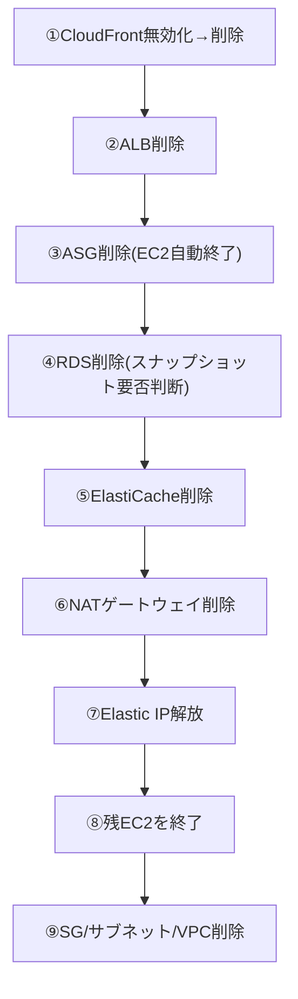

# コスト管理と無料利用枠ガイド(検証時の課金事故を防ぐ)

このドキュメントは、`projects/`配下の6案件(レベル1〜6)すべてに共通する「お金」の話をまとめた回です。想定読者は、(1) コスト意識を見たい採用担当者・面接官の方、(2) 同じ構成を手を動かして作りたい初心者エンジニアの方、の両方です。AWSの学習でいちばん怖いのは技術的な失敗ではなく「気づいたら数万円請求されていた」という事故です。各案件を始める前に必ず一読してください。

## 1. AWS無料利用枠の3分類と主要サービス一覧

AWS無料利用枠(AWS Free Tier。一定の条件内で主要サービスを無料で使える制度)には「**12か月無料**(作成から12か月間だけ無料)」「**常に無料**(恒久的に一定量まで無料)」「**トライアル**(有効化から一定期間だけ無料、終了後は自動課金)」の3分類があります。厄介なのは、このどれにも当てはまらず最初から課金対象のサービスも多いことです。「対象外」も加えて整理すると次の通りです。

| サービス | 分類 | 無料枠の目安 | 超過・終了後の課金 |
|---|---|---|---|
| EC2(自分専用の仮想サーバー) | 12か月無料 | 月750時間(t2/t3.micro等) | 稼働時間 × 単価 |
| S3(ファイル保管ストレージ) | 12か月無料 | 5GB + GET2万回 + PUT2千回 | 保存量・リクエスト従量課金 |
| RDS(マネージド型データベース) | 12か月無料(条件付き) | シングルAZの対象エンジンのみ750時間+20GB | 超過分、および本パックのMulti-AZ構成は対象外で全額課金 |
| CloudFront(世界中の拠点から配信するCDN) | 常に無料 | 月1TB転送 + 1,000万リクエスト | 超過分は従量課金 |
| Route 53(DNSを管理するサービス。ホストゾーン) | 対象外 | なし | 1ホストゾーンあたり月額固定(約0.5USD) |
| ElastiCache(インメモリキャッシュ) | 対象外 | なし | 起動直後からノード時間課金 |
| NATゲートウェイ(プライベート網の出口) | 対象外 | なし | 稼働時間課金 + データ量課金 |
| ALB(通信を複数サーバーへ振り分けるロードバランサー) | 対象外 | なし | 稼働時間課金 + 処理量に応じた従量課金 |
| AWS Config(構成変更の記録・評価) | 対象外 | なし | 記録項目数・ルール評価数で課金 |
| AWS WAF(Webアプリ向けファイアウォール) | 対象外 | なし | Web ACL月額 + ルール数・リクエスト課金 |
| GuardDuty(脅威検知サービス) | トライアル | 初回30日間無料 | 終了後は分析データ量に応じ課金 |
| IAM(権限管理サービス) | 常に無料 | 無制限 | 課金なし |

> 🧠 **覚え方のコツ**: 「12か月無料は新婚旅行」「常に無料は生涯パートナー」「トライアルはお試し期間(過ぎたら普通に契約扱い)」です。そして一番怖いのは、この3人のどれでもない「最初から味方ではない」サービスが、NATゲートウェイ・RDS(Multi-AZ)・ElastiCache・AWS Configという形で構成に紛れ込んでいることです。

## 2. 特に課金事故が起きやすいサービス

| ポイント | 何が起きるか | 対策 |
|---|---|---|
| NATゲートウェイの時間課金 | 「停止」の概念が無く、削除しない限り時間課金が発生し続ける | 検証後は必ず「削除」する。放置は月数千円規模になり得る |
| Elastic IP(固定のグローバルIPアドレス)の未アタッチ課金 | アタッチ中は基本無料だが、EC2終了後に浮いた状態で残ると課金対象になる | 「アドレスの解放」まで実行する。⚠️ 2024年以降はアタッチ中の通常のパブリックIPv4にも少額課金が発生するため最新料金を要確認 |
| RDS/ElastiCacheの無料枠 | RDSはシングルAZの一部エンジンのみ12か月無料。ElastiCacheには無料枠が無い | 作成直後から課金される前提で検証時間を短く区切る |
| GuardDuty/Configの継続課金 | 無効化・停止を忘れると気づかないまま毎月課金され続ける | GuardDutyは「一時停止」、Configは「記録の停止」まで確実に行う |

> 🧠 **覚え方のコツ**: NATゲートウェイ・RDS(Multi-AZ)・ElastiCacheは「電気をつけっぱなしの部屋」です。誰も使っていなくても電源(稼働状態)が入っている限り電気代(時間課金)が発生し続けます。使わない日は必ず電気を消す=リソースを削除するが鉄則です。

## 3. Billing Alarm(予算アラート)を設定する

検証を始める前に、必ず請求アラートを設定してください。AWS Budgets(請求とコスト管理コンソールの、予算超過を検知する機能)で**月5ドルを超えたら通知**する例です。

1. ルートユーザー(最強権限のアカウント)でログインし、アカウント名メニュー →「アカウント」→「IAM ユーザーおよびロールによる請求情報へのアクセス」を有効化します(未設定だとIAMユーザーで請求画面を開けません)。
2. アカウント名メニュー →「請求とコスト管理」→左メニュー「予算」→「予算を作成」を開きます。
3. 「カスタマイズ(詳細)」を選び、予算タイプは **コスト予算** を選択します。
4. 予算名 `verification-monthly-budget`、期間 **月次**、予算タイプ **固定**、予算金額に **5.00 USD** を入力します。
5. アラートしきい値を2つ追加します。1つ目は実績が **80%(4ドル)** 超過、2つ目は実績が **100%(5ドル)** 超過とし、それぞれ通知先に自分のメールアドレスを入力します。
6. 「予算を作成」で確定します。請求データの反映には最大24時間程度かかります。

古典的な方法として、CloudWatch(サーバーの状態やログを収集・可視化する監視サービス)の`EstimatedCharges`(推定請求額)メトリクス(**us-east-1限定**)にアラームを張る手もあります。CLIなら以下のように、しきい値5ドル超過でアラーム発報させられます。

```bash
aws cloudwatch put-metric-alarm \
  --alarm-name "billing-alarm-5usd" --namespace "AWS/Billing" \
  --metric-name "EstimatedCharges" --dimensions Name=Currency,Value=USD \
  --statistic Maximum --period 21600 --evaluation-periods 1 \
  --threshold 5 --comparison-operator GreaterThanThreshold \
  --region us-east-1 \
  --alarm-actions "arn:aws:sns:us-east-1:<アカウントID>:billing-alerts"
```

> 🧠 **覚え方のコツ**: AWS Budgetsは「家計簿アプリの予算超過通知」、CloudWatchの請求アラームは「電気メーターに付けたブザー」です。目的は同じ「使いすぎに気づく前に音を鳴らす」こと。Budgetsの月5ドル設定だけでも学習前に済ませてください。

## 4. 検証後のリソース削除チェックリスト

依存関係を意識せず消すと「削除できません」というエラーに何度も遭遇します。レベル3〜4のフル構成を想定した順序は次の通りです。



1. **CloudFront**: 「無効」になるまで待ってから削除(有効なままでは削除不可)
2. **ALB**: 稼働時間・処理量課金を止めるため優先削除。ターゲットグループも削除
3. **Auto Scaling Group(EC2の台数を自動増減させる管理単位)**: 容量を0にしてから削除。配下のEC2は自動終了
4. **RDS**: 最終スナップショット(削除時点のデータの複製)の要否を判断(作り直せるなら**スキップ**、残したいなら**取得**。スナップショットも課金対象)
5. **ElastiCache**: 無料枠が無いため最優先級で削除
6. **NATゲートウェイ**: 削除後も一覧から消えるまで数分課金対象として残ることがある
7. **Elastic IP**: 関連付けが外れたことを確認して「アドレスの解放」
8. **EC2**: ASG管理外の単体インスタンスがあれば終了
9. **ネットワーク**: SG→サブネット→IGW→VPC本体の順に削除
10. **監視系**: GuardDutyの一時停止、Configの記録停止、S3(空にしてから)削除も忘れずに

> 🧠 **覚え方のコツ**: 削除の順番は「建物の解体」です。看板(CloudFront)を下ろし、受付(ALB)を畳み、テナント(EC2/RDS/ElastiCache)を退去させ、電気・ガスの引き込み(NAT/EIP)を止め、最後に更地(VPC)に戻す。逆順では上物が残りエラーになります。

## 5. 6案件の月額概算費用まとめ

無料利用枠の期間内かどうかで大きく変わります。あくまで目安(1ドル=150円換算)です。

| レベル | 案件名 | 主な有料要素(無料枠対象外) | 無料枠内/月 | 無料枠終了後/月 |
|---|---|---|---|---|
| 1 | 静的Webサイト公開 | Route 53ホストゾーン | 約75〜100円 | 約75〜100円 |
| 2 | EC2 Webサーバー | なし(EIPはアタッチ中は基本無料) | 0〜数十円 | 約1,000〜1,500円 |
| 3 | 高可用性3層構成 | ALB・NAT・RDS(Multi-AZ) | 約6,000〜9,000円 | 約7,000〜10,000円 |
| 4 | WordPress本番構成 | ALB・NAT・RDS(Multi-AZ)・ElastiCache | 約8,000〜12,000円 | 約9,000〜13,000円 |
| 5 | セキュリティ監視基盤 | Config・WAF・GuardDuty(トライアル後) | 約1,000〜2,000円 | 約1,500〜2,500円 |
| 6 | IaC/CI-CD | ほぼ無料枠内(CodeBuild月100分等) | 0〜数十円 | 数百円 |

⚠️ この表は**常時稼働**させた場合の概算です。その日の検証が終わったら即座に第4章の手順で削除する運用を徹底すれば、実際の請求はこの表よりずっと小さく抑えられます。最新の料金・条件は必ず[AWS無料利用枠](https://aws.amazon.com/jp/free/)の公式ページで確認してください。

## 関連ドキュメント

- [ポートフォリオ全体トップ](../README.md)
- [AWS基礎知識](01-aws-basics-for-beginners.md)
