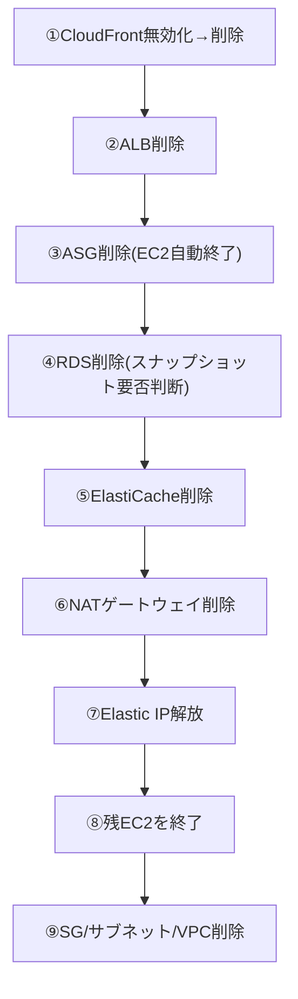

# コスト管理と無料利用枠ガイド(検証時の課金事故を防ぐ)

このドキュメントは、`projects/`配下の6案件(レベル1〜6)すべてに共通する「お金」の話をまとめた回です。想定読者は、(1) コスト意識を見たい採用担当者・面接官の方、(2) 同じ構成を手を動かして作りたい初心者エンジニアの方、の両方です。AWSの学習でいちばん怖いのは技術的な失敗ではなく「気づいたら数万円請求されていた」という事故です。各案件を始める前に必ず一読してください。

## 1. 最初に自分の無料プラン・クレジット条件を確認する

**公式情報確認: 2026-09-17。** AWS無料利用枠はアカウント作成日によって条件が異なります。2025-07-15以降の新規アカウントにはクレジットと最大6か月の無料プランが導入されています。それより前のアカウントは旧制度の対象となり得ますが、12か月枠は期限内であることなどの条件付きです。[AWS無料利用枠の公式説明](https://aws.amazon.com/free/free-tier-faqs/)と[EC2の適用条件](https://docs.aws.amazon.com/AWSEC2/latest/UserGuide/ec2-free-tier-usage.html)で、自分のプラン、残高、有効期限、利用可能サービスを確認してください。

「小さいインスタンスだから無料」「クレジットがあるからすべてのサービスが使える」とは判断しません。実行前のメモには次を残します。

| 確認項目 | 記入する内容 |
|---|---|
| アカウント条件 | 作成日、プラン、クレジット残高・期限（非公開情報は伏せる） |
| 構成 | リージョン、サービス、台数、インスタンスタイプ、ストレージ容量 |
| 時間・通信 | 開始時刻、削除予定時刻、転送量・リクエスト数の見込み |
| 費用 | 公式料金で算出した見積額と、実行後の請求額を別々に記録 |
| 終了条件 | 予算通知と削除確認の方法。予算通知は支出の強制停止ではない |

## 2. 特に課金事故が起きやすいサービス

| ポイント | 何が起きるか | 対策 |
|---|---|---|
| NATゲートウェイの時間課金 | 「停止」の概念が無く、削除しない限り時間課金が発生し続ける | 検証後は必ず「削除」する。放置は月数千円規模になり得る |
| Elastic IPを含むパブリックIPv4 | 使用中・未使用とも通常料金が発生する。2026-09-17確認の通常料金は1アドレス1時間あたり0.005 USD（クレジット等の適用前） | EC2終了後は「アドレスの解放」まで実行する。[公式VPC料金](https://aws.amazon.com/vpc/pricing/)を確認する |
| RDS/ElastiCache | 構成やプランによって料金・クレジット適用が異なる | 無料を前提にせず見積もり、検証時間を短く区切る |
| GuardDuty/Configの継続課金 | 無効化・停止を忘れると気づかないまま毎月課金され続ける | GuardDutyは「一時停止」、Configは「記録の停止」まで確実に行う |

> 🧠 **覚え方のコツ**: NATゲートウェイ・RDS(Multi-AZ)・ElastiCacheは「電気をつけっぱなしの部屋」です。誰も使っていなくても電源(稼働状態)が入っている限り電気代(時間課金)が発生し続けます。使わない日は必ず電気を消す=リソースを削除するが鉄則です。

## 3. Billing Alarm(予算アラート)を設定する

検証を始める前に、必ず請求アラートを設定してください。AWS Budgets(請求とコスト管理コンソールの、予算超過を検知する機能)で**月5ドルを超えたら通知**する例です。

1. ルートユーザー(最強権限のアカウント)でログインし、アカウント名メニュー →「アカウント」→「IAM ユーザーおよびロールによる請求情報へのアクセス」を有効化します(未設定だとIAMユーザーで請求画面を開けません)。
2. アカウント名メニュー →「請求とコスト管理」→左メニュー「予算」→「予算を作成」を開きます。
3. 「カスタマイズ(詳細)」を選び、予算タイプは **コスト予算** を選択します。
4. 予算名 `verification-monthly-budget`、期間 **月次**、予算タイプ **固定**、予算金額に **5.00 USD** を入力します。
5. アラートしきい値を2つ追加します。1つ目は実績が **80%(4ドル)** 超過、2つ目は実績が **100%(5ドル)** 超過とし、それぞれ通知先に自分のメールアドレスを入力します。
6. 「予算を作成」で確定します。請求データの反映には最大24時間程度かかります。

古典的な方法として、CloudWatch(サーバーの状態やログを収集・可視化する監視サービス)の`EstimatedCharges`(推定請求額)メトリクス(**us-east-1限定**)にアラームを張る手もあります。CLIなら以下のように、しきい値5ドル超過でアラーム発報させられます。

```bash
aws cloudwatch put-metric-alarm \
  --alarm-name "billing-alarm-5usd" --namespace "AWS/Billing" \
  --metric-name "EstimatedCharges" --dimensions Name=Currency,Value=USD \
  --statistic Maximum --period 21600 --evaluation-periods 1 \
  --threshold 5 --comparison-operator GreaterThanThreshold \
  --region us-east-1 \
  --alarm-actions "arn:aws:sns:us-east-1:<アカウントID>:billing-alerts"
```

> 🧠 **覚え方のコツ**: AWS Budgetsは「家計簿アプリの予算超過通知」、CloudWatchの請求アラームは「電気メーターに付けたブザー」です。目的は同じ「使いすぎに気づく前に音を鳴らす」こと。Budgetsの月5ドル設定だけでも学習前に済ませてください。

## 4. 検証後のリソース削除チェックリスト

依存関係を意識せず消すと「削除できません」というエラーに何度も遭遇します。レベル3〜4のフル構成を想定した順序は次の通りです。



1. **CloudFront**: 「無効」になるまで待ってから削除(有効なままでは削除不可)
2. **ALB**: 稼働時間・処理量課金を止めるため優先削除。ターゲットグループも削除
3. **Auto Scaling Group(EC2の台数を自動増減させる管理単位)**: 容量を0にしてから削除。配下のEC2は自動終了
4. **RDS**: 最終スナップショット(削除時点のデータの複製)の要否を判断(作り直せるなら**スキップ**、残したいなら**取得**。スナップショットも課金対象)
5. **ElastiCache**: 検証に使った対象を削除し、残存を確認
6. **NATゲートウェイ**: 削除後も一覧から消えるまで数分課金対象として残ることがある
7. **Elastic IP**: 関連付けが外れたことを確認して「アドレスの解放」
8. **EC2**: ASG管理外の単体インスタンスがあれば終了
9. **ネットワーク**: SG→サブネット→IGW→VPC本体の順に削除
10. **監視系**: GuardDutyの一時停止、Configの記録停止、S3(空にしてから)削除も忘れずに

> 🧠 **覚え方のコツ**: 削除の順番は「建物の解体」です。看板(CloudFront)を下ろし、受付(ALB)を畳み、テナント(EC2/RDS/ElastiCache)を退去させ、電気・ガスの引き込み(NAT/EIP)を止め、最後に更地(VPC)に戻す。逆順では上物が残りエラーになります。

## 5. 6案件で見積もりに含めるもの

構成・リージョン・稼働時間を固定していないため、この資料では月額を確定しません。[AWS Pricing Calculator](https://calculator.aws/)で対象の構成を入力し、実施日の公式料金とともに保存します。無料プラン・クレジットを適用する前の費用も確認してください。

| レベル | 案件名 | 見積もりに含める主な項目 |
|---|---|---|
| 1 | 静的Webサイト公開 | S3の保存・操作、CloudFront配信、利用する場合のRoute 53・ドメイン |
| 2 | EC2 Webサーバー | EC2、EBS、パブリックIPv4、データ転送 |
| 3 | 高可用性3層構成 | EC2・EBS・IPv4、ALB、NAT、RDS(Multi-AZ)、転送 |
| 4 | WordPress本番構成 | レベル3の構成、ElastiCache、S3・CloudFront、バックアップ、ログ・監視 |
| 5 | セキュリティ監視基盤 | Config、WAF、GuardDuty、CloudTrail・保存先、ログ量 |
| 6 | IaC/CI-CD | コードが作成するAWSリソース、state保存先、CodeBuild・CodePipeline |

削除確認と請求確認は別です。各サービスで作成対象が残っていないことを確認し、請求データが反映された後に実費を記録します。費用未確認の状態で「無料で構築できた」とは書きません。

## 関連ドキュメント

- [ポートフォリオ全体トップ](../README.md)
- [AWS基礎知識](01-aws-basics-for-beginners.md)
