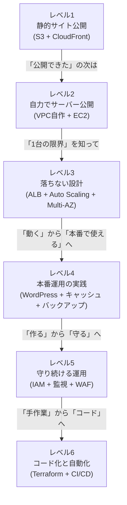

# このポートフォリオの面接での伝え方

## この記事の位置づけ

このファイルは、設計資料と実行実績を区別して面接で説明するための練習資料です。2026-09-17時点で、このリポジトリに本人の実AWS構築・運用の記録はありません。現在の説明には第1・2節を使い、実行後は[証跡](../evidence/README.md)で確認できる内容だけを追加します。

**第3節の体験談は架空の回答例です。** 前職の障害、SSH切り分けの所要時間、ALB障害の対処などは筆者の経歴・実績ではありません。実際に経験していない話を本人の体験として使わないでください。

このファイル単体でも読めるように専門用語はその都度かんたんに補足していますが、前提知識として [AWS基礎知識](01-aws-basics-for-beginners.md)・[用語集](02-glossary.md)・[コスト管理ガイド](03-cost-management.md)を先に読んでおくと、各案件で使われている用語や判断の背景がよりスムーズに理解できます。

読み方のコツは1つだけです。以下の例文をそのまま丸暗記するのではなく、**「レベル◯で・何を・なぜそうしたか」という骨格だけ借りて、中身は自分の言葉に置き換える**ことです。面接官は暗記した文章よりも、多少たどたどしくても自分の言葉で語られる説明のほうを高く評価します。

## 1. 30秒で伝える自己紹介テンプレート

このポートフォリオは、レベル1から6までの6案件の設計・構築教材です。次の図は学習順序であり、本人が全段階を実施した記録ではありません。自己紹介は「現在示せる成果物 → 実行確認の範囲 → 次に確かめること」の順で話します。

**現在の証跡範囲に合わせた例文(30秒版)**

> 島田則幸です。インフラエンジニアを目指し、AWSの6案件について設計資料、構築・削除コード、検証の仕組みをまとめています。現時点では実AWSでの動作は未確認です。次はEC2 1台の構成で、疎通・監視項目の確認から削除までを実測し、設定を選んだ理由と併せて記録する予定です。

> 🧠 **覚え方のコツ**: 「見せられるもの・確かめたこと・次に確かめること」の3つです。実行した内容が増えたら、日付と証跡を添えて説明を更新します。

## 2. 各案件のエレベーターピッチ集

各レベルを1〜2文で説明するための例です。下表は文書・コードで示す設計対象を説明しています。本人が説明できる範囲を確認し、実行結果を話すときには対応する証跡を添えます。

| レベル | 案件名 | 30秒説明の例文 |
|---|---|---|
| 1 | 静的Webサイト公開環境(S3 + CloudFront + Route 53 + ACM) | 「S3を非公開にしてCloudFront経由で配信する設計・手順をまとめています。実AWSでの配信確認は未実施です。」 |
| 2 | EC2 Webサーバー構築(VPC自作 + EC2) | 「VPC、ルート、通信許可からApacheの起動までを追える手順とCLIキットがあります。次の実測対象として、構築から削除までを1件の記録にする予定です。」 |
| 3 | 高可用性3層構成(ALB + Auto Scaling + Multi-AZ RDS) | 「負荷分散、サーバー台数の維持、DBの冗長化を学ぶ設計資料です。フェイルオーバーや可用性の実測はまだありません。」 |
| 4 | WordPress本番運用を想定した構成 | 「キャッシュ、メディア配信、バックアップ、監視を含めた運用設計を扱っています。本番運用や復元成功の実績ではありません。」 |
| 5 | セキュアな監視・ガバナンス基盤 | 「IAM、CloudTrail、Config、GuardDuty、WAFの役割と設定手順をまとめています。実際の脅威検知・通知テストは未実施です。」 |
| 6 | IaCとCI/CDによる自動構築(Terraform + CodePipeline) | 「Terraformコードとパイプラインの設計例があります。静的検証と、AWSでのplan・apply・destroyの実行結果は区別しています。」 |

> 🧠 **覚え方のコツ**: 設計の説明に続けて、どこまで確かめたかを話します。「手順がある」「静的検査が通った」「実機で期待した結果を確認した」は、それぞれ別の事実です。

## 3. 想定質問と回答の型

回答の骨格は「①どのレベルの話か → ②確認できる行動・結果 → ③判断基準や学び」です。以下は説明の練習用の架空例です。数字や体験は証跡のある自分の内容へ差し替えます。該当する体験がなければ「実施していないため、確認するならこの順序です」と説明します。

### 3-1. なぜインフラ・サーバー構築エンジニアを目指したのか

⚠️ **悪い回答例(暗記っぽい)**
> 「クラウドは今後も伸びる分野で、需要が高いと聞いたので目指しました。資格の勉強もしています。」

このままだと、どんな未経験者でも言える一般論で終わってしまい、「本当にこの人がやりたいのか」が面接官に伝わりません。

✅ **良い回答例(自分の言葉・具体的な理由)**
> 「前職では別の職種でしたが、社内で使っていた業務システムが止まり、原因も分からないまま半日以上復旧を待つしかなかった経験があります。そのとき『止まらない仕組みを作る側になりたい』と考えるようになりました。ただ知識ゼロで飛び込むのは不安だったので、まずレベル1のS3+CloudFrontという一番小さい構成から手を動かし、レベル2でVPCを自作した際にSSHが繋がらず3時間近く原因を切り分けた経験を経て、『分からないことを1つずつ潰していく』このロジックを楽しめる自分に気づき、本気で目指すようになりました。」

*(このまま使うのではなく、括弧内の体験談を自分の実体験に置き換えてください)*

### 3-2. 未経験だが、この構成のどこが一番苦労したか、どう解決したか

⚠️ **悪い回答例(暗記っぽい)**
> 「いろいろ苦労しましたが、調べながら頑張って解決しました。」

具体性がゼロで、何を理解しているのかがまったく伝わりません。

✅ **良い回答例(自分の言葉・具体的な数値や判断理由)**
> 「レベル3で、ALBのターゲットグループ(ALBが振り分け先として管理するサーバーのまとまり)がずっとUnhealthy(異常)と表示され、原因が分かりませんでした。切り分けとして、まずEC2に直接接続してApacheが起動しているかを確認し(問題なし)、次にヘルスチェックパス(ALBがサーバーの生存確認のために定期的にアクセスするURLパス)の`/health.html`が実際に配置されているかを確認し(問題なし)、最後にEC2用のセキュリティグループを見直したところ、ALB用SGからの80番ポート(HTTP通信で使われるポート番号)を許可し忘れていたことが原因でした。この経験から、通信トラブルは『通信の着信側に近いところから疑う』という順番で切り分けると効率的だと学びました。」

### 3-3. 本番運用でこの構成のままだと足りない点は何だと思うか

⚠️ **悪い回答例(暗記っぽい)**
> 「今の構成で十分だと思います、特に問題はありません。」

伸びしろの自覚がないと受け取られてしまう、危険な回答です。経験者ほど「今の設計の限界」を具体的に言語化できるものです。

✅ **良い回答例(自分の言葉・具体的な数値や判断理由)**
> 「いくつか認識している課題があります。1つ目は、現状は東京リージョン単独の構成なので、リージョン全体の障害には対応できません。マルチリージョン構成やRoute 53のフェイルオーバールーティング(正常な方に自動的に切り替えるDNSのルーティング方式)は今後の課題です。2つ目はコスト最適化で、今回は学習目的でオンデマンド課金のまま構築しましたが、本番の恒常的なワークロードであればリザーブドインスタンス(一定期間の利用をあらかじめ予約することで料金の割引を受けられる購入方式)やSavings Plans(利用量をあらかじめコミットして料金の割引を受ける仕組み)での削減余地があります。3つ目は、レベル5で個別に有効化したCloudTrail・Config・GuardDutyの結果をSecurity Hub(複数のセキュリティサービスの結果を1つのダッシュボードに統合するサービス)でまとめられていない点で、運用担当者が複数画面を見に行く負担が残っています。」

### 3-4. セキュリティで気をつけたポイントは何か

⚠️ **悪い回答例(暗記っぽい)**
> 「セキュリティグループをちゃんと設定しました。あとIAMも権限を絞りました。」

サービス名の羅列だけで、なぜそうしたのかの理由が語られていません。

✅ **良い回答例(自分の言葉・具体的な数値や判断理由)**
> 「一貫して『インターネットから直接触れる面を最小化する』ことを意識しました。レベル1ではS3を非公開のままCloudFront経由でのみ配信し、レベル3ではEC2とRDSをプライベートサブネット(インターネットから直接到達できない区画)に置いた上で、セキュリティグループの許可元をIPアドレスではなく前段のSG(ALB用SGやEC2用SGそのもの)に指定しました。こうすることで、Auto Scalingでインスタンスの台数やIPアドレスが変わってもルールを書き換える必要がなくなります。さらにレベル5では、IAMにMFA(パスワードに加えてもう1段階本人確認する多要素認証)を必須にするガードレールポリシー(想定外の操作や設定をあらかじめ防ぐための予防的なルール)を入れ、権限だけでなく本人確認の面からも最小権限を徹底しました。」

### 3-5. コストをどう意識したか

⚠️ **悪い回答例(暗記っぽい)**
> 「無料利用枠の範囲で収まるように気をつけました。」

具体性がなく、無料枠を超える構成(レベル3以降)にどう向き合ったかが見えません。

✅ **良い回答例(自分の言葉・具体的な数値や判断理由)**
> 「実行前にアカウントの無料プラン・クレジット条件と、リージョン・構成・稼働時間に応じた料金を確認します。EC2の小さい構成でも、ストレージやパブリックIPv4を含む費用を見積もります。検証終了時刻を決め、削除処理と残存リソースの確認、後日の請求確認を分けて記録する予定です。」

> 🧠 **覚え方のコツ**: 良い回答は共通して「レベル◯で・何を・なぜ」の3点セットになっています。頭文字を取って英語で**『Level・What・Why=LWWの法則』**と覚えると忘れません。悪い回答例は主語がぼやけ、数字が一切出てきません。回答に詰まったら、まず「どのレベルの話をするか」を1つ決めてから話し始めると、芋づる式に具体的なエピソードが出てきて、一気に具体化しやすくなります。

## 4. 逆質問(面接官への質問)の例

逆質問は「志望度の高さ」と「実務を見据えた視点」を同時に示せる場面です。インフラエンジニア職種向けに、以下の3つを用意しておきます。

| 質問 | この質問で伝えたい意図 |
|---|---|
| 「現在のインフラ構成のコード化(IaC)は、どのあたりまで進んでいますか?もし手作業の部分が残っているとしたら、どこから着手される予定ですか?」 | レベル6の設計学習を、実務の進め方を理解する質問へつなげます。移行経験があるとは説明しません。 |
| 「障害対応やオンコール体制は、チームとしてどのように分担されていますか?未経験からのキャッチアップとして、最初はどのあたりの範囲を任せていただけそうでしょうか?」 | 「なんでもできます」という背伸びではなく、現実的な入社後のイメージを持って準備している姿勢を示せます。 |
| 「IAMの権限棚卸しやログ監視といったセキュリティ・監査対応は、どのくらいの頻度・体制で行われていますか?」 | レベル5で学んだ「作って終わりではなく守り続ける」視点をそのまま質問に変換したもので、ガバナンスへの関心をアピールできます。 |

> 🧠 **覚え方のコツ**: 良い逆質問は「①現状を確認する→②自分がどう関われるかを聞く」の順に組み立てると、ただの質問ではなく「入社後をイメージしている質問」に変わります。合言葉は**『現状確認→自分ごと化』**です。逆に「調べればすぐ分かること」を聞くのは避け、必ず自分の経験(レベル1〜6のどれか)と結びつけて質問するようにしましょう。

## 5. ポートフォリオを見せる際のTips

📌 実際に画面を見せながら説明する際は、以下を意識すると伝わりやすくなります。

1. **まずポートフォリオ全体トップ(`README.md`)のナビゲーション表を開く**: 各案件のREADMEには冒頭・末尾に「前のプロジェクト/次のプロジェクト」への相互リンクが用意されています。全体トップの一覧表から入り、この横断リンクを使ってレベル間を行き来すると、フォルダを探す手間がなく、話の流れを止めずに説明できます。
2. **各案件では構成図(mermaidの図)から説明を始める**: いきなりAWSサービス名を羅列するより、まず全体構成図を見せて「利用者からのリクエストがどう流れるか」を指差しながら説明したほうが、非エンジニアの面接官にも直感的に伝わります。細かいサービスの役割は、そのあとの表で補足すれば十分です。
3. **「発展課題」と「トラブルシューティング」のセクションもあえて見せる**: 成功例だけでなく、つまずいた点・まだ手を付けていない課題を正直に載せていることは、3-3で触れた「伸びしろの自覚」をそのまま裏付ける材料になります。
4. **志望先の求人内容に応じて見せる順番を変える**: セキュリティ運用を重視する求人であればレベル5から、IaC/CI-CDの経験を求める求人であればレベル6から見せるなど、レベル1→6の順にこだわらず、相手が知りたいことから逆算して案内すると評価されやすくなります。
5. **各案件末尾の「面接でのアピールポイント」をそのまま音読できる状態にしておく**: すでに想定Q&Aとして整理してあるので、これを声に出して話す練習をしておくだけで、本番の受け答えが安定します。

> 🧠 **覚え方のコツ**: 説明の順番に迷ったら「全体図(ズームアウト)→詳細(ズームイン)」を思い出してください。カメラのズーム操作と同じで、まず引きの画で全体構成図を見せてから、寄りの画で1つずつのサービスや設定を説明すると、聞き手は迷子になりません。

## 参考リンク

- [Amazon VPCのドキュメント](https://docs.aws.amazon.com/vpc/)
- [Amazon EC2のドキュメント](https://docs.aws.amazon.com/ec2/)
- [Elastic Load Balancingのドキュメント](https://docs.aws.amazon.com/elasticloadbalancing/)
- [Amazon EC2 Auto Scalingのドキュメント](https://docs.aws.amazon.com/autoscaling/)
- [Amazon RDSのドキュメント](https://docs.aws.amazon.com/AmazonRDS/latest/UserGuide/Welcome.html)
- [AWS IAMのドキュメント](https://docs.aws.amazon.com/IAM/latest/UserGuide/introduction.html)
- [AWS CloudTrailのドキュメント](https://docs.aws.amazon.com/awscloudtrail/latest/userguide/cloudtrail-user-guide.html)
- [Amazon GuardDutyのドキュメント](https://docs.aws.amazon.com/guardduty/latest/ug/what-is-guardduty.html)
- [AWS Configのドキュメント](https://docs.aws.amazon.com/config/latest/developerguide/WhatIsConfig.html)
- [AWS WAFのドキュメント](https://docs.aws.amazon.com/waf/latest/developerguide/waf-chapter.html)
- [Amazon Route 53のドキュメント](https://docs.aws.amazon.com/Route53/latest/DeveloperGuide/Welcome.html)
- [AWS CodePipelineのドキュメント](https://docs.aws.amazon.com/codepipeline/latest/userguide/welcome.html)
- [AWS Well-Architected Framework](https://aws.amazon.com/jp/architecture/well-architected/)
- [AWS無料利用枠](https://aws.amazon.com/jp/free/)

## 関連ドキュメント

- [ポートフォリオ全体トップ](../README.md) — 各案件(レベル1〜6)へのリンクは、こちらのナビゲーション表を参照してください。
- [AWS基礎知識](01-aws-basics-for-beginners.md)
- [用語集](02-glossary.md)
- [コスト管理ガイド](03-cost-management.md)
- [最初の案件(レベル1: 静的Webサイト公開環境の構築)](../projects/01-static-website/README.md)
