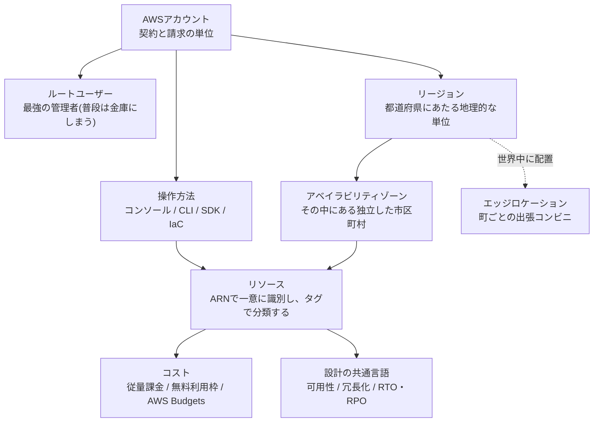

# AWS用語集 ①クラウドとAWSアカウントの基礎

> 📖 [用語集トップ(索引)に戻る](../02-glossary.md) ｜ 次のページ: [②ネットワーク編](02-network.md)

## この章で扱う範囲

この章は、AWSのコンソール(管理画面)を初めて開いた瞬間から必ず出会う「土台」の用語をまとめたページです。具体的には、そもそもクラウドとは何か、AWSアカウントという契約の単位、操作方法の選択肢(画面・コマンド・コード)、東京やバージニアといった「場所」の単位、リソースを識別するARNやタグ、そして料金と可用性(サービスが止まらずに使い続けられる度合い)という設計の共通言語です。

ここに出てくる用語は、特定のサービスの使い方ではなく「AWS全体に共通するお作法」です。②以降のネットワーク編・コンピューティング編で出てくるサービスは、すべてこの章の枠組みの上に載っています。逆に言うと、ここが曖昧なまま先に進むと「作ったはずのEC2が一覧に出てこない(実はリージョン違い)」「気づいたら課金されていた」といった、技術以前のところでつまずきます。



> 🧠 **覚え方のコツ**: この章は「**契約 → 場所 → モノ → お金 → 設計**」の5段階だと考えてください。まずAWSアカウントという契約を結び(契約)、どのリージョン・AZに置くかを決め(場所)、そこにリソースを作ってARNとタグで管理し(モノ)、従量課金と無料利用枠でいくらかかるかを見張り(お金)、最後に可用性・RTO・RPOという言葉で「どこまで止まってよいか」を決める(設計)。この5段階の順番で唱えると、①の用語がバラバラの暗記項目ではなく1本の線でつながります。

## この章の用語ミニ索引

| 用語 | ひとことで言うと |
|---|---|
| [クラウドコンピューティング](#クラウドコンピューティング) | サーバーなどの資源を所有せず、必要な分だけ借りて使う仕組み |
| [オンプレミス](#オンプレミス) | 自社で機器を購入・設置して運用する、従来型の方式 |
| [IaaS](#iaas) | サーバーやネットワークという「素材」だけを借りる形態 |
| [PaaS](#paas) | OSやミドルウェアまで用意された「土台」を借りる形態 |
| [SaaS](#saas) | 完成したソフトウェアをサービスとして使う形態 |
| [マネージドサービス](#マネージドサービス) | 運用・保守の多くをAWSが代行してくれるサービス |
| [責任共有モデル](#責任共有モデル) | AWSと利用者で、守る範囲を分担するという考え方 |
| [従量課金](#従量課金) | 使った時間・量に応じて後から支払う料金体系 |
| [AWSアカウント](#awsアカウント) | AWSを使うための契約・請求・リソース分離の単位 |
| [ルートユーザー](#ルートユーザー) | アカウント作成時にできる、何でもできる最強の管理者 |
| [アカウントID](#アカウントid) | AWSアカウントを識別する12桁の数字 |
| [AWSマネジメントコンソール](#awsマネジメントコンソール) | ブラウザから各サービスを操作できる管理画面 |
| [GUI](#gui) | 画面上のボタンやメニューを見ながら操作する方式 |
| [AWS CLI](#aws-cli) | ターミナルからコマンドでAWSを操作するツール |
| [AWS SDK](#aws-sdk) | プログラムからAWSを操作するための言語別ライブラリ |
| [API](#api) | ソフトウェア同士がやり取りするための決められた窓口 |
| [AWS CloudShell](#aws-cloudshell) | ブラウザ内で使える、AWS CLI導入済みのシェル環境 |
| [AWS Organizations](#aws-organizations) | 複数のAWSアカウントをまとめて統制・一括請求する仕組み |
| [リージョン](#リージョン) | 世界各地にある、独立したデータセンター群の地理的な単位 |
| [アベイラビリティゾーン](#アベイラビリティゾーン) | リージョン内にある、電源も回線も独立した拠点のまとまり |
| [マルチリージョン](#マルチリージョン) | 複数のリージョンにまたがって構成を持つ設計 |
| [エッジロケーション](#エッジロケーション) | 利用者の近くに置かれた、配信専用の小さな拠点 |
| [グローバルサービス](#グローバルサービス) | 特定の1リージョンに属さず、世界共通で使えるサービス |
| [ARN](#arn) | AWS上のすべてのリソースを一意に指し示す識別子 |
| [タグ](#タグ) | リソースに付ける「キーと値」のラベル |
| [サービスクォータ](#サービスクォータ) | 1アカウント・1リージョンあたりに使える上限値 |
| [無料利用枠](#無料利用枠) | 一定の範囲までAWSを無料で試せる制度 |
| [オンデマンド](#オンデマンド) | 事前契約なしで、使った分だけ定価で払う購入方式 |
| [リザーブドインスタンス](#リザーブドインスタンス) | 1年・3年の利用を予約して割引を受ける購入方式 |
| [Savings Plans](#savings-plans) | 一定の利用額を約束することで割引を受ける仕組み |
| [スポットインスタンス](#スポットインスタンス) | 中断を受け入れる代わりに大幅割引で使う購入方式 |
| [AWS Budgets](#aws-budgets) | 予算を決めて、超えそうになったら通知するサービス |
| [請求アラート](#請求アラート) | 推定請求額がしきい値を超えたら知らせる仕組み |
| [Cost Explorer](#cost-explorer) | 過去のコストをグラフで分析・可視化するツール |
| [Well-Architected Framework](#well-architected-framework) | AWSがまとめた「良い設計」の判断基準集 |
| [SLA](#sla) | サービスの稼働率についてAWSが公開している約束 |
| [可用性](#可用性) | システムが停止せずに使える割合を表す指標 |
| [高可用性](#高可用性) | 障害が起きても止まりにくいように作られた状態 |
| [冗長化](#冗長化) | 同じ役割のものを複数用意して、片方が壊れても続ける設計 |
| [単一障害点](#単一障害点) | そこが壊れると全体が止まってしまう箇所 |
| [スケールアップ](#スケールアップ) | 1台の性能そのものを大きくして処理能力を上げる方法 |
| [スケールアウト](#スケールアウト) | 台数を増やして処理能力を上げる方法 |
| [RTO](#rto) | 障害発生から復旧までに許容できる時間の目標 |
| [RPO](#rpo) | 障害時に失っても許容できるデータ量(時間)の目標 |
| [フェイルオーバー](#フェイルオーバー) | 障害時に待機系へ自動で切り替わること |
| [ディザスタリカバリ](#ディザスタリカバリ) | 大規模災害・広域障害からの復旧計画とその構成 |

## 1-1. クラウドという考え方

### クラウドコンピューティング

**正式名称**: Cloud Computing ｜ **読み方**: クラウドコンピューティング ｜ **重要度**: ★★★

**ひとことで言うと**: サーバーやストレージ、ネットワークといったコンピューター資源を自分で所有せず、インターネット経由で必要な分だけ借りて使う仕組みです。

**たとえるなら**: マンスリーマンションです。一戸建てを買う([オンプレミス](#オンプレミス))と初期費用も維持費も自分持ちですが、マンスリーマンション(クラウド)なら必要な期間だけ借りて、使わなくなったらすぐ解約できます。

**もう少し詳しく**: クラウドの本質は「所有から利用へ」という発想の転換です。従来はサーバーを買う前に「3年後にどれくらいアクセスが増えるか」を予測し、余裕を持った台数を先に購入する必要がありました。クラウドでは数分でサーバーを起動でき、要らなくなったら削除して課金を止められます。つまり、**設備投資(先に大金を払う)を運用費(使った分だけ払う)に変えられる**のがいちばんのメリットです。AWSはこのクラウドサービスの世界最大手の1つで、コンピューティング・ストレージ・データベース・機械学習など数百のサービスを同じアカウントから利用できます。

**サーバー構築での勘所**:
- 「借りている」以上、止めるのを忘れると借り続けたことになります。検証が終わったら削除する習慣が、技術力と同じくらい大事です。
- 調達期間がゼロに近いので、**まず小さく作って試し、動いたら本番用に作り直す**という進め方ができます。このポートフォリオがレベル1から段階的に積み上げているのはそのためです。
- クラウドだから何でも速い・安いわけではありません。常時フル稼働する定常的なワークロード(処理の仕事量)では、オンプレミスのほうが安く付くケースもあります。

**よくあるつまずき**: 「クラウド=AWS」ではありません。AWSはクラウドサービスの一提供者であり、面接では「なぜクラウドなのか」と「なぜAWSなのか」を分けて説明できると強いです。

**💰 コスト**: 基本は[従量課金](#従量課金)です。使った分だけ請求される一方、消し忘れたリソースは使っていなくても課金され続けます。

**関連用語**: [オンプレミス](#オンプレミス)、[従量課金](#従量課金)、[マネージドサービス](#マネージドサービス)、[IaaS](#iaas)

**登場する案件**: [AWS基礎知識(超入門)](../01-aws-basics-for-beginners.md)

### オンプレミス

**読み方**: オンプレミス ｜ **重要度**: ★★

**ひとことで言うと**: 自社の建物やデータセンターに、自前でサーバー機器を購入・設置して運用する従来型の方式です。

**たとえるなら**: 一戸建てを買うことです。機器の購入・設置・電源・空調・故障時の交換まで、すべてを自分で抱え込みます。

**もう少し詳しく**: 「オンプレ」と略されます。クラウドと対比される言葉で、機器の調達に数週間から数か月かかること、容量を先に見積もって買い切ること、故障対応や保守契約を自分たちで持つことが特徴です。一方で、機器を物理的に自分の管理下に置けること、長期間フル稼働させる用途では総額を抑えやすいこと、既存の社内システムとの接続が単純であることなど、いまも合理的な選択になる場面はあります。実務では「すべてをクラウドへ」ではなく、オンプレミスとクラウドを併用する**ハイブリッドクラウド**(両方をつないで使う形態)の案件も少なくありません。

**サーバー構築での勘所**:
- オンプレミスからAWSへ移す作業を**移行(マイグレーション)**と呼び、そのまま持ち上げて載せ替える手法を**リフト&シフト**と言います。未経験からの求人でも移行案件は多いので、言葉として押さえておくと有利です。
- オンプレミスでは自分で用意していた「電源の二重化」「予備機」「バックアップ装置」が、AWSでは[アベイラビリティゾーン](#アベイラビリティゾーン)や[冗長化](#冗長化)の設計に置き換わります。**やることは変わらず、手段が変わる**と理解してください。

**関連用語**: [クラウドコンピューティング](#クラウドコンピューティング)、[責任共有モデル](#責任共有モデル)、[冗長化](#冗長化)

### IaaS

**正式名称**: Infrastructure as a Service ｜ **読み方**: イアース/アイアース ｜ **重要度**: ★★

**ひとことで言うと**: サーバー・ストレージ・ネットワークといった「インフラの素材」だけを借り、OSから上は自分で面倒を見る利用形態です。

**たとえるなら**: 内装なしの「スケルトン貸し」のテナント物件です。建物の躯体と電気・水道の引き込みまでは大家(AWS)が用意しますが、壁も厨房も什器も自分で入れます。

**もう少し詳しく**: AWSでの代表格はAmazon EC2(仮想サーバーを借りられるサービス)です。EC2ではOSの選択・パッチ適用・ミドルウェア(OSとアプリの間で動く土台となるソフトウェア)の導入・アプリの配置がすべて利用者の作業になります。自由度が最も高い代わりに、運用の手間も最も大きい形態です。このポートフォリオのレベル2〜4は、まさにIaaSであるEC2の上にApacheやWordPressを自分の手で載せていく構成になっています。

**サーバー構築での勘所**:
- IaaSを選ぶと、OSのセキュリティパッチ適用は**利用者の責任**になります([責任共有モデル](#責任共有モデル))。「EC2を立てて終わり」ではなく、更新の運用まで含めて設計してください。
- サーバー構築エンジニアの求人で最も需要が大きいのは、このIaaSの領域(EC2 + Linux + ネットワーク)です。

**関連用語**: [PaaS](#paas)、[SaaS](#saas)、[責任共有モデル](#責任共有モデル)、[マネージドサービス](#マネージドサービス)

**登場する案件**: [レベル2: EC2 Webサーバー構築](../../projects/02-ec2-web-server/README.md)

### PaaS

**正式名称**: Platform as a Service ｜ **読み方**: パース ｜ **重要度**: ★

**ひとことで言うと**: OSやミドルウェアまで整った「土台」を借り、利用者はアプリやデータだけを載せる利用形態です。

**たとえるなら**: 厨房設備がそのまま残っている「居抜き物件」です。コンロも換気扇も付いているので、料理人(アプリ)と食材(データ)を持ち込めばすぐ営業できます。

**もう少し詳しく**: AWSではAWS Elastic Beanstalk(アプリを置くだけで実行環境を用意してくれるサービス)やAWS Lambda(サーバーの管理をせずコードだけを実行できるサービス)がこの性格を強く持ちます。Amazon RDS(データベースの運用をAWSが代行するサービス)も、OSやデータベースソフトの面倒をAWSが見る点でPaaS的です。手間が減る代わりに、OSに独自の設定を入れる、といった細かい自由は効かなくなります。

**サーバー構築での勘所**:
- 「自由度」と「運用の手間」は必ずトレードオフ(あちらを立てればこちらが立たない関係)になります。要件が標準的ならPaaS寄り、特殊な設定が必要ならIaaS寄り、という判断軸を持ってください。
- 面接では「なぜEC2で作ったのか(なぜLambdaやBeanstalkにしなかったのか)」を聞かれることがあります。学習目的で仕組みを理解するため、と答えられれば十分です。

**関連用語**: [IaaS](#iaas)、[SaaS](#saas)、[マネージドサービス](#マネージドサービス)

### SaaS

**正式名称**: Software as a Service ｜ **読み方**: サース ｜ **重要度**: ★

**ひとことで言うと**: 完成したソフトウェアを、インターネット越しにサービスとして使う利用形態です。

**たとえるなら**: すでに営業している店に、お客として入って食事をすることです。厨房も内装も自分では触りません。

**もう少し詳しく**: メールサービスや業務用のチャットツール、経費精算システムなどが該当します。利用者はアカウントを作って使うだけで、サーバーもOSもソフトの更新も提供側が持ちます。AWSのサービスでも、たとえばAmazon WorkMail(メール)のように完成品として使うものはSaaS的です。インフラエンジニアとしては「自分たちで作るのか、SaaSを買うのか」というコスト比較の場面で登場します。

**サーバー構築での勘所**:
- 3つの違いは「どこまで自分で管理するか」の線引きだけです。**IaaS(素材だけ)→PaaS(土台つき)→SaaS(完成品)**の順に、自由度が下がり、手間も下がります。

> 🧠 **覚え方のコツ**: 3つの違いはピザで例える説明が有名ですが、このポートフォリオの建物の世界観に合わせるなら「スケルトン貸し(IaaS)→居抜き物件(PaaS)→できあがった店に客として入る(SaaS)」です。**I(素材)・P(土台)・S(完成品)** の頭文字順で、右へ行くほど自分の仕事が減ると覚えてください。

**関連用語**: [IaaS](#iaas)、[PaaS](#paas)

### マネージドサービス

**読み方**: マネージドサービス ｜ **重要度**: ★★★

**ひとことで言うと**: サーバーの構築・監視・バックアップ・パッチ適用といった運用作業の多くを、AWS側が代行してくれるサービスの総称です。

**たとえるなら**: 管理人つきの賃貸マンションです。共用部の清掃も設備の点検も管理人(AWS)がやってくれるので、住人(利用者)は自分の部屋の中だけに集中できます。

**もう少し詳しく**: Amazon RDS・Amazon S3・Amazon ElastiCache・AWS Backupなど、AWSのサービスの多くはマネージドサービスです。たとえばRDSであれば、OSのインストール、データベースソフトの導入、バックアップの取得、パッチ適用、Multi-AZ(2つのアベイラビリティゾーンに複製する構成)の切り替えまでAWSが引き受けます。同じことをEC2の上に自分で構築すると、これらすべてが自分の作業になります。マネージドサービスを使うと、**運用工数が減る代わりに、内部を自由にいじれる範囲が狭くなる**という関係になります。

**サーバー構築での勘所**:
- 「自前で作れるが、あえてマネージドを選ぶ」という判断ができると実務的です。理由は人件費で、24時間365日の当番を置くより月数千円のマネージドサービスのほうが安いことが多いためです。
- マネージドでも**利用者の責任はゼロになりません**。RDSでもデータベース内のユーザー権限設計やスロークエリの改善は利用者の仕事です([責任共有モデル](#責任共有モデル))。
- 「マネージド=無料」ではありません。運用を肩代わりする分、単価はEC2に自分で入れるより高くなる傾向があります。

**💰 コスト**: サービスごとに課金軸が異なります。RDSやElastiCacheは**起動している時間そのもの**に課金されるため、検証後の削除忘れが最大の事故要因です。

**関連用語**: [IaaS](#iaas)、[PaaS](#paas)、[責任共有モデル](#責任共有モデル)、[従量課金](#従量課金)

**登場する案件**: [レベル4: WordPress本番構成](../../projects/04-wordpress-production/README.md)

### 責任共有モデル

**正式名称**: Shared Responsibility Model ｜ **重要度**: ★★★

**ひとことで言うと**: セキュリティと法令順守の責任を、AWS側と利用者側で分担するという考え方です。

**たとえるなら**: 賃貸マンションの管理区分です。建物の構造・オートロック・共用部の防犯カメラは管理会社(AWS)の責任、自分の部屋の鍵をかけるか・誰に合鍵を渡すかは住人(利用者)の責任です。

**もう少し詳しく**: AWSは「**クラウドそのもの**のセキュリティ」、つまりデータセンターの物理セキュリティ、ハードウェア、仮想化基盤、リージョンやアベイラビリティゾーンを支える設備を担当します。利用者は「**クラウドの中**のセキュリティ」、つまりOSのパッチ適用、[セキュリティグループ](02-network.md#セキュリティグループ)などのネットワーク設定、IAM(権限管理)の設計、データの暗号化、アプリの脆弱性対策を担当します。境界線はサービスによって動きます。EC2では利用者の責任範囲が広く、S3やLambdaのようなマネージド寄りのサービスでは狭くなります。

**サーバー構築での勘所**:
- 「AWSを使っているから安全」は誤りです。**設定ミスによる情報漏えいは、ほぼすべて利用者側の責任範囲**で起きます(S3の公開設定、緩すぎるセキュリティグループ、アクセスキーの流出など)。
- 面接で「AWSのセキュリティで意識したことは」と聞かれたら、責任共有モデルを引き合いに出し、「自分の責任範囲である最小権限・ログ取得・暗号化に取り組んだ」と答えると筋が通ります。
- 監査対応では、AWS側の責任範囲についてはAWSが取得している第三者認証の報告書を提示し、利用者側の責任範囲については[CloudTrail](06-security-identity.md#cloudtrail)などの記録で示すのが定石です。

**よくあるつまずき**: 「マネージドサービスにすれば責任がなくなる」と誤解しがちですが、アクセス制御とデータの取り扱いは常に利用者側に残ります。

**関連用語**: [マネージドサービス](#マネージドサービス)、[IaaS](#iaas)、[Well-Architected Framework](#well-architected-framework)

**登場する案件**: [レベル5: セキュリティ監視基盤](../../projects/05-security-monitoring/README.md)

### 従量課金

**読み方**: じゅうりょうかきん ｜ **重要度**: ★★★

**ひとことで言うと**: 使った時間や量に応じて、あとから請求される料金体系のことです。

**たとえるなら**: 電気・ガス・水道の料金です。契約しているだけでかかる基本料金(時間課金)と、使った分だけかかる従量料金(データ量やリクエスト数)の両方があるところまでそっくりです。

**もう少し詳しく**: AWSの課金軸は大きく「**時間**(起動している間ずっと)」「**容量**(保存しているGB数)」「**回数**(リクエスト数やAPI呼び出し数)」「**転送量**(外に出ていくデータのGB数)」の4つです。EC2のLinuxインスタンスは最低1分の課金後は秒単位、S3は保存容量とリクエスト回数、NATゲートウェイは稼働時間と通過データ量、という具合にサービスごとに組み合わせが違います。初心者が事故を起こすのは、ほぼ例外なく**「時間課金」で、かつ『停止』では課金を止められないサービス**(NATゲートウェイ、ALB、ElastiCacheなど)です。なおAmazon RDSには「停止」があり、DBインスタンスを最大7日間まで一時停止でき、停止中はDBインスタンス時間の課金が止まります。ただしストレージとバックアップの課金は続き、7日を過ぎると自動的に起動します(詳細は公式の[DBインスタンスの一時停止](https://docs.aws.amazon.com/AmazonRDS/latest/UserGuide/USER_StopInstance.html))。課金を完全に止めたいときは、スナップショットを取ってから削除してください。

**サーバー構築での勘所**:
- **「停止」と「削除」は違います。** EC2を停止してもアタッチしているEBS(仮想ハードディスク)のストレージ課金は続きます。課金を完全に止めたいなら削除が必要です。
- 外向きのデータ転送(アウトバウンド)には課金され、AWSへ入ってくる方向(インバウンド)は基本的に無料、という非対称な料金体系を覚えておくと見積もりを外しません。
- ⚠️ **パブリックIPv4アドレスは、使っていてもいなくても1個あたり時間課金されます**(2024年2月開始)。EC2・ALB・NATゲートウェイなどに自動で付くものも対象なので、「起動しているだけで毎月数ドル」が静かに積み上がります。最新の単価は[Amazon VPCの料金](https://aws.amazon.com/jp/vpc/pricing/)で確認してください。
- 検証は「作る→確認する→**その日のうちに消す**」を1セットにしてください。詳しい削除順序は[コスト管理ガイド](../03-cost-management.md)にまとめています。

**💰 コスト**: これ自体がコストの考え方そのものです。最新の料金・[無料利用枠](#無料利用枠)の条件は必ず公式ページで確認してください([AWS無料利用枠](https://aws.amazon.com/jp/free/))。

**関連用語**: [オンデマンド](#オンデマンド)、[無料利用枠](#無料利用枠)、[AWS Budgets](#aws-budgets)、[Cost Explorer](#cost-explorer)

**登場する案件**: [コスト管理と無料利用枠ガイド](../03-cost-management.md)

## 1-2. AWSアカウントと操作方法

### AWSアカウント

**重要度**: ★★★

**ひとことで言うと**: AWSを利用するための契約の単位であり、同時に請求とリソース分離の単位でもあるものです。

**たとえるなら**: マンションの賃貸契約そのものです。1つの契約に対して1枚の請求書が届き、契約者だけがその部屋(リソース)に立ち入れます。

**もう少し詳しく**: メールアドレスとクレジットカードを登録して作成し、作成と同時に[ルートユーザー](#ルートユーザー)と12桁の[アカウントID](#アカウントid)が発行されます。AWSアカウントは「セキュリティ上の最も強い壁」でもあり、アカウントが違えばリソースは既定では一切見えません。そのため実務では、本番環境用・検証環境用・監査ログ集約用のようにアカウント自体を分け、それらを[AWS Organizations](#aws-organizations)でまとめる**マルチアカウント構成**が広く使われます。IAMユーザー(アカウント内に作る作業用の利用者)とは階層が違う点に注意してください。IAMユーザーは1つのAWSアカウントの中に作るものです。

**サーバー構築での勘所**:
- 学習用途では1アカウントで十分ですが、面接では「本番と検証を分けるならアカウントを分ける」という選択肢を知っているかが問われます。
- 個人の学習用アカウントでも、必ず[請求アラート](#請求アラート)と[AWS Budgets](#aws-budgets)を最初に設定してください。順番として、**アカウントを作る→予算通知を作る→IAMユーザーを作る→構築を始める**が安全です。
- アカウントの解約(単独アカウントの場合)は[ルートユーザー](#ルートユーザー)の作業です。支払い方法や連絡先の変更は、請求情報へのIAMアクセスを有効化して適切な権限を付ければIAMユーザーでも行えます。いずれにせよ連絡先メールアドレスは、退職や機種変更で受け取れなくならないものを登録してください。

**よくあるつまずき**: 会社では「アカウント」がIAMユーザーを指すこともあり、会話が噛み合わないことがあります。「AWSアカウント(契約単位)」なのか「IAMユーザー(作業用の利用者)」なのかを、その都度確認する癖をつけてください。

**関連用語**: [ルートユーザー](#ルートユーザー)、[アカウントID](#アカウントid)、[AWS Organizations](#aws-organizations)、[IAMユーザー](06-security-identity.md#iamユーザー)

**登場する案件**: [AWS基礎知識(超入門)](../01-aws-basics-for-beginners.md)

### ルートユーザー

**重要度**: ★★★

**ひとことで言うと**: AWSアカウント作成時に自動的に作られる、そのアカウントのあらゆる操作ができる最強かつ唯一無二の管理者アカウントです。

**たとえるなら**: 建物のマスターキーです。すべての部屋を開けられるので便利ですが、普段は金庫にしまっておき、本当に必要なときだけ持ち出します。

**もう少し詳しく**: ルートユーザーはアカウント作成時のメールアドレスとパスワードでログインします。権限を絞ることができず、請求情報の変更からアカウントの解約まで実行できてしまうため、日常の作業には使いません。AWSの推奨は、**ルートユーザーで最初にやることを済ませたら、以降はIAMユーザーやIAMロールで作業する**というものです。ルートユーザーでしかできない代表的な作業には、アカウント名やルートユーザーのメールアドレス・パスワードの変更、アカウントの解約、サポートプランの変更・解約、IAMユーザーによる請求情報へのアクセス許可の切り替えなどがあります。なお支払い方法や連絡先の変更は、ルートユーザーが請求情報へのIAMアクセスを有効化したうえで適切な権限(`payments:ModifyPaymentMethods` や `account:PutContactInformation` など)を付ければ、IAMユーザーやIAMロールでも実行できます(root専用の作業の一覧は公式の[ルートユーザーのドキュメント](https://docs.aws.amazon.com/IAM/latest/UserGuide/id_root-user.html)を確認してください)。

**サーバー構築での勘所**:
- 作成直後にやるべきことは、**MFA(多要素認証。パスワードに加えて認証アプリなどでもう一段階本人確認する仕組み)の有効化**と、**ルートユーザーのアクセスキーを作らない(あれば削除する)**ことの2点です。
- ルートユーザーのログイン通知は、[CloudTrail](06-security-identity.md#cloudtrail)と[EventBridge](07-monitoring-operations.md#eventbridge)を組み合わせて検知する構成が定番です。レベル5で扱う考え方がそのまま使えます。
- ⚠️ AWSの「ルートユーザー」と、Linuxの「rootユーザー(OS上の最高権限アカウント)」は**まったくの別物**です。前者はAWSアカウントの管理者、後者はサーバーのOS内部の管理者を指します。会話の文脈で区別してください(Linux側は[⑨Linux・サーバー運用の基礎](09-linux-server-basics.md)で扱います)。

**よくあるつまずき**: 「AdministratorAccessを付けたIAMユーザーがあればルートユーザーと同じ」と思いがちですが、上に挙げたアカウント自体の操作(解約やサポートプランの変更など)はIAMユーザーでは実行できません。ルートユーザーの認証情報は捨てずに厳重に保管してください。

**関連用語**: [AWSアカウント](#awsアカウント)、[アカウントID](#アカウントid)、[MFA](06-security-identity.md#mfa)、[最小権限の原則](06-security-identity.md#最小権限の原則)

**登場する案件**: [レベル5: セキュリティ監視基盤](../../projects/05-security-monitoring/README.md)

### アカウントID

**重要度**: ★★

**ひとことで言うと**: AWSアカウントを一意に識別する12桁の数字です。

**たとえるなら**: マンションの契約者番号です。同じ名字の住人がいても、この番号で契約を取り違えることはありません。

**もう少し詳しく**: `123456789012` のような12桁の数字で、[ARN](#arn)の一部として頻繁に登場します(`arn:aws:sns:ap-northeast-1:123456789012:my-topic` のような形)。IAMユーザーがコンソールにログインするときのサインインURLにも含まれ、他のアカウントに権限を貸す**クロスアカウントアクセス**の信頼ポリシー(誰にロールを貸すかを書いた設定)でも相手のアカウントIDを指定します。自分のアカウントIDは、コンソール右上のアカウントメニューか、次のコマンドで確認できます。

```bash
aws sts get-caller-identity
```

**サーバー構築での勘所**:
- グローバルで一意な名前が必要なS3バケット名に、アカウントIDを含める命名(`cloudtrail-logs-123456789012` など)が定石です。このポートフォリオでも同じ書き方をしています。
- アカウントIDはパスワードのような秘密情報ではありませんが、攻撃者にとってはロール名を推測する手がかりになり得ます。ブログやGitHubに載せるときはマスク(`<アカウントID>` と伏せる)するのが無難です。

**関連用語**: [AWSアカウント](#awsアカウント)、[ARN](#arn)、[AWS CLI](#aws-cli)

**登場する案件**: [レベル5: セキュリティ監視基盤](../../projects/05-security-monitoring/README.md)

### AWSマネジメントコンソール

**正式名称**: AWS Management Console ｜ **重要度**: ★★★

**ひとことで言うと**: ブラウザからAWSの各サービスを操作できる、公式の管理画面です。

**たとえるなら**: 建物の設備をまとめて操作できる、管理室のタッチパネルです。どこに何のスイッチがあるかを目で見ながら操作できます。

**もう少し詳しく**: 単に「コンソール」と呼ばれます。上部の検索バーにサービス名を入れて移動し、右上のプルダウンで操作対象の[リージョン](#リージョン)を切り替えます。初心者にとっては、必要な入力項目が画面に並んでいるため学習効率が高い操作方法です。一方で、**やった操作が「再現できる手順」として残らない**という弱点があります(監査ログとしては[CloudTrail](06-security-identity.md#cloudtrail)に残りますが、同じ環境をもう一度作るための手順書にはなりません)。3か月後に同じ環境を再現しようとしても、どのチェックボックスを押したか思い出せません。だからこそ、このポートフォリオではレベル1〜5をコンソールで丁寧に作り、レベル6で[IaC](08-iac-cicd.md#iac)(構成をコードで管理する考え方)へ移行する構成にしています。

**サーバー構築での勘所**:
- **リージョンの選択を毎回確認する癖**をつけてください。作ったはずのリソースが見当たらないトラブルの大半は、別リージョンの画面を見ているだけです。
- コンソールでの操作もすべて内部では[API](#api)呼び出しになっており、[CloudTrail](06-security-identity.md#cloudtrail)に記録が残ります。「誰が画面から何を変えたか」は後から追跡できます。
- コンソールのお気に入り(サービス名の横の星マーク)に、よく使うサービスを登録しておくと作業が速くなります。

**よくあるつまずき**: 画面のレイアウトやボタンの文言はAWS側の改修で変わります。手順書に画面の文言をそのまま書くときは、「〜のようなボタン」と幅を持たせるか、更新日を書き添えておくと後で困りません。

**関連用語**: [GUI](#gui)、[AWS CLI](#aws-cli)、[AWS CloudShell](#aws-cloudshell)、[リージョン](#リージョン)

**登場する案件**: [レベル2: EC2 Webサーバー構築](../../projects/02-ec2-web-server/README.md)

### GUI

**正式名称**: Graphical User Interface ｜ **読み方**: ジーユーアイ ｜ **重要度**: ★

**ひとことで言うと**: 画面上のボタンやメニューを見ながら、マウスやタップで操作する方式のことです。

**たとえるなら**: 写真つきのタッチパネル式券売機です。何が選べるかが一目でわかります。

**もう少し詳しく**: AWSマネジメントコンソールはGUIの代表例です。対義語はCUI/CLI(文字によるコマンド操作)で、GUIは「わかりやすいが繰り返しに弱い」、CLIは「とっつきにくいが繰り返しに強い」という関係にあります。サーバー構築の現場では、初回の理解や状況確認はGUI、定型作業や大量処理はCLIやスクリプト、という使い分けが一般的です。

**サーバー構築での勘所**:
- 「GUIでできることはCLIでもできる」が原則ですが、逆は必ずしも成り立ちません(CLIやAPIにしか用意されていないオプションがあります)。困ったときは公式のCLIリファレンスを見に行く癖をつけてください。

**関連用語**: [AWSマネジメントコンソール](#awsマネジメントコンソール)、[AWS CLI](#aws-cli)

### AWS CLI

**正式名称**: AWS Command Line Interface ｜ **読み方**: エーダブリューエス シーエルアイ ｜ **重要度**: ★★★

**ひとことで言うと**: ターミナル(黒い画面)からコマンドを打ってAWSを操作するための公式ツールです。

**たとえるなら**: 管理室のタッチパネルを使わず、設備に直接「この作業をしてください」と書いた指示書を渡す方法です。書式さえ覚えれば、同じ指示書を何枚でもコピーして使い回せます。

**もう少し詳しく**: `aws <サービス名> <操作> --オプション` という形が基本です。たとえばS3バケットの作成は `aws s3 mb s3://バケット名 --region ap-northeast-1`、自分の身元確認は `aws sts get-caller-identity` です。認証情報は `aws configure` で設定するか、EC2上であれば[IAMロール](06-security-identity.md#iamロール)から自動的に取得されます。実行結果はJSON(テキストでデータの構造を表す代表的なファイル形式)で返るので、`jq` などのツールと組み合わせるとスクリプト化しやすくなります。このポートフォリオでは、各案件の `handson/` ディレクトリにAWS CLIで構成を再現するキットを用意しています。

**サーバー構築での勘所**:
- `--dry-run` に対応しているコマンド(EC2系など)では、本当に実行する前に権限と構文だけを検証できます。作る前に確認する癖は事故を減らします。
- リージョンは `--region` オプション、プロファイル(認証情報の組)は `--profile` オプションで明示できます。複数アカウントを扱うときは**必ず明示する**ほうが安全です。
- ローカルPCに長期のアクセスキーを置きたくない場合は、[AWS CloudShell](#aws-cloudshell)を使うか、IAMロールを引き受ける形での認証を検討してください。

**よくあるつまずき**: バージョンによってコマンドの挙動やデフォルトの出力形式が異なります。手順書には「AWS CLI v2で確認」のように前提を書いておくと、読む人が迷いません。

**関連用語**: [AWS SDK](#aws-sdk)、[API](#api)、[AWS CloudShell](#aws-cloudshell)、[アクセスキー](06-security-identity.md#アクセスキー)

**登場する案件**: [レベル3: 高可用性3層構成](../../projects/03-ha-three-tier/README.md)

### AWS SDK

**正式名称**: AWS Software Development Kit ｜ **読み方**: エーダブリューエス エスディーケー ｜ **重要度**: ★★

**ひとことで言うと**: 自分のプログラムの中からAWSを操作するための、プログラミング言語ごとに用意された部品(ライブラリ)です。

**たとえるなら**: 設備メーカーが用意した専用工具セットです。素手(自前でHTTPリクエストを組み立てる)でも作業はできますが、専用工具を使えば安全で速く済みます。

**もう少し詳しく**: Python(Boto3)、JavaScript/TypeScript、Java、Go、PHP、.NETなど主要な言語向けに提供されています。SDKは、認証情報の探索、リクエストへの署名、失敗時の再試行(リトライ)、ページネーション(結果が多いときの分割取得)といった面倒な処理を肩代わりしてくれます。レベル4のWordPress構成では、AWS SDK for PHPを使ってAWS Secrets Manager(パスワードなどの機密情報を安全に保管するサービス)からデータベースの接続情報を取得しています。

**サーバー構築での勘所**:
- インフラ担当でもSDKは無縁ではありません。Lambda(サーバー管理なしでコードを実行できるサービス)で自動化を書くときは、ほぼ必ずSDKを使います。まずはPythonのBoto3を触ってみるのがおすすめです。
- SDKもCLIも、認証情報の探索順序(環境変数 → 設定ファイル → IAMロール)がほぼ共通です。「ローカルでは動くのにEC2上で権限エラー」という場合は、この探索順序とIAMロールの権限を疑ってください。

**関連用語**: [AWS CLI](#aws-cli)、[API](#api)、[IAMロール](06-security-identity.md#iamロール)、[Secrets Manager](06-security-identity.md#secrets-manager)

**登場する案件**: [レベル4: WordPress本番構成](../../projects/04-wordpress-production/README.md)

### API

**正式名称**: Application Programming Interface ｜ **読み方**: エーピーアイ ｜ **重要度**: ★★★

**ひとことで言うと**: ソフトウェア同士がやり取りするために決められた、窓口と手続きの形式のことです。

**たとえるなら**: 役所の受付窓口です。「この書式の申請書を出せば、この結果が返ってくる」というルールが決まっているので、誰が来ても同じ手順で処理できます。

**もう少し詳しく**: AWSで極めて重要なのは、**すべての操作が最終的にAPI呼び出しになっている**という事実です。コンソールのボタンを押しても、AWS CLIでコマンドを打っても、TerraformでIaCを実行しても、裏側で走っているのは `RunInstances` や `CreateBucket` といった同じAPIです。この統一があるおかげで、[CloudTrail](06-security-identity.md#cloudtrail)は操作の経路にかかわらず「誰が・いつ・どのAPIを・どのリソースに対して呼んだか」を1か所に記録できます。また、[IAMポリシー](06-security-identity.md#iamポリシー)で許可・拒否を指定する「アクション」も、このAPI名に対応しています。

**サーバー構築での勘所**:
- IAMポリシーを書くときは「やりたい操作に対応するAPI名」を知る必要があります。**わからないときは、コンソールで操作してからCloudTrailでAPI名を確認する**という調べ方が実務的です。
- APIには呼び出し回数の制限(スロットリング)があります。スクリプトでループを回して大量に呼ぶと `Rate exceeded` というエラーになるので、待ち時間を入れる、再試行を実装する、といった配慮が必要です。
- APIを呼ぶには必ず認証情報が要ります。ここが「IAMの理解が全AWSサービスの土台になる」と言われる理由です。

**関連用語**: [AWS CLI](#aws-cli)、[AWS SDK](#aws-sdk)、[CloudTrail](06-security-identity.md#cloudtrail)、[IAMポリシー](06-security-identity.md#iamポリシー)

### AWS CloudShell

**読み方**: エーダブリューエス クラウドシェル ｜ **重要度**: ★★

**ひとことで言うと**: ブラウザのコンソール内から起動できる、AWS CLIがあらかじめ入ったシェル(コマンドを打つ環境)です。

**たとえるなら**: 管理室に備え付けの作業用パソコンです。自分のパソコンに工具(CLI)を入れなくても、その場ですぐ作業を始められます。

**もう少し詳しく**: コンソール右上のターミナルアイコンから起動し、AWS CLIやPython、gitなどが最初から使える状態になっています。大きな利点は、**ログイン中のIAMユーザーやロールの権限をそのまま引き継ぐ**ため、ローカルPCに長期のアクセスキーを置かずに済むことです。ホームディレクトリには一定量(1GB程度)の永続ストレージが用意され、リージョンごとにファイルが保持されます。利用可能なリージョンや仕様は変わることがあるため、最新は公式の[CloudShellユーザーガイド](https://docs.aws.amazon.com/cloudshell/latest/userguide/welcome.html)を確認してください。

**サーバー構築での勘所**:
- 学習環境として最適です。macOS/Linux/WSLが手元にない場合でも、このポートフォリオの `handson/` に置いているシェルスクリプトをCloudShellから実行できます。
- 一定時間操作しないとセッションが切れ、ホームディレクトリ以外の変更は失われます。長時間かかる処理には向きません。

**💰 コスト**: CloudShell自体の追加料金はかかりません。ただしCloudShellから作成したAWSリソースには通常どおり課金されます。

**関連用語**: [AWS CLI](#aws-cli)、[AWSマネジメントコンソール](#awsマネジメントコンソール)、[IAMロール](06-security-identity.md#iamロール)

**登場する案件**: [レベル3: 高可用性3層構成](../../projects/03-ha-three-tier/README.md)

### AWS Organizations

**読み方**: エーダブリューエス オーガニゼーションズ ｜ **重要度**: ★★

**ひとことで言うと**: 複数のAWSアカウントを1つの組織としてまとめ、統制と請求を一元化するサービスです。

**たとえるなら**: 複数の棟をまとめて運営する管理組合です。各棟(アカウント)には管理人がいますが、組合(管理アカウント)が全体のルールを決め、光熱費もまとめて精算します。

**もう少し詳しく**: 1つの**管理アカウント**の下に複数の**メンバーアカウント**をぶら下げ、**OU(組織単位。アカウントをグループ化する入れ物)**で階層構造を作ります。主な機能は3つで、(1) 全アカウントの利用料を1枚にまとめる**一括請求**、(2) アカウント単位で「そもそも実行できないAPI操作」を制限する[サービスコントロールポリシー](06-security-identity.md#サービスコントロールポリシー)(SCP)、(3) CloudTrailやConfigなどを組織全体で一括有効化する組織連携です。SCPはIAMポリシーの上位に位置し、たとえIAMで許可されていても組織のルールで禁止されていれば実行できません。

**サーバー構築での勘所**:
- 実務では「本番・ステージング・開発をアカウントごと分ける」設計が一般的です。アカウント分離は権限設計で頑張るより確実な壁になり、事故の影響範囲を物理的に区切れます。
- 一括請求では、ボリューム割引や[Savings Plans](#savings-plans)の割引を組織全体で共有できるという金銭的なメリットもあります。
- 学習用の1アカウント環境でも、**この考え方を面接で説明できる**ことに価値があります。レベル5の発展課題でもSCPによるガードレール(安全柵)設計に触れています。

**💰 コスト**: AWS Organizations自体の利用料はかかりません。課金されるのは各アカウントで使ったサービスです。

**関連用語**: [AWSアカウント](#awsアカウント)、[アカウントID](#アカウントid)、[サービスコントロールポリシー](06-security-identity.md#サービスコントロールポリシー)、[Cost Explorer](#cost-explorer)

**登場する案件**: [レベル5: セキュリティ監視基盤](../../projects/05-security-monitoring/README.md)

## 1-3. 場所の単位(リージョンとアベイラビリティゾーン)

### リージョン

**読み方**: リージョン ｜ **重要度**: ★★★

**ひとことで言うと**: 世界各地に置かれた、独立したAWSのデータセンター群のまとまり(地理的な単位)です。

**たとえるなら**: 都道府県、あるいは国・地域ごとの支社です。東京支社とバージニア支社は、同じ会社でも別の建物・別の設備で動いています。

**もう少し詳しく**: 東京は `ap-northeast-1`、大阪は `ap-northeast-3`、バージニア北部は `us-east-1` のようなリージョンコードで表されます。リージョンは互いに独立していて、**あるリージョンで作ったリソースは、原則として別のリージョンからは見えませんし、直接は使えません**。VPC・EC2・RDS・S3バケットなどはリージョンに紐づく「リージョナルサービス」です。リージョンを選ぶ判断軸は、(1) 利用者からの物理的な近さ(通信の遅延)、(2) 料金(リージョンごとに単価が違う)、(3) 使いたいサービスが提供されているか、(4) データを国外に置いてよいかという法規制やお客様の要件、の4つです。

**サーバー構築での勘所**:
- 日本国内向けサービスなら、まず東京リージョン(`ap-northeast-1`)を選べば大きく外しません。
- **リージョンをまたぐデータ転送には課金が発生します。** バックアップを別リージョンにコピーする設計では、この転送料を忘れずに見積もってください。
- 新しいサービスや新機能は、`us-east-1` などの先行リージョンから提供が始まり、東京に来るのが後になることがあります。
- 請求関連の一部メトリクス(推定請求額)は `us-east-1` にしか存在しません。[請求アラート](#請求アラート)を作るときの定番のつまずきどころです。

**よくあるつまずき**: 「作ったEC2が一覧に出てこない」の9割はリージョン違いです。コンソール右上のリージョン表示を見る癖をつけてください。最新のリージョン一覧は[AWSグローバルインフラストラクチャ](https://aws.amazon.com/jp/about-aws/global-infrastructure/)で確認できます。

**関連用語**: [アベイラビリティゾーン](#アベイラビリティゾーン)、[マルチリージョン](#マルチリージョン)、[グローバルサービス](#グローバルサービス)、[VPC](02-network.md#vpc)

**登場する案件**: [レベル2: EC2 Webサーバー構築](../../projects/02-ec2-web-server/README.md)

### アベイラビリティゾーン

**正式名称**: Availability Zone ｜ **読み方**: アベイラビリティゾーン(略称: AZ、エーゼット) ｜ **重要度**: ★★★

**ひとことで言うと**: 1つのリージョンの中にある、電源・空調・ネットワークが独立した1つ以上のデータセンターのまとまりです。

**たとえるなら**: 都道府県(リージョン)の中にある独立した市区町村、あるいは同じ敷地に建つ別々の棟です。1つの棟が停電しても、隣の棟は影響を受けません。

**もう少し詳しく**: 1つのリージョンには複数のAZがあり(多くのリージョンで3つ以上)、AZ同士は物理的に離れた場所にありながら、専用の高速回線で結ばれているため遅延はごくわずかです。この「離れているのに速い」性質があるからこそ、Multi-AZ構成(2つ以上のAZにまたがって同じ役割のリソースを置く構成)が現実的な選択肢になります。サブネット(VPCの中を区切った区画)は必ず1つのAZに属するため、**AZをまたぐ構成にしたければサブネットを複数作る**という関係になります。なお、コンソールに出る `ap-northeast-1a` のようなAZ名は、AWSアカウントごとに実際の物理拠点への割り当てが異なります(アカウントAの `1a` とアカウントBの `1a` は別の場所かもしれません)。物理拠点を一致させたい場合は、アカウント間で共通の**AZ ID**(`apne1-az1` のような識別子)を使います。

**サーバー構築での勘所**:
- 高可用性を名乗るなら、**Webサーバー・ロードバランサー・データベースのすべてを2AZ以上に分散**させます。ALBは配置するAZを2つ以上選ぶ必要があります。
- 1つのAZだけにNATゲートウェイを置くと、そのAZが落ちたとき他AZのプライベートサブネットも外に出られなくなります。コストと可用性のトレードオフとして、面接でよく問われる論点です。
- AZ間のデータ転送には課金が発生します。可用性を上げるほど転送コストが増える、という関係を理解しておいてください。

**よくあるつまずき**: 「Multi-AZにしたのに落ちた」の典型は、アプリのセッション情報を各EC2のローカルディスクに持っていたケースです。AZをまたぐ構成では、状態を持たない([ステートレスな](03-compute.md))作りにするか、状態を共有ストレージやキャッシュに逃がす設計が前提になります。

**💰 コスト**: AZをまたぐ通信、Multi-AZのRDS、複数AZへのNATゲートウェイ配置は、いずれも料金が上がる方向に働きます。

**関連用語**: [リージョン](#リージョン)、[冗長化](#冗長化)、[高可用性](#高可用性)、[Multi-AZ](05-database.md#multi-az)、[サブネット](02-network.md#サブネット)

**登場する案件**: [レベル3: 高可用性3層構成](../../projects/03-ha-three-tier/README.md)

### マルチリージョン

**重要度**: ★★

**ひとことで言うと**: 2つ以上のリージョンにまたがってシステムを構成し、地域全体の障害にも耐えられるようにする設計です。

**たとえるなら**: 支社を2つの県に置くことです。1つの県が大規模災害に見舞われても、もう1つの県の支社で業務を続けられます。

**もう少し詳しく**: Multi-AZが「同じ県の中で棟を分ける」のに対し、マルチリージョンは「県そのものを分ける」構成です。リージョン全体が停止する事態は極めてまれですが、金融や社会インフラのように「起きたら困る度合い」が大きいシステムでは検討されます。実現手段としては、[Route 53](02-network.md#route-53)の[ルーティングポリシー](02-network.md#ルーティングポリシー)で正常なリージョンへ振り分ける、S3のクロスリージョンレプリケーション(別リージョンへ自動複製する機能)でデータを複製する、[AWS Backup](04-storage.md#aws-backup)で別リージョンへバックアップをコピーする、といった組み合わせが一般的です。

**サーバー構築での勘所**:
- マルチリージョンは**コストと運用の複雑さが跳ね上がります**。まずはMulti-AZで十分ではないかを検討し、[RTO](#rto)と[RPO](#rpo)の要件から逆算して判断するのが定石です。
- 完全な二重稼働(アクティブ/アクティブ)ではなく、「バックアップだけ別リージョンに置く」「最小構成だけ常時起動しておく」といった段階的な選択肢があります([ディザスタリカバリ](#ディザスタリカバリ)参照)。
- 面接で「この構成の課題は」と聞かれたときに、「現状は東京リージョン単独なので、リージョン障害には対応できない。次の一手はマルチリージョン化」と答えられると、設計の視野の広さを示せます。

**💰 コスト**: リージョン間のデータ転送、待機系リソースの費用、二重の運用工数がかかります。

**関連用語**: [リージョン](#リージョン)、[ディザスタリカバリ](#ディザスタリカバリ)、[RTO](#rto)、[RPO](#rpo)

**登場する案件**: [面接での伝え方](../04-interview-prep.md)

### エッジロケーション

**重要度**: ★★

**ひとことで言うと**: 利用者に近い場所に多数配置された、コンテンツ配信やDNS応答のための小さな拠点です。

**たとえるなら**: 町ごとにある出張コンビニです。本店(リージョン)まで行かなくても、近所の店で商品(コンテンツ)を受け取れるので速く済みます。

**もう少し詳しく**: エッジロケーションは、[CloudFront](02-network.md#cloudfront)によるコンテンツ配信、[Route 53](02-network.md#route-53)によるDNS応答、AWS WAFによる検査などに使われます。リージョンよりもはるかに数が多く、世界中の主要都市に置かれています。CloudFrontでは、エッジロケーションに要求されたファイルのコピー(キャッシュ)が残っていればその場で返し、なければオリジン(S3やALBなど本体の置き場所)まで取りに行きます。エッジとオリジンの間には**リージョナルエッジキャッシュ**という中間層が挟まる構成もあり、オリジンへの負荷をさらに減らします。

**サーバー構築での勘所**:
- エッジを使う最大の効果は「体感速度の向上」と「オリジンの負荷軽減」の2つです。静的ファイル(画像やCSSなど内容が変わらないファイル)ほど効果が大きくなります。
- ファイルを差し替えたのに古い内容が表示される場合は、エッジにキャッシュが残っています。[キャッシュ無効化](02-network.md#キャッシュ無効化)で明示的に破棄してください。

**💰 コスト**: CloudFrontのデータ転送とリクエスト数に対して課金されます。エッジで返せた分はオリジン(S3など)へのリクエストが減るため、全体としては安くなることもあります。

**関連用語**: [CloudFront](02-network.md#cloudfront)、[グローバルサービス](#グローバルサービス)、[リージョン](#リージョン)

**登場する案件**: [レベル1: 静的Webサイト公開](../../projects/01-static-website/README.md)

### グローバルサービス

**重要度**: ★★

**ひとことで言うと**: 特定の1つのリージョンに属さず、アカウント全体・世界共通で機能するAWSサービスのことです。

**たとえるなら**: 建物ごとの設備ではなく、会社全体で共通の本社機能(人事や受付の名簿システム)です。どの支社から見ても同じ内容が見えます。

**もう少し詳しく**: 代表例は[IAM](06-security-identity.md#iam)、[Route 53](02-network.md#route-53)、[CloudFront](02-network.md#cloudfront)、[AWS Organizations](#aws-organizations)、請求関連の機能です。たとえばIAMユーザーを1つ作れば、そのアカウントのどのリージョンでも同じユーザーとして使えます。コンソール上ではリージョンの選択が「グローバル」と表示され、内部的には `us-east-1`(バージニア北部)で扱われることが多いのが特徴です。この仕様が具体的な形で出てくるのが、**CloudFront用のSSL/TLS証明書は必ず `us-east-1` の[ACM](06-security-identity.md#acm)で発行しなければならない**というルールです。

**サーバー構築での勘所**:
- 東京リージョンでACM証明書を発行してもCloudFrontの設定画面には出てきません。レベル1で必ず一度は引っかかるポイントです。
- グローバルサービスの操作ログを[CloudTrail](06-security-identity.md#cloudtrail)で追うときも、`us-east-1` に記録されることを念頭に置いてください。

> 🧠 **覚え方のコツ**: 「証明書はバージニアさん専属」と語呂で覚えてください。CloudFrontはグローバルサービスなので、その相棒であるACM証明書も **us-east-1固定** です。ほかのリージョンをどれだけ探しても出てきません。

**関連用語**: [リージョン](#リージョン)、[エッジロケーション](#エッジロケーション)、[ACM](06-security-identity.md#acm)、[IAM](06-security-identity.md#iam)

**登場する案件**: [レベル1: 静的Webサイト公開](../../projects/01-static-website/README.md)

## 1-4. リソースの識別と管理

### ARN

**正式名称**: Amazon Resource Name ｜ **読み方**: アーン/エーアールエヌ ｜ **重要度**: ★★★

**ひとことで言うと**: AWS上のあらゆるリソースを、世界で1つに特定できる形式の識別子です。

**たとえるなら**: 「都道府県+市区町村+番地+部屋番号」まで書き切ったフルの宛名です。同じ名前のリソースが別アカウントにあっても、これなら取り違えません。

**もう少し詳しく**: 基本の形は `arn:パーティション:サービス:リージョン:アカウントID:リソース` です。パーティション(AWSの世界の区分。通常のリージョンは `aws`、中国リージョンは `aws-cn`、米国政府向けは `aws-us-gov`)は、ほぼ常に `aws` になります。たとえば `arn:aws:sns:ap-northeast-1:123456789012:wordpress-prod-alerts` は、東京リージョンの特定アカウントにあるSNSトピックを指します。サービスによっては一部が空になり、S3バケットは世界で一意なので `arn:aws:s3:::my-bucket` のようにリージョンとアカウントIDが省かれます。ARNが最も重要になるのは[IAMポリシー](06-security-identity.md#iamポリシー)の `Resource` 欄です。ここに何を書くかで「どのリソースに対して許可するのか」が決まり、`*`(すべて)にするか特定のARNに絞るかが[最小権限の原則](06-security-identity.md#最小権限の原則)の実践そのものになります。

**サーバー構築での勘所**:
- ポリシーを付けたのに `Access Denied` になる場合、ARNの綴り間違い(リージョン違い、アカウントID違い、末尾の `/*` の有無)を真っ先に疑ってください。S3では「バケット自体(`arn:aws:s3:::bucket`)」と「中のオブジェクト(`arn:aws:s3:::bucket/*`)」が**別のARN**である点が特につまずきやすい部分です。
- ARNの末尾にはワイルドカード(`*`)を使えます。`arn:aws:s3:::my-logs-*` のように接頭辞で絞る書き方は実務でよく使います。
- ARNはコンソールの詳細画面やCLIの出力からコピーできます。手打ちせずコピーするのが事故防止の基本です。詳細な形式は公式の[ARNリファレンス](https://docs.aws.amazon.com/general/latest/gr/aws-arns-and-namespaces.html)を確認してください。

**関連用語**: [アカウントID](#アカウントid)、[タグ](#タグ)、[IAMポリシー](06-security-identity.md#iamポリシー)、[リージョン](#リージョン)

**登場する案件**: [レベル5: セキュリティ監視基盤](../../projects/05-security-monitoring/README.md)

### タグ

**重要度**: ★★★

**ひとことで言うと**: AWSリソースに付けられる「キー(名前)と値」の組み合わせのラベルです。

**たとえるなら**: 備品に貼るラベルシールです。「所属部署:営業」「用途:検証用」と貼っておけば、あとで棚卸しをするときに一目で分類できます。

**もう少し詳しく**: `Name` = `handson-web-vpc` のように付けるのが最も身近な使い方で、コンソールの一覧に表示される「名前」列はこの `Name` タグの値です。しかしタグの本当の価値は、リソースが増えたあとの**分類・課金・自動化**にあります。具体的には、(1) [Cost Explorer](#cost-explorer)でタグ別にコストを集計する(コスト配分タグ)、(2) [AWS Backup](04-storage.md#aws-backup)で「`Environment` が `production` のリソースをまとめてバックアップ対象にする」といったタグベースの選択、(3) IAMポリシーの条件でタグを使い「自分のチームのタグが付いたリソースだけ操作できる」といった制御、の3つです。1リソースあたりのタグ数や文字数には上限があるため、詳細は公式の[タグ付けのドキュメント](https://docs.aws.amazon.com/general/latest/gr/aws_tagging.html)を確認してください。

**サーバー構築での勘所**:
- **最初にタグの命名ルールを決めてから作り始めてください。** 後付けで数百のリソースにタグを付ける作業は本当に苦痛です。最低限 `Name` / `Environment`(本番か検証か) / `Owner`(責任者) / `Project` の4つを決めておくと困りません。
- タグのキーは大文字小文字を区別します。`Environment` と `environment` は別のタグとして扱われるので、表記ゆれはコスト集計を崩します。
- コスト配分タグは、請求コンソールで「有効化」して初めて集計軸として使えるようになります。有効化してから反映されるまでに時間がかかる点にも注意してください。
- [IaC](08-iac-cicd.md#iac)を使うとタグの付け忘れを防げます。Terraformではプロバイダ設定に既定タグをまとめて指定できます。

**よくあるつまずき**: 「タグを付ければ課金が変わる」わけではありません。タグはあくまで**分類のラベル**で、料金そのものには影響しません。

**関連用語**: [ARN](#arn)、[Cost Explorer](#cost-explorer)、[AWS Backup](04-storage.md#aws-backup)、[IaC](08-iac-cicd.md#iac)

**登場する案件**: [レベル4: WordPress本番構成](../../projects/04-wordpress-production/README.md)

### サービスクォータ

**正式名称**: Service Quotas ｜ **読み方**: サービスクォータ ｜ **重要度**: ★★

**ひとことで言うと**: 1つのAWSアカウント・1つのリージョンあたりで使えるリソース数やAPI呼び出し回数の上限のことです。

**たとえるなら**: マンションの契約上の上限です。「駐車場は1世帯2台まで」のように、契約時点で決まっている枠があり、事情を説明すれば増やしてもらえることもあります。

**もう少し詳しく**: 以前は「リミット(制限)」と呼ばれていました。上限には、申請すれば引き上げられる**ソフトクォータ**(調整可能)と、仕組み上変更できない**ハードクォータ**(調整不可)があります。たとえばElastic IPアドレスは1リージョンあたり5個といった小さめの初期値が設定されており、検証で作りすぎるとすぐ頭を打ちます。既定値は変更されることがあるので、実際の値は必ずService Quotasコンソール、または公式の[Service Quotasユーザーガイド](https://docs.aws.amazon.com/servicequotas/latest/userguide/intro.html)で確認してください。引き上げは、Service Quotasコンソールから「クォータの引き上げをリクエスト」で申請します(即時反映ではなく、審査に時間がかかることがあります)。

**サーバー構築での勘所**:
- 新規アカウントは全体的にクォータが低めに設定されています。**本番移行やイベント前には、必要な台数を事前に見積もって引き上げ申請しておく**のがプロの段取りです。当日申請では間に合いません。
- Auto Scalingで台数を増やそうとしたのに増えない、というトラブルの原因がクォータ超過であることは珍しくありません。Auto Scaling GroupのアクティビティログやCloudTrailにエラーが出ます。
- Service QuotasはCloudWatchと連携でき、「使用率が80%を超えたらアラーム」といった監視も設定できます。

**関連用語**: [AWSアカウント](#awsアカウント)、[リージョン](#リージョン)、[Auto Scaling Group](03-compute.md#auto-scaling-group)、[Elastic IP](02-network.md#elastic-ip)

## 1-5. 料金とコストの用語

### 無料利用枠

**正式名称**: AWS Free Tier ｜ **重要度**: ★★★

**ひとことで言うと**: 一定の条件・範囲内でAWSの主要サービスを無料で試せる制度です。

**たとえるなら**: お試し無料券です。範囲を超えた瞬間から普通に課金されるので、「どこまでが無料か」を先に読む必要があります。

**もう少し詳しく**: 制度は2025年7月15日に切り替わっており、**いつアカウントを作ったか**で内容が変わります。**2025年7月15日以降に作成したアカウント**では、サインアップ時に**無料プラン**(Free Plan)か**有料プラン**(Paid Plan)を選びます。無料プランは、最大6か月、または付与されたクレジット(サインアップ時に$100、指定のアクティビティ達成で最大$200まで)を使い切るまでのどちらか早いほうで終わる仕組みで、この間に使える無料枠は「**常に無料**(恒久的に一定量まで無料)」のみです。有料プランでは「常に無料」に加えて「**トライアル**(有効化から一定期間だけ無料、終了後は自動的に課金)」が使えます。**2025年7月15日より前に作成した既存アカウント**には、従来の「**12か月無料**(アカウント作成から12か月間だけ無料)」「**常に無料**」「**トライアル**」の3分類がそのまま適用されます。どちらの制度でも厄介なのは、このどれにも当てはまらず**最初から課金対象のサービス**が多いことです。このポートフォリオで使うものでは、NATゲートウェイ、ALB、ElastiCache、Route 53のホストゾーン、AWS Configなどが該当します。⚠️ 無料利用枠の制度は上記のように改定されており、今後も変わることがあります。クレジット額や対象サービスを含め、最新の条件は必ず公式ページで確認してください([AWS無料利用枠](https://aws.amazon.com/jp/free/))。

**サーバー構築での勘所**:
- **「無料利用枠内だから大丈夫」ではなく「無料利用枠を超えたら通知が来る状態」を作るのが正解**です。必ず[AWS Budgets](#aws-budgets)と[請求アラート](#請求アラート)を先に設定してください。
- 無料利用枠の集計はアカウント単位です。同じアカウントで複数のEC2を動かすと、合計時間で枠を消費します。
- 無料で使える期間が終わる月は、請求額が急に跳ね上がります。新しく作ったアカウントなら「無料プランの6か月が切れる時期」または「クレジットを使い切った時点」、2025年7月15日より前のアカウントなら「12か月無料が終わる月」を、アカウント作成日とあわせてカレンダーに控えておくと安心です。

**💰 コスト**: 各案件の概算費用と削除手順は[コスト管理と無料利用枠ガイド](../03-cost-management.md)にまとめています。

**関連用語**: [従量課金](#従量課金)、[AWS Budgets](#aws-budgets)、[請求アラート](#請求アラート)、[オンデマンド](#オンデマンド)

**登場する案件**: [コスト管理と無料利用枠ガイド](../03-cost-management.md)

### オンデマンド

**正式名称**: On-Demand Instances ｜ **重要度**: ★★

**ひとことで言うと**: 事前の契約や前払いなしに、使った分だけ定価で支払う購入方式です。

**たとえるなら**: その日ごとに払う日割り家賃です。いつでも出ていけますが、単価はいちばん高くなります。

**もう少し詳しく**: EC2やRDSを何も指定せずに起動すると、この方式になります。LinuxのEC2インスタンスは、最低1分の課金があり、その後は秒単位で課金されるのが基本です(OSやインスタンスの種類によって異なります)。柔軟性が最も高いため、負荷が読めない立ち上げ期、短期の検証、開発環境などに向いています。一方、24時間365日動かし続ける本番環境では、[リザーブドインスタンス](#リザーブドインスタンス)や[Savings Plans](#savings-plans)に切り替えることで大きな削減余地が生まれます。

**サーバー構築での勘所**:
- 学習・検証段階では、迷わずオンデマンドで問題ありません。長期契約は「使い続けることが確定してから」が鉄則です。
- 開発環境は夜間・週末に停止するだけでも大きく削減できます。EventBridgeのスケジュールで自動停止する仕組みは、コスト意識のアピールにもなります。
- 面接で「コスト最適化の余地は」と聞かれたら、「今回は学習目的でオンデマンドのまま構築したが、恒常的な本番ワークロードならSavings Plansやリザーブドインスタンスで削減できる」と答えられると説得力があります。

**💰 コスト**: 3つの購入方式の中では単価が最も高くなります。最新の単価は[Amazon EC2の料金](https://aws.amazon.com/jp/ec2/pricing/)で確認してください。

**関連用語**: [従量課金](#従量課金)、[リザーブドインスタンス](#リザーブドインスタンス)、[Savings Plans](#savings-plans)、[スポットインスタンス](#スポットインスタンス)

**登場する案件**: [面接での伝え方](../04-interview-prep.md)

### リザーブドインスタンス

**正式名称**: Reserved Instances ｜ **読み方**: リザーブドインスタンス(略称: RI、アールアイ) ｜ **重要度**: ★★

**ひとことで言うと**: 1年または3年の利用をあらかじめ予約することで、割引価格で使える購入方式です。

**たとえるなら**: 2年契約の定期借家契約です。途中で出ていきにくい代わりに、月々の家賃が安くなります。

**もう少し詳しく**: 期間(1年/3年)と支払い方法(全額前払い/一部前払い/前払いなし)を選び、長い期間・多い前払いほど割引率が上がります。EC2のほか、RDS・ElastiCache・Redshift・OpenSearch Serviceなどにも同様の予約購入があります。EC2のRIには、別のインスタンスファミリーやOSへ**交換できない**代わりに割引率が高い**スタンダード**(同じファミリー内でのサイズ変更、AZの変更、AZ↔リージョンというスコープの変更はできます)と、条件付きで別のファミリー・OSへ交換できる**コンバーティブル**があります。近年のEC2では、より柔軟な[Savings Plans](#savings-plans)が選ばれることが増えていますが、RDSやElastiCacheでは今も予約購入が主役です。

**サーバー構築での勘所**:
- **予約は「使わなくても支払いが発生する」**という点が最大の注意点です。1年後も同じ構成で動かしている確信がないなら、まずはオンデマンドで運用実績を積んでください。
- 予約はリージョンやインスタンスファミリーに紐づきます。構成変更の予定がある場合は、適用範囲の条件をよく確認してください。
- 割引率は条件によって大きく変わるため、必ず公式の[リザーブドインスタンスの料金](https://aws.amazon.com/jp/ec2/pricing/reserved-instances/)で最新の数値を確認してください。

**💰 コスト**: 前払いを選ぶと、その月に大きな支出が計上されます。予算管理上のインパクトも考慮してください。

**関連用語**: [オンデマンド](#オンデマンド)、[Savings Plans](#savings-plans)、[Cost Explorer](#cost-explorer)

### Savings Plans

**読み方**: セービングスプラン ｜ **重要度**: ★★

**ひとことで言うと**: 「1時間あたり◯ドルは必ず使います」と1年または3年コミットすることで、割引を受けられる仕組みです。

**たとえるなら**: 「毎月最低これだけは利用します」と約束する代わりに割引される定額パスです。どの店舗(インスタンスタイプ)で使ってもよいところが、部屋を指定する定期借家契約(リザーブドインスタンス)との違いです。

**もう少し詳しく**: 主に2種類あります。**Compute Savings Plans**はEC2・AWS Fargate(コンテナの実行基盤)・AWS Lambdaを横断して適用でき、リージョンやインスタンスファミリーが変わっても割引が効くため柔軟性が最も高い方式です。**EC2 Instance Savings Plans**は特定リージョンの特定インスタンスファミリーに限定される代わりに、割引率が高くなります。インスタンス単位で予約する[リザーブドインスタンス](#リザーブドインスタンス)と違い、「金額」でコミットするので、構成を作り替えても割引が無駄になりにくいのが利点です。

**サーバー構築での勘所**:
- 適用の判断はAWS側が自動で行い、割引率の高いリソースから順に適用されます。利用者が「このインスタンスに使う」と指定する必要はありません。
- コミット額の決め方は、[Cost Explorer](#cost-explorer)の推奨事項(Savings Plans推奨)を参考にするのが実務的です。過去の利用実績から適切な額を提案してくれます。
- コミット額を超えた利用分はオンデマンド価格で課金されるため、**「最低限これは絶対使う」という安全側の金額から始める**のが定石です。最新の条件は[Savings Plansの公式ページ](https://aws.amazon.com/jp/savingsplans/)で確認してください。

**関連用語**: [リザーブドインスタンス](#リザーブドインスタンス)、[オンデマンド](#オンデマンド)、[AWS Organizations](#aws-organizations)

### スポットインスタンス

**正式名称**: Spot Instances ｜ **重要度**: ★★

**ひとことで言うと**: AWSの余っている計算能力を、大幅な割引価格で使える代わりに、AWS側の都合で中断されることがある購入方式です。

**たとえるなら**: キャンセルが出た部屋の直前割引です。格安で泊まれますが、正規料金のお客さんが来たら部屋を明け渡す必要があります。

**もう少し詳しく**: オンデマンド価格と比べて非常に大きな割引(最大で9割程度と案内されることがあります)が得られる一方、キャパシティが必要になるとAWSからインスタンスが回収されます。回収の前には**中断通知**が出され、通知から実際の停止まで2分間の猶予があります。この2分間で処理を安全に終わらせる、あるいは別のインスタンスに引き継ぐ作り(**中断に耐えられる設計**)が前提になります。バッチ処理、動画のエンコード、CI/CDのビルド、機械学習の学習処理など、途中で止まっても再実行できる用途に向きます。

**サーバー構築での勘所**:
- **常時稼働が必要なWebサーバーやデータベースには向きません。** ただし、Auto Scaling Groupでオンデマンドとスポットを混在させ、「最低限の台数はオンデマンド、増える分はスポット」という設計はよく使われます。
- 状態を持たない([ステートレスな](03-compute.md))作りになっていることが前提条件です。データはEBSやS3など、インスタンスの外に置いてください。
- 学習用途では、スポットの中断で環境が壊れると混乱するため、まずはオンデマンドで進めることをおすすめします。最新の仕様は[Amazon EC2 スポットインスタンス](https://aws.amazon.com/jp/ec2/spot/)で確認してください。

**関連用語**: [オンデマンド](#オンデマンド)、[Auto Scaling Group](03-compute.md#auto-scaling-group)、[スケールアウト](#スケールアウト)

### AWS Budgets

**読み方**: エーダブリューエス バジェット ｜ **重要度**: ★★★

**ひとことで言うと**: 月ごとの予算額を決めておき、実績や予測がそれを超えそうになったら通知してくれるサービスです。

**たとえるなら**: 家計簿アプリの予算超過通知です。「今月の食費、あと3日で予算オーバーしそうです」と先に教えてくれます。

**もう少し詳しく**: 「請求とコスト管理」コンソールから作成します。予算の種類には、金額で管理する**コスト予算**、EC2の稼働時間などで管理する**使用量予算**、購入した[Savings Plans](#savings-plans)やリザーブドインスタンスの利用率を見る予算などがあります。しきい値は複数設定でき、「実績が80%を超えたら」「予測が100%を超えたら」のように**実績ベースと予測ベースの両方**でアラートを作れるのが強力な点です。通知先はメールやAmazon SNS(通知を配信するサービス)のトピックを指定します。

**サーバー構築での勘所**:
- **学習を始める前に、いちばん最初に作るべき設定**です。月5ドルなど小さめの金額で、80%と100%の2段構えにしておけば、事故に気づくのが1日単位で早くなります。
- 請求データの反映には時間差(最大で1日程度)があります。「アラートが来ていない=課金されていない」ではない点に注意してください。
- IAMユーザーで請求画面を開くには、事前にルートユーザーで「IAMユーザーおよびロールによる請求情報へのアクセス」を有効化しておく必要があります。
- 具体的な設定手順は[コスト管理と無料利用枠ガイド](../03-cost-management.md)に画面の流れつきでまとめています。

**💰 コスト**: 一定数までの予算は無料で作成でき、それを超えると1予算あたりごく少額の課金が発生する形になっています。最新の条件は[AWS Budgetsの公式ページ](https://aws.amazon.com/jp/aws-cost-management/aws-budgets/)を確認してください。

**関連用語**: [請求アラート](#請求アラート)、[Cost Explorer](#cost-explorer)、[無料利用枠](#無料利用枠)、[SNS](07-monitoring-operations.md#sns)

**登場する案件**: [コスト管理と無料利用枠ガイド](../03-cost-management.md)

### 請求アラート

**別名**: Billing Alarm(ビリングアラーム) ｜ **重要度**: ★★★

**ひとことで言うと**: 推定請求額があらかじめ決めた金額を超えたときに、メールなどで知らせてくれる仕組みです。

**たとえるなら**: 電気メーターに取り付けたブザーです。使いすぎたら音が鳴るので、請求書が届く前に気づけます。

**もう少し詳しく**: 実現方法は2通りあります。1つは[AWS Budgets](#aws-budgets)による通知で、こちらが現在の主流です。もう1つが古くからある方法で、CloudWatchの `EstimatedCharges`(推定請求額)というメトリクスに[CloudWatchアラーム](07-monitoring-operations.md#cloudwatchアラーム)を設定し、しきい値を超えたら[SNS](07-monitoring-operations.md#sns)経由でメールを送るというものです。⚠️ この `EstimatedCharges` メトリクスは **`us-east-1`(バージニア北部)にしか存在しません**。東京リージョンの画面でいくら探しても見つからないので、リージョンを切り替えてから作成してください。

**サーバー構築での勘所**:
- 「請求アラートを受け取る」設定を請求コンソール側で有効化しないと、メトリクスが送信されません。作る前に確認してください。
- Budgetsは金額の管理に、CloudWatchアラームは既存の監視の仕組み(SNSトピックやチャット通知)に統合したいときに、と使い分けると整理できます。
- CLIでの作成例は[コスト管理と無料利用枠ガイド](../03-cost-management.md)に載せています。

> 🧠 **覚え方のコツ**: コストの見張りは「**予算(Budgets)は家計簿アプリ、請求アラート(CloudWatch)は電気メーターのブザー**」です。どちらも目的は「請求書が届く前に音を鳴らす」こと。学習を始める前に、まず家計簿アプリのほうだけでも必ず設定してください。

**関連用語**: [AWS Budgets](#aws-budgets)、[CloudWatchアラーム](07-monitoring-operations.md#cloudwatchアラーム)、[SNS](07-monitoring-operations.md#sns)、[グローバルサービス](#グローバルサービス)

**登場する案件**: [コスト管理と無料利用枠ガイド](../03-cost-management.md)

### Cost Explorer

**正式名称**: AWS Cost Explorer ｜ **読み方**: コストエクスプローラー ｜ **重要度**: ★★

**ひとことで言うと**: 過去のAWS利用料を、サービス別・タグ別・リージョン別などのグラフで分析できるツールです。

**たとえるなら**: 家計簿の集計グラフです。「今月なぜ高いのか」を、費目ごとの棒グラフで一目で確認できます。

**もう少し詳しく**: 「請求とコスト管理」コンソールから利用します。日次・月次の推移を折れ線や積み上げ棒で表示し、サービス別・[タグ](#タグ)別・アカウント別・使用タイプ別など複数の軸でグループ化できます。将来のコスト予測や、[Savings Plans](#savings-plans)・リザーブドインスタンスの購入推奨も表示されます。[AWS Budgets](#aws-budgets)が「これから超えそうかを見張る」ものであるのに対し、Cost Explorerは「**すでに使った分を分解して原因を突き止める**」ためのツールです。

**サーバー構築での勘所**:
- 請求額が跳ねたときの調査は、「サービス別で犯人のサービスを特定 → 使用タイプ別で課金軸(時間なのか転送量なのか)を特定 → タグ別でどの環境か特定」の3ステップが定石です。
- タグ別の分析をするには、事前にコスト配分タグを有効化しておく必要があります。**タグを付けていない期間は遡って分析できません**。
- 初回有効化からデータが表示されるまで時間がかかることがあります。使いたくなる前に有効化しておいてください。

**💰 コスト**: コンソールでの表示は無料で利用できますが、APIで取得する場合は1リクエストあたりごく少額の課金が発生します。最新は[AWS Cost Explorerの公式ページ](https://aws.amazon.com/jp/aws-cost-management/aws-cost-explorer/)を確認してください。

**関連用語**: [AWS Budgets](#aws-budgets)、[タグ](#タグ)、[従量課金](#従量課金)、[Savings Plans](#savings-plans)

## 1-6. 設計の共通言語(可用性・冗長化)

### Well-Architected Framework

**正式名称**: AWS Well-Architected Framework ｜ **読み方**: ウェルアーキテクテッドフレームワーク ｜ **重要度**: ★★★

**ひとことで言うと**: AWSがまとめた「良い設計とは何か」を判断するための、観点別のベストプラクティス集です。

**たとえるなら**: 建築の設計指針集です。「耐震はここまで」「動線はこう取る」といった観点が整理されていて、自分の設計を照らし合わせてセルフチェックできます。

**もう少し詳しく**: 現在は6つの柱(観点)で構成されています。**運用上の優秀性**(運用しやすいか)、**セキュリティ**(守れているか)、**信頼性**(壊れても続くか)、**パフォーマンス効率**(資源を有効に使えているか)、**コスト最適化**(無駄がないか)、**持続可能性**(環境負荷を抑えられているか)です。各柱には設計上の問い(質問)が用意されており、AWS Well-Architected Tool(無料で使えるセルフ診断ツール)で回答していくと、改善候補が一覧化されます。最新の内容は公式の[Well-Architected Framework](https://aws.amazon.com/jp/architecture/well-architected/)で確認してください。

**サーバー構築での勘所**:
- 未経験者にとっての最大の価値は、**自分の構成を語る「共通言語」が手に入る**ことです。「セキュリティグループを層ごとに分けた」ではなく「セキュリティの柱に沿って多層防御と最小権限を実践した」と説明できると、伝わり方が変わります。
- 6つの柱は互いにトレードオフの関係にあります。可用性を上げればコストは増え、セキュリティを固めれば運用の手間が増えます。**「どちらを取ったか、なぜそう判断したか」を語れることが設計力**です。
- このポートフォリオの各案件は、意識的に複数の柱に触れる構成にしています(レベル3=信頼性、レベル5=セキュリティ、レベル6=運用上の優秀性)。

**関連用語**: [責任共有モデル](#責任共有モデル)、[可用性](#可用性)、[単一障害点](#単一障害点)、[多層防御](06-security-identity.md#多層防御)

**登場する案件**: [レベル3: 高可用性3層構成](../../projects/03-ha-three-tier/README.md)

### SLA

**正式名称**: Service Level Agreement ｜ **読み方**: エスエルエー ｜ **重要度**: ★★

**ひとことで言うと**: AWSがサービスごとに公開している、稼働率についての約束(サービスレベル契約)のことです。

**たとえるなら**: 管理会社との契約書に書かれた「エレベーターは月間◯%以上稼働させます。下回ったら管理費を一部返金します」という条項です。

**もう少し詳しく**: サービスごとに月間稼働率の目標値(たとえば99.9%や99.99%といった水準)が定められており、それを下回った場合には**サービスクレジット**(以後の請求から差し引かれる形の返金)が受けられます。重要な注意点が3つあります。第1に、クレジットは自動では付与されず、**利用者からの申請が必要**なのが一般的です。第2に、クレジットの額は「止まったことによる事業上の損害」を補償するものではありません。第3に、複数のサービスを組み合わせたシステム全体の可用性は、個々のSLAの掛け算に近い形で**設計上の期待値が下がっていきます**。最新の各サービスのSLAは公式の[AWSサービスレベルアグリーメント](https://aws.amazon.com/jp/legal/service-level-agreements/)で確認してください。

**サーバー構築での勘所**:
- SLAは「AWSが約束する値」であって、「あなたのシステムが実現する値」ではありません。Multi-AZにしていない構成では、AWSがSLAを守っていてもあなたのサービスは止まります。
- 顧客に約束する自社のSLAを決めるときは、依存するAWSサービスのSLAを上回る数字を出してはいけません。ここは実務での重要な判断ポイントです。
- ⚠️ SLAとSLO(内部で目指す目標値)は別物です。詳しくは[⑦監視・運用編](07-monitoring-operations.md)で扱います。

**関連用語**: [可用性](#可用性)、[高可用性](#高可用性)、[RTO](#rto)、[Well-Architected Framework](#well-architected-framework)

### 可用性

**読み方**: かようせい ｜ **重要度**: ★★★

**ひとことで言うと**: システムが停止せずに使える状態を保てている割合(稼働率)を表す指標です。

**たとえるなら**: 建物のエレベーターが「動いていた時間の割合」です。年に一度10分止まるのと、毎週1時間止まるのとでは、住人の体感がまったく違います。

**もう少し詳しく**: 「稼働できた時間 ÷ 全体の時間」で表し、パーセントで語られます。実務では「ナイン(9)がいくつか」という言い方をします。目安として計算すると、30日(43,200分)の月における停止許容時間は次のようになります。

| 可用性 | 月あたりの停止許容時間の目安 | 年あたりの目安 |
|---|---|---|
| 99%(ツーナイン) | 約7.2時間 | 約3.65日 |
| 99.9%(スリーナイン) | 約43分 | 約8.8時間 |
| 99.99%(フォーナイン) | 約4.3分 | 約53分 |

数字が1桁増えるごとに、必要な仕組み(冗長化・自動切替・監視・当番体制)とコストが跳ね上がります。**「可用性は高ければ高いほど良い」のではなく、事業上の必要性から逆算して決めるもの**です。

**サーバー構築での勘所**:
- 計画停止(メンテナンス)を稼働時間に含めるかどうかは、契約や社内基準によって変わります。数字を語るときは定義もセットで確認してください。
- 可用性を上げる手段は、[冗長化](#冗長化)・[フェイルオーバー](#フェイルオーバー)の自動化・[単一障害点](#単一障害点)の排除の3点セットです。
- 監視がなければ「止まっていたこと」にすら気づけません。可用性の議論は、必ず監視([⑦監視・運用編](07-monitoring-operations.md))とセットで考えてください。

**関連用語**: [高可用性](#高可用性)、[冗長化](#冗長化)、[SLA](#sla)、[RTO](#rto)

**登場する案件**: [レベル3: 高可用性3層構成](../../projects/03-ha-three-tier/README.md)

### 高可用性

**読み方**: こうかようせい(略称: HA、エイチエー) ｜ **重要度**: ★★★

**ひとことで言うと**: 障害が起きてもサービスが止まりにくいように作られた状態、またはそのための設計方針です。

**たとえるなら**: エレベーターを2基設置しておくことです。1基が点検や故障で止まっても、住人は建物を使い続けられます。

**もう少し詳しく**: 高可用性を実現する基本形は、(1) 同じ役割のものを複数用意する([冗長化](#冗長化))、(2) それらを別々の[アベイラビリティゾーン](#アベイラビリティゾーン)に置く、(3) 壊れたことを検知して自動で切り離す・作り直す、の3段構えです。AWSでは、[ALB](02-network.md#alb)が複数AZのサーバーへ振り分け、[ヘルスチェック](02-network.md#ヘルスチェック)で異常なサーバーを外し、[Auto Scaling Group](03-compute.md#auto-scaling-group)が台数を保ち、データベースは[Multi-AZ](05-database.md#multi-az)で待機系へ切り替わる、という組み合わせが定番です。このポートフォリオのレベル3は、まさにこの型を手で作る回になっています。

**サーバー構築での勘所**:
- **「人が気づいて手で直す」設計は高可用性とは呼びません。** 検知と復旧が自動化されて初めて成立します。
- 高可用性は「壊れない」ことではなく「**壊れても止まらない**」ことを目指します。この言い換えができると、面接での説明が一段深くなります。
- 高可用性にはコストがかかります。待機系のRDS、2台目以降のEC2、複数AZのNATゲートウェイはいずれも課金対象です。要件と予算の折り合いを説明できるようにしてください。

**💰 コスト**: 冗長化した分だけリソースが増えるため、費用はおおむね台数に比例して増えます。

**関連用語**: [可用性](#可用性)、[冗長化](#冗長化)、[単一障害点](#単一障害点)、[フェイルオーバー](#フェイルオーバー)、[アベイラビリティゾーン](#アベイラビリティゾーン)

**登場する案件**: [レベル3: 高可用性3層構成](../../projects/03-ha-three-tier/README.md)

### 冗長化

**読み方**: じょうちょうか ｜ **重要度**: ★★★

**ひとことで言うと**: 同じ役割を果たすものを複数用意しておき、片方が壊れてももう片方で処理を続けられるようにすることです。

**たとえるなら**: 建物の非常用発電機や、予備のエレベーターです。普段は使わないかもしれませんが、本番で1つ倒れたときに全体を守ります。

**もう少し詳しく**: 冗長化には大きく2つの型があります。**アクティブ/アクティブ**(全部が同時に働き、1つ減っても残りで処理する)と、**アクティブ/スタンバイ**(片方は待機し、障害時に切り替わる)です。AWSに当てはめると、ALB配下に複数のEC2を並べるのはアクティブ/アクティブ、RDSのMulti-AZはアクティブ/スタンバイです。冗長化で忘れられがちなのは、**サーバー以外の要素**です。ネットワーク経路(複数AZのNATゲートウェイ)、データ(バックアップと別リージョンへのコピー)、そして運用担当者(1人しか手順を知らない状態も一種の単一障害点)まで含めて考えるのが実務です。

**サーバー構築での勘所**:
- 冗長化しても、**切り替わったことを確認していなければ意味がありません**。RDSには「再起動してフェイルオーバー」というテスト用の操作があります。作ったら一度試すべきです。
- 台数を増やすなら、セッション情報やアップロードファイルをローカルディスクに置かない設計に変える必要があります。レベル4でメディアをS3に逃がしているのはこのためです。
- 冗長化=コスト増です。「検証環境は冗長化しない」という割り切りも立派な設計判断です。

**関連用語**: [高可用性](#高可用性)、[単一障害点](#単一障害点)、[フェイルオーバー](#フェイルオーバー)、[Multi-AZ](05-database.md#multi-az)

**登場する案件**: [レベル3: 高可用性3層構成](../../projects/03-ha-three-tier/README.md)

### 単一障害点

**正式名称**: Single Point of Failure ｜ **読み方**: たんいつしょうがいてん(略称: SPOF、スポフ) ｜ **重要度**: ★★★

**ひとことで言うと**: そこが壊れるとシステム全体が止まってしまう、代わりのきかない箇所のことです。

**たとえるなら**: エレベーターが1基しかない高層マンションです。その1基が止まった瞬間、上階の住人は全員動けなくなります。

**もう少し詳しく**: 設計レビューで最初に探すのが、この単一障害点です。AWSの構成でよくある例は、(1) EC2が1台だけ、(2) RDSがシングルAZ、(3) NATゲートウェイが1つのAZにしかない、(4) すべての通信が1つのALBを通る(ALB自体はAWSが内部的に冗長化していますが、AZを1つしか選んでいなければそのAZが単一障害点になります)、(5) 認証やDNSといった共通基盤、などです。物理的な機器だけでなく、「その作業ができるのが1人だけ」「手順書が1人の頭の中にしかない」といった**運用面の単一障害点**も同じくらい危険です。

**サーバー構築での勘所**:
- 構成図を描いたら、**箱を1つずつ指差して「これが消えたらどうなるか」と自問する**のが最も確実な発見方法です。面接でこの習慣を語れると、設計者としての姿勢が伝わります。
- すべての単一障害点をなくす必要はありません。「ここは残すが、代わりにRTOを短くする」という選択も設計です。
- レベル2の構成(EC2 1台)は明確に単一障害点を持っています。それを承知のうえでレベル3で解消していく、という段階設計そのものが説明のネタになります。

**関連用語**: [高可用性](#高可用性)、[冗長化](#冗長化)、[アベイラビリティゾーン](#アベイラビリティゾーン)、[Well-Architected Framework](#well-architected-framework)

**登場する案件**: [レベル2: EC2 Webサーバー構築](../../projects/02-ec2-web-server/README.md)

### スケールアップ

**別名**: 垂直スケーリング(Scale Up / Vertical Scaling) ｜ **重要度**: ★★

**ひとことで言うと**: 1台あたりの性能(CPUやメモリ)を大きくして、処理能力を上げる方法です。

**たとえるなら**: エレベーターを、より大型で速い機種に載せ替えることです。基数は増えませんが、1回に運べる人数が増えます。

**もう少し詳しく**: AWSでは、EC2の[インスタンスタイプ](03-compute.md#インスタンスタイプ)を `t3.micro` から `t3.small` へ変更する、RDSのDBインスタンスクラスを上げる、といった操作が該当します。アプリの作りを変えずに性能を上げられるのが最大の利点で、データベースのように「複数台に分散させにくいもの」では現実的な第一手になります。一方の弱点は3つで、(1) 変更にあたって**インスタンスの停止・再起動が必要**(短時間のダウンタイムが発生する)、(2) 用意されている最大サイズという上限がある、(3) 性能を上げても1台であることに変わりはなく、[単一障害点](#単一障害点)は解消されない、という点です。

**サーバー構築での勘所**:
- 「まずスケールアップで凌ぎ、根本解決としてスケールアウトへ」という順番は実務でよく採る戦略です。
- サイズ変更は課金単価が変わります。上げたまま戻し忘れると、そのまま高い料金が続きます。
- 逆方向(**スケールダウン**)も同じ操作でできます。検証が終わったら小さいタイプに戻す運用は、立派なコスト最適化です。

**関連用語**: [スケールアウト](#スケールアウト)、[インスタンスタイプ](03-compute.md#インスタンスタイプ)、[単一障害点](#単一障害点)

### スケールアウト

**別名**: 水平スケーリング(Scale Out / Horizontal Scaling) ｜ **重要度**: ★★★

**ひとことで言うと**: 台数を増やすことで、システム全体の処理能力を上げる方法です。

**たとえるなら**: エレベーターの基数そのものを増やすことです。1基が点検中でも他が動き続けるので、処理能力と可用性の両方が上がります。

**もう少し詳しく**: AWSでは[Auto Scaling Group](03-compute.md#auto-scaling-group)がこれを自動化します。CPU使用率などのしきい値を決めておくと、混雑時には自動で台数を増やし、空いてくると減らします。[スケールアップ](#スケールアップ)と違って理論上の上限が高く、しかも台数が増えることで[冗長化](#冗長化)にもなる、という一石二鳥が最大の魅力です。ただし成立には条件があります。**アプリケーションが状態を持たない([ステートレスな](03-compute.md))作りになっていること**です。ログイン状態やアップロードファイルを各サーバーのローカルディスクに置いていると、振り分け先が変わった瞬間に破綻します。

**サーバー構築での勘所**:
- 状態の逃がし先は、セッションなら[ElastiCache](05-database.md#elasticache)やデータベース、アップロードファイルなら[S3](04-storage.md#s3)、ログなら[CloudWatch Logs](07-monitoring-operations.md#cloudwatch-logs)、というのが定番です。
- データベースは単純にスケールアウトできません。読み取りは[リードレプリカ](05-database.md#リードレプリカ)で分散できますが、書き込みは基本的に1台に集まります。**Web層はスケールアウト、DB層はスケールアップ+レプリカ**という役割分担を覚えておいてください。
- スケールアウトには時間がかかります(新しいインスタンスの起動と初期化)。急激なアクセス増に備えるなら、事前のウォームアップやスケジュールに基づく増設も検討します。

**関連用語**: [スケールアップ](#スケールアップ)、[Auto Scaling Group](03-compute.md#auto-scaling-group)、[ALB](02-network.md#alb)、[冗長化](#冗長化)

**登場する案件**: [レベル3: 高可用性3層構成](../../projects/03-ha-three-tier/README.md)

### RTO

**正式名称**: Recovery Time Objective(目標復旧時間) ｜ **読み方**: アールティーオー ｜ **重要度**: ★★★

**ひとことで言うと**: 障害が発生してから、サービスを復旧させるまでに許容できる時間の目標値です。

**たとえるなら**: 「エレベーターが止まってから、何時間以内に復旧させると約束するか」という数字です。

**もう少し詳しく**: 「RTO=4時間」なら、障害発生から4時間以内に復旧できる体制と仕組みを用意する、という意味になります。この数字が決まると、取るべき手段が自動的に絞られます。RTOが数分ならフェイルオーバーの自動化が必須、数時間ならバックアップからの復元でも間に合う、数日でよいなら別リージョンに待機系を置く必要はない、といった具合です。**RTOは技術者が決める数字ではなく、事業側と合意する数字**である点が重要です。「止まると1時間あたりいくらの損失か」から逆算します。

**サーバー構築での勘所**:
- RTOを短くするほどコストは上がります。実務では「RTO 30分にすると月◯円、4時間なら月◯円」と選択肢を示して判断を仰ぐのが正しい進め方です。
- 机上のRTOと実測のRTOは必ずズレます。**復旧訓練(リストアテスト)をして実測する**ことまで含めてRTOです。スナップショットからのRDS復元は、データ量によって想像以上に時間がかかります。
- 復旧手順を書いた[ランブック](07-monitoring-operations.md#ランブック)(手順書)がないと、RTOはほぼ確実に超過します。

**関連用語**: [RPO](#rpo)、[ディザスタリカバリ](#ディザスタリカバリ)、[フェイルオーバー](#フェイルオーバー)、[可用性](#可用性)

**登場する案件**: [レベル4: WordPress本番構成](../../projects/04-wordpress-production/README.md)

### RPO

**正式名称**: Recovery Point Objective(目標復旧時点) ｜ **読み方**: アールピーオー ｜ **重要度**: ★★★

**ひとことで言うと**: 障害が起きたときに、失っても許容できるデータの量(時間の幅)の目標値です。

**たとえるなら**: 「管理台帳をどの時点まで巻き戻せるか」です。毎朝3時に台帳を写しているなら、最悪その日の作業分は消えることを受け入れる、という話になります。

**もう少し詳しく**: RPOはほぼそのまま**バックアップの取得間隔**で決まります。1日1回のバックアップならRPOは最大24時間、5分ごとに取るならRPOは5分です。[RTO](#rto)が「どれだけ早く戻すか(時間軸)」であるのに対し、RPOは「どこまで戻せるか(データ軸)」を示します。このポートフォリオのレベル4では、[AWS Backup](04-storage.md#aws-backup)で「毎日3時取得・30日保持」という設定にしており、これはRPO最大24時間・遡れる範囲30日という設計を意味します。RDSの[ポイントインタイムリカバリ](05-database.md#ポイントインタイムリカバリ)を使えば、より短いRPOを実現できます。

**サーバー構築での勘所**:
- **バックアップは「取れていること」ではなく「戻せること」が価値です。** 定期的に復元テストをしてください。取得成功のログだけを見て安心するのが最も危険な運用です。
- 保持期間(何日分残すか)はRPOとは別の軸です。「1週間前の不具合に気づいた」に対応するには、保持期間のほうが効いてきます。
- バックアップも保存容量に応じて課金されます。保持期間を延ばすほどコストが増える点も設計判断に含めてください。

> 🧠 **覚え方のコツ**: **RTOのTはTime(時間)で「どれだけ早く戻すか」、RPOのPはPoint(地点)で「どこまで戻せるか」**です。「T=時間軸、P=地点(データ)軸」と唱えれば、面接で取り違えることはありません。

**関連用語**: [RTO](#rto)、[AWS Backup](04-storage.md#aws-backup)、[EBSスナップショット](04-storage.md#ebsスナップショット)、[ディザスタリカバリ](#ディザスタリカバリ)

**登場する案件**: [レベル4: WordPress本番構成](../../projects/04-wordpress-production/README.md)

### フェイルオーバー

**重要度**: ★★★

**ひとことで言うと**: 稼働中の系統に障害が起きたとき、待機している系統へ自動的に切り替わることです。

**たとえるなら**: 停電したときに、自動で非常用電源に切り替わる仕組みです。住人は切り替わったことに気づかないのが理想です。

**もう少し詳しく**: AWSでのフェイルオーバーは複数のレイヤーに登場します。データベースでは[Multi-AZ](05-database.md#multi-az)構成のRDSが待機系へ切り替わり(通常1〜2分程度とされていますが、最新は公式ドキュメントを確認してください)、その際にエンドポイント(接続先の名前)は変わらないためアプリ側の設定変更は不要です。Web層では[ALB](02-network.md#alb)が[ヘルスチェック](02-network.md#ヘルスチェック)に失敗したサーバーを振り分け先から外し、[Auto Scaling Group](03-compute.md#auto-scaling-group)が新しいインスタンスを立ち上げます。DNSのレイヤーでは、[Route 53](02-network.md#route-53)のフェイルオーバー[ルーティングポリシー](02-network.md#ルーティングポリシー)によって、異常時に別の宛先へ誘導できます。

**サーバー構築での勘所**:
- **IPアドレスではなくエンドポイント名(DNS名)で接続する**ことが大原則です。フェイルオーバー後もアプリを直さずに済むのは、名前で繋いでいるからです。
- 切り替え中は短時間の接続断が発生します。アプリ側に再接続処理(リトライ)がないと、フェイルオーバーしたのにエラー画面が出ます。
- DNSを使った切り替えでは、TTL(DNSの応答をキャッシュしてよい秒数)の設定が切り替わり速度を左右します。長すぎるTTLは切り替えを遅らせます。
- 切り戻し(フェイルバック)まで含めて手順を用意してください。切り替えたまま放置すると、AZの偏りやコストの偏りが残ります。

**関連用語**: [Multi-AZ](05-database.md#multi-az)、[高可用性](#高可用性)、[RTO](#rto)、[ヘルスチェック](02-network.md#ヘルスチェック)

**登場する案件**: [レベル3: 高可用性3層構成](../../projects/03-ha-three-tier/README.md)

### ディザスタリカバリ

**正式名称**: Disaster Recovery ｜ **読み方**: ディザスタリカバリ(略称: DR、ディーアール) ｜ **重要度**: ★★

**ひとことで言うと**: 大規模災害や広域障害でシステムが使えなくなったときに、事業を復旧させるための計画と構成のことです。

**たとえるなら**: 本社が被災したときのための第二拠点です。机だけ用意しておくのか、常に数人を常駐させておくのかで、費用も復旧の速さも変わります。

**もう少し詳しく**: AWSでは、[RTO](#rto)と[RPO](#rpo)の要求に応じて、おおむね4段階の戦略が整理されています。(1) **バックアップと復元**: バックアップだけを別の場所に保管し、必要になったら一から構築する(最も安いがRTOは長い)。(2) **パイロットライト**: データベースの複製など最小限の核だけを常時動かしておき、障害時に残りを起動する。(3) **ウォームスタンバイ**: 縮小版の環境を常時動かしておき、障害時に規模を拡大する。(4) **マルチサイト(アクティブ/アクティブ)**: 常に両方を本番として動かす(最も速いが最も高価)。下に行くほどRTO・RPOが短くなり、コストが上がります。

**サーバー構築での勘所**:
- 高可用性(Multi-AZ)とDR(マルチリージョン)は別の話です。**AZ障害への備えが高可用性、リージョン障害への備えがDR**、と整理して使い分けてください。混同すると面接で減点されます。
- IaCで構成をコード化しておくと、「バックアップと復元」戦略のRTOが劇的に短くなります。手作業では数日かかる再構築が、コードなら数時間で済むためです。**レベル6のTerraform化は、DR観点でも意味を持ちます。**
- どの戦略を選ぶかは、事業側との合意事項です。技術で決める話ではありません。

**💰 コスト**: 待機系リソースの費用と、リージョン間のデータ転送費用が主なコストです。

**関連用語**: [RTO](#rto)、[RPO](#rpo)、[マルチリージョン](#マルチリージョン)、[高可用性](#高可用性)、[IaC](08-iac-cicd.md#iac)

**登場する案件**: [レベル6: IaCとCI/CDによる自動構築](../../projects/06-iac-cicd/README.md)

## 関連して覚えておきたい用語(ミニ表)

フルエントリにするほどではありませんが、この章の周辺で目にする用語です。

| 用語 | ひとことで言うと | 覚え方 |
|---|---|---|
| リージョンコード | `ap-northeast-1` のような、リージョンを表す文字列 | `ap`=アジア太平洋、`northeast`=北東、`1`=通し番号。住所の略号 |
| AZ ID | `apne1-az1` のような、物理拠点に固定で対応する識別子 | AZ名は「アカウントごとの通称」、AZ IDは「本名」 |
| 一括請求 | Organizations配下の全アカウントの請求をまとめる機能 | 管理組合が全戸分の光熱費をまとめて精算する |
| 組織単位 | Organizationsでアカウントをグループ化する入れ物(OU) | 棟ごとにフロアを束ねる「◯階グループ」 |
| コスト配分タグ | コスト集計の軸として使えるように有効化したタグ | 備品ラベルを「経理でも集計に使う」と登録すること |
| AWS Pricing Calculator | 構成を入力すると月額見積もりを出せる公式の計算ツール | 引っ越し前の「家賃+光熱費シミュレーター」 |
| サポートプラン | 問い合わせ範囲と応答時間が異なるAWSの有償サポート契約 | 管理会社の「駆けつけサービス」のグレード |
| AWS Local Zones | 大都市圏に置かれた、リージョンの延長にあたる小さな拠点 | 本社の「駅前サテライトオフィス」 |
| AWS Outposts | AWSのハードウェアを自社のデータセンターに設置する仕組み | 自宅にAWSの設備を「出張設置」してもらう |
| 稼働率 | 可用性を数値で表したもの(99.9%など) | 「9がいくつ並ぶか」で会話するのが業界の作法 |
| スケーラビリティ | 需要の増減に応じて能力を伸縮できる度合い | エレベーターを増やせる余地があるか |
| 疎結合 | 部品同士の依存を弱くし、片方の障害が波及しにくくする設計 | 部屋どうしを直通ドアでつながず、廊下を挟む |
| リフト&シフト | 既存システムをほぼそのままクラウドへ移す移行手法 | 家具をそのまま新居へ運び込む引っ越し |
| サンドボックス環境 | 壊しても影響のない、検証専用の隔離された環境 | 工事現場の「試作用スペース」 |

## 🧠 この章の覚え方まとめ

この章の用語は、**マンションを1棟借りて住み始めるまでの物語**として並べると一気につながります。

1. **契約する**: まず不動産屋で賃貸契約(**AWSアカウント**)を結びます。契約者本人の実印にあたるのが**ルートユーザー**で、これは金庫にしまい、普段は社員証(IAMユーザー)で出入りします。契約番号が**アカウントID**です。
2. **場所を決める**: どの都道府県(**リージョン**)の、どの市区町村(**アベイラビリティゾーン**)に住むかを選びます。世界中の町に点在する出張コンビニが**エッジロケーション**、どの支社からでも使える本社機能が**グローバルサービス**です。
3. **住み始める**: 管理室のタッチパネル(**AWSマネジメントコンソール**)、指示書を渡す方式(**AWS CLI**)、専用工具(**AWS SDK**)のどれで操作してもかまいません。どの方法でも、最後は同じ受付窓口(**API**)を通ります。備品にはラベル(**タグ**)を貼り、フルの宛名(**ARN**)で1つひとつを特定します。契約上の上限が**サービスクォータ**です。
4. **家計を管理する**: 光熱費は使った分だけ(**従量課金**)。お試し無料券(**無料利用枠**)には期限があるので、家計簿アプリ(**AWS Budgets**)とメーターのブザー(**請求アラート**)を先に仕掛け、月末に集計グラフ(**Cost Explorer**)で振り返ります。長く住むと決めたら定期借家契約(**リザーブドインスタンス**)や定額パス(**Savings Plans**)で家賃が下がります。
5. **万一に備える**: エレベーターが1基しかない状態が**単一障害点**。2基にするのが**冗長化**で、その結果が**高可用性**、数値で語ったものが**可用性**と**SLA**です。止まったとき「何時間で直すか」が**RTO**、「どこまで巻き戻せるか」が**RPO**、自動で予備に切り替わるのが**フェイルオーバー**、県ごと被災したときの第二拠点が**ディザスタリカバリ**です。

> 🧠 **覚え方のコツ**: 合言葉は「**契約・場所・モノ・お金・備え**」の5文字です。①の用語はすべてこの5つのどれかに入ります。迷ったら「これは契約の話か、場所の話か、モノの話か、お金の話か、備えの話か」と自問してください。分類できた時点で、その用語の役割は8割理解できています。

## ✅ 理解度チェック(一問一答)

| # | 問題 | 答え |
|---|---|---|
| 1 | クラウドとオンプレミスの最大の違いを一言で言うと | 資源を「所有する」か「必要な分だけ借りる」かの違いです。設備投資を運用費に変えられます |
| 2 | 責任共有モデルで、OSのセキュリティパッチ適用は誰の責任か | 利用者の責任です。AWSはクラウド「そのもの」、利用者はクラウド「の中」を守ります |
| 3 | ルートユーザーを普段使わない理由は | 権限を絞れず、請求変更やアカウント解約まで実行できてしまうためです。作成直後にMFAを有効化し、以後はIAMユーザーを使います |
| 4 | リージョンとアベイラビリティゾーンの関係は | リージョン(都道府県)の中に、電源も回線も独立した複数のAZ(市区町村)がある関係です |
| 5 | CloudFront用のACM証明書を発行すべきリージョンは | `us-east-1`(バージニア北部)です。CloudFrontがグローバルサービスであるためです |
| 6 | ARNとは何か、どこで最もよく使うか | AWSリソースを一意に指す識別子で、IAMポリシーの `Resource` 欄で対象を絞るときに最もよく使います |
| 7 | タグを最初に決めておくべき理由は | 後付けが大変なうえ、コスト配分タグは付けていない期間を遡って集計できないためです |
| 8 | 無料利用枠の分類は(2025年7月15日以降に作成したアカウント) | 無料プラン(最大6か月/クレジット消化まで)では「常に無料」、有料プランでは「常に無料」+「トライアル」です。2025年7月15日より前のアカウントは従来の「12か月無料・常に無料・トライアル」の3分類。いずれも、どれにも当てはまらない「最初から課金対象」のサービスが多い点に注意します |
| 9 | AWS BudgetsとCost Explorerの使い分けは | Budgetsは「これから超えそうか」を見張る予防、Cost Explorerは「使った分」を分解する事後分析です |
| 10 | オンデマンド・リザーブドインスタンス・Savings Plansの違いは | 順に「予約なし定価」「インスタンスを1〜3年予約」「1時間あたりの利用額をコミット」で、後ろ2つが割引方式です |
| 11 | スポットインスタンスを本番Webサーバーに使いにくい理由は | AWS側の都合で回収され、中断通知から2分で停止するためです。中断に耐える設計が前提になります |
| 12 | 可用性99.9%は月あたりどれくらいの停止に相当するか | 30日換算で約43分です。9が1つ増えるごとに許容停止時間はおよそ10分の1になります |
| 13 | 単一障害点を見つける実践的な方法は | 構成図の箱を1つずつ指差し、「これが消えたら全体はどうなるか」と自問することです |
| 14 | RTOとRPOの違いは | RTOは復旧までの許容時間(時間軸)、RPOは失ってよいデータ量(データ軸)です。RPOはバックアップ間隔でほぼ決まります |
| 15 | 高可用性とディザスタリカバリの違いは | 高可用性はAZ障害への備え(Multi-AZ)、DRはリージョン障害・大規模災害への備え(マルチリージョン)です |

## よくあるトラブルと原因になりやすい用語

| 症状 | 疑うべき用語・設定 | 確認方法 |
|---|---|---|
| 作ったはずのEC2やVPCが一覧に表示されない | [リージョン](#リージョン)の選択間違い | コンソール右上のリージョン表示を確認し、作成時のリージョンに切り替える |
| CloudFrontの証明書選択欄にACM証明書が出てこない | [グローバルサービス](#グローバルサービス)の仕様(us-east-1固定) | ACMのコンソールで `us-east-1` に切り替え、そこで証明書を発行し直す |
| IAMポリシーを付けたのに `Access Denied` になる | [ARN](#arn)の記述ミス、明示的な拒否 | ポリシーの `Resource` のリージョン・アカウントID・末尾の `/*` を確認する。IAM Policy Simulatorでどのステートメントが効いているかを見る |
| IAMユーザーで請求・コスト管理の画面が開けない | ルートユーザーによるアクセス許可設定 | [ルートユーザー](#ルートユーザー)でログインし「IAMユーザーおよびロールによる請求情報へのアクセス」を有効化する |
| 請求アラートを作ろうとしても対象メトリクスが見つからない | `EstimatedCharges` は `us-east-1` のみ | CloudWatchのリージョンを `us-east-1` に切り替える([請求アラート](#請求アラート)) |
| 使っていないのに毎月課金が続いている | 時間課金サービスの消し忘れ([従量課金](#従量課金)) | NATゲートウェイ・ALB・RDS・ElastiCache・未アタッチのElastic IPおよび不要なパブリックIPv4アドレスを[Cost Explorer](#cost-explorer)のサービス別で特定して削除する |
| Elastic IPやVPCが上限で作成できない | [サービスクォータ](#サービスクォータ) | Service Quotasコンソールで現在値と上限を確認し、不要なものを解放するか引き上げを申請する |
| サーバー1台が落ちてサイト全体が見られなくなった | [単一障害点](#単一障害点)、[冗長化](#冗長化)不足 | ALB + 複数AZ + Auto Scalingの構成に変更する([レベル3](../../projects/03-ha-three-tier/README.md)) |
| バックアップはあるのに復旧に丸1日かかった | [RTO](#rto)の未検証、手順書の不在 | 実際に復元テストを行って所要時間を実測し、手順を文書化する |

## 参考リンク(公式ドキュメント)

- [クラウドコンピューティングとは](https://aws.amazon.com/jp/what-is-cloud-computing/)
- [責任共有モデル](https://aws.amazon.com/jp/compliance/shared-responsibility-model/)
- [AWSグローバルインフラストラクチャ](https://aws.amazon.com/jp/about-aws/global-infrastructure/)
- [AWSマネジメントコンソール](https://aws.amazon.com/jp/console/)
- [AWS CLI ユーザーガイド](https://docs.aws.amazon.com/cli/latest/userguide/cli-chap-welcome.html)
- [AWS SDKとツール](https://aws.amazon.com/jp/developer/tools/)
- [AWS CloudShell ユーザーガイド](https://docs.aws.amazon.com/cloudshell/latest/userguide/welcome.html)
- [ルートユーザー(IAMユーザーガイド)](https://docs.aws.amazon.com/IAM/latest/UserGuide/id_root-user.html)
- [AWS Organizations ユーザーガイド](https://docs.aws.amazon.com/organizations/latest/userguide/orgs_introduction.html)
- [ARN(Amazon Resource Name)の形式](https://docs.aws.amazon.com/general/latest/gr/aws-arns-and-namespaces.html)
- [AWSリソースのタグ付け](https://docs.aws.amazon.com/general/latest/gr/aws_tagging.html)
- [Service Quotas ユーザーガイド](https://docs.aws.amazon.com/servicequotas/latest/userguide/intro.html)
- [AWS無料利用枠](https://aws.amazon.com/jp/free/)
- [AWS Budgets](https://aws.amazon.com/jp/aws-cost-management/aws-budgets/)
- [AWS Cost Explorer](https://aws.amazon.com/jp/aws-cost-management/aws-cost-explorer/)
- [Amazon EC2の料金](https://aws.amazon.com/jp/ec2/pricing/)
- [リザーブドインスタンスの料金](https://aws.amazon.com/jp/ec2/pricing/reserved-instances/)
- [Savings Plans](https://aws.amazon.com/jp/savingsplans/)
- [Amazon EC2 スポットインスタンス](https://aws.amazon.com/jp/ec2/spot/)
- [AWS Well-Architected Framework](https://aws.amazon.com/jp/architecture/well-architected/)
- [Well-Architected 信頼性の柱](https://docs.aws.amazon.com/wellarchitected/latest/reliability-pillar/welcome.html)
- [AWSサービスレベルアグリーメント](https://aws.amazon.com/jp/legal/service-level-agreements/)

## 関連ドキュメント

- [用語集トップ(索引)](../02-glossary.md)
- [AWS基礎知識(超入門)](../01-aws-basics-for-beginners.md)
- [コスト管理と無料利用枠ガイド](../03-cost-management.md)
- [面接での伝え方](../04-interview-prep.md)
- [ポートフォリオ全体トップ](../../README.md)
- [次のページ: ②ネットワーク編](02-network.md)
- [レベル2: EC2 Webサーバー構築](../../projects/02-ec2-web-server/README.md)
- [レベル3: 高可用性3層構成](../../projects/03-ha-three-tier/README.md)
