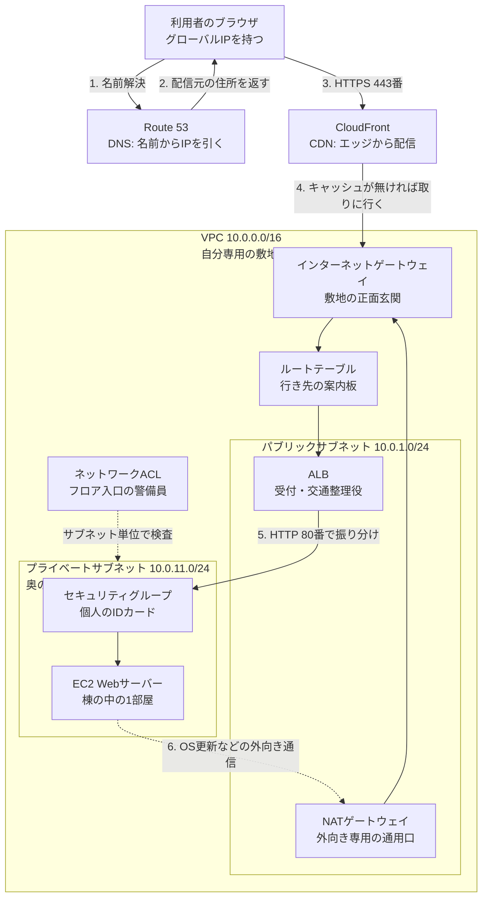

# AWS用語集 ②ネットワーク

> 📖 [用語集トップ(索引)に戻る](../02-glossary.md) ｜ [← 前: ①クラウドとAWSアカウントの基礎](01-cloud-basics.md) ｜ [次: ③コンピューティング →](03-compute.md)

## この章で扱う範囲

サーバー構築エンジニアの仕事は、「サーバーを立てること」よりも「そのサーバーに、正しい相手だけが、正しい経路でたどり着けるようにすること」に時間を使います。この章は、その土台になるネットワーク用語をまとめたページです。

前半では、AWSに限らないインターネット通信の共通言語(IPアドレス・ポート番号・TCP・DNS・HTTPS など)を扱います。後半では、それをAWS上で実際に組み立てるためのサービス(VPC・サブネット・セキュリティグループ・ALB・Route 53・CloudFront)を扱います。全10章のうち、この章がいちばん厚く、いちばん面接で問われます。

具体的には、[レベル2: EC2 Webサーバー構築](../../projects/02-ec2-web-server/README.md)でVPCをゼロから設計する場面、[レベル3: 高可用性3層構成](../../projects/03-ha-three-tier/README.md)でALBとNATゲートウェイを組む場面、[レベル1: 静的Webサイト公開](../../projects/01-static-website/README.md)でRoute 53とCloudFrontを結線する場面で、ここの用語がそのまま登場します。

> 🧠 **覚え方のコツ**: この章の全体像は「住所(IPアドレス)→名前(DNS)→敷地(VPC)→門と鍵(IGW・セキュリティグループ)→受付(ALB)→出張所(CloudFront)」の順で並んでいます。上から順に「どこに届けるか」を決め、下に行くほど「誰を通すか」「どう速くするか」の話になっていく、と覚えてください。

## この章の用語ミニ索引

| 用語 | ひとことで言うと |
|---|---|
| [IPアドレス](#ipアドレス) | ネットワーク上の機器を識別する住所の番号 |
| [プライベートIPアドレス](#プライベートipアドレス) | 組織内やVPC内だけで使える、インターネットに出られない住所 |
| [パブリックIPアドレス](#パブリックipアドレス) | インターネットから直接到達できる住所。EC2に自動割り当てできる |
| [グローバルIPアドレス](#グローバルipアドレス) | インターネット上で世界中と重複しない住所の総称 |
| [サブネットマスク](#サブネットマスク) | IPアドレスの「どこまでがネットワーク部か」を示す区切り |
| [CIDR](#cidr) | IPアドレスの範囲を `10.0.0.0/16` のようにまとめて書く表記 |
| [ポート番号](#ポート番号) | 1台のサーバーの中で通信の入り口を区別する番号 |
| [TCP](#tcp) | 確実に届けることを重視した通信の約束事 |
| [UDP](#udp) | 速さを重視し、到達確認を省いた通信の約束事 |
| [NAT](#nat) | プライベートIPをパブリックIPに変換して外と通信させる仕組み |
| [ファイアウォール](#ファイアウォール) | 通信を許可・拒否してネットワークを守る関所 |
| [レイテンシ](#レイテンシ) | リクエストを出してから応答が返り始めるまでの待ち時間 |
| [スループット](#スループット) | 単位時間あたりに処理できるデータ量 |
| [DNS](#dns) | ドメイン名をIPアドレスに変換するインターネットの電話帳 |
| [独自ドメイン](#独自ドメイン) | 自分で取得して所有する `example.com` のような名前 |
| [レジストラ](#レジストラ) | ドメインの登録・販売を行う事業者 |
| [ネームサーバー](#ネームサーバー) | そのドメインのDNS設定を預かっているサーバー |
| [TTL](#ttl) | DNSの答えを何秒間キャッシュしてよいかの有効期限 |
| [HTTP](#http) | Webページをやり取りする通信の約束事(80番) |
| [HTTPS](#https) | HTTPをTLSで暗号化した通信(443番) |
| [TLS](#tls) | 通信を暗号化し、相手が本物かを証明する仕組み |
| [HTTPステータスコード](#httpステータスコード) | リクエストの結果を3桁の数字で表す返答コード |
| [SSHプロトコル](#sshプロトコル) | サーバーへ暗号化された経路で遠隔ログインする方式(22番) |
| [キャッシュ](#キャッシュ) | 一度取得したデータを手元に置いて再利用する仕組み |
| [CDN](#cdn) | 利用者に近い拠点からコンテンツを配る配信網 |
| [VPC](#vpc) | AWS上に自分専用に区切って作る仮想ネットワーク |
| [デフォルトVPC](#デフォルトvpc) | アカウント作成時に各リージョンへ用意される既製のVPC |
| [サブネット](#サブネット) | VPCをAZ単位でさらに小さく区切った区画 |
| [パブリックサブネット](#パブリックサブネット) | IGWへの経路を持ち、インターネットと直接通信できる区画 |
| [プライベートサブネット](#プライベートサブネット) | インターネットから直接到達できない内部専用の区画 |
| [ルートテーブル](#ルートテーブル) | 宛先ごとに通信の行き先を書いた経路表 |
| [ENI](#eni) | EC2などに取り付ける仮想的なLANポート |
| [DNSホスト名](#dnsホスト名) | VPC内でホスト名を名前解決できるようにするVPCの設定 |
| [VPCフローログ](#vpcフローログ) | VPC内を流れた通信の記録を残す機能 |
| [セキュリティグループ](#セキュリティグループ) | リソース単位で通信を許可する仮想ファイアウォール |
| [ネットワークACL](#ネットワークacl) | サブネット単位で通信を許可・拒否するルール |
| [ステートフル](#ステートフル) | 行きの通信を許可すると戻りも自動で許可される性質 |
| [ステートレス](#ステートレス) | 行きと戻りに別々の許可ルールが必要な性質 |
| [インバウンド](#インバウンド) | 外から中へ入ってくる通信 |
| [アウトバウンド](#アウトバウンド) | 中から外へ出ていく通信 |
| [マイIP](#マイip) | 今アクセスしている自分のグローバルIPを自動入力する指定方法 |
| [ホワイトリスト方式](#ホワイトリスト方式) | 許可したものだけを通す考え方 |
| [インターネットゲートウェイ](#インターネットゲートウェイ) | VPCとインターネットをつなぐ正面玄関 |
| [NATゲートウェイ](#natゲートウェイ) | プライベートサブネットから外への片道通行の出口 |
| [Elastic IP](#elastic-ip) | 付け替えできる固定のパブリックIPアドレス |
| [VPCエンドポイント](#vpcエンドポイント) | インターネットを経由せずAWSサービスへ接続する入り口 |
| [AWS PrivateLink](#aws-privatelink) | VPCとサービスをAWS内部の閉じた経路でつなぐ仕組み |
| [VPCピアリング](#vpcピアリング) | 2つのVPCを1対1で相互接続する仕組み |
| [Transit Gateway](#transit-gateway) | 多数のVPCや拠点を束ねる中継ハブ |
| [ロードバランサー](#ロードバランサー) | 通信を複数のサーバーへ振り分ける装置 |
| [リバースプロキシ](#リバースプロキシ) | 利用者とサーバーの間に立ち、代理で受け答えする役 |
| [ELB](#elb) | AWSのマネージド型ロードバランサーの総称 |
| [ALB](#alb) | HTTP/HTTPSの中身を見て振り分けるロードバランサー |
| [NLB](#nlb) | TCP/UDPを高速にさばくロードバランサー |
| [ターゲットグループ](#ターゲットグループ) | ALBが振り分け先として束ねるサーバーのリスト |
| [リスナー](#リスナー) | ロードバランサーがどのポートで受け付けるかの設定 |
| [リスナールール](#リスナールール) | 条件ごとに転送先を切り替えるALBの振り分けルール |
| [ヘルスチェック](#ヘルスチェック) | 振り分け先が正常かを定期的に確認する仕組み |
| [スキーム](#スキーム) | ロードバランサーを外向きにするか内部専用にするかの区分 |
| [スティッキーセッション](#スティッキーセッション) | 同じ利用者を毎回同じサーバーへ固定する設定 |
| [クロスゾーン負荷分散](#クロスゾーン負荷分散) | AZをまたいで均等に振り分ける設定 |
| [LCU](#lcu) | ALBの従量課金を測る単位 |
| [Route 53](#route-53) | AWSのDNS・ドメイン登録サービス |
| [ホストゾーン](#ホストゾーン) | 1ドメイン分のDNSレコードを収める入れ物 |
| [Aレコード](#aレコード) | ドメイン名をIPv4アドレスに結びつけるレコード |
| [CNAMEレコード](#cnameレコード) | ドメイン名を別のドメイン名に転送する別名レコード |
| [エイリアスレコード](#エイリアスレコード) | AWSリソースを直接指せるRoute 53独自のレコード |
| [ルーティングポリシー](#ルーティングポリシー) | 同名レコードが複数あるときの返し方の方針 |
| [DNS伝播](#dns伝播) | DNSの変更が世界中に行き渡るまでの待ち時間 |
| [CloudFront](#cloudfront) | AWSのCDN。エッジ拠点から高速配信する |
| [ディストリビューション](#ディストリビューション) | CloudFrontの1サイト分の配信設定のかたまり |
| [オリジン](#オリジン) | CloudFrontが元データを取りに行く配信元 |
| [ビヘイビア](#ビヘイビア) | パスごとにキャッシュや転送先を切り替える設定 |
| [キャッシュ無効化](#キャッシュ無効化) | エッジに残る古いコピーを破棄させる操作 |
| [デフォルトルートオブジェクト](#デフォルトルートオブジェクト) | ルートURLへのアクセス時に返すファイル |
| [Viewer Protocol Policy](#viewer-protocol-policy) | 閲覧者との間でHTTP/HTTPSをどう扱うかの設定 |
| [代替ドメイン名](#代替ドメイン名) | ディストリビューションに独自ドメインを割り当てる設定 |
| [OAC](#oac) | CloudFrontだけがS3を読めるようにする現行の仕組み |
| [OAI](#oai) | OACの前身にあたる旧方式 |
| [署名付きURL](#署名付きurl) | 期限や条件付きで一時的にアクセスを許すURL |

## 2-1. インターネット通信の基礎

### IPアドレス

**正式名称**: Internet Protocol Address ｜ **読み方**: アイピーアドレス ｜ **重要度**: ★★★

**ひとことで言うと**: ネットワークにつながった機器を一意に識別するための「住所」にあたる番号です。

**たとえるなら**: マンションの各部屋に振られた「部屋番号」です。番号がなければ、郵便物(通信)をどの部屋に届ければよいか誰にもわかりません。

**もう少し詳しく**: いま広く使われているIPv4は `192.0.2.10` のように0〜255の数字4つをドットでつないだ形式で、内部的には32桁の2進数(32ビット)です。枯渇対策として128ビットのIPv6も普及が進んでいます。AWSでは、VPCを作るときにそのVPCが使うIPアドレスの範囲を[CIDR](#cidr)表記で自分で決め、その範囲の中からEC2などの各リソースへ1つずつIPアドレスが割り当てられていきます。IPアドレスには外に出られない[プライベートIPアドレス](#プライベートipアドレス)と、インターネットから到達できる[パブリックIPアドレス](#パブリックipアドレス)の2種類がある、という区別が最初の関門です。

**サーバー構築での勘所**:
- サーバー同士の通信は最終的にすべてIPアドレスで行われます。「名前でつながらない」ときは、まず名前解決([DNS](#dns))の問題なのか、IP到達性の問題なのかを切り分けます。
- VPCのIPアドレス範囲は後から縮小できないため、将来の拡張を見越して広め(例: `/16`)に取るのが定石です。
- 社内ネットワークやほかのVPCと接続する予定があるなら、IPアドレス範囲の重複を最初に避けておきます。重複は後からでは直しづらい典型的な設計ミスです。

**よくあるつまずき**: 「サーバーを再起動したらアクセスできなくなった」の多くは、自動割り当てのパブリックIPアドレスが変わったことが原因です。固定したい場合は[Elastic IP](#elastic-ip)を使います。

**関連用語**: [プライベートIPアドレス](#プライベートipアドレス)、[パブリックIPアドレス](#パブリックipアドレス)、[CIDR](#cidr)、[DNS](#dns)

**登場する案件**: [レベル2: EC2 Webサーバー構築](../../projects/02-ec2-web-server/README.md)

### プライベートIPアドレス

**読み方**: プライベートアイピーアドレス ｜ **重要度**: ★★★

**ひとことで言うと**: 組織の内部やVPCの中だけで使うことが決められていて、そのままではインターネットに出られないIPアドレスです。

**たとえるなら**: マンション内部だけで通じる「内線番号」です。外部から直接その内線にはかけられませんが、建物の中では自由に呼び出せます。

**もう少し詳しく**: `10.0.0.0/8`、`172.16.0.0/12`、`192.168.0.0/16` の3つの範囲が、私的利用向けとして世界的に予約されています。自宅のWi-Fiで機器に `192.168.x.x` が振られているのはこのためです。AWSのVPCも、原則としてこの範囲からCIDRを選んで作ります(本ポートフォリオではすべて `10.0.0.0/16` を使っています)。VPC内のEC2には必ずプライベートIPアドレスが割り当てられ、これはインスタンスを停止・再起動しても変わりません。外と通信するときは、[NATゲートウェイ](#natゲートウェイ)やパブリックIPによってグローバルな住所に変換されます。

**サーバー構築での勘所**:
- 同じVPC内の通信(EC2からRDSへの接続など)はプライベートIPで行います。わざわざインターネットに出す必要はなく、そのほうが速く・安全で・データ転送コストも抑えられます。
- サブネットのCIDRを層ごとに採番しておく(例: パブリック=`10.0.1.0/24`、アプリ=`10.0.11.0/24`、DB=`10.0.21.0/24`)と、IPアドレスを見ただけでどの層のサーバーかがわかり、障害調査が速くなります。
- オンプレミスや他社ネットワークと将来つなぐ可能性があるなら、`192.168.0.0/16` のような「よくある範囲」は避けると重複事故を減らせます。

**関連用語**: [パブリックIPアドレス](#パブリックipアドレス)、[CIDR](#cidr)、[NAT](#nat)、[プライベートサブネット](#プライベートサブネット)

**登場する案件**: [レベル3: 高可用性3層構成](../../projects/03-ha-three-tier/README.md)

### パブリックIPアドレス

**読み方**: パブリックアイピーアドレス ｜ **重要度**: ★★★

**ひとことで言うと**: インターネット側から直接到達できる、外向けのIPアドレスです。

**たとえるなら**: マンションの「代表電話番号」です。外部の人はこの番号にしかかけられません。

**もう少し詳しく**: EC2を起動するとき「パブリックIPの自動割り当て」を有効にすると、そのインスタンスにパブリックIPアドレスが1つ付きます。ただしこれは貸し出された一時的な番号で、インスタンスを停止して再起動すると別の番号に変わります。番号を固定したい場合は[Elastic IP](#elastic-ip)を使います。なお、パブリックIPアドレスはOSの中からは見えません(OSが認識しているのはプライベートIPアドレスだけで、変換はAWS側で行われます)。`ip a` や `ifconfig` にパブリックIPが出てこないのは正常な挙動です。

**サーバー構築での勘所**:
- パブリックIPを付ける=インターネットから到達可能になる、ということです。ポートスキャン(空いている入り口を機械的に探す行為)の対象になるため、付けるのは本当に必要なリソースだけに絞ります。
- [レベル3](../../projects/03-ha-three-tier/README.md)以降のように、外向きの受け口はALBだけにして、EC2はプライベートサブネットに置きパブリックIPを一切付けない、という構成が実務の基本形です。
- パブリックIPが付いていても、[ルートテーブル](#ルートテーブル)にIGWへの経路がなければ通信は成立しません。「IPがある」と「経路がある」は別の話です。

**💰 コスト**: 2024年以降、AWSではパブリックIPv4アドレスに対して使用中かどうかにかかわらず時間単価の課金が発生する体系になりました。使わないアドレスは解放するのが基本です。最新の条件は[Amazon VPCの料金](https://aws.amazon.com/jp/vpc/pricing/)と[AWS無料利用枠](https://aws.amazon.com/jp/free/)で必ず確認してください。

**関連用語**: [グローバルIPアドレス](#グローバルipアドレス)、[Elastic IP](#elastic-ip)、[インターネットゲートウェイ](#インターネットゲートウェイ)

**登場する案件**: [レベル2: EC2 Webサーバー構築](../../projects/02-ec2-web-server/README.md)

### グローバルIPアドレス

**読み方**: グローバルアイピーアドレス ｜ **重要度**: ★★

**ひとことで言うと**: インターネット上で世界中と重複しないよう管理されているIPアドレスの総称です。

**たとえるなら**: 郵便番号と番地まで含んだ「正式な住所」です。世界のどこからでも、この表記だけで配達先を特定できます。

**もう少し詳しく**: AWSの文脈では[パブリックIPアドレス](#パブリックipアドレス)とほぼ同じ意味で使われます。あえて言い分けるなら、「グローバルIPアドレス」はインターネット全体から見た一意な住所という概念を指し、「パブリックIPアドレス」はAWSがリソースに割り当てる設定項目の名前です。自宅のパソコンから見ると、自宅回線に付与されているグローバルIPアドレスが「外から見た自分の住所」になり、セキュリティグループの「[マイIP](#マイip)」はこの値を自動で拾ってくれます。

**サーバー構築での勘所**:
- 自宅や社内の回線に割り当てられるグローバルIPアドレスは、契約内容によっては再接続のたびに変わります。SSHの接続元をIPで絞る運用は、この変化に振り回されがちです。
- 固定を前提とした運用が必要なら、固定IPオプションの契約か、[Session Manager](07-monitoring-operations.md#session-manager)のようにIPに依存しない接続方式を検討します。

**関連用語**: [パブリックIPアドレス](#パブリックipアドレス)、[マイIP](#マイip)、[NAT](#nat)

### サブネットマスク

**読み方**: サブネットマスク ｜ **重要度**: ★★

**ひとことで言うと**: IPアドレスのうち「どこまでがネットワークを表す部分で、どこからが個々の機器を表す部分か」を示す区切り情報です。

**たとえるなら**: 住所の「◯◯市△△町」までが街区(ネットワーク部)、「1-2-3」が個別の家(ホスト部)という区切り線です。どこで線を引くかで、その街に何軒建てられるかが決まります。

**もう少し詳しく**: 従来は `255.255.0.0` のように書きましたが、現在は「先頭から何ビットがネットワーク部か」を数字で表す[CIDR](#cidr)表記(`/16`)が主流です。`255.255.0.0` = `/16`、`255.255.255.0` = `/24` が対応関係です。AWSのコンソールでもサブネットマスクを直接入力する場面はほとんどなく、`10.0.1.0/24` のようなCIDR表記で指定します。ただしオンプレミス機器の設定やネットワーク図では旧表記も現役なので、両方読めるようにしておくと安心です。

**サーバー構築での勘所**:
- `/24` は256個、`/26` は64個、`/28` は16個のアドレスを含みます。数字が4増えるとアドレス数は16分の1、と覚えると換算が速くなります。
- AWSではサブネットごとに先頭4つと末尾1つ、計5つのIPアドレスがAWS用に予約されます。`/28`(16個)ではEC2に使えるのは11個しかありません。

**関連用語**: [CIDR](#cidr)、[サブネット](#サブネット)、[IPアドレス](#ipアドレス)

### CIDR

**正式名称**: Classless Inter-Domain Routing ｜ **読み方**: サイダー ｜ **重要度**: ★★★

**ひとことで言うと**: IPアドレスの範囲を `10.0.0.0/16` のように「開始アドレス+ネットワーク部のビット数」でまとめて表す書き方です。

**たとえるなら**: 「/16」は町の番地の桁数です。数字が小さいほど広い範囲(部屋数が多い)を表し、VPC全体=`/16`(マンション一棟まるごと、約65,000部屋)、サブネット=`/24`(そのうちの1フロア、256部屋)というイメージになります。

**もう少し詳しく**: スラッシュの後ろの数字は「先頭から何ビットを固定するか」を意味します。`/16` なら先頭16ビットが固定で、残り16ビットが自由に使えるので約65,536個のアドレスを含みます。`/24` なら256個、`/32` は1個(特定の1アドレスを指す)です。`0.0.0.0/0` は「すべてのIPアドレス」を意味し、ルートテーブルの「インターネット向けの経路」やセキュリティグループの「どこからでも許可」で頻出します。AWSのVPCでは、VPCのCIDRに `/16` から `/28` までのサイズを指定できます。

**サーバー構築での勘所**:
- VPCのCIDRは後から縮小できません。狭く作ってしまうとサブネットを増やせなくなるため、迷ったら `10.0.0.0/16` のように広めに確保します。
- サブネットのCIDRはVPCのCIDRの内側に収め、かつサブネット同士で重ならないようにします。3オクテット目を層ごとに採番する(1番台=パブリック、11番台=アプリ、21番台=DB)と管理が楽になります。
- セキュリティグループのソースに `0.0.0.0/0` を書くのは「全世界に開放」を意味します。SSH(22番)に対してこれを書くのは危険で、面接でも必ず突っ込まれるポイントです。

**よくあるつまずき**: `/24` のサブネットに使えるIPは256個ではなく251個です(AWSが5つ予約するため)。細かく刻みすぎるとAuto Scalingでインスタンスを増やしたときにIPが枯渇します。

**関連用語**: [サブネットマスク](#サブネットマスク)、[VPC](#vpc)、[サブネット](#サブネット)、[ルートテーブル](#ルートテーブル)

**登場する案件**: [レベル2: EC2 Webサーバー構築](../../projects/02-ec2-web-server/README.md)、[レベル3: 高可用性3層構成](../../projects/03-ha-three-tier/README.md)

### ポート番号

**読み方**: ポートばんごう ｜ **重要度**: ★★★

**ひとことで言うと**: 1台のサーバーの中で「どのサービス宛ての通信か」を区別するための番号です。

**たとえるなら**: マンションの建物に付いた複数の入り口です。IPアドレスが「建物の住所」なら、ポート番号は「正面玄関(80番)」「裏口(22番)」「宅配ボックス(443番)」のような入り口の種類を指します。

**もう少し詳しく**: 番号は0〜65535まであり、0〜1023は用途が決まっている「ウェルノウンポート」です。サーバー構築でよく使うのは、22番(SSH)、80番(HTTP)、443番(HTTPS)、3306番(MySQL)、5432番(PostgreSQL)、6379番(Redis)あたりです。セキュリティグループやネットワークACLで通信を許可するときは、必ず「プロトコル+ポート番号+接続元」の3点セットで指定します。逆に言うと、サーバー側でサービスが起動していてもポートが閉じていれば通信は届きませんし、ポートを開けてもサービスが起動していなければ接続は拒否されます。

**サーバー構築での勘所**:
- 「つながらない」ときは、(1)サービスが起動しているか、(2)そのポートで待ち受けているか、(3)セキュリティグループで許可されているか、を順に確認します。
- 管理用ポート(22番など)は全世界に開放せず、必ず接続元を絞ります。
- ALBとEC2の間は80番、EC2とRDSの間は3306番、というように「層と層の間で使うポート」を設計時に一覧化しておくと、セキュリティグループの設定漏れが激減します。

> 🧠 **覚え方のコツ**: よく使う3つのポートは語呂合わせが効きます。「22番=SSH: 兄(2)に兄(2)しか教えない秘密の裏口」「80番=HTTP: は(8)お(0)っぴろげの正面玄関」「443番=HTTPS: よ(4)よ(4)さ(3)ん、鍵(暗号化)を忘れずに」。数字と役割をセットでイメージしておくと、セキュリティグループ設定のたびに迷わなくなります。

**関連用語**: [TCP](#tcp)、[セキュリティグループ](#セキュリティグループ)、[HTTP](#http)、[SSHプロトコル](#sshプロトコル)

**登場する案件**: [レベル2: EC2 Webサーバー構築](../../projects/02-ec2-web-server/README.md)

### TCP

**正式名称**: Transmission Control Protocol ｜ **読み方**: ティーシーピー ｜ **重要度**: ★★

**ひとことで言うと**: 相手と接続を確立し、届かなかったデータを再送してでも確実に届けることを重視した通信の約束事です。

**たとえるなら**: 「書留郵便」です。相手が受け取ったという確認が取れるまで送り主が責任を持ち、届かなければもう一度送ります。

**もう少し詳しく**: 通信を始める前に、送信側と受信側で「送ります」「いいですよ」「では送ります」という3回のやり取り(3ウェイハンドシェイク)を行って接続を確立します。HTTP・HTTPS・SSH・MySQLなど、サーバー構築で扱うほとんどの通信はTCPの上で動いています。セキュリティグループで「タイプ: HTTP」を選ぶと、内部的には「プロトコル: TCP、ポート: 80」が設定されます。TCPは接続の状態を持つため、[セキュリティグループ](#セキュリティグループ)の[ステートフル](#ステートフル)な動作(行きを許可すれば戻りも自動で通る)とも相性が良い仕組みです。

**サーバー構築での勘所**:
- 「接続がタイムアウトする」のと「接続が拒否される(Connection refused)」のは意味が違います。前者は途中の経路やファイアウォールで捨てられている疑い、後者は相手には届いたがそのポートで誰も待ち受けていない疑いです。
- ALBの[ヘルスチェック](#ヘルスチェック)やNLBの動作もTCPの接続確立を前提としています。

**関連用語**: [UDP](#udp)、[ポート番号](#ポート番号)、[ステートフル](#ステートフル)、[NLB](#nlb)

### UDP

**正式名称**: User Datagram Protocol ｜ **読み方**: ユーディーピー ｜ **重要度**: ★

**ひとことで言うと**: 到達確認をせず、とにかく速く送ることを優先した通信の約束事です。

**たとえるなら**: 「投げ込みのチラシ配り」です。相手が受け取ったかは確認しませんが、その分どんどん配れます。

**もう少し詳しく**: DNSの問い合わせ(53番)、時刻同期のNTP(123番)、音声・動画のリアルタイム配信などで使われます。少しくらい欠けても再送を待つより先に進んだほうが良い用途に向いています。AWSでは、[ALB](#alb)はHTTP/HTTPSしか扱えないためUDPを転送できませんが、[NLB](#nlb)はUDPリスナーに対応しています。「UDPの負荷分散が必要ならNLB」という切り分けは、面接でも問われることがあります。

**サーバー構築での勘所**:
- ネットワークACLでDNS通信を制限する場合、UDPの53番も許可しないと名前解決ができなくなります。TCPだけ開けて詰まる、は典型的な事故です。

**関連用語**: [TCP](#tcp)、[DNS](#dns)、[NLB](#nlb)、[ネットワークACL](#ネットワークacl)

### NAT

**正式名称**: Network Address Translation ｜ **読み方**: ナット ｜ **重要度**: ★★

**ひとことで言うと**: プライベートIPアドレスを外向けのパブリックIPアドレスに書き換えて、内部の機器がインターネットと通信できるようにする仕組みです。

**たとえるなら**: マンションの「代表電話での取次ぎ」です。各部屋(内線=プライベートIP)からの発信はすべて代表番号(パブリックIP)として外に出ていき、返事は取り次いで元の部屋に戻されます。

**もう少し詳しく**: NATは住所を変換するだけの一般的な技術で、家庭用ルーターの中でも同じことが行われています。AWSでこれをマネージドサービスとして提供するのが[NATゲートウェイ](#natゲートウェイ)です。ポイントは「内側から始めた通信の戻りは通すが、外から始まった通信は通さない」という非対称性で、これによりプライベートサブネットのサーバーは、外から直接触られずにOSアップデートなどの外向き通信だけを行えます。

**サーバー構築での勘所**:
- NATを通した通信は、相手から見ると送信元が全部同じIPアドレスに見えます。外部APIのIP制限を申請するときは、NATゲートウェイに紐づけた[Elastic IP](#elastic-ip)を伝えます。
- S3やDynamoDBへのアクセスだけが目的なら、NATを通さず[VPCエンドポイント](#vpcエンドポイント)を使うほうが安全で安価です。

**関連用語**: [NATゲートウェイ](#natゲートウェイ)、[プライベートサブネット](#プライベートサブネット)、[Elastic IP](#elastic-ip)

**登場する案件**: [レベル3: 高可用性3層構成](../../projects/03-ha-three-tier/README.md)

### ファイアウォール

**読み方**: ファイアウォール ｜ **重要度**: ★★

**ひとことで言うと**: 通過してよい通信と、してはいけない通信をルールで判定して制御する仕組みです。

**たとえるなら**: 建物の入口に立つ「関所」です。誰が・どの入り口から・何の用事で来たのかを見て、通すかどうかを決めます。

**もう少し詳しく**: AWSのネットワークでは、ファイアウォールの役割が層ごとに分かれています。リソース単位で守るのが[セキュリティグループ](#セキュリティグループ)、サブネット単位で守るのが[ネットワークACL](#ネットワークacl)、Webアプリケーションへの攻撃を中身まで見て止めるのが[AWS WAF](06-security-identity.md#aws-waf)です。OSの中にもLinuxのfirewalldのようなソフトウェアファイアウォールがありますが、AWSではまずセキュリティグループで制御し、OS側は必要になったときだけ触る、という順序が一般的です。

**サーバー構築での勘所**:
- 層が複数あるということは、通信が通らないときに疑う場所も複数あるということです。「セキュリティグループ→ネットワークACL→OSのファイアウォール」の順に確認すると効率的です。
- 1つの層に頼りきらず複数の層で守る考え方を[多層防御](06-security-identity.md#多層防御)と呼びます。

**関連用語**: [セキュリティグループ](#セキュリティグループ)、[ネットワークACL](#ネットワークacl)、[ホワイトリスト方式](#ホワイトリスト方式)

**登場する案件**: [レベル5: セキュリティ・監視基盤](../../projects/05-security-monitoring/README.md)

### レイテンシ

**読み方**: レイテンシ ｜ **重要度**: ★★

**ひとことで言うと**: リクエストを出してから最初の応答が返り始めるまでの待ち時間(遅延)です。

**たとえるなら**: 注文してから料理の1品目が出てくるまでの時間です。厨房の処理能力(スループット)とは別に、「待たされ感」を決めるのはこちらです。

**もう少し詳しく**: レイテンシは物理的な距離の影響を強く受けます。日本の利用者が米国リージョンのサーバーにアクセスすると、光の速度の制約だけでも往復で数十ミリ秒が加算されます。[CloudFront](#cloudfront)が速いのは、利用者に地理的に近いエッジロケーションから応答するためレイテンシが小さくなるからです。AWSではリージョン選択、AZ間通信、[ElastiCache](05-database.md#elasticache)によるDB問い合わせの削減など、レイテンシを下げる打ち手が複数用意されています。

**サーバー構築での勘所**:
- 「遅い」という報告を受けたら、レイテンシ(待ち時間)の問題なのか[スループット](#スループット)(処理量)の問題なのかをまず分けます。原因も対策もまったく異なります。
- 日本国内の利用者が中心なら、東京リージョンを選ぶだけでレイテンシの大半は解決します。

**関連用語**: [スループット](#スループット)、[CDN](#cdn)、[CloudFront](#cloudfront)

### スループット

**読み方**: スループット ｜ **重要度**: ★★

**ひとことで言うと**: 単位時間あたりに処理できるデータ量や処理件数のことです。

**たとえるなら**: 高速道路の「車線数」です。1台が目的地に着く速さ(レイテンシ)とは別に、1時間に何台さばけるかを決めます。

**もう少し詳しく**: Webシステムでは「1秒あたりのリクエスト数」や「毎秒何MB転送できるか」として現れます。スループットが足りないときの打ち手は、サーバーを増やして分散する(スケールアウト+[ALB](#alb))、読み取りを分散する([リードレプリカ](05-database.md#リードレプリカ))、そもそも問い合わせを減らす([キャッシュ](#キャッシュ)や[CDN](#cdn))などです。EC2のインスタンスタイプによってネットワーク帯域の上限が異なる点や、EBSにもスループットの上限がある点も、性能設計では見落とせません。

**サーバー構築での勘所**:
- [CloudWatch](07-monitoring-operations.md#cloudwatch)でリクエスト数・ネットワーク送受信量を継続的に取得しておくと、増強の判断材料になります。
- 「1台を強くする」よりも「複数台に分散する」ほうが、AWSでは費用対効果と可用性の両面で有利になる場面が多いです。

**関連用語**: [レイテンシ](#レイテンシ)、[ロードバランサー](#ロードバランサー)、[LCU](#lcu)

## 2-2. 名前解決とWebの基礎

### DNS

**正式名称**: Domain Name System ｜ **読み方**: ディーエヌエス ｜ **重要度**: ★★★

**ひとことで言うと**: `example.com` のような人間が読める名前を、通信に必要なIPアドレスへ変換する仕組みです。

**たとえるなら**: インターネットの「電話帳」です。相手の名前(ドメイン)を引くと、住所(IPアドレス)を教えてくれます。

**もう少し詳しく**: ブラウザにドメイン名を入力すると、まずパソコンやスマホが契約回線のDNSキャッシュサーバー(フルサービスリゾルバ)に問い合わせます。そこに答えがなければ、ルート→`.com`→`example.com` と階層をたどり、最終的にそのドメインの[ネームサーバー](#ネームサーバー)(権威DNSサーバー)から答えを受け取ります。この一連の処理を名前解決と呼びます。答えは[TTL](#ttl)の秒数だけ各所にキャッシュされるため、設定を変えてもすぐには全世界に反映されません([DNS伝播](#dns伝播))。AWSでこの権威DNSを担うサービスが[Route 53](#route-53)です。

**サーバー構築での勘所**:
- 障害調査では「名前解決はできているか」を最初に切り分けます。`dig example.com` や `nslookup example.com` で返ってくるIPアドレスが想定どおりかを確認します。
- VPCの中では、AWSが用意する内部のDNS(VPCのCIDRの先頭+2のアドレス)が使われます。RDSのエンドポイントのようなAWSのホスト名を解決するには、VPCの[DNSホスト名](#dnsホスト名)関連の設定が有効になっている必要があります。
- 名前解決の問い合わせはUDPの53番が中心で、応答が大きい場合はTCPの53番も使われます。ネットワークACLで絞る場合は両方を考慮します。

**よくあるつまずき**: 「ブラウザでは開けないがIP直打ちでは開ける」場合は、サーバーではなくDNS側の問題です。逆に「名前は引けるのに開けない」場合は、経路やファイアウォールを疑います。

**関連用語**: [Route 53](#route-53)、[Aレコード](#aレコード)、[TTL](#ttl)、[ネームサーバー](#ネームサーバー)

**登場する案件**: [レベル1: 静的Webサイト公開](../../projects/01-static-website/README.md)

### 独自ドメイン

**読み方**: どくじドメイン ｜ **重要度**: ★★

**ひとことで言うと**: 自分で取得して所有する `example.com` のようなインターネット上の名前です。

**たとえるなら**: 借りたビルの「一室の番号」ではなく、自分の会社名を掲げた「表札」です。引っ越して住所(IPアドレス)が変わっても、表札の名前は変えずに済みます。

**もう少し詳しく**: AWSのリソースには `d111111abcdef8.cloudfront.net` や `my-alb-123456.ap-northeast-1.elb.amazonaws.com` のような自動生成のドメイン名が最初から付いていますが、これは長く覚えにくく、リソースを作り直すと変わってしまいます。独自ドメインを取得して[Route 53](#route-53)で管理し、[エイリアスレコード](#エイリアスレコード)でAWSリソースに向ければ、裏側の構成が変わっても利用者に案内するURLは変わりません。HTTPS化のためのACM証明書も、独自ドメインに対して発行します。

**サーバー構築での勘所**:
- ドメインは[レジストラ](#レジストラ)から年単位で借りるもので、更新を忘れると失効します。有効期限の管理は運用タスクの1つです。
- 検証環境用に `dev.example.com` のようなサブドメインを切ると、証明書もDNSも1つのホストゾーンで管理できて効率的です。

**💰 コスト**: ドメインの取得・更新費用はトップレベルドメイン(`.com` や `.jp` など)によって異なり、Route 53のホストゾーン利用料とは別に発生します。

**関連用語**: [レジストラ](#レジストラ)、[ホストゾーン](#ホストゾーン)、[代替ドメイン名](#代替ドメイン名)

**登場する案件**: [レベル1: 静的Webサイト公開](../../projects/01-static-website/README.md)

### レジストラ

**読み方**: レジストラ ｜ **重要度**: ★★

**ひとことで言うと**: ドメイン名の登録手続きを取り扱う事業者のことです。

**たとえるなら**: 不動産の「登記を代行してくれる窓口」です。実際の台帳(レジストリ)への登録を、利用者に代わって申請してくれます。

**もう少し詳しく**: ドメインを取得するときは、いずれかのレジストラ(お名前.comなどの国内事業者や、Route 53のドメイン登録機能など)を通して申し込みます。重要なのは「ドメインをどこで買ったか」と「DNSをどこで管理するか」は別に選べるという点です。他社レジストラで取得したドメインでも、そのレジストラの管理画面で[ネームサーバー](#ネームサーバー)をRoute 53が発行した4つに書き換えれば、DNS管理だけをRoute 53に任せられます。

**サーバー構築での勘所**:
- ネームサーバーの書き換えを忘れると、Route 53にどれだけ正しくレコードを作っても外部からは一切反映されません。レベル1の案件で最も多いつまずきです。
- 登録者情報(Whois)の公開範囲や、更新の自動延長設定も確認しておきます。

**関連用語**: [独自ドメイン](#独自ドメイン)、[ネームサーバー](#ネームサーバー)、[DNS伝播](#dns伝播)

**登場する案件**: [レベル1: 静的Webサイト公開](../../projects/01-static-website/README.md)

### ネームサーバー

**読み方**: ネームサーバー ｜ **重要度**: ★★

**ひとことで言うと**: そのドメインのDNSレコードを預かり、問い合わせに答える役目のサーバーです。

**たとえるなら**: そのドメインの「電話帳の原本を持っている担当窓口」です。世界中の問い合わせは、最終的にこの窓口の回答を正解とみなします。

**もう少し詳しく**: Route 53でパブリックホストゾーンを作ると、`ns-xxx.awsdns-xx.com` のようなネームサーバー名が4つ自動的に払い出されます。この4つを、ドメインを取得した[レジストラ](#レジストラ)側の「ネームサーバー設定」に登録することで、「このドメインの問い合わせはRoute 53に聞いてください」という委任が成立します。DNSの世界では、この委任情報をNSレコードと呼びます。

**サーバー構築での勘所**:
- ホストゾーンを作り直すと、払い出されるネームサーバーの組み合わせも変わります。作り直したらレジストラ側の設定更新を忘れずに行います。
- 委任が正しく効いているかは、`dig NS example.com` の結果がRoute 53のネームサーバーになっているかで確認できます。

**よくあるつまずき**: 同じドメインのホストゾーンを誤って複数作ると、レコードを編集しても「委任されていない側」を編集していて反映されない、という混乱が起きます。

**関連用語**: [DNS](#dns)、[ホストゾーン](#ホストゾーン)、[レジストラ](#レジストラ)、[DNS伝播](#dns伝播)

**登場する案件**: [レベル1: 静的Webサイト公開](../../projects/01-static-website/README.md)

### TTL

**正式名称**: Time To Live ｜ **読み方**: ティーティーエル ｜ **重要度**: ★★

**ひとことで言うと**: DNSの答えを「何秒間キャッシュしてよいか」を指定する有効期限です。

**たとえるなら**: 電話帳のコピーに書いた「この情報は◯分間有効」という付箋です。期限が切れるまで、みんな手元のコピーを見続けます。

**もう少し詳しく**: DNSレコードごとに秒数で設定します。TTLが長い(例: 86400秒=24時間)と問い合わせ回数が減って安定しますが、変更したときの反映に最大でその時間だけかかります。逆に短くする(例: 60秒)と反映は速くなりますが、問い合わせ回数が増えます。サーバーの引っ越しやDNS切り替えを予定しているときは、作業の数日前にTTLを短くしておき、切り替え完了後に元に戻すのが定石です。なお、[エイリアスレコード](#エイリアスレコード)ではTTLを個別指定せず、AWS側が対象リソースに適した値を使います。

**サーバー構築での勘所**:
- 切り替え当日に慌ててTTLを短くしても、古いTTLで配られたキャッシュが残っている間は効果が出ません。「TTLの短縮は前もって」が鉄則です。
- CloudFrontのキャッシュ保持時間も同じ「TTL」という言葉で呼ばれます。DNSのTTLとCDNのTTLは別物なので、会話の文脈に注意します。

**関連用語**: [DNS](#dns)、[DNS伝播](#dns伝播)、[キャッシュ](#キャッシュ)、[エイリアスレコード](#エイリアスレコード)

### HTTP

**正式名称**: Hypertext Transfer Protocol ｜ **読み方**: エイチティーティーピー ｜ **重要度**: ★★★

**ひとことで言うと**: ブラウザとWebサーバーがWebページをやり取りするための約束事で、既定では80番ポートを使います。

**たとえるなら**: 店員と客の「決まった言い回しでの注文と受け渡し」です。「これをください(リクエスト)」「はいどうぞ(レスポンス)」という形式が世界共通で決まっているので、どのブラウザからでも通じます。

**もう少し詳しく**: 利用者側がGETやPOSTといったメソッドでリクエストを送り、サーバーが[HTTPステータスコード](#httpステータスコード)と本文(HTMLや画像)を返します。HTTP自体は暗号化されていないため、途中経路で内容を読まれる可能性があります。そこで現在は、[TLS](#tls)で包んだ[HTTPS](#https)を使うのが標準です。AWSでは、[ALB](#alb)がHTTPの中身(パスやホスト名、ヘッダー)を見て振り分け先を変えられる点が大きな特徴で、これはL7(アプリケーション層)での負荷分散と呼ばれます。

**サーバー構築での勘所**:
- ALBとEC2の間の通信は、内部通信としてHTTP(80番)のままにする構成がよく使われます。利用者との間だけHTTPSにして、暗号化の処理はALBやCloudFrontに任せる考え方です。
- ヘルスチェックもHTTPで行われます。`/health.html` のような軽量なファイルを用意しておくと、無駄な負荷をかけずに監視できます。

**関連用語**: [HTTPS](#https)、[HTTPステータスコード](#httpステータスコード)、[ALB](#alb)、[ポート番号](#ポート番号)

**登場する案件**: [レベル2: EC2 Webサーバー構築](../../projects/02-ec2-web-server/README.md)

### HTTPS

**正式名称**: Hypertext Transfer Protocol Secure ｜ **読み方**: エイチティーティーピーエス ｜ **重要度**: ★★★

**ひとことで言うと**: HTTPの通信を[TLS](#tls)で暗号化した、盗み見・改ざんに強い通信方式です。既定では443番ポートを使います。

**たとえるなら**: 中身が見えない「封筒に入れた手紙」です。ハガキ(HTTP)は配達経路の誰にでも読まれますが、封筒(HTTPS)なら宛先の相手しか開けられません。

**もう少し詳しく**: ブラウザのアドレスバーに鍵アイコンが出るのがHTTPSです。通信の暗号化に加えて、「このサイトは本当に `example.com` の運営者のものか」をサーバー証明書で確認する役割もあります。AWSでは[ACM](06-security-identity.md#acm)で証明書を無料で発行し、[ALB](#alb)や[CloudFront](#cloudfront)に紐づけて終端させるのが定番です。CloudFrontで使う証明書は、リージョンをus-east-1(バージニア北部)にして発行する必要がある点が最大の落とし穴です。

**サーバー構築での勘所**:
- HTTPでのアクセスは[Viewer Protocol Policy](#viewer-protocol-policy)やALBのリダイレクト設定でHTTPSへ強制転送し、平文の通信を残さないようにします。
- 証明書の期限切れはサービス停止に直結します。ACMのDNS検証で自動更新できる状態を維持しておくのが安全です。
- セキュリティグループでは、443番を `0.0.0.0/0` に開けるのが一般的です(公開Webサイトである以上、誰でも到達できる必要があるため)。

> 🧠 **覚え方のコツ**: 「443番=よ(4)よ(4)さ(3)ん、鍵を忘れずに」。HTTPSは「HTTP+S(Secure)」で、Sの正体は[TLS](#tls)による暗号化と本人確認だと覚えてください。

**関連用語**: [TLS](#tls)、[HTTP](#http)、[ACM](06-security-identity.md#acm)、[CloudFront](#cloudfront)

**登場する案件**: [レベル1: 静的Webサイト公開](../../projects/01-static-website/README.md)

### TLS

**正式名称**: Transport Layer Security ｜ **読み方**: ティーエルエス ｜ **重要度**: ★★★

**ひとことで言うと**: 通信を暗号化し、通信相手が本物であることを証明書で確認する仕組みです。

**たとえるなら**: 「身分証の提示+封筒での受け渡し」をセットにした受付手順です。相手が名乗った通りの人物か確認し、そのうえで中身を他人に見せずに渡します。

**もう少し詳しく**: 古い規格であるSSLの後継がTLSですが、現場では今も「SSL証明書」「SSL/TLS証明書」という言い方が広く使われています。ブラウザとサーバーは接続時にハンドシェイクを行い、証明書の検証と暗号鍵の共有を済ませてから本文のやり取りを始めます。AWSでは[ACM](06-security-identity.md#acm)が証明書の発行と自動更新を担い、[ALB](#alb)・[CloudFront](#cloudfront)・API Gatewayなどに紐づけて使います。ALBやCloudFrontで暗号化を解くことを「TLS終端」と呼びます。

**サーバー構築での勘所**:
- 終端をどこに置くかを設計で決めます。CloudFrontで終端して背後はHTTP、という構成が最も手軽ですが、より厳格な要件では背後の通信もHTTPSにします。
- 証明書は「ドメインに対して」発行されます。`example.com` 用の証明書で `www.example.com` にアクセスすると警告が出るため、必要なドメイン名をすべて含めて発行します。

**関連用語**: [HTTPS](#https)、[ACM](06-security-identity.md#acm)、[転送中の暗号化](06-security-identity.md#転送中の暗号化)

**登場する案件**: [レベル1: 静的Webサイト公開](../../projects/01-static-website/README.md)

### HTTPステータスコード

**読み方**: エイチティーティーピーステータスコード ｜ **重要度**: ★★★

**ひとことで言うと**: リクエストの結果をサーバーが3桁の数字で返す、共通の返答コードです。

**たとえるなら**: 受付窓口が返す「対応結果の判子」です。「受理(2xx)」「別の窓口へ(3xx)」「あなたの書類に不備(4xx)」「こちらの手違い(5xx)」と、押される判子で誰の責任かがわかります。

**もう少し詳しく**: 先頭の数字で大分類が決まります。200番台は成功、300番台はリダイレクト、400番台はリクエスト側の問題、500番台はサーバー側の問題です。サーバー構築で頻出するのは、403(権限がなく拒否。CloudFront+S3でOACやバケットポリシーが未設定のときによく出ます)、404(対象が見つからない。[デフォルトルートオブジェクト](#デフォルトルートオブジェクト)の未設定でも出ます)、502(バックエンドからの応答が不正)、503(処理可能なターゲットがいない)、504(バックエンドが時間内に応答しない)です。

**サーバー構築での勘所**:
- ALBが返す5xxは、ALB自身の問題ではなく背後のEC2が正常でない合図であることがほとんどです。まず[ターゲットグループ](#ターゲットグループ)の状態(healthy/unhealthy)を見ます。
- [CloudWatch](07-monitoring-operations.md#cloudwatch)で `HTTPCode_Target_5XX_Count` などのメトリクスにアラームを設定しておくと、利用者より先に異常に気づけます。
- 「403か404か」で原因の方向性が大きく変わります。403は権限・アクセス制御、404は経路・ファイル配置を疑います。

> 🧠 **覚え方のコツ**: 「4xxはあなた(クライアント)のせい、5xxはこっち(サーバー)のせい」。この2択をまず思い出すだけで、調査を始める場所が半分に絞れます。

**関連用語**: [HTTP](#http)、[ALB](#alb)、[ヘルスチェック](#ヘルスチェック)、[OAC](#oac)

**登場する案件**: [レベル4: WordPress本番構成](../../projects/04-wordpress-production/README.md)

### SSHプロトコル

**正式名称**: Secure Shell ｜ **読み方**: エスエスエイチ ｜ **重要度**: ★★★

**ひとことで言うと**: 手元のパソコンから離れたサーバーへ、暗号化された経路でログインしてコマンド操作するための通信方式です。既定では22番ポートを使います。

**たとえるなら**: 建物の「裏口の通用口」です。表玄関(80番/443番)は誰でも通れますが、こちらは管理者だけが鍵を持って出入りします。

**もう少し詳しく**: AWSでEC2に接続するときは、パスワードではなく公開鍵認証を使うのが標準です。EC2の起動時に指定した[キーペア](03-compute.md#キーペア)の公開鍵がサーバー側に登録され、手元の秘密鍵(`.pem` ファイル)と照合して認証します。接続コマンドは `ssh -i handson-key.pem ec2-user@<IPアドレス>` の形です。秘密鍵ファイルの権限が緩いとSSHクライアントが接続を拒否するため、`chmod 400` で自分だけが読める状態にします。近年は22番を開けずに済む[Session Manager](07-monitoring-operations.md#session-manager)経由の接続が推奨される場面も増えています。

**サーバー構築での勘所**:
- 22番のインバウンドは絶対に `0.0.0.0/0` にしないこと。インターネット上には常時ポートスキャンを行うボットがおり、開けていれば短時間で総当たり攻撃の標的になります。必ず[マイIP](#マイip)などに絞ります。
- 接続できないときは「自分側(IP・鍵)→[セキュリティグループ](#セキュリティグループ)→[ルートテーブル](#ルートテーブル)→[インターネットゲートウェイ](#インターネットゲートウェイ)」の順に、近いところから疑うと早く原因にたどり着けます。
- 秘密鍵は再発行できません。紛失するとそのキーペアで作ったインスタンスには入れなくなります。

**関連用語**: [ポート番号](#ポート番号)、[マイIP](#マイip)、[SSH公開鍵認証](09-linux-server-basics.md#ssh公開鍵認証)、[セキュリティグループ](#セキュリティグループ)

**登場する案件**: [レベル2: EC2 Webサーバー構築](../../projects/02-ec2-web-server/README.md)

### キャッシュ

**読み方**: キャッシュ ｜ **重要度**: ★★

**ひとことで言うと**: 一度取得したデータを近い場所に保存しておき、次回は元まで取りに行かずに再利用する仕組みです。

**たとえるなら**: 「よく聞かれる質問への回答を付箋にメモしておく受付係」です。毎回奥の担当者に確認しに行かず、手元のメモで即答できます。

**もう少し詳しく**: キャッシュはネットワークのあらゆる層に存在します。ブラウザのキャッシュ、DNSキャッシュ([TTL](#ttl))、CDNのエッジキャッシュ([CloudFront](#cloudfront))、アプリとDBの間のキャッシュ([ElastiCache](05-database.md#elasticache))などです。共通する効果は「応答が速くなる」「元のサーバーの負荷が下がる」の2つ、共通する副作用は「古い内容が返り続けることがある」の1つです。

**サーバー構築での勘所**:
- 「更新したのに反映されない」と感じたら、どの層のキャッシュを見ているのかを切り分けます。ブラウザのシークレットウィンドウで確認する、CloudFrontで[キャッシュ無効化](#キャッシュ無効化)を実行する、という順で試すのが定石です。
- 静的ファイル(画像・CSS)は長めに、頻繁に変わるHTMLは短めに、と保持時間を使い分けます。

**関連用語**: [CDN](#cdn)、[CloudFront](#cloudfront)、[キャッシュ無効化](#キャッシュ無効化)、[TTL](#ttl)

**登場する案件**: [レベル4: WordPress本番構成](../../projects/04-wordpress-production/README.md)

### CDN

**正式名称**: Content Delivery Network ｜ **読み方**: シーディーエヌ ｜ **重要度**: ★★★

**ひとことで言うと**: 世界中に置いた配信拠点にコンテンツのコピーを配り、利用者に最も近い拠点から届ける仕組みです。

**たとえるなら**: 「町ごとにある出張コンビニ」です。本店(オリジン)まで買いに行かなくても、近所の店舗で同じ商品を受け取れるので速く済みます。

**もう少し詳しく**: 利用者からのリクエストは、まず近くのエッジロケーション(配信拠点)に届きます。そこにコピーがあれば即座に返し(キャッシュヒット)、なければ元の[オリジン](#オリジン)へ取りに行って、返しつつ手元にも保存します。効果は3つあり、(1)距離が縮まるので[レイテンシ](#レイテンシ)が下がる、(2)オリジンへのアクセス回数が減って負荷とデータ転送量が下がる、(3)配信をCDNに集約することでHTTPS強制やアクセス制御を1か所で効かせられる、というものです。AWSのCDNが[CloudFront](#cloudfront)です。

**サーバー構築での勘所**:
- 画像・CSS・JavaScriptのような静的ファイルほどCDNの効果が大きく、利用者ごとに内容が変わる動的なページは効果が限定的です。[レベル4](../../projects/04-wordpress-production/README.md)では、画像だけをS3+CloudFrontに逃がし、動的処理はALB経由でEC2に任せる構成を取っています。
- CDNを挟むと、Webサーバーのアクセスログに記録される接続元がCDNのIPになります。利用者の本来のIPを知りたい場合は `X-Forwarded-For` ヘッダーを参照します。

**💰 コスト**: 配信データ量とリクエスト数に応じた従量課金です。オリジンからの転送が減るぶん、全体では安くなることもあります。最新の料金・無料利用枠の条件は必ず公式ページで確認してください([AWS無料利用枠](https://aws.amazon.com/jp/free/))。

**関連用語**: [CloudFront](#cloudfront)、[キャッシュ](#キャッシュ)、[オリジン](#オリジン)、[レイテンシ](#レイテンシ)

**登場する案件**: [レベル1: 静的Webサイト公開](../../projects/01-static-website/README.md)

## 2-3. VPCと内部構造

### VPC

**正式名称**: Virtual Private Cloud ｜ **読み方**: ブイピーシー ｜ **重要度**: ★★★

**ひとことで言うと**: AWS上に自分専用に区切って作る、仮想的なネットワークです。

**たとえるなら**: マンションの「敷地」です。この敷地の中に建物(サブネット)を建て、正面玄関([インターネットゲートウェイ](#インターネットゲートウェイ))を付けていきます。

**もう少し詳しく**: VPCはリージョン単位で作成し、複数の[アベイラビリティゾーン](01-cloud-basics.md#アベイラビリティゾーン)にまたがることができます。作成時に決めるのは、そのVPCが使うIPアドレスの範囲([CIDR](#cidr))だけです。作った直後のVPCは外部とまったくつながっていない「密室」で、そこにサブネット・インターネットゲートウェイ・ルートテーブル・セキュリティグループを自分で足していくことで、はじめて通信が成立します。EC2・RDS・ElastiCache・ALBなど、ネットワークの中に置く多くのサービスはVPC内に配置されます。VPCのCIDRには `/16` から `/28` までのサイズを指定できます。

**サーバー構築での勘所**:
- 通信が成立する条件は4つセットです。(1)IGWがVPCにアタッチされている、(2)ルートテーブルに `0.0.0.0/0` → IGWの経路があり対象サブネットに関連付けられている、(3)リソースにパブリックIPまたはEIPがある、(4)セキュリティグループで該当ポートが許可されている。どれか1つでも欠けると通信できません。
- 本番・検証・開発をVPCごと分ける「環境分離」は、事故の影響範囲を閉じ込める基本の設計です。
- 作成後にCIDRを縮小することはできません(追加のCIDRブロックを足して広げることは可能です)。最初の設計が効いてきます。

**よくあるつまずき**: 「EC2は起動しているのにブラウザで開けない」の大半は、VPCそのものではなくルートテーブルかセキュリティグループの設定漏れです。上の4条件を順に確認するのが最短ルートです。

**💰 コスト**: VPC・サブネット・ルートテーブル・IGW自体の作成に料金はかかりません。課金が発生するのは[NATゲートウェイ](#natゲートウェイ)、インターフェイス型の[VPCエンドポイント](#vpcエンドポイント)、パブリックIPv4アドレス、AZをまたぐデータ転送などです。

**関連用語**: [サブネット](#サブネット)、[CIDR](#cidr)、[ルートテーブル](#ルートテーブル)、[インターネットゲートウェイ](#インターネットゲートウェイ)

**登場する案件**: [レベル2: EC2 Webサーバー構築](../../projects/02-ec2-web-server/README.md)、[レベル3: 高可用性3層構成](../../projects/03-ha-three-tier/README.md)

### デフォルトVPC

**読み方**: デフォルトブイピーシー ｜ **重要度**: ★★

**ひとことで言うと**: AWSアカウントを作ると各リージョンにあらかじめ用意されている、すぐ使える設定済みのVPCです。

**たとえるなら**: 家具・家電が最初から付いている「即入居可のワンルーム」です。すぐ住めますが、間取りは自分で決められません。

**もう少し詳しく**: デフォルトVPCには `172.31.0.0/16` のCIDRが割り当てられ、各AZにパブリックサブネットが用意され、インターネットゲートウェイとルートテーブルも設定済みです。EC2を起動すればそのままインターネットに公開できるため、学習の第一歩や動作確認には便利です。一方で、すべてのサブネットがパブリックである・CIDRが自分の設計と合わない・他ネットワークとIPが重複しやすい、といった理由から、実務ではVPCを自作するのが一般的です。

**サーバー構築での勘所**:
- 「なぜデフォルトVPCを使わなかったのか」は面接の定番質問です。IPアドレス設計の自由度、パブリック/プライベートの分離、既存ネットワークとの重複回避、という3点で答えられるようにしておきます。
- デフォルトVPCは削除もできますが、削除すると一部のサービスが「VPC未指定でも動く」前提を失います。学習中は無理に消さないほうが安全です。

**関連用語**: [VPC](#vpc)、[パブリックサブネット](#パブリックサブネット)、[CIDR](#cidr)

**登場する案件**: [レベル2: EC2 Webサーバー構築](../../projects/02-ec2-web-server/README.md)

### サブネット

**読み方**: サブネット ｜ **重要度**: ★★★

**ひとことで言うと**: VPCの中をさらに小さく区切った、1つのAZに属するネットワークの区画です。

**たとえるなら**: 敷地(VPC)の中に建てた「棟」です。棟ごとに用途(店舗・事務所・倉庫)を決め、その中に部屋(EC2)を置いていきます。

**もう少し詳しく**: サブネットは必ず1つのAZに属します。したがって「複数AZに分散する」とは「複数のサブネットを別々のAZに作り、そこにリソースを配置する」ということです。サブネットは、関連付けた[ルートテーブル](#ルートテーブル)の内容によって[パブリックサブネット](#パブリックサブネット)にも[プライベートサブネット](#プライベートサブネット)にもなります。名前の付け方で決まるわけではない、という点が初学者のつまずきどころです。各サブネットでは、先頭4つと末尾1つの計5つのIPアドレスがAWS用に予約されます。

**サーバー構築での勘所**:
- ALBは、少なくとも2つのAZのサブネットを指定する必要があります。RDSのMulti-AZにも、異なるAZの2つ以上のサブネットを含むDBサブネットグループが必要です。「AZをまたいで2つ」は冗長化の合言葉です。
- 用途ごとにサブネットを分けると、[ルートテーブル](#ルートテーブル)と[ネットワークACL](#ネットワークacl)を層単位で切り替えられます。[レベル3](../../projects/03-ha-three-tier/README.md)では2AZ×3層=6サブネットで構成しています。
- Auto Scalingで台数が増える層のサブネットは、IPが枯渇しないよう余裕を持ったサイズにします。

**関連用語**: [VPC](#vpc)、[CIDR](#cidr)、[アベイラビリティゾーン](01-cloud-basics.md#アベイラビリティゾーン)、[ルートテーブル](#ルートテーブル)

**登場する案件**: [レベル2: EC2 Webサーバー構築](../../projects/02-ec2-web-server/README.md)、[レベル3: 高可用性3層構成](../../projects/03-ha-three-tier/README.md)

### パブリックサブネット

**読み方**: パブリックサブネット ｜ **重要度**: ★★★

**ひとことで言うと**: ルートテーブルにインターネットゲートウェイへの経路があり、インターネットと直接通信できるサブネットです。

**たとえるなら**: 「道路に面した1階の店舗」、あるいは誰でも入れる「受付ロビー」です。外から人が入ってくることを前提にした区画です。

**もう少し詳しく**: 「パブリック」という属性のスイッチがあるわけではありません。そのサブネットに関連付けたルートテーブルに `0.0.0.0/0` → [インターネットゲートウェイ](#インターネットゲートウェイ) というルートが書かれていれば、それがパブリックサブネットです。ここに置くのは、外部からの通信を最初に受ける[ALB](#alb)、外向き通信の出口となる[NATゲートウェイ](#natゲートウェイ)、そして踏み台サーバーなど、外部との接点になるリソースに限定します。アプリケーションサーバーやデータベースは置きません。

**サーバー構築での勘所**:
- サブネットの設定で「パブリックIPv4アドレスの自動割り当て」を有効にしておくと、そこで起動したEC2に自動でパブリックIPが付きます。
- パブリックサブネットに置くものは最小限にするのが鉄則です。置いた数だけインターネットに面した攻撃対象が増えます。

**よくあるつまずき**: 名前を `public-1a` にしただけでは何も変わりません。ルートテーブルの関連付けまで行って、はじめて「名実ともにパブリック」になります。

**関連用語**: [プライベートサブネット](#プライベートサブネット)、[インターネットゲートウェイ](#インターネットゲートウェイ)、[ルートテーブル](#ルートテーブル)

**登場する案件**: [レベル2: EC2 Webサーバー構築](../../projects/02-ec2-web-server/README.md)

### プライベートサブネット

**読み方**: プライベートサブネット ｜ **重要度**: ★★★

**ひとことで言うと**: インターネットゲートウェイへの経路を持たず、インターネットから直接到達できないサブネットです。

**たとえるなら**: 「奥にある事務所・倉庫」、あるいは社員証がないと入れない「バックヤード」です。

**もう少し詳しく**: アプリケーションを動かすEC2や、データを持つRDS・ElastiCacheは、原則としてプライベートサブネットに置きます。外から直接到達できないので、攻撃者はまずALBという1枚目の壁を突破しない限りサーバーに触れません。ただし、OSアップデートや外部APIの呼び出しのように「中から外へ」の通信が必要になる場面はあります。その出口を提供するのが[NATゲートウェイ](#natゲートウェイ)で、パブリックサブネット側に置いたNATへ向かう `0.0.0.0/0` のルートをプライベート用ルートテーブルに書きます。

**サーバー構築での勘所**:
- DB層のサブネットには、あえてインターネットへの経路(NATへのルート)を持たせない設計もよく採られます。[レベル3](../../projects/03-ha-three-tier/README.md)のDBサブネットがこの方針です。
- プライベートサブネットのEC2にログインするには、踏み台サーバーか[Session Manager](07-monitoring-operations.md#session-manager)を使います。後者は22番ポートも鍵も不要で、実務でも推奨されます。
- S3へのアクセスだけならNATを経由せず[VPCエンドポイント](#vpcエンドポイント)を使うと、安全かつNATのデータ処理料金を節約できます。

**関連用語**: [パブリックサブネット](#パブリックサブネット)、[NATゲートウェイ](#natゲートウェイ)、[VPCエンドポイント](#vpcエンドポイント)

**登場する案件**: [レベル3: 高可用性3層構成](../../projects/03-ha-three-tier/README.md)

### ルートテーブル

**読み方**: ルートテーブル ｜ **重要度**: ★★★

**ひとことで言うと**: 「この宛先に向かう通信はここへ送る」という経路の一覧表です。

**たとえるなら**: マンションの「案内板」です。行き先ごとにどの出口を使えばよいかが書かれており、これがないと玄関があっても辿り着けません。

**もう少し詳しく**: 1つのルートテーブルには複数のルート(宛先CIDRとターゲットの組)を書けます。VPCを作ると、そのVPCのCIDR宛ての通信をVPC内部で処理する `local` ルートが自動的に入ります。これは削除できず、VPC内の通信は常に成立します。そこに `0.0.0.0/0` → IGW(パブリック用)や `0.0.0.0/0` → NATゲートウェイ(プライベート用)を追記して、外への出口を定義します。複数のルートが該当する場合は、より細かく指定された(プレフィックスが長い)ルートが優先されます。ルートテーブルはサブネットに関連付けて初めて効きます。

**サーバー構築での勘所**:
- パブリック用とプライベート用でルートテーブルを分け、それぞれ関連付けるサブネットを明示的に指定します。関連付けを忘れたサブネットは、VPCのメインルートテーブルの内容に従うため、意図しない挙動になりがちです。
- 「IGWはあるのに外に出られない」ときは、ほぼ確実にルートテーブルか関連付けの漏れです。
- [VPCエンドポイント](#vpcエンドポイント)(ゲートウェイ型)を作ると、S3宛ての通信をエンドポイントに向けるルートがルートテーブルに追加されます。

**関連用語**: [インターネットゲートウェイ](#インターネットゲートウェイ)、[NATゲートウェイ](#natゲートウェイ)、[サブネット](#サブネット)、[CIDR](#cidr)

**登場する案件**: [レベル2: EC2 Webサーバー構築](../../projects/02-ec2-web-server/README.md)

### ENI

**正式名称**: Elastic Network Interface ｜ **読み方**: イーエヌアイ ｜ **重要度**: ★★

**ひとことで言うと**: EC2などに取り付ける、仮想的なネットワークカード(LANポート)です。

**たとえるなら**: 部屋の壁に付いている「LANの差込口」です。部屋(EC2)そのものではなく、この差込口に住所(IP)と入館ルール(セキュリティグループ)が紐づいています。

**もう少し詳しく**: EC2を起動すると、必ず1つ以上のENIが作られてインスタンスに接続されます。プライベートIPアドレス、パブリックIPアドレス、MACアドレス、そして[セキュリティグループ](#セキュリティグループ)は、実際にはインスタンスではなくENIに紐づいています。ENIを持つのはEC2だけではありません。[ALB](#alb)・[NATゲートウェイ](#natゲートウェイ)・インターフェイス型の[VPCエンドポイント](#vpcエンドポイント)・RDS・Lambda(VPC接続時)なども、サブネット内にENIを作って通信します。「サブネットのIPを消費しているのは誰か」を考えるとき、この視点が効きます。

**サーバー構築での勘所**:
- ENIはインスタンスから切り離して別のインスタンスに付け替えられるため、IPアドレスを維持したままの切り替えにも使えます。
- VPCやサブネットを削除しようとして「まだ使用中」と怒られるときは、どこかにENIが残っています。ALBやNATゲートウェイの削除直後は解放に少し時間がかかるので、数分待ってから再試行します。

**関連用語**: [セキュリティグループ](#セキュリティグループ)、[プライベートIPアドレス](#プライベートipアドレス)、[サブネット](#サブネット)

**登場する案件**: [レベル3: 高可用性3層構成](../../projects/03-ha-three-tier/README.md)

### DNSホスト名

**読み方**: ディーエヌエスホストめい ｜ **重要度**: ★★

**ひとことで言うと**: VPCの中でホスト名による名前解決を使えるようにするための、VPC単位の設定項目です。

**たとえるなら**: 建物の中に「内線番号案内」を置くかどうかのスイッチです。オンにしておくと、部屋番号を知らなくても名前で呼び出せます。

**もう少し詳しく**: VPCには「DNS解決(enableDnsSupport)」と「DNSホスト名(enableDnsHostnames)」という2つの設定があります。前者はAWSが提供する内部DNSサーバーを使うかどうか、後者はVPC内のインスタンスにAWSのホスト名を割り当てるかどうかを決めます。RDSのエンドポイント名やインターフェイス型[VPCエンドポイント](#vpcエンドポイント)のプライベートDNS名を解決するには、これらが有効になっている必要があります。自分でVPCを作った場合、DNSホスト名は既定で無効になることがあるため、有効化を忘れないようにします。

**サーバー構築での勘所**:
- 「RDSのエンドポイント名で接続できないが、IPアドレスなら接続できる」ときは、この設定を真っ先に確認します。
- [VPCエンドポイント](#vpcエンドポイント)のプライベートDNSを使う構成では必須です。無効のままだと、通信は公衆側のエンドポイント名に解決されてしまいます。

**関連用語**: [DNS](#dns)、[VPC](#vpc)、[VPCエンドポイント](#vpcエンドポイント)、[DBエンドポイント](05-database.md#dbエンドポイント)

### VPCフローログ

**読み方**: ブイピーシーフローログ ｜ **重要度**: ★★

**ひとことで言うと**: VPC内のネットワークインターフェイスを出入りした通信の記録(送信元・宛先・ポート・許可/拒否など)を残す機能です。

**たとえるなら**: 建物の「入退室記録簿」です。誰がいつどの扉を通ろうとして、通れたのか弾かれたのかが残ります。中で何を話したか(通信の中身)までは記録されません。

**もう少し詳しく**: VPC単位・サブネット単位・ENI単位のいずれかで有効化でき、出力先は[CloudWatch Logs](07-monitoring-operations.md#cloudwatch-logs)やS3を選べます。各レコードにはACCEPT(許可された)かREJECT(拒否された)かが記録されるため、「セキュリティグループで弾かれているのか、そもそも届いていないのか」の切り分けに絶大な効果があります。[GuardDuty](06-security-identity.md#guardduty)は、このフローログやDNSログを裏側で分析して不審な通信を検知します。

**サーバー構築での勘所**:
- 通信トラブルの調査では、まずREJECTのレコードを探します。どのポートがどこで弾かれているかが一目でわかります。
- ペイロード(通信の中身)は記録されないため、これだけでアプリケーションの不具合は追えません。アプリログとの併用が前提です。

**💰 コスト**: フローログ自体の有効化に料金はかかりませんが、出力先(CloudWatch LogsやS3)の保存・取り込み料金が発生します。対象を絞る、保持期間を決める、といった運用が必要です。

**関連用語**: [セキュリティグループ](#セキュリティグループ)、[ネットワークACL](#ネットワークacl)、[GuardDuty](06-security-identity.md#guardduty)

**登場する案件**: [レベル5: セキュリティ・監視基盤](../../projects/05-security-monitoring/README.md)

## 2-4. 通信制御(セキュリティグループとネットワークACL)

### セキュリティグループ

**読み方**: セキュリティグループ(SG) ｜ **重要度**: ★★★

**ひとことで言うと**: EC2やRDSなどのリソース単位で「どこからの、どのポートへの通信を許可するか」を定める仮想ファイアウォールです。

**たとえるなら**: 「個人につけるIDカード」です。入室が許可されていれば退室も自動でOK([ステートフル](#ステートフル))という点が、フロア入口の警備員(ネットワークACL)との一番の違いです。

**もう少し詳しく**: 正確にはリソースではなく[ENI](#eni)に付きます。1つのENIに複数のSGを付けることもでき、その場合はすべてのSGの許可ルールを足し合わせた集合が許可範囲になります。ルールには許可(Allow)しか書けず、拒否(Deny)は書けません。新規作成時のインバウンドは「すべて拒否(何も書かれていない)」、アウトバウンドは「すべて許可」が既定です。ソースにはCIDRのほか、別のセキュリティグループのIDを指定できます。これが実務で最も強力な使い方です。

**サーバー構築での勘所**:
- ソースにIPアドレスではなく「前段のSG」を指定します。ALB用SG → アプリ用SG → DB用SG と数珠つなぎにすれば、Auto Scalingでインスタンスが増減してIPが変わってもルールを書き換える必要がありません。合言葉は「IPを覚えるな、SGを信頼せよ」です。
- SSHの22番は必ず[マイIP](#マイip)などに絞ります。80番・443番は公開サービスなら `0.0.0.0/0` で構いません。
- 通信が通らないときは「着信側のSG」を最初に疑います。ALB→EC2で詰まったらEC2側、EC2→RDSで詰まったらRDS側です。

**よくあるつまずき**: セキュリティグループはステートフルなので、戻りの通信のためにアウトバウンドを追加する必要はありません。「戻りが通らないのでは」と余計な穴を開けてしまうのが初心者のよくある行動です。

**💰 コスト**: セキュリティグループ自体は無料です。

**関連用語**: [ネットワークACL](#ネットワークacl)、[ステートフル](#ステートフル)、[インバウンド](#インバウンド)、[ホワイトリスト方式](#ホワイトリスト方式)

**登場する案件**: [レベル2: EC2 Webサーバー構築](../../projects/02-ec2-web-server/README.md)、[レベル3: 高可用性3層構成](../../projects/03-ha-three-tier/README.md)

### ネットワークACL

**正式名称**: Network Access Control List ｜ **読み方**: ネットワークエーシーエル(NACL、ナックル) ｜ **重要度**: ★★

**ひとことで言うと**: サブネット単位で通信を許可・拒否する、番号付きのルール一覧です。

**たとえるなら**: 「フロア入口に立つ警備員」です。入るときも出るときも毎回チェックされます([ステートレス](#ステートレス))。

**もう少し詳しく**: セキュリティグループとの決定的な違いは3つあります。(1)適用単位がサブネット、(2)拒否(Deny)ルールを書ける、(3)ステートレスなので行きと戻りの両方にルールが必要。ルールは番号の若い順に評価され、最初に一致したルールが適用されます(以降は評価されません)。デフォルトNACLはインバウンド・アウトバウンドともすべて許可の状態で、自分で新規作成したカスタムNACLはすべて拒否から始まります。

**サーバー構築での勘所**:
- 通常のWebシステムでは、まずセキュリティグループで制御し、NACLはデフォルト(全許可)のままにする構成が一般的です。両方で細かく制御すると、障害調査が難しくなります。
- NACLを絞る場合は、戻りの通信に使われるエフェメラルポート(一般に1024番以降の高い番号。範囲はOSやサービスによって異なります)の許可を忘れないでください。ここが最大のハマりどころです。
- 「特定のIPからの攻撃を今すぐ遮断したい」というときは、拒否ルールを書けるNACLが有効です。SGでは拒否を表現できません。

| 観点 | セキュリティグループ | ネットワークACL |
|---|---|---|
| 適用単位 | ENI(EC2やRDSなど「モノ」)単位 | サブネット単位 |
| ルールの種類 | 許可のみ | 許可と拒否の両方 |
| 状態管理 | ステートフル(戻りは自動許可) | ステートレス(戻りにも明示的なルールが必要) |
| 評価方法 | すべてのルールを合算して評価 | 番号の若い順に評価し、最初に一致したもので確定 |
| 既定の挙動 | インバウンド全拒否/アウトバウンド全許可 | デフォルトNACLは全許可、カスタムNACLは全拒否 |

> 🧠 **覚え方のコツ**: セキュリティグループは「一人ひとりに配るIDカード」、NACLは「建物の入口に立つ警備員」です。IDカード(SG)は「入れたら出るのも自由(ステートフル)」、警備員(NACL)は「入るときも出るときも毎回チェック(ステートレス)」と覚えましょう。

**関連用語**: [セキュリティグループ](#セキュリティグループ)、[ステートレス](#ステートレス)、[サブネット](#サブネット)、[ファイアウォール](#ファイアウォール)

### ステートフル

**読み方**: ステートフル ｜ **重要度**: ★★★

**ひとことで言うと**: 行きの通信を許可すると、その応答(戻り)の通信も自動的に許可される性質です。

**たとえるなら**: 「入館証で入った人は、そのまま退館できる」運用です。出るときにもう一度手続きをする必要はありません。

**もう少し詳しく**: [セキュリティグループ](#セキュリティグループ)がこの方式です。通信の状態(コネクション)を覚えているため、インバウンドで80番を許可すれば、その応答パケットはアウトバウンドのルールに関係なく戻れます。逆に、EC2から外部へ出ていく通信(OSアップデートなど)を許可した場合も、その応答は自動的に戻ってこられます。この性質のおかげで、ルールが「行き」の分だけで済み、設定量が半分になります。

**サーバー構築での勘所**:
- SGのアウトバウンドを既定の「すべて許可」から絞る場合でも、戻りの通信のことは考えなくて構いません。考えるのは「このサーバーが自分から外へ出す通信は何か」だけです。
- 「ステートフル=SG、ステートレス=NACL」の対比は面接の頻出ポイントです。

**関連用語**: [ステートレス](#ステートレス)、[セキュリティグループ](#セキュリティグループ)、[TCP](#tcp)

### ステートレス

**読み方**: ステートレス ｜ **重要度**: ★★★

**ひとことで言うと**: 行きと戻りをそれぞれ独立して判定するため、両方向にルールが必要になる性質です。

**たとえるなら**: 「入るときも出るときも毎回身分証を提示する」運用です。入館の記録は退館時の判断に使われません。

**もう少し詳しく**: [ネットワークACL](#ネットワークacl)がこの方式です。インバウンドで80番を許可しても、応答を返すためのアウトバウンド許可(戻り先のエフェメラルポート向け)を別途書かないと、通信は成立しません。なお、Webアプリケーションの世界でも「ステートレスなアプリ設計」という言い方をしますが、そちらは「サーバー側にセッション状態を持たせない設計」を指す別の概念です([スティッキーセッション](#スティッキーセッション)や[③コンピューティング編](03-compute.md)も参照してください)。

**サーバー構築での勘所**:
- NACLで通信を絞ったあとに「片方向だけ通らない」現象が起きたら、まず戻りのルールを疑います。
- ステートレスな制御は、状態を持たないぶん高速でシンプルですが、設定ミスに気づきにくいという運用上のコストがあります。

**関連用語**: [ステートフル](#ステートフル)、[ネットワークACL](#ネットワークacl)

### インバウンド

**読み方**: インバウンド ｜ **重要度**: ★★★

**ひとことで言うと**: 外部から自分側へ入ってくる方向の通信のことです。

**たとえるなら**: 建物への「来訪」です。誰を中に入れるかを決めるのがインバウンドルールです。

**もう少し詳しく**: セキュリティグループやネットワークACLの設定画面は、必ずインバウンドとアウトバウンドに分かれています。Webサーバーであれば、利用者からのHTTP(80番)・HTTPS(443番)、管理者からのSSH(22番)がインバウンドの代表例です。「タイプ(HTTP/SSHなど)」「プロトコル(TCP/UDP)」「ポート範囲」「ソース(接続元のCIDRまたはSG)」の4項目を指定します。新規作成したセキュリティグループのインバウンドは空(=すべて拒否)から始まるため、必要な穴だけを自分で開けていくことになります。

**サーバー構築での勘所**:
- インバウンドの設計は「誰から受けるか」を先に決めるのがコツです。利用者からか、ALBからか、アプリ層からか。ソース欄にその答えを書きます。
- 開けたポートの一覧は、そのままシステムの攻撃面(狙われうる入り口)の一覧です。定期的に棚卸しします。

**関連用語**: [アウトバウンド](#アウトバウンド)、[セキュリティグループ](#セキュリティグループ)、[ポート番号](#ポート番号)

**登場する案件**: [レベル2: EC2 Webサーバー構築](../../projects/02-ec2-web-server/README.md)

### アウトバウンド

**読み方**: アウトバウンド ｜ **重要度**: ★★

**ひとことで言うと**: 自分側から外部へ出ていく方向の通信のことです。

**たとえるなら**: 建物からの「外出」です。中の人がどこへ買い物に行ってよいかを決めるのがアウトバウンドルールです。

**もう少し詳しく**: セキュリティグループのアウトバウンドは、既定で「すべての宛先へすべて許可」になっています。OSのアップデート、外部APIの呼び出し、S3へのアップロードなどはこの経路を通ります。セキュリティ要件が厳しい環境では、アウトバウンドも必要な宛先だけに絞ります(情報の持ち出しや、侵入後の外部への通信を防ぐため)。ただし絞りすぎると、パッケージ更新や[Systems Manager](07-monitoring-operations.md#systems-manager)との通信が止まって運用不能になるので、段階的に進めます。

**サーバー構築での勘所**:
- プライベートサブネットのEC2がアウトバウンド通信を行うには、SGの許可だけでなく[NATゲートウェイ](#natゲートウェイ)などの経路も必要です。「許可」と「経路」は別物です。
- アウトバウンドを絞る場合、宛先IPが変動するAWSサービスにはプレフィックスリストや[VPCエンドポイント](#vpcエンドポイント)を使うと管理しやすくなります。

**関連用語**: [インバウンド](#インバウンド)、[NATゲートウェイ](#natゲートウェイ)、[ステートフル](#ステートフル)

### マイIP

**読み方**: マイアイピー ｜ **重要度**: ★★

**ひとことで言うと**: セキュリティグループのソース欄で選ぶと、いま操作している自分のグローバルIPアドレスを自動で入力してくれる指定方法です。

**たとえるなら**: 入館申請書の「現住所」欄を、受付が自動で埋めてくれるボタンです。

**もう少し詳しく**: AWSマネジメントコンソール(ブラウザからAWSの各サービスを操作できる管理画面)のセキュリティグループ設定画面で「マイIP」を選ぶと、`203.0.113.25/32` のように自分のアドレス1つだけに絞ったCIDRが入力されます。`/32` は「このIPアドレスちょうど1つ」を意味します。SSH(22番)やデータベースの管理接続など、自分だけが使う通信の接続元として指定するのが典型的な使い方です。

**サーバー構築での勘所**:
- 自宅や社内の回線は、再接続やしばらく時間が経つとグローバルIPが変わることがあります。「昨日までSSHできたのに突然できない」の最有力容疑者です。まず現在のIPと登録済みのIPを比べます。
- IPの変動に振り回されたくない場合は、[Session Manager](07-monitoring-operations.md#session-manager)でIPに依存しない接続に切り替えるのが根本解決です。

**関連用語**: [グローバルIPアドレス](#グローバルipアドレス)、[セキュリティグループ](#セキュリティグループ)、[SSHプロトコル](#sshプロトコル)

**登場する案件**: [レベル2: EC2 Webサーバー構築](../../projects/02-ec2-web-server/README.md)

### ホワイトリスト方式

**読み方**: ホワイトリストほうしき(許可リスト方式) ｜ **重要度**: ★★

**ひとことで言うと**: 「危険なものを弾く」のではなく「許可したものだけを通す」という考え方です。

**たとえるなら**: 「招待状を持っている人だけ入れるパーティー」です。招かれざる客の名簿を作るのではなく、招いた人の名簿だけを作ります。

**もう少し詳しく**: [セキュリティグループ](#セキュリティグループ)は許可ルールしか書けないため、構造的にホワイトリスト方式です。既定ではインバウンドが全拒否で、必要な通信だけを1行ずつ足していきます。反対に、既知の悪いものだけを弾く考え方をブラックリスト方式(拒否リスト方式)と呼びますが、未知の攻撃に対応できないため、ネットワークのアクセス制御では原則としてホワイトリスト方式を採ります。この発想は[最小権限の原則](06-security-identity.md#最小権限の原則)とまったく同じ思想です。

**サーバー構築での勘所**:
- 「とりあえず全部開けて、あとで閉じる」は事故のもとです。閉じ忘れが必ず残ります。逆に、必要な通信から順に開けていけば、開いている穴の理由を全部説明できる状態になります。
- 面接では「なぜ0.0.0.0/0でSSHを開けなかったか」とセットで語れると、設計思想が伝わります。

> 🧠 **覚え方のコツ**: 合言葉は「疑わしきは通さず」。デフォルトはすべて拒否、必要な穴だけを自分で開ける、と覚えてください。

**関連用語**: [セキュリティグループ](#セキュリティグループ)、[ファイアウォール](#ファイアウォール)、[最小権限の原則](06-security-identity.md#最小権限の原則)

**登場する案件**: [レベル2: EC2 Webサーバー構築](../../projects/02-ec2-web-server/README.md)

## 2-5. VPCの外とつなぐ

### インターネットゲートウェイ

**読み方**: インターネットゲートウェイ(IGW) ｜ **重要度**: ★★★

**ひとことで言うと**: VPCとインターネットを接続するための出入り口となるコンポーネントです。

**たとえるなら**: マンションの「正面玄関」です。ここを通らないと外に出られませんし、外から入ってくることもできません。

**もう少し詳しく**: IGWは作成しただけでは機能せず、VPCにアタッチして初めて有効になります。さらに、[ルートテーブル](#ルートテーブル)に `0.0.0.0/0` → IGW の経路を書き、そのルートテーブルをサブネットに関連付けて、ようやく通信が成立します。IGWはAWS側で冗長化・水平スケールされており、利用者が可用性や帯域を意識する必要はありません。1つのVPCにアタッチできるIGWは1つです。IGWはNAT機能も持っており、パブリックIPを持つインスタンスの通信をプライベートIPとの間で相互に変換しています。

**サーバー構築での勘所**:
- 「IGW=玄関」「ルートテーブル=玄関までの案内標識」「セキュリティグループ=玄関の鍵」の3点セットで覚えると、どれか1つでも欠けると通信できない理由が直感的にわかります。
- VPCを削除するには、先にIGWをデタッチ・削除する必要があります。片付けの順番でつまずきがちなポイントです。

**💰 コスト**: IGWそのものに料金はかかりません。発生するのはインターネットへのデータ転送料金です。

**関連用語**: [ルートテーブル](#ルートテーブル)、[パブリックサブネット](#パブリックサブネット)、[NATゲートウェイ](#natゲートウェイ)、[VPC](#vpc)

**登場する案件**: [レベル2: EC2 Webサーバー構築](../../projects/02-ec2-web-server/README.md)

### NATゲートウェイ

**読み方**: ナットゲートウェイ ｜ **重要度**: ★★★

**ひとことで言うと**: プライベートサブネットのリソースが、インターネットへ「行きだけ」通信できるようにするAWSマネージドの出口です。

**たとえるなら**: 「宅配の受け取り専用ドア」、あるいは「代表者だけが外に買い出しに行けるマンションの通用口」です。中から外へ発送はできますが、外から勝手に入ってくることはできません。

**もう少し詳しく**: NATゲートウェイはパブリックサブネットに作成し、[Elastic IP](#elastic-ip)を割り当てて使います。プライベート用のルートテーブルに `0.0.0.0/0` → NATゲートウェイ の経路を書くことで、プライベートサブネットのEC2はOSアップデートや外部APIの呼び出しができるようになります。一方で、外部から始まる通信は通しません。この非対称性が、「外からは見えないが、自分からは必要な通信ができる」という安全な状態を作ります。NATゲートウェイはAZ単位のリソースなので、AZ障害時にも通信を維持したい場合は各AZに1つずつ配置します。

**サーバー構築での勘所**:
- 検証環境では、コスト削減のためにNATゲートウェイを1つのAZだけに置き、両AZのプライベートサブネットから共用する構成もよく採られます([レベル3](../../projects/03-ha-three-tier/README.md)がこの方式です)。本番では可用性とのトレードオフを明示して判断します。
- S3・DynamoDB宛ての通信だけなら、NATを通さずゲートウェイ型の[VPCエンドポイント](#vpcエンドポイント)を使うほうが安全で、データ処理料金もかかりません。
- 外部サービスにIP制限を申請する場合は、NATに紐づけたElastic IPを伝えます。

**よくあるつまずき**: NATゲートウェイをプライベートサブネットに作ってしまうと、当然ながら外に出られません。置き場所は必ずパブリックサブネットです。

**💰 コスト**: 稼働している時間に対する課金と、処理したデータ量に対する課金の2軸があり、無料利用枠の対象外です。⚠️ 使っていなくても、削除するまで時間課金が発生し続けます。検証が終わったら必ず削除してください(詳しくは[コスト管理ガイド](../03-cost-management.md))。

**関連用語**: [NAT](#nat)、[プライベートサブネット](#プライベートサブネット)、[Elastic IP](#elastic-ip)、[VPCエンドポイント](#vpcエンドポイント)

**登場する案件**: [レベル3: 高可用性3層構成](../../projects/03-ha-three-tier/README.md)

### Elastic IP

**正式名称**: Elastic IP Address(EIP) ｜ **読み方**: エラスティックアイピー ｜ **重要度**: ★★

**ひとことで言うと**: 取得しておいて好きなリソースに付け替えられる、固定のパブリックIPv4アドレスです。

**たとえるなら**: 「専用の固定電話番号」です。通常の自動割り当てパブリックIPが「その場限りの使い捨て番号」なのに対し、こちらは解放するまで自分のものです。

**もう少し詳しく**: EC2を停止・起動するとパブリックIPは変わってしまいますが、Elastic IPを関連付けておけばアドレスは変わりません。また、障害時に別のインスタンスへEIPを付け替えることで、同じアドレスのままサービスを継続する使い方もできます。[NATゲートウェイ](#natゲートウェイ)にも必ず1つ必要です。なお、Webサービスの公開自体は[ALB](#alb)や[CloudFront](#cloudfront)+[Route 53](#route-53)で行うのが現代的で、EIPが必須になる場面は「固定IPを外部に申告する必要があるとき」に絞られてきています。

**サーバー構築での勘所**:
- アカウントごとにリージョン単位でEIPの数に上限(既定のクォータ)があります。使わなくなったEIPは解放しておきます。
- 外部サービスのIP許可リストに登録してもらう場合は、EIPを使うと申請先に変更を依頼せずに済みます。

**💰 コスト**: ⚠️ 未使用のまま保持しているEIPには課金されます。さらに2024年以降は、パブリックIPv4アドレスに対して使用中かどうかにかかわらず時間課金が発生する体系になっています(本リポジトリの一部ページには「アタッチ中は無料」という旧来の説明が残っています)。最新の条件は[Amazon VPCの料金](https://aws.amazon.com/jp/vpc/pricing/)と[AWS無料利用枠](https://aws.amazon.com/jp/free/)で必ず確認してください。

**関連用語**: [パブリックIPアドレス](#パブリックipアドレス)、[NATゲートウェイ](#natゲートウェイ)、[ENI](#eni)

**登場する案件**: [レベル2: EC2 Webサーバー構築](../../projects/02-ec2-web-server/README.md)

### VPCエンドポイント

**読み方**: ブイピーシーエンドポイント ｜ **重要度**: ★★

**ひとことで言うと**: インターネットを経由せずに、VPCの中から直接AWSのサービスへ接続するための入り口です。

**たとえるなら**: 敷地内に引き込んだ「専用の連絡通路」です。いったん公道(インターネット)に出てから隣のビルへ行く代わりに、建物同士を内部でつなぎます。

**もう少し詳しく**: 2種類あります。ゲートウェイ型はS3とDynamoDB専用で、[ルートテーブル](#ルートテーブル)にエンドポイント宛ての経路を追加して使い、追加料金はかかりません。インターフェイス型はサブネット内に[ENI](#eni)を作る方式で、S3以外の多くのAWSサービス([Systems Manager](07-monitoring-operations.md#systems-manager)や[Secrets Manager](06-security-identity.md#secrets-manager)など)に対応しますが、時間課金とデータ処理課金が発生します。インターフェイス型は[AWS PrivateLink](#aws-privatelink)という技術の上に成り立っています。

**サーバー構築での勘所**:
- プライベートサブネットのEC2からS3にアクセスする構成では、ゲートウェイ型エンドポイントを入れるとNATゲートウェイのデータ処理料金を削減でき、通信もAWS内部で完結して安全になります。
- インターフェイス型を使う場合は、VPCの[DNSホスト名](#dnsホスト名)関連の設定と、エンドポイント用ENIに付けるセキュリティグループ(443番の許可)を忘れないようにします。
- [Session Manager](07-monitoring-operations.md#session-manager)を完全にインターネット非経由で使いたい場合も、インターフェイス型エンドポイントを利用します。

**💰 コスト**: ゲートウェイ型は追加料金なし、インターフェイス型は時間課金+データ処理課金です。最新の料金は必ず公式ページで確認してください。

**関連用語**: [AWS PrivateLink](#aws-privatelink)、[NATゲートウェイ](#natゲートウェイ)、[プライベートサブネット](#プライベートサブネット)、[S3](04-storage.md#s3)

### AWS PrivateLink

**読み方**: エーダブリューエス プライベートリンク ｜ **重要度**: ★

**ひとことで言うと**: VPCとAWSサービス、あるいは他社・他アカウントのサービスを、インターネットを通らないAWS内部の経路で接続する仕組みです。

**たとえるなら**: ビルとビルをつなぐ「専用の連絡通路」の工事技術そのものです。連絡通路の入り口が[VPCエンドポイント](#vpcエンドポイント)にあたります。

**もう少し詳しく**: インターフェイス型VPCエンドポイントの裏側にある技術で、利用者のVPCにENIを1つ作り、そこからサービス提供側へ片方向に接続します。VPCピアリングと違い、両者のIPアドレス範囲が重複していても使え、公開されるのは特定のサービスだけです。SaaS事業者が「自社サービスへのプライベート接続」を顧客に提供する用途でも使われます。

**サーバー構築での勘所**:
- 学習段階で自分から構築する機会は多くありませんが、「インターネットに出さずにAWSサービスへつなぐ方式」の代表格として名前と役割を押さえておくと、設計レビューの会話についていけます。

**関連用語**: [VPCエンドポイント](#vpcエンドポイント)、[VPCピアリング](#vpcピアリング)、[ENI](#eni)

### VPCピアリング

**読み方**: ブイピーシーピアリング ｜ **重要度**: ★

**ひとことで言うと**: 2つのVPCを1対1で相互接続し、プライベートIPで通信できるようにする仕組みです。

**たとえるなら**: 隣り合う2つの敷地の間に作る「専用の連絡ゲート」です。2者間だけの取り決めで、第三者は通れません。

**もう少し詳しく**: 別アカウント・別リージョンのVPCとも接続できます。接続後は、両方のVPCの[ルートテーブル](#ルートテーブル)に相手のCIDR宛ての経路を書く必要があります。重要な制約が2つあり、(1)CIDRが重複しているVPC同士は接続できない、(2)推移的なルーティングができない(A-B、B-Cとつないでも、AからCへは通信できない)という点です。VPCが増えてくると接続数が組み合わせ的に増えるため、その段階で[Transit Gateway](#transit-gateway)への移行を検討します。

**サーバー構築での勘所**:
- 「将来つなぐかもしれない」VPCとは、最初からCIDRを重複させないように設計しておきます。これはVPC設計で最も後戻りしにくい判断です。

**💰 コスト**: 接続自体の時間課金はありませんが、ピアリング経由のデータ転送には料金が発生する場合があります。最新の料金は公式ページで確認してください。

**関連用語**: [Transit Gateway](#transit-gateway)、[CIDR](#cidr)、[ルートテーブル](#ルートテーブル)

### Transit Gateway

**読み方**: トランジットゲートウェイ ｜ **重要度**: ★

**ひとことで言うと**: 多数のVPCやオンプレミス拠点を1か所に集約して相互接続する、中継用のハブです。

**たとえるなら**: 各棟を1本ずつ結ぶのをやめて、敷地の中央に作った「中央連絡ホール」です。すべての棟がホールにつながっていれば、棟同士も行き来できます。

**もう少し詳しく**: VPCピアリングが1対1の網目状(メッシュ)接続になるのに対し、Transit Gatewayはハブ&スポーク型で接続を集約します。VPCの数が増えるほど、経路管理の手間が大幅に減ります。VPN接続やAWS Direct Connect経由のオンプレミス接続も同じハブに集約できるため、大規模環境やマルチアカウント構成では標準的な選択肢です。

**サーバー構築での勘所**:
- 学習用の単一VPC構成では登場しませんが、「VPCが3〜4個を超えたらピアリングよりTransit Gateway」という判断基準は覚えておく価値があります。

**💰 コスト**: アタッチメント単位の時間課金とデータ処理課金があり、小規模環境には割高です。最新の料金は公式ページで確認してください。

**関連用語**: [VPCピアリング](#vpcピアリング)、[VPC](#vpc)

## 2-6. 負荷分散(ELB)

### ロードバランサー

**読み方**: ロードバランサー ｜ **重要度**: ★★★

**ひとことで言うと**: 利用者からの通信を複数のサーバーへ振り分けて、負荷を分散させる装置です。

**たとえるなら**: 飲食店の「受付・案内係」です。お客をどの席(サーバー)に案内するかを決め、満席や準備中の席には通しません。

**もう少し詳しく**: ロードバランサーを入れる目的は2つあります。1つは負荷分散(1台では処理しきれない量を複数台で分担する)、もう1つは可用性の確保(1台が壊れても残りの台数で処理を続ける)です。AWSでこの役割を担うマネージドサービスが[ELB](#elb)で、その中でWebシステムに使うのが[ALB](#alb)です。ロードバランサーは[ヘルスチェック](#ヘルスチェック)で各サーバーの状態を確認し、異常なサーバーには振り分けをやめます。これにより、1台の故障が利用者に見えなくなります。

**サーバー構築での勘所**:
- ロードバランサーを入れると、EC2にパブリックIPを付けずに済みます。外部との接点をALBだけに絞れるので、セキュリティ面でも大きな前進です。
- 複数台に振り分けるということは、「どのサーバーに当たっても同じ結果を返せる」必要があるということです。アップロードファイルやセッション情報をローカルディスクに置かない設計([S3](04-storage.md#s3)や[ElastiCache](05-database.md#elasticache)への外出し)が前提になります。

**関連用語**: [ELB](#elb)、[ALB](#alb)、[ヘルスチェック](#ヘルスチェック)、[ターゲットグループ](#ターゲットグループ)

**登場する案件**: [レベル3: 高可用性3層構成](../../projects/03-ha-three-tier/README.md)

### リバースプロキシ

**読み方**: リバースプロキシ ｜ **重要度**: ★★

**ひとことで言うと**: 利用者とサーバーの間に立ち、利用者の代わりに背後のサーバーへ問い合わせて結果を返す中継役です。

**たとえるなら**: ホテルの「コンシェルジュ」です。客は裏の各部署に直接行かず、コンシェルジュに頼めば適切な担当へ取り次いで結果を持ってきてくれます。

**もう少し詳しく**: 通常のプロキシが「利用者側の代理」であるのに対し、リバースプロキシは「サーバー側の代理」です。役割としては、複数のバックエンドへの振り分け、TLSの終端、静的ファイルのキャッシュ、圧縮などがあります。[ALB](#alb)や[CloudFront](#cloudfront)は、AWSがマネージドで提供するリバースプロキシだと理解すると腑に落ちます。EC2の中でNginxをリバースプロキシとして動かし、背後のアプリケーションサーバーへ渡す構成もよく使われます(詳しくは[⑨Linux・サーバー運用の基礎](09-linux-server-basics.md))。

**サーバー構築での勘所**:
- リバースプロキシを挟むと、アプリケーションから見た接続元IPがプロキシのIPになります。利用者の本来のIPは `X-Forwarded-For` ヘッダーで引き継がれるので、ログ設定でこれを記録するようにします。
- HTTPSの終端をどこで行うか(CloudFront、ALB、Nginxのどれか)は、設計の早い段階で決めておきます。

**関連用語**: [ALB](#alb)、[CloudFront](#cloudfront)、[ロードバランサー](#ロードバランサー)

### ELB

**正式名称**: Elastic Load Balancing ｜ **読み方**: イーエルビー ｜ **重要度**: ★★★

**ひとことで言うと**: AWSが提供するマネージド型ロードバランサーの総称です。

**たとえるなら**: 「受付係の派遣サービス」です。受付台(サーバー)を自前で用意しなくても、必要な規模の受付係をAWSが用意し、増員も交代も自動でやってくれます。

**もう少し詳しく**: ELBは1つのサービス名ではなく、種類の総称です。HTTP/HTTPSを扱う[ALB](#alb)、TCP/UDPを高速に扱う[NLB](#nlb)、サードパーティの仮想アプライアンスを挟むGateway Load Balancer、そして旧世代のClassic Load Balancerがあります。共通する特徴は、AWS側で冗長化・自動スケールされること、[ヘルスチェック](#ヘルスチェック)で異常なターゲットを自動的に外すこと、そして複数のAZにまたがって配置できることです。新規構築でWebシステムを作るなら、まずALBを選べば間違いありません。

**サーバー構築での勘所**:
- 「ELBとALBの違いは?」と聞かれたら、「ELBは総称で、ALBはその中のHTTP/HTTPS向けの種類」と答えます。
- ELB自体もAZごとに[ENI](#eni)を作って動くため、指定するサブネットにはある程度のIPアドレスの空きが必要です。

**💰 コスト**: 稼働時間に対する課金と、処理量に応じた[LCU](#lcu)課金の合計です。無料利用枠の扱いは時期により異なるため、最新の料金・無料利用枠の条件は必ず公式ページで確認してください([AWS無料利用枠](https://aws.amazon.com/jp/free/))。

**関連用語**: [ALB](#alb)、[NLB](#nlb)、[ターゲットグループ](#ターゲットグループ)、[LCU](#lcu)

**登場する案件**: [レベル3: 高可用性3層構成](../../projects/03-ha-three-tier/README.md)

### ALB

**正式名称**: Application Load Balancer ｜ **読み方**: エーエルビー ｜ **重要度**: ★★★

**ひとことで言うと**: HTTP/HTTPSの中身(パスやホスト名)を見て、リクエストごとに振り分け先を変えられるロードバランサーです。

**たとえるなら**: 「受付・交通整理役」です。「レストランのご予約ですか?宴会場ですか?」と用件を聞いてから、適切なフロアへ案内してくれます。

**もう少し詳しく**: OSI参照モデルでいうL7(アプリケーション層)で動作するため、URLのパス(`/api/*` はAPIサーバーへ、それ以外はWebサーバーへ)やホスト名(`shop.example.com` と `blog.example.com` を別々のサーバーへ)による振り分けができます。構成要素は、受け付ける入口である[リスナー](#リスナー)、条件分岐の[リスナールール](#リスナールール)、振り分け先を束ねる[ターゲットグループ](#ターゲットグループ)の3つです。ALBは複数のAZに配置する必要があるため、作成時には最低2つのAZのサブネットを指定します。[ACM](06-security-identity.md#acm)の証明書を紐づければHTTPSを終端でき、HTTPからHTTPSへのリダイレクトもALBだけで実現できます。

**サーバー構築での勘所**:
- ALB用のセキュリティグループでは80番・443番を `0.0.0.0/0` で受け、EC2側のセキュリティグループではソースに「ALBのSG」を指定します。これが多層防御の基本形です。
- ALB自体のIPアドレスは変動します。IPで許可設定をせず、必ずDNS名か[エイリアスレコード](#エイリアスレコード)経由で参照します。
- 接続が一定時間なにも流れないと切断されるアイドルタイムアウト(既定で60秒程度。変更可能)があります。長時間かかる処理では、この値やアプリ側の実装を見直します。

**よくあるつまずき**: ALBを作ったのに `503 Service Temporarily Unavailable` が返る場合、ターゲットグループに正常なターゲットが1つもない状態です。ヘルスチェックのパスとEC2側SGの許可を確認します。

**💰 コスト**: 時間課金+[LCU](#lcu)課金で、無料利用枠の対象外です。⚠️ アクセスがなくても起動している限り課金されるため、検証後は削除します。

**関連用語**: [ELB](#elb)、[ターゲットグループ](#ターゲットグループ)、[リスナー](#リスナー)、[ヘルスチェック](#ヘルスチェック)

**登場する案件**: [レベル3: 高可用性3層構成](../../projects/03-ha-three-tier/README.md)、[レベル4: WordPress本番構成](../../projects/04-wordpress-production/README.md)

### NLB

**正式名称**: Network Load Balancer ｜ **読み方**: エヌエルビー ｜ **重要度**: ★★

**ひとことで言うと**: TCPやUDPをそのまま超高速に転送する、L4(トランスポート層)のロードバランサーです。

**たとえるなら**: 内容を確認せず番号札だけで案内する「高速レーンの整理係」です。用件を聞かない分、圧倒的に速くさばけます。

**もう少し詳しく**: HTTPの中身を見ないため、パスによる振り分けはできませんが、その代わりに極めて低い[レイテンシ](#レイテンシ)と高い[スループット](#スループット)を実現します。AZごとに固定のIPアドレスを持てる(Elastic IPを割り当てられる)点が大きな特徴で、「ロードバランサーのIPを相手に伝えて許可してもらう」必要がある場面ではNLB一択になります。ALBが扱えないUDPやTCPベースの独自プロトコル(データベース接続やゲームサーバーなど)にも対応します。

**サーバー構築での勘所**:
- Webシステムなら基本はALB、固定IPが必要・UDPが必要・極限の性能が必要ならNLB、と覚えます。
- NLBはクライアントのIPをそのままターゲットに渡す構成が取れるため、セキュリティグループの設計がALBのときと変わります。導入時は接続元がどう見えるかを必ず確認します。

**関連用語**: [ALB](#alb)、[ELB](#elb)、[UDP](#udp)、[Elastic IP](#elastic-ip)

### ターゲットグループ

**読み方**: ターゲットグループ ｜ **重要度**: ★★★

**ひとことで言うと**: ロードバランサーが振り分け先として管理する、サーバーの集まり(リスト)です。

**たとえるなら**: 受付係(ALB)が持っている「案内できる席のリスト」です。使えない席には案内しないよう、リストは常に更新されます。

**もう少し詳しく**: ターゲットグループには、EC2インスタンス、IPアドレス、Lambda関数、あるいは別のALBを登録できます。プロトコルとポート(通常はHTTP:80)、そして[ヘルスチェック](#ヘルスチェック)の設定はこのターゲットグループ単位で行います。[Auto Scaling Group](03-compute.md#auto-scaling-group)と紐づけておくと、増えたインスタンスは自動的にターゲットグループへ登録され、減るインスタンスは自動的に登録解除されます。ALBは[リスナールール](#リスナールール)の条件に応じて、どのターゲットグループへ転送するかを決めます。

**サーバー構築での勘所**:
- ターゲットの状態(healthy / unhealthy / draining)はコンソールから確認できます。トラブル時に最初に見る画面です。
- 登録解除の際、処理中のリクエストが終わるのを待つ「登録解除の遅延(接続ドレイン)」の設定があります。デプロイ時のエラーを防ぐために重要です。
- パスごとに別のサーバー群へ振り分けたい場合は、ターゲットグループを複数作り、リスナールールで切り替えます。

**関連用語**: [ALB](#alb)、[ヘルスチェック](#ヘルスチェック)、[リスナールール](#リスナールール)、[Auto Scaling Group](03-compute.md#auto-scaling-group)

**登場する案件**: [レベル3: 高可用性3層構成](../../projects/03-ha-three-tier/README.md)

### リスナー

**読み方**: リスナー ｜ **重要度**: ★★

**ひとことで言うと**: ロードバランサーが「どのプロトコルの、どのポートで通信を受け付けるか」を定める設定です。

**たとえるなら**: 受付カウンターの「開いている窓口」です。80番の窓口と443番の窓口、どちらを開けるかを決めます。

**もう少し詳しく**: ALBには通常、HTTP:80とHTTPS:443の2つのリスナーを作ります。HTTPS用のリスナーには[ACM](06-security-identity.md#acm)の証明書を紐づけ、ここで[TLS](#tls)を終端します。HTTP:80のリスナーは、デフォルトアクションを「HTTPSへリダイレクト」に設定して、平文通信を残さない構成にするのが定番です。各リスナーには、条件に一致しなかったリクエストの行き先となる「デフォルトアクション」を必ず1つ設定します。

**サーバー構築での勘所**:
- リスナーの証明書を追加すれば、1つのALBで複数ドメインのHTTPSを扱えます(SNIという仕組みが使われます)。
- 「ALBは動いているのにHTTPSでつながらない」ときは、443番のリスナーが存在するか、証明書が紐づいているか、SGで443番を許可しているかの3点を確認します。

**関連用語**: [リスナールール](#リスナールール)、[ALB](#alb)、[HTTPS](#https)、[ポート番号](#ポート番号)

**登場する案件**: [レベル3: 高可用性3層構成](../../projects/03-ha-three-tier/README.md)

### リスナールール

**読み方**: リスナールール ｜ **重要度**: ★★

**ひとことで言うと**: 「この条件に当てはまるリクエストは、この転送先へ」というALBの振り分けルールです。

**たとえるなら**: 受付に貼ってある「ご用件別の案内表」です。上から順に読んで、最初に当てはまった案内に従います。

**もう少し詳しく**: 条件にはパスパターン(`/api/*`)、ホストヘッダー(`shop.example.com`)、HTTPヘッダー、送信元IPアドレスなどを指定でき、アクションには別のターゲットグループへの転送、別URLへのリダイレクト、固定レスポンスの返却などを設定できます。ルールには優先度(数字)があり、小さい数字から順に評価され、最初に一致したルールが適用されます。どれにも一致しなかったリクエストは、リスナーのデフォルトアクションに送られます。

**サーバー構築での勘所**:
- [レベル4](../../projects/04-wordpress-production/README.md)では、WordPressの管理画面(`/wp-admin`、`/wp-login.php`)へのアクセスを、送信元IP条件付きのリスナールールで自宅や社内のIPだけに制限しています。総当たり攻撃対策として効果的な設計です。
- メンテナンス中に固定レスポンス(「ただいま調整中です」)を返すルールを一時的に足す、という運用にも使えます。

**関連用語**: [リスナー](#リスナー)、[ALB](#alb)、[ターゲットグループ](#ターゲットグループ)

**登場する案件**: [レベル4: WordPress本番構成](../../projects/04-wordpress-production/README.md)

### ヘルスチェック

**読み方**: ヘルスチェック ｜ **重要度**: ★★★

**ひとことで言うと**: 振り分け先のサーバーが正常に応答できる状態かを、定期的に確認する仕組みです。

**たとえるなら**: 案内係が「この席のお客さん、対応中?」と定期的に見回る作業です。応対できない席には新しいお客を通しません。

**もう少し詳しく**: ALBは[ターゲットグループ](#ターゲットグループ)に設定したパス(例: `/health.html`)へ定期的にHTTPリクエストを送り、期待するステータスコード(既定では200)が返るかを確認します。連続して失敗すると、そのターゲットはunhealthyと判定されて振り分け対象から外れ、復旧すると自動的に戻されます。[Auto Scaling Group](03-compute.md#auto-scaling-group)のヘルスチェックタイプを「ELB」にしておくと、ALBがunhealthyと判定したインスタンスをASGが終了させ、新しいインスタンスに入れ替えてくれます。これが自動復旧の正体です。

**サーバー構築での勘所**:
- ヘルスチェック用のパスは、DBアクセスを伴わない軽量な静的ファイルにするのが基本です。重い処理を指定すると、監視自体がサーバーの負担になります。
- 逆に「アプリが本当に動いているか」まで確認したい場合は、DB接続確認まで含めた専用のエンドポイントを用意する設計もあります。目的に応じて選びます。
- unhealthyが続くときは、(1)パスが存在するか、(2)EC2側SGがALBのSGからの80番を許可しているか、(3)Webサーバーが起動しているか、の順に確認します。

**関連用語**: [ターゲットグループ](#ターゲットグループ)、[ALB](#alb)、[HTTPステータスコード](#httpステータスコード)、[Auto Scaling Group](03-compute.md#auto-scaling-group)

**登場する案件**: [レベル3: 高可用性3層構成](../../projects/03-ha-three-tier/README.md)

### スキーム

**読み方**: スキーム ｜ **重要度**: ★★

**ひとことで言うと**: ロードバランサーをインターネットに公開するか、VPC内部だけで使うかを決める区分です。

**たとえるなら**: 受付を「表通りに面した窓口」にするか、「社員専用の内線窓口」にするかの選択です。

**もう少し詳しく**: 「インターネット向け(internet-facing)」を選ぶと、ロードバランサーにパブリックIPが割り当てられ、外部から名前解決して到達できるようになります。「内部(internal)」を選ぶとプライベートIPだけを持ち、VPC内やVPN経由からしかアクセスできません。3層構成でWeb層とアプリ層の間にロードバランサーを挟む場合や、社内システムを公開せずに負荷分散したい場合は内部を選びます。この設定は作成後に変更できないため、作り直しが必要になります。

**サーバー構築での勘所**:
- インターネット向けALBは、必ずパブリックサブネットに配置します(内部ALBはプライベートサブネットに配置)。ここを取り違えると通信が成立しません。
- CloudFrontの背後にALBを置く構成でも、CloudFrontからALBへの通信はインターネット経由になるため、通常はインターネット向けを選び、ALB側でCloudFront経由の通信だけを受け付ける工夫(マネージドプレフィックスリストやカスタムヘッダーの検証)を加えます。

**関連用語**: [ALB](#alb)、[パブリックサブネット](#パブリックサブネット)、[プライベートサブネット](#プライベートサブネット)

**登場する案件**: [レベル3: 高可用性3層構成](../../projects/03-ha-three-tier/README.md)

### スティッキーセッション

**読み方**: スティッキーセッション(セッションアフィニティ) ｜ **重要度**: ★★

**ひとことで言うと**: 同じ利用者からのリクエストを、毎回同じサーバーへ振り分け続ける設定です。

**たとえるなら**: 「担当制の美容室」です。前回と同じ担当者に付けば、これまでの経緯を説明し直さずに済みます。

**もう少し詳しく**: ログイン状態などのセッション情報をEC2のメモリやローカルディスクに保存するアプリケーションでは、リクエストのたびに別のサーバーへ振り分けられるとログアウトしてしまいます。そこでALBがクッキーを発行し、同じ利用者を同じターゲットに固定するのがスティッキーセッションです。便利ですが、特定のサーバーに負荷が偏る、そのサーバーが落ちるとセッションが失われる、という弱点があります。

**サーバー構築での勘所**:
- 本来の解決策は、セッション情報を外部に出して「どのサーバーに当たっても同じ結果を返せる」状態(ステートレスなアプリ設計)にすることです。AWSでは[ElastiCache](05-database.md#elasticache)をセッションストアにする構成が定番です。
- スティッキーセッションは、既存アプリをすぐには直せないときの現実的な回避策、という位置づけで理解しておくと設計判断を語れます。

**関連用語**: [ALB](#alb)、[ステートレス](#ステートレス)、[ElastiCache](05-database.md#elasticache)、[ターゲットグループ](#ターゲットグループ)

**登場する案件**: [レベル3: 高可用性3層構成](../../projects/03-ha-three-tier/README.md)

### クロスゾーン負荷分散

**読み方**: クロスゾーンふかぶんさん ｜ **重要度**: ★★

**ひとことで言うと**: ロードバランサーが、自分と同じAZのターゲットだけでなく、他のAZのターゲットにも均等に振り分ける設定です。

**たとえるなら**: 2つの棟に受付があるとき、「自分の棟の空き部屋だけ案内する」のをやめて「両方の棟の空き部屋から公平に案内する」ようにすることです。

**もう少し詳しく**: これが無効だと、各AZのロードバランサーノードは自分のAZ内のターゲットにしか振り分けません。AZごとのターゲット台数に偏りがある場合(例: AZ-aに1台、AZ-cに3台)、1台のほうに3倍の負荷がかかってしまいます。[ALB](#alb)ではクロスゾーン負荷分散が既定で有効です(ターゲットグループ単位で無効化することもできます)。[NLB](#nlb)では既定で無効なので、必要に応じて有効化します。

**サーバー構築での勘所**:
- AZごとの台数が揃わない構成では、有効化しないと負荷が偏ります。Auto Scalingの動きによっては一時的に台数が偏ることもあるため、通常は有効のままにします。
- NLBで有効化するとAZ間のデータ転送料金が発生する場合があります。性能・可用性とコストのトレードオフとして判断します。最新の料金は公式ページで確認してください。

**関連用語**: [ALB](#alb)、[NLB](#nlb)、[アベイラビリティゾーン](01-cloud-basics.md#アベイラビリティゾーン)、[ターゲットグループ](#ターゲットグループ)

**登場する案件**: [レベル3: 高可用性3層構成](../../projects/03-ha-three-tier/README.md)

### LCU

**正式名称**: Load Balancer Capacity Unit ｜ **読み方**: エルシーユー ｜ **重要度**: ★★

**ひとことで言うと**: ALBの利用量を測るための単位で、時間課金とは別に処理量に応じて課金される部分の指標です。

**たとえるなら**: 受付係の「基本給(時間課金)」に対する「取扱件数に応じた歩合給」です。

**もう少し詳しく**: ALBのLCUは、新規接続数・アクティブ接続数・処理バイト数・ルール評価数という複数の観点で測られ、そのうち最も大きい値が課金に使われます。したがって「アクセス数が少なくても大きなファイルを大量に転送していれば高くなる」といったことが起こります。NLBには同様の考え方でNLCUという単位があります。実際の単価と各観点の基準値は変更されることがあるため、見積もりの際は必ず[Elastic Load Balancingの料金](https://aws.amazon.com/jp/elasticloadbalancing/pricing/)を確認してください。

**サーバー構築での勘所**:
- ALBは「立てているだけ」でも時間課金が発生します。検証が終わったら削除するのが鉄則です(詳しくは[コスト管理ガイド](../03-cost-management.md))。
- 静的ファイルを[CloudFront](#cloudfront)にオフロードすると、ALBを通る処理バイト数が減り、LCU課金の抑制にもつながります。

**関連用語**: [ALB](#alb)、[ELB](#elb)、[スループット](#スループット)

**登場する案件**: [レベル3: 高可用性3層構成](../../projects/03-ha-three-tier/README.md)

## 2-7. DNS(Route 53)

### Route 53

**読み方**: ルートフィフティスリー ｜ **重要度**: ★★★

**ひとことで言うと**: AWSが提供するDNSサービスで、ドメイン名の登録から名前解決、ヘルスチェックまでを担当します。

**たとえるなら**: インターネットの「電話帳」です。名前(ドメイン)から住所(IPアドレスやAWSリソース)を調べる役割を果たします。

**もう少し詳しく**: 名前の由来はDNSが使うポート番号53です。Route 53は特定のリージョンに属さないグローバルサービスで、世界中に分散した権威DNSサーバーとして動作します。主な機能は4つ、(1)ドメインの登録、(2)[ホストゾーン](#ホストゾーン)によるDNSレコード管理、(3)エンドポイントの死活監視(ヘルスチェック)、(4)[ルーティングポリシー](#ルーティングポリシー)による高度な振り分けです。AWSリソースを指す場合は[エイリアスレコード](#エイリアスレコード)を使うのが基本で、CloudFrontやALBのようにIPが変動するリソースにも安全に名前を付けられます。

**サーバー構築での勘所**:
- 他社レジストラで取得したドメインでも、[ネームサーバー](#ネームサーバー)をRoute 53のものに変更すればDNS管理だけをRoute 53に任せられます。
- [ACM](06-security-identity.md#acm)の[DNS検証](06-security-identity.md#dns検証)と組み合わせると、証明書の発行と自動更新までワンストップで完結します。
- レコードを変更しても、[TTL](#ttl)の分だけ古い情報がキャッシュされ続けます。切り替え作業では事前にTTLを短くしておきます。

**💰 コスト**: ホストゾーンの月額(1件あたり約0.5USD/月程度)と、DNSクエリ数に応じた課金が中心です。ホストゾーンは無料利用枠の対象外です。ドメイン登録料は別途かかります。最新の料金は[Amazon Route 53の料金](https://aws.amazon.com/jp/route53/pricing/)で確認してください。

**関連用語**: [DNS](#dns)、[ホストゾーン](#ホストゾーン)、[エイリアスレコード](#エイリアスレコード)、[ルーティングポリシー](#ルーティングポリシー)

**登場する案件**: [レベル1: 静的Webサイト公開](../../projects/01-static-website/README.md)

### ホストゾーン

**読み方**: ホストゾーン ｜ **重要度**: ★★★

**ひとことで言うと**: 1つのドメインぶんのDNSレコードをまとめて管理する入れ物です。

**たとえるなら**: 電話帳の中にある「自分の会社のページ」です。そのページに、部署ごとの内線番号(レコード)を書き込んでいきます。

**もう少し詳しく**: ホストゾーンには2種類あります。インターネットに公開するパブリックホストゾーンと、指定したVPCの中だけで有効なプライベートホストゾーンです。パブリックホストゾーンを作成すると[ネームサーバー](#ネームサーバー)が4つ払い出され、これをレジストラ側に登録することで委任が完成します。プライベートホストゾーンは、社内向けに `db.internal.example.com` のような名前を付けたい場合などに使います。

**サーバー構築での勘所**:
- 同じドメインのホストゾーンを重複して作らないよう注意します。編集しているホストゾーンが「実際に委任されている側」かどうかは、払い出されたネームサーバーとレジストラの設定を突き合わせて確認します。
- ホストゾーンを削除して作り直すとネームサーバーが変わります。作り直しは最後の手段です。

**💰 コスト**: ホストゾーンは作成した時点から月額課金が発生し、無料利用枠の対象外です。使わなくなったら削除します。

**関連用語**: [Route 53](#route-53)、[ネームサーバー](#ネームサーバー)、[Aレコード](#aレコード)、[独自ドメイン](#独自ドメイン)

**登場する案件**: [レベル1: 静的Webサイト公開](../../projects/01-static-website/README.md)

### Aレコード

**読み方**: エーレコード ｜ **重要度**: ★★★

**ひとことで言うと**: ドメイン名をIPv4アドレスに結びつける、最も基本的なDNSレコードです。

**たとえるなら**: 電話帳の「名前 → 電話番号」の1行そのものです。

**もう少し詳しく**: `www.example.com` に対して `203.0.113.10` を返す、といった対応関係を定義します。IPv6アドレスを返す場合はAAAAレコード(クアッドAレコード)を使います。AWSでは、EC2に[Elastic IP](#elastic-ip)を付けて公開する構成ならAレコードで直接IPを指しますが、[ALB](#alb)や[CloudFront](#cloudfront)のようにIPが変動するリソースを指す場合は、Aレコードの「エイリアス」オプションを有効にした[エイリアスレコード](#エイリアスレコード)を使います。コンソール上はどちらも「タイプA」として作成するため、混乱しやすいポイントです。

**サーバー構築での勘所**:
- IPを直書きしたAレコードは、サーバーを作り直すたびに書き換えが必要になります。可能ならエイリアスレコードやロードバランサー経由の構成にします。
- 設定内容の確認は `dig A www.example.com` が最短です。

**関連用語**: [CNAMEレコード](#cnameレコード)、[エイリアスレコード](#エイリアスレコード)、[DNS](#dns)、[IPアドレス](#ipアドレス)

**登場する案件**: [レベル1: 静的Webサイト公開](../../projects/01-static-website/README.md)

### CNAMEレコード

**正式名称**: Canonical Name Record ｜ **読み方**: シーネームレコード ｜ **重要度**: ★★★

**ひとことで言うと**: あるドメイン名を、別のドメイン名の「別名」として転送するレコードです。

**たとえるなら**: 電話帳に「旧社名で調べた人は、新社名のページを見てください」と書いておく転送メモです。

**もう少し詳しく**: `www.example.com` を `d111111abcdef8.cloudfront.net` に向ける、といった使い方をします。IPアドレスではなく名前を返す点がAレコードとの違いです。重要な制約として、ゾーン頂点(Zone Apex。`www` などが付かない `example.com` そのもの)にはCNAMEを設定できません。DNSの仕様上、頂点にはSOAレコードやNSレコードが必須で、CNAMEと共存できないためです。この制約を回避するためにAWSが用意したのが[エイリアスレコード](#エイリアスレコード)です。なお、[ACM](06-security-identity.md#acm)の[DNS検証](06-security-identity.md#dns検証)でも、検証用のCNAMEレコードをホストゾーンに追加します。

**サーバー構築での勘所**:
- 「`example.com`(www無し)でCloudFrontに向けたいのにCNAMEが作れない」というつまずきは、エイリアスレコードで解決します。
- CNAMEはさらに別のCNAMEを指すこともできますが、参照が連鎖すると名前解決が遅くなります。段数は増やさないのが原則です。

**関連用語**: [Aレコード](#aレコード)、[エイリアスレコード](#エイリアスレコード)、[代替ドメイン名](#代替ドメイン名)

**登場する案件**: [レベル1: 静的Webサイト公開](../../projects/01-static-website/README.md)

### エイリアスレコード

**読み方**: エイリアスレコード ｜ **重要度**: ★★★

**ひとことで言うと**: AWSのリソースを直接指し示せる、Route 53独自の特殊なレコードです。

**たとえるなら**: 電話帳に「代表電話ではなく直通番号」を書いておくイメージです。取り次ぎ(CNAMEの再問い合わせ)を挟まず、直接つながります。

**もう少し詳しく**: CloudFrontディストリビューション、ALB、S3の静的ウェブサイトホスティング、別のRoute 53レコードなどをターゲットに指定できます。CNAMEと違ってゾーン頂点(`example.com`)にも設定でき、対象リソースのIPが変わっても自動的に追随します。さらに、AWSリソースを指すエイリアスレコードへの問い合わせにはRoute 53のクエリ料金がかかりません。[TTL](#ttl)も個別指定せず、AWS側が対象に適した値を使います。「AWSリソースを指すなら、まずエイリアス」と覚えて差し支えありません。

**サーバー構築での勘所**:
- コンソールでは「レコードタイプ: A」を選んだうえで「エイリアス」をオンにし、ルーティング先で「CloudFrontディストリビューションへのエイリアス」などを選びます。
- ALBを指す場合も同様です。ALBのIPは変動するため、IP直書きのAレコードは絶対に使いません。

**関連用語**: [Aレコード](#aレコード)、[CNAMEレコード](#cnameレコード)、[Route 53](#route-53)、[CloudFront](#cloudfront)

**登場する案件**: [レベル1: 静的Webサイト公開](../../projects/01-static-website/README.md)

### ルーティングポリシー

**読み方**: ルーティングポリシー ｜ **重要度**: ★★

**ひとことで言うと**: 同じ名前のレコードが複数あるとき、どれを返すかを決めるRoute 53の振り分け方針です。

**たとえるなら**: 電話帳の「最寄りの店舗におつなぎします」「本店が休みなら支店へ」といった案内ルールです。

**もう少し詳しく**: 代表的なものに、常に同じ答えを返すシンプル、重み付けで割合を変える加重、応答が速いリージョンへ誘導するレイテンシーベース、アクセス元の国や地域で分ける位置情報、主系がヘルスチェックで異常なら副系へ切り替えるフェイルオーバー、複数のIPをまとめて返す複数値回答があります。フェイルオーバーやレイテンシーベースは、Route 53のヘルスチェック機能と組み合わせて使うのが一般的です。

**サーバー構築での勘所**:
- 加重ルーティングは、新旧環境へのトラフィックを1割ずつ移すといった段階的な切り替え(カナリアリリース)に使えます。
- リージョンをまたいだ災害対策構成では、フェイルオーバールーティング+ヘルスチェックが基本形になります。

**関連用語**: [Route 53](#route-53)、[ヘルスチェック](#ヘルスチェック)、[ホストゾーン](#ホストゾーン)

### DNS伝播

**読み方**: ディーエヌエスでんぱ ｜ **重要度**: ★★

**ひとことで言うと**: DNSの設定変更が、世界中のキャッシュに行き渡るまでにかかる時間のことです。

**たとえるなら**: 配りきった古い電話帳が、順次新しい版に差し替わっていく期間です。手元の古い版を見ている人には、しばらく旧情報が表示されます。

**もう少し詳しく**: 変更が反映される速さは、そのレコードの[TTL](#ttl)と、[ネームサーバー](#ネームサーバー)の切り替えを伴うかどうかで決まります。レコードの値を変えるだけなら通常はTTLの秒数程度で反映されますが、レジストラ側でネームサーバーそのものを切り替えた場合は、上位のDNS側のキャッシュもあるため、数分から最大48時間程度かかることがあります。「反映されない」と焦って設定を何度も変えると、かえって状態が読めなくなるので、まずは待つ判断も重要です。

**サーバー構築での勘所**:
- 切り替え作業の数日前にTTLを短く(例: 60秒)しておき、完了後に元に戻すのが定石です。
- 手元での確認は `dig` に加えて、パブリックDNS(`dig @8.8.8.8 example.com` など)を指定して問い合わせると、自分のキャッシュ以外の見え方を確認できます。

**関連用語**: [TTL](#ttl)、[ネームサーバー](#ネームサーバー)、[レジストラ](#レジストラ)、[DNS](#dns)

**登場する案件**: [レベル1: 静的Webサイト公開](../../projects/01-static-website/README.md)

## 2-8. コンテンツ配信(CloudFront)

### CloudFront

**読み方**: クラウドフロント ｜ **重要度**: ★★★

**ひとことで言うと**: 世界中のエッジロケーションからコンテンツを配信する、AWSのCDNサービスです。

**たとえるなら**: 「町ごとにある出張コンビニ」です。本店(オリジン)まで行かなくても近所の店舗で受け取れるので速く、本店の混雑も減ります。

**もう少し詳しく**: 利用者からのリクエストは最寄りのエッジロケーションで受け取られ、キャッシュがあれば即座に返され、なければ[オリジン](#オリジン)へ取りに行きます。CDNとしての高速化に加えて、HTTPSの強制、[AWS WAF](06-security-identity.md#aws-waf)や[AWS Shield](06-security-identity.md#aws-shield)との連携によるセキュリティ強化、[OAC](#oac)によるS3の非公開化など、「入り口を1つに絞る」ための機能が揃っています。CloudFrontはグローバルサービスで、紐づけるACM証明書はus-east-1(バージニア北部)で発行したものに限られます。

**サーバー構築での勘所**:
- S3を直接公開せず、CloudFront経由に一本化する構成が基本です。直接公開すると、HTTPS強制・キャッシュ・アクセスログ一元管理を素通りする裏口が生まれてしまいます。
- 動的コンテンツも配信できます。[レベル4](../../projects/04-wordpress-production/README.md)では、画像などの静的ファイルをS3から、動的リクエストをALBから配信する構成にしています。
- 配信が正しく効いているかは、レスポンスヘッダーの `x-cache: Hit from cloudfront` で確認できます。

> 🧠 **覚え方のコツ**: CloudFront用のACM証明書は「証明書はバージニアさん専属」と語呂で覚えてください。他リージョンで発行した証明書は、CloudFrontの選択欄にどれだけ探しても出てきません。

**💰 コスト**: 配信データ量とリクエスト数の従量課金です。最新の料金・無料利用枠の条件は必ず公式ページで確認してください([Amazon CloudFrontの料金](https://aws.amazon.com/jp/cloudfront/pricing/)、[AWS無料利用枠](https://aws.amazon.com/jp/free/))。

**関連用語**: [CDN](#cdn)、[ディストリビューション](#ディストリビューション)、[オリジン](#オリジン)、[OAC](#oac)

**登場する案件**: [レベル1: 静的Webサイト公開](../../projects/01-static-website/README.md)、[レベル4: WordPress本番構成](../../projects/04-wordpress-production/README.md)

### ディストリビューション

**読み方**: ディストリビューション ｜ **重要度**: ★★★

**ひとことで言うと**: CloudFrontにおける、1サイト分の配信設定をまとめた単位です。

**たとえるなら**: 出張コンビニの「この店舗ではこの品揃えで売る」という運営マニュアルです。

**もう少し詳しく**: ディストリビューションを作成すると、`d111111abcdef8.cloudfront.net` のような専用のドメイン名が払い出されます。この中に、[オリジン](#オリジン)の設定、[ビヘイビア](#ビヘイビア)、[代替ドメイン名](#代替ドメイン名)と証明書、[デフォルトルートオブジェクト](#デフォルトルートオブジェクト)、ログ設定などを持たせます。設定を変更すると世界中のエッジへ反映されるまで数分から十数分かかり、その間ステータスは「デプロイ中」と表示されます。

**サーバー構築での勘所**:
- 変更のたびに反映待ちが発生するため、設定はまとめて行うと効率的です。
- 不要になったディストリビューションは、まず「無効化」してから削除します。いきなり削除はできません。片付け手順としてセットで覚えておきます。

**関連用語**: [CloudFront](#cloudfront)、[オリジン](#オリジン)、[ビヘイビア](#ビヘイビア)、[代替ドメイン名](#代替ドメイン名)

**登場する案件**: [レベル1: 静的Webサイト公開](../../projects/01-static-website/README.md)

### オリジン

**読み方**: オリジン ｜ **重要度**: ★★★

**ひとことで言うと**: CloudFrontがコンテンツの元データを取りに行く、配信元のサーバーや保管場所のことです。

**たとえるなら**: 出張コンビニに商品を卸している「本店・倉庫」です。店頭に在庫がなければ、必ずここから取り寄せます。

**もう少し詳しく**: オリジンには、[S3](04-storage.md#s3)バケット、[ALB](#alb)、EC2、あるいはAWS外のWebサーバー(カスタムオリジン)を指定できます。1つのディストリビューションに複数のオリジンを登録し、[ビヘイビア](#ビヘイビア)でパスごとに使い分けることも可能です([レベル4](../../projects/04-wordpress-production/README.md)の「画像はS3、それ以外はALB」がこの形です)。可用性を高めたい場合は、2つのオリジンをまとめたオリジングループを作り、片方が失敗したらもう片方へ切り替える構成も取れます。

**サーバー構築での勘所**:
- S3をオリジンにする場合は[OAC](#oac)を設定し、バケットポリシーでCloudFrontからのアクセスだけを許可します。バケットのパブリックアクセスはブロックしたままにします。
- S3をオリジンにするとき、静的ウェブサイトホスティング用のエンドポイントではなく、標準のバケットエンドポイントを指定する構成が現在の推奨です。

**関連用語**: [CloudFront](#cloudfront)、[OAC](#oac)、[ビヘイビア](#ビヘイビア)、[S3](04-storage.md#s3)

**登場する案件**: [レベル1: 静的Webサイト公開](../../projects/01-static-website/README.md)

### ビヘイビア

**読み方**: ビヘイビア(キャッシュビヘイビア) ｜ **重要度**: ★★

**ひとことで言うと**: URLのパスごとに、どのオリジンへ送るか・どうキャッシュするかを切り替えるCloudFrontの設定です。

**たとえるなら**: 出張コンビニの「商品カテゴリ別の取り扱いルール」です。生鮮品(動的コンテンツ)は都度取り寄せ、日用品(静的ファイル)は店頭在庫でさばく、という使い分けを決めます。

**もう少し詳しく**: パスパターン(`/images/*`、`/api/*` など)ごとにビヘイビアを作り、転送先オリジン、[Viewer Protocol Policy](#viewer-protocol-policy)、許可するHTTPメソッド、キャッシュポリシー(キャッシュ保持時間や、キャッシュキーに含めるクエリ文字列・ヘッダー・クッキー)を設定します。どのパターンにも一致しないリクエストは「デフォルトビヘイビア(`*`)」が処理します。評価は上から順に行われ、最初に一致したビヘイビアが使われます。

**サーバー構築での勘所**:
- 動的なページをキャッシュしてしまうと、他人のログイン後の画面が別の利用者に見えるといった重大事故につながります。動的パスのビヘイビアではキャッシュを無効化(キャッシュしないポリシーを選択)します。
- 静的ファイルは保持時間を長め、HTMLは短めに、と使い分けるとキャッシュ効率と鮮度のバランスが取れます。

**関連用語**: [ディストリビューション](#ディストリビューション)、[オリジン](#オリジン)、[キャッシュ](#キャッシュ)、[Viewer Protocol Policy](#viewer-protocol-policy)

**登場する案件**: [レベル4: WordPress本番構成](../../projects/04-wordpress-production/README.md)

### キャッシュ無効化

**読み方**: キャッシュむこうか(invalidation、インバリデーション) ｜ **重要度**: ★★★

**ひとことで言うと**: CloudFrontのエッジに残っている古いコピーを強制的に破棄させ、次のアクセスでオリジンから取り直させる操作です。

**たとえるなら**: 出張コンビニに「古い在庫は捨てて、本店から取り寄せ直して」と指示することです。街のあちこちに配った写真のコピーを回収して、新しい写真に差し替えるイメージです。

**もう少し詳しく**: CloudFrontコンソールの対象ディストリビューションで「無効化」を作成し、パスを指定します。`/*` ですべて、`/index.html` のように個別指定も可能です。実行後、反映までは通常数分かかります。頻繁に無効化するのは運用としてよくないため、更新が多いファイルはファイル名にバージョン番号やハッシュを含める(`app.v2.css` のようにする)ことで、そもそも無効化を不要にする設計が推奨されます。

**サーバー構築での勘所**:
- 「更新したのに反映されない」ときは、(1)ブラウザキャッシュ(シークレットウィンドウで確認)、(2)CloudFrontキャッシュ(無効化を実行)、(3)オリジン側のファイルが本当に更新されているか、の順に切り分けます。
- CI/CDでS3へデプロイする際は、デプロイ後に無効化を実行するステップまで自動化しておくのが定番です。

**💰 コスト**: 月あたり1,000パスまでは無料枠が設けられており、それを超えるとパス単位の課金になります(`/*` は1パスとして数えられます)。最新の条件は[Amazon CloudFrontの料金](https://aws.amazon.com/jp/cloudfront/pricing/)で確認してください。

**関連用語**: [キャッシュ](#キャッシュ)、[CloudFront](#cloudfront)、[ディストリビューション](#ディストリビューション)、[TTL](#ttl)

**登場する案件**: [レベル1: 静的Webサイト公開](../../projects/01-static-website/README.md)

### デフォルトルートオブジェクト

**読み方**: デフォルトルートオブジェクト ｜ **重要度**: ★★

**ひとことで言うと**: `https://example.com/` のようにファイル名を指定せずアクセスされたときに、代わりに返すファイルの設定です。

**たとえるなら**: 店に入って何も言わなかったお客さんに、まず渡す「おすすめメニュー表」です。

**もう少し詳しく**: 通常は `index.html` を指定します。これを設定していないと、ルートURLへのアクセスに対してCloudFrontはオリジンのバケット一覧を取りに行き、アクセス拒否や404が返ってしまいます。注意点として、この設定が効くのはルート(`/`)へのアクセスだけで、`/blog/` のようなサブディレクトリへのアクセスには適用されません。サブディレクトリでも `index.html` を返したい場合は、CloudFront FunctionsやLambda@Edgeでリクエストを書き換える、といった追加の工夫が必要になります。

**サーバー構築での勘所**:
- S3+CloudFrontの静的サイトで最初に出る403/404の多くは、この設定漏れか[OAC](#oac)まわりの設定漏れです。
- 静的サイトジェネレーターで作ったサイトを配信する場合は、サブディレクトリの扱いを事前に確認しておきます。

**関連用語**: [ディストリビューション](#ディストリビューション)、[HTTPステータスコード](#httpステータスコード)、[オリジン](#オリジン)

**登場する案件**: [レベル1: 静的Webサイト公開](../../projects/01-static-website/README.md)

### Viewer Protocol Policy

**読み方**: ビューアープロトコルポリシー ｜ **重要度**: ★★

**ひとことで言うと**: 閲覧者(ブラウザ)とCloudFrontの間で、HTTPとHTTPSをどう扱うかを決める設定です。

**たとえるなら**: 店の入口で「封をしていない手紙(HTTP)はお断り、封筒(HTTPS)に入れ直してください」と案内するルールです。

**もう少し詳しく**: 選択肢は3つあります。HTTP and HTTPS(どちらも受け付ける)、Redirect HTTP to HTTPS(HTTPで来たらHTTPSへ転送する)、HTTPS Only(HTTPは拒否する)です。一般的なWebサイトでは「Redirect HTTP to HTTPS」を選び、平文の通信を残さずに、かつ古いブックマークからのHTTPアクセスも救う構成にします。なお、CloudFrontとオリジンの間の扱いは別設定(Origin Protocol Policy)で決めます。「閲覧者との間」と「オリジンとの間」は分けて考えるのがポイントです。

**サーバー構築での勘所**:
- HTTPSに統一しておくと、ブラウザの警告表示を避けられるだけでなく、検索エンジンの評価や利用者の安心感の面でも有利です。
- ALBでも同様に、HTTP:80のリスナーでHTTPSへのリダイレクトを設定するのが定番です。

**関連用語**: [HTTPS](#https)、[ビヘイビア](#ビヘイビア)、[TLS](#tls)、[リスナー](#リスナー)

**登場する案件**: [レベル1: 静的Webサイト公開](../../projects/01-static-website/README.md)

### 代替ドメイン名

**読み方**: だいたいドメインめい(CNAME、代替ドメイン名) ｜ **重要度**: ★★

**ひとことで言うと**: CloudFrontが自動発行するドメイン名の代わりに、自分の独自ドメインでアクセスできるようにする設定です。

**たとえるなら**: 出張コンビニの店舗に、本部が付けた管理番号ではなく「自分の店名の看板」を掲げることです。

**もう少し詳しく**: ディストリビューションの設定で `www.example.com` のような独自ドメインを登録し、同時にそのドメインを含む[ACM](06-security-identity.md#acm)証明書(us-east-1で発行したもの)を紐づけます。そのうえで、[Route 53](#route-53)側で該当ドメインの[エイリアスレコード](#エイリアスレコード)をこのディストリビューションに向けると、独自ドメインでのHTTPSアクセスが完成します。同じ代替ドメイン名を複数のディストリビューションに同時登録することはできません。

**サーバー構築での勘所**:
- 「証明書を紐づけていない状態で代替ドメイン名だけ登録する」ことはできません。ACMでの証明書発行を先に済ませます。
- ワイルドカード証明書(`*.example.com`)を使うと、サブドメインを増やすたびに証明書を取り直さずに済みます。

**関連用語**: [独自ドメイン](#独自ドメイン)、[CNAMEレコード](#cnameレコード)、[エイリアスレコード](#エイリアスレコード)、[ACM](06-security-identity.md#acm)

**登場する案件**: [レベル1: 静的Webサイト公開](../../projects/01-static-website/README.md)

### OAC

**正式名称**: Origin Access Control ｜ **読み方**: オーエーシー ｜ **重要度**: ★★★

**ひとことで言うと**: S3バケットを非公開のまま、CloudFront経由のアクセスだけを許可する現行の仕組みです。

**たとえるなら**: 貸倉庫の「専用通用口」です。出張コンビニ(CloudFront)専用の裏口で、一般客は正面から入れません。

**もう少し詳しく**: CloudFrontがS3へリクエストを送る際にSigV4(AWSがリクエストの正当性を確認するための電子署名の方式)で署名し、S3側はバケットポリシーで「このCloudFrontディストリビューションからの署名付きリクエストだけを許可する」と定義します。これにより、S3のブロックパブリックアクセスを全項目有効(=完全非公開)にしたまま、Web公開が実現できます。コンソールでOACを作成すると、貼り付けるべきバケットポリシーが提示されるので、それをS3側に反映します。

**サーバー構築での勘所**:
- CloudFront経由で403 Forbiddenが返るときは、OACの作成漏れかバケットポリシーの更新漏れがほぼ確実な原因です。
- S3側のパブリックアクセスは、OACを使う構成では一切開ける必要がありません。「開けないと動かない」と感じたら設定を疑います。
- [SSE-KMS](04-storage.md#sse-kms)で暗号化したオブジェクトを配信する場合、CloudFrontからの復号を許可するKMSキーポリシーの設定も必要になります。

> 🧠 **覚え方のコツ**: OACは「Origin **Access Control**」の略で、旧方式の[OAI](#oai)の後継です。「迷ったら新しい方=OACを選ぶ」、これだけ覚えておけば実務では十分です。

**関連用語**: [OAI](#oai)、[CloudFront](#cloudfront)、[オリジン](#オリジン)、[バケットポリシー](04-storage.md#バケットポリシー)

**登場する案件**: [レベル1: 静的Webサイト公開](../../projects/01-static-website/README.md)、[レベル4: WordPress本番構成](../../projects/04-wordpress-production/README.md)

### OAI

**正式名称**: Origin Access Identity ｜ **読み方**: オーエーアイ ｜ **重要度**: ★

**ひとことで言うと**: [OAC](#oac)の前身にあたる、CloudFront専用のS3アクセス許可の旧方式です。

**たとえるなら**: 昔から使っている「古い通用口の合鍵」です。今も開きますが、新しい鍵(OAC)のほうが安全で対応範囲も広いため、新規では使いません。

**もう少し詳しく**: CloudFront用の特別なアイデンティティ(仮想的な利用者)を作り、そのアイデンティティにS3の読み取りを許可する方式でした。KMSで暗号化したオブジェクトへの対応や、一部リージョン・一部のリクエスト方式への対応に制約があり、現在AWSは新規構築でのOAC利用を推奨しています。既存システムの引き継ぎでOAIに出会う可能性はあるため、名前と位置づけだけは知っておくと安心です。

**サーバー構築での勘所**:
- 面接で「OACとOAIの違いは?」と問われたら、「OAIは旧方式で暗号化オブジェクトなどに制約があり、現在はSigV4で厳密に制御できるOACが推奨されている」と答えられれば十分です。

**関連用語**: [OAC](#oac)、[CloudFront](#cloudfront)、[S3](04-storage.md#s3)

**登場する案件**: [レベル1: 静的Webサイト公開](../../projects/01-static-website/README.md)

### 署名付きURL

**読み方**: しょめいつきユーアールエル ｜ **重要度**: ★★

**ひとことで言うと**: 有効期限などの条件を埋め込んだ特別なURLを発行し、その期間だけ非公開コンテンツへのアクセスを許す仕組みです。

**たとえるなら**: 「本日限り有効の入館パス」です。パスを持っている人だけが、期限内に限って入れます。

**もう少し詳しく**: CloudFrontの署名付きURLは、有料会員向けの動画や、購入者だけがダウンロードできるファイルの配信などに使います。複数ファイルをまとめて許可したい場合は、URLではなく署名付きCookieを使います。なお、S3にも同名の「署名付きURL」機能があり、こちらはS3への一時的な直接アクセス(アップロード用URLの払い出しなど)に使われます。どちらの話をしているのか、文脈で区別する必要があります。

**サーバー構築での勘所**:
- 期限を長くしすぎると、URLが共有された時点で実質的に公開したのと同じになります。用途に応じて可能な限り短くします。
- 静的サイトの学習段階では登場しませんが、「非公開コンテンツをCDN経由で配る」要件が出たときの標準的な答えとして覚えておくと役立ちます。

**関連用語**: [CloudFront](#cloudfront)、[OAC](#oac)、[S3](04-storage.md#s3)

## 関連して覚えておきたい用語(ミニ表)

フルエントリにするほどではないものの、ネットワークの会話でよく出てくる周辺用語です。名前と役割だけ押さえておけば、設計レビューや調査の場面で困りません。

| 用語 | ひとことで言うと | 覚え方 |
|---|---|---|
| OSI参照モデル | 通信の役割を7つの階層に整理したモデル。ALBはL7、NLBはL4で動く | 「Lの数字が大きいほど人間に近い(中身がわかる)」 |
| パケット | データを小さく分割して送る通信の単位 | 荷物を小分けにした「宅配便の箱」 |
| エフェメラルポート | 通信の戻りに一時的に使われる、番号の大きいポート | 「使い捨ての受け取り窓口」。NACLで閉じると戻れなくなる |
| IPv6 | 128ビットの新しいIPアドレス体系。VPCでも利用できる | IPv4の枯渇に備えた「新しい住所体系」 |
| DHCPオプションセット | VPC内の機器へ配る、DNSサーバーなどの初期設定情報 | 入居時に渡される「設備の使い方メモ」 |
| プレフィックスリスト | 複数のCIDRをまとめて名前で扱える一覧。SGやルートテーブルで使える | よく使う宛先をまとめた「連絡網」 |
| Egress-Only インターネットゲートウェイ | IPv6専用の、外向き通信だけを許す出口 | IPv6版の「宅配の受け取り専用ドア」 |
| AWS Global Accelerator | AWSの高品質な回線経由で、固定IPから最寄りのリージョンへ誘導するサービス | 「専用の高速道路への入口」 |
| Gateway Load Balancer | サードパーティ製の検査アプライアンスを通信経路に挟むためのELB | 「検査場を経由させる分岐路」 |
| AWS Network Firewall | VPCの通信をより高度に検査・制御するマネージド型ファイアウォール | SG・NACLの上に置く「本格的な関所」 |
| Route 53 Resolver | VPC内外の名前解決を橋渡しするDNSの仕組み | 社内と社外の電話帳をつなぐ「交換手」 |
| ポートスキャン | 開いているポートを機械的に探し回る行為 | 「全部の扉を順にノックして回る不審者」 |
| X-Forwarded-For | ロードバランサーが元の接続元IPを引き継ぐHTTPヘッダー | 取次ぎ時に添える「元の差出人メモ」 |
| 帯域幅 | 単位時間に流せるデータ量の上限。インスタンスタイプごとに異なる | 「水道管の太さ」 |

> 💰 本文中の料金に関する記述はすべて目安です。最新の料金・無料利用枠の条件は必ず公式ページで確認してください([AWS無料利用枠](https://aws.amazon.com/jp/free/))。特に[NATゲートウェイ](#natゲートウェイ)・[ALB](#alb)・パブリックIPv4アドレス・[ホストゾーン](#ホストゾーン)は「置いておくだけで課金される」代表格です。片付け手順は[コスト管理と無料利用枠ガイド](../03-cost-management.md)にまとめています。

## 🧠 この章の覚え方まとめ

この章の用語は、1軒のマンションを建てて店子を入れ、看板を出すまでの物語として並べると一気に整理できます。

1. **土地を借りる**: まず敷地([VPC](#vpc))を借り、番地の桁数([CIDR](#cidr))を決めます。敷地は広めに `/16`、棟は `/24` が定番です。
2. **棟を建てる**: 敷地の中に棟([サブネット](#サブネット))を建てます。道路に面した棟が[パブリックサブネット](#パブリックサブネット)、奥の棟が[プライベートサブネット](#プライベートサブネット)です。地震(AZ障害)に備えて、棟は必ず2つ以上のAZに分けます。
3. **玄関と案内板を付ける**: 正面玄関([インターネットゲートウェイ](#インターネットゲートウェイ))を付け、案内板([ルートテーブル](#ルートテーブル))に「外へはこの玄関から」と書きます。奥の棟の住人が買い出しに出るための通用口が[NATゲートウェイ](#natゲートウェイ)です。
4. **鍵を配る**: 住人一人ひとりにIDカード([セキュリティグループ](#セキュリティグループ))を配り、フロア入口には警備員([ネットワークACL](#ネットワークacl))を立てます。IDカードは「入れたら出るのも自由(ステートフル)」、警備員は「毎回チェック(ステートレス)」。合言葉は「疑わしきは通さず」です。
5. **受付を置く**: 玄関の内側に受付([ALB](#alb))を置き、空いている部屋のリスト([ターゲットグループ](#ターゲットグループ))を持たせて、見回り([ヘルスチェック](#ヘルスチェック))をさせます。
6. **看板を出す**: 電話帳([Route 53](#route-53))の自分のページ([ホストゾーン](#ホストゾーン))に直通番号([エイリアスレコード](#エイリアスレコード))を載せ、町ごとの出張コンビニ([CloudFront](#cloudfront))から商品を配ります。品切れ更新の合図が[キャッシュ無効化](#キャッシュ無効化)です。

> 🧠 **覚え方のコツ**: 通信が通らないときの確認順は「近い順」です。**自分側(IP・鍵)→SG→ルートテーブル→IGW**。玄関に近いところから外へ向かって確認します。そして「疑うべきは常に着信側のSG」。この2つの型を身につけると、切り分けが劇的に速くなります。

## ✅ 理解度チェック(一問一答)

| # | 問題 | 答え |
|---|---|---|
| 1 | パブリックサブネットとプライベートサブネットは、何によって区別されますか | 関連付けたルートテーブルに `0.0.0.0/0` → インターネットゲートウェイの経路があるかどうかです。名前では決まりません |
| 2 | セキュリティグループとネットワークACLの最大の違いを2つ挙げてください | 適用単位(リソース単位かサブネット単位か)と、ステートフルかステートレスかです。SGには拒否ルールを書けない点も違いです |
| 3 | プライベートサブネットのEC2がOSアップデートを行うには何が必要ですか | パブリックサブネットに置いたNATゲートウェイと、プライベート用ルートテーブルへの `0.0.0.0/0` → NATの経路です |
| 4 | SSHの22番を `0.0.0.0/0` で開けてはいけない理由は | 常時ポートスキャンを行うボットに発見され、総当たり攻撃の標的になるためです。マイIPなどに絞ります |
| 5 | ALBのソースにIPアドレスではなく前段のSGを指定する利点は | Auto Scalingでインスタンスが増減してIPが変わっても、ルールを書き換える必要がないためです |
| 6 | ALBが `503` を返すとき、最初に確認すべき場所は | ターゲットグループに正常(healthy)なターゲットがあるかどうかです。次にヘルスチェックのパスとEC2側SGを確認します |
| 7 | ゾーン頂点(`example.com`)にCNAMEを設定できないとき、AWSでの解決策は | Route 53のエイリアスレコードを使います。頂点にも設定でき、クエリ料金もかかりません |
| 8 | CloudFront用のACM証明書はどのリージョンで発行しますか | us-east-1(バージニア北部)です。他リージョンで発行するとCloudFrontの選択欄に表示されません |
| 9 | S3を非公開のままCloudFrontから配信する仕組みは | OAC(Origin Access Control)です。バケットポリシーでCloudFrontからの署名付きリクエストだけを許可します |
| 10 | サイトを更新したのにブラウザに反映されないとき、疑う順番は | ブラウザキャッシュ→CloudFrontのキャッシュ(無効化を実行)→オリジンのファイル自体、の順です |
| 11 | `/24` のサブネットでEC2に使えるIPアドレスは何個ですか | 251個です。256個のうち5つ(先頭4つと末尾1つ)がAWSに予約されています |
| 12 | ALBを作成するときに最低2つのAZのサブネットを指定するのはなぜですか | 片方のAZに障害が起きても、もう片方で通信を受け続けられるようにするためです |
| 13 | DNSの設定変更がすぐ反映されない理由と、事前の対策は | 各所のキャッシュがTTLの間残るためです。切り替えの数日前にTTLを短くしておきます |
| 14 | NATゲートウェイの課金体系を説明してください | 稼働時間に対する課金と、処理したデータ量に対する課金の2軸で、無料利用枠の対象外です。削除するまで課金が続きます |
| 15 | 通信トラブルで「許可されたか拒否されたか」を客観的に確認できるAWSの機能は | VPCフローログです。ACCEPT/REJECTが記録され、CloudWatch LogsやS3に出力できます |

## よくあるトラブルと原因になりやすい用語

| 症状 | 疑うべき用語・設定 | 確認方法 |
|---|---|---|
| EC2は起動しているのにブラウザで開けない | [ルートテーブル](#ルートテーブル)、[インターネットゲートウェイ](#インターネットゲートウェイ)、[セキュリティグループ](#セキュリティグループ)、[パブリックIPアドレス](#パブリックipアドレス) | IGWがVPCにアタッチされているか、`0.0.0.0/0` → IGWの経路がサブネットに関連付いているか、SGで80番が許可されているかを順に確認する |
| 昨日までできたSSHが突然できない | [マイIP](#マイip)、[グローバルIPアドレス](#グローバルipアドレス) | 自分の現在のグローバルIPと、SGに登録済みのIPが一致しているか確認し、変わっていればルールを更新する |
| ALBのターゲットがunhealthyのまま | [ヘルスチェック](#ヘルスチェック)、[ターゲットグループ](#ターゲットグループ)、[セキュリティグループ](#セキュリティグループ) | ヘルスチェックのパスが実在するか、EC2側SGがALBのSGからの80番を許可しているか、Webサーバーが起動しているかを確認する |
| アプリからRDSに接続できない | [セキュリティグループ](#セキュリティグループ)、[DNSホスト名](#dnsホスト名)、[サブネット](#サブネット) | DB側SGがアプリ側SGからの3306番を許可しているか、エンドポイント名が正しいか、VPCのDNS設定が有効かを確認する |
| CloudFront経由で403 Forbiddenが返る | [OAC](#oac)、[オリジン](#オリジン) | OACが作成されているか、S3バケットポリシーにCloudFrontを許可する記述が反映されているかを確認する |
| ルートURLだけ404や403になる | [デフォルトルートオブジェクト](#デフォルトルートオブジェクト) | ディストリビューションの設定で `index.html` が指定されているかを確認する |
| ACM証明書がCloudFrontの選択欄に出てこない | [TLS](#tls)、[代替ドメイン名](#代替ドメイン名) | 証明書をus-east-1(バージニア北部)で発行し直す |
| 独自ドメインでアクセスできない | [ネームサーバー](#ネームサーバー)、[DNS伝播](#dns伝播)、[エイリアスレコード](#エイリアスレコード) | レジストラ側のネームサーバーがRoute 53のものになっているかを確認し、`dig NS example.com` で委任状態を見る。反映には時間がかかる |
| 更新したのに古い内容が表示される | [キャッシュ](#キャッシュ)、[キャッシュ無効化](#キャッシュ無効化)、[TTL](#ttl) | シークレットウィンドウで確認し、CloudFrontで無効化を実行する。DNSの変更ならTTLの経過を待つ |
| VPCやサブネットが「使用中」で削除できない | [ENI](#eni) | ALB・NATゲートウェイ・VPCエンドポイントなどが残していったENIの解放を待つ。数分後に再試行する |
| 請求額が想定より高い | [NATゲートウェイ](#natゲートウェイ)、[ALB](#alb)、[Elastic IP](#elastic-ip)、[ホストゾーン](#ホストゾーン) | 「使っていなくても時間課金されるリソース」が残っていないかを確認し、不要なら削除する |

## 参考リンク(公式ドキュメント)

- [Amazon VPC](https://docs.aws.amazon.com/vpc/)
- [Amazon VPCの料金](https://aws.amazon.com/jp/vpc/pricing/)
- [Elastic Load Balancing](https://docs.aws.amazon.com/elasticloadbalancing/)
- [Elastic Load Balancingの料金](https://aws.amazon.com/jp/elasticloadbalancing/pricing/)
- [Amazon Route 53 デベロッパーガイド](https://docs.aws.amazon.com/Route53/latest/DeveloperGuide/Welcome.html)
- [Amazon Route 53の料金](https://aws.amazon.com/jp/route53/pricing/)
- [Amazon CloudFront デベロッパーガイド](https://docs.aws.amazon.com/AmazonCloudFront/latest/DeveloperGuide/Introduction.html)
- [Amazon CloudFrontの料金](https://aws.amazon.com/jp/cloudfront/pricing/)
- [Amazon EC2](https://docs.aws.amazon.com/ec2/)
- [AWS Certificate Manager](https://docs.aws.amazon.com/acm/latest/userguide/acm-overview.html)
- [AWS無料利用枠](https://aws.amazon.com/jp/free/)
- [AWS Well-Architected Framework](https://aws.amazon.com/jp/architecture/well-architected/)

## 関連ドキュメント

- [用語集トップ(索引)](../02-glossary.md)
- [AWS基礎知識(超入門)](../01-aws-basics-for-beginners.md)
- [コスト管理と無料利用枠ガイド](../03-cost-management.md)
- [面接での伝え方](../04-interview-prep.md)
- [ポートフォリオ全体トップ](../../README.md)
- [前の章: ①クラウドとAWSアカウントの基礎](01-cloud-basics.md)
- [次の章: ③コンピューティング](03-compute.md)
- [⑥セキュリティ・ID管理(ACM・WAF・多層防御)](06-security-identity.md)
- [⑨Linux・サーバー運用の基礎(SSH・Apache・dig)](09-linux-server-basics.md)
- [レベル1: 静的Webサイト公開環境の構築](../../projects/01-static-website/README.md)
- [レベル2: EC2で自分のWebサーバーを構築する](../../projects/02-ec2-web-server/README.md)
- [レベル3: 可用性を高めた3層Webシステム構築](../../projects/03-ha-three-tier/README.md)
- [レベル4: 本番運用を想定したWordPress環境構築](../../projects/04-wordpress-production/README.md)
- [レベル5: セキュアな監視・ガバナンス基盤の構築](../../projects/05-security-monitoring/README.md)
