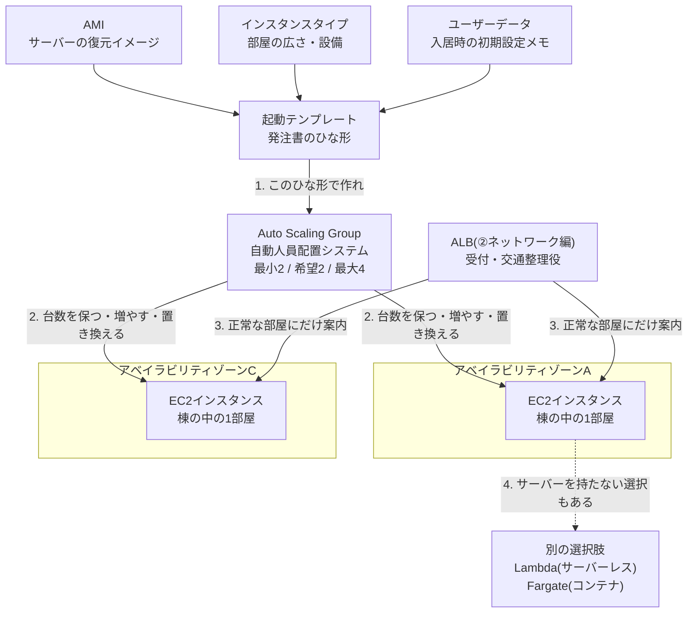

# AWS用語集 ③コンピューティング

> 📖 [用語集トップ(索引)に戻る](../02-glossary.md) ｜ [← 前: ②ネットワーク](02-network.md) ｜ [次: ④ストレージ →](04-storage.md)

## この章で扱う範囲

この章は「処理を実際に動かす場所」の用語をまとめたページです。②ネットワーク編で作った敷地(VPC)と棟(サブネット)の中に、いよいよ「部屋」を置いていく段階にあたります。

前半は、サーバー構築エンジニアの主戦場であるEC2(AWS上で借りる仮想サーバー)を、起動の材料(AMI・インスタンスタイプ・キーペア・ユーザーデータ)から順に分解します。中盤では、その部屋を「1つ壊れても勝手に建て直される状態」にするAuto Scalingを扱います。後半では、そもそもサーバーを持たずに処理を動かすサーバーレス(AWS Lambda)と、OSごと持ち歩くコンテナ(Docker・ECS・Fargate)に触れ、最後に「どの実行基盤を選ぶか」という設計判断の言葉を整理します。

具体的には、[レベル2: EC2 Webサーバー構築](../../projects/02-ec2-web-server/README.md)でEC2を1台起動する場面、[レベル3: 高可用性3層構成](../../projects/03-ha-three-tier/README.md)で起動テンプレートとAuto Scaling Groupを組む場面、[レベル4: WordPress本番構成](../../projects/04-wordpress-production/README.md)でインスタンスリフレッシュを使って中身を入れ替える場面で、ここの用語がそのまま登場します。



> 🧠 **覚え方のコツ**: この章の全体像は「**材料 → ひな形 → 台数管理 → 別の選択肢**」の4段構えです。材料(AMI・インスタンスタイプ・ユーザーデータ)を集めてひな形(起動テンプレート)にまとめ、そのひな形を渡された管理者(Auto Scaling Group)が部屋(EC2)の数を保つ。そして「そもそも部屋を借りない」という別解がサーバーレスとコンテナです。この4段だけ覚えておけば、細かい用語がどこに属するかで迷わなくなります。

## この章の用語ミニ索引

| 用語 | ひとことで言うと |
|---|---|
| [EC2](#ec2) | AWS上で必要なときだけ借りられる仮想サーバー |
| [仮想化](#仮想化) | 1台の物理サーバーを複数の仮想サーバーに分ける技術 |
| [インスタンスタイプ](#インスタンスタイプ) | CPU・メモリなどEC2 1台分のスペックを表す規格 |
| [インスタンスファミリー](#インスタンスファミリー) | `t3` `m7g` のような、用途別のインスタンスの系統 |
| [vCPU](#vcpu) | インスタンスに割り当てられる仮想的なCPUの数 |
| [バースト可能インスタンス](#バースト可能インスタンス) | 普段は低性能、必要なときだけ性能を出せるT系インスタンス |
| [AMI](#ami) | OSやソフトを設定済みの、EC2起動用のひな形イメージ |
| [Nitro System](#nitro-system) | 現行世代EC2の土台になっているAWS独自の仮想化基盤 |
| [インスタンスストア](#インスタンスストア) | 物理ホストに直結した、消えてもよい一時ディスク |
| [起動テンプレート](#起動テンプレート) | 「どう起動するか」を保存した再利用可能な設計図 |
| [キーペア](#キーペア) | EC2にSSH接続するための公開鍵と秘密鍵の組 |
| [ユーザーデータ](#ユーザーデータ) | 初回起動時に自動実行される初期設定スクリプト |
| [インスタンスメタデータ](#インスタンスメタデータ) | インスタンス自身の情報を内部から取得できる仕組み |
| [IMDSv2](#imdsv2) | トークンを必須にした、安全なメタデータ取得方式 |
| [EC2 Instance Connect](#ec2-instance-connect) | ブラウザから一時鍵でSSH接続できるAWSの機能 |
| [インスタンスのライフサイクル](#インスタンスのライフサイクル) | 起動・停止・終了という状態の移り変わり |
| [終了保護](#終了保護) | 誤操作による削除を防ぐEC2の安全装置 |
| [EC2 Image Builder](#ec2-image-builder) | AMIの作成・更新を自動化するマネージドサービス |
| [Auto Scaling Group](#auto-scaling-group) | EC2の台数を自動で増減・復旧させる管理単位 |
| [希望する容量](#希望する容量) | ASGが「いま維持したい」インスタンス台数 |
| [最小キャパシティ](#最小キャパシティ) | どれだけ暇でもこれ以下には減らさない下限台数 |
| [最大キャパシティ](#最大キャパシティ) | どれだけ混んでもこれ以上には増やさない上限台数 |
| [スケーリングポリシー](#スケーリングポリシー) | どんなときに台数を増減するかを決めるルール |
| [ターゲット追跡スケーリングポリシー](#ターゲット追跡スケーリングポリシー) | 目標値を決めるだけで台数を自動調整する方式 |
| [クールダウン](#クールダウン) | 一度スケールした後、次の判断まで待つ冷却時間 |
| [ヘルスチェックタイプ](#ヘルスチェックタイプ) | ASGが「正常」をどの情報で判定するかの設定 |
| [自動復旧](#自動復旧) | 壊れたサーバーを自動的に元通りに戻す仕組み |
| [オートヒーリング](#オートヒーリング) | 異常なものを捨てて作り直す、自己修復の考え方 |
| [インスタンスリフレッシュ](#インスタンスリフレッシュ) | ASG配下のEC2を安全に順次入れ替える機能 |
| [サーバーレス](#サーバーレス) | サーバーの存在を意識せずに処理だけを動かす方式 |
| [Lambda](#lambda) | コードをアップロードするだけで実行できるサービス |
| [コールドスタート](#コールドスタート) | 久しぶりの実行で初回だけ余計に待たされる現象 |
| [イベント駆動](#イベント駆動) | 「何かが起きたら動く」という処理の起こし方 |
| [コンテナ](#コンテナ) | アプリと必要な部品だけを軽量に隔離して動かす方式 |
| [Docker](#docker) | コンテナを作って動かすための代表的なツール |
| [コンテナイメージ](#コンテナイメージ) | コンテナを起動するための読み取り専用のひな形 |
| [ECR](#ecr) | AWS上のプライベートなコンテナイメージ置き場 |
| [ECS](#ecs) | AWS独自のコンテナ管理(オーケストレーション)サービス |
| [Fargate](#fargate) | サーバーを持たずにコンテナだけを動かす実行基盤 |
| [EKS](#eks) | AWSがマネージドで提供するKubernetes |
| [ステートレス](#ステートレス) | どのサーバーに当たっても同じ結果を返せる状態 |
| [ステートフル](#ステートフル) | サーバー自身が状態を抱え込んでいる状態 |
| [プレイスメントグループ](#プレイスメントグループ) | 物理的な配置の近さ・遠さを指定する仕組み |
| [Elastic Beanstalk](#elastic-beanstalk) | アプリを置くだけで実行環境一式を用意するサービス |
| [Lightsail](#lightsail) | 月額固定で使える、簡易版のサーバーサービス |

## 3-1. EC2の基本

### EC2

**正式名称**: Amazon Elastic Compute Cloud ｜ **読み方**: イーシーツー ｜ **重要度**: ★★★

**ひとことで言うと**: AWS上で、必要なときに必要な台数だけ借りられる仮想サーバーです。

**たとえるなら**: 「レンタルパソコン」です。②ネットワーク編のたとえに合わせると、敷地([VPC](02-network.md#vpc))の中に建てた棟([サブネット](02-network.md#サブネット))の、その中の「1部屋」にあたります。

**もう少し詳しく**: EC2で起動した1台1台を「インスタンス」と呼びます。インスタンスを起動するときに決めるのは、大きく分けて次の5つです。(1)OSの中身を決める[AMI](#ami)、(2)スペックを決める[インスタンスタイプ](#インスタンスタイプ)、(3)どこに置くかを決めるVPC・サブネット、(4)誰が入れるかを決める[セキュリティグループ](02-network.md#セキュリティグループ)と[キーペア](#キーペア)、(5)ディスクにあたる[EBS](04-storage.md#ebs)です。起動したインスタンスの中身はふつうのLinuxサーバーそのもので、SSHで入って `dnf install` や `systemctl` を実行できます。つまり「OSより上は自分の責任、ハードウェアと仮想化基盤より下はAWSの責任」という[責任共有モデル](01-cloud-basics.md#責任共有モデル)の境界が、いちばんはっきり見えるサービスです。

**サーバー構築での勘所**:
- 「なぜLambdaやコンテナではなくEC2なのか」は面接の定番質問です。既存のミドルウェア構成をそのまま載せられる、OSレベルの細かい調整ができる、学習として仕組みが見える、という3点で答えられるようにしておきます。
- 1台構成は[単一障害点](01-cloud-basics.md#単一障害点)です。実務では、EC2は必ず[Auto Scaling Group](#auto-scaling-group)と[ALB](02-network.md#alb)とセットで、2つ以上の[アベイラビリティゾーン](01-cloud-basics.md#アベイラビリティゾーン)に分散させる前提で設計します。
- EC2に権限を持たせるときは、アクセスキーをサーバー内に置かず、必ず[IAMロール](06-security-identity.md#iamロール)を割り当てます。これはセキュリティ面での基本中の基本です。
- OSのパッチ適用は利用者の仕事です。台数が増えたら[Patch Manager](07-monitoring-operations.md#patch-manager)などで自動化することを検討します。

**よくあるつまずき**: 「インスタンスは起動しているのにブラウザで開けない」の原因は、EC2側ではなくネットワーク側にあることがほとんどです。(1)ルートテーブルに `0.0.0.0/0` → IGWの経路があるか、(2)パブリックIPまたは[Elastic IP](02-network.md#elastic-ip)が付いているか、(3)セキュリティグループで80番が開いているか、(4)Webサーバーが起動しているか、の順に確認します。

**💰 コスト**: 起動している時間に対して秒単位または時間単位で課金され、停止中はインスタンス料金がかかりません(ただし[EBS](04-storage.md#ebs)の保存料金は停止中も発生し続けます)。小さなインスタンスには一定時間ぶんの無料利用枠が用意されてきましたが、対象や条件はアカウントの作成時期によって異なります。最新の料金・無料利用枠の条件は必ず公式ページで確認してください([AWS無料利用枠](https://aws.amazon.com/jp/free/))。

**関連用語**: [AMI](#ami)、[インスタンスタイプ](#インスタンスタイプ)、[起動テンプレート](#起動テンプレート)、[Auto Scaling Group](#auto-scaling-group)

**登場する案件**: [レベル2: EC2 Webサーバー構築](../../projects/02-ec2-web-server/README.md)、[レベル3: 高可用性3層構成](../../projects/03-ha-three-tier/README.md)、[レベル4: WordPress本番構成](../../projects/04-wordpress-production/README.md)

### 仮想化

**読み方**: かそうか ｜ **重要度**: ★

**ひとことで言うと**: 1台の物理的なコンピューターを、ソフトウェアの力で複数の独立したコンピューターに見せかける技術です。

**たとえるなら**: 大きな1棟の建物に間仕切りを入れて、複数の独立した部屋として貸し出すことです。壁を隔てた隣室の生活音は聞こえず、鍵も別々です。

**もう少し詳しく**: EC2の「仮想サーバー」という言葉は、この仮想化の上に成り立っています。AWSのデータセンターに置かれた1台の物理ホストの上で、ハイパーバイザーと呼ばれる仕組みがCPU・メモリ・ネットワークを切り分け、それぞれを独立したインスタンスとして利用者に貸し出します。利用者からは自分専用のサーバーに見えますが、実際には同じ物理ホストを他の利用者と共有していることがあります(そのため、物理ホストを占有したい要件には専有ホストという別の選択肢があります)。この切り分けを専用ハードウェアで高速・安全に行うのがAWSの[Nitro System](#nitro-system)です。

**サーバー構築での勘所**:
- 「クラウドのサーバーは実体のない魔法」ではなく、あくまで物理サーバーの上の間仕切りだと理解しておくと、[プレイスメントグループ](#プレイスメントグループ)や[インスタンスストア](#インスタンスストア)、AZ障害といった話が一本の線でつながります。
- コンテナ(後述)は、OSより下から丸ごと分ける仮想化とは異なり、1つのOSカーネルを共有したまま実行環境だけを分ける「もっと軽い間仕切り」です。この違いが起動速度と密度の差になります。

**関連用語**: [EC2](#ec2)、[Nitro System](#nitro-system)、[コンテナ](#コンテナ)

### インスタンスタイプ

**読み方**: インスタンスタイプ ｜ **重要度**: ★★★

**ひとことで言うと**: CPU・メモリ・ネットワーク性能など、EC2 1台あたりの大きさを表す規格の名前です(例: `t3.micro`)。

**たとえるなら**: レンタカーの「車種選び」です。軽自動車からトラックまで、荷物の量と走る距離に合わせて選びます。借りた後で車種を変えたくなったら、いったん停めて乗り換えます。

**もう少し詳しく**: 名前は「ファミリー + 世代 + 追加の属性 + サイズ」という決まった構造をしています。`t3.micro` なら、`t`が[インスタンスファミリー](#インスタンスファミリー)、`3`が世代、`micro`がサイズです。`m7g.large` のように末尾に付く小文字は追加の属性を表し、`g`はAWS独自プロセッサのGraviton、`a`はAMD、`d`は[インスタンスストア](#インスタンスストア)付き、`n`はネットワーク強化、といった意味を持ちます。サイズは `nano` → `micro` → `small` → `medium` → `large` → `xlarge` → `2xlarge` … と大きくなり、1段階上がるとおおむね[vCPU](#vcpu)とメモリが倍になります。インスタンスタイプは起動後でも変更できますが、その際はインスタンスの停止が必要です。

**サーバー構築での勘所**:
- 最初から大きなタイプを選ばないのが鉄則です。小さく始めて、[CloudWatch](07-monitoring-operations.md#cloudwatch)のCPU使用率・メモリ使用率を見てから調整します。これがクラウドの「あとから変えられる」利点を活かす使い方です。
- 世代は新しいほど、同じ価格でも性能が高い傾向があります。学習・検証で古い世代を選ぶ理由は基本的にありません。
- 性能が足りないときに「1台を大きくする([スケールアップ](01-cloud-basics.md#スケールアップ))」のか「台数を増やす([スケールアウト](01-cloud-basics.md#スケールアウト))」のかは、設計上の重要な分岐点です。Webサーバー層は後者、データベース層は前者になりやすい、と覚えておくと説明しやすくなります。

**よくあるつまずき**: 「メモリが足りずにプロセスが強制終了される(OOM)」は、`micro` 系の小さなタイプでWordPressやビルド処理を動かしたときの定番トラブルです。CPU使用率だけを見ていると気づけないため、メモリの監視には[CloudWatch](07-monitoring-operations.md#cloudwatch)エージェントの導入が必要になります。

**💰 コスト**: インスタンスタイプごとに1時間あたりの単価が決まっており、サイズが1段階上がると単価もおおむね倍になります。長期間使うことが決まっているなら[Savings Plans](01-cloud-basics.md#savings-plans)や[リザーブドインスタンス](01-cloud-basics.md#リザーブドインスタンス)で単価を下げられます。最新の単価は[Amazon EC2の料金](https://aws.amazon.com/jp/ec2/pricing/)で確認してください。

**関連用語**: [インスタンスファミリー](#インスタンスファミリー)、[vCPU](#vcpu)、[バースト可能インスタンス](#バースト可能インスタンス)、[EC2](#ec2)

**登場する案件**: [レベル2: EC2 Webサーバー構築](../../projects/02-ec2-web-server/README.md)、[レベル3: 高可用性3層構成](../../projects/03-ha-three-tier/README.md)

### インスタンスファミリー

**読み方**: インスタンスファミリー ｜ **重要度**: ★★

**ひとことで言うと**: 「汎用」「メモリ重視」「CPU重視」といった用途別に分かれた、インスタンスタイプの系統です。

**たとえるなら**: レンタカー店の「車種のジャンル」です。セダン・ワゴン・トラック・スポーツカーというジャンルがあり、その中でさらに排気量(サイズ)を選ぶ、という二段階の選び方になります。

**もう少し詳しく**: 代表的なファミリーは次のとおりです。`t`は[バースト可能インスタンス](#バースト可能インスタンス)で、小規模なWebサーバーや検証環境の定番です。`m`は汎用で、CPUとメモリのバランスが取れています。`c`はコンピューティング最適化でCPU性能重視、`r`と`x`はメモリ最適化でデータベースやキャッシュ向け、`i`と`d`はストレージ最適化、`g`と`p`はGPU搭載で機械学習向けです。頭文字の意味(t=turbo/burstable、m=main、c=compute、r=RAM)を意識すると覚えやすくなります。

**サーバー構築での勘所**:
- 迷ったらまず `t` か `m` から始めます。Webサーバー層は `t`、ある程度の常時負荷があるなら `m`、CPUを長時間使い切る処理なら `c` が第一候補です。
- ファミリーの選定理由を言葉にできると、面接で「なぜこの構成にしたのか」を語れます。本ポートフォリオが `t3.micro` を選んでいるのは、負荷が低く断続的な学習用途で、コストを抑えたいからです。

**関連用語**: [インスタンスタイプ](#インスタンスタイプ)、[バースト可能インスタンス](#バースト可能インスタンス)、[vCPU](#vcpu)

### vCPU

**正式名称**: virtual CPU(仮想CPU) ｜ **読み方**: ブイシーピーユー ｜ **重要度**: ★★

**ひとことで言うと**: そのインスタンスに割り当てられている、仮想的なCPUの個数です。

**たとえるなら**: 部屋に配置されている「作業デスクの数」です。デスクが2つあれば2人が同時に作業できますが、1つしかなければ順番待ちが発生します。

**もう少し詳しく**: x86系のインスタンスでは、1 vCPUは物理CPUコアのスレッド1本に相当することが一般的です(2 vCPU = 物理1コア相当、という関係になりやすい)。AWS独自プロセッサであるGraviton系のインスタンスでは、1 vCPUが物理1コアに対応します。インスタンスタイプのサイズが1段階上がると、vCPU数もおおむね倍になります。Linuxのサーバー内からは `nproc` コマンドや `/proc/cpuinfo` で確認できます。

**サーバー構築での勘所**:
- 「CPU使用率100%」は、すべてのvCPUを使い切った状態を指します。1 vCPUのインスタンスでは、1つの重い処理だけで簡単に100%に達します。
- ミドルウェアの同時実行数(Apacheのワーカー数やPHP-FPMのプロセス数など)は、vCPU数とメモリ量に合わせて調整します。vCPUを無視して同時実行数だけを増やしても、待ち行列が伸びるだけで速くはなりません。
- ソフトウェアのライセンスがコア数課金の場合、vCPU数がそのままコストに跳ね返ります。商用ミドルウェアを載せるときは要確認です。

**関連用語**: [インスタンスタイプ](#インスタンスタイプ)、[バースト可能インスタンス](#バースト可能インスタンス)、[Nitro System](#nitro-system)

### バースト可能インスタンス

**正式名称**: バースト可能パフォーマンスインスタンス(T系インスタンス) ｜ **重要度**: ★★

**ひとことで言うと**: ふだんは決められた低い性能で動き、必要なときだけ一時的に高い性能を出せる、`t` ファミリーのインスタンスです。

**たとえるなら**: 「使わなかった残業代を貯めておける社員」です。暇な時間にコツコツ貯めたポイント(CPUクレジット)を、忙しいときに一気に使って全力で働きます。貯金が尽きると、決められた基本ペースまで速度が落ちます。

**もう少し詳しく**: T系インスタンスには「ベースライン性能」というvCPUあたりの基準値が決められていて、それを下回って動いている間はCPUクレジットが貯まります。負荷が上がるとクレジットを消費して基準値以上の性能を発揮し、クレジットを使い切ると基準値まで性能が制限されます。動作モードには2種類あり、クレジットが尽きたら性能を落とす「standard」と、追加料金と引き換えに性能を維持し続ける「unlimited」があります。世代によって既定のモードが異なるため、設定画面での確認が必要です。

**サーバー構築での勘所**:
- 「昼間は快適なのに、キャンペーンで負荷が上がると急激に遅くなる」という現象は、CPUクレジットの枯渇が原因のことがあります。[CloudWatch](07-monitoring-operations.md#cloudwatch)の `CPUCreditBalance` メトリクスを監視対象に入れておくと、原因の切り分けが速くなります。
- 常時CPUを使い切るような処理(動画変換、ビルドサーバー、常時高負荷なAPI)にT系は向きません。`m` や `c` ファミリーを選びます。
- unlimitedモードは便利ですが、想定外の追加課金につながることがあります。検証環境ではstandardにしておく、という判断もあります。

**💰 コスト**: unlimitedモードでクレジットを超過して使い続けると、超過分に対する追加料金が発生します。最新の条件は[Amazon EC2の料金](https://aws.amazon.com/jp/ec2/pricing/)で確認してください。

**関連用語**: [インスタンスファミリー](#インスタンスファミリー)、[vCPU](#vcpu)、[インスタンスタイプ](#インスタンスタイプ)

### AMI

**正式名称**: Amazon Machine Image ｜ **読み方**: エーエムアイ ｜ **重要度**: ★★★

**ひとことで言うと**: OSやインストール済みソフトウェアの初期状態をまるごと保存した、EC2起動用のひな形イメージです。

**たとえるなら**: パソコンの「復元イメージ」です。同じ状態のパソコンを、何台でもボタン1つで量産できます。

**もう少し詳しく**: AMIには、OSのファイル一式(ルートボリュームの[EBSスナップショット](04-storage.md#ebsスナップショット))、起動時の設定、ブロックデバイスの構成が含まれます。AMIは大きく分けて、AWSが提供するもの([Amazon Linux](09-linux-server-basics.md#amazon-linux)、Ubuntu、Windows Serverなど)、AWS Marketplaceで配布されるもの、そして自分で作成する「カスタムAMI」の3種類です。カスタムAMIは、必要なミドルウェアを入れて設定を済ませたEC2から作成でき、その後は起動するだけで設定済みのサーバーが手に入ります。AMI IDは `ami-` で始まる文字列で、**リージョンごとに異なる**という点が非常に重要です。

**サーバー構築での勘所**:
- AMI IDをコードに直書きすると、リージョンを変えた瞬間に動かなくなり、新しいOSが出ても古いまま固定されてしまいます。本ポートフォリオのハンズオンキットでは、AWSが公開している[Parameter Store](06-security-identity.md#parameter-store)のパブリックパラメータ(`/aws/service/ami-amazon-linux-latest/al2023-ami-kernel-default-x86_64` のようなパス)から最新のAMI IDを取得しています。これは実務でもよく使われる定番の手法です。
- 「ユーザーデータで毎回セットアップする」方式と「セットアップ済みのカスタムAMIを使う」方式には、それぞれ利点があります。前者は変更が反映しやすく、後者は起動が速くスケールアウト時の待ち時間が短くなります。両者を組み合わせ、重い部分はAMIに焼き、環境ごとに変わる部分はユーザーデータで設定する、という使い分けが実務的です。
- カスタムAMIを作るときは、SSHのホスト鍵や認証情報、ログといった「インスタンス固有のもの」を残さないよう注意します。丸ごとコピーされて全台に配られてしまいます。

**よくあるつまずき**: [Auto Scaling Group](#auto-scaling-group)でインスタンスが起動しない原因の上位が「起動テンプレートのAMI IDが、そのリージョンに存在しないものになっている」です。ASGの「アクティビティ」タブにエラーが出ているので、まずそこを確認します。

**💰 コスト**: AMI自体の作成に料金はかかりませんが、AMIの実体である[EBSスナップショット](04-storage.md#ebsスナップショット)の保存容量に対して課金されます。使わなくなったカスタムAMIは、登録解除に加えてスナップショットの削除まで行わないと料金が残り続けます。

**関連用語**: [EC2](#ec2)、[起動テンプレート](#起動テンプレート)、[EC2 Image Builder](#ec2-image-builder)、[EBSスナップショット](04-storage.md#ebsスナップショット)

**登場する案件**: [レベル2: EC2 Webサーバー構築](../../projects/02-ec2-web-server/README.md)、[レベル3: 高可用性3層構成](../../projects/03-ha-three-tier/README.md)

### Nitro System

**読み方**: ナイトロシステム ｜ **重要度**: ★

**ひとことで言うと**: 現行世代のEC2を支えている、AWSが自社開発した仮想化の基盤です。

**たとえるなら**: マンションの「最新設備の管理システム」です。従来は管理人(ソフトウェア)が手作業でやっていた電気・水道の配分を、専用の自動制御装置(ハードウェア)が肩代わりするので、住人の部屋(インスタンス)に使えるリソースが増え、動作も安定します。

**もう少し詳しく**: 従来の仮想化では、ネットワークやストレージの処理をホスト側のソフトウェアが担っていたため、その分のCPUとメモリが「管理のためのオーバーヘッド」として消費されていました。Nitro Systemは、その処理を専用のハードウェアカードにオフロードし、さらに軽量なハイパーバイザーとセキュリティチップを組み合わせた構成です。結果として、物理サーバーの性能をほぼそのままインスタンスに割り当てられ、EBSの暗号化や高速なネットワークもハードウェア側で処理されます。利用者が個別に設定する項目ではなく、「現行世代のインスタンスタイプを選べば自然と使っている」たぐいの基盤技術です。

**サーバー構築での勘所**:
- 「新しい世代のインスタンスタイプのほうが同じ価格で速い」理由の1つがこれです。世代選びに迷ったら新しいほうを選ぶ、という判断の裏付けになります。
- [Fargate](#fargate)などのマネージドな実行基盤も、この技術の上で顧客ごとの分離を実現しています。「AWSはハードウェアレベルで隔離している」という説明は、セキュリティの説明としても使えます。

**関連用語**: [仮想化](#仮想化)、[インスタンスタイプ](#インスタンスタイプ)、[EC2](#ec2)

### インスタンスストア

**読み方**: インスタンスストア ｜ **重要度**: ★★

**ひとことで言うと**: 物理ホストに直接つながった、インスタンスを止めると中身が消える一時的なディスクです。

**たとえるなら**: 部屋に備え付けの「作業机の引き出し」です。すぐ手が届いて非常に速いのですが、退去(停止・終了)すると中身は問答無用で処分されます。大事なものは共用の貸金庫([EBS](04-storage.md#ebs))に入れておく必要があります。

**もう少し詳しく**: [EBS](04-storage.md#ebs)がネットワーク越しに接続される独立したディスクであるのに対し、インスタンスストアは物理ホストのローカルディスクをそのまま使います。そのため非常に高速ですが、インスタンスを停止・終了したり、ホストの障害でインスタンスが別のハードウェアへ移ったりすると、データは完全に失われます。すべてのインスタンスタイプに付いているわけではなく、タイプ名に `d` が含まれるものなど、対応したタイプでのみ利用できます。

**サーバー構築での勘所**:
- 用途は「消えても困らない、速さが欲しいデータ」に限定します。キャッシュ、一時ファイル、スクラッチ領域が典型です。データベースのデータやアップロードされた画像を置く場所ではありません。
- インスタンスストアは、[自動復旧](#自動復旧)や[インスタンスリフレッシュ](#インスタンスリフレッシュ)でインスタンスが入れ替わったときにも失われます。「壊れたら作り直す」前提の設計とは相性を考えて使います。

**💰 コスト**: インスタンスストアの容量に対する追加料金はなく、インスタンスタイプの料金に含まれています。

**関連用語**: [EBS](04-storage.md#ebs)、[インスタンスタイプ](#インスタンスタイプ)、[ステートレス](#ステートレス)

## 3-2. EC2の起動と初期設定

### 起動テンプレート

**正式名称**: Launch Template ｜ **読み方**: きどうテンプレート ｜ **重要度**: ★★★

**ひとことで言うと**: 「どのAMIで、どのインスタンスタイプで、どんな初期設定でEC2を起動するか」をまとめて保存しておく設計図です。

**たとえるなら**: [Auto Scaling Group](#auto-scaling-group)が新しい部屋を用意するときに使う「発注書のひな形」です。毎回ゼロから発注内容を書くのではなく、ひな形にサインするだけで同じ仕様の部屋が届きます。

**もう少し詳しく**: 起動テンプレートには、[AMI](#ami)、[インスタンスタイプ](#インスタンスタイプ)、[キーペア](#キーペア)、[セキュリティグループ](02-network.md#セキュリティグループ)、[ユーザーデータ](#ユーザーデータ)、[IAMロール](06-security-identity.md#iamロール)を渡すためのインスタンスプロファイル、EBSの構成、[タグ](01-cloud-basics.md#タグ)、メタデータの設定([IMDSv2](#imdsv2)を必須にするかどうか)などを保存できます。最大の特徴は**バージョン管理ができる**ことです。テンプレートを編集すると新しいバージョン番号が付き、「どのバージョンを既定にするか」を選べます。設定を変えて不具合が出たら、既定バージョンを1つ前に戻すだけで切り戻せます。なお、Auto Scalingには「起動設定(Launch Configuration)」という古い仕組みもありましたが、現在は起動テンプレートの利用が推奨されています。

**サーバー構築での勘所**:
- 起動テンプレートを更新しただけでは、すでに動いているインスタンスは古い設定のままです。新しい設定を全台に行き渡らせるには[インスタンスリフレッシュ](#インスタンスリフレッシュ)を実行します。本ポートフォリオの[レベル4](../../projects/04-wordpress-production/README.md)は、まさにこの流れでWordPress入りの新バージョンへ切り替えています。
- サブネットは起動テンプレート側では指定せず、[Auto Scaling Group](#auto-scaling-group)側で複数AZぶんを指定します。こうすることで、同じテンプレートを複数AZに展開できます。
- テンプレートの中に「どのバージョンを使うか」を `$Latest`(常に最新)にするか `$Default`(既定バージョン)にするかという設定があります。事故を防ぐ観点では `$Default` にして、意図的に既定を切り替える運用が安全です。

**関連用語**: [Auto Scaling Group](#auto-scaling-group)、[AMI](#ami)、[ユーザーデータ](#ユーザーデータ)、[インスタンスリフレッシュ](#インスタンスリフレッシュ)

**登場する案件**: [レベル3: 高可用性3層構成](../../projects/03-ha-three-tier/README.md)、[レベル4: WordPress本番構成](../../projects/04-wordpress-production/README.md)

### キーペア

**読み方**: キーペア ｜ **重要度**: ★★★

**ひとことで言うと**: EC2にSSHで接続するために使う、公開鍵と秘密鍵の組のことです。

**たとえるなら**: 「合鍵システム」です。公開鍵はドアに取り付けられた錠前、秘密鍵は自分だけが持つ鍵です。錠前を全世界に見せても、鍵を持っていない人には開けられません。

**もう少し詳しく**: EC2の作成時にキーペアを指定すると、公開鍵がインスタンス内の既定ユーザー(Amazon Linuxなら `ec2-user`)の `~/.ssh/authorized_keys` に自動的に書き込まれます。手元にダウンロードした秘密鍵ファイル(`.pem`)を使って `ssh -i handson-key.pem ec2-user@<IPアドレス>` と接続すると、鍵の照合だけでログインでき、パスワードは使いません(これが[SSH公開鍵認証](09-linux-server-basics.md#ssh公開鍵認証)です)。鍵の種類はRSAとED25519から選べます。

**サーバー構築での勘所**:
- ⚠️ 秘密鍵ファイルは**作成時にしかダウンロードできません**。紛失すると同じ鍵では二度と接続できず、AWSに再発行してもらうこともできません。安全な場所に確実に保管してください。
- 手元での `chmod 400 handson-key.pem` は必須です。パーミッションが緩いと、SSHクライアント側が「鍵ファイルが緩すぎる」と警告して接続を拒否します。
- 秘密鍵をGitリポジトリにコミットしてしまう事故は非常に多いです。`.gitignore` に `*.pem` を入れておく習慣をつけてください。
- 鍵を紛失したときの復旧策として、[EC2 Instance Connect](#ec2-instance-connect)や[Session Manager](07-monitoring-operations.md#session-manager)を先に使えるようにしておく、という備え方があります。そもそも鍵を配らずに済む運用が、実務では推奨されつつあります。

**関連用語**: [EC2](#ec2)、[EC2 Instance Connect](#ec2-instance-connect)、[SSHプロトコル](02-network.md#sshプロトコル)、[Session Manager](07-monitoring-operations.md#session-manager)

**登場する案件**: [レベル2: EC2 Webサーバー構築](../../projects/02-ec2-web-server/README.md)

### ユーザーデータ

**正式名称**: User Data ｜ **読み方**: ユーザーデータ ｜ **重要度**: ★★★

**ひとことで言うと**: EC2の初回起動時に自動実行される、初期設定用のスクリプトです。

**たとえるなら**: 新しい部屋に入居するときに管理人へ渡しておく「入居時にこれだけやっておいてください」というメモです。鍵を受け取って部屋に入ったときには、もうエアコンが付いていて水道も通っている状態になります。

**もう少し詳しく**: `#!/bin/bash` で始まるシェルスクリプトを書いておくと、インスタンスの初回起動時に[cloud-init](09-linux-server-basics.md#cloud-init)がroot権限でそれを実行します。本ポートフォリオでは、Apacheのインストール、[systemd](09-linux-server-basics.md#systemd)による自動起動の有効化、ヘルスチェック用ファイルの配置、`index.html` の作成までをユーザーデータで自動化しています。既定では**初回起動時に1回だけ**実行され、2回目以降の再起動では実行されません。実行結果のログは `/var/log/cloud-init-output.log` に残るため、うまく動かないときはまずここを確認します。サイズには上限(16KB程度)があるため、長いスクリプトはS3に置いて、ユーザーデータからはダウンロードして実行するだけにする、という書き方をします。

**サーバー構築での勘所**:
- ⚠️ ユーザーデータの中身は、そのインスタンスに入れる人なら[インスタンスメタデータ](#インスタンスメタデータ)経由で読み出せます。パスワードやAPIキーを直接書いてはいけません。機密情報は[Secrets Manager](06-security-identity.md#secrets-manager)や[Parameter Store](06-security-identity.md#parameter-store)に置き、[IAMロール](06-security-identity.md#iamロール)の権限で取得します。[レベル4](../../projects/04-wordpress-production/README.md)のWordPress構成は、まさにこの形でDBパスワードを扱っています。
- 何度実行しても同じ結果になる書き方([冪等性](08-iac-cicd.md#冪等性))を意識します。「すでにあれば作らない」という書き方にしておくと、後からAMI化したりリトライしたりしても壊れません。
- スクリプトの先頭に `set -euxo pipefail` を書いておくと、途中で失敗したときにそこで止まり、ログにも実行内容が残るので原因を追いやすくなります。

**よくあるつまずき**: 「EC2は起動したのにWebページが出ない」場合、ユーザーデータの実行が終わっていないだけのことがあります。パッケージのインストールには1〜2分かかるため、少し待ってから再読み込みしてください。それでも表示されなければ `/var/log/cloud-init-output.log` を確認します。

**関連用語**: [起動テンプレート](#起動テンプレート)、[cloud-init](09-linux-server-basics.md#cloud-init)、[インスタンスメタデータ](#インスタンスメタデータ)、[AMI](#ami)

**登場する案件**: [レベル2: EC2 Webサーバー構築](../../projects/02-ec2-web-server/README.md)、[レベル3: 高可用性3層構成](../../projects/03-ha-three-tier/README.md)、[レベル4: WordPress本番構成](../../projects/04-wordpress-production/README.md)

### インスタンスメタデータ

**正式名称**: Instance Metadata Service(IMDS) ｜ **読み方**: インスタンスメタデータ ｜ **重要度**: ★★

**ひとことで言うと**: 「自分はどのインスタンスIDで、どのAZにいるのか」といった情報を、インスタンスの内部から取得できる仕組みです。

**たとえるなら**: 部屋の壁に貼ってある「この部屋の情報カード(部屋番号・階・棟名)」です。外からは見えませんが、部屋の中にいる人はいつでも確認できます。

**もう少し詳しく**: インスタンスの内部から `http://169.254.169.254/latest/meta-data/` というアドレスにアクセスすると、インスタンスID、AZ、プライベートIP、パブリックIP、割り当てられているIAMロールの一時認証情報などを取得できます。この `169.254.169.254` はリンクローカルアドレスと呼ばれる特別なアドレスで、通信はインスタンスの内部で完結します。インターネットには出ていかないため、[NATゲートウェイ](02-network.md#natゲートウェイ)がないプライベートサブネットのインスタンスからでも利用できます。本ポートフォリオの[レベル3](../../projects/03-ha-three-tier/README.md)では、「どのインスタンスが応答しているか」を画面に表示するためにインスタンスIDをここから取得しています。

**サーバー構築での勘所**:
- [IAMロール](06-security-identity.md#iamロール)の一時認証情報も、実体はここから配られています。AWS CLIやSDKがEC2上で「アクセスキーを書いていないのに動く」のは、裏でメタデータを見に行っているからです。
- 便利な反面、ここが読めるということは「IAMロールの権限が奪われうる」ことを意味します。だからこそ次項の[IMDSv2](#imdsv2)が重要になります。
- ユーザーデータの内容も `http://169.254.169.254/latest/user-data` から読み出せます。機密情報を書いてはいけない理由がここにあります。

**関連用語**: [IMDSv2](#imdsv2)、[ユーザーデータ](#ユーザーデータ)、[IAMロール](06-security-identity.md#iamロール)、[インスタンスプロファイル](06-security-identity.md#インスタンスプロファイル)

**登場する案件**: [レベル3: 高可用性3層構成](../../projects/03-ha-three-tier/README.md)

### IMDSv2

**正式名称**: Instance Metadata Service Version 2 ｜ **読み方**: アイエムディーエスブイツー ｜ **重要度**: ★★

**ひとことで言うと**: メタデータを取得する前に必ずトークンの取得を求める、より安全なインスタンスメタデータの利用方式です。

**たとえるなら**: 部屋の情報カードを見るのに「まず受付で番号札をもらってきてください」というルールを追加したものです。ひと手間増えますが、外から紛れ込んだ人がついでに覗いていく、ということができなくなります。

**もう少し詳しく**: 従来のIMDSv1は、単に `GET http://169.254.169.254/...` を投げるだけで情報が取れました。この手軽さが問題で、アプリケーションに任意のURLへアクセスさせられる脆弱性(SSRF)があると、外部の攻撃者にメタデータ経由でIAMロールの認証情報を盗まれる恐れがありました。IMDSv2では、まず `PUT` リクエストでセッショントークンを取得し、以降のリクエストにそのトークンをヘッダーで付ける必要があります。本ポートフォリオのユーザーデータでも、この2段階の書き方をしています。

```bash
TOKEN=$(curl -s -X PUT "http://169.254.169.254/latest/api/token" \
  -H "X-aws-ec2-metadata-token-ttl-seconds: 21600")
INSTANCE_ID=$(curl -s -H "X-aws-ec2-metadata-token: ${TOKEN}" \
  http://169.254.169.254/latest/meta-data/instance-id)
```

**サーバー構築での勘所**:
- インスタンスや[起動テンプレート](#起動テンプレート)のメタデータ設定で「IMDSv2を必須(`HttpTokens: required`)」にできます。本ポートフォリオの[レベル3のハンズオンキット](../../projects/03-ha-three-tier/handson/README.md)は、起動テンプレートでこれを必須に設定しています。セキュリティ監査でも定番のチェック項目です。
- 必須にすると、IMDSv1しか対応していない古いツールやライブラリは動かなくなります。切り替えの前に、既存のアプリケーションが対応しているかを確認します。
- トークン取得時のホップ数制限(`HttpPutResponseHopLimit`)は既定が1です。EC2上のDockerコンテナからメタデータを取りたい場合は、この値を増やす必要があることがあります。
- 新しく作るインスタンスではIMDSv2を必須にする設定が既定になりつつあります。最新の挙動は公式ドキュメントで確認してください。

**関連用語**: [インスタンスメタデータ](#インスタンスメタデータ)、[IAMロール](06-security-identity.md#iamロール)、[起動テンプレート](#起動テンプレート)

**登場する案件**: [レベル2: EC2 Webサーバー構築](../../projects/02-ec2-web-server/README.md)、[レベル3: 高可用性3層構成](../../projects/03-ha-three-tier/README.md)

### EC2 Instance Connect

**読み方**: イーシーツーインスタンスコネクト ｜ **重要度**: ★★

**ひとことで言うと**: 秘密鍵ファイルを手元に持っていなくても、ブラウザやCLIから一時的な鍵でEC2にSSH接続できるAWSの機能です。

**たとえるなら**: 「その場で発行され、1分で失効する使い捨ての入館カード」です。合鍵([キーペア](#キーペア))を持ち歩かなくても、身分(IAM)を示せばその場で入れます。

**もう少し詳しく**: 接続を要求すると、AWSが一時的な公開鍵をインスタンスへ送り込み、その鍵はごく短時間(60秒程度)で無効になります。そのため、鍵の長期保管や紛失のリスクがありません。誰が接続できるかは[IAM](06-security-identity.md#iam)のポリシーで制御でき、[CloudTrail](06-security-identity.md#cloudtrail)に接続操作の記録も残ります。ブラウザからの接続では、22番ポートをAWS側のサービスに対して開けておく必要がありますが、「EC2 Instance Connect Endpoint」を使う方式なら、パブリックIPもインターネットゲートウェイも不要でプライベートサブネットのインスタンスに接続できます。対応OSはAmazon LinuxやUbuntuなど一部に限られます。

**サーバー構築での勘所**:
- 「鍵を紛失した」「別のPCから緊急で入りたい」という場面の保険になります。学習段階でも一度試しておくと安心です。
- 同じ「鍵なしで接続する」系統の機能として[Session Manager](07-monitoring-operations.md#session-manager)があります。Session ManagerはSSH自体を使わず22番ポートも不要なため、より制限の強い環境で使えます。両者の違いを説明できると面接での加点材料になります。

**関連用語**: [キーペア](#キーペア)、[Session Manager](07-monitoring-operations.md#session-manager)、[SSHプロトコル](02-network.md#sshプロトコル)

**登場する案件**: [レベル6: IaCとCI/CD](../../projects/06-iac-cicd/README.md)

### インスタンスのライフサイクル

**読み方**: インスタンスのライフサイクル ｜ **重要度**: ★★

**ひとことで言うと**: EC2が「保留中 → 実行中 → 停止 → 終了」と移り変わっていく状態の流れのことです。

**たとえるなら**: 賃貸の部屋を「借りる → 住む → 一時的に留守にする → 解約する」という流れです。留守にしている間も家賃(EBS料金)はかかり、解約(終了)すると部屋の中のものは戻ってきません。

**もう少し詳しく**: 押さえるべきは「停止(stop)」と「終了(terminate)」の違いです。**停止**はインスタンスの電源を落とすだけで、EBSのデータもインスタンスIDも残り、あとで再起動できます。停止中はインスタンス本体の料金はかかりませんが、EBSの保存料金は発生し続けます。一方、**終了**はインスタンスの削除で、取り消せません。既定ではルートのEBSボリュームも一緒に削除されます(`DeleteOnTermination` の設定次第です)。また、停止して起動し直すと、原則として別の物理ホストへ移るため、[インスタンスストア](#インスタンスストア)のデータは消え、[Elastic IP](02-network.md#elastic-ip)を付けていない場合はパブリックIPも変わります。

**サーバー構築での勘所**:
- 検証が終わったら、停止ではなく**終了**まで行うのがコスト事故を防ぐ基本です。停止したまま放置すると、EBSと未アタッチの[Elastic IP](02-network.md#elastic-ip)で課金が続きます。削除の順番は[コスト管理ガイド](../03-cost-management.md)にまとめています。
- 「昨日まで繋がっていたIPアドレスで繋がらない」は、停止・起動でパブリックIPが変わったことが原因の定番です。
- [Auto Scaling Group](#auto-scaling-group)の配下にあるインスタンスを手動で停止すると、ASGが「異常」と判断して終了させ、新しいインスタンスを起動することがあります。ASG配下の台数調整は、必ずASG側の設定で行います。

**💰 コスト**: 停止中もEBSは課金対象です。「止めたから0円」ではない点に注意してください。

**関連用語**: [EC2](#ec2)、[終了保護](#終了保護)、[EBS](04-storage.md#ebs)、[Elastic IP](02-network.md#elastic-ip)

### 終了保護

**正式名称**: Termination Protection(API終了の無効化) ｜ **重要度**: ★

**ひとことで言うと**: 誤操作でEC2を削除してしまわないようにする、削除禁止のロックです。

**たとえるなら**: 重要な設備のスイッチに付ける「操作禁止カバー」です。カバーを外さないとスイッチを押せないので、うっかり肘が当たっても止まりません。

**もう少し詳しく**: インスタンスの属性として有効にすると、コンソールやAPIからの「インスタンスの終了」操作が拒否されるようになります。まず終了保護を解除し、それから終了する、という2段階を踏むことになるため、意図しない削除を防げます。ただし万能ではありません。OS内部から `shutdown` を実行した場合の挙動(シャットダウン動作の設定次第)や、[Auto Scaling Group](#auto-scaling-group)によるスケールインでの終了は、この設定では止められません。ASG配下では「スケールイン保護」という別の設定を使います。

**サーバー構築での勘所**:
- 本番の踏み台サーバーや、作り直しが困難な単発のインスタンスには付けておく価値があります。逆に、[オートヒーリング](#オートヒーリング)で作り直す前提のインスタンスには不要です。
- 同じ発想の保護として、EBSの `DeleteOnTermination` を無効にしてデータボリュームだけ残す、[EBSスナップショット](04-storage.md#ebsスナップショット)を取っておく、といった手段も併用します。

**関連用語**: [インスタンスのライフサイクル](#インスタンスのライフサイクル)、[EC2](#ec2)、[Auto Scaling Group](#auto-scaling-group)

### EC2 Image Builder

**読み方**: イーシーツーイメージビルダー ｜ **重要度**: ★

**ひとことで言うと**: AMIやコンテナイメージの作成・テスト・配布を、パイプラインとして自動化できるマネージドサービスです。

**たとえるなら**: 「部屋の内装工事を毎回同じ手順でやってくれる専属の工務店」です。OSの更新が出るたびに手作業でAMIを作り直す代わりに、決めた手順で自動的に新しいひな形を仕上げてくれます。

**もう少し詳しく**: ベースとなるAMIを指定し、「パッケージを入れる」「設定ファイルを配置する」「セキュリティ設定を強化する」といった構成要素(コンポーネント)を組み合わせてレシピを作ります。スケジュールを設定しておけば、定期的に最新のベースAMIから新しいカスタムAMIを自動生成し、テストを通してから指定のアカウントやリージョンへ配布できます。「ゴールデンイメージ」を継続的に更新し続ける運用を、手作業なしで回せるのが利点です。

**サーバー構築での勘所**:
- カスタムAMIの弱点は「作った瞬間から古くなること」です。Image Builderはこの弱点への標準的な回答なので、「AMIの陳腐化にどう対処するか」を聞かれたときの答えとして名前を挙げられると強いです。
- 生成したAMIを[起動テンプレート](#起動テンプレート)の新バージョンとして登録し、[インスタンスリフレッシュ](#インスタンスリフレッシュ)で入れ替える、という流れが定番のパターンです。

**💰 コスト**: サービス自体の追加料金はありませんが、イメージのビルド中に起動するEC2や、保存されるAMI(EBSスナップショット)には料金がかかります。

**関連用語**: [AMI](#ami)、[起動テンプレート](#起動テンプレート)、[インスタンスリフレッシュ](#インスタンスリフレッシュ)

## 3-3. 台数を自動で増減する(Auto Scaling)

### Auto Scaling Group

**正式名称**: Amazon EC2 Auto Scaling Group ｜ **読み方**: オートスケーリンググループ(ASG) ｜ **重要度**: ★★★

**ひとことで言うと**: EC2の台数を自動で増減させ、壊れたインスタンスを自動的に入れ替えてくれる管理の単位です。

**たとえるなら**: 「自動人員配置システム」です。混雑時は増員し、空いている時は減員し、誰かが倒れたら黙って補充します。店長が張り付いていなくても、常に決めた人数の店番がいる状態が保たれます。

**もう少し詳しく**: ASGは、[起動テンプレート](#起動テンプレート)(どう作るか)、複数のサブネット(どこに置くか)、[最小キャパシティ](#最小キャパシティ)・[希望する容量](#希望する容量)・[最大キャパシティ](#最大キャパシティ)(何台にするか)、[スケーリングポリシー](#スケーリングポリシー)(いつ増減するか)、[ヘルスチェックタイプ](#ヘルスチェックタイプ)(何を正常とみなすか)の5点セットで構成されます。ASGは常に「実際の台数」と「希望する容量」を比べ、足りなければ起動、多ければ終了します。異常と判定したインスタンスは終了させて新しく作り直すので、結果として[自動復旧](#自動復旧)が実現します。[ターゲットグループ](02-network.md#ターゲットグループ)と紐づけておくと、増えたインスタンスは自動でALBの振り分け先に登録され、減るインスタンスは自動で登録解除されます。

**サーバー構築での勘所**:
- ASGに指定するサブネットは、必ず**2つ以上のAZ**にまたがるようにします。1つのAZに寄せてしまうと、そのAZの障害で全滅し、可用性を高めた意味がなくなります。
- 本ポートフォリオの[レベル3](../../projects/03-ha-three-tier/README.md)では「希望2・最小2・最大4」に設定しています。最小2は「常に2人は店番を置く」というルールで、1台が落ちてももう1台が生きている状態を保つための設計です。
- ASG配下のEC2はいつ入れ替わってもおかしくありません。ログをインスタンス内のファイルに書きっぱなしにせず、[CloudWatch Logs](07-monitoring-operations.md#cloudwatch-logs)などの外部に送る設計にします。同じ理由で、セッションやアップロード画像も外部([ElastiCache](05-database.md#elasticache)や[S3](04-storage.md#s3))に出します。
- ASGはEC2の台数を制御するだけで、アプリケーションの正しさは保証しません。「起動はしたがアプリが動いていない」状態を検知するには、[ヘルスチェックタイプ](#ヘルスチェックタイプ)をELBにして、[ALB](02-network.md#alb)のヘルスチェックを使うのが定石です。

**よくあるつまずき**: 「インスタンスが起動しては終了する」を延々と繰り返す場合、ヘルスチェックに失敗し続けているのが原因です。ヘルスチェックのパスが存在するか、EC2側のセキュリティグループがALBからの通信を許可しているか、ユーザーデータが正常に完了しているかを順に確認します。ASGの「アクティビティ」タブに理由が記録されています。

**💰 コスト**: ASGそのものに料金はかかりません。課金されるのは、ASGが起動したEC2インスタンスとそれに付随するEBSです。「希望する容量2」なら常にEC2 2台分の料金がかかります。

**関連用語**: [起動テンプレート](#起動テンプレート)、[希望する容量](#希望する容量)、[スケーリングポリシー](#スケーリングポリシー)、[自動復旧](#自動復旧)、[ターゲットグループ](02-network.md#ターゲットグループ)

**登場する案件**: [レベル3: 高可用性3層構成](../../projects/03-ha-three-tier/README.md)、[レベル4: WordPress本番構成](../../projects/04-wordpress-production/README.md)

### 希望する容量

**正式名称**: Desired Capacity ｜ **重要度**: ★★★

**ひとことで言うと**: Auto Scaling Groupが「いま維持したい」と考えているインスタンスの台数です。

**たとえるなら**: シフト表に書かれた「今日の店番の人数」です。この人数を下回れば呼び出し、上回れば早上がりしてもらいます。

**もう少し詳しく**: ASGは、この希望する容量と実際の台数を常に比較しています。実際が少なければ[起動テンプレート](#起動テンプレート)に従って新しいインスタンスを起動し、多ければ終了させます。値は[最小キャパシティ](#最小キャパシティ)以上、[最大キャパシティ](#最大キャパシティ)以下でなければなりません。手動で変更することもできますが、[スケーリングポリシー](#スケーリングポリシー)を設定している場合は、負荷に応じてAWS側がこの値を自動で書き換えていきます。つまり「希望する容量は結果として動く値」であり、設計時に本当に決めるべきなのは最小と最大のほうです。

**サーバー構築での勘所**:
- 手動で希望する容量を変えても、ターゲット追跡のポリシーが動けばすぐ元の水準に戻されることがあります。「手で変えたのに戻る」ときはポリシーの働きを疑ってください。
- 検証を一時的に止めてコストを抑えたいときは、希望する容量と最小キャパシティをどちらも `0` にすると、全台が終了してEC2料金が止まります(ALBやNATゲートウェイの料金は別途かかり続けます)。

**関連用語**: [Auto Scaling Group](#auto-scaling-group)、[最小キャパシティ](#最小キャパシティ)、[最大キャパシティ](#最大キャパシティ)

**登場する案件**: [レベル3: 高可用性3層構成](../../projects/03-ha-three-tier/README.md)

### 最小キャパシティ

**正式名称**: Minimum Capacity(最小サイズ) ｜ **重要度**: ★★★

**ひとことで言うと**: どれだけ暇でも、これ以下には減らさないという台数の下限です。

**たとえるなら**: 「どんなに客が少なくても店員は必ず2人置く」という店のルールです。1人だと、その人が倒れた瞬間に店が閉まってしまうからです。

**もう少し詳しく**: 可用性の観点から、本番環境では最小2以上にするのが基本です。最小1では、そのインスタンスが異常になってから代わりが起動して[ALB](02-network.md#alb)のヘルスチェックを通るまでの数分間、サービスが完全に止まってしまいます。最小2で2つのAZに分散していれば、片方のAZごと落ちてももう片方が応答を続けられます。これが[単一障害点](01-cloud-basics.md#単一障害点)を排除するということです。

**サーバー構築での勘所**:
- 「なぜ最小2なのか」は面接で聞かれやすい質問です。「1台構成では復旧までの数分間がダウンタイムになるから」「AZ障害に耐えるため」と、可用性の言葉で答えられるようにしておきます。
- 💰 学習中は、最小2にすると常時2台分の料金がかかります。検証が終わったら最小0にする、またはASGごと削除する、という後片付けを忘れないでください。

**関連用語**: [Auto Scaling Group](#auto-scaling-group)、[希望する容量](#希望する容量)、[冗長化](01-cloud-basics.md#冗長化)、[可用性](01-cloud-basics.md#可用性)

**登場する案件**: [レベル3: 高可用性3層構成](../../projects/03-ha-three-tier/README.md)

### 最大キャパシティ

**正式名称**: Maximum Capacity(最大サイズ) ｜ **重要度**: ★★★

**ひとことで言うと**: どれだけ混んでも、これ以上には増やさないという台数の上限です。

**たとえるなら**: 「増員は最大4人まで」という予算上の決まりです。忙しいからといって無制限に人を呼ぶと、人件費が青天井になってしまいます。

**もう少し詳しく**: 最大キャパシティは、性能の天井であると同時に**コストの安全装置**でもあります。攻撃的なアクセスやアプリケーションの不具合による暴走で、意図せずスケールアウトが続いた場合でも、この上限が請求額の上限を作ります。一方で、上限が低すぎると本当に必要なときにスケールできず、応答が遅くなったりエラーになったりします。「想定ピークの1.5〜2倍程度」を目安に置き、実際の負荷を見ながら見直すのが現実的です。

**サーバー構築での勘所**:
- 最大キャパシティを引き上げるときは、[サービスクォータ](01-cloud-basics.md#サービスクォータ)(1リージョンで起動できるvCPU数の上限など)にも余裕があるかを確認します。上限に阻まれてスケールできないことがあります。
- サブネットのIPアドレスが足りなくなるとインスタンスを起動できません。台数が増える層のサブネットは、CIDRに余裕を持たせて設計します。

**💰 コスト**: 最大キャパシティ × インスタンス単価が、そのASGで発生しうる最大のEC2料金です。見積もりのときはこの数字で最悪ケースを押さえておきます。

**関連用語**: [Auto Scaling Group](#auto-scaling-group)、[希望する容量](#希望する容量)、[サービスクォータ](01-cloud-basics.md#サービスクォータ)

**登場する案件**: [レベル3: 高可用性3層構成](../../projects/03-ha-three-tier/README.md)

### スケーリングポリシー

**読み方**: スケーリングポリシー ｜ **重要度**: ★★★

**ひとことで言うと**: 「どんな条件になったら台数を増やす/減らすか」を定めたルールです。

**たとえるなら**: 店長が決めた「増員の判断基準」です。「行列が10人を超えたら1人呼ぶ」なのか、「常に待ち時間5分をキープするように調整する」なのかで、運用の手触りが変わります。

**もう少し詳しく**: 主な方式は3つあります。(1)**ターゲット追跡**は「平均CPU使用率70%を保つ」のように目標値だけを決める方式で、増減量はAWSが計算します。もっとも簡単で、推奨される第一候補です。(2)**ステップスケーリング**は「70%超で1台、90%超で3台」のように、超過の度合いに応じた段階的な増減を自分で定義する方式です。(3)**簡易スケーリング**は古い方式で、1つのアラームに対して1つの動作を割り当てます。これらとは別に、時刻を指定して台数を変える「スケジュールされたスケーリング」もあり、「平日9時に増やし、22時に減らす」といった予測可能な波に有効です。

**サーバー構築での勘所**:
- まずはターゲット追跡から始めます。ステップスケーリングは「ターゲット追跡では反応が足りない」と実測で分かってから検討する、という順番が現実的です。
- 指標選びが肝心です。CPUがボトルネックでないシステム(DB待ちが支配的なアプリなど)でCPU使用率を指標にしても、いつまでもスケールしません。ALBのリクエスト数やターゲットあたりのリクエスト数を指標にする選択肢もあります。
- スケールアウトは速く、スケールインはゆっくりが原則です。増やす判断は早めに、減らす判断は慎重にすると、負荷の波でサービスが不安定になるのを防げます。

**関連用語**: [ターゲット追跡スケーリングポリシー](#ターゲット追跡スケーリングポリシー)、[クールダウン](#クールダウン)、[Auto Scaling Group](#auto-scaling-group)、[CloudWatchアラーム](07-monitoring-operations.md#cloudwatchアラーム)

**登場する案件**: [レベル3: 高可用性3層構成](../../projects/03-ha-three-tier/README.md)

### ターゲット追跡スケーリングポリシー

**正式名称**: Target Tracking Scaling Policy ｜ **重要度**: ★★★

**ひとことで言うと**: 「平均CPU使用率を70%に保つ」のように目標値だけを指定すると、AWSが自動で台数を計算して増減してくれる方式です。

**たとえるなら**: エアコンの「設定温度」です。「25度」とだけ決めれば、あとは風量の強弱を機械が勝手に調整してくれます。人間が「今は強風、次は弱風」と指示する必要はありません。

**もう少し詳しく**: 指定した指標が目標値を上回れば台数を増やし、下回れば減らします。裏側では[CloudWatchアラーム](07-monitoring-operations.md#cloudwatchアラーム)が自動生成され、増減量もAWSが計算します。指標には「平均CPU使用率」「ターゲットあたりのALBリクエスト数」「ネットワーク入出力量」といった定義済みのものと、自分で定義したカスタムメトリクスが使えます。本ポートフォリオの[レベル3](../../projects/03-ha-three-tier/README.md)では、平均CPU使用率のターゲット値を `70`(%)に設定しています。

**サーバー構築での勘所**:
- 目標値は低すぎても高すぎても困ります。低すぎる(30%など)と常に余分な台数が動いてコストが増え、高すぎる(90%など)と増える前に応答が悪化します。50〜70%あたりから始めて実測で調整するのが定石です。
- スケールインでインスタンスが減るとき、処理中のリクエストが切断されないよう、[ターゲットグループ](02-network.md#ターゲットグループ)の登録解除の遅延(接続ドレイン)を適切に設定しておきます。
- 増えたインスタンスがアプリの起動を終えるまでの時間を「ウォームアップ」として設定できます。これが短すぎると、まだ暖まっていないインスタンスのメトリクスに引っ張られて、必要以上に台数が増えることがあります。

**関連用語**: [スケーリングポリシー](#スケーリングポリシー)、[クールダウン](#クールダウン)、[メトリクス](07-monitoring-operations.md#メトリクス)、[Auto Scaling Group](#auto-scaling-group)

**登場する案件**: [レベル3: 高可用性3層構成](../../projects/03-ha-three-tier/README.md)

### クールダウン

**読み方**: クールダウン ｜ **重要度**: ★★

**ひとことで言うと**: 一度スケーリングを実行した後、次の判断をするまで待つ「冷却時間」です。

**たとえるなら**: 増員を頼んだ直後に「まだ来ていないだけかもしれない」と少し様子を見る時間です。到着を待たずに次々と応援を呼ぶと、あとで人が余ってしまいます。

**もう少し詳しく**: 新しいインスタンスが起動してアプリケーションが応答できるようになるまでには、数分かかることがあります。その間もメトリクスは高いままなので、待たずに判断を続けると「まだ効果が出ていないのに、さらに増やす」を繰り返し、必要以上の台数まで膨らんでしまいます。これを防ぐのがクールダウンです。簡易スケーリングでは既定で300秒(5分)程度の値が使われます。ターゲット追跡やステップスケーリングでは、代わりに「インスタンスのウォームアップ」という設定が同じ役割を果たします。

**サーバー構築での勘所**:
- クールダウンやウォームアップの長さは、「インスタンスが起動してからヘルスチェックを通るまでの実測時間」に合わせます。ユーザーデータで重いセットアップをしているなら、その分だけ長めに取ります。
- 逆に長すぎると、急な負荷増に反応できなくなります。起動を速くする(セットアップ済みの[AMI](#ami)を使う)ほうが、待ち時間を短くする本質的な解決策です。
- 増減が短時間に振動する現象(フラッピング)を見つけたら、まずこの設定と目標値を疑います。

**関連用語**: [スケーリングポリシー](#スケーリングポリシー)、[ターゲット追跡スケーリングポリシー](#ターゲット追跡スケーリングポリシー)、[Auto Scaling Group](#auto-scaling-group)

### ヘルスチェックタイプ

**読み方**: ヘルスチェックタイプ ｜ **重要度**: ★★

**ひとことで言うと**: Auto Scaling Groupが「そのインスタンスは正常か」を、何の情報をもとに判断するかの設定です。

**たとえるなら**: 店番の健康チェックを「出勤しているかどうかだけ見る」のか、「実際に接客できているかまで見る」のかの違いです。前者は座っていれば正常、後者はお客に応対できて初めて正常です。

**もう少し詳しく**: ASGのヘルスチェックタイプには主に2つあります。**EC2**は、EC2のステータスチェック(インスタンスが起動していて、OSが応答しているか)だけを見ます。**ELB**を選ぶと、これに加えて[ALB](02-network.md#alb)の[ヘルスチェック](02-network.md#ヘルスチェック)の結果も判定に使います。ELBを選んでおくと、「OSは動いているがApacheが落ちている」「アプリがエラーを返している」といった状態も異常として扱われ、ASGがそのインスタンスを終了して新しく作り直します。あわせて「ヘルスチェックの猶予期間」を設定でき、起動直後のセットアップ中に異常と誤判定されるのを防ぎます。

**サーバー構築での勘所**:
- ALBと組み合わせるなら、ヘルスチェックタイプは**ELBにするのが基本**です。EC2のままだと、アプリケーションの障害を検知できません。本ポートフォリオの[レベル3](../../projects/03-ha-three-tier/README.md)でもELBを選択しています。
- 猶予期間が短すぎると、ユーザーデータのセットアップが終わる前に「異常」と判定され、起動と終了を延々と繰り返します。ユーザーデータの実行時間より長めに設定してください。
- ヘルスチェック用のパスは、DBアクセスを伴わない軽量な静的ファイル(例: `/health.html`)にするのが基本です。

**関連用語**: [Auto Scaling Group](#auto-scaling-group)、[ヘルスチェック](02-network.md#ヘルスチェック)、[自動復旧](#自動復旧)、[ALB](02-network.md#alb)

**登場する案件**: [レベル3: 高可用性3層構成](../../projects/03-ha-three-tier/README.md)

### 自動復旧

**読み方**: じどうふっきゅう ｜ **重要度**: ★★★

**ひとことで言うと**: サーバーが壊れたときに、人が対応しなくても自動的に元の状態へ戻る仕組みです。

**たとえるなら**: 「1人が体調不良で抜けたら、シフト管理システムが自動的に代わりを呼んで常に2人体制を保つ」ことです。店長が電話をかけて回る必要はありません。

**もう少し詳しく**: AWSでの自動復旧には、大きく2つのやり方があります。(1)[Auto Scaling Group](#auto-scaling-group)による復旧は、異常と判定したインスタンスを**終了して作り直す**方式です。インスタンスIDは変わりますが、[起動テンプレート](#起動テンプレート)から同じ構成のものが立ち上がります。本ポートフォリオでいう自動復旧は主にこれを指します。(2)EC2自体の自動復旧(Auto Recovery)は、ハードウェア障害などでシステムステータスチェックが失敗したときに、**同じインスタンスIDのまま別のハードウェアへ移して再起動する**方式です。インスタンスID・プライベートIP・Elastic IP・EBSは維持されます。ただし、[インスタンスストア](#インスタンスストア)ボリュームを持つインスタンス(`d` が付くタイプなど)やベアメタル(`metal`)インスタンスは、そもそもこの自動復旧の対象外です。「データが消えるだけ」ではなく、復旧そのものが行われない点に注意してください。現行世代の多くのインスタンスタイプでは既定で有効ですが、対象となる条件は[Amazon EC2 ユーザーガイド](https://docs.aws.amazon.com/ec2/)で確認してください。

**サーバー構築での勘所**:
- 「復旧できる」ことと「復旧しても業務が続く」ことは別問題です。作り直されたインスタンスに元のデータが残っていないなら、それは復旧ではありません。だからこそ、状態を外部に出す[ステートレス](#ステートレス)な設計が前提になります。
- 自動復旧は「気づかないうちに直っている」ため、放置すると根本原因が調査されないまま隠れてしまいます。ASGのアクティビティや[CloudWatchアラーム](07-monitoring-operations.md#cloudwatchアラーム)から[SNS](07-monitoring-operations.md#sns)で通知を飛ばし、「直ったこと」も検知できるようにしておきます。
- 面接では「復旧までに何分かかりますか」まで答えられると強いです。起動時間+ユーザーデータ実行時間+ヘルスチェック通過時間の合計であり、[RTO](01-cloud-basics.md#rto)の議論に直結します。

**関連用語**: [Auto Scaling Group](#auto-scaling-group)、[オートヒーリング](#オートヒーリング)、[ヘルスチェックタイプ](#ヘルスチェックタイプ)、[可用性](01-cloud-basics.md#可用性)

**登場する案件**: [レベル3: 高可用性3層構成](../../projects/03-ha-three-tier/README.md)、[レベル4: WordPress本番構成](../../projects/04-wordpress-production/README.md)

### オートヒーリング

**読み方**: オートヒーリング(自己修復) ｜ **重要度**: ★★

**ひとことで言うと**: 異常になったものを直そうとせず、捨てて新しく作り直すことで正常な状態を保つ、という考え方です。

**たとえるなら**: 故障した設備を現地で修理するのではなく、「同じ新品と丸ごと交換する」運用です。修理の腕に頼らず、交換手順さえ確立していれば誰でも同じ品質で復旧できます。

**もう少し詳しく**: サーバーを「大事に手入れして長く使うペット」ではなく「壊れたら替えがきく家畜」として扱う考え方(Cattle not Pets)の実践形です。これが成立する条件は3つあります。(1)サーバーの中身が[起動テンプレート](#起動テンプレート)や[AMI](#ami)、[IaC](08-iac-cicd.md#iac)としてコード化されていて、いつでも同じものを再現できること。(2)アプリケーションが[ステートレス](#ステートレス)で、消えて困るデータをローカルに持たないこと。(3)異常を検知する仕組み([ヘルスチェック](02-network.md#ヘルスチェック))があること。AWSではASGがこれを担いますが、コンテナの世界では[ECS](#ecs)や[EKS](#eks)が同じ役割を果たします。

**サーバー構築での勘所**:
- ⚠️ オートヒーリング前提の環境では、サーバーに手作業で加えた変更は次の入れ替えで消えます。「本番サーバーに直接SSHして設定を直す」ことをやめ、必ず起動テンプレートやコード側を直してから入れ替える、という運用に切り替える必要があります。
- 障害調査のためにインスタンスを残したいときは、ASGの「スタンバイ」状態にしてサービスから切り離すと、終了させずに調査できます。

**関連用語**: [自動復旧](#自動復旧)、[Auto Scaling Group](#auto-scaling-group)、[ステートレス](#ステートレス)、[IaC](08-iac-cicd.md#iac)

### インスタンスリフレッシュ

**正式名称**: Instance Refresh ｜ **重要度**: ★★

**ひとことで言うと**: Auto Scaling Group配下のEC2を、サービスを止めずに少しずつ新しい構成へ入れ替える機能です。

**たとえるなら**: 営業を続けたままの「店舗リニューアル」です。全席を一度に閉めるのではなく、何席かずつ順番に改装していくので、お客さんは座る場所を失いません。

**もう少し詳しく**: [起動テンプレート](#起動テンプレート)の新しいバージョンを用意してインスタンスリフレッシュを開始すると、ASGが古いインスタンスを少しずつ終了させ、新バージョンで起動し直します。このとき「最低これだけの台数は正常な状態を保つ(最小健全率)」を指定でき、既定ではおおむね90%程度の水準が使われます。新しいインスタンスがヘルスチェックを通ってから次の入れ替えに進むため、途中で失敗すれば処理は止まり、被害が全台に広がりません。途中で異常に気づいた場合はキャンセルでき、設定によっては元のバージョンへのロールバックも可能です。

**サーバー構築での勘所**:
- 本ポートフォリオの[レベル4](../../projects/04-wordpress-production/README.md)では、WordPressとSecrets Manager連携を仕込んだ新しいユーザーデータを起動テンプレートに登録し、インスタンスリフレッシュで全台に反映しています。完了までに5〜10分程度かかります。
- 最小健全率を100%に設定すると、先に新しいインスタンスを立ててから古いものを落とすため、一時的に台数が増えます([最大キャパシティ](#最大キャパシティ)に余裕が必要です)。可用性重視ならこの設定です。
- 進行状況は `aws autoscaling describe-instance-refreshes --auto-scaling-group-name <ASG名>` で確認できます。
- [ローリングアップデート](08-iac-cicd.md#ローリングアップデート)というデプロイ手法をAWSのASGで実現する標準的な手段が、このインスタンスリフレッシュです。

**関連用語**: [起動テンプレート](#起動テンプレート)、[Auto Scaling Group](#auto-scaling-group)、[オートヒーリング](#オートヒーリング)、[ローリングアップデート](08-iac-cicd.md#ローリングアップデート)

**登場する案件**: [レベル4: WordPress本番構成](../../projects/04-wordpress-production/README.md)

## 3-4. サーバーレス

### サーバーレス

**読み方**: サーバーレス ｜ **重要度**: ★★★

**ひとことで言うと**: サーバーの存在を意識せず、処理そのものだけを書いて動かす方式です。

**たとえるなら**: 部屋を借りずに「コインランドリー」を使うことです。洗濯機を買う必要も、置き場所を用意する必要も、点検する必要もありません。使った回数と時間だけ払います。

**もう少し詳しく**: 「サーバーがない」わけではなく、「利用者がサーバーを管理しなくてよい」という意味です。OSのパッチ、台数の調整、障害時の入れ替えはすべてAWSが担当します。特徴は、(1)実行された分だけ課金される(待機中は無料)、(2)必要に応じて自動的に並列実行される、(3)OSレベルの設定はできない、の3点です。代表格が[Lambda](#lambda)で、ほかにも[Fargate](#fargate)、Amazon S3、DynamoDBなど「サーバーを意識しないサービス」がこの系統に含まれます。[責任共有モデル](01-cloud-basics.md#責任共有モデル)でいえば、利用者の責任範囲がもっとも狭くなる方式です。

**サーバー構築での勘所**:
- 向いているのは「短時間で終わる」「実行が断続的」「並列に走ってよい」処理です。定期バッチ、ファイルアップロードをきっかけにした変換処理、監視の通知加工などが典型です。
- 向いていないのは「常時稼働で負荷が一定」「実行時間が長い」「OSに独自の設定が必要」なワークロードです。常時高負荷なら、EC2やコンテナのほうが安くなることもあります。
- インフラ担当でもサーバーレスは無縁ではありません。運用の自動化(タグの自動付与、不要リソースの自動停止など)をLambdaで書く場面は非常に多いです。

**関連用語**: [Lambda](#lambda)、[コールドスタート](#コールドスタート)、[Fargate](#fargate)、[マネージドサービス](01-cloud-basics.md#マネージドサービス)

### Lambda

**正式名称**: AWS Lambda ｜ **読み方**: ラムダ ｜ **重要度**: ★★★

**ひとことで言うと**: サーバーを一切用意せず、書いたコードをアップロードするだけで実行できるサービスです。

**たとえるなら**: 「必要なときだけ呼べる派遣スタッフ」です。常駐の社員(EC2)を雇わなくても、仕事が発生した瞬間に来て、終わったら帰ります。待機時間の給料は発生しません。

**もう少し詳しく**: 実行したい処理を「関数」として登録し、実行のきっかけ(トリガー)を設定します。トリガーには、[EventBridge](07-monitoring-operations.md#eventbridge)のスケジュールやイベント、[S3](04-storage.md#s3)へのファイル配置、[SNS](07-monitoring-operations.md#sns)の通知、API Gateway経由のHTTPリクエストなどを指定できます。対応言語はPython・Node.js・Java・Goなど複数で、コンテナイメージ形式でのデプロイもできます。1回の実行には時間の上限(最大15分)があり、割り当てるメモリ量を増やすと比例してCPU性能も上がる、という仕様になっています。VPC内のリソース(RDSなど)に接続する設定も可能です。権限は[IAMロール](06-security-identity.md#iamロール)(実行ロール)で与えます。

**サーバー構築での勘所**:
- インフラ運用の自動化と非常に相性がよいサービスです。「[GuardDuty](06-security-identity.md#guardduty)の検知をきっかけに、該当インスタンスを隔離する」「毎晩、検証環境のEC2を自動停止する」といった処理をLambdaで書けると、運用設計の幅が一気に広がります。
- 実行時間の上限があるため、15分を超える処理には向きません。長時間バッチは[Fargate](#fargate)やEC2を検討します。
- 同時実行数にはアカウント単位の上限があります。急激なアクセス増でスロットリング(実行の制限)が起きることがあるため、本番導入前に上限を確認します。

**💰 コスト**: リクエスト回数と、「メモリ量 × 実行時間」に対する従量課金です。待機中は課金されません。毎月一定回数までのリクエストが常に無料になる枠が用意されてきましたが、条件は変わることがあります。最新は[AWS Lambdaの料金](https://aws.amazon.com/jp/lambda/pricing/)で確認してください。

**関連用語**: [サーバーレス](#サーバーレス)、[コールドスタート](#コールドスタート)、[イベント駆動](#イベント駆動)、[EventBridge](07-monitoring-operations.md#eventbridge)

### コールドスタート

**読み方**: コールドスタート ｜ **重要度**: ★★

**ひとことで言うと**: しばらく使われていなかったLambda関数を呼び出したときに、初回だけ実行環境の準備で余計に待たされる現象です。

**たとえるなら**: 閉まっていたシャッターを開け、照明を点け、レジを立ち上げてから接客を始める「開店準備の時間」です。営業中(ウォームな状態)の店なら、お客さんはすぐに応対してもらえます。

**もう少し詳しく**: Lambdaは、実行リクエストが来ると実行環境を用意し、ランタイムを起動し、コードを読み込んでから関数を実行します。この準備にかかる時間がコールドスタートです。一度使われた実行環境はしばらく再利用されるため、続けて呼び出せばこの待ち時間は発生しません(ウォームスタート)。待ち時間の長さは言語やパッケージのサイズ、VPC接続の有無などで変わります。対策としては、デプロイパッケージを小さくする、初期化処理を関数の外に出す、あらかじめ実行環境を用意しておく「プロビジョニングされた同時実行」を使う、といった方法があります。

**サーバー構築での勘所**:
- 利用者が直接待つAPI(画面のレスポンス)ではコールドスタートが体感に響きます。一方、夜間バッチや非同期の通知処理では実害がほとんどありません。「どこに使うか」で許容度が変わります。
- プロビジョニングされた同時実行は待ち時間を消せますが、待機分の料金が発生します。サーバーレスの「使った分だけ」という利点とのトレードオフです。

**関連用語**: [Lambda](#lambda)、[サーバーレス](#サーバーレス)、[レイテンシ](02-network.md#レイテンシ)

### イベント駆動

**読み方**: イベントくどう ｜ **重要度**: ★

**ひとことで言うと**: 「何かが起きたら、それをきっかけに処理が動く」という組み立て方です。

**たとえるなら**: 「センサー付きの自動ドア」です。人が来るまでは何もせず、近づいた瞬間にだけ開きます。ドアマンが一日中立っている必要はありません。

**もう少し詳しく**: 定期的に「変化がないか」を問い合わせに行くポーリング方式とは対照的に、イベント駆動では発生した出来事(イベント)が処理のきっかけになります。AWSでは、[S3](04-storage.md#s3)へのファイル配置、[CloudWatchアラーム](07-monitoring-operations.md#cloudwatchアラーム)の状態変化、[GuardDuty](06-security-identity.md#guardduty)の検知結果、リソースの作成・削除といったあらゆる出来事がイベントとして扱われ、[EventBridge](07-monitoring-operations.md#eventbridge)がそれを受け取って[Lambda](#lambda)や[SNS](07-monitoring-operations.md#sns)へ流します。本ポートフォリオの[レベル5](../../projects/05-security-monitoring/README.md)における「警備AI(GuardDuty)→ 無線(EventBridge)→ 伝令(SNS)」も、このイベント駆動の一例です。

**サーバー構築での勘所**:
- 「異常に気づいて人へ届ける」までを人手ゼロで組めるのが最大の利点です。監視設計は、検知(誰が気づくか)・伝達(どう届くか)・対処(何を自動でやるか)の3段に分けて考えます。
- イベントは失敗することもあります。処理に失敗したイベントを溜めておく先(デッドレターキュー)を用意しておくと、取りこぼしに気づけます。

**関連用語**: [Lambda](#lambda)、[EventBridge](07-monitoring-operations.md#eventbridge)、[サーバーレス](#サーバーレス)、[SNS](07-monitoring-operations.md#sns)

## 3-5. コンテナ

### コンテナ

**読み方**: コンテナ ｜ **重要度**: ★★★

**ひとことで言うと**: アプリケーションと、その動作に必要なライブラリや設定だけをひとまとめにして、隔離された状態で動かす仕組みです。

**たとえるなら**: 「引っ越し用のコンテナボックス」です。中身を箱ごと持っていけば、どの部屋(サーバー)に置いても中の配置は同じ。開発者のPCでも、検証環境でも、本番でも、まったく同じ状態で動きます。

**もう少し詳しく**: [仮想化](#仮想化)によるEC2が「OSごと丸ごと1台分」を切り出すのに対し、コンテナはホストOSのカーネルを共有したまま、ファイルシステムやプロセス空間だけを隔離します。そのため、起動が秒単位と速く、1台のサーバーに多数を詰め込めます。「開発環境では動くのに本番では動かない」という古典的な問題を、環境ごと持ち運ぶことで解消できるのが最大の利点です。一方で、カーネルを共有する以上、OSレベルの分離はEC2ほど強くありません(AWSでは[Fargate](#fargate)がタスクごとに分離された環境を提供することでこの点を補っています)。

**サーバー構築での勘所**:
- コンテナは基本的に使い捨て(揮発性)です。コンテナ内に書いたファイルは、停止すると消えます。永続化したいデータは[S3](04-storage.md#s3)、[RDS](05-database.md#rds)、EFSといった外部に置きます。[ステートレス](#ステートレス)の考え方がそのまま効きます。
- ログは標準出力に書き、外側の仕組み(CloudWatch Logsなど)で回収するのが定石です。
- サーバー構築の求人でもコンテナ経験を求められることが増えています。EC2の理解を固めたうえで、「同じWebアプリをコンテナで動かすとどう変わるか」を一度体験しておくと、話せる幅が広がります。

**関連用語**: [Docker](#docker)、[コンテナイメージ](#コンテナイメージ)、[ECS](#ecs)、[Fargate](#fargate)、[仮想化](#仮想化)

### Docker

**読み方**: ドッカー ｜ **重要度**: ★★★

**ひとことで言うと**: コンテナを作り、動かし、配布するための代表的なツール(およびその周辺の技術)です。

**たとえるなら**: 引っ越しコンテナを作る「梱包キットと運搬システム」です。詰め方の手順書(Dockerfile)に従って荷造りすれば、誰が作業しても同じ箱ができあがります。

**もう少し詳しく**: `Dockerfile` というテキストファイルに「どのベースイメージから始めて、何をインストールし、どのファイルを置き、何のコマンドで起動するか」を記述し、`docker build` で[コンテナイメージ](#コンテナイメージ)を作ります。できたイメージは `docker run` で起動でき、レジストリ([ECR](#ecr)やDocker Hub)にプッシュして他の環境と共有できます。Dockerfileはコードとしてバージョン管理できるため、環境構築が「文書化された再現可能な手順」になります。これは[IaC](08-iac-cicd.md#iac)の発想とまったく同じです。

**サーバー構築での勘所**:
- 本ポートフォリオの[レベル6](../../projects/06-iac-cicd/README.md)では、[CodeBuild](08-iac-cicd.md#codebuild)の実行環境としてTerraform入りのDockerイメージを指定しています。「ビルド環境そのものをイメージで固定する」のは、CI/CDにおける典型的なDockerの使い方です。
- イメージは小さく作るのが基本です。不要なパッケージを削り、マルチステージビルドでビルド用の道具を最終イメージに残さないようにします。
- ⚠️ イメージの中に認証情報を焼き込んではいけません。イメージは配布されるものなので、そのまま漏えいにつながります。実行時に[Secrets Manager](06-security-identity.md#secrets-manager)や[Parameter Store](06-security-identity.md#parameter-store)から取得します。

**関連用語**: [コンテナ](#コンテナ)、[コンテナイメージ](#コンテナイメージ)、[ECR](#ecr)、[ECS](#ecs)

**登場する案件**: [レベル6: IaCとCI/CD](../../projects/06-iac-cicd/README.md)

### コンテナイメージ

**読み方**: コンテナイメージ ｜ **重要度**: ★★

**ひとことで言うと**: コンテナを起動するための、読み取り専用のひな形ファイルです。

**たとえるなら**: EC2における[AMI](#ami)と同じ位置づけで、「箱の中身の設計図と部品一式」です。イメージが設計図で、そこから起動した実体がコンテナです。

**もう少し詳しく**: イメージは複数の「レイヤー」が積み重なった構造になっていて、変更した部分のレイヤーだけを差し替えられます。そのため、共通部分を再利用しながら差分だけを転送でき、配布が効率的です。イメージには `myapp:1.2.0` のようにタグを付けて版を区別します。`latest` タグだけで運用すると「どのバージョンが動いているのか分からない」状態になるため、実務ではバージョン番号やGitのコミットハッシュをタグに使うのが定石です。

**サーバー構築での勘所**:
- 「イメージ(ひな形) vs コンテナ(実体)」の関係は、「AMI vs EC2インスタンス」とまったく同じです。この対応で覚えると混乱しません。
- イメージには既知の脆弱性が含まれていることがあります。[ECR](#ecr)のイメージスキャン機能で定期的に検査し、ベースイメージを更新する運用を組みます。

**関連用語**: [Docker](#docker)、[ECR](#ecr)、[コンテナ](#コンテナ)、[AMI](#ami)

### ECR

**正式名称**: Amazon Elastic Container Registry ｜ **読み方**: イーシーアール ｜ **重要度**: ★★

**ひとことで言うと**: AWS上でコンテナイメージを保管する、プライベートな置き場(レジストリ)です。

**たとえるなら**: 社外秘の設計図をしまっておく「社内専用の図面倉庫」です。誰が出し入れできるかは入館管理システム(IAM)で制御されます。

**もう少し詳しく**: 作成したイメージをプッシュして保管し、[ECS](#ecs)・[EKS](#eks)・[Fargate](#fargate)・[Lambda](#lambda)などから取得して実行します。アクセス制御は[IAM](06-security-identity.md#iam)で行い、保管されるイメージは暗号化されます。イメージスキャンによる脆弱性の検出、古いイメージを自動削除するライフサイクルポリシーといった運用機能も備えています。同じイメージを複数リージョンへ複製する設定も可能です。

**サーバー構築での勘所**:
- CI/CDのパイプラインでは「ビルド → ECRへプッシュ → ECS/EKSがそれを取得してデプロイ」という流れが基本形になります。
- ライフサイクルポリシーを設定しないと、古いイメージが溜まり続けて保管料金が膨らみます。「直近N世代だけ残す」を最初に決めておくのが安全です。

**💰 コスト**: 保管しているイメージの容量と、リージョン外へのデータ転送量に対して課金されます。最新の条件は公式ページで確認してください。

**関連用語**: [コンテナイメージ](#コンテナイメージ)、[Docker](#docker)、[ECS](#ecs)、[EKS](#eks)

### ECS

**正式名称**: Amazon Elastic Container Service ｜ **読み方**: イーシーエス ｜ **重要度**: ★★

**ひとことで言うと**: 複数のコンテナを「どこで・何個・どう動かすか」を管理する、AWS独自のコンテナ管理サービスです。

**たとえるなら**: 引っ越しコンテナを置く「ヤードの現場監督」です。どの区画に何箱置くか、傷んだ箱があれば取り除いて新しい箱を置くか、を自動で差配します。

**もう少し詳しく**: 中心となる概念は3つです。**タスク定義**は「どのイメージを、どれだけのCPU・メモリで、どんな環境変数で動かすか」という設計図で、[起動テンプレート](#起動テンプレート)に相当します。**タスク**はそれを起動した実体、**サービス**は「タスクを常に○個保つ」役割で、[Auto Scaling Group](#auto-scaling-group)に相当します。コンテナを実際に動かす基盤(起動タイプ)は、自分で用意したEC2群を使う方式と、サーバー管理が不要な[Fargate](#fargate)を使う方式から選べます。[ALB](02-network.md#alb)との連携や[IAMロール](06-security-identity.md#iamロール)によるタスク単位の権限付与など、AWSの他サービスとの統合が深いのが特徴です。

**サーバー構築での勘所**:
- EC2 + ASG + ALBの構成をひととおり理解していれば、ECSの概念はほぼ対応付けで理解できます。「タスク定義=起動テンプレート、サービス=ASG、タスク=EC2インスタンス」と置き換えて読むと早いです。
- [EKS](#eks)と比べると学習コストが低く、AWS環境だけで完結するならECSで十分なケースが多くあります。「なぜEKSではなくECSか」は、運用体制と移植性で説明します。

**💰 コスト**: ECS自体には追加料金がなく、動かす基盤(EC2または[Fargate](#fargate))の料金がかかります。

**関連用語**: [Fargate](#fargate)、[ECR](#ecr)、[EKS](#eks)、[コンテナ](#コンテナ)

### Fargate

**正式名称**: AWS Fargate ｜ **読み方**: ファーゲート ｜ **重要度**: ★★

**ひとことで言うと**: コンテナを動かすためのサーバー(EC2)を一切管理せずに、コンテナだけを動かせる実行基盤です。

**たとえるなら**: コンテナを置く土地を借りずに、「置きたいときに置き場所ごと貸してもらう」サービスです。整地も草刈りも自分ではやりません。

**もう少し詳しく**: [ECS](#ecs)や[EKS](#eks)の起動タイプとして選択します。EC2起動タイプでは、コンテナを載せるホストのOS更新・容量計画・クラスターの台数管理を利用者が行いますが、Fargateではそれらが不要になります。課金は、タスクに割り当てたvCPUとメモリの量 × 実行時間で計算されます。ホストが存在しないため、ホストへのSSHログインやホスト単位の監視エージェント導入といった運用はできません(必要な場合はECS Execなどの代替手段を使います)。

**サーバー構築での勘所**:
- 「コンテナを使いたいが、ホストの面倒までは見たくない」という場面の第一候補です。台数が少ない・負荷が読めない・運用要員が限られる、といった条件ではFargateが有利になりやすいです。
- 常時高負荷で大量のコンテナを動かす場合は、EC2起動タイプのほうが単価で有利になることがあります。規模とコストの両面で比較します。
- [サーバーレス](#サーバーレス)の一種として扱われます。[Lambda](#lambda)との違いは、実行時間の上限がなく、通常のアプリケーション(常駐プロセス)をそのまま動かせる点です。

**💰 コスト**: 割り当てたvCPUとメモリに対する秒単位の従量課金です。最新の単価は公式ページで確認してください。

**関連用語**: [ECS](#ecs)、[EKS](#eks)、[サーバーレス](#サーバーレス)、[コンテナ](#コンテナ)

### EKS

**正式名称**: Amazon Elastic Kubernetes Service ｜ **読み方**: イーケーエス ｜ **重要度**: ★★

**ひとことで言うと**: 業界標準のコンテナ管理基盤であるKubernetesを、AWSがマネージドで提供するサービスです。

**たとえるなら**: 世界共通の規格で運営される「大規模物流ターミナル」です。運営ルールがどの国(クラウド)でも同じなので、他社の倉庫へ引っ越しても同じやり方が通用します。

**もう少し詳しく**: Kubernetes(k8s)は、コンテナの配置・スケール・自己修復・ネットワーキングを宣言的に管理するオープンソースの基盤です。EKSでは、その頭脳にあたるコントロールプレーンをAWSが冗長構成で運用し、利用者はコンテナを動かすノード(EC2または[Fargate](#fargate))とアプリケーションの管理に集中できます。設定はマニフェストというYAMLファイルで宣言的に記述するため、[IaC](08-iac-cicd.md#iac)との親和性が高いのが特徴です。反面、独自の概念(Pod、Deployment、Service、Ingressなど)が多く、[ECS](#ecs)よりも学習コストが高くなります。

**サーバー構築での勘所**:
- 選定理由は「移植性」と「エコシステム」です。オンプレミスや他クラウドでも同じマニフェストが使える、Kubernetes向けのツールが豊富、という点が評価されます。逆にAWSだけで完結するなら、ECSのほうが運用は軽くなります。
- 💰 EKSはクラスターのコントロールプレーンに対して時間課金が発生し、これはノードの料金とは別です。学習で作成したクラスターの消し忘れは、そのまま請求につながります。

**関連用語**: [ECS](#ecs)、[Fargate](#fargate)、[コンテナ](#コンテナ)、[IaC](08-iac-cicd.md#iac)

## 3-6. 設計の考え方

### ステートレス

**読み方**: ステートレス ｜ **重要度**: ★★★

**ひとことで言うと**: サーバー自身が状態(データ)を持たず、どの1台に当たっても同じ結果を返せる状態のことです。

**たとえるなら**: 「どの窓口に並んでも同じ手続きができる役所」です。担当者の記憶に頼らず、記録はすべて中央の台帳(外部のDBやキャッシュ)にあるので、担当者が交代しても手続きは滞りません。

**もう少し詳しく**: [Auto Scaling Group](#auto-scaling-group)を使う構成では、インスタンスがいつ増えても減っても、いつ作り直されてもおかしくありません。このとき、ログイン状態やアップロードされた画像をインスタンスのローカルディスクに置いていると、「ログインしたのに次のリクエストで別のサーバーへ振られてログアウトする」「アップロードした画像が特定のサーバーからしか見えない」といった問題が起きます。そこで、セッションは[ElastiCache](05-database.md#elasticache)などの[セッションストア](05-database.md#セッションストア)へ、アップロードファイルは[S3](04-storage.md#s3)へ、データは[RDS](05-database.md#rds)へ、ログは[CloudWatch Logs](07-monitoring-operations.md#cloudwatch-logs)へと、状態をすべてインスタンスの外へ追い出します。この状態が実現できて初めて、スケールアウトと[オートヒーリング](#オートヒーリング)が安全に機能します。

> 🧠 **覚え方のコツ**: 「サーバーの中に、消えたら困るものを何も置かない」——これがステートレス設計の合言葉です。EC2は「いつでも捨てられる部屋」、大事なものはすべて共用の倉庫(S3)・金庫(RDS)・付箋箱(ElastiCache)に預けておく、とイメージしてください。

**サーバー構築での勘所**:
- 本ポートフォリオの[レベル4](../../projects/04-wordpress-production/README.md)は、この考え方の実践例です。WordPressのメディアファイルをS3へ、オブジェクトキャッシュをElastiCacheへ、DB認証情報を[Secrets Manager](06-security-identity.md#secrets-manager)へ出すことで、EC2側に固有の状態を残さない設計にしています。
- どうしてもアプリを改修できない場合の回避策が[スティッキーセッション](02-network.md#スティッキーセッション)です。ただしこれは応急処置であり、本来の解はステートレス化だと理解しておきます。
- 「このインスタンスを今いきなり終了させても大丈夫か?」と自問するのが、ステートレスかどうかを判定する一番簡単な方法です。
- なお、ネットワークの文脈で言う「ステートレス」(ネットワークACLの性質)は、通信の戻りを記憶しないという別の意味です。同じ単語で意味が異なるので、[②ネットワーク編](02-network.md)とあわせて整理しておいてください。

**関連用語**: [ステートフル](#ステートフル)、[Auto Scaling Group](#auto-scaling-group)、[オートヒーリング](#オートヒーリング)、[セッションストア](05-database.md#セッションストア)

**登場する案件**: [レベル3: 高可用性3層構成](../../projects/03-ha-three-tier/README.md)、[レベル4: WordPress本番構成](../../projects/04-wordpress-production/README.md)

### ステートフル

**読み方**: ステートフル ｜ **重要度**: ★★

**ひとことで言うと**: サーバーやサービスが自分自身の中に状態(データ)を抱えていて、その1台が固有の意味を持っている状態のことです。

**たとえるなら**: 「顧客のカルテを自分の引き出しにしまっている担当者」です。その人がいないと話が進まないため、簡単には交代できません。

**もう少し詳しく**: すべてをステートレスにできるわけではありません。データベース、キャッシュ、ファイルサーバーのように「状態を持つことが役目」のコンポーネントは、本質的にステートフルです。AWSの設計では、ステートフルな部分をマネージドサービス([RDS](05-database.md#rds)、[ElastiCache](05-database.md#elasticache)、[S3](04-storage.md#s3))に寄せ、自分たちが管理するアプリケーション層はステートレスに保つ、という役割分担をします。こうすると、冗長化・バックアップ・フェイルオーバーといった難しい部分をAWS側の仕組みに任せられます。

**サーバー構築での勘所**:
- ステートフルな層は、台数を増やして解決できないため、[Multi-AZ](05-database.md#multi-az)や[リードレプリカ](05-database.md#リードレプリカ)といった別の手段で可用性と性能を確保します。
- 「Webサーバー層はステートレス、データ層はステートフル」という整理は、3層アーキテクチャを説明するときの骨格になります。
- ネットワークの文脈での「ステートフル」(セキュリティグループが行きの通信を記憶して戻りを自動許可する性質)とは別の意味です。文脈で読み分けてください。

**関連用語**: [ステートレス](#ステートレス)、[RDS](05-database.md#rds)、[ElastiCache](05-database.md#elasticache)、[単一障害点](01-cloud-basics.md#単一障害点)

### プレイスメントグループ

**正式名称**: Placement Group ｜ **重要度**: ★

**ひとことで言うと**: 複数のEC2インスタンスを、物理的に「近くに集める」か「離して置く」かを指定する仕組みです。

**たとえるなら**: 会議室の席割りです。打ち合わせを速く進めたいなら全員を同じテーブルに集め(クラスター)、災害に備えたいならわざと別々のフロアに散らします(スプレッド)。

**もう少し詳しく**: 3つの方式があります。**クラスター**は同じAZ内の物理的に近い位置にまとめ、インスタンス間の通信を極めて低[レイテンシ](02-network.md#レイテンシ)にします(HPCや分散計算向け)。**スプレッド**は、それぞれを別々の物理ラックに分散させ、ハードウェア障害の巻き添えを防ぎます(少数の重要なインスタンス向け)。**パーティション**は、インスタンス群を複数のまとまりに分け、まとまりごとに別のラック群へ配置します(HadoopやCassandraなど大規模分散システム向け)。スプレッドには「1つのAZあたり7インスタンスまで」といった上限があるため、大量配置には向きません(最新の上限は公式ドキュメントで確認してください)。

**サーバー構築での勘所**:
- 一般的なWebシステムでは、まず使いません。可用性は「複数AZに分散する」ことで確保するのが基本で、プレイスメントグループはそれでは足りない特殊要件のための道具です。
- 面接では「AZ分散との違い」を答えられれば十分です。AZ分散はデータセンター単位の障害対策、スプレッドプレイスメントグループは同一AZ内のラック単位の障害対策、という粒度の違いです。

**関連用語**: [EC2](#ec2)、[アベイラビリティゾーン](01-cloud-basics.md#アベイラビリティゾーン)、[冗長化](01-cloud-basics.md#冗長化)

### Elastic Beanstalk

**正式名称**: AWS Elastic Beanstalk ｜ **読み方**: エラスティックビーンストーク ｜ **重要度**: ★

**ひとことで言うと**: アプリケーションのコードをアップロードするだけで、EC2・ALB・Auto Scalingなどの実行環境一式を自動で用意してくれるサービスです。

**たとえるなら**: 「家具・家電付きの即入居可マンション」です。自分で家具を選んで搬入する手間はありませんが、間取りは決まっています。

**もう少し詳しく**: [PaaS](01-cloud-basics.md#paas)に近い位置づけのサービスで、対応するプラットフォーム(PHP、Python、Java、Node.js、Dockerなど)を選んでコードを渡すと、必要なAWSリソースが自動的に構築されます。特徴的なのは、作られたリソース(EC2、ALB、ASG)が通常どおりコンソールから見え、必要なら個別に設定を変えられる点です。「ブラックボックスではないPaaS」と言えます。デプロイ方式として、ローリングやBlue/Greenに相当する切り替えも標準で選べます。

**サーバー構築での勘所**:
- インフラの学習という観点では、あえて使わないほうが得るものが多い場面もあります。本ポートフォリオがEC2をゼロから組み上げているのは、Beanstalkが自動でやってくれる部分こそが学びたい中身だからです。
- 一方、実務で「とにかく早くアプリを動かしたい」場面では有力な選択肢です。「知っていて選ばなかった」と言えるかどうかが、面接での印象を分けます。

**💰 コスト**: Beanstalk自体に追加料金はなく、内部で作られるEC2・ALB・EBSなどの料金がかかります。

**関連用語**: [EC2](#ec2)、[Auto Scaling Group](#auto-scaling-group)、[PaaS](01-cloud-basics.md#paas)、[Lightsail](#lightsail)

### Lightsail

**正式名称**: Amazon Lightsail ｜ **読み方**: ライトセイル ｜ **重要度**: ★

**ひとことで言うと**: サーバー・ストレージ・データ転送をセットにして、月額固定価格で使える簡易版のサーバーサービスです。

**たとえるなら**: 「水道光熱費込みの定額ワンルーム」です。細かい設計はできませんが、毎月いくらかかるかが最初から分かっていて安心です。

**もう少し詳しく**: EC2・EBS・データ転送量を個別に見積もる必要がなく、プラン(バンドル)を選ぶだけで一式が手に入ります。WordPressやLAMP環境などがあらかじめ用意されたテンプレートから起動でき、管理画面もシンプルです。その代わり、VPCの細かい設計、複雑なネットワーク構成、豊富なインスタンスタイプの選択といった自由度は制限されます。必要になったらEC2環境へ移行する経路も用意されています。

**サーバー構築での勘所**:
- 小規模な個人サイトや検証用途、料金を完全に読み切りたい場面に向きます。逆に、[VPC](02-network.md#vpc)設計・[Auto Scaling Group](#auto-scaling-group)・複数AZ構成といった「サーバー構築エンジニアとして見せたい設計」を作り込む用途には向きません。
- ポートフォリオの題材としては、あえてEC2で組むほうが評価されます。ただし「小規模案件ならLightsailという選択肢もある」と言えると、コスト意識のある人だと伝わります。

**💰 コスト**: プランごとの月額固定料金です(含まれるデータ転送量を超えた分は追加課金されます)。最新の料金は公式ページで確認してください。

**関連用語**: [EC2](#ec2)、[Elastic Beanstalk](#elastic-beanstalk)、[マネージドサービス](01-cloud-basics.md#マネージドサービス)

**実行基盤の選び方(比較)**

最後に、この章に出てきた4つの実行基盤を1つの表で見比べておきます。面接で「なぜEC2を選んだのか」と聞かれたときの土台になります。

| 観点 | EC2 | コンテナ(ECS/Fargate) | Lambda(サーバーレス) | Elastic Beanstalk / Lightsail |
|---|---|---|---|---|
| 管理する範囲 | OS以上すべて | コンテナイメージ以上 | コードのみ | ほぼアプリのみ |
| 起動の速さ | 分単位 | 秒単位 | ミリ秒〜秒単位 | 分単位 |
| 実行時間の制約 | なし | なし | 上限あり(最大15分) | なし |
| 課金の考え方 | 起動している時間 | 割り当てたリソース×時間 | 実行回数と実行時間 | 内部リソースの合計/月額固定 |
| 向いている用途 | 既存構成の移行、OS調整が必要な処理 | 継続的にデプロイするアプリ | 断続的な処理、運用自動化 | 手早く動かしたい小規模環境 |

> 🧠 **覚え方のコツ**: 判断の順番は「**常に動かすか? OSをいじるか?**」の2問です。常時動かしてOSも触るならEC2、常時動かすがOSは触らないならコンテナ、たまにしか動かさないならLambda。この2問だけで、8割の場面は説明がつきます。

## 関連して覚えておきたい用語(ミニ表)

フルエントリにするほどではありませんが、この章の周辺で目にする用語です。

| 用語 | ひとことで言うと | 覚え方 |
|---|---|---|
| インスタンスID | `i-0abc…` で始まる、インスタンス1台ごとの識別子 | 部屋ごとに振られた「部屋番号」 |
| ステータスチェック | AWSが行う、インスタンスとシステムの死活確認 | 「部屋の電気は点いているか」「建物の電源は来ているか」の2種類 |
| シャットダウン動作 | OS内から `shutdown` したときに停止するか終了するかの設定 | 「電源を切る」のか「解約する」のかを事前に決めておく |
| スケールイン保護 | ASGのスケールイン時に、特定のインスタンスを終了対象から外す設定 | 「この人は最後まで残す」というシフト上の指名 |
| ライフサイクルフック | インスタンスの起動直後・終了直前に処理を割り込ませる仕組み | 入居前の内覧、退去前の立ち会い |
| ウォームプール | あらかじめ停止状態のインスタンスを用意し、起動を高速化する仕組み | 「準備だけ済ませて控室で待たせておく応援要員」 |
| スケジュールされたスケーリング | 時刻を指定して台数を増減させる設定 | 「平日9時からは増員」というシフト表 |
| 専有ホスト | 物理サーバーを丸ごと自分専用に確保する契約形態 | 建物を1棟まるごと借り切る |
| Graviton | AWSが独自開発した省電力・高効率のプロセッサ | 車種名の末尾に付く `g` が目印 |
| AWS Batch | 大量のバッチ処理を実行環境ごと管理してくれるサービス | 大量の下ごしらえを専門にする厨房 |
| AWS App Runner | コンテナやソースコードから、Webアプリを最小設定で公開できるサービス | 「開店準備まで代行してくれるフランチャイズ本部」 |
| タスク定義 | ECSで「どのイメージをどう動かすか」を定義したもの | コンテナ版の起動テンプレート |
| Kubernetes | コンテナの配置と運用を自動化するオープンソースの基盤 | 世界共通規格の物流管理システム |
| プロビジョニングされた同時実行 | Lambdaの実行環境をあらかじめ待機させておく設定 | 開店前から照明を点けておく |
| AMIの共有 | 作成したAMIを他アカウント・他リージョンへ配る操作 | 復元イメージのコピーを支社に送る |

## 🧠 この章の覚え方まとめ

この章の用語は、**1つの部屋を借りて、店を開き、繁盛店に育てるまでの物語**として並べると一気につながります。

1. **部屋を借りる**: 敷地(VPC)の棟(サブネット)に部屋(**EC2**)を1つ借ります。部屋の広さと設備が**インスタンスタイプ**、その系統が**インスタンスファミリー**、デスクの数が**vCPU**です。普段は静かで、忙しいときだけ全力を出せる契約が**バースト可能インスタンス**。部屋の内装一式を写した復元イメージが**AMI**で、建物の最新設備が**Nitro System**、備え付けの引き出しが**インスタンスストア**です。
2. **入居の準備をする**: 毎回同じ内装で発注できるひな形が**起動テンプレート**。玄関の合鍵が**キーペア**、入居時にやっておいてほしい作業メモが**ユーザーデータ**、壁に貼られた部屋情報カードが**インスタンスメタデータ**で、それを見るのに番号札を必須にしたのが**IMDSv2**。合鍵を持たずに入る方法が**EC2 Instance Connect**、入居から解約までの流れが**インスタンスのライフサイクル**、うっかり解約を防ぐカバーが**終了保護**、内装工事を毎回自動でやってくれる工務店が**EC2 Image Builder**です。
3. **店番を自動化する**: シフト管理システムが**Auto Scaling Group**。今日の人数が**希望する容量**、下限が**最小キャパシティ**、上限が**最大キャパシティ**。増員基準が**スケーリングポリシー**で、そのいちばん楽な方式(エアコンの設定温度)が**ターゲット追跡スケーリングポリシー**。呼んだ直後に様子を見る時間が**クールダウン**、健康チェックの見方が**ヘルスチェックタイプ**、倒れた人を補充するのが**自動復旧**、直さず取り替える発想が**オートヒーリング**、営業しながら全席を改装するのが**インスタンスリフレッシュ**です。
4. **そもそも部屋を借りない**: コインランドリー方式が**サーバーレス**、必要なときだけ来る派遣スタッフが**Lambda**、その開店準備の待ち時間が**コールドスタート**、人が来たら開く自動ドアが**イベント駆動**。荷物を箱ごと持ち運ぶのが**コンテナ**、その梱包キットが**Docker**、箱の設計図が**コンテナイメージ**、図面倉庫が**ECR**、ヤードの現場監督が**ECS**、土地ごと借りずに済むのが**Fargate**、世界共通規格の物流ターミナルが**EKS**です。
5. **設計として仕上げる**: 大事なものを部屋に置かないのが**ステートレス**、置かざるを得ないのが**ステートフル**、席を集めるか散らすかが**プレイスメントグループ**、家具家電付き物件が**Elastic Beanstalk**、定額ワンルームが**Lightsail**です。

> 🧠 **覚え方のコツ**: 合言葉は「**部屋・準備・シフト・別解・設計**」の5文字です。③の用語はすべてこの5つのどれかに入ります。さらにもう1つ、この章を貫く鉄則があります。それは「**サーバーの中に、消えたら困るものを置かない**」。Auto Scalingも、オートヒーリングも、コンテナも、サーバーレスも、すべてこの一言から導かれる設計だと理解すると、用語がバラバラの暗記ではなく1本の筋として頭に残ります。

## ✅ 理解度チェック(一問一答)

| # | 問題 | 答え |
|---|---|---|
| 1 | EC2を起動するときに最低限決める5要素は | AMI(OSの中身)、インスタンスタイプ(スペック)、VPC・サブネット(場所)、セキュリティグループとキーペア(入口と鍵)、EBS(ディスク)です |
| 2 | `t3.micro` の `t` `3` `micro` はそれぞれ何を表すか | `t`がインスタンスファミリー(バースト可能)、`3`が世代、`micro`がサイズです |
| 3 | AMI IDをコードに直書きしてはいけない理由は | AMI IDはリージョンごとに異なり、OSの更新でも変わるためです。Parameter Storeのパブリックパラメータから取得するのが定番です |
| 4 | ユーザーデータに機密情報を書いてはいけない理由は | インスタンスメタデータ経由で読み出せてしまうためです。Secrets ManagerやParameter Storeから取得します |
| 5 | IMDSv1とIMDSv2の違いは | v2は事前にトークンを取得しないとメタデータを読めません。SSRF脆弱性経由でIAMロールの認証情報を盗まれるリスクを下げられます |
| 6 | EC2の「停止」と「終了」の違いは | 停止は電源オフでEBSもインスタンスIDも残ります。終了は削除で取り消せません。停止中もEBSの料金は発生します |
| 7 | Auto Scaling Groupの最小キャパシティを2にする理由は | 1台では復旧までの数分間がダウンタイムになり、AZ障害にも耐えられないためです |
| 8 | ASGのヘルスチェックタイプをELBにする利点は | OSが動いているかだけでなく、アプリケーションが正常に応答しているかまで判定でき、アプリ障害でも自動で入れ替わります |
| 9 | ターゲット追跡スケーリングポリシーとは | 「平均CPU使用率70%」のように目標値だけを指定すれば、増減量をAWSが自動計算してくれる方式です |
| 10 | クールダウンは何のためにあるか | 起動が反映される前に次の増減を判断して、必要以上に台数が増減するのを防ぐためです |
| 11 | 起動テンプレートを更新しただけでは何が足りないか | 既存のインスタンスは古い設定のままです。インスタンスリフレッシュで順次入れ替える必要があります |
| 12 | ステートレスな設計とは何か、なぜ必要か | 消えたら困るデータをサーバー内に持たない設計です。ASGでインスタンスが入れ替わっても支障が出ないようにするために必要です |
| 13 | EC2とLambdaの使い分けの基準は | 常時稼働・OSの調整が必要ならEC2、断続的で短時間の処理ならLambdaです。Lambdaには最大15分の実行時間制限があります |
| 14 | コンテナイメージとコンテナの関係は | 「AMIとEC2インスタンス」の関係と同じです。イメージがひな形、コンテナがそれを起動した実体です |
| 15 | ECSとEKSの選び方は | AWS内で完結し運用を軽くしたいならECS、他環境への移植性やKubernetesのエコシステムが必要ならEKSです |
| 16 | Fargateを選ぶ理由は | コンテナを載せるホスト(EC2)のOS更新や台数管理が不要になるためです。課金は割り当てたvCPUとメモリ×時間です |

## よくあるトラブルと原因になりやすい用語

| 症状 | 疑うべき用語・設定 | 確認方法 |
|---|---|---|
| EC2は起動しているのにWebページが表示されない | [ユーザーデータ](#ユーザーデータ)の実行失敗、Webサーバーの未起動 | 1〜2分待ってから再読み込みし、それでも駄目なら `/var/log/cloud-init-output.log` と `systemctl status httpd` を確認する |
| ASGでインスタンスが起動しては終了するのを繰り返す | [ヘルスチェックタイプ](#ヘルスチェックタイプ)、猶予期間の不足、[AMI](#ami)のリージョン不一致 | ASGの「アクティビティ」タブで終了理由を確認し、ヘルスチェックのパスとEC2側セキュリティグループの許可を見直す |
| 起動テンプレートを直したのに設定が反映されない | 既定バージョンの切り替え漏れ、[インスタンスリフレッシュ](#インスタンスリフレッシュ)の未実行 | 起動テンプレートの既定バージョンを確認し、`aws autoscaling start-instance-refresh` を実行する |
| ログインしたのに、しばらくするとログアウトされる | [ステートレス](#ステートレス)でない設計(セッションがローカル保存) | セッションを[ElastiCache](05-database.md#elasticache)へ外出しする。応急処置として[スティッキーセッション](02-network.md#スティッキーセッション)を有効化する |
| アップロードした画像が見えたり見えなかったりする | 複数インスタンスのローカルディスクに保存している | 画像の保存先を[S3](04-storage.md#s3)へオフロードする([レベル4](../../projects/04-wordpress-production/README.md)参照) |
| 昼は快適なのに負荷が上がると急に遅くなる | [バースト可能インスタンス](#バースト可能インスタンス)のCPUクレジット枯渇 | CloudWatchの `CPUCreditBalance` を確認し、`m`系への変更かunlimitedモードを検討する |
| 停止して起動したらIPアドレスが変わって繋がらない | [インスタンスのライフサイクル](#インスタンスのライフサイクル)、[Elastic IP](02-network.md#elastic-ip)の未割り当て | Elastic IPを関連付けるか、DNS名で接続する運用に切り替える |
| インスタンスを再作成したら一時ファイルが消えていた | [インスタンスストア](#インスタンスストア)にデータを置いていた | 永続化が必要なデータは[EBS](04-storage.md#ebs)か[S3](04-storage.md#s3)に置く |
| 使っていないのにEC2の料金が発生し続けている | 停止ではなく終了していない、[最小キャパシティ](#最小キャパシティ)が0になっていない | 検証後はASGごと削除するか最小・希望を0にし、EBSと未アタッチのElastic IPも解放する([コスト管理ガイド](../03-cost-management.md)) |
| 古いツールがEC2上で認証エラーになった | [IMDSv2](#imdsv2)を必須にしたことによる非対応 | ツールをIMDSv2対応版へ更新する。コンテナから利用する場合はホップ数の設定も確認する |

## 参考リンク(公式ドキュメント)

- [Amazon EC2 ユーザーガイド](https://docs.aws.amazon.com/ec2/)
- [Amazon EC2 インスタンスタイプ](https://aws.amazon.com/jp/ec2/instance-types/)
- [Amazon EC2 の料金](https://aws.amazon.com/jp/ec2/pricing/)
- [AWS Nitro System](https://aws.amazon.com/jp/ec2/nitro/)
- [Amazon EC2 Auto Scaling ユーザーガイド](https://docs.aws.amazon.com/autoscaling/ec2/userguide/what-is-amazon-ec2-auto-scaling.html)
- [Elastic Load Balancing のドキュメント](https://docs.aws.amazon.com/elasticloadbalancing/)
- [AWS Lambda デベロッパーガイド](https://docs.aws.amazon.com/lambda/latest/dg/welcome.html)
- [AWS Lambda の料金](https://aws.amazon.com/jp/lambda/pricing/)
- [Amazon ECS デベロッパーガイド](https://docs.aws.amazon.com/AmazonECS/latest/developerguide/Welcome.html)
- [AWS Fargate](https://aws.amazon.com/jp/fargate/)
- [Amazon EKS ユーザーガイド](https://docs.aws.amazon.com/eks/latest/userguide/what-is-eks.html)
- [Amazon ECR ユーザーガイド](https://docs.aws.amazon.com/AmazonECR/latest/userguide/what-is-ecr.html)
- [EC2 Image Builder](https://docs.aws.amazon.com/imagebuilder/latest/userguide/what-is-image-builder.html)
- [AWS Elastic Beanstalk デベロッパーガイド](https://docs.aws.amazon.com/elasticbeanstalk/latest/dg/Welcome.html)
- [Amazon Lightsail ドキュメント](https://docs.aws.amazon.com/lightsail/)
- [AWS 無料利用枠](https://aws.amazon.com/jp/free/)
- [AWS Well-Architected Framework](https://aws.amazon.com/jp/architecture/well-architected/)

## 関連ドキュメント

- [用語集トップ(索引)](../02-glossary.md)
- [AWS基礎知識(超入門)](../01-aws-basics-for-beginners.md)
- [コスト管理と無料利用枠ガイド](../03-cost-management.md)
- [面接での伝え方](../04-interview-prep.md)
- [ポートフォリオ全体トップ](../../README.md)
- [前のページ: ②ネットワーク編](02-network.md)
- [次のページ: ④ストレージ編](04-storage.md)
- [レベル2: EC2 Webサーバー構築](../../projects/02-ec2-web-server/README.md)
- [レベル3: 高可用性3層構成](../../projects/03-ha-three-tier/README.md)
- [レベル4: WordPress本番構成](../../projects/04-wordpress-production/README.md)
- [レベル6: IaCとCI/CD](../../projects/06-iac-cicd/README.md)
