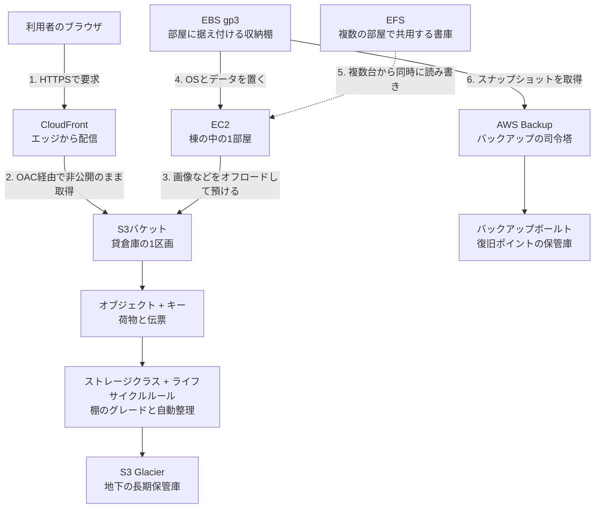

# AWS用語集 ④ストレージ

> 📖 [用語集トップ(索引)に戻る](../02-glossary.md) ｜ [← 前: ③コンピューティング](03-compute.md) ｜ [次: ⑤データベース →](05-database.md)

## この章で扱う範囲

サーバー構築の現場で「どこにデータを置くか」を間違えると、後からの修正がいちばん大変になります。ネットワークの設定はやり直せますが、消えたデータは戻ってこないからです。この章は、その「しまう場所」に関する用語をまとめたページです。

前半では、オブジェクト・ブロック・ファイルという**ストレージの3分類**を扱います。この3つの違いが分かると、「なぜ画像はS3に置き、OSはEBSに置き、複数台で共有したいファイルはEFSに置くのか」という設計判断が自分でできるようになります。中盤ではAmazon S3(貸倉庫)の基本と運用機能・セキュリティを、後半ではEC2に取り付けるディスクであるEBS(収納棚)と、それらをまとめて守るAWS Backup(バックアップの司令塔)を扱います。

具体的には、[レベル1: 静的Webサイト公開](../../projects/01-static-website/README.md)でS3を非公開のまま配信する場面、[レベル2: EC2 Webサーバー構築](../../projects/02-ec2-web-server/README.md)で `8GiB` のgp3ボリュームを選ぶ場面、[レベル4: WordPress本番環境](../../projects/04-wordpress-production/README.md)で画像をS3にオフロードし毎日3時にバックアップを取る場面、[レベル6: IaCとCI/CD](../../projects/06-iac-cicd/README.md)でtfstateをS3に保管する場面で、ここの用語がそのまま登場します。

> 🧠 **覚え方のコツ**: ストレージは「棚・倉庫・書庫」の3点セットで覚えてください。**棚(EBS)は1つの部屋の中だけ、倉庫(S3)は建物の外にあって誰の部屋からでも預けられる、書庫(EFS)は複数の部屋から同時に出入りできる共用スペース**です。「1部屋専用か・外部の倉庫か・共用か」の3択で考えると、どのサービスを選ぶかで迷わなくなります。

## この章の用語ミニ索引

| 用語 | ひとことで言うと |
|---|---|
| [オブジェクトストレージ](#オブジェクトストレージ) | ファイルを「伝票付きの荷物」単位でまるごと預ける方式 |
| [ブロックストレージ](#ブロックストレージ) | サーバーに直付けするディスクとして見える方式 |
| [ファイルストレージ](#ファイルストレージ) | 複数のサーバーから同じディレクトリを共有できる方式 |
| [耐久性](#耐久性) | 預けたデータを失わずに保ち続けられる度合い |
| [S3](#s3) | AWSの代表的なオブジェクトストレージ。容量ほぼ無制限の貸倉庫 |
| [バケット](#バケット) | S3でオブジェクトを入れる、世界で一意な名前を持つ入れ物 |
| [オブジェクト](#オブジェクト) | S3に保存されるデータ本体とメタデータの1セット |
| [キー](#キー) | バケット内でオブジェクトを一意に指す名前(パスのような文字列) |
| [プレフィックス](#プレフィックス) | キーの先頭部分。フォルダのように見える共通の文字列 |
| [REST APIエンドポイント](#rest-apiエンドポイント) | S3バケットの標準アクセス用アドレス |
| [静的ウェブサイトホスティング](#静的ウェブサイトホスティング) | S3単体でWebサイトを公開する機能 |
| [マルチパートアップロード](#マルチパートアップロード) | 大きなファイルを分割して並列にアップロードする方式 |
| [オフロード](#オフロード) | サーバー本体が抱えていた処理や保管を専用サービスへ切り出すこと |
| [ストレージクラス](#ストレージクラス) | アクセス頻度に応じて選ぶS3の保管グレード |
| [S3 Glacier](#s3-glacier) | 滅多に取り出さないデータ向けの長期保管クラス群 |
| [ライフサイクルルール](#ライフサイクルルール) | 経過日数に応じてクラス移行や削除を自動化するルール |
| [バージョニング](#バージョニング) | 上書き・削除しても旧世代を残しておく機能 |
| [オブジェクトロック](#オブジェクトロック) | 一定期間、オブジェクトの削除・上書きを禁止する仕組み |
| [S3イベント通知](#s3イベント通知) | アップロードなどをきっかけに他サービスを起動する機能 |
| [クロスリージョンレプリケーション](#クロスリージョンレプリケーション) | 別リージョンのバケットへ自動複製する機能 |
| [ブロックパブリックアクセス](#ブロックパブリックアクセス) | バケットの公開設定をまとめて封じる安全装置 |
| [バケットポリシー](#バケットポリシー) | バケット単位で誰に何を許可するかを書くJSONのルール |
| [SSE-S3](#sse-s3) | S3が管理する鍵で自動的に暗号化する保管時の暗号化 |
| [SSE-KMS](#sse-kms) | KMSの鍵を使って暗号化し、鍵の利用履歴も残す方式 |
| [EBS](#ebs) | EC2に取り付けるネットワーク接続型の仮想ディスク |
| [ルートボリューム](#ルートボリューム) | OSが入っている、EC2の起動ディスク |
| [gp3](#gp3) | 現在の標準となる汎用SSDのボリュームタイプ |
| [IOPS](#iops) | 1秒あたりに処理できる読み書き回数 |
| [EBSスナップショット](#ebsスナップショット) | ある時点のEBSボリュームを丸ごと保存したバックアップ |
| [増分バックアップ](#増分バックアップ) | 前回から変わった部分だけを保存する取得方式 |
| [EFS](#efs) | 複数のEC2から同時にマウントできる共有ファイルストレージ |
| [FSx](#fsx) | Windows向けなど特定用途に特化した共有ファイルストレージ |
| [Storage Gateway](#storage-gateway) | オンプレミス環境とAWSストレージを橋渡しする仕組み |
| [AWS Backup](#aws-backup) | 複数サービスのバックアップを一元管理するサービス |
| [バックアップボールト](#バックアップボールト) | 取得した復旧ポイントを収める保管庫 |
| [バックアッププラン](#バックアッププラン) | いつ・何を・どれだけ保持するかを定めた予定表 |
| [バックアップセレクション](#バックアップセレクション) | プランの対象リソースをタグなどで指定する設定 |
| [復旧ポイント](#復旧ポイント) | 「ここまで戻せる」という1回分のバックアップ成果物 |
| [保持期間](#保持期間) | 取得したバックアップを何日間残すかの設定 |

## 4-1. ストレージの3分類

### オブジェクトストレージ

**重要度**: ★★★

**ひとことで言うと**: ファイルを「データ本体+付随情報+一意な名前」を1セットにした**オブジェクト**という単位で、フラット(階層のない平らな構造)に保存する方式です。

**たとえるなら**: 貸倉庫の「宅配預かりサービス」です。荷物1つひとつに伝票(キー)を貼って窓口に預け、取り出すときは伝票番号で指定します。倉庫の中がどんな棚割りになっているかを利用者は知る必要がありません。

**もう少し詳しく**: オブジェクトストレージは、OSから見て「ドライブ」としては見えません。HTTP(Webページをやり取りする通信の約束事)ベースのAPI(プログラムから機能を呼び出すための窓口)を通じて、`PUT`(置く)・`GET`(取る)・`DELETE`(消す)という操作でやり取りします。ファイルの一部分だけを書き換えることは基本的にできず、更新は「まるごと置き換え」になります。その代わり、容量の上限を意識せずいくらでも預けられ、複数の拠点に自動で複製されるため非常に壊れにくい、という強みがあります。AWSでこれを担うのが[S3](#s3)です。

**サーバー構築での勘所**:
- 「追記や部分更新が頻繁に起きるデータ」には向きません。データベースが常時ランダムに書き換えるデータファイルの置き場所としては不向きですし、OSの起動領域はそもそも置けません(OSの起動には[ブロックストレージ](#ブロックストレージ)、AWSでは[EBS](#ebs)が必要です)。一方で、分析用にまるごと読み書きするデータをS3に置く使い方(データレイク)はごく一般的です。「S3にデータベースは載せられない」と丸暗記するのではなく、**「部分更新が頻繁なデータの置き場所ではない」**と覚えてください。
- 逆に、画像・動画・ログ・バックアップ・静的なHTMLといった「一度書いたら基本的に読むだけ」のデータは、オブジェクトストレージに置くのが定石です。
- 保存したオブジェクトはURLで一意に指せるため、[CloudFront](02-network.md#cloudfront)のようなCDN(利用者に近い拠点から配信する仕組み)と非常に相性がよいのが特徴です。

**関連用語**: [S3](#s3)、[オブジェクト](#オブジェクト)、[ブロックストレージ](#ブロックストレージ)、[ファイルストレージ](#ファイルストレージ)

**登場する案件**: [レベル1: 静的Webサイト公開環境の構築](../../projects/01-static-website/README.md)

### ブロックストレージ

**重要度**: ★★★

**ひとことで言うと**: サーバーから見て「1台のハードディスク」として認識される、ブロック(固定長の小さな区画)単位で読み書きする方式です。

**たとえるなら**: 部屋の中に据え付けられた「作り付けの収納棚」です。その部屋の住人だけが使え、引き出しの中をどう仕切って使うか(ファイルシステム)は住人が決めます。

**もう少し詳しく**: OSはブロックストレージを `/dev/xvda`([Nitro System](03-compute.md#nitro-system)世代のインスタンスでは `/dev/nvme0n1`)のようなデバイスとして認識し、その上に[ファイルシステム](09-linux-server-basics.md#ファイルシステム)(ディスクをファイルとディレクトリとして扱えるようにする形式。Linuxでは `xfs` や `ext4` が代表的)を作って使います。データの一部分だけを高速に書き換えられるため、OSの起動領域やデータベースのデータ置き場に適しています。AWSでこれを担うのが[EBS](#ebs)で、EC2に取り付けて使います。

**サーバー構築での勘所**:
- ブロックストレージは原則として「1つのサーバーに1つ」の関係で使います。複数台のEC2から同時に同じディスクを読み書きさせたい場合は、[EFS](#efs)などのファイルストレージを検討します。
- 容量を増やすときは、AWS側でボリュームを拡張したうえで、OS側でもパーティションとファイルシステムを拡張する2段階の作業が必要になるのが一般的です。「コンソールで広げたのに `df` で増えていない」はこの2段階目の忘れが原因です。⚠️ コンソールのブロックデバイスマッピング上の名前(`/dev/xvda`)と、OS側で実際に見えるデバイス名(Nitro世代では `nvme0n1`)は一致しないことがあります。拡張コマンドにデバイス名を渡す前に、必ず `lsblk`(接続されているディスクを一覧表示するコマンド)で実際の名前を確認してください。
- Auto Scaling(需要に応じてサーバー台数を自動増減する仕組み)で台数が増減する構成では、ブロックストレージ上のデータは「そのサーバーが消えれば一緒に消える」前提で設計します。

**関連用語**: [EBS](#ebs)、[ルートボリューム](#ルートボリューム)、[オブジェクトストレージ](#オブジェクトストレージ)、[IOPS](#iops)

**登場する案件**: [レベル2: EC2 Webサーバー構築](../../projects/02-ec2-web-server/README.md)

### ファイルストレージ

**重要度**: ★★

**ひとことで言うと**: 複数のサーバーから、同じディレクトリ階層を同時にマウント(OSのディレクトリツリーに接続して使える状態にすること)して共有できる方式です。

**たとえるなら**: 建物の中にある「共用の書庫」です。何人もの社員が同時に出入りして、同じ棚の同じファイルを読み書きできます。

**もう少し詳しく**: NFS(ネットワーク越しにファイル共有を行う代表的なプロトコル)やSMB(Windowsで一般的なファイル共有プロトコル)といった仕組みを使い、ネットワーク越しに「フォルダを共有する」形をとります。オブジェクトストレージと違ってファイルの部分更新ができ、ブロックストレージと違って複数台から同時にアクセスできる、という中間の性質を持ちます。AWSでは[EFS](#efs)(Linux向け)と[FSx](#fsx)(Windowsなど特定用途向け)が該当します。

**サーバー構築での勘所**:
- 「Auto Scalingで増えたサーバーからも、同じアップロード画像を見せたい」という要件では、最初にファイルストレージが候補に挙がります。ただし本ポートフォリオの[レベル4](../../projects/04-wordpress-production/README.md)では、コストと配信速度の観点からS3への[オフロード](#オフロード)を選択しています。どちらが正解ということはなく、要件次第で選び分ける判断ができることが重要です。
- ネットワーク越しのアクセスになるため、ローカルディスク([EBS](#ebs))よりも1回あたりの応答は遅くなります。大量の小さいファイルを高頻度で読み書きする用途では、性能検証を必ず行ってください。

**関連用語**: [EFS](#efs)、[FSx](#fsx)、[オフロード](#オフロード)、[ブロックストレージ](#ブロックストレージ)

### 耐久性

**読み方**: たいきゅうせい ｜ **重要度**: ★★

**ひとことで言うと**: 預けたデータを、機器の故障などで失わずに保ち続けられる度合いのことです。

**たとえるなら**: 倉庫が「預かった荷物を紛失しない確率」です。可用性(いつでも受付が開いている度合い)とは別の指標で、こちらは「開いているか」ではなく「無くさないか」を表します。

**もう少し詳しく**: 混同されがちですが、耐久性(Durability)と可用性(Availability)は別物です。耐久性は「データが失われないか」、可用性は「必要なときにアクセスできるか」を指します。S3の標準的なストレージクラスは、複数のアベイラビリティゾーン(AZ。リージョン内にある電源・回線が独立したデータセンター群)にデータを自動複製することで、**99.999999999%(9が11個)の耐久性を実現するよう設計されている**とAWSが公表しています。これは1,000万個のオブジェクトを預けても1個失うまでに1万年かかる計算に相当する、という説明でよく紹介されます。

**サーバー構築での勘所**:
- 「耐久性が高い=バックアップが不要」ではありません。AWSが守ってくれるのは機器故障によるデータ消失であり、**利用者自身の誤操作による削除・上書きは対象外**です。ここは[責任共有モデル](01-cloud-basics.md#責任共有モデル)(AWSとお客様で守備範囲を分担する考え方)の典型例です。誤削除には[バージョニング](#バージョニング)や[AWS Backup](#aws-backup)で備えます。
- 名前に「One Zone」が付くストレージクラスは1つのAZにしかデータを置かないため、耐久性の前提が変わります。安いからと安易に選ばず、「そのAZが失われても再作成できるデータか」で判断してください。

**関連用語**: [ストレージクラス](#ストレージクラス)、[バージョニング](#バージョニング)、[AWS Backup](#aws-backup)

## 4-2. S3の基本

### S3

**正式名称**: Amazon Simple Storage Service ｜ **読み方**: エススリー ｜ **重要度**: ★★★

**ひとことで言うと**: 容量をほぼ意識せずファイルを預けられる、AWSの代表的なオブジェクトストレージサービスです。

**たとえるなら**: 「巨大な貸倉庫」です。[レベル1](../../projects/01-static-website/README.md)では「鍵のかかった倉庫」として登場し、お客さんは倉庫に直接は入れず、必ず受付窓口([CloudFront](02-network.md#cloudfront))を通してしか商品を受け取れない構成にします。

**もう少し詳しく**: S3は[バケット](#バケット)という入れ物を作り、その中に[オブジェクト](#オブジェクト)を[キー](#キー)という名前で保存します。ディスク容量をあらかじめ確保する必要がなく、預けた分だけ課金される従量課金です。静的ファイルの配信元(オリジン)、ログの集積先、バックアップの保管先、[tfstate](08-iac-cicd.md#tfstate)(Terraformが現在の構築状況を記録する台帳ファイル)の置き場所など、AWSのあらゆる場所に顔を出す「土台」のサービスです。リージョン(AWSのデータセンター群がある地理的な単位)を指定して作成しますが、バケット名だけは全世界で一意である必要があるという独特の性質を持ちます。

**サーバー構築での勘所**:
- **S3は「置いた瞬間から公開される」わけではありません。** 初期状態では非公開で、[ブロックパブリックアクセス](#ブロックパブリックアクセス)も有効になっています。この初期状態を崩さずに配信する方法(=[OAC](02-network.md#oac)を使ったCloudFront経由の配信)が、本ポートフォリオが一貫して採っている設計です。
- S3への書き込み権限は、EC2に付与する[IAMロール](06-security-identity.md#iamロール)(サービスが一時的に借りる期限付きの身分証)で渡します。アクセスキー(長期間有効なID/シークレットの組)をサーバー内に書き置く方式は避けてください。
- 「どのバケットが何のためのものか」が後から分からなくなりがちです。`用途-環境-アカウント固有文字列` のような命名規則と[タグ](01-cloud-basics.md#タグ)付けを最初に決めておくと、コスト分析も棚卸しも楽になります。

**よくあるつまずき**: バケット名は全世界で一意のため、`test-bucket` のような一般的な名前はほぼ確実に他人が使用済みです。`your-portfolio-site-2026` のように、自分固有の文字列を混ぜて衝突を避けます。

**💰 コスト**: 保存容量(GB単位)・リクエスト回数・AWS外部へのデータ転送量の3軸で課金されます。無料利用枠には標準ストレージ5GBやリクエスト回数の枠が含まれます。最新の料金・無料利用枠の条件は必ず公式ページで確認してください([Amazon S3の料金](https://aws.amazon.com/jp/s3/pricing/)、[AWS無料利用枠](https://aws.amazon.com/jp/free/))。

**関連用語**: [バケット](#バケット)、[オブジェクト](#オブジェクト)、[バケットポリシー](#バケットポリシー)、[ブロックパブリックアクセス](#ブロックパブリックアクセス)、[ストレージクラス](#ストレージクラス)

**登場する案件**: [レベル1: 静的Webサイト公開環境の構築](../../projects/01-static-website/README.md)、[レベル4: WordPress本番環境](../../projects/04-wordpress-production/README.md)、[レベル6: IaCとCI/CD](../../projects/06-iac-cicd/README.md)

### バケット

**重要度**: ★★★

**ひとことで言うと**: S3でオブジェクトを保存するための入れ物で、全世界で重複しない名前を持つ最上位の単位です。

**たとえるなら**: 貸倉庫の「1区画」です。区画の入口には看板(バケット名)が掲げられていて、その看板の文字列は世界中の倉庫と重複してはいけない、という決まりがあります。

**もう少し詳しく**: バケットは作成時にリージョンを選び、以後そのリージョンから動きません。名前は小文字・数字・ハイフンで構成し、3文字以上63文字以下という制約があります(詳細な命名規則は[Amazon S3ユーザーガイド](https://docs.aws.amazon.com/AmazonS3/latest/userguide/Welcome.html)を確認してください)。公開設定・暗号化・バージョニング・ライフサイクル・ログ出力といった主要な設定は、原則としてこのバケット単位で行います。つまり**バケットは「セキュリティと運用ポリシーの境界線」**でもあります。

**サーバー構築での勘所**:
- 用途が違うデータは、同じバケットにプレフィックスで混ぜるのではなく**バケットを分ける**ほうが安全です。公開用の静的ファイルと、社外に出てはいけないログを同じバケットに入れると、公開設定を1回間違えただけで事故になります。
- [レベル6](../../projects/06-iac-cicd/README.md)のtfstate用バケットのように、機密性の高いバケットには「パブリックアクセスブロック+暗号化+バージョニング」の3点セットを必ず有効にします。
- バケット名はURLの一部として外部から見えることがあります。会社名や内部システム名をそのまま使うと情報を推測される材料になるため、命名には少し配慮してください。

**よくあるつまずき**: バケットは中身が空でないと削除できません。バージョニングを有効にしていた場合は、旧バージョンと削除マーカー(削除されたことを示す印)も残っているため、「空にしたつもりなのに消せない」という状態になりがちです。

**関連用語**: [S3](#s3)、[キー](#キー)、[バケットポリシー](#バケットポリシー)、[REST APIエンドポイント](#rest-apiエンドポイント)

**登場する案件**: [レベル1: 静的Webサイト公開環境の構築](../../projects/01-static-website/README.md)

### オブジェクト

**重要度**: ★★★

**ひとことで言うと**: S3に保存されるデータの1単位で、データ本体・メタデータ(付随情報)・キー(名前)をひとまとめにしたものです。

**たとえるなら**: 倉庫に預ける「荷物1つ」です。中身(データ本体)、貼られた伝票(キー)、伝票に書かれた品名や日付(メタデータ)がセットになっています。

**もう少し詳しく**: オブジェクトは「まるごと置き換え」が基本で、ファイルの途中の1行だけを書き換えるといった操作はできません。メタデータには、`Content-Type`(そのファイルがHTMLなのか画像なのかを示す種別)などの標準的な項目に加え、自分で決めた任意の項目を持たせることもできます。1つのオブジェクトのサイズ上限は5TB程度とされており、一定サイズを超えるアップロードには[マルチパートアップロード](#マルチパートアップロード)が必要です(具体的な上限値の最新情報は[Amazon S3ユーザーガイド](https://docs.aws.amazon.com/AmazonS3/latest/userguide/Welcome.html)を確認してください)。

**サーバー構築での勘所**:
- `Content-Type` が正しく設定されていないと、ブラウザがHTMLをテキストとして表示したり、CSSが適用されなかったりします。CLIでアップロードするときは、この項目が意図通りかを確認してください。
- S3は現在、書き込み後すぐの読み取りでも最新の内容が返る「強い読み取り整合性」を提供します。かつて存在した「更新直後に古い内容が返ることがある」という制約を前提にした古い記事は、そのまま鵜呑みにしないよう注意してください。
- オブジェクトの削除・上書きから守りたい場合は、[バージョニング](#バージョニング)を有効にします。有効化はバケット単位ですが、守られるのは1つひとつのオブジェクトです。

**関連用語**: [キー](#キー)、[バケット](#バケット)、[バージョニング](#バージョニング)、[マルチパートアップロード](#マルチパートアップロード)

### キー

**読み方**: キー ｜ **重要度**: ★★

**ひとことで言うと**: バケットの中でオブジェクトを一意に指し示す名前で、`images/2026/photo.jpg` のようなパス風の文字列です。

**たとえるなら**: 荷物に貼る「伝票の管理番号」です。番号さえ分かれば、倉庫のどこにあっても1つの荷物を確実に取り出せます。

**もう少し詳しく**: 重要なのは、S3には**本当のフォルダは存在しない**という点です。コンソールでフォルダのように見えているのは、キーに含まれる `/` を区切り文字として画面上でそう表示しているだけで、実体はフラットな名前空間に並んだキーの集まりです。ですから「空のフォルダ」という概念も厳密には存在しません。ただし、コンソールの「フォルダの作成」はキーの末尾が `/` の0バイトのオブジェクト(フォルダの目印として置かれるだけの、中身のないオブジェクト)を作ります。⚠️ このオブジェクトが残っている限り、配下のファイルを全部消してもコンソール上にはフォルダが表示され続けます。フォルダごと消したいときは、この末尾が `/` のオブジェクト自体も削除してください。[バケット](#バケット)を空にしたはずなのに削除できない、という定番のつまずきの原因の1つです。

**サーバー構築での勘所**:
- キーには日付やIDを含む階層的な命名を採用すると、後から[ライフサイクルルール](#ライフサイクルルール)を「特定のプレフィックス配下だけ」に適用しやすくなります。`logs/2026/09/…` のような形が定番です。
- キーの大文字・小文字は区別されます。`Index.html` と `index.html` は別のオブジェクトです。Webサイト配信でリンク切れが起きたときの定番の原因の1つです。
- スペースや日本語をキーに含めることは可能ですが、URLエンコード(URLで使えない文字を `%XX` の形に変換すること)が絡んでトラブルの元になりやすいため、英数字・ハイフン・アンダースコアに寄せるのが無難です。

**関連用語**: [オブジェクト](#オブジェクト)、[プレフィックス](#プレフィックス)、[バケット](#バケット)

### プレフィックス

**読み方**: プレフィックス ｜ **重要度**: ★★

**ひとことで言うと**: キーの先頭部分にあたる共通の文字列で、コンソール上ではフォルダのように見えるまとまりです。

**たとえるなら**: 伝票番号の「先頭の共通コード」です。`A-`で始まる番号は生鮮品、`B-`で始まる番号は書類、というように、番号の頭を見ればどの棚のグループかが分かります。

**もう少し詳しく**: `images/2026/photo.jpg` というキーであれば、`images/` や `images/2026/` がプレフィックスです。プレフィックスは単なる見た目の話にとどまらず、[バケットポリシー](#バケットポリシー)や[IAMポリシー](06-security-identity.md#iamポリシー)で「このプレフィックス配下だけ読み書きを許可する」といった権限の絞り込みに使えますし、[ライフサイクルルール](#ライフサイクルルール)の適用範囲を限定するのにも使われます。

**サーバー構築での勘所**:
- 権限設計の単位として使えるので、`public/` と `private/` のようにプレフィックスで用途を分けておくと、後から最小権限を組みやすくなります。ただし、より確実に分離したいデータは[バケット](#バケット)自体を分けてください。
- 1つのバケットに膨大なオブジェクトを入れる場合、プレフィックスの設計が読み書き性能に影響することがあります。大規模なデータ基盤を作る段階になったら[Amazon S3ユーザーガイド](https://docs.aws.amazon.com/AmazonS3/latest/userguide/Welcome.html)の性能に関するベストプラクティスを確認してください。

**関連用語**: [キー](#キー)、[ライフサイクルルール](#ライフサイクルルール)、[バケットポリシー](#バケットポリシー)

### REST APIエンドポイント

**読み方**: レストエーピーアイエンドポイント ｜ **重要度**: ★★

**ひとことで言うと**: S3バケットに対する標準のアクセス用アドレスで、`バケット名.s3.リージョン.amazonaws.com` という形式のURLです。

**たとえるなら**: 倉庫の「正式な業務用受付窓口」です。一般客向けの直売所の入口([静的ウェブサイトホスティング](#静的ウェブサイトホスティング)のエンドポイント)とは別に、伝票を扱う正規のカウンターが用意されているイメージです。

**もう少し詳しく**: S3には性質の異なる2種類のエンドポイントがあります。1つがこのREST APIエンドポイントで、HTTPSに対応し、IAMによる認証・認可がそのまま効きます。もう1つが静的ウェブサイトホスティング専用のエンドポイントで、こちらはHTTPのみ・匿名公開が前提です。[レベル1](../../projects/01-static-website/README.md)では、[OAC](02-network.md#oac)(CloudFrontだけがS3にアクセスできるようにする仕組み)が使うのはこのREST APIエンドポイントのほうだ、という点が重要な設計ポイントになっています。

**サーバー構築での勘所**:
- CloudFrontのオリジン(配信元)を設定するとき、候補一覧に出てくるのがREST APIエンドポイントです。ここで静的ウェブサイトホスティングのエンドポイントを手入力してしまうと、OACによる非公開配信が成立しなくなります。
- インターネットを経由せずVPC内からS3にアクセスしたい場合は、[VPCエンドポイント](02-network.md#vpcエンドポイント)(AWSサービスへの専用の入り口)を使います。この場合もアクセス先はREST APIエンドポイントです。

**関連用語**: [静的ウェブサイトホスティング](#静的ウェブサイトホスティング)、[バケット](#バケット)、[ブロックパブリックアクセス](#ブロックパブリックアクセス)

**登場する案件**: [レベル1: 静的Webサイト公開環境の構築](../../projects/01-static-website/README.md)

### 静的ウェブサイトホスティング

**重要度**: ★★

**ひとことで言うと**: S3バケット単体でWebサイトとしてファイルを配信できるようにする、S3のオプション機能です。

**たとえるなら**: 倉庫の壁に「直売所」の看板を出して、一般のお客さんを倉庫に直接入れるようにする機能です。手軽ですが、倉庫の入口をそのまま開放することになります。

**もう少し詳しく**: 有効にすると、インデックスドキュメント(`index.html` など、ディレクトリにアクセスされたときに返すファイル)やエラードキュメントを指定でき、専用のエンドポイントが払い出されます。ただしこのエンドポイントは**HTTPのみでHTTPSに対応せず**、配信するにはバケットを匿名アクセス可能にする必要があります。つまり[ブロックパブリックアクセス](#ブロックパブリックアクセス)を解除しなければ使えません。

**サーバー構築での勘所**:
- ⚠️ 本ポートフォリオの[レベル1](../../projects/01-static-website/README.md)では、この機能を**あえて有効にしません**。HTTPS化・アクセス制御・キャッシュ配信を一元管理するために、S3は非公開のままにして[CloudFront](02-network.md#cloudfront)+[OAC](02-network.md#oac)で配信する構成を選んでいます。
- 「S3だけで公開できるのに、なぜCloudFrontを挟んだのか」は面接で問われやすい論点です。答えは「S3を直接公開するとCloudFrontを迂回する裏口URLが生まれ、HTTPS強制・キャッシュ・ログ一元管理をすべて素通りされてしまうから」です。
- 検証用に一時的にこの機能を使う場合でも、使い終わったら必ずブロックパブリックアクセスを元に戻してください。

**関連用語**: [REST APIエンドポイント](#rest-apiエンドポイント)、[ブロックパブリックアクセス](#ブロックパブリックアクセス)、[バケットポリシー](#バケットポリシー)

**登場する案件**: [レベル1: 静的Webサイト公開環境の構築](../../projects/01-static-website/README.md)

### マルチパートアップロード

**重要度**: ★

**ひとことで言うと**: 大きなファイルを複数のパート(部分)に分割し、並列にアップロードしてからS3側で1つのオブジェクトに結合する方式です。

**たとえるなら**: 大型の家具を「解体して小分けで搬入し、倉庫の中で組み立て直す」やり方です。1台のトラックで運びきれない荷物でも、分ければ運べます。

**もう少し詳しく**: 一定のサイズ(単一のPUTリクエストで送れる上限)を超えるオブジェクトは、この方式でしかアップロードできません。AWS CLIやSDKは、大きなファイルを検知すると自動的にマルチパートアップロードへ切り替えてくれるため、普段は意識せずに使えています。分割することで、途中で失敗しても失敗したパートだけを送り直せる、というメリットもあります。

**サーバー構築での勘所**:
- ⚠️ 途中で中断したマルチパートアップロードは、**未完了のパートがバケットに残り、そのまま課金対象になります**。コンソールからは見えないため気づきにくく、「使っていないバケットなのに料金が発生する」の典型的な原因になります。
- 対策は、[ライフサイクルルール](#ライフサイクルルール)に「不完全なマルチパートアップロードを一定日数後に削除する」ルールを入れておくことです。新規バケットを作ったら反射的に設定しておくとよい、実務的な習慣です。

**関連用語**: [オブジェクト](#オブジェクト)、[ライフサイクルルール](#ライフサイクルルール)

### オフロード

**重要度**: ★★

**ひとことで言うと**: サーバー本体が抱えていた処理や保管の役割を、専用のサービスへ切り出して肩代わりさせることです。

**たとえるなら**: 部屋(EC2)の中に段ボールを積み上げるのをやめて、外の貸倉庫(S3)に預ける判断です。部屋は作業に専念でき、荷物は誰の部屋からでも取り出せるようになります。

**もう少し詳しく**: [レベル4](../../projects/04-wordpress-production/README.md)では、WordPressのアップロード画像をEC2のローカルディスクではなくS3に保存する設計を「メディアのオフロード」と呼んでいます。理由は明快で、Auto Scalingで台数が増減する構成では、画像を各EC2のディスクに置くと「アクセスしたサーバーによって画像が見えたり見えなかったりする」からです。保管をS3に切り出し、配信をCloudFrontに切り出すことで、EC2は「動的な処理だけを行う、いつでも捨てられる存在」になります。この性質を[ステートレス](03-compute.md#ステートレス)な構成と呼びます。

**サーバー構築での勘所**:
- オフロードの判断基準は「そのサーバーが突然消えても困らないか」です。困るデータがローカルディスクに残っているなら、S3・[EFS](#efs)・データベースのいずれかへ逃がします。
- 静的ファイル(画像・CSS・JavaScript)の配信をCloudFront+S3に寄せると、EC2のCPUとネットワーク帯域が空き、同じインスタンスタイプでもさばける同時アクセス数が増えます。コスト削減と性能改善が同時に効く、費用対効果の高い施策です。
- セッション情報(ログイン状態など)のオフロード先はS3ではなく、[ElastiCache](05-database.md#elasticache)などのインメモリキャッシュが定番です。「何をどこへ逃がすか」の対応表を頭に持っておいてください。

**関連用語**: [S3](#s3)、[EFS](#efs)、[ファイルストレージ](#ファイルストレージ)

**登場する案件**: [レベル4: WordPress本番環境](../../projects/04-wordpress-production/README.md)

## 4-3. S3の運用機能

### ストレージクラス

**重要度**: ★★

**ひとことで言うと**: アクセス頻度と取り出しの速さに応じて選べる、S3の保管グレードのことです。

**たとえるなら**: 倉庫の「棚のグレード」です。毎日出し入れする荷物は取り出しやすい手前の棚(標準)、年に1回しか触らない荷物は奥の低温倉庫(アーカイブ)に置いたほうが保管料は安く済みます。

**もう少し詳しく**: 代表的なものに、頻繁にアクセスするデータ向けの「S3 標準」、アクセス頻度が下がったデータ向けの「標準-低頻度アクセス(Standard-IA)」、アクセスパターンをAWSが監視して自動で階層を移す「Intelligent-Tiering」、そして長期保管向けの[S3 Glacier](#s3-glacier)系があります。保管単価が安いクラスほど、取り出し(リクエストやデータ取得)にかかる料金が高く、最低保管期間(その期間より早く削除しても課金される日数)が設定されている、という関係になっています。クラスの一覧と特徴は[Amazon S3ストレージクラス](https://aws.amazon.com/jp/s3/storage-classes/)で確認してください。

**サーバー構築での勘所**:
- 「安いクラスに移せば必ず得」ではありません。**保管料は下がっても取り出し料が上がる**ため、アクセス頻度の見積もりを外すとかえって高くつきます。頻度が読めないデータはIntelligent-Tieringが無難な選択肢になります。
- 最低保管期間より前に削除すると、残り日数分の保管料が請求されます。短期間で消すデータを低頻度アクセス系のクラスに置くのは逆効果です。
- クラスの切り替えは手作業ではなく[ライフサイクルルール](#ライフサイクルルール)で自動化するのが基本です。

**💰 コスト**: クラスごとに保管単価・取り出し料金・最低保管期間が異なります。最新の料金・無料利用枠の条件は必ず公式ページで確認してください([Amazon S3の料金](https://aws.amazon.com/jp/s3/pricing/)、[AWS無料利用枠](https://aws.amazon.com/jp/free/))。

**関連用語**: [S3 Glacier](#s3-glacier)、[ライフサイクルルール](#ライフサイクルルール)、[耐久性](#耐久性)

### S3 Glacier

**読み方**: エススリーグレイシャー ｜ **重要度**: ★★

**ひとことで言うと**: 滅多に取り出さないデータを、非常に安い単価で長期保管するためのS3のアーカイブ用ストレージクラス群です。

**たとえるなら**: 倉庫の「地下にある長期保管庫」です。保管料はとても安い代わりに、取り出しを頼むと係員が地下まで降りて運び出すため、荷物が手元に届くまで時間がかかります。

**もう少し詳しく**: 現在は単独のサービスというより、S3のストレージクラスの一系統として提供されています。取り出しの速さに応じて複数のクラスがあり、ミリ秒単位で取り出せる Glacier Instant Retrieval、取り出し要求から数分〜数時間かかる Glacier Flexible Retrieval、そして標準の取り出しで約12時間・最も安いBulkでは最大48時間程度かかる Glacier Deep Archive まで幅があります(最新の取り出し時間は[Amazon S3ストレージクラス](https://aws.amazon.com/jp/s3/storage-classes/)で確認してください)。つまりDeep Archiveは「半日〜2日待つ前提の保管庫」です。「取り出しに時間がかかる」という特性は、災害復旧やコンプライアンス(法令・社内規程の遵守)目的の長期保管には問題になりませんが、「明日の障害対応で使うかもしれないバックアップ」を置く先としては不向きです。

**サーバー構築での勘所**:
- ⚠️ 復旧時間の要件([RTO](01-cloud-basics.md#rto)。障害発生から復旧までの許容時間)と、アーカイブクラスの取り出し時間が矛盾していないかを必ず確認してください。「安いから」で選んだ保管先のせいで復旧が半日遅れる、というのは実際に起こる設計ミスです。
- 最低保管期間が長め(クラスによっては数か月単位)に設定されているため、短期間で消すデータには向きません。
- アーカイブ系クラスは、保管料だけでなく**取り出し時のデータ量課金**が発生します。「年1回の監査で全件取り出す」といった運用がある場合は、その分のコストも見積もっておきます。

**💰 コスト**: 保管単価は標準クラスより大幅に安い一方、取り出し料金と最低保管期間があります。最新の料金・無料利用枠の条件は必ず公式ページで確認してください([Amazon S3の料金](https://aws.amazon.com/jp/s3/pricing/)、[AWS無料利用枠](https://aws.amazon.com/jp/free/))。

**関連用語**: [ストレージクラス](#ストレージクラス)、[ライフサイクルルール](#ライフサイクルルール)、[保持期間](#保持期間)

### ライフサイクルルール

**重要度**: ★★

**ひとことで言うと**: オブジェクトの経過日数に応じて、ストレージクラスの移行や削除を自動で行わせるルールです。

**たとえるなら**: 倉庫の「自動整理係」です。「預けてから90日経った荷物は地下へ移す」「1年経ったら処分する」という指示書を渡しておけば、あとは勝手に整理してくれます。

**もう少し詳しく**: ルールはバケット単位で作成し、適用範囲を[プレフィックス](#プレフィックス)やタグで絞り込めます。設定できるアクションは主に3種類です。(1) 一定日数後に別の[ストレージクラス](#ストレージクラス)へ移行する、(2) 一定日数後にオブジェクトを削除する、(3) [バージョニング](#バージョニング)有効時に、旧バージョンを一定日数後に移行・削除する。加えて、[マルチパートアップロード](#マルチパートアップロード)の未完了パートを削除する設定もここで行います。

**サーバー構築での勘所**:
- ログの保管は、ライフサイクルルールの一番の活躍どころです。「30日は標準、90日でアーカイブ、1年で削除」のような階段を組むと、放っておいてもコストが膨らみません。
- ⚠️ ただし、ログのように小さいファイルが大量にある場合、この階段はかえって高くつくことがあります。[S3 Glacier](#s3-glacier)系のクラスは1オブジェクトあたり約40KB分のメタデータが保管料に上乗せされ、クラス移行そのものにもリクエスト料金がかかるためです。さらに現在のライフサイクルは既定で128KB未満のオブジェクトを移行しないため、「アーカイブに移したつもりが移っていない」という状態も起こります(いずれも最新の条件は[Amazon S3ユーザーガイド](https://docs.aws.amazon.com/AmazonS3/latest/userguide/Welcome.html)で確認してください)。細かいログは、アーカイブへ移す前に日次でまとめて1ファイルに集約する設計を先に検討してください。
- ⚠️ 削除アクションは取り消せません。設定時は対象範囲(プレフィックスやタグの条件)を二重に確認し、可能なら本番より先に検証用バケットで挙動を見てください。
- バージョニングを有効にしたバケットでは、旧バージョンにもライフサイクルルールを設定しないと、消したはずのデータが旧バージョンとして残り続けて課金されます。ここは非常に見落としやすいポイントです。

**関連用語**: [ストレージクラス](#ストレージクラス)、[バージョニング](#バージョニング)、[S3 Glacier](#s3-glacier)、[プレフィックス](#プレフィックス)

### バージョニング

**重要度**: ★★★

**ひとことで言うと**: 同じキーに上書きしたり削除したりしても、以前の世代のオブジェクトを残しておくS3の機能です。

**たとえるなら**: 荷物を差し替えるときに、古い荷物を捨てずに「旧版」として棚に残しておく運用です。間違えて差し替えてしまっても、旧版を棚から出せば元に戻せます。

**もう少し詳しく**: バケット単位で有効にすると、以後のアップロードごとに固有のバージョンIDが振られ、旧バージョンもすべて保持されます。削除操作を行っても実体は消えず、「削除マーカー」という印が最新バージョンとして置かれるだけです。削除マーカーを取り除けばオブジェクトが復活します。これがS3における誤削除・誤上書きへの第一の防衛線です。なお、**一度有効にしたバージョニングは無効化(停止)はできても、完全に元の状態には戻せません**。

**サーバー構築での勘所**:
- [レベル6](../../projects/06-iac-cicd/README.md)のtfstate用バケットでは、バージョニングを必須にしています。誤った `terraform apply` を実行しても、1つ前のtfstateへ戻せるようにするためです。[ステートロック](08-iac-cicd.md#ステートロック)と並ぶ、IaC運用の安全装置と考えてください。
- ⚠️ 旧バージョンも通常どおり保管料が発生します。頻繁に更新されるオブジェクトを置いたバケットでバージョニングを有効にしたまま放置すると、見えないところで容量が膨らみます。必ず[ライフサイクルルール](#ライフサイクルルール)で旧バージョンの整理をセットにしてください。
- [クロスリージョンレプリケーション](#クロスリージョンレプリケーション)や[オブジェクトロック](#オブジェクトロック)は、バージョニングが有効であることが前提条件です。

**よくあるつまずき**: 「オブジェクトを全部消したのにバケットが削除できない」「使っていないのに容量が減らない」の原因はたいてい旧バージョンと削除マーカーの残存です。コンソールの「バージョンを表示」を切り替えて確認してください。

**関連用語**: [オブジェクト](#オブジェクト)、[ライフサイクルルール](#ライフサイクルルール)、[オブジェクトロック](#オブジェクトロック)、[クロスリージョンレプリケーション](#クロスリージョンレプリケーション)

**登場する案件**: [レベル6: IaCとCI/CDによる自動構築](../../projects/06-iac-cicd/README.md)

### オブジェクトロック

**重要度**: ★

**ひとことで言うと**: 指定した期間、オブジェクトの削除や上書きを誰にも(場合によっては管理者にも)させないようにする仕組みです。

**たとえるなら**: 荷物に「開封・持ち出し禁止」の封印シールを貼り、期限が来るまで剥がせないようにすることです。倉庫の管理人であっても勝手には触れません。

**もう少し詳しく**: WORM(Write Once Read Many。一度書いたら読むだけで変更できない)と呼ばれる保護方式です。運用者が権限を持てば解除できる「ガバナンスモード」と、期間中は誰も解除できない「コンプライアンスモード」があります。監査ログや法令で保存が義務づけられた記録、そしてランサムウェア(データを暗号化して身代金を要求する攻撃)対策としてのバックアップ保護に使われます。利用には[バージョニング](#バージョニング)の有効化が必要です。以前はバケット作成時にしか有効化できませんでしたが、現在はバージョニングが有効な既存バケットに対しても後から有効化できます(すでに保存済みのオブジェクトへ保持設定を適用するには、S3バッチオペレーションなどで別途行います)。

**サーバー構築での勘所**:
- ⚠️ コンプライアンスモードは強力すぎるほど強力です。期間設定を間違えると、不要なデータを長期間削除できず保管料を払い続けることになります。検証は必ずガバナンスモードか、捨ててよい検証用バケットで行ってください。
- 「攻撃者に管理者権限を奪われてもバックアップだけは消せない」という状態を作れるのが最大の価値です。同じ思想の機能が[AWS Backup](#aws-backup)側にもあります(ボールトロック)。

**関連用語**: [バージョニング](#バージョニング)、[バックアップボールト](#バックアップボールト)、[保持期間](#保持期間)

### S3イベント通知

**重要度**: ★★

**ひとことで言うと**: オブジェクトのアップロードや削除をきっかけに、他のAWSサービスへ自動で知らせる機能です。

**たとえるなら**: 倉庫に「荷物が届いたら受付のベルが鳴る」仕掛けを付けることです。ベルが鳴れば、担当者(後続の処理)がすぐ動き出せます。

**もう少し詳しく**: 通知先としては[SNS](07-monitoring-operations.md#sns)(一斉放送システム)、[SQS](07-monitoring-operations.md#sqs)(処理待ちの行列を作るキュー)、[Lambda](03-compute.md#lambda)(サーバー管理なしでコードだけを実行する仕組み)、そして[EventBridge](07-monitoring-operations.md#eventbridge)(何かが起きたら次の動作を始めるセンサー付き自動ドア)を指定できます。「画像がアップロードされたらサムネイルを自動生成する」「ログファイルが置かれたら解析処理を起動する」といった、イベント駆動(何かが起きたことをきっかけに処理を始める方式)の構成を作る土台になります。

**サーバー構築での勘所**:
- 同じバケットに似た条件のイベント通知を複数設定すると、設定が競合してエラーになることがあります。細かい振り分けが必要になったらEventBridge経由に一本化するとルールを整理しやすくなります。
- 通知は「必ず1回だけ届く」とは限りません。後続の処理は、同じ通知が2回来ても結果が変わらないように作る(冪等性を持たせる)のが定石です。
- 通知先のLambdaが処理したファイルを同じバケットに書き戻すと、その書き込みがまた通知を発火させて無限ループになります。⚠️ 出力先は別バケットか別プレフィックスにしてください。

**関連用語**: [オブジェクト](#オブジェクト)、[プレフィックス](#プレフィックス)、[バケット](#バケット)

### クロスリージョンレプリケーション

**読み方**: クロスリージョンレプリケーション ｜ **重要度**: ★

**ひとことで言うと**: あるバケットに置かれたオブジェクトを、別のリージョンのバケットへ自動的に複製し続ける機能です。

**たとえるなら**: 「別の県にある倉庫にも、同じ荷物のコピーを自動で送っておく」仕組みです。片方の県が災害に見舞われても、もう片方から荷物を取り出せます。

**もう少し詳しく**: 複製元・複製先の両方のバケットで[バージョニング](#バージョニング)が有効であることが前提です。複製は非同期(元への書き込みが完了した後、少し遅れて反映される方式)で行われるため、書いた直後に複製先を見ても、まだ届いていないことがあります。同じ仕組みを同一リージョン内で使う同一リージョンレプリケーション(SRR)という設定もあり、こちらはアカウント間でのデータ共有や、ログの集約に使われます。なお設定にあたっては、S3がオブジェクトを複製するために引き受ける[IAMロール](06-security-identity.md#iamロール)を用意する必要があります。

**サーバー構築での勘所**:
- 目的を明確にしてから採用してください。リージョン規模の障害に備える[ディザスタリカバリ](01-cloud-basics.md#ディザスタリカバリ)(大規模災害からの復旧対策)なのか、遠隔地の利用者へのレイテンシ(応答が返り始めるまでの待ち時間)改善なのかで、複製先の選び方が変わります。
- 💰 複製先の保管料と、リージョン間のデータ転送料が追加で発生します。「念のため全部複製」は費用対効果が悪くなりがちです。
- レプリケーションが設定される前から存在していたオブジェクトは、既定では複製されません。既存データも揃えたい場合はバッチレプリケーション機能を使います。

**関連用語**: [バージョニング](#バージョニング)、[耐久性](#耐久性)、[バックアップボールト](#バックアップボールト)

## 4-4. S3のセキュリティ

### ブロックパブリックアクセス

**重要度**: ★★★

**ひとことで言うと**: バケットやオブジェクトが一般公開されてしまうことを、4つの設定でまとめて防ぐS3の安全装置です。

**たとえるなら**: 倉庫の「一般開放を禁止する元栓」です。個々の部屋の鍵をうっかり開けっぱなしにしても、元栓が閉まっていれば外部の人は入ってこられません。

**もう少し詳しく**: 「新しいACL(アクセス制御リスト)による公開をブロックする」「既存のACLによる公開を無視する」「新しいバケットポリシーによる公開をブロックする」「公開バケットポリシーによるアクセスをブロックする」の4項目から構成されます。バケット単位だけでなく**アカウント単位**でも設定でき、アカウント単位で有効にしておけば、後から誰かが個別のバケットで公開設定をしても弾かれます。S3の情報漏えい事故の大半は公開設定ミスに起因するため、AWSはこの機能を新規バケットでは既定で有効にしています。

**サーバー構築での勘所**:
- ✅ **原則として4項目すべて有効のままにする**、が本ポートフォリオ共通の方針です。[レベル1](../../projects/01-static-website/README.md)でも「ここを緩めないのが今回いちばん大事なポイント」と明記しています。
- 公開したいコンテンツがある場合でも、S3を公開するのではなく[CloudFront](02-network.md#cloudfront)+[OAC](02-network.md#oac)で配信します。これなら元栓を閉めたまま外部に届けられます。
- 組織全体で守りたいなら、アカウント単位のブロックパブリックアクセスに加えて、[サービスコントロールポリシー](06-security-identity.md#サービスコントロールポリシー)(組織全体に効く権限の上限設定)で解除操作自体を禁止する方法もあります。

**よくあるつまずき**: 「バケットポリシーを書いたのに403 Forbiddenが返る」というとき、ブロックパブリックアクセスが正しく効いていることが原因の場合があります。この場合の正解は設定を緩めることではなく、匿名公開ではないアクセス方法(OACや[署名付きURL](02-network.md#署名付きurl))に切り替えることです。

**関連用語**: [バケットポリシー](#バケットポリシー)、[静的ウェブサイトホスティング](#静的ウェブサイトホスティング)、[バケット](#バケット)

**登場する案件**: [レベル1: 静的Webサイト公開環境の構築](../../projects/01-static-website/README.md)、[レベル6: IaCとCI/CD](../../projects/06-iac-cicd/README.md)

### バケットポリシー

**重要度**: ★★★

**ひとことで言うと**: バケット単位で「誰に・どのオブジェクトへ・どんな操作を許可/拒否するか」をJSON形式で定義するルール文書です。

**たとえるなら**: 貸倉庫の「入館規則」です。契約書としてドア全体に貼ってあり、そこを通る全員に適用されます。個人の入館証([IAMポリシー](06-security-identity.md#iamポリシー))とは別の、施設側からの取り決めです。

**もう少し詳しく**: バケットポリシーはリソースベースポリシー(リソース側に貼り付ける権限設定)に分類され、「誰が(Principal)」を明示的に書ける点がIAMポリシーとの大きな違いです。この性質のおかげで、別アカウントのロールや、特定のCloudFrontディストリビューションからのアクセスだけを許可する、といった書き方ができます。[レベル1](../../projects/01-static-website/README.md)でOACを設定すると、「このCloudFrontディストリビューションからの署名付きリクエストのみ `s3:GetObject` を許可する」という内容のバケットポリシーがコンソールから提示され、それを貼り付けることで非公開配信が完成します。

**サーバー構築での勘所**:
- IAMポリシーとバケットポリシーの両方が関わる場合、**どちらかに明示的な拒否(Deny)があれば必ず拒否**され、許可はどちらか一方だけでは足りないケースがあります(同一アカウント内ならどちらかの許可で通るなど条件が複雑です)。迷ったら[最小権限の原則](06-security-identity.md#最小権限の原則)に立ち返り、狭いほうから広げてください。
- `"Principal": "*"` は「全世界に許可」を意味します。これを書く場面は限られており、書くならば `Condition` で送信元を厳しく絞るのが必須です。
- [レベル6](../../projects/06-iac-cicd/README.md)のtfstateバケットのように機密性が高いバケットでは、「CI/CD実行ロール以外からのアクセスを拒否する」という明示的なDenyを書くことで、権限の付け間違いに対する保険をかけられます。

**関連用語**: [ブロックパブリックアクセス](#ブロックパブリックアクセス)、[バケット](#バケット)、[SSE-KMS](#sse-kms)

**登場する案件**: [レベル1: 静的Webサイト公開環境の構築](../../projects/01-static-website/README.md)、[レベル6: IaCとCI/CD](../../projects/06-iac-cicd/README.md)

### SSE-S3

**正式名称**: Server-Side Encryption with Amazon S3 managed keys ｜ **読み方**: エスエスイーエススリー ｜ **重要度**: ★★

**ひとことで言うと**: S3が自分で管理する鍵を使って、保存されるオブジェクトを自動的に暗号化する方式です。

**たとえるなら**: 倉庫側があらかじめ用意している「標準装備の金庫」です。利用者は鍵を用意する必要も、開け閉めを意識する必要もありません。預けた荷物は自動的に金庫に入ります。

**もう少し詳しく**: サーバー側暗号化(Server-Side Encryption。データを受け取ったサーバー側でディスクに書く前に暗号化する方式)の最もシンプルな選択肢で、鍵の生成・保管・ローテーション(定期的な鍵の入れ替え)はすべてAWSが行います。利用者から見れば、通常どおり `GET` すれば復号された中身が返るため、アプリケーションの改修は不要です。追加料金もかかりません。現在は新規オブジェクトに対して既定で有効になっているため、「何も設定していなくても保管時は暗号化されている」状態が標準です。

**サーバー構築での勘所**:
- ✅ 「暗号化しているか」は監査や[AWS Config](06-security-identity.md#aws-config)(設定の定期点検簿)のチェック項目になりやすい定番です。追加コストがない以上、有効にしない理由はありません。
- ⚠️ 保管時の暗号化は「ディスクを物理的に持ち出されても読めない」ための対策であり、**権限を持つ人からの読み取りは防げません**。「暗号化したから公開されても安全」ではない点を必ず区別してください。公開対策は[ブロックパブリックアクセス](#ブロックパブリックアクセス)の役割です。
- 「誰がいつこのデータを復号したか」を追跡したい要件があるなら、[SSE-KMS](#sse-kms)を選びます。

**関連用語**: [SSE-KMS](#sse-kms)、[保管時の暗号化](06-security-identity.md#保管時の暗号化)、[バケット](#バケット)

**登場する案件**: [レベル6: IaCとCI/CDによる自動構築](../../projects/06-iac-cicd/README.md)

### SSE-KMS

**正式名称**: Server-Side Encryption with AWS KMS keys ｜ **読み方**: エスエスイーケーエムエス ｜ **重要度**: ★★

**ひとことで言うと**: [KMS](06-security-identity.md#kms)(AWSの鍵管理サービス)で管理する鍵を使ってS3のオブジェクトを暗号化する方式です。

**たとえるなら**: 「自分で契約した鍵屋(KMS)に作ってもらった鍵で施錠する金庫」です。誰がいつその鍵を使って金庫を開けたかが、鍵屋の台帳にすべて記録されます。

**もう少し詳しく**: SSE-S3との最大の違いは、**鍵そのものに対して権限と監査を効かせられる**点です。KMSのキーポリシーで「この鍵を使えるのはこのロールだけ」と定義でき、鍵の使用履歴は[CloudTrail](06-security-identity.md#cloudtrail)(操作の証跡を記録するサービス)に残ります。つまり「バケットへのアクセス権」と「鍵を使う権限」の二重の関門を作れます。自分で作成・管理する[カスタマーマネージドキー](06-security-identity.md#カスタマーマネージドキー)を指定すれば、鍵の無効化によってデータへのアクセスを一括で遮断する、といった運用も可能になります。

**サーバー構築での勘所**:
- ⚠️ オブジェクトを読む側には、S3の `s3:GetObject` 権限に加えて **KMSの `kms:Decrypt` 権限も必要**です。「バケットポリシーは正しいのにAccess Deniedになる」の典型的な原因がこれです。
- 💰 復号のたびにKMSへのリクエスト料金が発生します。アクセス頻度が高いバケットではこれが無視できない額になることがあるため、S3バケットキー(KMSへのリクエスト回数を減らす機能)の利用を検討してください。最新の料金は[Amazon S3の料金](https://aws.amazon.com/jp/s3/pricing/)と[AWS Key Management Serviceのドキュメント](https://docs.aws.amazon.com/kms/)で確認してください。
- [レベル1](../../projects/01-static-website/README.md)の解説にあるとおり、旧OAI(Origin Access Identity)はKMS暗号化オブジェクトへの対応に制約がありました。[OAC](02-network.md#oac)が推奨される理由の1つがここにあります。

**関連用語**: [SSE-S3](#sse-s3)、[KMS](06-security-identity.md#kms)、[バケットポリシー](#バケットポリシー)

**登場する案件**: [レベル6: IaCとCI/CDによる自動構築](../../projects/06-iac-cicd/README.md)

## 4-5. EC2に付けるディスク(EBS)

### EBS

**正式名称**: Amazon Elastic Block Store ｜ **読み方**: イービーエス ｜ **重要度**: ★★★

**ひとことで言うと**: EC2インスタンスに取り付けて使う、ネットワーク接続型の仮想ハードディスクです。

**たとえるなら**: 部屋(EC2)に据え付ける「収納棚」です。棚そのものは建物の設備として独立して存在していて、部屋から取り外して別の部屋に付け替えることもできます。

**もう少し詳しく**: EBSボリュームは特定のアベイラビリティゾーン(AZ)に属し、**同じAZにあるEC2にしかアタッチ(接続)できません**。EC2から見れば普通のディスクなので、OSをインストールしたり、[ファイルシステム](09-linux-server-basics.md#ファイルシステム)を作ってデータを置いたりできます。ネットワーク越しに接続されている点が物理サーバーの内蔵ディスクと大きく違い、EC2を終了(削除)してもボリュームだけを残せますし、[EBSスナップショット](#ebsスナップショット)を取って別AZ・別リージョンへ持ち出すこともできます。[レベル2](../../projects/02-ec2-web-server/README.md)では既定の `8GiB` のgp3ボリュームをそのまま使い、[レベル3](../../projects/03-ha-three-tier/README.md)ではRDSのストレージとしてgp3 `20GiB` を選んでいます。

**サーバー構築での勘所**:
- 容量は**後から増やせますが、減らせません**。最初は小さめに作り、必要になったら拡張するのが基本です。拡張後はOS側でのファイルシステム拡張も忘れずに行ってください。
- 💰 EBSは「使っていなくても、存在するだけで容量あたりの時間課金」が発生します。EC2を停止してもEBSの課金は止まりません。検証が終わったら、EC2の終了だけでなく**残ったボリュームの削除**まで確認してください。
- 暗号化はボリューム作成時に有効化するのが基本です。作成後に既存ボリュームを直接暗号化することはできず、スナップショット経由で作り直す手順が必要になります。
- 同じEBSを複数のEC2から同時に読み書きさせる用途には向きません。共有が必要なら[EFS](#efs)を検討します。

**💰 コスト**: プロビジョニングした容量(GiB)に対する時間課金が基本で、ボリュームタイプによって追加の課金軸(プロビジョニングしたIOPSやスループット)があります。無料利用枠には一定容量の枠が含まれます。最新の料金・無料利用枠の条件は必ず公式ページで確認してください([Amazon EBSの料金](https://aws.amazon.com/jp/ebs/pricing/)、[AWS無料利用枠](https://aws.amazon.com/jp/free/))。

**関連用語**: [ブロックストレージ](#ブロックストレージ)、[ルートボリューム](#ルートボリューム)、[gp3](#gp3)、[EBSスナップショット](#ebsスナップショット)

**登場する案件**: [レベル2: EC2 Webサーバー構築](../../projects/02-ec2-web-server/README.md)、[レベル4: WordPress本番環境](../../projects/04-wordpress-production/README.md)

### ルートボリューム

**重要度**: ★★

**ひとことで言うと**: OSが入っていてEC2の起動に使われる、そのインスタンスの主ディスクにあたるEBSボリュームです。

**たとえるなら**: 部屋の「作り付けの床下収納」です。部屋の構造そのものと一体化していて、退去(インスタンスの終了)のときに一緒に撤去されるのが既定の設定になっています。

**もう少し詳しく**: EC2を起動すると、選んだ[AMI](03-compute.md#ami)(OSやソフトの初期状態を固めたテンプレート)の内容がルートボリュームに展開されます。[レベル2](../../projects/02-ec2-web-server/README.md)では、この既定値である `8GiB` のgp3をそのまま使います。ルートボリュームには「終了時に削除(DeleteOnTermination)」という属性があり、既定では有効です。つまりEC2を終了すると、ルートボリュームも一緒に消えます。

**サーバー構築での勘所**:
- ⚠️ 消えては困るデータをルートボリュームに置かないでください。Auto Scalingで入れ替わるサーバーでは、ルートボリュームは「いつでも捨てられる場所」として扱うのが原則です。残したいデータは[S3](#s3)や[EFS](#efs)、データベースへ逃がします。
- 逆に、ルートボリュームを残す設定にしたまま何度もEC2を作り直すと、宛先のない孤児ボリュームが溜まって静かに課金され続けます。定期的な棚卸しの対象にしてください。
- OSやミドルウェア(OSとアプリの間で動く土台のソフトウェア)の設定を作り込んだら、その状態から[AMI](03-compute.md#ami)を作成しておくと、同じ状態のサーバーを何台でも再現できます。

**関連用語**: [EBS](#ebs)、[EBSスナップショット](#ebsスナップショット)、[AMI](03-compute.md#ami)

**登場する案件**: [レベル2: EC2 Webサーバー構築](../../projects/02-ec2-web-server/README.md)

### gp3

**読み方**: ジーピースリー ｜ **重要度**: ★★

**ひとことで言うと**: 現在の汎用用途における標準的な選択肢となる、SSDタイプのEBSボリュームです。

**たとえるなら**: 収納棚の「標準グレード」です。前の型(gp2)は「棚を広くしないと出し入れも速くならない」仕様でしたが、gp3では棚の広さ(容量)と出し入れの速さ(性能)を別々に注文できるようになりました。

**もう少し詳しく**: 前世代のgp2は、容量に比例してIOPSが決まる仕組みだったため、「性能が欲しいだけなのに容量を無駄に大きく取る」という設計が必要でした。gp3では**容量とは独立してIOPSとスループット(単位時間あたりに処理できるデータ量)を指定できます**。追加料金なしで一定のベースライン性能(3,000 IOPS / 125 MiB/s 程度)が含まれ、必要ならそれ以上を追加で指定できる、という体系です。同じ容量ならgp2よりgp3のほうが単価が安い傾向にあり、新規構築では基本的にgp3が第一候補になります(具体的な数値と料金の最新情報は[Amazon EBSのドキュメント](https://docs.aws.amazon.com/ebs/)と[Amazon EBSの料金](https://aws.amazon.com/jp/ebs/pricing/)で確認してください)。

**サーバー構築での勘所**:
- 既存のgp2ボリュームは、稼働中のままgp3へ変更できる場合があります。台数が多い環境では、これだけでコスト削減の成果になります。「なぜgp3にしたのか」を数字で説明できると、面接でも実務でも評価されます。
- 極端に高いIOPSや、複数インスタンスからの同時アタッチが必要な要件では、io2などのプロビジョンドIOPS系のタイプを検討します。大容量で順次読み書きが中心のログ用途にはHDD系(st1/sc1)という選択肢もあります。
- 性能が足りているかどうかは、CloudWatchのEBS関連メトリクス(監視のために収集される数値データ)で確認します。感覚ではなく数字で判断してください。

**関連用語**: [EBS](#ebs)、[IOPS](#iops)、[ブロックストレージ](#ブロックストレージ)

**登場する案件**: [レベル2: EC2 Webサーバー構築](../../projects/02-ec2-web-server/README.md)、[レベル3: 高可用性3層構成](../../projects/03-ha-three-tier/README.md)

### IOPS

**正式名称**: Input/Output Operations Per Second ｜ **読み方**: アイオップス ｜ **重要度**: ★★

**ひとことで言うと**: ストレージが1秒あたりに処理できる読み書き操作の回数です。

**たとえるなら**: 「1秒間に何回、棚から荷物を出し入れできるか」という回数です。1回あたりに運べる量(スループット)とは別の指標で、小さな荷物を大量にさばく作業ではこちらが効いてきます。

**もう少し詳しく**: IOPSは「回数」、スループットは「量」を表す指標です。データベースのように小さなランダムアクセスが大量に発生するワークロード(処理の性質)ではIOPSが、大きなファイルを連続して読み書きするバックアップ処理などではスループットがボトルネック(全体の速度を決めてしまう制約箇所)になります。[gp3](#gp3)では両方を個別に指定でき、[EBS](#ebs)のボリュームタイプ選択は基本的に「必要なIOPSとスループットをいくらで買うか」という判断になります。

**サーバー構築での勘所**:
- 「サーバーが重い」という相談を受けたら、CPU使用率だけでなくディスクI/O待ちも確認してください。Linuxなら[top](09-linux-server-basics.md#top)コマンドの `wa`(I/O待ち)の値が手がかりになります。
- 前世代のgp2にはバースト(一時的に既定を超える性能を出せる仕組み)の考え方があり、バーストクレジットを使い切ると急激に遅くなる、という挙動がありました。「最初は速かったのに、しばらく動かすと遅くなる」という症状ではこれを疑います。
- IOPSを上げる前に、そもそもディスクへのアクセス回数を減らせないか(キャッシュの導入など)を検討するほうが費用対効果が高いことが多いです。

**関連用語**: [gp3](#gp3)、[EBS](#ebs)、[ブロックストレージ](#ブロックストレージ)

### EBSスナップショット

**重要度**: ★★★

**ひとことで言うと**: ある時点のEBSボリュームの中身を丸ごと保存した、S3上に保管されるバックアップです。

**たとえるなら**: 収納棚の中身を撮った「ある瞬間の写真」です。棚を壊してしまっても、この写真をもとに同じ中身の棚を新しく作り直せます。

**もう少し詳しく**: スナップショットはAWSが管理するS3領域に保存され、リージョン単位で管理されます。ここが重要な点で、**特定のAZに縛られているEBSボリュームと違い、スナップショットからは別のAZにボリュームを復元できます**。さらに別リージョンへコピーすれば、リージョン規模の障害にも備えられます。取得は[増分バックアップ](#増分バックアップ)方式で、2回目以降は前回から変更されたブロックだけが保存されます。スナップショットから[AMI](03-compute.md#ami)を作れば、同じ状態のEC2を何台でも起動できます。

**サーバー構築での勘所**:
- ⚠️ 稼働中のボリュームのスナップショットは「その瞬間のディスクの状態」であり、メモリ上にまだ書き出されていないデータは含まれません。データベースが乗っているボリュームでは、整合性のあるバックアップにするために、可能なら書き込みを止めるかファイルシステムをフラッシュ(書き出しを確定)してから取得します。データベース自体のバックアップは[RDS](05-database.md#rds)の[自動バックアップ](05-database.md#自動バックアップ)に任せるほうが安全です。
- スナップショットからボリュームを復元した直後は、初回アクセス時に裏側でデータを読み込むため一時的に遅くなることがあります。復旧演習ではこの時間も込みで[RTO](01-cloud-basics.md#rto)を測ってください。
- 手作業での取得は忘れます。定期取得は[AWS Backup](#aws-backup)かデータライフサイクル管理の機能で自動化してください。

**💰 コスト**: 保存されたデータ量に対して課金されます。増分方式のため2回目以降は安く済みますが、世代を無制限に貯めれば当然増えていきます。最新の料金・無料利用枠の条件は必ず公式ページで確認してください([Amazon EBSの料金](https://aws.amazon.com/jp/ebs/pricing/)、[AWS無料利用枠](https://aws.amazon.com/jp/free/))。

**関連用語**: [EBS](#ebs)、[増分バックアップ](#増分バックアップ)、[AWS Backup](#aws-backup)、[復旧ポイント](#復旧ポイント)

**登場する案件**: [レベル4: WordPress本番環境](../../projects/04-wordpress-production/README.md)

### 増分バックアップ

**重要度**: ★★

**ひとことで言うと**: 前回のバックアップから変更があった部分だけを保存する取得方式です。

**たとえるなら**: 2枚目以降の写真は「前回から変わった場所だけを撮り直す」やり方です。毎回すべてを撮り直すより、フィルム(保管容量)も撮影時間も大幅に節約できます。

**もう少し詳しく**: [EBSスナップショット](#ebsスナップショット)はこの方式を採用しています。ここで初心者がよく誤解するのが「増分だから、途中の1世代を消すと後の世代が壊れるのでは?」という点ですが、**EBSスナップショットではその心配はありません**。AWS側でブロックの参照関係を管理しており、ある世代を削除しても、他の世代が必要とするブロックは残されます。どのスナップショットからでも、その時点の完全なボリュームを復元できます。

**サーバー構築での勘所**:
- 「増分だから安い」は初回を除いた話です。初回のフルバックアップ分の容量は必ず発生します。
- 変更が激しいボリューム(ログを大量に書き続けるディスクなど)では、増分でも保存量が大きくなります。ログの置き場所をS3に分けるなど、バックアップ対象を絞る設計も有効です。
- 世代管理は[保持期間](#保持期間)の設定で行います。「消しても他の世代に影響しない」ので、安心して古い世代を自動削除できます。

**関連用語**: [EBSスナップショット](#ebsスナップショット)、[保持期間](#保持期間)、[復旧ポイント](#復旧ポイント)

## 4-6. 共有ファイルストレージ

### EFS

**正式名称**: Amazon Elastic File System ｜ **読み方**: イーエフエス ｜ **重要度**: ★★

**ひとことで言うと**: 複数のEC2から同時にマウントして使える、Linux向けのマネージド型共有ファイルストレージです。

**たとえるなら**: 建物の中にある「共用の書庫」です。どの棟のどの部屋からでも同じ書庫に入れて、同じファイルを読み書きできます。

**もう少し詳しく**: NFS(ネットワーク越しのファイル共有プロトコル)でアクセスし、複数のAZにまたがって利用できます。容量はあらかじめ確保する必要がなく、書いた分だけ自動的に増減します。[EBS](#ebs)が「1つのAZの1つのインスタンス専用」なのに対し、EFSは「複数AZの複数インスタンスで共有」という位置づけです。VPC内の各AZに配置するマウントターゲット(接続点)を経由してアクセスし、通信は[セキュリティグループ](02-network.md#セキュリティグループ)で制御します。

**サーバー構築での勘所**:
- Auto Scalingで台数が増減する構成で「全台から同じファイルが見えてほしい」という要件には有力な選択肢です。ただし[レベル4](../../projects/04-wordpress-production/README.md)では、配信速度とコストを考慮して画像は[S3](#s3)へ[オフロード](#オフロード)する設計を採りました。**要件に対して選択肢を比較し、理由を説明できることが重要**です。
- ⚠️ マウントできないトラブルの多くはセキュリティグループです。EFS側のセキュリティグループが、EC2側のセキュリティグループからのNFS用ポート(2049番)を許可しているかを確認してください。
- 💰 保存容量に応じた課金で、アクセス頻度の低いデータを安いクラスへ自動移動させる機能もあります。EBSと違い「確保した容量」ではなく「実際に使った容量」に対する課金である点が特徴です。最新の料金は[Amazon EFSのドキュメント](https://docs.aws.amazon.com/efs/)と[AWS無料利用枠](https://aws.amazon.com/jp/free/)で確認してください。

**関連用語**: [ファイルストレージ](#ファイルストレージ)、[FSx](#fsx)、[オフロード](#オフロード)、[EBS](#ebs)

### FSx

**正式名称**: Amazon FSx ｜ **読み方**: エフエスエックス ｜ **重要度**: ★

**ひとことで言うと**: Windows向けや高性能計算向けなど、特定の用途・ファイルシステムに特化した共有ファイルストレージのサービス群です。

**たとえるなら**: 「専門書庫」です。共用書庫(EFS)が汎用の書棚なのに対し、こちらは貴重書専用・大型図面専用といった特定用途向けに設計された書庫にあたります。

**もう少し詳しく**: SMB(Windowsで一般的なファイル共有プロトコル)とActive Directory(Windows環境のユーザー・権限を集中管理する仕組み)に対応したWindows File Server向け、大規模な計算処理向けの高性能ファイルシステム向けなど、複数の種類が提供されています。「AWSに移したいWindowsのファイルサーバーがある」といった、オンプレミス環境からの移行案件で登場することが多いサービスです。

**サーバー構築での勘所**:
- 選定の入口はシンプルです。**LinuxでNFSなら[EFS](#efs)、WindowsでSMBならFSx for Windows File Server**、と覚えてください。
- 💰 EFSより高価になりやすく、多くの種類で最小構成の制約があります。学習目的で気軽に立ち上げるサービスではないため、検証する場合は必ず費用を確認し、終わったら削除してください。詳細は[Amazon FSxのドキュメント](https://docs.aws.amazon.com/fsx/)を参照してください。

**関連用語**: [EFS](#efs)、[ファイルストレージ](#ファイルストレージ)、[Storage Gateway](#storage-gateway)

### Storage Gateway

**正式名称**: AWS Storage Gateway ｜ **読み方**: ストレージゲートウェイ ｜ **重要度**: ★

**ひとことで言うと**: オンプレミス(自社の建物内に自前でサーバー機器を設置して運用する方式)の環境から、AWSのストレージをローカルのディスクや共有フォルダのように使えるようにする橋渡しの仕組みです。

**たとえるなら**: 自社ビルの中に置く「AWS倉庫の集荷所」です。社員は近くの集荷所に荷物を出し入れしているつもりでも、実際の荷物はAWSの巨大倉庫に運ばれて保管されています。

**もう少し詳しく**: オンプレミス側に仮想アプライアンス(仮想マシンとして動くソフトウェア機器)を設置し、社内からはNFSやSMB、あるいはiSCSI(ネットワーク越しにディスクを接続する方式)として見せながら、実データはS3やS3 Glacierへ保存します。よく使うデータは手元にキャッシュ(手元に置いて再利用するコピー)されるため、体感速度を保ったまま容量の心配から解放される、という使い方ができます。オンプレミスからクラウドへ段階的に移行する案件や、テープバックアップ装置の置き換えでよく登場します。

**サーバー構築での勘所**:
- クラウド移行案件で「バックアップだけ先にAWSへ」という第一歩として採用されることがあります。用語として押さえておくと、移行案件の話題についていけます。
- 本ポートフォリオの6案件には登場しません。まずは[S3](#s3)・[EBS](#ebs)・[EFS](#efs)の使い分けを確実にしてから、余力があるときに概要を押さえるので十分です。詳細は[AWS Storage Gatewayのドキュメント](https://docs.aws.amazon.com/storagegateway/)を参照してください。

**関連用語**: [S3](#s3)、[EFS](#efs)、[FSx](#fsx)

## 4-7. バックアップ

### AWS Backup

**読み方**: エーダブリューエスバックアップ ｜ **重要度**: ★★★

**ひとことで言うと**: EBSやRDSなど複数のサービスのバックアップを、1か所でまとめてスケジュール管理・保持管理できるサービスです。

**たとえるなら**: 「バックアップの司令塔」です。複数の倉庫や設備の定期点検予約を、担当者ごとにバラバラに管理するのではなく、1つの予定表にまとめて統制します。

**もう少し詳しく**: AWS Backupを使わなくても、EBSなら[EBSスナップショット](#ebsスナップショット)、RDSなら[自動バックアップ](05-database.md#自動バックアップ)という形で個別にバックアップは取れます。しかしサービスごとに設定画面も保持ルールもバラバラだと、「どのリソースがバックアップ対象から漏れているか」を誰も把握できなくなります。AWS Backupは[バックアッププラン](#バックアッププラン)・[バックアップセレクション](#バックアップセレクション)・[バックアップボールト](#バックアップボールト)という3つの部品で、この統制を実現します。[レベル4](../../projects/04-wordpress-production/README.md)では、`Environment: production` というタグが付いたRDSとEBSを対象に、毎日3時取得・30日保持のプランを設定しています。

**サーバー構築での勘所**:
- ✅ **バックアップ設計は「取る」よりも「戻せる」ことが本質です。** 設定して終わりにせず、実際に復元を試す復旧演習を必ず行ってください。面接でも「復元を試したことがあるか」は差がつく質問です。
- 対象の指定はリソースIDの直接指定ではなく、[タグ](01-cloud-basics.md#タグ)による指定を基本にします。新しく作ったリソースにタグを付けるだけで自動的に保護対象に入るため、「増設したサーバーだけバックアップ漏れ」という事故を防げます。
- スケジュールのタイムゾーンは選択できます。現在のコンソールでは `Asia/Tokyo` を選んだうえで開始時刻に3:00と入力するのが素直です(API/CloudFormationでは `ScheduleExpressionTimezone` という項目で指定します)。タイムゾーンをUTC(協定世界時。日本時間より9時間遅い基準時刻)のままにする場合は自分で換算が必要で、日本時間3:00はUTCの前日18:00にあたります。[レベル4](../../projects/04-wordpress-production/README.md)ではこの換算後の `cron(0 18 * * ? *)` という形式のスケジュール式を使っています。この書式はLinuxの[cron](09-linux-server-basics.md#cron)(定時実行の仕組み)とほぼ同じ考え方です。
- ⚠️ 時刻を入力する前に、入力欄に表示されているタイムゾーンを必ず確認してください。`Asia/Tokyo` のまま「18:00」と入れると、狙った深夜3:00ではなく業務時間帯の18:00にバックアップが走ります。
- 💰 バックアップの保管容量に対して課金されます。別リージョンへコピーする設定にすると、コピー先の保管料と転送料も加算されます。最新の料金・無料利用枠の条件は必ず公式ページで確認してください([AWS Backupの料金](https://aws.amazon.com/jp/backup/pricing/)、[AWS無料利用枠](https://aws.amazon.com/jp/free/))。

**関連用語**: [バックアップボールト](#バックアップボールト)、[バックアッププラン](#バックアッププラン)、[バックアップセレクション](#バックアップセレクション)、[復旧ポイント](#復旧ポイント)、[保持期間](#保持期間)

**登場する案件**: [レベル4: WordPress本番環境](../../projects/04-wordpress-production/README.md)

### バックアップボールト

**読み方**: バックアップボールト ｜ **重要度**: ★★

**ひとことで言うと**: AWS Backupが取得した[復旧ポイント](#復旧ポイント)を格納しておく保管庫にあたる、論理的な入れ物です。

**たとえるなら**: 点検記録の写真をまとめて収める「保管庫の部屋」です。部屋ごとに鍵(暗号化キー)とアクセス規則(ボールトのポリシー)を変えられます。

**もう少し詳しく**: ボールトごとに暗号化に使うKMSキーとアクセスポリシーを設定できるため、「本番環境のバックアップは、開発者からは触れないボールトに入れる」といった分離ができます。また、ボールトロックという機能を使うと、保持ルールを後から変更・削除できないように固定でき、管理者権限を奪われてもバックアップを消せない状態を作れます。[レベル4](../../projects/04-wordpress-production/README.md)の手順では、既定のボールトを使ってもよい、としています。

**サーバー構築での勘所**:
- 環境(本番・検証)ごとにボールトを分けると、権限の分離と棚卸しが一気に楽になります。命名は `本番用` のような曖昧なものではなく、環境名を含む一貫した規則にしてください。
- ⚠️ ボールトは中に復旧ポイントが残っていると削除できません。片付けのときは、復旧ポイントを先に削除します。
- ランサムウェア対策としては、ボールトロック+別アカウントへのコピーの組み合わせが定番の考え方です。用語として知っておくと設計の引き出しが増えます。

**関連用語**: [AWS Backup](#aws-backup)、[復旧ポイント](#復旧ポイント)、[オブジェクトロック](#オブジェクトロック)

**登場する案件**: [レベル4: WordPress本番環境](../../projects/04-wordpress-production/README.md)

### バックアッププラン

**重要度**: ★★

**ひとことで言うと**: 「いつ・どのボールトへ・どれだけの期間バックアップを取るか」を定義した、AWS Backupの予定表です。

**たとえるなら**: 管理会社が持っている「定期点検の予定表」です。点検の頻度・実施時刻・記録の保存年数が1枚にまとまっています。

**もう少し詳しく**: プランの中には1つ以上のルールを定義でき、各ルールで頻度(毎日・毎週・毎月、またはcron形式のスケジュール式)、開始時刻、バックアップウィンドウ(取得を開始してよい時間帯)、保存先の[バックアップボールト](#バックアップボールト)、[保持期間](#保持期間)、コールドストレージ(安価な長期保管領域)への移行、別リージョンへのコピーなどを指定します。[レベル4](../../projects/04-wordpress-production/README.md)では、ルール名 `daily-3am-30days`、頻度「毎日」、日本時間3:00開始、保持期間30日という設定にしています。

**サーバー構築での勘所**:
- 取得時刻は、アクセスが少なく、かつ他のバッチ処理と重ならない時間帯を選びます。深夜3時前後が定番なのは、日次バッチが終わり、朝の業務開始前という谷間だからです。
- 頻度と保持期間は感覚で決めず、[RPO](01-cloud-basics.md#rpo)(どこまで新しいデータまで戻せるか=許容できるデータ消失量)から逆算します。「毎日1回取得」は「最大24時間分のデータ消失を許容する」という宣言と同じ意味です。
- 週次・月次のルールを追加して長期保持世代を作ると、「先月末の状態に戻したい」という要求にも応えられます。日次だけの設計では、保持期間を過ぎた過去には遡れません。

**関連用語**: [AWS Backup](#aws-backup)、[保持期間](#保持期間)、[バックアップセレクション](#バックアップセレクション)、[RPO](01-cloud-basics.md#rpo)

**登場する案件**: [レベル4: WordPress本番環境](../../projects/04-wordpress-production/README.md)

### バックアップセレクション

**重要度**: ★★

**ひとことで言うと**: バックアッププランの対象となるリソースを、タグやリソースIDで指定する設定です(コンソールでは「リソースの割り当て」と表示されます)。

**たとえるなら**: 点検予定表に添える「点検対象の部屋リスト」です。部屋番号を1つずつ書く方法と、「『要点検』の札が掛かっている部屋すべて」と条件で書く方法があります。

**もう少し詳しく**: 指定方法は大きく2つで、リソースIDによる直接指定と、タグによる条件指定です。[レベル4](../../projects/04-wordpress-production/README.md)では、RDSとEBSの両方に `Environment: production` というタグを付け、「タグによって選択」でそのタグを指定しています。セレクションにはIAMロールの指定も必要で、AWS Backupがそのロールを使って対象リソースのバックアップを取得します。

**サーバー構築での勘所**:
- ✅ **タグ指定を基本にしてください。** リソースIDの直接指定は、新しく作ったリソースが自動では対象に入らないため、増設のたびに設定を追加する運用が必要になり、必ずどこかで漏れます。
- ⚠️ タグ運用が形骸化すると、この仕組みは静かに機能しなくなります。「タグが付いていないリソースを検出する」ルールを[AWS Config](06-security-identity.md#aws-config)で用意しておくと、抜けに気づけます。
- バックアップジョブの成否は必ず監視対象にしてください。失敗を[EventBridge](07-monitoring-operations.md#eventbridge)経由で[SNS](07-monitoring-operations.md#sns)に流し、メール通知する構成が定番です。「取っているつもりで3か月失敗し続けていた」は実際に起こります。

**関連用語**: [バックアッププラン](#バックアッププラン)、[AWS Backup](#aws-backup)、[タグ](01-cloud-basics.md#タグ)

**登場する案件**: [レベル4: WordPress本番環境](../../projects/04-wordpress-production/README.md)

### 復旧ポイント

**重要度**: ★★

**ひとことで言うと**: 「ここまで戻せる」という1回分のバックアップ成果物のことで、AWS Backupにおけるスナップショット1世代にあたるものです。

**たとえるなら**: アルバムに収められた「巻き戻せる時点の1枚の写真」です。何枚の写真がいつの分あるかが、そのまま「どこまで遡れるか」を表します。

**もう少し詳しく**: 英語では Recovery Point と呼び、[バックアップボールト](#バックアップボールト)の中に一覧として並びます。1つの復旧ポイントには、取得日時・元リソース・保持期限・暗号化キーなどの情報が紐づいています。復元(リストア)は、この復旧ポイントを選んで実行します。重要なのは、**多くの場合「元のリソースへの上書き」ではなく「新しいリソースとしての復元」になる**という点です。EBSなら新しいボリューム、RDSなら新しいDBインスタンスができるため、復元後にアプリケーションの接続先を切り替える作業が必要になります。

**サーバー構築での勘所**:
- 復旧手順書([ランブック](07-monitoring-operations.md#ランブック)。障害時の対応手順をまとめた文書)には、「復元してから接続先を切り替えるまで」を必ず書いてください。復元だけで終わりだと、実際の障害時に必ず慌てます。
- 復旧ポイントの一覧は、そのまま[RPO](01-cloud-basics.md#rpo)の実測値になります。「最新の復旧ポイントは何時間前か」を定期的に確認する習慣をつけてください。
- 復元にかかる実時間を1度は計測しておきます。この数字がないと[RTO](01-cloud-basics.md#rto)を宣言できません。

**関連用語**: [バックアップボールト](#バックアップボールト)、[EBSスナップショット](#ebsスナップショット)、[保持期間](#保持期間)、[RTO](01-cloud-basics.md#rto)

**登場する案件**: [レベル4: WordPress本番環境](../../projects/04-wordpress-production/README.md)

### 保持期間

**読み方**: ほじきかん ｜ **重要度**: ★★

**ひとことで言うと**: 取得したバックアップ(復旧ポイント)を何日間残しておくかという設定です。

**たとえるなら**: 「点検の写真を何日間アルバムに残すか」という取り決めです。永久保存すれば安心ですが、アルバムの置き場所(保管料)は増え続けます。

**もう少し詳しく**: 保持期間を過ぎた復旧ポイントは自動的に削除されます。[レベル4](../../projects/04-wordpress-production/README.md)では30日を採用し、その理由を「月次単位での不具合発覚にも遡って対応できる期間」と説明しています。取得頻度が[RPO](01-cloud-basics.md#rpo)を決めるのに対し、**保持期間は「どこまで過去に遡れるか」を決めます**。この2つは役割が違う、という理解が大切です。

**サーバー構築での勘所**:
- ✅ 面接で「なぜ30日にしたのですか」と問われたときに、「なんとなく」ではなく根拠を答えられるようにしてください。実務ではビジネス側の許容度や、業界の規制・社内規程から逆算して決めます。
- 💰 保持期間を延ばすほど保管量は積み上がります。長期保持が必要なら、全世代を長く持つのではなく「日次は30日、月次は1年」のように世代を分ける設計にすると、費用を抑えつつ要件を満たせます。
- ⚠️ [バックアッププラン](#バックアッププラン)の保持期間を変更しても、その設定が効くのは**変更後に作成される復旧ポイントだけ**です。すでに取得済みのスナップショット形式の復旧ポイントは元の保持期限のまま残るため、「保持期間を縮めたのに古い世代が消えない・課金も減らない」という状態になります。既存の世代を早く消したいときは、復旧ポイントを個別に削除するか、`UpdateRecoveryPointLifecycle`(復旧ポイント1つずつの保持期限を変更するAPI)を使ってください。

**関連用語**: [バックアッププラン](#バックアッププラン)、[復旧ポイント](#復旧ポイント)、[ライフサイクルルール](#ライフサイクルルール)、[RPO](01-cloud-basics.md#rpo)

**登場する案件**: [レベル4: WordPress本番環境](../../projects/04-wordpress-production/README.md)

## 関連して覚えておきたい用語(ミニ表)

| 用語 | ひとことで言うと | 覚え方 |
|---|---|---|
| S3 標準 | 頻繁にアクセスするデータ向けの、既定のストレージクラス | 「一番手前の常温棚」。出し入れが多い荷物はここ |
| S3 Intelligent-Tiering | アクセス頻度をAWSが監視し、自動で階層を移してくれるクラス | 「棚を勝手に整理してくれる管理人付きプラン」 |
| S3サーバーアクセスログ | バケットへのリクエストを別のバケットに記録する機能 | 「倉庫の入退室記録」。出力先は必ず別バケットに |
| オブジェクト所有権 | バケット所有者に所有権を統一し、古いACLを無効化する設定 | 「持ち物の名義を大家に一本化する」 |
| S3 Transfer Acceleration | エッジ経由で遠距離からのアップロードを高速化する機能 | 「最寄りの集荷所に出すと早く届く宅配便」 |
| ボールトロック | AWS Backupの保持ルールを後から変更・削除できなくする設定 | 「アルバムに封をして開けられなくする」 |
| クロスリージョンコピー | 復旧ポイントを別リージョンのボールトへ複製する設定 | 「写真の焼き増しを別の県に預ける」 |
| gp2 | gp3の前世代の汎用SSD。容量に比例して性能が決まる | 「棚を広げないと出し入れが速くならない旧型」 |
| io2 | 高いIOPSを個別に指定できるSSDタイプ | 「業務用の高速棚」。DB用途で検討する |
| st1 / sc1 | 大容量・順次アクセス向けのHDDタイプ | 「奥行きの深い倉庫棚」。ログの置き場向き |
| 終了時に削除 | EC2終了時にEBSも一緒に消すかどうかの属性 | 「退去時に備品も撤去するか」の取り決め |
| EBSの暗号化 | ボリュームとスナップショットをKMSの鍵で自動暗号化する設定 | 「棚ごと施錠する」。作成時に有効化するのが基本 |
| データ転送料金 | AWSから外部へ出ていくデータ量にかかる課金 | 「倉庫からの持ち出し運賃」。入れるのは安く、出すのは高い |

## 🧠 この章の覚え方まとめ

ストレージの用語は、「棚・倉庫・書庫」という3つの置き場所と、「写真を撮って残す」というバックアップの物語で整理できます。

1. **置き場所を3つに分ける**: 部屋(EC2)に据え付ける[収納棚](#ebs)、建物の外にある[貸倉庫](#s3)、複数の部屋から入れる[共用書庫](#efs)。**「1部屋専用か・外部の倉庫か・共用か」**の3択がすべての出発点です。
2. **倉庫に荷物を預ける**: 倉庫の1区画が[バケット](#バケット)、荷物1つが[オブジェクト](#オブジェクト)、伝票番号が[キー](#キー)、伝票の頭文字が[プレフィックス](#プレフィックス)です。
3. **倉庫の元栓を閉める**: [ブロックパブリックアクセス](#ブロックパブリックアクセス)は開けない、[バケットポリシー](#バケットポリシー)には「入れるのは受付窓口だけ」と書く。合言葉は**「S3は開けるな、窓口を通せ」**です。
4. **棚の整理を自動化する**: 使わない荷物は[ライフサイクルルール](#ライフサイクルルール)で[地下の長期保管庫](#s3-glacier)へ、旧版は[バージョニング](#バージョニング)で残す。「古い荷物ほど奥へ、間違えても旧版がある」と覚えます。
5. **写真を撮って残す**: 棚の中身は[スナップショット](#ebsスナップショット)で写真を撮り、その撮影計画が[バックアッププラン](#バックアッププラン)、撮る対象のリストが[バックアップセレクション](#バックアップセレクション)、写真の置き場が[バックアップボールト](#バックアップボールト)、写真1枚が[復旧ポイント](#復旧ポイント)、何日残すかが[保持期間](#保持期間)です。

> 🧠 **覚え方のコツ**: バックアップの設計順は「**ヒ・ホ・ト・モ**」で覚えてください。**頻度**(どれくらいの間隔で撮るか=RPOを決める)→**保持**(何日残すか=どこまで遡れるかを決める)→**取得対象**(タグで漏れなく指定する)→**戻せるか**(復旧演習で実際に試す)。最後の「モ(戻せるか)」を省略した設計は、バックアップを取っていないのとほとんど同じです。「取るだけなら誰でもできる、戻せて初めて設計」と唱えてください。

## ✅ 理解度チェック(一問一答)

| # | 問題 | 答え |
|---|---|---|
| 1 | オブジェクトストレージ・ブロックストレージ・ファイルストレージを、AWSのサービス名とセットで挙げてください | オブジェクト=S3、ブロック=EBS、ファイル=EFS(WindowsならFSx)です |
| 2 | S3バケット名に関する、他のAWSリソースにはない特徴は何ですか | 全世界で一意である必要がある点です。他人が使っている名前は作成できません |
| 3 | S3にフォルダは存在しますか | 存在しません。キーに含まれる `/` を区切りとしてフォルダのように表示しているだけで、実体はフラットな名前空間です |
| 4 | S3を非公開のままCloudFrontから配信するために必要な設定は何ですか | ブロックパブリックアクセスを有効のままにし、OACを作成して、CloudFrontからのアクセスだけを許可するバケットポリシーを設定します |
| 5 | S3の静的ウェブサイトホスティングを使わなかった理由を説明してください | このエンドポイントはHTTPS非対応で、バケットの匿名公開が前提になるためです。HTTPS強制・キャッシュ・ログ一元管理のためにCloudFront+OACを選びました |
| 6 | 耐久性と可用性の違いは何ですか | 耐久性は「データを失わない度合い」、可用性は「必要なときにアクセスできる度合い」です |
| 7 | S3の耐久性が非常に高いのに、それでもバックアップが必要な理由は | AWSが守るのは機器故障によるデータ消失であり、利用者自身の誤削除・誤上書きは対象外だからです |
| 8 | バージョニングを有効にしたバケットで、容量が減らない・バケットを削除できない原因は | 旧バージョンと削除マーカーが残っているためです。ライフサイクルルールで旧バージョンも整理します |
| 9 | EBSボリュームは別のAZのEC2にアタッチできますか | できません。同じAZのEC2にのみアタッチできます。別AZへ移すにはスナップショット経由で復元します |
| 10 | gp2に対するgp3の利点を1つ挙げてください | 容量とは独立してIOPSとスループットを指定できる点です。単価もgp2より安い傾向があります |
| 11 | EBSスナップショットは増分方式ですが、途中の世代を削除すると復元できなくなりますか | なりません。AWS側でブロックの参照関係を管理しており、どの世代からでも完全なボリュームを復元できます |
| 12 | AWS Backupで、対象リソースをリソースIDではなくタグで指定するのはなぜですか | 新しく作ったリソースにタグを付けるだけで自動的に保護対象に入り、バックアップ漏れを防げるためです |
| 13 | 「毎日3時取得・30日保持」という設定は、RPOと遡れる範囲でいうと何を意味しますか | RPOは最大24時間(直近1日分のデータ消失を許容)、遡れる範囲は30日という意味です |
| 14 | SSE-S3とSSE-KMSの使い分けの基準は何ですか | 鍵の利用権限を細かく制御したい、または誰がいつ復号したかを監査したい場合にSSE-KMSを選びます。それ以外は追加費用のかからないSSE-S3で十分です |
| 15 | 「バックアップを取っている」と言えるために、設定のほかに何を確認すべきですか | 実際に復元できること(復旧演習)と、バックアップジョブの成功・失敗が通知されていることです |

## よくあるトラブルと原因になりやすい用語

| 症状 | 疑うべき用語・設定 | 確認方法 |
|---|---|---|
| CloudFront経由で403 Forbiddenが返る | [バケットポリシー](#バケットポリシー)、[REST APIエンドポイント](#rest-apiエンドポイント)、[OAC](02-network.md#oac) | OACが作成されているか、バケットポリシーにCloudFrontを許可する記述が反映されているか、オリジンに静的ウェブサイトホスティングのエンドポイントを指定していないかを確認する |
| バケットポリシーは正しいのにAccess Deniedになる | [SSE-KMS](#sse-kms)、[ブロックパブリックアクセス](#ブロックパブリックアクセス) | 呼び出し側のIAM権限に `kms:Decrypt` があるかを確認する。匿名アクセス前提の設計になっていないかも見直す |
| ブラウザでHTMLがそのままテキスト表示される | [オブジェクト](#オブジェクト) | オブジェクトのメタデータで `Content-Type` が `text/html` になっているかを確認する |
| リンク切れが一部のファイルだけ発生する | [キー](#キー) | キーの大文字・小文字が一致しているかを確認する。S3は大文字小文字を区別する |
| 使っていないバケットなのに料金が発生する | [マルチパートアップロード](#マルチパートアップロード)、[バージョニング](#バージョニング) | 不完全なマルチパートアップロードと旧バージョンが残っていないかを確認し、ライフサイクルルールで自動削除を設定する |
| バケットを空にしたのに削除できない | [バージョニング](#バージョニング)、[キー](#キー) | 「バージョンを表示」に切り替え、旧バージョンと削除マーカーを削除する。コンソールで作成したフォルダは末尾が `/` の0バイトのオブジェクトとして残るため、これも削除する |
| ボリュームを拡張したのにOS側の空き容量が増えない | [EBS](#ebs)、[ファイルシステム](09-linux-server-basics.md#ファイルシステム) | AWS側の拡張後にOSでパーティションとファイルシステムの拡張を実施し、[df](09-linux-server-basics.md#df) コマンドで確認する |
| EC2を削除したのに毎月課金が続く | [EBS](#ebs)、[ルートボリューム](#ルートボリューム)、[EBSスナップショット](#ebsスナップショット) | 残った未アタッチのボリュームと古いスナップショットを棚卸しして削除する |
| EFSがマウントできない | [EFS](#efs)、[セキュリティグループ](02-network.md#セキュリティグループ) | EFS側のセキュリティグループが、EC2側のセキュリティグループからのNFS(2049番)を許可しているかを確認する |
| バックアップが取れていなかったことに後から気づく | [バックアップセレクション](#バックアップセレクション)、[バックアッププラン](#バックアッププラン) | 対象タグが実際に付いているかを確認し、バックアップジョブの失敗をEventBridge+SNSで通知する仕組みを入れる |
| 復元したのにアプリからデータが見えない | [復旧ポイント](#復旧ポイント) | 復元は新しいリソースとして作成されるため、アプリケーションの接続先を切り替えたかを確認する |

## 参考リンク(公式ドキュメント)

- [Amazon S3 ユーザーガイド](https://docs.aws.amazon.com/AmazonS3/latest/userguide/Welcome.html)
- [Amazon S3のストレージクラス](https://aws.amazon.com/jp/s3/storage-classes/)
- [Amazon S3の料金](https://aws.amazon.com/jp/s3/pricing/)
- [Amazon EBS ドキュメント](https://docs.aws.amazon.com/ebs/)
- [Amazon EBSの料金](https://aws.amazon.com/jp/ebs/pricing/)
- [Amazon EFS ドキュメント](https://docs.aws.amazon.com/efs/)
- [Amazon FSx ドキュメント](https://docs.aws.amazon.com/fsx/)
- [AWS Backup デベロッパーガイド](https://docs.aws.amazon.com/aws-backup/latest/devguide/whatisbackup.html)
- [AWS Backupの料金](https://aws.amazon.com/jp/backup/pricing/)
- [AWS Storage Gateway ドキュメント](https://docs.aws.amazon.com/storagegateway/)
- [AWS Key Management Service ドキュメント](https://docs.aws.amazon.com/kms/)
- [Amazon CloudFront デベロッパーガイド](https://docs.aws.amazon.com/AmazonCloudFront/latest/DeveloperGuide/Introduction.html)
- [AWS無料利用枠](https://aws.amazon.com/jp/free/)
- [AWS Well-Architected Framework](https://aws.amazon.com/jp/architecture/well-architected/)

## 関連ドキュメント

- [用語集トップ(索引)](../02-glossary.md)
- [AWS基礎知識(超入門)](../01-aws-basics-for-beginners.md)
- [コスト管理と無料利用枠ガイド](../03-cost-management.md)
- [面接での伝え方](../04-interview-prep.md)
- [ポートフォリオ全体トップ](../../README.md)
- [前の章: ③コンピューティング](03-compute.md)
- [次の章: ⑤データベース](05-database.md)
- [②ネットワーク(CloudFront・OAC・VPCエンドポイント)](02-network.md)
- [⑥セキュリティ・ID管理(KMS・IAMポリシー・AWS Config)](06-security-identity.md)
- [⑦監視・運用(EventBridge・SNS・ランブック)](07-monitoring-operations.md)
- [⑧IaCとCI/CD(tfstate・バックエンド)](08-iac-cicd.md)
- [レベル1: 静的Webサイト公開環境の構築](../../projects/01-static-website/README.md)
- [レベル2: EC2で自分のWebサーバーを構築する](../../projects/02-ec2-web-server/README.md)
- [レベル3: 可用性を高めた3層Webシステム構築](../../projects/03-ha-three-tier/README.md)
- [レベル4: 本番運用を想定したWordPress環境構築](../../projects/04-wordpress-production/README.md)
- [レベル6: Infrastructure as CodeとCI/CDによる自動構築](../../projects/06-iac-cicd/README.md)
