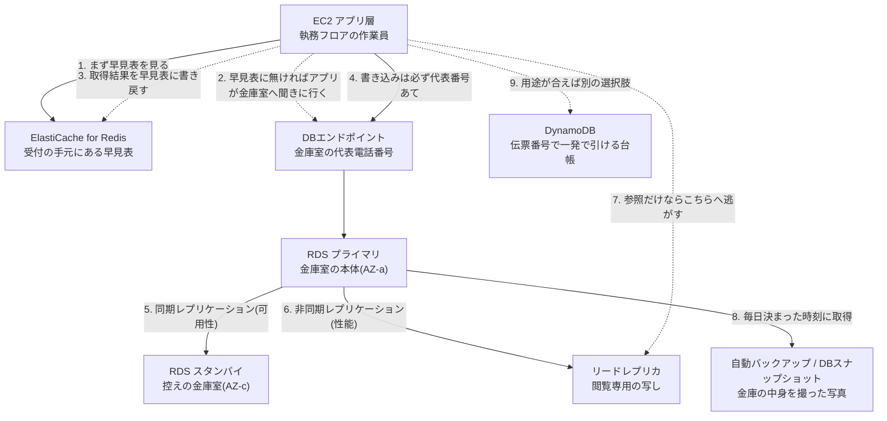

# AWS用語集 ⑤データベース

> 📖 [用語集トップ(索引)に戻る](../02-glossary.md) ｜ [← 前: ④ストレージ](04-storage.md) ｜ [次: ⑥セキュリティ・ID管理 →](06-security-identity.md)

## この章で扱う範囲

サーバー構築で「壊れたら本当に困るもの」は、ほとんどの場合データベースです。Webサーバーは壊れても同じAMI(サーバーの復元イメージ)から作り直せますが、データベースの中身は世界に1つしかありません。この章は、その「記憶して素早く引き出す」役割を担う用語をまとめたページです。

前半では、[リレーショナルデータベース](#リレーショナルデータベース)・[SQL](#sql)・[トランザクション](#トランザクション)というデータベース共通の基礎を扱います。中盤は本ポートフォリオの主役である**Amazon RDS**(AWSが運用を代行してくれるマネージドなデータベースサービス)の構成要素と、**可用性(Multi-AZ)と性能(リードレプリカ・キャッシュ)の違い**を徹底的に区別します。ここは面接で最も突っ込まれるポイントです。後半では[Aurora](#aurora)・[DynamoDB](#dynamodb)・[ElastiCache](#elasticache)という「RDS以外の選択肢」を押さえます。

具体的には、[レベル3: 可用性を高めた3層Webシステム構築](../../projects/03-ha-three-tier/README.md)でRDS for MySQLをMulti-AZで作る場面、[レベル4: 本番運用を想定したWordPress環境構築](../../projects/04-wordpress-production/README.md)でElastiCache for Redisをキャッシュ層として挟み、AWS Backupで毎日バックアップを取る場面で、ここの用語がそのまま登場します。

> 🧠 **覚え方のコツ**: データベース周りの用語は「金庫室の物語」で覚えてください。**代表電話番号([DBエンドポイント](#dbエンドポイント))にかければ、いま本番の金庫室([プライマリ](#プライマリ))につながる。控えの金庫室([スタンバイ](#スタンバイ))は同じ中身を持っているが電話は取らない。閲覧専用の写し([リードレプリカ](#リードレプリカ))は見るだけなら答えてくれる。金庫の中身は毎日写真([自動バックアップ](#自動バックアップ))を撮る。** この4役の違いが言えれば、データベースの設計会話にはついていけます。

## この章の用語ミニ索引

| 用語 | ひとことで言うと |
|---|---|
| [リレーショナルデータベース](#リレーショナルデータベース) | データを表形式で持ち、表同士を関連付けて扱うデータベース |
| [SQL](#sql) | リレーショナルデータベースを操作するための問い合わせ言語 |
| [トランザクション](#トランザクション) | 複数の処理を「全部成功か、全部取り消し」にまとめる単位 |
| [MySQL](#mysql) | 世界で最も広く使われているオープンソースのRDBMSの1つ |
| [PostgreSQL](#postgresql) | 標準準拠と機能の豊富さで支持されるオープンソースのRDBMS |
| [NoSQL](#nosql) | 表形式にこだわらず、拡張性や速度を優先したデータベースの総称 |
| [Redshift](#redshift) | 大量データの集計・分析に特化したデータウェアハウス |
| [RDS](#rds) | AWSが運用を代行してくれるマネージドなリレーショナルデータベース |
| [DBインスタンス](#dbインスタンス) | RDSで起動する、データベース1式が動くサーバーの単位 |
| [DBインスタンスクラス](#dbインスタンスクラス) | DBインスタンスのCPU・メモリのスペックを決める型番 |
| [DBサブネットグループ](#dbサブネットグループ) | RDSを配置できるサブネットを、複数AZ分まとめて登録したもの |
| [DBエンドポイント](#dbエンドポイント) | アプリがDBに接続するときに指定するホスト名 |
| [マスターユーザー](#マスターユーザー) | DBインスタンス作成時に作られる、管理者相当のDBユーザー |
| [パラメータグループ](#パラメータグループ) | DBエンジンの設定値をまとめて管理する設定ファイル的な入れ物 |
| [パブリックアクセス](#パブリックアクセス) | DBインスタンスにインターネットから到達できるようにするか否かの設定 |
| [Multi-AZ](#multi-az) | 別AZに待機系を置き、障害時に自動で切り替える高可用性構成 |
| [プライマリ](#プライマリ) | 読み書きの両方を受け付ける、本番稼働中のDBインスタンス |
| [スタンバイ](#スタンバイ) | 通常はアクセスされず、障害時の交代のためだけに待機する複製 |
| [同期レプリケーション](#同期レプリケーション) | 複製先への書き込み完了を待ってから成功を返す複製方式 |
| [非同期レプリケーション](#非同期レプリケーション) | 複製先への反映を待たずに成功を返す、遅延を許容する複製方式 |
| [リードレプリカ](#リードレプリカ) | 読み取り専用の複製を作り、参照処理を分散させる仕組み |
| [プロモート](#プロモート) | リードレプリカを、書き込みもできる独立したDBに昇格させる操作 |
| [自動バックアップ](#自動バックアップ) | RDSが毎日決まった時間帯に自動取得するバックアップ機能 |
| [DBスナップショット](#dbスナップショット) | 任意のタイミングで手動取得する、消えないバックアップ |
| [ポイントインタイムリカバリ](#ポイントインタイムリカバリ) | 保持期間内の任意の時刻の状態へ復元する機能 |
| [メンテナンスウィンドウ](#メンテナンスウィンドウ) | AWSがパッチ適用などの保守作業を行う、週1回の時間帯 |
| [Aurora](#aurora) | AWSがクラウド向けに再設計した、MySQL/PostgreSQL互換のDB |
| [Aurora Serverless](#aurora-serverless) | 負荷に応じて容量が自動で増減するAuroraの利用形態 |
| [DynamoDB](#dynamodb) | サーバー管理不要で高速・高スケールなAWSのNoSQLデータベース |
| [パーティションキー](#パーティションキー) | DynamoDBでデータの置き場所を決める、必須の主キー項目 |
| [ソートキー](#ソートキー) | パーティションキーと組み合わせて範囲検索を可能にする第2の主キー |
| [グローバルセカンダリインデックス](#グローバルセカンダリインデックス) | 主キー以外の項目でも検索できるようにする別視点のインデックス |
| [オンデマンドキャパシティモード](#オンデマンドキャパシティモード) | 事前の性能見積り不要で、リクエスト数に応じて課金される方式 |
| [DynamoDB Streams](#dynamodb-streams) | テーブルの変更を時系列の記録として流し、後続処理を起動する機能 |
| [ElastiCache](#elasticache) | データをメモリ上に保持して即答する、AWSのマネージドキャッシュ |
| [Redis](#redis) | 多機能で永続化・レプリケーションにも対応するインメモリデータストア |
| [Memcached](#memcached) | 単純なキーと値の保存に特化した、軽量なインメモリキャッシュ |
| [ノードタイプ](#ノードタイプ) | ElastiCacheの1台あたりのメモリ・CPUを決める型番 |
| [オブジェクトキャッシュ](#オブジェクトキャッシュ) | DBへの問い合わせ結果をメモリに保存し、再問い合わせを省く仕組み |
| [セッションストア](#セッションストア) | ログイン状態などの一時情報を、サーバー本体の外に置く保管先 |
| [キャッシュヒット率](#キャッシュヒット率) | 問い合わせのうち、キャッシュだけで答えられた割合 |
| [コネクションプール](#コネクションプール) | DB接続を使い回すために、あらかじめ確保しておく接続の束 |
| [スロークエリ](#スロークエリ) | 実行に時間がかかっている、性能問題の原因になるSQL |
| [パフォーマンスインサイト](#パフォーマンスインサイト) | DBの負荷を「何に待たされているか」の観点で可視化する機能 |
| [ボトルネック](#ボトルネック) | システム全体の速度を決めてしまっている、いちばん遅い部分 |

## 5-1. データベースの基礎

### リレーショナルデータベース

**正式名称**: Relational Database(RDB) ｜ **読み方**: リレーショナルデータベース ｜ **重要度**: ★★★

**ひとことで言うと**: データを行と列からなる**表(テーブル)**の形で持ち、表と表を共通の項目でつなぎ合わせて扱えるようにしたデータベースです。

**たとえるなら**: マンション管理室にある「入居者名簿」と「部屋台帳」の2冊のバインダーです。名簿には人の情報、台帳には部屋の情報を書き、両方に「部屋番号」を書いておけば、「103号室に住んでいるのは誰か」を2冊を突き合わせて答えられます。同じ情報を2冊に書き写さなくてよいのが、この方式の強みです。

**もう少し詳しく**: 表の1行を**レコード(行)**、1列を**カラム(列)**と呼び、行を一意に識別するための列を**主キー**と呼びます。別の表の主キーを参照する列が**外部キー**で、これが表と表の「関連(リレーション)」を作ります。同じ情報を1か所にだけ持たせて重複を減らす設計方針を**正規化**と呼び、更新漏れによる矛盾を防ぐのが目的です。操作には[SQL](#sql)という共通言語を使い、[トランザクション](#トランザクション)によって「途中で失敗したら全部なかったことにする」一貫性を保てます。世の中の業務システムの大半は、いまもこのリレーショナルデータベースの上で動いています。

**サーバー構築での勘所**:
- インフラ担当であっても、「このテーブルはどのくらいの行数になるのか」「どの検索が多いのか」をアプリ担当に聞ける状態にしておくと、[DBインスタンスクラス](#dbインスタンスクラス)やストレージ量の見積りが現実的なものになります。
- リレーショナルデータベースは「1台のサーバーを強くする([スケールアップ](01-cloud-basics.md#スケールアップ))」で性能を上げるのが基本です。EC2のように台数を増やして分散させる([スケールアウト](01-cloud-basics.md#スケールアウト))ことが簡単にはできない、という性質が、後述の[リードレプリカ](#リードレプリカ)や[ElastiCache](#elasticache)が必要になる理由そのものです。
- ✅ AWSでリレーショナルデータベースを使うときは、EC2に自分でMySQLをインストールする方式ではなく、まず[RDS](#rds)を検討してください。バックアップ・パッチ適用・[フェイルオーバー](01-cloud-basics.md#フェイルオーバー)といった「面倒だが必須の運用」をAWSに任せられます。

**関連用語**: [SQL](#sql)、[トランザクション](#トランザクション)、[MySQL](#mysql)、[NoSQL](#nosql)、[RDS](#rds)

**登場する案件**: [レベル3: 可用性を高めた3層Webシステム構築](../../projects/03-ha-three-tier/README.md)

### SQL

**正式名称**: Structured Query Language ｜ **読み方**: エスキューエル / シークェル ｜ **重要度**: ★★★

**ひとことで言うと**: リレーショナルデータベースに対して「取り出す・入れる・書き換える・消す」を指示するための、標準化された問い合わせ言語です。

**たとえるなら**: 管理室のバインダーに向かって出す「指示書のフォーマット」です。「103号室の入居者を教えて」と口頭で言うのではなく、決まった書式で書くことで、誰が書いても同じ結果が返ってくるようにしたものです。

**もう少し詳しく**: SQLは大きく、データを操作する `SELECT`(取得)・`INSERT`(追加)・`UPDATE`(更新)・`DELETE`(削除)と、表そのものを作り替える `CREATE TABLE` / `ALTER TABLE` などに分かれます。インフラ担当が日常的に書くのは前者のごく一部で、実際には「DBが生きているかの確認」「テーブルの件数確認」「[スロークエリ](#スロークエリ)の再現」といった用途がほとんどです。MySQLなら `mysql -h <エンドポイント> -u <ユーザー名> -p` のようにコマンドラインから接続し、`SELECT 1;` を実行できれば、ネットワークと認証は通っていると判断できます。

**サーバー構築での勘所**:
- ⚠️ 本番のデータベースに対して `UPDATE` や `DELETE` を直接実行するときは、必ず `WHERE` 句(対象を絞り込む条件)の付け忘れに注意してください。`WHERE` を書き忘れた `DELETE` は、表の全行を一瞬で消します。実行前に同じ条件で `SELECT COUNT(*)` を流し、対象件数を確認する習慣が身を守ります。
- インフラ側の切り分けでは「アプリからDBに接続できない」の原因が、ネットワーク([セキュリティグループ](02-network.md#セキュリティグループ))なのか、認証(ユーザー名・パスワード)なのか、SQLそのものなのかを分ける必要があります。EC2から `mysql` クライアントで手動接続してみるのが、最も確実な切り分け方法です。
- SQLの実行計画(データベースがどの順序でデータを探すかの計画)は `EXPLAIN` で確認できます。「インデックスが使われずに全行を読んでいる」ことが判明すると、それだけで[スロークエリ](#スロークエリ)の原因が特定できる場合があります。

**関連用語**: [リレーショナルデータベース](#リレーショナルデータベース)、[トランザクション](#トランザクション)、[スロークエリ](#スロークエリ)、[NoSQL](#nosql)

### トランザクション

**重要度**: ★★

**ひとことで言うと**: 複数のデータ操作をひとまとめにして、「全部成功する」か「全部なかったことにする」かのどちらかにしてくれる仕組みです。

**たとえるなら**: 管理室での「部屋の引っ越し手続き」です。旧居の名簿から名前を消して、新居の名簿に名前を書く。この2つは片方だけ終わった状態があってはいけません。途中で電話が鳴って作業が止まったら、いったん両方を元に戻す(ロールバック)のがトランザクションの考え方です。

**もう少し詳しく**: トランザクションが備えるべき4つの性質を、頭文字をとって**ACID特性**と呼びます。原子性(Atomicity。全部か無か)、一貫性(Consistency。ルールを壊さない)、独立性(Isolation。同時に動く処理どうしが干渉しない)、永続性(Durability。成功したら消えない)の4つです。`BEGIN` で開始し、`COMMIT` で確定、`ROLLBACK` で取り消します。銀行の振込のように「引き落としと入金がセット」でなければならない処理では必須の仕組みで、リレーショナルデータベースが業務システムで選ばれ続ける最大の理由でもあります。

**サーバー構築での勘所**:
- ⚠️ 長時間 `COMMIT` されないトランザクションが放置されると、他の処理が待たされる**ロック待ち**が発生し、「DBのCPU使用率は低いのにアプリが全く応答しない」という分かりにくい障害になります。[パフォーマンスインサイト](#パフォーマンスインサイト)で待機イベントを確認すると、この種の詰まりを見つけやすくなります。
- [DynamoDB](#dynamodb)のような[NoSQL](#nosql)にもトランザクション機能はありますが、対象範囲や項目数に制限があるのが一般的です。「厳密な整合性が必要ならリレーショナルデータベース」という原則は覚えておいて損はありません。

**関連用語**: [リレーショナルデータベース](#リレーショナルデータベース)、[SQL](#sql)、[NoSQL](#nosql)、[パフォーマンスインサイト](#パフォーマンスインサイト)

### MySQL

**読み方**: マイエスキューエル ｜ **重要度**: ★★★

**ひとことで言うと**: 世界で最も広く使われているオープンソース(ソースコードが公開され、無償で利用できる)のリレーショナルデータベース管理システムの1つです。

**たとえるなら**: 管理室に置く「定番メーカーの標準バインダー」です。特別に高機能というわけではありませんが、部品も交換用紙もどこでも手に入り、使い方を知っている人がいちばん多い、という安心感があります。

**もう少し詳しく**: WordPressをはじめとする多くのWebアプリケーションが、データの保存先としてMySQLを前提に作られています。本ポートフォリオでも[レベル3](../../projects/03-ha-three-tier/README.md)・[レベル4](../../projects/04-wordpress-production/README.md)で「RDS for MySQL」を採用しています。標準の通信ポートは**3306番**で、[セキュリティグループ](02-network.md#セキュリティグループ)ではこの番号を、アプリ層のセキュリティグループからのみ許可する設定にします。MySQL互換のフォーク(派生版)として**MariaDB**があり、RDSではこちらも選択できます。

**サーバー構築での勘所**:
- ✅ [レベル3](../../projects/03-ha-three-tier/README.md)では、DB用セキュリティグループ `ha-db-sg` のインバウンドに「MySQL/Aurora(3306)」を追加し、ソースにはIPアドレスではなく**アプリ層のセキュリティグループID** `ha-app-sg` を指定しています。「IPを覚えるな、SGを信頼せよ」の合言葉どおり、[Auto Scaling Group](03-compute.md#auto-scaling-group)でEC2のIPが変わってもルールを直さずに済みます。
- 文字コードの設定は後から変えると事故のもとです。日本語を扱うなら、[パラメータグループ](#パラメータグループ)で文字セットを `utf8mb4`(絵文字を含む4バイト文字も扱える設定)にしておくのが定番です。
- ⚠️ RDS for MySQLでは、[マスターユーザー](#マスターユーザー)であってもOSレベルの権限や一部の管理者権限は付与されません。オンプレミスのMySQLで使っていた手順がそのままは通らない場合がある、と心に留めておいてください。

**関連用語**: [PostgreSQL](#postgresql)、[RDS](#rds)、[Aurora](#aurora)、[パラメータグループ](#パラメータグループ)、[マスターユーザー](#マスターユーザー)

**登場する案件**: [レベル3: 可用性を高めた3層Webシステム構築](../../projects/03-ha-three-tier/README.md)、[レベル4: WordPress本番環境](../../projects/04-wordpress-production/README.md)

### PostgreSQL

**読み方**: ポストグレスキューエル / ポスグレ ｜ **重要度**: ★★

**ひとことで言うと**: SQL標準への準拠度と機能の豊富さで評価が高い、オープンソースのリレーショナルデータベース管理システムです。

**たとえるなら**: 管理室に置く「業務用の高機能バインダー」です。標準バインダー(MySQL)より仕切りや索引の仕組みが充実していて、複雑な台帳管理に向いています。

**もう少し詳しく**: JSON型(構造を持つデータをそのまま格納できる型)や地理情報を扱う拡張機能(PostGIS)など、標準機能が豊富なことで知られます。標準の通信ポートは**5432番**です。RDSでは MySQL・MariaDB・PostgreSQL・Oracle・SQL Server といった複数のエンジンから選べますが、ライセンス費用が別途かかる商用エンジンに対し、MySQLとPostgreSQLはオープンソースのため学習・検証コストを抑えやすいという利点があります。[Aurora](#aurora)にもPostgreSQL互換版が用意されています。

**サーバー構築での勘所**:
- どちらを選ぶかは「アプリケーションが要求するもの」で決まります。WordPressのようにMySQL前提のアプリならMySQL、自社開発でトランザクションや型を厳密に扱いたいならPostgreSQL、という選び方が現実的です。インフラ側の好みだけで決めないでください。
- ポート番号が違うため、MySQLの構成をコピーしてPostgreSQLに切り替えるときは、[セキュリティグループ](02-network.md#セキュリティグループ)のポート番号を `3306` から `5432` に変え忘れないよう注意します。

**関連用語**: [MySQL](#mysql)、[RDS](#rds)、[Aurora](#aurora)、[ポート番号](02-network.md#ポート番号)

### NoSQL

**読み方**: ノーエスキューエル ｜ **重要度**: ★★

**ひとことで言うと**: 表形式と[SQL](#sql)にこだわらず、拡張性・速度・柔軟なデータ構造を優先したデータベースの総称です。

**たとえるなら**: バインダー式の名簿ではなく、「番号札付きのロッカー」です。番号札(キー)を出せば中身が一瞬で出てきますが、「家賃が10万円以上の人を一覧で」のような横断的な検索は苦手です。

**もう少し詳しく**: NoSQLは「No SQL(SQLを使わない)」ではなく「Not Only SQL(SQLだけではない)」の意味で使われるのが一般的です。キーと値だけを持つキーバリュー型、階層のあるデータを1件として持つドキュメント型、列を柔軟に増やせるワイドカラム型、関係性を扱うグラフ型などの種類があります。共通する特徴は、あらかじめ表の形(スキーマ)を決めなくてよいこと、そしてサーバーを増やすことで性能と容量を伸ばしやすい([スケールアウト](01-cloud-basics.md#スケールアウト)しやすい)ことです。AWSの代表格が[DynamoDB](#dynamodb)です。

**サーバー構築での勘所**:
- 「速いから」という理由だけでNoSQLを選ぶのは危険です。NoSQLが速いのは**アクセスパターンが事前に決まっている場合**に限られます。後から「この条件でも検索したい」が増える業務システムでは、リレーショナルデータベースのほうが結果的に速く安く済むことがよくあります。
- 選定の目安は「検索の形が最初から決まっているか」です。決まっていて件数が莫大なら[DynamoDB](#dynamodb)、検索が後から増えるなら[RDS](#rds)、という判断軸を持っておくと会話がぶれません。

**関連用語**: [DynamoDB](#dynamodb)、[リレーショナルデータベース](#リレーショナルデータベース)、[パーティションキー](#パーティションキー)

### Redshift

**正式名称**: Amazon Redshift ｜ **読み方**: レッドシフト ｜ **重要度**: ★

**ひとことで言うと**: 大量のデータをまとめて集計・分析することに特化した、AWSのデータウェアハウス(分析専用のデータ置き場)サービスです。

**たとえるなら**: 管理室の日々の台帳ではなく、「何年分もの入退去記録を集めて傾向を分析する資料室」です。1件の出し入れは資料室ではやりません。分析のためだけの部屋です。

**もう少し詳しく**: 通常の業務処理(1件ずつの登録・更新・参照)を**OLTP**(オンライントランザクション処理)と呼ぶのに対し、大量データの集計・分析を**OLAP**(オンライン分析処理)と呼びます。Redshiftは後者専用で、データを行ではなく列単位で格納する**列指向**という方式と、複数ノードで並列処理する仕組みによって、数億行の集計を現実的な時間で終わらせます。逆に、1件だけの更新を高頻度に繰り返す用途にはまったく向きません。本ポートフォリオの案件では使用していませんが、「RDSとの違いは何か」を説明できると、データベース選定の理解が深いと伝わります。

**サーバー構築での勘所**:
- 💰 分析用サービスは規模が大きくなりやすく、費用も大きくなりがちです。学習目的で触る場合は、起動しっぱなしにしないことが最重要です。最新の料金・無料利用枠の条件は必ず公式ページで確認してください([Amazon Redshiftの料金](https://aws.amazon.com/jp/redshift/pricing/)、[AWS無料利用枠](https://aws.amazon.com/jp/free/))。

**関連用語**: [リレーショナルデータベース](#リレーショナルデータベース)、[RDS](#rds)、[NoSQL](#nosql)

## 5-2. RDSの構成要素

### RDS

**正式名称**: Amazon Relational Database Service ｜ **読み方**: アールディーエス ｜ **重要度**: ★★★

**ひとことで言うと**: MySQLやPostgreSQLといったリレーショナルデータベースを、AWSが運用・保守を代行するかたちで提供してくれるマネージドサービスです。

**たとえるなら**: 「お手入れ不要の水槽」です。水槽(データベース)は自分のものですが、水換えやフィルターの掃除、部品の故障交換はAWSがやってくれます。自分は中で泳がせる魚(データ)に集中できます。

**もう少し詳しく**: EC2に自分でMySQLをインストールする方式(自前運用)と比べたとき、RDSが肩代わりしてくれるのは、OSとDBエンジンのパッチ適用、[自動バックアップ](#自動バックアップ)、[Multi-AZ](#multi-az)による自動[フェイルオーバー](01-cloud-basics.md#フェイルオーバー)、[リードレプリカ](#リードレプリカ)の作成、メトリクスの収集といった作業です。代わりに、OSへのログインはできず、DBエンジンの一部の管理者権限も制限されます。この「自由と引き換えに運用を任せる」トレードオフが[マネージドサービス](01-cloud-basics.md#マネージドサービス)の本質です。作成時には、エンジンとバージョン、[DBインスタンスクラス](#dbインスタンスクラス)、ストレージ、配置する[DBサブネットグループ](#dbサブネットグループ)、[セキュリティグループ](02-network.md#セキュリティグループ)、[パブリックアクセス](#パブリックアクセス)の有無、そして[保管時の暗号化](06-security-identity.md#保管時の暗号化)の有無を指定します。

**サーバー構築での勘所**:
- ✅ RDSは必ず[プライベートサブネット](02-network.md#プライベートサブネット)に置き、[パブリックアクセス](#パブリックアクセス)は「なし」にします。[レベル3](../../projects/03-ha-three-tier/README.md)の3層アーキテクチャでいえば、RDSは「金庫室」であり、アプリ層のEC2からしか到達できない位置に置くのが原則です。
- ストレージは[gp3](04-storage.md#gp3)(汎用SSD)を選ぶのが標準です。[レベル3](../../projects/03-ha-three-tier/README.md)では `db.t3.micro` + gp3 20GiB という構成を採用しています。ストレージは後から増やせますが、**減らすことはできません**。最初から巨大にせず、必要に応じて拡張する運用にしてください。
- ⚠️ [保管時の暗号化](06-security-identity.md#保管時の暗号化)は**作成時にしか有効化できません**。暗号化せずに作ってしまうと、後から暗号化するには[DBスナップショット](#dbスナップショット)を取り、暗号化を有効にしてコピーし、そこから新しいDBインスタンスとして復元する(=接続先の切り替えと停止時間が発生する)しかありません。業務相当の環境では最初から必ず有効にしてください。
- ⚠️ 面接では「なぜEC2に自分でMySQLを入れず、RDSにしたのですか」がよく問われます。「バックアップ・パッチ・フェイルオーバーという、止まると致命的なのに手作業だと抜けやすい運用を仕組みとして担保できるから」と答えられるようにしておきましょう。

**よくあるつまずき**: 「アプリケーションからRDSに接続できない」の原因の大半は、DB側[セキュリティグループ](02-network.md#セキュリティグループ)でアプリ層のセキュリティグループからの3306番を許可していないか、[DBエンドポイント](#dbエンドポイント)のコピーミスです。まずこの2つを疑ってください。

**💰 コスト**: DBインスタンスの起動時間、ストレージ容量、バックアップ容量、データ転送量の組み合わせで課金されます。**停止していても課金が止まりきらない点**に注意が必要で、RDSの一時停止は連続して停止できる日数に上限があり、期限が来ると自動的に起動します。[Multi-AZ](#multi-az)にすると、おおよそシングルAZ構成の2倍が目安になります。最新の料金・無料利用枠の条件は必ず公式ページで確認してください([Amazon RDSの料金](https://aws.amazon.com/jp/rds/pricing/)、[AWS無料利用枠](https://aws.amazon.com/jp/free/))。

**関連用語**: [DBインスタンス](#dbインスタンス)、[DBサブネットグループ](#dbサブネットグループ)、[Multi-AZ](#multi-az)、[リードレプリカ](#リードレプリカ)、[自動バックアップ](#自動バックアップ)、[Aurora](#aurora)

**登場する案件**: [レベル3: 可用性を高めた3層Webシステム構築](../../projects/03-ha-three-tier/README.md)、[レベル4: WordPress本番環境](../../projects/04-wordpress-production/README.md)

### DBインスタンス

**重要度**: ★★★

**ひとことで言うと**: RDSにおける、データベースエンジンが動作する1台分のサーバーの単位です。

**たとえるなら**: 金庫室そのものです。中に複数の金庫(データベース)を並べて置けますが、部屋(DBインスタンス)は1つ、という関係になります。

**もう少し詳しく**: 1つのDBインスタンスの中には、複数のデータベースを作れます(MySQLでは「データベース」と「スキーマ」はほぼ同義ですが、PostgreSQLではデータベースの中にさらにスキーマを作る別の概念です。Oracleのように1インスタンス1データベースが基本のエンジンもあります)。たとえばWordPress用とアプリ用のデータベースを同じインスタンスに同居させることも可能です。DBインスタンスには識別子(DBインスタンス識別子)という名前を付け、これがそのまま[DBエンドポイント](#dbエンドポイント)の先頭部分になります。EC2の[インスタンス](03-compute.md#ec2)と考え方は似ていますが、OSにログインできない点、AZの指定やストレージの扱いがRDS独自である点が異なります。

**サーバー構築での勘所**:
- 開発環境と本番環境で同じDBインスタンスを共用しないでください。設定変更や再起動が互いに影響し、切り分けが困難になります。環境ごとにDBインスタンスを分けるのが基本です。
- ⚠️ 削除時に「最終スナップショットを作成しますか」と聞かれます。学習用リソースの後片付けであれば不要ですが、業務環境では**必ず作成**してください。削除と同時に[自動バックアップ](#自動バックアップ)も既定では消えるため、最終スナップショットが唯一の命綱になります。
- 識別子には環境と役割が分かるよう `ha-db-prod` のような命名規則を決めておくと、コンソール上での取り違えを防げます。

**関連用語**: [RDS](#rds)、[DBインスタンスクラス](#dbインスタンスクラス)、[DBエンドポイント](#dbエンドポイント)、[DBスナップショット](#dbスナップショット)

**登場する案件**: [レベル3: 可用性を高めた3層Webシステム構築](../../projects/03-ha-three-tier/README.md)

### DBインスタンスクラス

**重要度**: ★★

**ひとことで言うと**: DBインスタンスのCPU数・メモリ量・ネットワーク性能を決める、`db.t3.micro` のような型番です。

**たとえるなら**: 金庫室の「広さと出入口の数」を決めるプランです。狭い部屋なら安く済みますが、同時に出入りできる人数が限られます。

**もう少し詳しく**: EC2の[インスタンスタイプ](03-compute.md#インスタンスタイプ)と同じ考え方で、先頭に `db.` が付くのがRDSの流儀です。`db.t3.micro` の `t` はバースト可能タイプ(普段は控えめな性能で、必要なときだけ一時的に高い性能を出せる種類。詳しくは[③コンピューティング](03-compute.md)を参照)、`m` は汎用、`r` はメモリ最適化を意味します。データベースはメモリ上にデータを載せられるほど速くなるため、本番環境では `r` 系(メモリ最適化)が選ばれることも多くあります。クラスの変更は後から可能ですが、変更時に再起動を伴い、その間は接続が切れます。

**サーバー構築での勘所**:
- ⚠️ `t` 系はCPUクレジット(貯めておいて必要なときに使う性能の権利)を消費して一時的に高い性能を出す仕組みですが、RDSの `db.t3` / `db.t4g` は既定で**Unlimitedモード**(クレジットを使い切っても性能を維持し、ベースラインを超えた分を「サープラスクレジット」として追加課金する動作)で動きます。そのため「遅くなる」のではなく「知らないうちに課金が増える」形で表面化します。常時高負荷がかかる本番環境では `m` 系や `r` 系を検討し、学習用途では `CPUCreditBalance` と請求額の両方を確認してください。最新の挙動は公式ドキュメントで確認してください([バースト可能パフォーマンスDBインスタンス](https://docs.aws.amazon.com/AmazonRDS/latest/UserGuide/CHAP_CPUCredits.html))。
- 変更作業は[メンテナンスウィンドウ](#メンテナンスウィンドウ)に予約するか、影響の少ない時間帯に「すぐに適用」で実施します。[Multi-AZ](#multi-az)構成であれば、スタンバイ側から順に変更されるため停止時間を短縮できます。

**💰 コスト**: クラスが1段階上がるごとに時間単価も上がります。[Multi-AZ](#multi-az)では2台分の課金になるため、クラスの選択がそのままコストに2倍で効いてきます。最新の料金は公式ページで確認してください([Amazon RDSの料金](https://aws.amazon.com/jp/rds/pricing/))。

**関連用語**: [DBインスタンス](#dbインスタンス)、[インスタンスタイプ](03-compute.md#インスタンスタイプ)、[Multi-AZ](#multi-az)、[ノードタイプ](#ノードタイプ)

**登場する案件**: [レベル3: 可用性を高めた3層Webシステム構築](../../projects/03-ha-three-tier/README.md)

### DBサブネットグループ

**重要度**: ★★★

**ひとことで言うと**: RDSを配置してよい[サブネット](02-network.md#サブネット)を、複数のAZ分まとめて登録しておく設定のかたまりです。

**たとえるなら**: 「金庫室を建ててよい棟のリスト」です。管理会社(RDS)は、このリストに載っている棟の中からしか金庫室を建てません。控えの金庫室を別の棟に建てるため、リストには最低2棟を載せておく必要があります。

**もう少し詳しく**: DBインスタンスを作成する前に、必ずこのDBサブネットグループを先に作ります。ここには**異なるAZに属するサブネットを最低2つ**登録する必要があります。シングルAZ構成で作る場合でも2つ以上が要求されるのは、後から[Multi-AZ](#multi-az)へ切り替えられるようにするためです。[レベル3](../../projects/03-ha-three-tier/README.md)では `private-db-1a`(10.0.21.0/24)と `private-db-1c`(10.0.22.0/24)という2つのプライベートサブネットを `ha-db-subnet-group` として登録しています。

**サーバー構築での勘所**:
- ✅ 登録するサブネットは、必ず**DB専用のプライベートサブネット**にしてください。Web層・アプリ層と同じサブネットに同居させると、[ネットワークACL](02-network.md#ネットワークacl)などの制御を層ごとに分けられなくなります。
- ⚠️ 誤ってパブリックサブネットを登録してしまうと、[パブリックアクセス](#パブリックアクセス)を「あり」にした瞬間にインターネットから到達可能な状態が作れてしまいます。サブネットグループの中身は作成後に必ず見直してください。
- サブネットのIPアドレス数が少なすぎると、[Multi-AZ](#multi-az)や[リードレプリカ](#リードレプリカ)の追加時に空きアドレスが足りず失敗することがあります。`/24`(256アドレス程度)を確保しておけば通常は困りません。

**よくあるつまずき**: DBサブネットグループを作らずに「データベースを作成」を進めようとして詰まる、という順序間違いが非常に多いです。**サブネットグループが先、DBインスタンスが後**と覚えてください。

**関連用語**: [RDS](#rds)、[Multi-AZ](#multi-az)、[サブネット](02-network.md#サブネット)、[プライベートサブネット](02-network.md#プライベートサブネット)、[アベイラビリティゾーン](01-cloud-basics.md#アベイラビリティゾーン)

**登場する案件**: [レベル3: 可用性を高めた3層Webシステム構築](../../projects/03-ha-three-tier/README.md)

### DBエンドポイント

**重要度**: ★★★

**ひとことで言うと**: アプリケーションがデータベースに接続するときに指定する、接続先のホスト名(住所)です。

**たとえるなら**: 金庫室の「代表電話番号」です。中の担当者が交代しても、かける番号は変わりません。だからこそ、アプリ側は誰が対応しているかを知らなくてよいのです。

**もう少し詳しく**: `<DBインスタンス識別子>.<ランダムな文字列>.<リージョン>.rds.amazonaws.com` という形式のホスト名で、コンソールの「接続とセキュリティ」タブに表示されます。ここが**Multi-AZの仕組みを理解する鍵**です。[Multi-AZ](#multi-az)構成で[フェイルオーバー](01-cloud-basics.md#フェイルオーバー)が起きると、このエンドポイントの名前解決先が[スタンバイ](#スタンバイ)側に自動で切り替わります。**エンドポイント名そのものは変わらない**ため、アプリの設定を書き換えずに切り替えが完了します。[リードレプリカ](#リードレプリカ)には別のエンドポイントが割り当てられ、読み取り専用の接続先として使い分けます。

**サーバー構築での勘所**:
- ⚠️ **アプリの設定には、絶対にIPアドレスを書かないでください。** RDSのIPアドレスはフェイルオーバーやメンテナンスで変わります。必ずエンドポイント名(ホスト名)で接続してください。「一度IPで接続できたからそれを設定に書いた」が、深夜のフェイルオーバー時に全面障害を引き起こす典型パターンです。
- 接続確認は、EC2から `nslookup <エンドポイント>` で名前解決を確認し、次に `curl -v telnet://<エンドポイント>:3306` などで到達性を確認する、という2段階で切り分けると原因が絞り込めます。
- [レベル4](../../projects/04-wordpress-production/README.md)では、DBの接続情報を[Secrets Manager](06-security-identity.md#secrets-manager)に保管し、EC2の[IAMロール](06-security-identity.md#iamロール)経由で取得しています。エンドポイントとパスワードをソースコードに直書きしない設計を意識してください。

**よくあるつまずき**: エンドポイントの末尾に付いているポート番号(`:3306`)まで含めてホスト名欄にコピーしてしまい、接続できないというミスが頻発します。ホスト名とポート番号は別々の入力欄です。

**関連用語**: [RDS](#rds)、[Multi-AZ](#multi-az)、[リードレプリカ](#リードレプリカ)、[DNS](02-network.md#dns)

**登場する案件**: [レベル3: 可用性を高めた3層Webシステム構築](../../projects/03-ha-three-tier/README.md)、[レベル4: WordPress本番環境](../../projects/04-wordpress-production/README.md)

### マスターユーザー

**重要度**: ★★

**ひとことで言うと**: DBインスタンス作成時に作られる、そのデータベース内での管理者に相当するユーザーアカウントです。

**たとえるなら**: 金庫室の「支配人の鍵」です。部屋の中のことはほぼ何でもできますが、建物そのものの構造(OSやAWS基盤)には手を出せません。

**もう少し詳しく**: ここでいうユーザーは、AWSの[IAMユーザー](06-security-identity.md#iamユーザー)とはまったくの別物です。**AWSにログインする人**を管理するのがIAM、**データベースの中でテーブルを読み書きする人**を管理するのがDBユーザーです。マスターユーザーはデータベース内の権限をほぼすべて持ちますが、[マネージドサービス](01-cloud-basics.md#マネージドサービス)であるRDSでは、OSレベルの操作や一部の管理者専用コマンドは実行できないよう制限されています。作成時に「Amazon RDSに管理させる」を選ぶと、パスワードが自動生成され[Secrets Manager](06-security-identity.md#secrets-manager)に保管されるため、パスワードを人が知らずに運用できます。

**サーバー構築での勘所**:
- ✅ アプリケーションからの接続にマスターユーザーを使い回さないでください。アプリ用には、必要なデータベースへの読み書きだけを許可した専用ユーザーを別途作るのが[最小権限の原則](06-security-identity.md#最小権限の原則)に沿った設計です。
- ✅ [レベル3](../../projects/03-ha-three-tier/README.md)の手順どおり「Amazon RDSに管理させる」を選ぶと、自動ローテーション(定期的なパスワード自動変更)まで含めて任せられます。学習段階から、パスワードを手で管理しない癖をつけておきましょう。
- ⚠️ マスターユーザー名に `admin` や `root` を使うのは避けるのが無難です。総当たり攻撃で真っ先に試される名前だからです(なお、AWSの[ルートユーザー](01-cloud-basics.md#ルートユーザー)やLinuxのrootユーザーとも、まったくの別物です)。

**関連用語**: [RDS](#rds)、[DBインスタンス](#dbインスタンス)、[Secrets Manager](06-security-identity.md#secrets-manager)、[最小権限の原則](06-security-identity.md#最小権限の原則)

**登場する案件**: [レベル3: 可用性を高めた3層Webシステム構築](../../projects/03-ha-three-tier/README.md)、[レベル4: WordPress本番環境](../../projects/04-wordpress-production/README.md)

### パラメータグループ

**重要度**: ★★

**ひとことで言うと**: データベースエンジンの動作設定(接続数の上限や文字コードなど)を、まとめて管理・適用するための入れ物です。

**たとえるなら**: 金庫室の「運用ルールブック」です。同時に入室できる人数、記録用紙の書式、記録を残す基準などが書かれていて、複数の金庫室に同じルールブックを配れます。

**もう少し詳しく**: オンプレミスのMySQLでいう `my.cnf` に相当する設定を、AWSではこのパラメータグループとして管理します。重要な性質として、**AWSが用意したデフォルトパラメータグループは編集できません**。設定を変えたい場合は、デフォルトを複製したカスタムパラメータグループを作り、それをDBインスタンスに割り当てます。設定項目には、変更後すぐに反映される**動的パラメータ**と、DBインスタンスの再起動が必要な**静的パラメータ**の2種類があります。似た名前の「オプショングループ」は、エンジン固有の追加機能を有効化するための別の仕組みです。

**サーバー構築での勘所**:
- 実務でよく触るのは、文字セット(`character_set_server`)、タイムゾーン(`time_zone`)、[スロークエリ](#スロークエリ)ログの有効化(`slow_query_log`、`long_query_time`)あたりです。**スロークエリログは、性能問題が起きてから有効化しても手遅れ**なので、最初から有効にしておくのが定石です。
- ⚠️ 最大同時接続数(`max_connections`)は、既定ではインスタンスのメモリ量から自動計算されます。小さなインスタンスクラスでは接続数の上限も小さくなるため、アプリ側の[コネクションプール](#コネクションプール)設定と合わせて確認してください。具体的な既定値の計算式はエンジンとバージョンで異なるため、最新は公式ドキュメントで確認してください([RDSのパラメータグループ](https://docs.aws.amazon.com/AmazonRDS/latest/UserGuide/USER_WorkingWithParamGroups.html))。
- ⚠️ 静的パラメータを変更すると、状態が「保留中の再起動」になります。再起動するまで反映されないため、「変えたはずなのに効かない」と悩む前にこの状態を確認してください。

**関連用語**: [RDS](#rds)、[DBインスタンス](#dbインスタンス)、[スロークエリ](#スロークエリ)、[コネクションプール](#コネクションプール)、[メンテナンスウィンドウ](#メンテナンスウィンドウ)

### パブリックアクセス

**重要度**: ★★★

**ひとことで言うと**: DBインスタンスにインターネット側から到達できるパブリックIPアドレスを割り当てるかどうかの設定です。

**たとえるなら**: 金庫室に「表通りへの直通ドア」を付けるかどうか、という選択です。便利ではありますが、金庫室に外から直接入れる建物を、まともな管理会社は設計しません。

**もう少し詳しく**: 「あり」にすると、DBインスタンスにパブリックIPアドレスが割り当てられ、[DBエンドポイント](#dbエンドポイント)がグローバルなIPアドレスに名前解決されるようになります。実際に接続できるかは[セキュリティグループ](02-network.md#セキュリティグループ)次第ですが、[レベル3](../../projects/03-ha-three-tier/README.md)でも警告しているとおり、**正しいパスワードさえ持っていればインターネットから直接データベースにログインできてしまう**状態を作りうる、非常に危険な設定です。

**サーバー構築での勘所**:
- ✅ **原則は必ず「なし」です。** 例外はありません、と言い切ってよいほど基本の設定です。DBに接続したい場合は、同じVPC内の踏み台や[Session Manager](07-monitoring-operations.md#session-manager)経由のポートフォワードを使います。
- ⚠️ 「なし」にしていても安心しきらないでください。パブリックアクセスは「直通ドアの有無」であり、部屋の鍵は[セキュリティグループ](02-network.md#セキュリティグループ)です。DB用セキュリティグループのソースを `0.0.0.0/0` にしていないか、必ず併せて確認してください。
- ⚠️ 「あり」で作ってしまった場合、後から「なし」に変更できます。ただしその間に接続を試みられた形跡がないかを[VPCフローログ](02-network.md#vpcフローログ)や[CloudTrail](06-security-identity.md#cloudtrail)で確認し、パスワードも変更しておくのが安全です。

**関連用語**: [RDS](#rds)、[DBサブネットグループ](#dbサブネットグループ)、[セキュリティグループ](02-network.md#セキュリティグループ)、[プライベートサブネット](02-network.md#プライベートサブネット)

**登場する案件**: [レベル3: 可用性を高めた3層Webシステム構築](../../projects/03-ha-three-tier/README.md)

## 5-3. RDSの可用性とバックアップ

### Multi-AZ

**読み方**: マルチエーゼット ｜ **重要度**: ★★★

**ひとことで言うと**: 別のAZに待機系のデータベースを持ち、障害時に自動で切り替えることで停止時間を最小化する高可用性構成です。

**たとえるなら**: 「本番の代役俳優」です。舞台裏で本番とまったく同じ台本を持って待機していて、主役が倒れたら即座に舞台へ出ます。ただし、主役が元気なうちは絶対に舞台には上がりません。

**もう少し詳しく**: [プライマリ](#プライマリ)への書き込みは[同期レプリケーション](#同期レプリケーション)で[スタンバイ](#スタンバイ)にも反映されます。プライマリが属するAZ全体の障害、ハードウェア故障、インスタンスクラス変更やパッチ適用といった事象が起きると、AWSが自動的に[フェイルオーバー](01-cloud-basics.md#フェイルオーバー)を実行し、[DBエンドポイント](#dbエンドポイント)の向き先をスタンバイに切り替えます。切り替えにかかる時間は通常1〜2分程度とされていますが、条件によって変動するため、最新の説明は公式ドキュメントで確認してください([RDSのマルチAZ配置](https://docs.aws.amazon.com/AmazonRDS/latest/UserGuide/Concepts.MultiAZ.html))。なお、読み取り可能なスタンバイを2台持つ「マルチAZ DBクラスター」という別方式も選択できます。

**サーバー構築での勘所**:
- ⚠️ **Multi-AZは性能向上の仕組みではありません。** 待機系にアクセスは流れないため、Multi-AZにしても読み取り性能は1台のときと変わりません。性能を上げたいなら[リードレプリカ](#リードレプリカ)や[ElastiCache](#elasticache)です。ここは面接で必ず確認される区別です。
- ✅ フェイルオーバーの瞬間、既存のDB接続は切断されます。アプリケーション側に**接続の再試行(リトライ)処理**がないと、切り替えは成功したのにアプリだけがエラーを出し続けます。「Multi-AZにしたから安心」ではなく、アプリ側の作り込みまでがセットです。
- ✅ [Multi-AZ](#multi-az)は「AZ障害への備え」であり、「リージョン障害への備え」ではありません。リージョン全体を守るなら、別リージョンへのスナップショットコピーやクロスリージョンのリードレプリカを検討します([ディザスタリカバリ](01-cloud-basics.md#ディザスタリカバリ))。
- コンソールで「テンプレート:本番稼働用」を選ぶとMulti-AZが自動的に有効になります。学習中に意図せず選ぶと課金が倍になるので、選択内容を必ず確認してください。

**よくあるつまずき**: 「Multi-AZにしたのにDBのCPU使用率が下がらない」という相談は非常に多いです。待機系は仕事をしていないので当然です。負荷を下げたいのなら、[リードレプリカ](#リードレプリカ)追加か[オブジェクトキャッシュ](#オブジェクトキャッシュ)導入が正解です。

**💰 コスト**: プライマリとスタンバイの2台分が課金されるため、シングルAZ構成のおおよそ2倍が目安です。[レベル3](../../projects/03-ha-three-tier/README.md)でも述べているとおり**Multi-AZは無料利用枠の対象外**です。検証が終わったら必ず削除してください。最新の料金・無料利用枠の条件は必ず公式ページで確認してください([Amazon RDSの料金](https://aws.amazon.com/jp/rds/pricing/)、[AWS無料利用枠](https://aws.amazon.com/jp/free/))。

**関連用語**: [プライマリ](#プライマリ)、[スタンバイ](#スタンバイ)、[同期レプリケーション](#同期レプリケーション)、[リードレプリカ](#リードレプリカ)、[DBエンドポイント](#dbエンドポイント)、[フェイルオーバー](01-cloud-basics.md#フェイルオーバー)

**登場する案件**: [レベル3: 可用性を高めた3層Webシステム構築](../../projects/03-ha-three-tier/README.md)、[レベル4: WordPress本番環境](../../projects/04-wordpress-production/README.md)

### プライマリ

**重要度**: ★★

**ひとことで言うと**: 読み書きの両方を受け付けている、現在稼働中の本番データベースインスタンスです。

**たとえるなら**: いま実際に営業している「本番の金庫室」です。代表電話([DBエンドポイント](#dbエンドポイント))にかけると、必ずこの部屋につながります。

**もう少し詳しく**: 「マスター」「ライター」とも呼ばれます。書き込みを受け付けられるのは、常にこのプライマリ1台だけです([Aurora](#aurora)のクラスターでも書き込みノードは1台が基本です)。[Multi-AZ](#multi-az)構成では、プライマリの書き込みが[同期レプリケーション](#同期レプリケーション)で[スタンバイ](#スタンバイ)へ、[リードレプリカ](#リードレプリカ)がある場合は[非同期レプリケーション](#非同期レプリケーション)でレプリカへ、それぞれ伝わっていきます。[フェイルオーバー](01-cloud-basics.md#フェイルオーバー)が起きると、それまでスタンバイだった側が新しいプライマリになり、旧プライマリは復旧後にスタンバイとして組み込まれます。

**サーバー構築での勘所**:
- プライマリが所属するAZは、フェイルオーバーのたびに入れ替わります。「プライマリは常に1aにある」という前提でルーティングや監視を組まないでください。
- [CloudWatch](07-monitoring-operations.md#cloudwatch)でCPU使用率・空きメモリ・空きストレージ・DB接続数を監視します。なお、[Multi-AZ](#multi-az)(マルチAZ DBインスタンス)構成の[スタンバイ](#スタンバイ)は直接アクセスできず、これらのメトリクスはプライマリ側のものだけが発行されます。スタンバイ側の健全性は複製の遅れ(`ReplicaLag`)やRDSのイベント通知で確認し、[リードレプリカ](#リードレプリカ)は独立したDBインスタンスなので個別に監視対象へ追加してください。[レベル4](../../projects/04-wordpress-production/README.md)では `FreeStorageSpace` が2GiB未満で通知する[しきい値](07-monitoring-operations.md#しきい値)を設定しています。

**関連用語**: [スタンバイ](#スタンバイ)、[Multi-AZ](#multi-az)、[リードレプリカ](#リードレプリカ)、[DBエンドポイント](#dbエンドポイント)

**登場する案件**: [レベル3: 可用性を高めた3層Webシステム構築](../../projects/03-ha-three-tier/README.md)

### スタンバイ

**重要度**: ★★

**ひとことで言うと**: [Multi-AZ](#multi-az)構成において、別AZで同じ内容を保持しながら待機している、通常はアクセスされない複製です。

**たとえるなら**: 舞台裏で待機している「代役俳優」であり、同時に「控えの金庫室」です。中身は本番と1文字違わず同じですが、お客さんが通されることはありません。

**もう少し詳しく**: スタンバイは[同期レプリケーション](#同期レプリケーション)によって常にプライマリと同じ状態に保たれます。従来型の「マルチAZ DBインスタンス」構成では、**スタンバイに対して読み取りクエリを投げることはできません**。ここが[リードレプリカ](#リードレプリカ)との決定的な違いです。一方、新しい「マルチAZ DBクラスター」構成では読み取り可能なスタンバイを持てるなど、選択肢が広がっています。どちらの方式を使っているかで説明が変わるため、構成を明確にしてから話すようにしてください。

**サーバー構築での勘所**:
- ⚠️ スタンバイは「バックアップ」ではありません。プライマリで誤って `DELETE` したデータは、同期レプリケーションによってスタンバイでも即座に消えます。**誤操作から守るのは[自動バックアップ](#自動バックアップ)と[DBスナップショット](#dbスナップショット)の役目**です。この違いは面接でも問われやすいポイントです。
- [自動バックアップ](#自動バックアップ)の取得は、Multi-AZ構成ではスタンバイ側から行われるため、プライマリへの性能影響が抑えられるという副次的なメリットもあります。

**関連用語**: [プライマリ](#プライマリ)、[Multi-AZ](#multi-az)、[同期レプリケーション](#同期レプリケーション)、[自動バックアップ](#自動バックアップ)

**登場する案件**: [レベル3: 可用性を高めた3層Webシステム構築](../../projects/03-ha-three-tier/README.md)

### 同期レプリケーション

**重要度**: ★★

**ひとことで言うと**: 書き込みを複製先にも確実に反映し終えてから「成功しました」と応答する、遅れのない複製方式です。

**たとえるなら**: 「複写式の伝票」です。1枚書けば下の控えにも同時に写ります。写し終わるまでペンを離さないぶん、書く動作はほんの少しだけ重くなります。

**もう少し詳しく**: [Multi-AZ](#multi-az)の[スタンバイ](#スタンバイ)への複製はこの方式です。プライマリとスタンバイの内容が常に一致しているため、[フェイルオーバー](01-cloud-basics.md#フェイルオーバー)しても**データが失われません**(理論上の[RPO](01-cloud-basics.md#rpo)がほぼゼロ)。代わりに、書き込みのたびに別AZへの往復が発生するため、シングルAZ構成に比べて書き込みの応答時間はわずかに長くなります。この「安全と引き換えに少し遅くなる」という性質が、同期方式の本質です。

**サーバー構築での勘所**:
- 書き込みが極端に多いシステムでMulti-AZに切り替えると、書き込みレイテンシ(応答が返るまでの時間)の増加が体感できる場合があります。切り替え前後で `WriteLatency` メトリクスを比較しておくと、後で説明ができます。
- 同期レプリケーションは「データを失わない」ためのもの、[非同期レプリケーション](#非同期レプリケーション)は「性能を伸ばす」ためのもの、と目的で覚えると混乱しません。

**関連用語**: [非同期レプリケーション](#非同期レプリケーション)、[Multi-AZ](#multi-az)、[スタンバイ](#スタンバイ)、[RPO](01-cloud-basics.md#rpo)

### 非同期レプリケーション

**重要度**: ★★

**ひとことで言うと**: 複製先への反映を待たずに書き込み成功を返す、多少の遅れを許容する複製方式です。

**たとえるなら**: 「後で清書して回す回覧板」です。原本にはすぐ書けますが、回覧が全員に回りきるまでには少し時間がかかります。

**もう少し詳しく**: [リードレプリカ](#リードレプリカ)への複製はこの方式です。プライマリの書き込み性能をほとんど落とさずに複製を増やせる代わりに、レプリカの内容がプライマリより数秒程度遅れることがあります。この遅れを**レプリケーションラグ**と呼び、`ReplicaLag` というメトリクスで確認できます。「登録した直後に一覧を見たらまだ出てこない」という現象は、この遅れが原因で起きます。

**サーバー構築での勘所**:
- ⚠️ 「書いた直後に必ず読める」ことが必要な処理は、レプリカではなく[プライマリ](#プライマリ)に向けてください。会員登録直後のマイページ表示などが典型例です。
- レプリケーションラグは、プライマリの負荷が高いときや大量更新を流したときに増大します。監視項目に必ず入れ、しきい値超過で通知が飛ぶようにしておくと、原因不明の「データが古い」問い合わせを未然に防げます。

**関連用語**: [同期レプリケーション](#同期レプリケーション)、[リードレプリカ](#リードレプリカ)、[プライマリ](#プライマリ)

### リードレプリカ

**重要度**: ★★★

**ひとことで言うと**: 読み取り専用の複製データベースを作り、参照処理をそちらへ振り分けることで、本体の負荷を下げる仕組みです。

**たとえるなら**: 「サイン会の分身」です。同じ答えを返せる複製が複数いて、質問の行列(読み取り)を分担してさばきます。ただしサインの内容を決められるのは本人(プライマリ)だけです。

**もう少し詳しく**: [非同期レプリケーション](#非同期レプリケーション)でプライマリの更新内容を受け取り、読み取り専用として稼働します。専用の[エンドポイント](#dbエンドポイント)が割り当てられるので、アプリケーション側で「参照系のSQLはレプリカへ、更新系はプライマリへ」と接続先を振り分けます。1つのDBインスタンスに対して複数台のレプリカを作成でき、別AZや別リージョンにも配置できます(作成可能な台数はエンジンによって異なるため、最新は公式ドキュメントで確認してください)。[Multi-AZ](#multi-az)が可用性のための仕組みであるのに対し、リードレプリカは**性能拡張のための仕組み**という位置付けです。

**サーバー構築での勘所**:
- ⚠️ **リードレプリカは自動フェイルオーバーの対象ではありません。** プライマリが落ちてもレプリカが自動的に昇格することはなく、書き込みを引き継がせるには[プロモート](#プロモート)という手動操作が必要です。「レプリカがあるから可用性は大丈夫」は誤りです。
- ✅ アプリケーションが接続先を振り分けられる作りになっていないと、レプリカを作っても誰も使ってくれません。導入前に「アプリ側で参照系の向き先を変えられるか」を必ず確認してください。
- 読み取り負荷を下げる手段は、リードレプリカだけではありません。同じクエリが繰り返されるだけなら、[ElastiCache](#elasticache)による[オブジェクトキャッシュ](#オブジェクトキャッシュ)のほうが安く・速く効くことがあります。**まずキャッシュ、それでも足りなければレプリカ**という順で検討すると費用対効果が高くなります。
- [レベル3](../../projects/03-ha-three-tier/README.md)では発展課題として、リードレプリカの追加によって「Multi-AZ(可用性目的)とリードレプリカ(性能拡張目的)の役割の違いを体感する」ことを挙げています。

**💰 コスト**: レプリカ1台ごとにDBインスタンス1台分が課金されます。別リージョンに置く場合は、リージョン間のデータ転送料金も追加でかかります。最新の料金は公式ページで確認してください([Amazon RDSの料金](https://aws.amazon.com/jp/rds/pricing/))。

**関連用語**: [Multi-AZ](#multi-az)、[非同期レプリケーション](#非同期レプリケーション)、[プロモート](#プロモート)、[ElastiCache](#elasticache)、[スケールアウト](01-cloud-basics.md#スケールアウト)

**登場する案件**: [レベル3: 可用性を高めた3層Webシステム構築](../../projects/03-ha-three-tier/README.md)

### プロモート

**重要度**: ★★

**ひとことで言うと**: [リードレプリカ](#リードレプリカ)を、書き込みもできる独立したDBインスタンスへ昇格させる操作です。

**たとえるなら**: 「分身を独立した本人として認定する」手続きです。認定された瞬間から自分の判断でサインを書けるようになりますが、元の本人との連絡は切れます。

**もう少し詳しく**: プロモートを実行すると、レプリケーションが停止し、そのインスタンスは書き込み可能な独立したDBインスタンスになります。**この操作は元に戻せません。** 昇格後に元のプライマリの配下へ戻したい場合は、レプリカを作り直す必要があります。使いどころは、プライマリに障害が発生し復旧の見込みが立たないときの緊急避難、大規模なメンテナンスの切り離し、そして本番データの複製から検証環境を作る場合などです。

**サーバー構築での勘所**:
- ⚠️ プロモートしても、そのインスタンスの[DBエンドポイント](#dbエンドポイント)自体は変わりません(レプリカだったときのエンドポイントをそのまま引き継ぎます)。ただし旧プライマリのエンドポイントとは別物なので、アプリの接続先を旧プライマリからこのエンドポイントへ切り替える作業が必ず発生します。この手順を復旧手順書([ランブック](07-monitoring-operations.md#ランブック))に明記しておいてください。
- 緊急時にプロモートを判断する前に、まず[ポイントインタイムリカバリ](#ポイントインタイムリカバリ)で足りないかを検討します。データ破損が原因の場合、レプリカにも破損が複製されているため、プロモートしても解決しません。

**関連用語**: [リードレプリカ](#リードレプリカ)、[フェイルオーバー](01-cloud-basics.md#フェイルオーバー)、[DBエンドポイント](#dbエンドポイント)、[ポイントインタイムリカバリ](#ポイントインタイムリカバリ)

### 自動バックアップ

**重要度**: ★★★

**ひとことで言うと**: RDSが毎日決まった時間帯にDBインスタンス全体のバックアップと更新ログを自動取得し、指定した日数だけ保持してくれる機能です。

**たとえるなら**: 管理会社が毎晩やってくれる「金庫の中身の定点撮影」です。写真だけでなく、撮影後に出し入れされた記録も残しているので、任意の時刻まで巻き戻せます。

**もう少し詳しく**: 「バックアップウィンドウ」として指定した1日1回の時間帯にスナップショットが取得され、加えてトランザクションログが継続的にS3へ退避されます。この2つが揃うことで[ポイントインタイムリカバリ](#ポイントインタイムリカバリ)が可能になります。保持期間は0〜35日の範囲で設定でき(0を指定すると自動バックアップが無効になります)、コンソールから作成した場合の既定値は7日となることが一般的です。最新の仕様は公式ドキュメントで確認してください([RDSの自動バックアップ](https://docs.aws.amazon.com/AmazonRDS/latest/UserGuide/USER_WorkingWithAutomatedBackups.html))。

**サーバー構築での勘所**:
- ⚠️ **DBインスタンスを削除すると、自動バックアップは既定では一緒に消えます。**(削除時に「自動バックアップを保持」を選べば、削除時点の保持期間が切れるまでは残せますが、新しいバックアップは作られず、いずれ完全に期限切れになります。)長期に残したいなら[DBスナップショット](#dbスナップショット)を手動で取るか、削除時に最終スナップショットを作成してください。この仕様を知らずにデータを永久に失う事故が実際に起きています。
- ⚠️ 保持期間を0に設定すると自動バックアップが止まり、既存のバックアップも失われます。「バックアップ容量の課金を減らしたい」という理由で0にするのは絶対に避けてください。
- ✅ バックアップウィンドウは、アクセスの少ない時間帯かつ[メンテナンスウィンドウ](#メンテナンスウィンドウ)と重ならない時間に設定します。[レベル4](../../projects/04-wordpress-production/README.md)では、[AWS Backup](04-storage.md#aws-backup)側で日本時間3:00・保持30日という設計を採り、その根拠を「[RPO](01-cloud-basics.md#rpo)最大24時間、遡れる範囲30日」と説明しています。
- ✅ 複数サービスのバックアップを一元管理したい場合は、RDS単体の機能ではなく[AWS Backup](04-storage.md#aws-backup)でタグベースにまとめるのが実務的です。

**💰 コスト**: DBインスタンスのストレージ割り当て量と同程度までのバックアップ容量は追加料金なしで扱えるのが一般的で、それを超えた分に課金されます。最新の条件は公式ページで確認してください([Amazon RDSの料金](https://aws.amazon.com/jp/rds/pricing/))。

**関連用語**: [DBスナップショット](#dbスナップショット)、[ポイントインタイムリカバリ](#ポイントインタイムリカバリ)、[AWS Backup](04-storage.md#aws-backup)、[保持期間](04-storage.md#保持期間)、[RPO](01-cloud-basics.md#rpo)

**登場する案件**: [レベル4: WordPress本番環境](../../projects/04-wordpress-production/README.md)

### DBスナップショット

**重要度**: ★★★

**ひとことで言うと**: 任意のタイミングで手動取得する、明示的に削除するまで消えないRDSのバックアップです。

**たとえるなら**: 「記念に撮って自分のアルバムに貼っておく写真」です。管理会社が毎晩撮る定点写真([自動バックアップ](#自動バックアップ))とは別に、自分の意思で撮り、自分が捨てるまで残ります。

**もう少し詳しく**: 自動バックアップとの最大の違いは**寿命**です。自動バックアップはDBインスタンスを削除すると消えますが、手動のDBスナップショットは**DBインスタンスを削除しても残ります**。復元すると、元のインスタンスを上書きするのではなく**新しいDBインスタンスとして作成される**点も重要です。復元後は[DBエンドポイント](#dbエンドポイント)が変わるため、アプリの接続先を切り替える作業が必要になります。別リージョンへのコピーや、別アカウントへの共有も可能です。

**サーバー構築での勘所**:
- ✅ 危険な作業(スキーマ変更、バージョンアップ、大量データの削除)の**直前**には、必ず手動スナップショットを取ってください。「取ってから作業」を体に染み込ませておくと、いざというときに救われます。
- ✅ [ディザスタリカバリ](01-cloud-basics.md#ディザスタリカバリ)を意識するなら、スナップショットを別リージョンへコピーしておきます。リージョン全体の障害に備える最も手軽な手段です。
- ⚠️ 「バックアップを取った」だけでは設計として不十分です。**実際に復元して起動できるか**を一度は試してください。復元にかかる時間を測っておくと、[RTO](01-cloud-basics.md#rto)の根拠として面接でも説明できます。

**💰 コスト**: 手動スナップショットは保存している間ずっと課金対象になります。古い世代を放置しないよう、棚卸しのルールを決めておいてください。

**関連用語**: [自動バックアップ](#自動バックアップ)、[ポイントインタイムリカバリ](#ポイントインタイムリカバリ)、[EBSスナップショット](04-storage.md#ebsスナップショット)、[AWS Backup](04-storage.md#aws-backup)、[RTO](01-cloud-basics.md#rto)

**登場する案件**: [レベル4: WordPress本番環境](../../projects/04-wordpress-production/README.md)

### ポイントインタイムリカバリ

**正式名称**: Point-in-Time Recovery(PITR) ｜ **読み方**: ポイントインタイムリカバリ ｜ **重要度**: ★★

**ひとことで言うと**: [自動バックアップ](#自動バックアップ)の保持期間内であれば、「◯月◯日◯時◯分の状態」という任意の時刻に戻せる復元機能です。

**たとえるなら**: 監視カメラの録画を巻き戻す作業です。定点写真(スナップショット)は1日1枚しかありませんが、録画(トランザクションログ)があるので「事故が起きる直前」の場面まで細かく戻せます。

**もう少し詳しく**: 日次のスナップショットに、そこから先のトランザクションログを適用していくことで任意時点の状態を再現します。多くの場合、現在時刻の5分前ごろまでを指定できます(**最新の復元可能時刻**としてコンソールに表示されます)。正確な挙動と制約は公式ドキュメントを確認してください([DBインスタンスを指定の時点に復元する](https://docs.aws.amazon.com/AmazonRDS/latest/UserGuide/USER_PIT.html))。誤って大量のデータを削除してしまった、不正なバッチ処理でデータが壊れた、といった**論理的な障害**からの復旧が主な用途です。

**サーバー構築での勘所**:
- ⚠️ PITRも**新しいDBインスタンスとして復元されます**。既存のDBが上書きされるわけではないので、復元後にアプリの接続先を切り替えるか、旧インスタンスの名前を付け替える作業が必要です。この手順を[ランブック](07-monitoring-operations.md#ランブック)にしておくと、深夜の障害対応で慌てずに済みます。
- ⚠️ 「いつデータが壊れたのか」が分からないと、戻す時刻を決められません。アプリケーションログや[CloudTrail](06-security-identity.md#cloudtrail)から異常の発生時刻を特定できる状態にしておくことが、PITRを本当に使える前提条件です。
- 遡れる範囲は[自動バックアップ](#自動バックアップ)の保持期間と同じです。保持期間の設計が、そのまま「どこまで戻れるか」の設計になります。

**関連用語**: [自動バックアップ](#自動バックアップ)、[DBスナップショット](#dbスナップショット)、[RPO](01-cloud-basics.md#rpo)、[RTO](01-cloud-basics.md#rto)

### メンテナンスウィンドウ

**重要度**: ★★

**ひとことで言うと**: AWSがOSやDBエンジンのパッチ適用などの保守作業を実施する、週に1回・30分以上の時間帯です。

**たとえるなら**: マンションの「定期点検の時間帯」です。エレベーターが一時停止することもあるので、住民の少ない時間に設定しておくのが管理人の腕の見せどころです。

**もう少し詳しく**: 曜日と開始時刻をUTC(協定世界時)基準で指定します。日本時間はUTCより9時間進んでいるため、日本時間の深夜3時に実施したいならUTCでは前日の18時を指定することになります(この換算は[レベル4](../../projects/04-wordpress-production/README.md)の[AWS Backup](04-storage.md#aws-backup)設定でも同じ考え方が登場します)。保留中のメンテナンスがある場合、コンソールの「メンテナンスとバックアップ」タブに表示され、内容によっては短時間の再起動やフェイルオーバーを伴います。[パラメータグループ](#パラメータグループ)の静的パラメータ変更や[DBインスタンスクラス](#dbインスタンスクラス)の変更を「次のメンテナンスウィンドウで適用」と指定することもできます。

**サーバー構築での勘所**:
- ✅ バックアップウィンドウと重ならない時間に設定します。両方を同じ時間帯にすると、処理が重なって想定以上に負荷がかかることがあります。
- ✅ [Multi-AZ](#multi-az)構成なら、スタンバイ側にパッチを当ててからフェイルオーバーする流れになるため、停止時間を短縮できます。**Multi-AZは「障害対策」だけでなく「計画メンテナンスの停止時間短縮」にも効く**、という説明は面接での加点ポイントです。
- ⚠️ マイナーバージョン自動アップグレードを有効にしていると、メンテナンスウィンドウ中に自動でバージョンが上がります。検証環境で先に確認する運用にするなら、本番では無効にして計画的に適用する判断もあります。

**関連用語**: [自動バックアップ](#自動バックアップ)、[Multi-AZ](#multi-az)、[パラメータグループ](#パラメータグループ)、[DBインスタンスクラス](#dbインスタンスクラス)

## 5-4. Aurora

### Aurora

**正式名称**: Amazon Aurora ｜ **読み方**: オーロラ ｜ **重要度**: ★★

**ひとことで言うと**: MySQLおよびPostgreSQLと互換性を保ちながら、AWSがクラウド向けにストレージ層から作り直した高性能なデータベースです。

**たとえるなら**: 同じ間取りのまま「基礎と配管だけを最新工法で作り直したマンション」です。住む人(アプリケーション)から見た部屋の使い勝手は変わらないのに、耐震性と水回りの性能が段違いに良くなっています。

**もう少し詳しく**: 最大の特徴は、コンピュート(DBインスタンス)とストレージが分離されている点です。データは3つのAZにまたがって6つの複製として保存され、ストレージは10GiB単位で自動的に拡張されます(上限は128TiB程度とされています。最新は公式ドキュメントを確認してください)。書き込みを担当するライターインスタンス1台と、読み取り専用のAuroraレプリカを最大15台まで持てるクラスター構成をとり、レプリカは共有ストレージを参照するため複製の遅れが非常に小さいという利点があります。既存のMySQL/PostgreSQL用アプリケーションを、ほぼそのまま載せ替えられるのも強みです。

**サーバー構築での勘所**:
- 「[RDS](#rds) for MySQL」と「Aurora MySQL互換」は別物です。Auroraのほうが性能と可用性で有利な一方、最小構成の費用は高くなる傾向があります。学習用途やごく小規模なシステムでは、RDS for MySQLで十分なことが多いです。本ポートフォリオが[レベル3](../../projects/03-ha-three-tier/README.md)でRDS for MySQLを選んでいるのも、この理由です。
- ✅ 面接で「なぜAuroraを使わなかったのですか」と問われたら、「学習コストと費用の観点でRDS for MySQLを選択したが、書き込み性能とレプリカ台数が課題になる規模ではAuroraへの移行を検討する」と、判断軸を示して答えられると好印象です。
- Auroraはクラスターに対して「ライターエンドポイント」「リーダーエンドポイント」という2種類の[エンドポイント](#dbエンドポイント)が用意され、リーダーエンドポイントは複数のレプリカへ自動的に負荷分散します。RDSのリードレプリカを自分で振り分けるより運用が楽になる点も、選定理由になります。

**💰 コスト**: インスタンス料金に加え、実際に使用したストレージ量とI/O(読み書きの回数)で課金される方式があります。無料利用枠の対象外となる場合が多いため、検証後は必ずクラスターごと削除してください。最新の料金・無料利用枠の条件は必ず公式ページで確認してください([Amazon Auroraの料金](https://aws.amazon.com/jp/rds/aurora/pricing/)、[AWS無料利用枠](https://aws.amazon.com/jp/free/))。

**関連用語**: [RDS](#rds)、[Aurora Serverless](#aurora-serverless)、[MySQL](#mysql)、[PostgreSQL](#postgresql)、[リードレプリカ](#リードレプリカ)

### Aurora Serverless

**読み方**: オーロラサーバーレス ｜ **重要度**: ★

**ひとことで言うと**: 負荷に応じてデータベースの処理能力が自動的に増減する、[Aurora](#aurora)の利用形態です。

**たとえるなら**: 「使う人数に合わせて壁が動き、部屋の広さが自動で変わる会議室」です。人が増えれば広がり、誰もいなければ縮みます。

**もう少し詳しく**: 従来のAuroraが「[DBインスタンスクラス](#dbインスタンスクラス)を人が選ぶ」方式だったのに対し、Aurora Serverless(現行の v2)では**ACU**(Aurora Capacity Unit。CPUとメモリをまとめて表す容量の単位)の下限と上限を指定するだけで、実際の使用量が自動的にその範囲で増減します。ACUは0.5刻みなど細かい単位で変化するため、アクセスが読めない開発環境や、平日だけ使う社内システム、急に人気が出るかもしれない新規サービスと相性が良い方式です。指定できるACUの下限値や対応バージョンは更新されることがあるため、最新は公式ドキュメントで確認してください([Aurora Serverless v2](https://docs.aws.amazon.com/AmazonRDS/latest/AuroraUserGuide/aurora-serverless-v2.html))。

**サーバー構築での勘所**:
- ⚠️ 「サーバーレス」という名前ですが、[Lambda](03-compute.md#lambda)のように使っていない時間の課金がゼロになるとは限りません。下限ACUを大きく設定していると、アクセスがなくてもその分の費用が発生し続けます。**下限値の設定こそが費用設計そのもの**だと考えてください。
- 常時一定の負荷がかかる本番システムでは、通常のプロビジョンド構成のほうが安くなることがあります。「変動が大きいならServerless、安定しているならプロビジョンド」が基本的な判断軸です。

**関連用語**: [Aurora](#aurora)、[サーバーレス](03-compute.md#サーバーレス)、[オンデマンドキャパシティモード](#オンデマンドキャパシティモード)、[DBインスタンスクラス](#dbインスタンスクラス)

## 5-5. NoSQL(DynamoDB)

### DynamoDB

**正式名称**: Amazon DynamoDB ｜ **読み方**: ダイナモディービー ｜ **重要度**: ★★

**ひとことで言うと**: サーバーの管理が一切不要で、データ量が増えても応答速度が変わりにくい、AWSのフルマネージドな[NoSQL](#nosql)データベースです。

**たとえるなら**: 建物の壁一面に並んだ「番号札付きのロッカー」です。番号札([パーティションキー](#パーティションキー))を出せば、ロッカーが1万個でも100万個でも同じ速さで中身が出てきます。ただし「中身が赤い荷物を全部出して」と言われると、全部開けて回る羽目になります。

**もう少し詳しく**: [RDS](#rds)と違い、DBインスタンスという概念自体がありません。テーブルを作るだけで使い始められ、[VPC](02-network.md#vpc)の中に配置する必要もありません(ただしIAMやRoute 53のような[グローバルサービス](01-cloud-basics.md#グローバルサービス)ではなく、テーブルはリージョンごとに作成します)。1項目(1行に相当)のサイズには上限があり、400KBまでとされています。アクセスは主に[パーティションキー](#パーティションキー)と[ソートキー](#ソートキー)による指定で行い、[グローバルセカンダリインデックス](#グローバルセカンダリインデックス)を追加すればそれ以外の項目でも検索できます。本ポートフォリオでは、[レベル6](../../projects/06-iac-cicd/README.md)でTerraformの[ステートロック](08-iac-cicd.md#ステートロック)(誰かが作業中であることを示す「使用中」の札)の保存先としてDynamoDBを利用するのが登場箇所です。

**サーバー構築での勘所**:
- ✅ 選定の基準は「アクセスパターンが事前に確定しているか」です。確定していれば圧倒的な速さと拡張性が得られますが、後から検索条件が増える設計では苦労します。「テーブル設計を先に決めるRDB、アクセスパターンを先に決めるDynamoDB」と覚えてください。
- ✅ VPCの外にあるサービスなので、プライベートサブネットのEC2から利用するには[NATゲートウェイ](02-network.md#natゲートウェイ)経由か、[VPCエンドポイント](02-network.md#vpcエンドポイント)を作る必要があります。VPCエンドポイント(Gateway型)なら追加費用を抑えられるため、実務ではこちらが選ばれます。
- アクセス権限は[IAMポリシー](06-security-identity.md#iamポリシー)で制御します。DBユーザーとパスワードという概念がなく、EC2の[IAMロール](06-security-identity.md#iamロール)だけで接続できるのは、運用上の大きなメリットです。

**💰 コスト**: [オンデマンドキャパシティモード](#オンデマンドキャパシティモード)ではリクエスト数とストレージ量、プロビジョンドモードでは確保した読み書き容量とストレージ量で課金されます。常に無料の枠が用意されている場合がありますが、条件は変わることがあるため、最新は公式ページで確認してください([Amazon DynamoDBの料金](https://aws.amazon.com/jp/dynamodb/pricing/)、[AWS無料利用枠](https://aws.amazon.com/jp/free/))。

**関連用語**: [NoSQL](#nosql)、[パーティションキー](#パーティションキー)、[ソートキー](#ソートキー)、[オンデマンドキャパシティモード](#オンデマンドキャパシティモード)、[DynamoDB Streams](#dynamodb-streams)

**登場する案件**: [レベル6: IaCとCI/CDによる自動構築](../../projects/06-iac-cicd/README.md)

### パーティションキー

**重要度**: ★★

**ひとことで言うと**: DynamoDBのテーブルで必ず1つ指定する、データの物理的な置き場所を決める主キー項目です。

**たとえるなら**: ロッカーの「番号札」です。この番号から、どの区画のロッカーに荷物を入れるかが自動的に決まります。

**もう少し詳しく**: DynamoDBは、パーティションキーの値をハッシュ化(一定の計算で数値に変換すること)して、データを複数のパーティション(内部的な保存区画)へ分散させます。この分散のおかげで、データ量が増えても性能が落ちにくい構造になっています。パーティションキーだけを主キーとする「単純主キー」と、[ソートキー](#ソートキー)と組み合わせた「複合主キー」の2種類があります。

**サーバー構築での勘所**:
- ⚠️ 特定の値にアクセスが集中する設計は**ホットパーティション**と呼ばれ、そこだけが遅くなります。たとえば「日付」をパーティションキーにすると、当日のデータへアクセスが集中して詰まります。値がなるべく散らばるキーを選ぶのが設計の要諦です。
- ✅ パーティションキーはテーブル作成後に変更できません。「後で直せばいい」が通用しない項目なので、設計時にアプリ担当と必ず握ってください。

**関連用語**: [DynamoDB](#dynamodb)、[ソートキー](#ソートキー)、[グローバルセカンダリインデックス](#グローバルセカンダリインデックス)、[NoSQL](#nosql)

### ソートキー

**重要度**: ★

**ひとことで言うと**: [パーティションキー](#パーティションキー)と組み合わせて使う第2の主キーで、同じパーティション内のデータを並べ替えたり範囲指定で取り出したりできるようにします。

**たとえるなら**: 同じ番号札のロッカーの中で、荷物を「預けた日時順」に並べておく仕切りです。「この番号札の、先週分だけ取って」という取り出し方ができます。

**もう少し詳しく**: パーティションキーとソートキーの組み合わせが、そのテーブルにおける一意な識別子(複合主キー)になります。たとえばパーティションキーを「ユーザーID」、ソートキーを「注文日時」にすると、「あるユーザーの、直近1か月の注文」を効率よく取得できます。ソートキーによる範囲検索は、DynamoDBが得意とする数少ない「条件付き検索」なので、テーブル設計ではここをどう使うかが腕の見せどころになります。

**サーバー構築での勘所**:
- ソートキーは必須ではありません。単純に「IDを指定して1件取る」だけならパーティションキーだけで十分です。
- 時系列データを扱うなら、ソートキーを日時にしておくのがほぼ定石です。

**関連用語**: [パーティションキー](#パーティションキー)、[DynamoDB](#dynamodb)、[グローバルセカンダリインデックス](#グローバルセカンダリインデックス)

### グローバルセカンダリインデックス

**正式名称**: Global Secondary Index(GSI) ｜ **読み方**: ジーエスアイ ｜ **重要度**: ★

**ひとことで言うと**: 主キー以外の項目をキーとして検索できるようにする、DynamoDBの「別の切り口の索引」です。

**たとえるなら**: ロッカーの番号順とは別に作った「持ち主の名前順の索引カード」です。名前から番号札を引ける索引を別途用意しておく、というイメージです。

**もう少し詳しく**: 元のテーブルとは異なる[パーティションキー](#パーティションキー)・[ソートキー](#ソートキー)を持つ、内部的な別テーブルのようなものが自動で作られ、元テーブルへの書き込みが自動的に反映されます。反映は非同期のため、GSIからの読み取りは結果整合性(少し遅れて反映される整合性のあり方)になります。テーブル作成後にも追加できますが、1テーブルあたりの作成数には既定の上限があるため、最新は公式ドキュメントで確認してください([DynamoDBのセカンダリインデックス](https://docs.aws.amazon.com/amazondynamodb/latest/developerguide/SecondaryIndexes.html))。

**サーバー構築での勘所**:
- 💰 GSIは元テーブルとは別に、ストレージと書き込み容量が課金されます。「とりあえず全項目にインデックスを張る」とコストが跳ね上がります。
- ⚠️ GSIは結果整合性のみです。「書いた直後に必ず読める」ことが必要な検索には使えません。

**関連用語**: [DynamoDB](#dynamodb)、[パーティションキー](#パーティションキー)、[ソートキー](#ソートキー)

### オンデマンドキャパシティモード

**重要度**: ★

**ひとことで言うと**: 事前に処理能力を見積もらず、実際に発生したリクエストの数だけ課金されるDynamoDBの容量モードです。

**たとえるなら**: 定額の月極駐車場ではなく「コインパーキング」を選ぶことです。停めた時間だけ払えばよく、混雑時に満車で断られる心配もありません。

**もう少し詳しく**: もう一方の「プロビジョンドモード」では、1秒あたりの読み取り容量(RCU)と書き込み容量(WCU)をあらかじめ指定し、その分を確保します。安定した負荷なら安く済みますが、超過するとリクエストが絞られる(スロットリング)可能性があります。オンデマンドはこの見積りが不要で、急激なアクセス増にも自動で追随します。2つのモードは後から切り替えられますが、切り替えの頻度には制限があります。

**サーバー構築での勘所**:
- 最初はオンデマンドで始め、利用実績が見えてから安定していればプロビジョンドへ、というのが失敗の少ない進め方です。
- 💰 リクエスト単価はオンデマンドのほうが高めですが、無駄な確保が発生しません。**「トラフィックが読めるかどうか」で選ぶ**と判断がぶれません。最新の料金は公式ページで確認してください([Amazon DynamoDBの料金](https://aws.amazon.com/jp/dynamodb/pricing/))。

**関連用語**: [DynamoDB](#dynamodb)、[Aurora Serverless](#aurora-serverless)、[従量課金](01-cloud-basics.md#従量課金)

### DynamoDB Streams

**読み方**: ダイナモディービーストリームス ｜ **重要度**: ★

**ひとことで言うと**: DynamoDBテーブルへの追加・更新・削除を時系列の記録として流し、それをきっかけに別の処理を起動できる機能です。

**たとえるなら**: ロッカーの出し入れを記録する「入出庫伝票のベルトコンベア」です。伝票が流れてくるたびに、後工程の担当者が自動で動き出します。

**もう少し詳しく**: 変更前後の項目の内容が記録として流れ、[Lambda](03-compute.md#lambda)を連携させることで「登録されたら通知を送る」「更新されたら集計テーブルを書き換える」といった処理を自動化できます。記録の保持期間は24時間程度とされているため、それを超えて処理されなかった変更は失われます。[EventBridge](07-monitoring-operations.md#eventbridge)が「センサー付き自動ドア」だとすれば、こちらは「テーブル専用の自動ドア」というイメージです。

**サーバー構築での勘所**:
- ⚠️ 後続処理が失敗し続けると、保持期間を過ぎた変更は取り戻せません。失敗時の退避先(デッドレターキュー)と通知を必ず用意してください。

**関連用語**: [DynamoDB](#dynamodb)、[Lambda](03-compute.md#lambda)、[EventBridge](07-monitoring-operations.md#eventbridge)、[S3イベント通知](04-storage.md#s3イベント通知)

## 5-6. キャッシュ(ElastiCache)

### ElastiCache

**正式名称**: Amazon ElastiCache ｜ **読み方**: エラスティキャッシュ ｜ **重要度**: ★★★

**ひとことで言うと**: よく使うデータをメモリ上に保持して即座に返す、AWSのマネージドなインメモリデータストアサービスです。

**たとえるなら**: 「よく聞かれる質問の早見表」です。受付係が毎回本棚(データベース)まで調べに行くのではなく、手元の付箋(キャッシュ)を見て即答します。付箋が増えるほど本棚への往復が減り、対応スピードが上がります。

**もう少し詳しく**: エンジンとしてRedis系(Redis OSS互換のほか、そこから派生したオープンソースであるValkeyも選択できるようになっています)とMemcachedがあり、いずれもディスクではなくメモリ上でデータを扱うため、応答時間はミリ秒未満の領域になります。[レベル4](../../projects/04-wordpress-production/README.md)では、WordPressが1ページの表示で何十回もDBに問い合わせる構造がRDSの[ボトルネック](#ボトルネック)になるため、ElastiCache for Redisを[オブジェクトキャッシュ](#オブジェクトキャッシュ)として挟んでいます。配置は[VPC](02-network.md#vpc)内のプライベートサブネットで、専用の[セキュリティグループ](02-network.md#セキュリティグループ)を作り、アプリ層EC2のセキュリティグループからのみ許可します。

**サーバー構築での勘所**:
- ✅ [セキュリティグループ](02-network.md#セキュリティグループ)は「タイプ:カスタムTCP、ポート `6379`(Redisの標準ポート)、ソース:アプリ層のセキュリティグループ」で作ります。RDSと同じく、**IPではなくセキュリティグループを許可元にする**のが鉄則です。
- ⚠️ キャッシュは「あってもなくても動く」設計にしてください。ElastiCacheが応答しなくなった瞬間にサイト全体が停止する作りだと、性能のために可用性を下げたことになります。キャッシュ取得に失敗したらDBへ問い合わせに行く、というフォールバックが基本です。
- ✅ 本番想定ならレプリカを1台以上持たせ、マルチAZでの自動フェイルオーバーを有効にします。[レベル4](../../projects/04-wordpress-production/README.md)でも「本番想定ならレプリカ1以上」としています。
- キャッシュの効果は[キャッシュヒット率](#キャッシュヒット率)で測ります。導入したら必ず[CloudWatch](07-monitoring-operations.md#cloudwatch)で数値を確認し、「入れたつもり」で終わらせないでください。

**💰 コスト**: [ノードタイプ](#ノードタイプ)ごとの時間課金で、起動しているだけで費用が発生します。[レベル4](../../projects/04-wordpress-production/README.md)では `cache.t4g.micro` で月あたり数千円〜という目安を示し、**無料利用枠がない前提でコスト計画を立てる**方針を採っています。無料利用枠の対象や条件は変更されることがあるため、最新の料金・無料利用枠の条件は必ず公式ページで確認してください([Amazon ElastiCacheの料金](https://aws.amazon.com/jp/elasticache/pricing/)、[AWS無料利用枠](https://aws.amazon.com/jp/free/))。検証が終わったら必ず削除してください。

**関連用語**: [Redis](#redis)、[Memcached](#memcached)、[オブジェクトキャッシュ](#オブジェクトキャッシュ)、[キャッシュヒット率](#キャッシュヒット率)、[ノードタイプ](#ノードタイプ)、[ボトルネック](#ボトルネック)

**登場する案件**: [レベル4: WordPress本番環境](../../projects/04-wordpress-production/README.md)

### Redis

**読み方**: レディス ｜ **重要度**: ★★

**ひとことで言うと**: 文字列だけでなくリストやハッシュなど多様なデータ構造を扱え、永続化やレプリケーションにも対応した高機能なインメモリデータストアです。

**たとえるなら**: 早見表の中でも「付箋・索引カード・順番待ちリスト」まで貼れる多機能ボードです。単なるメモ帳(Memcached)より、できることが格段に多くなっています。

**もう少し詳しく**: 標準の通信ポートは**6379番**です。データ構造が豊富なため、[セッションストア](#セッションストア)、ランキング(ソート済みセット)、順番待ちの管理、簡易的なメッセージ配信(パブリッシュ/サブスクライブ)といった用途にも使えます。レプリケーションと自動[フェイルオーバー](01-cloud-basics.md#フェイルオーバー)に対応しているため、キャッシュが消えると困る用途にも耐えられます。[レベル4](../../projects/04-wordpress-production/README.md)では `wp-config.php` に `WP_REDIS_HOST`(接続先のエンドポイント)と `WP_REDIS_PORT`(6379)を設定して連携させています。

**サーバー構築での勘所**:
- ✅ 迷ったらRedis系を選んでおけば、後から用途が増えても対応できます。Memcachedを選ぶ理由は「単純なキャッシュだけで、複数コアを使い切りたい」といったはっきりした事情があるときです。
- ⚠️ メモリが一杯になったときの動作(古いデータから捨てる、書き込みを拒否するなど)は設定で変わります。キャッシュ用途なら「古いものから自動的に捨てる」設定にしておかないと、書き込みエラーが発生します。
- 通信の暗号化(転送中の暗号化)と認証は、有効化するかどうかを作成時に選びます。機密性のあるデータを載せるなら有効にしてください。

**関連用語**: [ElastiCache](#elasticache)、[Memcached](#memcached)、[セッションストア](#セッションストア)、[オブジェクトキャッシュ](#オブジェクトキャッシュ)

**登場する案件**: [レベル4: WordPress本番環境](../../projects/04-wordpress-production/README.md)

### Memcached

**読み方**: メムキャッシュディー ｜ **重要度**: ★

**ひとことで言うと**: 単純なキーと値の組だけを保存する、軽量で並列処理に強いインメモリキャッシュです。

**たとえるなら**: 「1行だけ書ける付箋の束」です。機能は少ないですが、その分だけ軽くて速く、複数人で同時に貼ったり剥がしたりできます。

**もう少し詳しく**: 標準の通信ポートは**11211番**です。[Redis](#redis)と違い、データの永続化・レプリケーション・多様なデータ構造には対応していません。そのぶんマルチスレッド(複数のCPUコアを同時に使う方式)で動作するため、大きなノードタイプを使う場合に性能を引き出しやすいという特徴があります。ノードを追加して水平にキャッシュ容量を増やす使い方に向いています。

**サーバー構築での勘所**:
- ⚠️ ノードが再起動するとキャッシュの中身は完全に消えます。消えて困るデータは置かないでください。[セッションストア](#セッションストア)として使う場合は、この特性を許容できるかを必ず確認します。

**関連用語**: [Redis](#redis)、[ElastiCache](#elasticache)、[キャッシュヒット率](#キャッシュヒット率)

### ノードタイプ

**重要度**: ★★

**ひとことで言うと**: ElastiCacheの1台(ノード)あたりのメモリ量とCPU性能を決める、`cache.t4g.micro` のような型番です。

**たとえるなら**: 早見表を貼っておく「ボードの大きさ」です。ボードが小さいと、新しい付箋を貼るたびに古い付箋を剥がすことになります。

**もう少し詳しく**: [DBインスタンスクラス](#dbインスタンスクラス)と同じ命名の考え方で、先頭に `cache.` が付きます。キャッシュで最も重要なのはメモリ量です。メモリが足りないと古いデータが次々に追い出され、[キャッシュヒット率](#キャッシュヒット率)が下がって、結局DBへの問い合わせが減りません。[レベル4](../../projects/04-wordpress-production/README.md)では検証向けに `cache.t4g.micro` を採用しています。

**サーバー構築での勘所**:
- ✅ サイジングの出発点は「キャッシュしたいデータの総量」です。総量が分からないうちは小さく始め、`Evictions`(メモリ不足でデータを追い出した回数)というメトリクスを監視して、増えているようならノードタイプを上げる、という進め方が現実的です。
- 💰 ノードタイプを上げると時間単価が上がり、レプリカを増やすとその台数分が課金されます。「メモリを増やす(スケールアップ)」か「台数を増やす(スケールアウト)」かは、費用と可用性の両面で検討してください。

**関連用語**: [ElastiCache](#elasticache)、[DBインスタンスクラス](#dbインスタンスクラス)、[キャッシュヒット率](#キャッシュヒット率)

**登場する案件**: [レベル4: WordPress本番環境](../../projects/04-wordpress-production/README.md)

### オブジェクトキャッシュ

**重要度**: ★★

**ひとことで言うと**: データベースへの問い合わせ結果をメモリに保存しておき、同じ問い合わせが来たらDBに聞かずに即答する仕組みです。

**たとえるなら**: 受付係が「よく聞かれる質問への回答を付箋にメモしておく」ことです。同じ質問が来たら本棚まで行かず、付箋を見て答えます。

**もう少し詳しく**: WordPressの場合、「Redis Object Cache」のようなプラグインを有効化し、`wp-config.php` にRedisの[エンドポイント](#dbエンドポイント)とポートを追記することで機能します。1ページの表示で何十回も発生していたDBへの問い合わせが、2回目以降はメモリからの応答に置き換わるため、レスポンスタイムとRDSのCPU負荷の両方が改善します。似た言葉に「ページキャッシュ」があり、こちらは生成後のHTMLまるごとを保存する仕組みです。両方を組み合わせるのが一般的です。

**サーバー構築での勘所**:
- ⚠️ **キャッシュの寿命(TTL)の設計が最重要です。** 長くすると効きますが、更新した内容がすぐ反映されなくなります。「更新頻度が低く、参照が多いデータ」から順に対象にしていくのが安全です。
- ⚠️ 「入れたつもりで効いていない」が本当によくあります。[レベル4](../../projects/04-wordpress-production/README.md)のトラブル表でも、「サイトの表示が重い」原因の1つとしてオブジェクトキャッシュが効いていないケースを挙げています。プラグイン管理画面での有効状態と、ElastiCacheの[キャッシュヒット率](#キャッシュヒット率)の両方を必ず確認してください。

**関連用語**: [ElastiCache](#elasticache)、[Redis](#redis)、[キャッシュヒット率](#キャッシュヒット率)、[CDN](02-network.md#cdn)、[ボトルネック](#ボトルネック)

**登場する案件**: [レベル4: WordPress本番環境](../../projects/04-wordpress-production/README.md)

### セッションストア

**重要度**: ★★

**ひとことで言うと**: ログイン状態やカートの中身といった、利用者ごとの一時的な情報を、Webサーバー本体の外に置いておくための保管先です。

**たとえるなら**: 受付が発行した「番号札の控え」を、担当者の机の引き出しではなく、受付カウンターの共有ボックスに入れておくことです。担当者が交代しても、共有ボックスを見れば話が通じます。

**もう少し詳しく**: [ALB](02-network.md#alb)配下に複数台のEC2がある構成では、利用者のリクエストが毎回同じサーバーに届くとは限りません。セッション情報を各サーバーのローカルディスクに持っていると、別のサーバーに振り分けられた瞬間にログアウトしてしまいます。これを避けるため、セッションを[Redis](#redis)などの共有の場所に外出しするのがセッションストアの発想です。これによりEC2は[ステートレス](03-compute.md#ステートレス)(その1台に固有の状態を持たない性質)になり、[Auto Scaling Group](03-compute.md#auto-scaling-group)による台数の増減や、故障インスタンスの入れ替えが安全に行えるようになります。

**サーバー構築での勘所**:
- ✅ [ALB](02-network.md#alb)の[スティッキーセッション](02-network.md#スティッキーセッション)(同じ利用者を同じサーバーに固定する機能)でも一時的にはしのげますが、そのサーバーが停止すればセッションは失われます。**根本的な解決はセッションの外出し**です。面接で「スケールアウトのために何をしましたか」と問われたときの模範的な回答になります。
- ⚠️ セッションストアが落ちると全利用者がログアウトします。キャッシュ用途とは違い可用性の要求が高くなるため、レプリカと自動フェイルオーバーを有効にしてください。

**関連用語**: [Redis](#redis)、[ElastiCache](#elasticache)、[ステートレス](03-compute.md#ステートレス)、[スティッキーセッション](02-network.md#スティッキーセッション)、[Auto Scaling Group](03-compute.md#auto-scaling-group)

### キャッシュヒット率

**重要度**: ★★

**ひとことで言うと**: 全体の問い合わせのうち、データベースまで行かずキャッシュだけで答えられた割合です。

**たとえるなら**: 受付係が「本棚まで行かずに付箋だけで答えられた質問の割合」です。この割合が低ければ、付箋を貼っている意味がほとんどありません。

**もう少し詳しく**: [CloudWatch](07-monitoring-operations.md#cloudwatch)の[メトリクス](07-monitoring-operations.md#メトリクス)として、キャッシュに当たった回数(ヒット)と外れた回数(ミス)が取得できるため、そこから算出します。一般に、この値が高いほどDBへの負荷が減っています。低い場合の原因は、(1) メモリ不足で古いデータが追い出されている、(2) キャッシュの寿命(TTL)が短すぎる、(3) そもそも同じ問い合わせが繰り返されていない、のいずれかであることがほとんどです。

**サーバー構築での勘所**:
- ✅ キャッシュ導入の効果は、**必ず数字で示せるようにしてください。** 「体感で速くなった」ではなく、「ヒット率◯%、RDSのCPU使用率が◯%から◯%に低下」と言えると、面接でもそのまま実績になります。
- `Evictions`(メモリ不足による追い出し)が増えているならメモリ不足、ヒット率もEvictionsも低いなら「そもそもキャッシュに向かないアクセスパターン」と切り分けられます。

**関連用語**: [ElastiCache](#elasticache)、[オブジェクトキャッシュ](#オブジェクトキャッシュ)、[ノードタイプ](#ノードタイプ)、[メトリクス](07-monitoring-operations.md#メトリクス)

## 5-7. 覚えておきたい共通概念

### コネクションプール

**重要度**: ★★

**ひとことで言うと**: データベースへの接続をあらかじめ何本か張っておき、処理のたびに使い回すための「接続の待機列」です。

**たとえるなら**: 金庫室に用がある社員のために「常時つなぎっぱなしの内線を数本確保しておく」ことです。用があるたびに電話をかけ直す(接続を張り直す)より、はるかに速く用件を伝えられます。

**もう少し詳しく**: データベースへの接続確立は、認証や暗号化のやり取りを含むため意外とコストの高い処理です。1リクエストごとに接続と切断を繰り返すと、DBのCPUが接続処理だけで消費されてしまいます。そこでアプリケーション側で接続を保持し、再利用するのがコネクションプールです。設定値は「最小接続数」「最大接続数」「アイドル接続の破棄時間」などで、この最大接続数の合計が、DB側の許容する最大同時接続数([パラメータグループ](#パラメータグループ)の `max_connections`)を超えないよう設計する必要があります。

**サーバー構築での勘所**:
- ⚠️ **[Auto Scaling Group](03-compute.md#auto-scaling-group)との相性に注意してください。** 「1台あたり最大50接続 × 最大10台 = 500接続」がDB側の上限を超えていないか、必ず掛け算で確認します。負荷が上がってスケールアウトした瞬間にDBが接続数上限に達し、全台がエラーになる、というのは典型的な事故です。
- ⚠️ [Lambda](03-compute.md#lambda)のように起動数が読みにくい実行環境からRDSへ接続する場合は、接続数が爆発しがちです。この課題を解決する専用サービスとして**Amazon RDS Proxy**があり、接続の集約と使い回しを肩代わりしてくれます。
- 監視では、DBの `DatabaseConnections` メトリクスを見て、上限に対する余裕を把握しておきます。

**関連用語**: [パラメータグループ](#パラメータグループ)、[DBエンドポイント](#dbエンドポイント)、[Auto Scaling Group](03-compute.md#auto-scaling-group)、[ボトルネック](#ボトルネック)

### スロークエリ

**重要度**: ★★

**ひとことで言うと**: 実行に時間がかかっているSQLのことで、データベースの性能問題の原因になっているものを指します。

**たとえるなら**: 「バインダーを1ページ目から最後まで指でなぞって探している職員」です。索引を使えば一瞬で終わる作業に何分もかけているので、その職員が窓口を占領してしまいます。

**もう少し詳しく**: MySQLでは[パラメータグループ](#パラメータグループ)で `slow_query_log` を有効にし、`long_query_time`(何秒以上を記録するか)を設定することで、時間のかかったSQLがログに記録されます。RDSではこのログを[CloudWatch Logs](07-monitoring-operations.md#cloudwatch-logs)へ出力する設定も可能です。原因の多くは「インデックスが張られていない列で検索している」「必要のない列や行まで大量に取得している」「テーブル同士の結合が多すぎる」のいずれかです。[レベル4](../../projects/04-wordpress-production/README.md)のトラブル表でも、「サイトの表示が重い」の原因候補としてスロークエリを挙げています。

**サーバー構築での勘所**:
- ✅ **性能問題が起きる前にログを有効化しておいてください。** 障害が起きてから有効化しても、そのときの遅いSQLは記録されていません。[パラメータグループ](#パラメータグループ)の初期設定に含めておくのが実務の作法です。
- インフラ担当としては「どのSQLが遅いか」を特定して開発担当に渡すところまでが役割分担になることが多いです。[パフォーマンスインサイト](#パフォーマンスインサイト)を使うと、この特定作業が格段に楽になります。
- ⚠️ 「DBが遅い」の原因が必ずしもDBにあるとは限りません。EC2側のCPU不足、ネットワーク、[コネクションプール](#コネクションプール)の枯渇の可能性も同時に疑ってください。

**関連用語**: [SQL](#sql)、[パラメータグループ](#パラメータグループ)、[パフォーマンスインサイト](#パフォーマンスインサイト)、[ボトルネック](#ボトルネック)

**登場する案件**: [レベル4: WordPress本番環境](../../projects/04-wordpress-production/README.md)

### パフォーマンスインサイト

**正式名称**: Amazon RDS Performance Insights ｜ **読み方**: パフォーマンスインサイト ｜ **重要度**: ★★

**ひとことで言うと**: データベースの負荷を「どのSQLが」「何を待っているせいで」重いのか、という切り口でグラフとして可視化してくれるRDSの機能です。

**たとえるなら**: 管理室モニターの中でも「金庫室専用の詳細モニター」です。単に混雑度(CPU使用率)を示すだけでなく、「誰が」「何の順番待ちで」列を作っているのかまで見せてくれます。

**もう少し詳しく**: 通常の[CloudWatch](07-monitoring-operations.md#cloudwatch)メトリクスは「CPU使用率が高い」までしか教えてくれませんが、パフォーマンスインサイトは**データベースロード**という指標を使い、待機イベント(ディスクI/O待ち、ロック待ち、CPU待ちなど)別・SQL別・ユーザー別に負荷を分解して表示します。これにより「CPUは余っているのにロック待ちで詰まっている」といった、メトリクスだけでは分からない状況を突き止められます。RDSのコンソールから有効化でき、[レベル4](../../projects/04-wordpress-production/README.md)でも遅いクエリの特定手段として挙げています。無料で保持できるデータ期間には制限があり、それを超える保持は有料になる場合があります。最新の条件は公式ドキュメントで確認してください([Performance Insights](https://docs.aws.amazon.com/AmazonRDS/latest/UserGuide/USER_PerfInsights.html))。

**サーバー構築での勘所**:
- ✅ DBインスタンス作成時に有効化しておくのがおすすめです。問題が起きてから有効化すると、過去のデータがないため比較ができません。
- ✅ 面接で「性能問題にどう対処しますか」と問われたら、「[CloudWatch](07-monitoring-operations.md#cloudwatch)で異常を検知し、パフォーマンスインサイトで原因のSQLと待機イベントを特定し、インデックス追加か[キャッシュ](#オブジェクトキャッシュ)導入かレプリカ追加かを判断する」という**手順として**答えられると、経験の有無を超えて説得力が出ます。

**関連用語**: [スロークエリ](#スロークエリ)、[ボトルネック](#ボトルネック)、[CloudWatch](07-monitoring-operations.md#cloudwatch)、[メトリクス](07-monitoring-operations.md#メトリクス)

**登場する案件**: [レベル4: WordPress本番環境](../../projects/04-wordpress-production/README.md)

### ボトルネック

**重要度**: ★★

**ひとことで言うと**: システム全体の処理速度を決めてしまっている、いちばん遅い部分のことです。

**たとえるなら**: 建物の中で「いちばん狭い扉」です。廊下をいくら広くしても、その扉が狭いままなら人の流れは速くなりません。瓶(ボトル)の首(ネック)が細いと、中身が出る速さは瓶の太さでは決まらない、という語源そのままのイメージです。

**もう少し詳しく**: Webシステムでは、ボトルネックがデータベースに現れることが非常に多くなります。[レベル4](../../projects/04-wordpress-production/README.md)でも、WordPressが1リクエストで何十回もDBに問い合わせる構造のため、アクセス増加時にRDSがボトルネックになると説明しています。重要なのは、**ボトルネックは1か所ずつしか解消できない**という性質です。DBを速くすると、次はEC2のCPUがボトルネックになり、それを解消すると今度はネットワーク帯域が、というように移動していきます。

**サーバー構築での勘所**:
- ✅ 対策を打つ前に、必ず**計測してから**ボトルネックを特定してください。「たぶんDBだろう」で[DBインスタンスクラス](#dbインスタンスクラス)を上げても、原因がEC2側にあれば費用が増えただけで終わります。
- ✅ DBがボトルネックのときの打ち手は、安い順に「(1) SQLとインデックスの改善 → (2) [オブジェクトキャッシュ](#オブジェクトキャッシュ)の導入 → (3) [リードレプリカ](#リードレプリカ)の追加 → (4) [DBインスタンスクラス](#dbインスタンスクラス)の引き上げ」という順で検討するのが定石です。**いきなり(4)に飛びつかない**のが、コスト意識のあるエンジニアの振る舞いです。

**関連用語**: [スロークエリ](#スロークエリ)、[パフォーマンスインサイト](#パフォーマンスインサイト)、[オブジェクトキャッシュ](#オブジェクトキャッシュ)、[リードレプリカ](#リードレプリカ)、[スケールアップ](01-cloud-basics.md#スケールアップ)

**登場する案件**: [レベル4: WordPress本番環境](../../projects/04-wordpress-production/README.md)

## 関連して覚えておきたい用語(ミニ表)

| 用語 | ひとことで言うと | 覚え方 |
|---|---|---|
| 主キー | 表の中で1行を一意に特定するための列 | 「部屋番号」。同じ番号の部屋は建物内に2つとない |
| 外部キー | 別の表の主キーを参照して関連付ける列 | 「名簿に書いた部屋番号」。台帳と突き合わせるための糸 |
| インデックス | 検索を速くするために別途作る索引 | 「本の巻末索引」。作れば速いが、増やすほど更新は重くなる |
| 正規化 | 同じ情報を1か所にだけ持たせて重複をなくす設計 | 「住所は名簿にだけ書き、台帳には書かない」 |
| ACID特性 | トランザクションが満たすべき4つの性質 | 原子性・一貫性・独立性・永続性の頭文字 |
| 結果整合性 | 少し待てば全員が同じ内容を見られる整合性のあり方 | 「回覧板が全戸に回りきるまで少しかかる」 |
| レプリケーションラグ | 複製先が本体より遅れている時間 | 「回覧板がまだ届いていない部屋の数」 |
| マルチAZ DBクラスター | 読み取り可能なスタンバイを2台持つ、新しいMulti-AZ方式 | 「代役が待機中も窓口を手伝ってくれる版」 |
| RDS Proxy | DB接続をまとめて使い回してくれるマネージドな中継役 | 「内線を集約する電話交換手」 |
| RDS Blue/Green Deployments | 本番の複製環境で先に更新を検証してから切り替える機能 | 「モデルルームで先に工事してから本番に適用」 |
| オプショングループ | エンジン固有の追加機能を有効化する設定の入れ物 | 「ルールブックとは別のオプション申込書」 |
| IAMデータベース認証 | DBパスワードの代わりにIAMの一時認証情報で接続する方式 | 「社員証で金庫室に入れるようにする」 |
| ストレージの自動拡張 | 空き容量が減ったら自動でストレージを増やす設定 | 「棚が埋まりそうになると勝手に棚が増える」 |
| 拡張モニタリング | OS層のプロセス単位の指標まで細かく取得する機能 | 「管理室モニターの倍率を上げる」 |
| AWS DMS | 既存DBからAWSへデータを移行するためのサービス | 「引っ越し業者」。オンプレからの移行で登場する |
| TTL | DynamoDBで、期限が過ぎた項目を自動削除する設定 | 「賞味期限を書いた付箋。過ぎたら自動で捨てる」 |

## 🧠 この章の覚え方まとめ

データベースの用語は、「金庫室の物語」として1本につなげると忘れません。

1. **金庫室を建てる場所を決める**: まず[DBサブネットグループ](#dbサブネットグループ)で「建ててよい棟のリスト」を2棟以上登録します。**サブネットグループが先、[DBインスタンス](#dbインスタンス)が後**です。
2. **金庫室を建てる**: [DBインスタンスクラス](#dbインスタンスクラス)で部屋の広さを決め、[パブリックアクセス](#パブリックアクセス)は必ず「なし」にして表通りへの直通ドアを作りません。支配人の鍵が[マスターユーザー](#マスターユーザー)、運用ルールブックが[パラメータグループ](#パラメータグループ)です。
3. **代表電話をアプリに教える**: アプリが知るのは[DBエンドポイント](#dbエンドポイント)だけ。**IPアドレスは絶対に教えません。**
4. **代役と分身を区別する**: [Multi-AZ](#multi-az)の[スタンバイ](#スタンバイ)は「舞台裏の代役」で[同期レプリケーション](#同期レプリケーション)、[リードレプリカ](#リードレプリカ)は「サイン会の分身」で[非同期レプリケーション](#非同期レプリケーション)。**代役は可用性、分身は性能。**
5. **写真を撮って残す**: 毎晩自動で撮るのが[自動バックアップ](#自動バックアップ)、自分の意思で撮って残すのが[DBスナップショット](#dbスナップショット)、録画を巻き戻すのが[ポイントインタイムリカバリ](#ポイントインタイムリカバリ)です。**代役(スタンバイ)はバックアップではありません。**
6. **本棚に行く回数を減らす**: 受付の手元に[オブジェクトキャッシュ](#オブジェクトキャッシュ)という早見表を置き、効き具合は[キャッシュヒット率](#キャッシュヒット率)で測ります。

> 🧠 **覚え方のコツ**: いちばん問われるMulti-AZとリードレプリカの違いは、**「代(だい)は可用、分(ぶん)は性能」**と唱えて覚えてください。**代**役(スタンバイ)は舞台に上がらないので負荷は下がらず、**分**身(レプリカ)は質問には答えるが勝手にサインはできない(自動フェイルオーバーしない)。そして、どちらも誤削除からは守ってくれないので、**写真(バックアップ)は別途必要**です。合言葉は「**代は可用、分は性能、写真は別腹**」です。

## ✅ 理解度チェック(一問一答)

| # | 問題 | 答え |
|---|---|---|
| 1 | Multi-AZとリードレプリカの目的の違いを一言で説明してください | Multi-AZは可用性(障害時の自動切替)、リードレプリカは性能(読み取り負荷の分散)が目的です |
| 2 | Multi-AZにすればDBの読み取り性能は上がりますか | 上がりません。スタンバイにはアクセスが流れないためです。性能を上げるならリードレプリカかキャッシュです |
| 3 | フェイルオーバーが起きたとき、アプリの接続先設定を変更する必要はありますか | ありません。DBエンドポイント名は変わらず、名前解決先だけがスタンバイに切り替わるためです |
| 4 | リードレプリカはプライマリ障害時に自動で昇格しますか | しません。書き込み可能にするにはプロモートという手動操作が必要です |
| 5 | DBサブネットグループに最低2つのAZのサブネットが必要なのはなぜですか | Multi-AZ構成でスタンバイを別AZに配置できるようにするためです。シングルAZで作る場合でも要求されます |
| 6 | RDSのパブリックアクセスは「あり」と「なし」のどちらにすべきですか | 原則「なし」です。「あり」にすると、正しいパスワードさえあればインターネットから直接ログインできる状態を作りうるためです |
| 7 | DB用セキュリティグループの許可元に、EC2のIPアドレスではなくセキュリティグループIDを指定するのはなぜですか | Auto Scalingでインスタンスの台数やIPが変わってもルールを書き換えずに済むためです |
| 8 | 自動バックアップとDBスナップショットの最大の違いは何ですか | 寿命です。自動バックアップはDBインスタンス削除時に既定では消えます(保持オプションを選べば保持期間内は残ります)が、手動スナップショットは明示的に削除するまで残ります |
| 9 | スタンバイがあれば、誤って `DELETE` したデータは復旧できますか | できません。同期レプリケーションでスタンバイでも即座に消えます。復旧はバックアップやポイントインタイムリカバリの役目です |
| 10 | RDSのバックアップから復元すると、元のDBインスタンスは上書きされますか | されません。新しいDBインスタンスとして作成されるため、アプリの接続先切り替えが必要です |
| 11 | パラメータグループでデフォルトのものを直接編集できますか | できません。デフォルトを複製したカスタムパラメータグループを作り、DBインスタンスに割り当てます |
| 12 | 静的パラメータを変更したのに反映されません。なぜですか | 静的パラメータはDBインスタンスの再起動が必要だからです。状態が「保留中の再起動」になっていないか確認します |
| 13 | ElastiCacheを導入したのにDB負荷が下がりません。何を確認しますか | キャッシュヒット率と、メモリ不足による追い出し(Evictions)の発生状況、そしてアプリ側でキャッシュが実際に有効になっているかを確認します |
| 14 | 複数台のEC2構成でログイン状態が維持されないのはなぜですか | セッションが各EC2のローカルに保存されており、別のサーバーに振り分けられると参照できないためです。Redisなどにセッションを外出しします |
| 15 | DBがボトルネックのとき、どの順番で対策を検討しますか | 安い順に、SQLとインデックスの改善 → オブジェクトキャッシュの導入 → リードレプリカの追加 → インスタンスクラスの引き上げ、の順です |
| 16 | DynamoDBとRDSの選定基準を一言で言うと何ですか | アクセスパターンが事前に確定していて大量スケールが必要ならDynamoDB、検索条件が後から増えるならRDSです |

## よくあるトラブルと原因になりやすい用語

| 症状 | 疑うべき用語・設定 | 確認方法 |
|---|---|---|
| アプリケーションからRDSに接続できない | [セキュリティグループ](02-network.md#セキュリティグループ)、[DBエンドポイント](#dbエンドポイント)、[DBサブネットグループ](#dbサブネットグループ) | DB用SGのインバウンドでアプリ層SGからの3306番を許可しているか、エンドポイントを正確にコピーしているかを確認する |
| `Error establishing a database connection` が出る | [マスターユーザー](#マスターユーザー)、[Secrets Manager](06-security-identity.md#secrets-manager)、[セキュリティグループ](02-network.md#セキュリティグループ) | EC2のIAMロールに `secretsmanager:GetSecretValue` があるか、DB側SGでアプリ層SGからの3306番が許可されているかを確認する |
| 深夜に一度だけ全面エラーになり、朝には復旧していた | [Multi-AZ](#multi-az)、[メンテナンスウィンドウ](#メンテナンスウィンドウ)、[DBエンドポイント](#dbエンドポイント) | イベント一覧でフェイルオーバーやメンテナンスの記録を確認し、アプリに接続リトライ処理があるか、IP直書きになっていないかを見直す |
| Multi-AZにしたのにDBのCPU使用率が下がらない | [Multi-AZ](#multi-az)、[リードレプリカ](#リードレプリカ) | スタンバイは待機のみで負荷を引き受けない仕様。負荷分散にはリードレプリカかキャッシュを検討する |
| 登録した直後に一覧へ表示されない | [リードレプリカ](#リードレプリカ)、[非同期レプリケーション](#非同期レプリケーション) | `ReplicaLag` メトリクスで遅延を確認する。書き込み直後に参照する処理はプライマリへ向ける |
| DBインスタンスを削除したらバックアップも消えていた | [自動バックアップ](#自動バックアップ)、[DBスナップショット](#dbスナップショット) | 削除時に最終スナップショットを作成する運用に変更する。重要な世代は手動スナップショットで保全する |
| 空きストレージが減り続け、DBが停止しそう | [自動バックアップ](#自動バックアップ)、[CloudWatchアラーム](07-monitoring-operations.md#cloudwatchアラーム) | `FreeStorageSpace` を監視し、しきい値超過で通知する。ストレージの自動拡張を有効にすることも検討する |
| 負荷が上がった直後にDBが接続数上限に達する | [コネクションプール](#コネクションプール)、[パラメータグループ](#パラメータグループ)、[Auto Scaling Group](03-compute.md#auto-scaling-group) | 「1台あたり最大接続数 × 最大台数」が `max_connections` を超えていないか計算し、`DatabaseConnections` メトリクスを確認する |
| サイトの表示が重い | [オブジェクトキャッシュ](#オブジェクトキャッシュ)、[スロークエリ](#スロークエリ)、[ボトルネック](#ボトルネック) | プラグイン管理画面でキャッシュの有効状態を確認し、[パフォーマンスインサイト](#パフォーマンスインサイト)で時間のかかるクエリを特定する |
| 設定を変えたのにDBの挙動が変わらない | [パラメータグループ](#パラメータグループ) | 静的パラメータで「保留中の再起動」になっていないか、デフォルトのパラメータグループのままになっていないかを確認する |
| ログイン状態がときどき失われる | [セッションストア](#セッションストア)、[スティッキーセッション](02-network.md#スティッキーセッション) | セッションがEC2ローカルに保存されていないかを確認し、Redisなど共有の保管先へ外出しする |
| 使っていないのに毎月まとまった課金が続く | [Multi-AZ](#multi-az)、[ElastiCache](#elasticache)、[DBスナップショット](#dbスナップショット) | 停止していても課金される時間課金のリソースを棚卸しし、古い手動スナップショットも削除する |

## 参考リンク(公式ドキュメント)

- [Amazon RDS ユーザーガイド](https://docs.aws.amazon.com/AmazonRDS/latest/UserGuide/Welcome.html)
- [RDSのマルチAZ配置](https://docs.aws.amazon.com/AmazonRDS/latest/UserGuide/Concepts.MultiAZ.html)
- [RDSのリードレプリカ](https://docs.aws.amazon.com/AmazonRDS/latest/UserGuide/USER_ReadRepl.html)
- [RDSの自動バックアップ](https://docs.aws.amazon.com/AmazonRDS/latest/UserGuide/USER_WorkingWithAutomatedBackups.html)
- [DBインスタンスを指定の時点に復元する](https://docs.aws.amazon.com/AmazonRDS/latest/UserGuide/USER_PIT.html)
- [RDSのパラメータグループ](https://docs.aws.amazon.com/AmazonRDS/latest/UserGuide/USER_WorkingWithParamGroups.html)
- [Amazon RDS Performance Insights](https://docs.aws.amazon.com/AmazonRDS/latest/UserGuide/USER_PerfInsights.html)
- [Amazon RDSの料金](https://aws.amazon.com/jp/rds/pricing/)
- [Amazon Aurora ユーザーガイド](https://docs.aws.amazon.com/AmazonRDS/latest/AuroraUserGuide/CHAP_AuroraOverview.html)
- [Aurora Serverless v2](https://docs.aws.amazon.com/AmazonRDS/latest/AuroraUserGuide/aurora-serverless-v2.html)
- [Amazon DynamoDB デベロッパーガイド](https://docs.aws.amazon.com/amazondynamodb/latest/developerguide/Introduction.html)
- [DynamoDBのセカンダリインデックス](https://docs.aws.amazon.com/amazondynamodb/latest/developerguide/SecondaryIndexes.html)
- [Amazon DynamoDBの料金](https://aws.amazon.com/jp/dynamodb/pricing/)
- [Amazon ElastiCache ドキュメント](https://docs.aws.amazon.com/elasticache/)
- [Amazon ElastiCache for Redis ユーザーガイド](https://docs.aws.amazon.com/AmazonElastiCache/latest/red-ug/WhatIs.html)
- [Amazon ElastiCacheの料金](https://aws.amazon.com/jp/elasticache/pricing/)
- [Amazon Redshiftの料金](https://aws.amazon.com/jp/redshift/pricing/)
- [Amazon Auroraの料金](https://aws.amazon.com/jp/rds/aurora/pricing/)
- [AWS無料利用枠](https://aws.amazon.com/jp/free/)
- [AWS Well-Architected Framework](https://aws.amazon.com/jp/architecture/well-architected/)

## 関連ドキュメント

- [用語集トップ(索引)](../02-glossary.md)
- [AWS基礎知識(超入門)](../01-aws-basics-for-beginners.md)
- [コスト管理と無料利用枠ガイド](../03-cost-management.md)
- [面接での伝え方](../04-interview-prep.md)
- [ポートフォリオ全体トップ](../../README.md)
- [前の章: ④ストレージ](04-storage.md)
- [次の章: ⑥セキュリティ・ID管理](06-security-identity.md)
- [①クラウドとAWSアカウントの基礎(可用性・RPO・RTO・フェイルオーバー)](01-cloud-basics.md)
- [②ネットワーク(セキュリティグループ・プライベートサブネット・ALB)](02-network.md)
- [③コンピューティング(EC2・Auto Scaling Group・ステートレス)](03-compute.md)
- [⑥セキュリティ・ID管理(Secrets Manager・IAMロール)](06-security-identity.md)
- [⑦監視・運用(CloudWatch・アラーム・ランブック)](07-monitoring-operations.md)
- [⑧IaCとCI/CD(tfstate・ステートロック)](08-iac-cicd.md)
- [レベル3: 可用性を高めた3層Webシステム構築](../../projects/03-ha-three-tier/README.md)
- [レベル4: 本番運用を想定したWordPress環境構築](../../projects/04-wordpress-production/README.md)
- [レベル6: Infrastructure as CodeとCI/CDによる自動構築](../../projects/06-iac-cicd/README.md)
