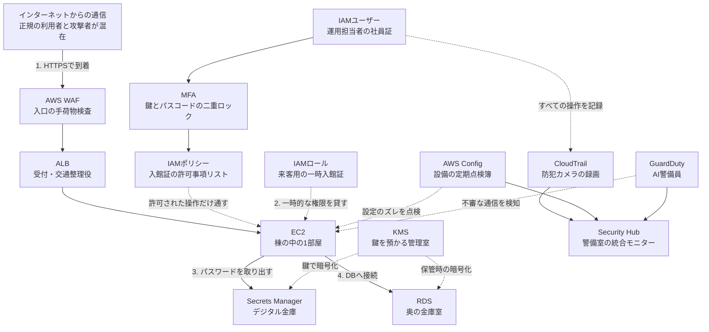

# AWS用語集 ⑥セキュリティ・ID管理

> 📖 [用語集トップ(索引)に戻る](../02-glossary.md) ｜ [← 前: ⑤データベース](05-database.md) ｜ [次: ⑦監視・運用 →](07-monitoring-operations.md)

## この章で扱う範囲

サーバー構築の仕事で「あとから直すのが最も高くつく」のがセキュリティとID管理です。EC2は作り直せますが、権限設計の失敗や認証情報の漏えいは、気づいた時点ですでに被害が出ています。この章は、AWSを触り始めた最初の1時間で固めるべき領域をまとめたページです。

前半(6-1〜6-3)は**IAM**を中心とした「誰が何をしてよいか」の話です。ここが全AWSサービスの土台になります。中盤(6-4〜6-5)は「データと通信をどう守るか」、つまり暗号化・機密情報の保管・証明書・Web攻撃の遮断です。後半(6-6〜6-7)は「破られた前提で、どう気づき・どう記録するか」という脅威検知と証跡の話になります。

具体的には、[レベル1: 静的Webサイト公開](../../projects/01-static-website/README.md)でACM証明書とOACを扱う場面、[レベル4: WordPress本番環境](../../projects/04-wordpress-production/README.md)でDBパスワードをSecrets Managerに預ける場面、そして[レベル5: セキュアな監視・ガバナンス基盤](../../projects/05-security-monitoring/README.md)でIAM設計・CloudTrail・Config・GuardDuty・WAFをまとめて組む場面で、ここの用語がそのまま登場します。



> 🧠 **覚え方のコツ**: この章は「入館管理(IAM)→ 金庫と鍵(KMS・Secrets Manager)→ 玄関の検査(WAF)→ 監視カメラと点検簿(CloudTrail・Config・GuardDuty)」という1棟のビルの警備体制として並んでいます。上から順に「誰を入れるか」を決め、下に行くほど「入られた後どう気づくか」の話になっていく、と覚えてください。

## この章の用語ミニ索引

| 用語 | ひとことで言うと |
|---|---|
| [IAM](#iam) | AWSの「誰が・何に・何をできるか」を管理する認証認可の仕組み |
| [IAMユーザー](#iamユーザー) | 人が使う、パスワードやアクセスキーを持つ恒久的な身分証 |
| [IAMグループ](#iamグループ) | 同じ権限を持つIAMユーザーをまとめるための入れ物 |
| [IAMロール](#iamロール) | サービスや他人が一時的に借りる、期限付きの身分証 |
| [AssumeRole](#assumerole) | ロールを「引き受けて」一時的な認証情報を受け取る操作 |
| [AWS STS](#aws-sts) | 一時的な認証情報を発行するAWSのトークン発行所 |
| [インスタンスプロファイル](#インスタンスプロファイル) | EC2にIAMロールを取り付けるための受け皿 |
| [アクセスキー](#アクセスキー) | CLIやプログラムからAWSを操作するための長期の認証情報 |
| [MFA](#mfa) | パスワードに加えてもう1段階本人確認する多要素認証 |
| [仮想MFAデバイス](#仮想mfaデバイス) | スマートフォンの認証アプリで実現するMFAデバイス |
| [IAMポリシー](#iamポリシー) | 「何にどんな操作を許可/拒否するか」を書いたJSONのルール文書 |
| [管理ポリシー](#管理ポリシー) | 独立したリソースとして作り、複数の相手に付け回せるポリシー |
| [インラインポリシー](#インラインポリシー) | 1つのユーザー/グループ/ロールに埋め込む専用ポリシー |
| [カスタムポリシー](#カスタムポリシー) | 自分で書いて自分のアカウントで管理するポリシー |
| [信頼ポリシー](#信頼ポリシー) | 「このロールを誰が引き受けてよいか」を定義するポリシー |
| [条件キー](#条件キー) | 「MFA済みなら」「この送信元IPなら」のように許可に条件を付ける仕組み |
| [明示的な拒否](#明示的な拒否) | どのAllowよりも優先される、はっきり書かれたDeny |
| [Policy Simulator](#policy-simulator) | 実際にAPIを叩かずに権限の可否を試せるIAMの検証ツール |
| [最小権限の原則](#最小権限の原則) | 業務に必要な最小限の権限だけを与えるセキュリティの基本方針 |
| [権限境界](#権限境界) | そのIAMユーザー/ロールが持てる権限の上限を決める枠 |
| [サービスコントロールポリシー](#サービスコントロールポリシー) | 組織全体でアカウントの権限の上限を決めるOrganizationsの仕組み |
| [ガードレール](#ガードレール) | 想定外の操作や設定をあらかじめ防ぐ、予防的なルールの総称 |
| [ガバナンス](#ガバナンス) | 組織として統制・管理を効かせ続ける仕組みづくり |
| [IAM Identity Center](#iam-identity-center) | 複数アカウントへのログインとアクセス権限を一元管理する仕組み |
| [IAM Access Analyzer](#iam-access-analyzer) | 外部に公開されている権限や過剰な権限を洗い出す分析機能 |
| [KMS](#kms) | 暗号化に使う鍵を作成・保管・利用制御するマネージドな鍵管理サービス |
| [カスタマーマネージドキー](#カスタマーマネージドキー) | 利用者が自分で作り、権限や削除まで管理するKMSの鍵 |
| [エンベロープ暗号化](#エンベロープ暗号化) | データは鍵で、その鍵をさらに別の鍵で暗号化する二重構造 |
| [保管時の暗号化](#保管時の暗号化) | ディスクやストレージに置かれている状態のデータを暗号化すること |
| [転送中の暗号化](#転送中の暗号化) | ネットワークを流れている最中のデータを暗号化すること |
| [Secrets Manager](#secrets-manager) | パスワードやAPIキーを暗号化して保管し、自動更新もできるサービス |
| [Parameter Store](#parameter-store) | 設定値や機密情報を階層パスで保管できるSystems Managerの機能 |
| [ACM](#acm) | HTTPS通信に使うSSL/TLS証明書を無料で発行・自動更新するサービス |
| [DNS検証](#dns検証) | DNSレコードを置くことで「このドメインの持ち主です」と証明する方法 |
| [SigV4](#sigv4) | AWSへのリクエストが本物かを確認するための電子署名の方式 |
| [AWS WAF](#aws-waf) | Webアプリへの攻撃をリクエスト単位で検知・遮断するファイアウォール |
| [Web ACL](#web-acl) | WAFのルールをまとめ、保護対象リソースに関連付ける単位 |
| [マネージドルール](#マネージドルール) | AWSやベンダーがあらかじめ用意した既製の攻撃検知ルール集 |
| [レートベースルール](#レートベースルール) | 一定時間内のリクエスト数が多すぎる送信元を自動でブロックするルール |
| [AWS Shield](#aws-shield) | DDoS攻撃からAWSリソースを守るサービス |
| [SQLインジェクション](#sqlインジェクション) | 入力欄に悪意あるSQL文を混入させてDBを不正操作する攻撃 |
| [XSS](#xss) | Webページに悪意あるスクリプトを埋め込み、閲覧者の画面で実行させる攻撃 |
| [GuardDuty](#guardduty) | 各種ログを機械的に分析し、不審な挙動を自動検知する脅威検知サービス |
| [Finding](#finding) | GuardDutyなどが「怪しい」と判断して出力する検知結果1件 |
| [severity](#severity) | 検知結果の深刻度を数値で表した指標 |
| [ポートスキャン](#ポートスキャン) | 開いているポートを機械的に探し回る、攻撃の下調べ行為 |
| [総当たり攻撃](#総当たり攻撃) | パスワードを片っ端から試してログインを突破しようとする攻撃 |
| [脆弱性](#脆弱性) | ソフトウェアや設定に潜む、攻撃に悪用されうる弱点 |
| [Amazon Inspector](#amazon-inspector) | EC2やコンテナイメージの脆弱性を自動でスキャンするサービス |
| [Amazon Macie](#amazon-macie) | S3の中にある個人情報など機微なデータを自動で発見するサービス |
| [Security Hub](#security-hub) | 複数のセキュリティサービスの検知結果を1画面に集約するダッシュボード |
| [CloudTrail](#cloudtrail) | 「誰が・いつ・何をしたか」というAWS操作の証跡を記録するサービス |
| [証跡](#証跡) | 記録として残し、後から追跡できるようにした操作ログそのもの |
| [管理イベント](#管理イベント) | リソースの作成・変更・削除など、設定操作に関する証跡 |
| [データイベント](#データイベント) | S3オブジェクトの読み書きなど、データそのものへの操作の証跡 |
| [ログファイルの検証](#ログファイルの検証) | 証跡ログが改ざん・削除されていないかを後から検証できる機能 |
| [AWS Config](#aws-config) | AWSリソースの設定状態を継続的に記録・評価するサービス |
| [Configルール](#configルール) | 「あるべき設定」を定義し、リソースを自動評価する判定ルール |
| [非準拠](#非準拠) | Configルールの条件を満たしていない状態(Noncompliant) |
| [構成スナップショット](#構成スナップショット) | ある時点のリソース構成をまとめて書き出した記録 |
| [多層防御](#多層防御) | 1つの対策に頼らず、複数の層で重ねて守る考え方 |
| [攻撃対象領域](#攻撃対象領域) | 攻撃者が狙える侵入口の総量 |
| [インシデント対応](#インシデント対応) | セキュリティ事故が起きたときの検知から復旧までの一連の対応 |

## 6-1. IAMの登場人物

### IAM

**正式名称**: AWS Identity and Access Management ｜ **読み方**: アイアム ｜ **重要度**: ★★★

**ひとことで言うと**: AWSの「誰が・何に対して・何をしてよいか」を一元管理する、認証と認可の仕組みです。

**たとえるなら**: ビル全体の「入館管理システム」です。社員証(IAMユーザー)を発行し、部署ごとの権限セット(IAMグループ)を決め、来客には一時入館証(IAMロール)を渡す。その全部を1か所で管理している装置がIAMです。

**もう少し詳しく**: AWSのあらゆるAPI呼び出しは、必ずIAMの評価を通過します。マネジメントコンソール(ブラウザからAWSの各サービスを操作できる管理画面)のボタンを押したときも、AWS CLI(コマンドラインからAWSを操作するツール)でコマンドを打ったときも、裏では「このリクエストを出したのは誰で、その人にこの操作は許可されているか」が判定されています。IAMは大きく**認証**(あなたが誰かを確かめること)と**認可**(その人に何を許すかを決めること)の2つを担い、認証は[IAMユーザー](#iamユーザー)や[IAMロール](#iamロール)、認可は[IAMポリシー](#iamポリシー)が受け持ちます。IAMはグローバルサービス(特定の1リージョンに属さず全リージョンで共通のサービス)なので、東京リージョンで作ったIAMユーザーはバージニア北部でもそのまま使えます。

**サーバー構築での勘所**:
- IAM自体の利用料はかかりません。「お金がかかるからあとで」と後回しにする理由がない領域です。最初に整えてください。
- 権限設計は「ユーザー → グループ → ポリシー」の3段構えが基本です。個人に直接ポリシーを貼ると、人が増えたときに誰が何を持っているか追えなくなります。
- IAMの設定変更はすべて[CloudTrail](#cloudtrail)に記録されます。「IAM権限を勝手に広げる操作」は監視対象の筆頭です。
- [レベル5](../../projects/05-security-monitoring/README.md)では `Administrators` / `Developers` / `ReadOnly` の3グループを設計しました。役割ベースで切り出すこの形が、面接で説明しやすい最小構成です。

**よくあるつまずき**: 「権限を付けたのに `Access Denied` が消えない」の大半は、別のポリシーによる[明示的な拒否](#明示的な拒否)か、`Resource` に書いた[ARN](01-cloud-basics.md#arn)(AWSリソースを一意に指し示す識別子)の書き間違いです。まず[Policy Simulator](#policy-simulator)で切り分けてください。

**💰 コスト**: IAMの利用そのものは無料です。

**関連用語**: [IAMユーザー](#iamユーザー)、[IAMロール](#iamロール)、[IAMポリシー](#iamポリシー)、[最小権限の原則](#最小権限の原則)

**登場する案件**: [レベル5: セキュアな監視・ガバナンス基盤](../../projects/05-security-monitoring/README.md)

### IAMユーザー

**読み方**: アイアムユーザー ｜ **重要度**: ★★★

**ひとことで言うと**: 人やシステムに対して発行する、パスワードやアクセスキーを持つ恒久的なAWSの身分証です。

**たとえるなら**: 「社員証」です。その人専用で、退職するまでずっと使えます。だからこそ、なくしたときの被害も大きくなります。

**もう少し詳しく**: AWSアカウントを作ると[ルートユーザー](01-cloud-basics.md#ルートユーザー)(そのアカウントに対して何でもできる最強の管理者)が1つできますが、日常作業でこれを使ってはいけません。代わりに、必要な権限だけを与えたIAMユーザーを作って作業します。IAMユーザーが持てる認証情報は2種類あり、コンソールにログインするための**パスワード**と、CLIやプログラムから使う**[アクセスキー](#アクセスキー)**です。両方を持たせる必要はなく、コンソールしか使わない人にアクセスキーを発行しないだけでも漏えい経路が1つ減ります。

**サーバー構築での勘所**:
- 1人1ユーザーが原則です。共有アカウントを作ると、[CloudTrail](#cloudtrail)を見ても「誰がやったか」が特定できなくなり、証跡の価値が失われます。
- 権限は必ず[IAMグループ](#iamグループ)経由で与えます。異動や退職のたびに個別ポリシーを剥がして回るのは現実的ではありません。
- すべてのIAMユーザーに[MFA](#mfa)を必須化してください。[レベル5](../../projects/05-security-monitoring/README.md)では、MFA未認証のセッションからの操作をほぼ全面的にDenyするガードレールポリシーを全グループに付けています。
- アプリケーションやEC2にIAMユーザーを作るのは避けます。そこは[IAMロール](#iamロール)の出番です。

**よくあるつまずき**: 「学習用だから」と `AdministratorAccess` を付けたIAMユーザーのアクセスキーを、うっかりGitHubの公開リポジトリに含めてしまう事故が後を絶ちません。公開された瞬間に自動収集ボットに拾われ、高額なリソースを立てられる被害につながります。

**関連用語**: [IAMグループ](#iamグループ)、[IAMロール](#iamロール)、[アクセスキー](#アクセスキー)、[MFA](#mfa)

**登場する案件**: [レベル5: セキュアな監視・ガバナンス基盤](../../projects/05-security-monitoring/README.md)

### IAMグループ

**重要度**: ★★★

**ひとことで言うと**: 同じ権限を与えたいIAMユーザーをまとめておく入れ物です。

**たとえるなら**: 「部署ごとの権限セット」です。総務部に配属されれば総務のドアが開き、経理部に異動すれば経理のドアが開く。人ではなく席に権限が紐づいているイメージです。

**もう少し詳しく**: グループに[IAMポリシー](#iamポリシー)をアタッチし、ユーザーをそのグループに所属させると、ユーザーはグループの権限を継承します。ユーザーは複数のグループに所属できます。重要なのは、**グループはあくまで人をまとめる箱であり、グループ自身がAWSにログインしたり[AssumeRole](#assumerole)したりはできない**という点です。また、グループの中にグループを入れる入れ子構造もできません。

**サーバー構築での勘所**:
- 役割(ロール)ベースで切ります。[レベル5](../../projects/05-security-monitoring/README.md)の `Administrators` / `Developers` / `ReadOnly` のように、業務の役割と1対1で対応させると説明しやすくなります。
- `Developers` には「業務に必要なサービスだけ」を許可し、IAMやVPCなど基盤設定の変更権限は含めないのが定石です。開発者が自分の権限を自分で広げられる状態は、最小権限が成立していません。
- グループ数が増えすぎたら、そもそもの役割定義が細かすぎるサインです。まずは3〜5個から始めてください。

**関連用語**: [IAMユーザー](#iamユーザー)、[IAMポリシー](#iamポリシー)、[最小権限の原則](#最小権限の原則)

**登場する案件**: [レベル5: セキュアな監視・ガバナンス基盤](../../projects/05-security-monitoring/README.md)

### IAMロール

**重要度**: ★★★

**ひとことで言うと**: AWSサービスや別のアカウントの利用者が、一時的に「引き受けて」使う、期限付きの身分証です。

**たとえるなら**: 「来客用の一時入館証」です。受付で名前を告げて借り、用が済めば自動的に無効になります。持ち帰られる心配がないので、社員証(IAMユーザー)を配るより安全です。

**もう少し詳しく**: IAMロールには、長期のパスワードもアクセスキーもありません。代わりに、[AssumeRole](#assumerole)された瞬間に[AWS STS](#aws-sts)が一時的な認証情報(アクセスキーID・シークレットアクセスキー・セッショントークンの3点セット)を発行し、それが期限切れになると自動的に使えなくなります。ロールは2つのポリシーで成り立っています。「**誰が引き受けてよいか**」を書いた[信頼ポリシー](#信頼ポリシー)と、「**引き受けた人が何をできるか**」を書いた[IAMポリシー](#iamポリシー)です。この2枚セットという構造を理解しておくと、ロールまわりのトラブルを一気に切り分けられるようになります。

**サーバー構築での勘所**:
- EC2からS3やSecrets Managerを呼ぶときは、**必ず**ロールを使います。アクセスキーをサーバー内のファイルに置くのは、鍵を玄関マットの下に隠すのと同じです。
- EC2に付けるときは、ロールを直接ではなく[インスタンスプロファイル](#インスタンスプロファイル)という受け皿を介して割り当てます(コンソールからは自動で作られます)。
- ⚠️ ロールを「渡す」側にも権限が必要です。EC2の起動時にインスタンスプロファイルを指定するには、操作者のポリシーに `iam:PassRole`(`Resource` を渡してよいロールのARNに限定)が要ります。これが無いと、`ec2:RunInstances` を許可していてもロールを指定した起動だけが `AccessDenied` になります。
- [レベル4](../../projects/04-wordpress-production/README.md)ではEC2用ロールに `secretsmanager:GetSecretValue` を対象シークレットのARN限定で付与しました。「アクションもリソースも絞る」のがロール設計の型です。
- [レベル6](../../projects/06-iac-cicd/README.md)のCI/CD実行ロールも同じ考え方で、`ec2:*` や `iam:*` のような広すぎる許可は使いません。

**よくあるつまずき**: 権限ポリシー(できること)ばかり見直して、信頼ポリシー(誰が引き受けられるか)を見落とすパターンです。「`AccessDenied` ではなく、そもそも `AssumeRole` で失敗している」ときは信頼ポリシー側を疑ってください。

**💰 コスト**: ロールの作成・利用に料金はかかりません。

**関連用語**: [AssumeRole](#assumerole)、[AWS STS](#aws-sts)、[信頼ポリシー](#信頼ポリシー)、[インスタンスプロファイル](#インスタンスプロファイル)

**登場する案件**: [レベル4: WordPress本番運用](../../projects/04-wordpress-production/README.md)、[レベル6: IaCとCI/CD](../../projects/06-iac-cicd/README.md)

### AssumeRole

**読み方**: アシュームロール ｜ **重要度**: ★★

**ひとことで言うと**: IAMロールを「引き受けて」、そのロールの権限を持つ一時的な認証情報を受け取る操作です。

**たとえるなら**: 受付で来客証を「借りる」手続きそのものです。名簿(信頼ポリシー)に名前が載っている人だけが、カウンターで一時入館証を受け取れます。

**もう少し詳しく**: API名としては `sts:AssumeRole` で、[AWS STS](#aws-sts)が提供します。呼び出しに成功すると、期限付きの認証情報とセッション名が返ります。誰が引き受けられるかは、ロール側の[信頼ポリシー](#信頼ポリシー)の `Principal` に書かれた相手だけです。EC2が自動で権限を得られるのも、裏側では「EC2サービスがそのロールをAssumeRoleしている」ためです。セッションの有効期間は既定で1時間程度で、ロールの「最大セッション時間」の設定によって延長できます(上限は公式ドキュメントを確認してください)。

**サーバー構築での勘所**:
- クロスアカウントアクセス(別のAWSアカウントのリソースを操作すること)は、相手アカウントにIAMユーザーを作るのではなく、ロールをAssumeRoleさせるのが正解です。
- CloudTrailにはAssumeRoleの記録と、その後の操作が別々に残ります。調査時は「誰がロールを引き受けたか」と「そのセッションが何をしたか」を突き合わせます。セッション名に担当者名を入れておくと追跡が一気に楽になります。
- 引き受けたセッションにさらに権限を絞る「セッションポリシー」を渡すこともできます。踏み台的な使い方をするときに有効です。

**関連用語**: [IAMロール](#iamロール)、[AWS STS](#aws-sts)、[信頼ポリシー](#信頼ポリシー)

### AWS STS

**正式名称**: AWS Security Token Service ｜ **読み方**: エスティーエス ｜ **重要度**: ★★

**ひとことで言うと**: 期限付きの一時的な認証情報を発行してくれる、AWSのトークン発行所です。

**たとえるなら**: ビル1階にある「来客受付カウンター」です。ここで発行された入館証には有効時刻が印字されていて、時間が過ぎれば自動的にゲートを通れなくなります。

**もう少し詳しく**: [IAMロール](#iamロール)を使う仕組みの実体はSTSです。`AssumeRole` のほか、MFA付きセッションを取得する `GetSessionToken`、そして「自分が今誰として操作しているか」を確認する `GetCallerIdentity` などのAPIを提供します。この `aws sts get-caller-identity` は、AWS CLIを触るときの最初の1コマンドとして覚えておくと非常に役立ちます。アカウントID・ユーザーID・ARNが返るので、想定と違うプロファイルで作業していないかを一瞬で確認できます。

```bash
# 今どの権限で操作しているかを確認する
aws sts get-caller-identity
```

**サーバー構築での勘所**:
- 「CLIの操作結果がおかしい」と思ったら、まず `get-caller-identity` です。複数のAWSアカウントを扱っていると、プロファイル指定漏れによる別アカウントへの操作事故が起こりがちです。
- 一時認証情報にはセッショントークンが含まれます。アクセスキーIDとシークレットだけをコピーしても動きません。
- STSはリージョンごとのエンドポイントを持ちます。閉じたネットワークから使う場合は[VPCエンドポイント](02-network.md#vpcエンドポイント)の利用を検討します。

**関連用語**: [AssumeRole](#assumerole)、[IAMロール](#iamロール)、[アクセスキー](#アクセスキー)

**登場する案件**: [AWS基礎知識(超入門)](../01-aws-basics-for-beginners.md)

### インスタンスプロファイル

**重要度**: ★★

**ひとことで言うと**: EC2インスタンスにIAMロールを取り付けるための受け皿(コンテナ)です。

**たとえるなら**: 入館証を首から下げるための「ストラップとホルダー」です。入館証(ロール)そのものとは別に、それを身に着けるための器具が必要だ、というイメージです。

**もう少し詳しく**: EC2には、IAMロールを直接ではなくインスタンスプロファイル経由で紐づけます。マネジメントコンソールからEC2用のロールを作ると、同じ名前のインスタンスプロファイルが自動で作られて紐づけられるため、普段は存在を意識しません。しかしAWS CLIやTerraformでロールを作る場合は、`create-instance-profile` と `add-role-to-instance-profile` を明示的に実行する必要があります。[レベル4のハンズオンキット](../../projects/04-wordpress-production/handson/README.md)でも、EC2用ロールとインスタンスプロファイルをセットで作成しています。

**サーバー構築での勘所**:
- 1つのインスタンスプロファイルに入れられるロールは1つだけです。「EC2に複数のロールを付ける」ことはできないので、必要な権限は1つのロールにまとめます。
- 起動後のEC2に対して、あとからインスタンスプロファイルを付け替えることもできます。ロール権限を追加した場合、反映まで少し時間がかかることがあります。
- インスタンスから取得できる一時認証情報は[インスタンスメタデータ](03-compute.md#インスタンスメタデータ)経由で読めます。だからこそ[IMDSv2](03-compute.md#imdsv2)を必須にして、盗み見を防ぎます。

**よくあるつまずき**: CLIでロールだけ作ってEC2に付けようとすると、インスタンスプロファイルが無いためリストに出てきません。「コンソールでは見えたのにCLIでは見えない」ときの典型例です。

**関連用語**: [IAMロール](#iamロール)、[AssumeRole](#assumerole)

**登場する案件**: [レベル4: WordPress本番運用](../../projects/04-wordpress-production/README.md)

### アクセスキー

**重要度**: ★★★

**ひとことで言うと**: CLIやプログラムからAWSを操作するための、IDとシークレットの2点セットになった長期の認証情報です。

**たとえるなら**: 「合鍵」です。持っている人は誰でも同じ扉を開けられます。しかも、この合鍵には有効期限が印字されていません。

**もう少し詳しく**: アクセスキーIDは `AKIA` で始まる公開しても比較的害の小さい識別子ですが、対になるシークレットアクセスキーは**作成直後の1回しか表示されません**。IAMユーザー1人につき同時に有効化できるアクセスキーは2つまでで、これは「新しい鍵を作ってアプリを切り替え、動作確認してから古い鍵を無効化・削除する」というローテーション(定期的な入れ替え)手順を可能にするための設計です。一方、[IAMロール](#iamロール)を使えばそもそも長期のアクセスキーが不要になるため、AWSはロールの利用を強く推奨しています。

**サーバー構築での勘所**:
- ⚠️ ソースコード、設定ファイル、[ユーザーデータ](03-compute.md#ユーザーデータ)、Dockerイメージ、スクリーンショットにアクセスキーを含めないでください。Git履歴に一度入ると、あとからファイルを消しても履歴から復元できます。
- EC2・Lambda・CodeBuildなどAWS内部で動くものには、アクセスキーではなくロールを使います。アクセスキーが必要になるのは、原則として「AWSの外にある端末やサーバー」からの操作だけです。
- 使っていないアクセスキーは無効化してから削除します。IAMの認証情報レポートで「最終使用日」を確認できるので、定期的な棚卸しの材料になります。
- 万一漏えいしたら、順番は「①該当キーを即座に無効化 → ②CloudTrailで不審な操作を洗い出す → ③新しいキーを発行」です。調査より先に無効化してください。

**よくあるつまずき**: シークレットアクセスキーを控え忘れて再表示しようとするパターンです。再表示はできないので、その場合はキーを作り直します。

**関連用語**: [IAMユーザー](#iamユーザー)、[IAMロール](#iamロール)、[AWS STS](#aws-sts)、[インシデント対応](#インシデント対応)

### MFA

**正式名称**: Multi-Factor Authentication(多要素認証) ｜ **読み方**: エムエフエー ｜ **重要度**: ★★★

**ひとことで言うと**: パスワードに加えて、認証アプリの数字などでもう1段階本人確認を行う仕組みです。

**たとえるなら**: 「鍵とパスコードの二重ロック」です。合鍵を盗まれても、パスコードを知らなければ扉は開きません。

**もう少し詳しく**: 「知っているもの(パスワード)」と「持っているもの(スマートフォンやセキュリティキー)」という異なる種類の要素を組み合わせるため、片方が漏れただけでは突破されません。AWSでは[仮想MFAデバイス](#仮想mfaデバイス)・ハードウェアトークン・FIDOセキュリティキーなどが使えます。特に重要なのは[ルートユーザー](01-cloud-basics.md#ルートユーザー)へのMFA設定で、AWSはルートユーザーのMFA必須化を進めています(適用状況は公式ドキュメントで確認してください)。IAMユーザー側は「設定してください」とお願いするだけでは徹底されないため、ポリシーで機械的に強制するのが実務の答えです。

**サーバー構築での勘所**:
- [条件キー](#条件キー) `aws:MultiFactorAuthPresent` を使い、MFA未認証セッションからの操作を[明示的な拒否](#明示的な拒否)するガードレールポリシーを全グループに付けます。これが[レベル5](../../projects/05-security-monitoring/README.md)の `ForceMFA` ポリシーです。
- ただし、MFAデバイスを自分で登録するための操作(`iam:EnableMFADevice` など)まで拒否すると、新入社員が永久にMFAを設定できないデッドロックに陥ります。`NotAction` で除外しておくのが定石です。
- MFAデバイスを紛失するとログインできなくなります。復旧手順(root権限での解除やサポートへの連絡)を事前に決めておいてください。
- ⚠️ CLIでMFAを効かせるには、`sts get-session-token` などでMFA済みの一時認証情報を取得する必要があります。「コンソールではMFAが効くのにCLIでは素通り」という誤解に注意してください。

**関連用語**: [仮想MFAデバイス](#仮想mfaデバイス)、[条件キー](#条件キー)、[明示的な拒否](#明示的な拒否)、[ガードレール](#ガードレール)

**登場する案件**: [レベル5: セキュアな監視・ガバナンス基盤](../../projects/05-security-monitoring/README.md)

### 仮想MFAデバイス

**重要度**: ★★

**ひとことで言うと**: スマートフォンの認証アプリで、30秒ごとに変わる数字コードを生成するソフトウェア版のMFAデバイスです。

**たとえるなら**: 物理的なカードキーの代わりに、スマートフォンのアプリ画面を見せて入館するイメージです。専用機器を配らずに二重ロックを実現できます。

**もう少し詳しく**: 一般にTOTP(Time-based One-Time Password。時刻をもとに使い捨てのパスワードを生成する方式)に対応した認証アプリを使い、AWSコンソールに表示されるQRコードを読み取って登録します。登録時には、コードが2回続けて正しいことを確認する画面が出ます。物理デバイスを購入する必要がなく無料で始められるため、学習環境から本番環境まで最も広く使われている方式です。

**サーバー構築での勘所**:
- ⚠️ 端末の時刻がずれるとコードが合いません。認証に失敗し続けるときは、まずスマートフォンの時刻自動設定を確認してください。
- 機種変更でアプリのデータを移行し損ねると、MFAごと失われます。バックアップ手段のある認証アプリを選ぶか、複数のMFAデバイスを登録できる場合は予備を登録しておきます。
- ルートユーザーの仮想MFAを個人のスマートフォンだけに紐づけると、その人が不在のときにアカウントを触れなくなります。組織で運用する場合は管理方法を決めておいてください。

**関連用語**: [MFA](#mfa)、[IAMユーザー](#iamユーザー)

**登場する案件**: [レベル5: セキュアな監視・ガバナンス基盤](../../projects/05-security-monitoring/README.md)

## 6-2. IAMポリシーの読み書き

### IAMポリシー

**重要度**: ★★★

**ひとことで言うと**: 「誰が」「何に対して」「どの操作を」許可または拒否するかを書いた、JSON形式のルール文書です。

**たとえるなら**: 「入館証に書き込む許可事項リスト」です。どのドアを開けられて、どのドアは開けられないかが明記されています。

**もう少し詳しく**: ポリシーの中身は `Statement`(ステートメント)の配列で、各ステートメントは主に次の要素からできています。`Effect`(`Allow` か `Deny`)、`Action`(`s3:GetObject` のような操作名)、`Resource`(対象リソースの[ARN](01-cloud-basics.md#arn))、そして任意で `Condition`([条件キー](#条件キー))です。IAMユーザーやロールに付ける「アイデンティティベースのポリシー」には `Principal` を書きませんが、[S3のバケットポリシー](04-storage.md#バケットポリシー)のような「リソースベースのポリシー」では、逆に `Principal`(誰が)を明記します。何も書かれていない操作は既定で拒否(暗黙的な拒否)であり、明示的な `Allow` があって初めて許可されます。

```json
{
  "Version": "2012-10-17",
  "Statement": [
    {
      "Sid": "ReadOneSecret",
      "Effect": "Allow",
      "Action": "secretsmanager:GetSecretValue",
      "Resource": "arn:aws:secretsmanager:ap-northeast-1:123456789012:secret:wordpress/prod/db-*"
    }
  ]
}
```

**サーバー構築での勘所**:
- `Action` と `Resource` の両方を絞るのが基本です。`"Action": "s3:*"` と `"Resource": "*"` の組み合わせは、事実上「S3の全権限」になります。
- ワイルドカード `*` は便利ですが、`s3:Get*` のような前方一致でも意図しないAPIを含むことがあります。使うときは必ず何が含まれるかを確認してください。
- `Version` は日付のように見えますが、ポリシー言語のバージョン識別子です。`2012-10-17` を書いておけば問題ありません。
- ARNの末尾の `/*` の有無で意味が変わります。バケット自体を指す `arn:aws:s3:::my-bucket` と、その中のオブジェクトを指す `arn:aws:s3:::my-bucket/*` は別物です。両方必要な操作もあります。

**よくあるつまずき**: 「バケットへの `s3:ListBucket` はバケットARN、オブジェクトへの `s3:GetObject` はオブジェクトARN」という区別を知らず、片方だけ書いてハマるのが定番です。

> 🧠 **覚え方のコツ**: IAMポリシーは「誰が(Principal)」「何に対して(Resource)」「何をしてよいか(Action)」の3要素で決まります。頭文字を取ると **P・R・A(プラ)**。「権限は“プラ”で決まる」と唱えて覚えてください。ただし `Principal` をJSONに明記するのは、S3のバケットポリシーのようなリソースベースのポリシーだけです。IAMユーザーやロールに付けるポリシーでは、そのポリシーを貼った相手そのものがPrincipalになるため、本文には書きません。この3つが揃って初めて権限が決まります(Principalは本文に書く場合と、貼り付け先が兼ねる場合があります)。

**関連用語**: [管理ポリシー](#管理ポリシー)、[条件キー](#条件キー)、[明示的な拒否](#明示的な拒否)、[Policy Simulator](#policy-simulator)

**登場する案件**: [レベル5: セキュアな監視・ガバナンス基盤](../../projects/05-security-monitoring/README.md)

### 管理ポリシー

**重要度**: ★★

**ひとことで言うと**: 独立したリソースとして作られ、複数のユーザー・グループ・ロールに付け回せるIAMポリシーです。

**たとえるなら**: 総務が作って全部署に配れる「共通の許可証テンプレート」です。テンプレート側を1回直せば、配った先すべてに反映されます。

**もう少し詳しく**: 管理ポリシーには2種類あります。AWSがあらかじめ用意している**AWS管理ポリシー**(`AdministratorAccess`、`ReadOnlyAccess`、`AmazonSSMManagedInstanceCore` など)と、自分で作る**カスタマー管理ポリシー**(本ドキュメントでは[カスタムポリシー](#カスタムポリシー)と呼びます)です。どちらも1つのポリシーを複数の相手にアタッチできます。ただし、バージョンを作って以前の内容に巻き戻せるのはカスタマー管理ポリシーだけで、AWS管理ポリシーは中身を編集することも、利用者の判断で以前のバージョンに戻すこともできません。対になる概念が[インラインポリシー](#インラインポリシー)で、こちらは1つの相手に埋め込む専用ポリシーです。

**サーバー構築での勘所**:
- AWS管理ポリシーは便利ですが、AWS側の判断で権限が追加されることがあります。本番の重要な権限は、内容を自分で管理できるカスタマー管理ポリシーにするほうが安全です。
- `AdministratorAccess` は「学習用のはじめの一歩」としては現実的ですが、そのまま本番運用に持ち込まないでください。付与する人数を最小限に絞る前提でのみ使います。
- 1つのIAMエンティティにアタッチできる管理ポリシーの数や、ポリシー本文の文字数には上限があります。上限に当たったら「まとめすぎ」か「細かく分けすぎ」のサインです(最新の上限は[IAMユーザーガイド](https://docs.aws.amazon.com/IAM/latest/UserGuide/introduction.html)を確認してください)。

**関連用語**: [インラインポリシー](#インラインポリシー)、[カスタムポリシー](#カスタムポリシー)、[IAMポリシー](#iamポリシー)

**登場する案件**: [レベル5: セキュアな監視・ガバナンス基盤](../../projects/05-security-monitoring/README.md)

### インラインポリシー

**重要度**: ★

**ひとことで言うと**: 1つのIAMユーザー・グループ・ロールに直接埋め込まれた、その相手専用のポリシーです。

**たとえるなら**: 共通テンプレートではなく、その人の入館証の裏面に直接ボールペンで書き足した特記事項です。他の人には配れません。

**もう少し詳しく**: インラインポリシーは、アタッチ先のIAMエンティティと一心同体です。そのユーザーやロールを削除すると、ポリシーも一緒に消えます。「このロールだけに絶対に付いていてほしい、他に流用されたくない権限」を表現するのには向いていますが、同じ内容を複数箇所に書くと管理が破綻します。AWSは一般に[管理ポリシー](#管理ポリシー)の利用を推奨しています。

**サーバー構築での勘所**:
- インラインポリシーはコンソールの一覧に出にくく、棚卸しのときに見落とされがちです。「権限を調べたのに漏れがあった」原因になりやすい要注意ポイントです。
- Terraformなどの[IaC](08-iac-cicd.md#iac)(インフラの構成をコードとして管理する考え方)で扱う場合も、ロール定義に埋め込むかポリシーリソースとして分けるかで差分の見え方が変わります。チームで方針を統一してください。

**関連用語**: [管理ポリシー](#管理ポリシー)、[IAMポリシー](#iamポリシー)

### カスタムポリシー

**重要度**: ★★

**ひとことで言うと**: AWSが用意した既製品ではなく、自分の要件に合わせて自分で書いたIAMポリシーです。

**たとえるなら**: 既製品の許可証では権限が広すぎるので、自社の業務に合わせて許可事項を書き下ろした「オーダーメイドの許可証」です。

**もう少し詳しく**: 正式には「カスタマー管理ポリシー」と呼ばれる、[管理ポリシー](#管理ポリシー)の一種です。[最小権限の原則](#最小権限の原則)を本気で実践しようとすると、必ずここに行き着きます。[レベル5](../../projects/05-security-monitoring/README.md)の `Developers` グループには、EC2・S3・CloudWatch Logsなど業務上必要なアクションだけを許可したカスタムポリシーを付け、IAMやVPCといった基盤設定の変更権限は含めていません。書き方に迷ったら、AWS管理ポリシーの中身を読んで必要な部分だけ抜き出すところから始めるのが近道です。

**サーバー構築での勘所**:
- いきなり完璧を目指さず、「まず広めに許可 → CloudTrailで実際に使われたアクションを確認 → 使っていないものを削る」という順で絞り込むと現実的です。IAM Access Analyzerにも、CloudTrailの履歴からポリシー案を生成する機能があります。
- 作ったポリシーは必ず[Policy Simulator](#policy-simulator)で「許可したい操作が通るか」と「禁止したい操作が止まるか」の両方を確認します。
- 命名規則を決めてください。`role-`、`policy-`、環境名などの接頭辞があるだけで、棚卸しの負荷が大きく変わります。

**関連用語**: [管理ポリシー](#管理ポリシー)、[最小権限の原則](#最小権限の原則)、[Policy Simulator](#policy-simulator)

**登場する案件**: [レベル5: セキュアな監視・ガバナンス基盤](../../projects/05-security-monitoring/README.md)

### 信頼ポリシー

**重要度**: ★★

**ひとことで言うと**: 「このIAMロールを、誰が引き受けてよいか」だけを定義した専用のポリシーです。

**たとえるなら**: 受付カウンターに置かれた「来客名簿」です。名簿に載っている相手にだけ、一時入館証を手渡します。

**もう少し詳しく**: 信頼ポリシー(Trust Policy)は、ロールにひもづくリソースベースのポリシーで、`Principal` に引き受け手を書き、`Action` には `sts:AssumeRole` を指定します。`Principal` に書けるのは、AWSサービス(`ec2.amazonaws.com`、`config.amazonaws.com`、`backup.amazonaws.com` など)、別アカウントのARN、IAMユーザーやロール、あるいは外部IDプロバイダなどです。[レベル4](../../projects/04-wordpress-production/handson/README.md)や[レベル5](../../projects/05-security-monitoring/handson/README.md)のハンズオンキットでは、この信頼ポリシーをJSONファイルとして切り出して管理しています。

```json
{
  "Version": "2012-10-17",
  "Statement": [
    {
      "Effect": "Allow",
      "Principal": { "Service": "ec2.amazonaws.com" },
      "Action": "sts:AssumeRole"
    }
  ]
}
```

**サーバー構築での勘所**:
- 「権限は付いているのに動かない」ときは、権限ポリシーではなく信頼ポリシーの `Principal` を疑ってください。サービス名の綴り違い(`ec2.amazonaws.com` を `ec2.aws.com` と書くなど)は非常によくあるミスです。
- 別アカウントに権限を貸すときは、`Condition` に `sts:ExternalId` を要求する設計が推奨されます。第三者に意図せず引き受けられる事故を防げます。
- コンソールで「ユースケース: CodeBuild」などを選ぶと、信頼ポリシーは自動生成されます。手書きするのはCLIやTerraformを使うときです。

**関連用語**: [IAMロール](#iamロール)、[AssumeRole](#assumerole)、[IAMポリシー](#iamポリシー)

**登場する案件**: [レベル5: セキュアな監視・ガバナンス基盤](../../projects/05-security-monitoring/README.md)

### 条件キー

**重要度**: ★★

**ひとことで言うと**: 「MFA済みなら」「この送信元IPからなら」のように、許可や拒否に条件を付けるためのキーです。

**たとえるなら**: 入館証に添えられた「ただし平日9時〜18時、正面玄関からの入館に限る」という但し書きです。同じ入館証でも、条件を満たさなければゲートは開きません。

**もう少し詳しく**: [IAMポリシー](#iamポリシー)の `Condition` ブロックに書きます。よく使うものに、MFA認証済みかを表す `aws:MultiFactorAuthPresent`、送信元IPを見る `aws:SourceIp`、HTTPSかどうかを見る `aws:SecureTransport`、操作対象リージョンを絞る `aws:RequestedRegion`、組織を絞る `aws:PrincipalOrgID` などがあります。条件演算子(`Bool`、`StringEquals`、`IpAddress` など)と組み合わせて使い、末尾に `IfExists` を付けた `BoolIfExists` のような形にすると、「そのキーがリクエストに含まれていれば通常どおり評価し、**含まれていない場合は条件を満たしたもの(true)として扱う**」という挙動になります。Denyと組み合わせると、キーを持たないリクエスト(長期のアクセスキーで実行したCLI/API呼び出しなど)まで拒否できます。

**サーバー構築での勘所**:
- [レベル5](../../projects/05-security-monitoring/README.md)の `ForceMFA` ポリシーでは `"BoolIfExists": {"aws:MultiFactorAuthPresent": "false"}` を使っています。`Bool` ではなく `BoolIfExists` なのは、`aws:MultiFactorAuthPresent` が長期のアクセスキーで実行されたCLI/APIリクエストにはそもそも含まれないためです。`Bool` だと条件が成立せずDenyが発動せず、アクセスキー経由の操作が素通りしてしまいます。`BoolIfExists` はキーが無いリクエストを「MFA未認証」とみなしてDenyを適用するので、MFA強制を貫徹できます。
- `aws:SourceIp` はオフィスIPからのみ許可する用途に使えますが、AWSサービス経由の呼び出しでは送信元が変わるため、思わぬ拒否につながることがあります。適用範囲を慎重に検討してください。
- S3のバケットポリシーで `aws:SecureTransport` が `false` の通信を拒否すると、暗号化されていないHTTPアクセスを機械的に排除できます。

**関連用語**: [IAMポリシー](#iamポリシー)、[MFA](#mfa)、[明示的な拒否](#明示的な拒否)

**登場する案件**: [レベル5: セキュアな監視・ガバナンス基盤](../../projects/05-security-monitoring/README.md)

### 明示的な拒否

**重要度**: ★★★

**ひとことで言うと**: ポリシーにはっきり書かれた `Deny` のことで、他のどんな `Allow` よりも優先されます。

**たとえるなら**: どんな身分証を持っていても入れない「立入禁止」の張り紙です。マスターキーを持つ支配人であっても、この張り紙の部屋には入れません。

**もう少し詳しく**: IAMの評価順序は、大まかに次のとおりです。①どこかに明示的なDenyがあれば、その時点で拒否が確定します。②Denyが無く、どこかに明示的なAllowがあれば許可されます。③どちらも無ければ暗黙的な拒否(何も書かれていないので拒否)になります。この「Denyが常に最優先」というルールは、[サービスコントロールポリシー](#サービスコントロールポリシー)や[権限境界](#権限境界)を含むすべての評価レイヤーで共通です。詳細な評価ロジックは[IAMポリシーの評価論理](https://docs.aws.amazon.com/IAM/latest/UserGuide/reference_policies_evaluation-logic.html)にまとまっています。

**サーバー構築での勘所**:
- ✅ 「絶対にさせたくない操作」はAllowを外すだけでなく、明示的にDenyで書きます。誰かが別のポリシーでAllowを追加しても効かなくなるため、[ガードレール](#ガードレール)として機能します。
- ⚠️ 逆に、広範囲なDenyは自分自身の首を絞めます。CloudTrailやConfigの記録を止められないようにする意図のDenyが、運用担当者の正当な作業まで止めてしまう事例は珍しくありません。
- `Access Denied` のトラブルシューティングは「①Denyを探す → ②Allowの有無を確認 → ③Resourceの書き方を確認」の順が最短です。

**関連用語**: [IAMポリシー](#iamポリシー)、[サービスコントロールポリシー](#サービスコントロールポリシー)、[権限境界](#権限境界)、[Policy Simulator](#policy-simulator)

**登場する案件**: [レベル5: セキュアな監視・ガバナンス基盤](../../projects/05-security-monitoring/README.md)

### Policy Simulator

**読み方**: ポリシーシミュレーター ｜ **重要度**: ★★

**ひとことで言うと**: 実際にAPIを呼び出さずに、「この人はこの操作をできるか」を事前に判定できるIAMの検証ツールです。

**たとえるなら**: 実際に手術する前に撮るレントゲン写真です。何も壊さずに中身を確認できます。

**もう少し詳しく**: IAMコンソールから、対象のユーザー・グループ・ロールを選んで使います。アタッチされているすべてのポリシーを評価したうえで「許可される見込みか、拒否される見込みか」を表示し、拒否の場合は**どのポリシーのどのステートメントが原因か**まで示してくれます。AWS CLIからは `aws iam simulate-principal-policy` で同じことができます。

```bash
# Developersグループのユーザーが EC2 の削除を実行できるかを検証する
aws iam simulate-principal-policy \
  --policy-source-arn "arn:aws:iam::<アカウントID>:group/Developers" \
  --action-names "ec2:TerminateInstances"
```

**サーバー構築での勘所**:
- 権限を絞ったあとの回帰確認に向いています。「許可したい操作が通るか」と「禁止したい操作が止まるか」の両方をセットで試すのがコツです。
- ⚠️ シミュレーターは実環境の完全な再現ではありません。[サービスコントロールポリシー](#サービスコントロールポリシー)やリソースベースのポリシー、一部の[条件キー](#条件キー)は評価に含められない場合があります。結果が実際と食い違うときはこの点を疑ってください。
- 検証時は本番リソースのARNを指定できます。ワイルドカードのまま試すと実態とずれるので、可能な限り具体的なARNで確認します。

**関連用語**: [IAMポリシー](#iamポリシー)、[明示的な拒否](#明示的な拒否)、[カスタムポリシー](#カスタムポリシー)

**登場する案件**: [レベル5: セキュアな監視・ガバナンス基盤](../../projects/05-security-monitoring/README.md)

## 6-3. IAM運用のベストプラクティス

### 最小権限の原則

**重要度**: ★★★

**ひとことで言うと**: 業務に必要な最小限の権限だけを与え、それ以外は与えないというセキュリティの基本方針です。

**たとえるなら**: 「ホテルのカードキー」です。宿泊客のカードキーは自分の部屋しか開かず、清掃スタッフのカードキーは客室フロアの共用部まで、支配人のマスターキーだけが全室を開けられます。全員にマスターキーを渡すホテルはありません。

**もう少し詳しく**: 「必要になったら足す」という増分アプローチが原則で、「とりあえず全部許可して、あとで削る」は現実にはほとんど削られないまま放置されます。実践する際は、権限の対象を**主体**(誰に)・**アクション**(どの操作を)・**リソース**(どのモノに)・**条件**(どんなときに)の4軸で絞り込みます。[レベル4](../../projects/04-wordpress-production/README.md)でEC2に付けたポリシーが `secretsmanager:GetSecretValue` を対象シークレットのARN限定にしているのは、この4軸のうちアクションとリソースを両方絞った例です。

**サーバー構築での勘所**:
- 面接で「最小権限をどう実践しましたか」と聞かれたら、「役割ベースのグループ設計」「アクションとリソースの両方を絞ったカスタムポリシー」「MFA強制のガードレール」の3点セットで答えると具体性が出ます。
- 権限を絞る作業には「棚卸し」がセットで必要です。IAMの認証情報レポートやアクセスアドバイザー(最後にサービスへアクセスした日時)を使い、使われていない権限を定期的に削ります。
- ✅ 「最小権限=不便」ではありません。不便になるのは、権限を絞ったあとの追加申請フローを用意していない場合です。
- 人だけでなく、CI/CDの実行ロールにも同じ原則を適用します。[レベル6](../../projects/06-iac-cicd/README.md)では `ec2:*` や `iam:*` のような広すぎる許可を避けています。

**関連用語**: [IAMポリシー](#iamポリシー)、[権限境界](#権限境界)、[多層防御](#多層防御)、[ガードレール](#ガードレール)

**登場する案件**: [レベル5: セキュアな監視・ガバナンス基盤](../../projects/05-security-monitoring/README.md)、[レベル6: IaCとCI/CD](../../projects/06-iac-cicd/README.md)

### 権限境界

**重要度**: ★

**ひとことで言うと**: そのIAMユーザーやロールが「最大でどこまでの権限を持てるか」の上限を定める枠です。

**たとえるなら**: 「この階より上には、どんな入館証を持っていても上がれません」というエレベーターの階数制限です。入館証の中身がどう書き換えられても、制限そのものは超えられません。

**もう少し詳しく**: 権限境界(Permissions Boundary)は、それ自体が権限を与えるものではありません。「アイデンティティベースのポリシーで許可されている操作」と「権限境界で許可されている操作」の**両方**に含まれる操作だけが実際に許可される、という掛け算の関係になります。主な用途は権限の委任で、「開発チームのリーダーに、IAMロールを自由に作る権限を渡したい。ただし作れるロールの権限には上限を設けたい」といったケースで使います。

**サーバー構築での勘所**:
- 個人開発や小規模構成では、まず使いません。組織が育ってIAM操作を委任する段階になって初めて必要になる、やや上級の仕組みです。
- 似た概念に[サービスコントロールポリシー](#サービスコントロールポリシー)がありますが、SCPはアカウント全体に効き、権限境界は個々のIAMエンティティに効きます。
- 面接では「SCPと権限境界の違い」として問われることがあります。「効く範囲が組織/アカウント単位か、IAMエンティティ単位か」が答えの核です。

**関連用語**: [サービスコントロールポリシー](#サービスコントロールポリシー)、[最小権限の原則](#最小権限の原則)、[明示的な拒否](#明示的な拒否)

### サービスコントロールポリシー

**正式名称**: Service Control Policy(SCP) ｜ **読み方**: エスシーピー ｜ **重要度**: ★★

**ひとことで言うと**: AWS Organizationsで複数アカウントを束ねている場合に、アカウント単位で「そもそも実行できないAPI操作」を組織的に制限する仕組みです。

**たとえるなら**: ビルの管理会社が定めた「全テナント共通の館内規則」です。各テナント(アカウント)が自分の社内規程(IAMポリシー)で何を許可しようと、館内規則で禁止されている行為はできません。

**もう少し詳しく**: SCPは[AWS Organizations](01-cloud-basics.md#aws-organizations)(複数のAWSアカウントをまとめて管理する仕組み)の機能で、OU(組織単位)やアカウントにアタッチします。重要なのは、**SCPは権限を与えず、上限を決めるだけ**という点です。SCPで許可されていても、IAM側で許可されていなければ操作はできません。逆にIAM側で `AdministratorAccess` を持っていても、SCPで禁止されていれば実行できません。管理アカウント(management account)には効かない、サービスリンクロールには適用されないといった例外もあるため、詳細は[AWS Organizationsユーザーガイド](https://docs.aws.amazon.com/organizations/latest/userguide/orgs_introduction.html)を確認してください。

**サーバー構築での勘所**:
- 定番の使い方は「使わないリージョンでのリソース作成を全面禁止する」「CloudTrailやConfigの停止・削除を全アカウントで禁止する」「ルートユーザーの利用を禁止する」といった[ガードレール](#ガードレール)です。
- ⚠️ 影響範囲が大きいため、いきなり全アカウントに適用しないでください。検証用OUで試してから広げます。
- SCPの適用は[Policy Simulator](#policy-simulator)に反映されない場合があります。「シミュレーターでは通るのに実際は拒否される」ときはSCPを疑ってください。
- [レベル5の発展課題](../../projects/05-security-monitoring/README.md)でも、Organizations併用時のガードレール設計として触れています。

**関連用語**: [ガードレール](#ガードレール)、[ガバナンス](#ガバナンス)、[権限境界](#権限境界)、[明示的な拒否](#明示的な拒否)

**登場する案件**: [レベル5: セキュアな監視・ガバナンス基盤](../../projects/05-security-monitoring/README.md)

### ガードレール

**重要度**: ★★

**ひとことで言うと**: 想定外の操作や設定をあらかじめ防ぐための、予防的なルールの総称です。

**たとえるなら**: 山道に設置されたガードレールそのものです。運転手を信用していないわけではなく、ハンドル操作を1回誤っただけで谷底に落ちない構造にしておく、という発想です。

**もう少し詳しく**: AWSにおけるガードレールは、大きく**予防的統制**(そもそもできないようにする)と**発見的統制**(やってしまったことに気づけるようにする)に分かれます。予防的統制の代表が[サービスコントロールポリシー](#サービスコントロールポリシー)やMFA強制ポリシー、[S3のブロックパブリックアクセス](04-storage.md#ブロックパブリックアクセス)です。発見的統制の代表が[AWS Config](#aws-config)のルール評価や[GuardDuty](#guardduty)の検知です。両方を組み合わせることで、「防げるものは防ぎ、防げなかったものは即座に気づく」体制ができます。

**サーバー構築での勘所**:
- 「注意して運用しましょう」という人の努力に頼るルールは、ガードレールではありません。仕組みで機械的に止まるかどうかが分かれ目です。
- 予防的統制を強くしすぎると業務が止まります。まずは発見的統制(Config・GuardDuty・請求アラート)から入れ、確実に守りたい一線だけを予防的に固めるのが現実的な順序です。
- [レベル5](../../projects/05-security-monitoring/README.md)の `ForceMFA` ポリシーは、予防的ガードレールの分かりやすい実例です。

**関連用語**: [ガバナンス](#ガバナンス)、[サービスコントロールポリシー](#サービスコントロールポリシー)、[AWS Config](#aws-config)、[多層防御](#多層防御)

**登場する案件**: [レベル5: セキュアな監視・ガバナンス基盤](../../projects/05-security-monitoring/README.md)

### ガバナンス

**重要度**: ★★

**ひとことで言うと**: 組織として統制・管理を効かせ続け、「決めたルールが守られている状態」を維持する仕組みづくりです。

**たとえるなら**: ビルの「管理規約と、それを運用する管理組合」です。設備を作るのが施工、規約を決めて守られているか見続けるのがガバナンスです。

**もう少し詳しく**: 単発のセキュリティ設定と違い、ガバナンスは継続的な活動です。具体的には、①ルールを決める(命名規則・[タグ](01-cloud-basics.md#タグ)付け規約・許可するリージョン・必須の暗号化設定)、②[ガードレール](#ガードレール)で守らせる、③[AWS Config](#aws-config)や[Security Hub](#security-hub)で継続的に評価する、④逸脱を是正する、というサイクルを回します。[レベル5](../../projects/05-security-monitoring/README.md)を「特定のシステムに紐づく案件ではなく、AWSアカウント全体をどう安全に運用するかの案件」と位置づけているのは、まさにこの視点です。

**サーバー構築での勘所**:
- 面接では「作って終わりではなく、守り続ける視点を持っているか」を見られます。CloudTrail・Config・GuardDutyの3点セットを挙げられると、この視点の証明になります。
- コスト面のガバナンスも同じ枠組みです。[AWS Budgets](01-cloud-basics.md#aws-budgets)による予算超過通知は、コストのガードレールと言えます。
- 全体像の指針としては[AWS Well-Architected Framework](https://aws.amazon.com/jp/architecture/well-architected/)のセキュリティの柱が参考になります。

**関連用語**: [ガードレール](#ガードレール)、[サービスコントロールポリシー](#サービスコントロールポリシー)、[AWS Config](#aws-config)、[Security Hub](#security-hub)

**登場する案件**: [レベル5: セキュアな監視・ガバナンス基盤](../../projects/05-security-monitoring/README.md)

### IAM Identity Center

**読み方**: アイアム アイデンティティ センター ｜ **重要度**: ★

**ひとことで言うと**: 複数のAWSアカウントへのログインと権限付与を、1か所で一元管理する仕組みです。

**たとえるなら**: 系列ビル全体で共通に使える「共通入館パス」です。ビルごとに社員証を発行するのをやめ、1枚のパスでどのビルのどのフロアに入れるかを中央で決めます。

**もう少し詳しく**: 旧称はAWS Single Sign-On(AWS SSO)です。アカウントごとに[IAMユーザー](#iamユーザー)を作るのではなく、Identity Center側にユーザーを作る(または社内のIdP=IDプロバイダと連携する)ことで、1回のログインで複数アカウントに切り替えられるようになります。実際に払い出されるのは一時的な認証情報なので、長期の[アクセスキー](#アクセスキー)を各アカウントに撒かずに済むという大きな利点があります。詳細は[AWS IAM Identity Centerユーザーガイド](https://docs.aws.amazon.com/singlesignon/latest/userguide/what-is.html)を参照してください。

**サーバー構築での勘所**:
- 個人の学習アカウント1つで完結する段階では不要です。アカウントが2つ3つと増えてきたら検討の合図です。
- AWS CLI v2はIdentity Centerのプロファイル(`aws configure sso`)に対応しています。ローカルにアクセスキーを置かない運用に切り替えられます。
- [レベル3のハンズオンキット](../../projects/03-ha-three-tier/handson/README.md)の前提条件にも「アクセスキーまたはSSO」と書かれており、実務では後者が増えています。

**💰 コスト**: IAM Identity Center自体の利用に追加料金はかからないとされています。最新の条件は公式ページで確認してください([AWS無料利用枠](https://aws.amazon.com/jp/free/))。

**関連用語**: [IAMユーザー](#iamユーザー)、[AWS STS](#aws-sts)、[ガバナンス](#ガバナンス)

### IAM Access Analyzer

**読み方**: アイアム アクセス アナライザー ｜ **重要度**: ★

**ひとことで言うと**: 「意図せず外部に公開されている権限」や「使われていない過剰な権限」を洗い出してくれるIAMの分析機能です。

**たとえるなら**: ビルの管理人が定期的に行う「鍵の棚卸し」です。誰にも使われていない合鍵や、外部業者に渡したままの鍵を一覧にしてくれます。

**もう少し詳しく**: 大きく2種類の分析があります。**外部アクセスの検出**は、S3バケットポリシーやIAMロールの信頼ポリシーなどを解析し、「自分のアカウントや組織の外から到達できる」設定を検出結果として挙げます。**未使用アクセスの検出**は、一定期間使われていないロール・アクセスキー・権限を洗い出します。ほかに、CloudTrailの操作履歴から最小権限ポリシーの草案を生成する機能もあり、[カスタムポリシー](#カスタムポリシー)を書く出発点として便利です。詳細は[IAM Access Analyzerのドキュメント](https://docs.aws.amazon.com/IAM/latest/UserGuide/what-is-access-analyzer.html)を参照してください。

**サーバー構築での勘所**:
- 「公開してよい公開」と「意図しない公開」を区別する必要があります。検出結果には、静的サイト配信のように意図的な公開も含まれるため、確認して問題なければアーカイブします。
- 検出結果は[Security Hub](#security-hub)にも集約できます。個別画面を見に行く運用から卒業できます。

**💰 コスト**: 外部アクセスの検出は追加料金なしで使えるとされていますが、未使用アクセスの検出など一部の機能は有料です。最新の料金・無料利用枠の条件は必ず公式ページで確認してください([AWS無料利用枠](https://aws.amazon.com/jp/free/))。

**関連用語**: [最小権限の原則](#最小権限の原則)、[Security Hub](#security-hub)、[カスタムポリシー](#カスタムポリシー)

## 6-4. 暗号化と機密情報

### KMS

**正式名称**: AWS Key Management Service ｜ **読み方**: ケーエムエス ｜ **重要度**: ★★★

**ひとことで言うと**: 暗号化に使う鍵を作成・保管し、「誰がその鍵を使ってよいか」までまとめて管理するマネージドな鍵管理サービスです。

**たとえるなら**: ビルの地下にある「鍵の管理室」です。各部屋の鍵は管理室から出さず、「この人にこの部屋を開けてあげてください」と依頼する形で使います。鍵そのものを持ち歩かないので、落として拾われる心配がありません。

**もう少し詳しく**: KMSの鍵(KMSキー)は、原則としてKMSの外に持ち出せません。利用者は「このデータを暗号化して」「このデータを復号して」とAPIで依頼し、KMSが結果を返します。鍵を使えるかどうかは、キーポリシー(鍵に付くリソースベースのポリシー)と[IAMポリシー](#iamポリシー)の組み合わせで決まります。S3・EBS・RDS・Secrets Managerなど多くのAWSサービスがKMSと統合されており、チェックボックスひとつで[保管時の暗号化](#保管時の暗号化)を有効にできます。大きなデータは[エンベロープ暗号化](#エンベロープ暗号化)という仕組みで効率よく扱われます。

**サーバー構築での勘所**:
- 鍵には3種類あります。**AWSマネージドキー**(サービスが自動で用意、月額固定料金なし)、**[カスタマーマネージドキー](#カスタマーマネージドキー)**(自分で作成・管理)、そしてAWS所有キーです。まずはAWSマネージドキーで始め、権限の細かい制御やローテーション方針の指定が必要になったらカスタマーマネージドキーに移行する、という順序が現実的です。
- ⚠️ 鍵を削除すると、その鍵で暗号化したデータは二度と復号できません。そのためKMSでは即時削除ができず、削除をスケジュールしたうえで待機期間(既定は30日。7〜30日の範囲で指定できます)を経てから削除されます。待機期間中であれば削除をキャンセルできます。
- キーポリシーで自分自身を締め出すと、鍵が誰にも使えなくなります。ルート(アカウント)からの管理を許可する記述は残してください。
- [レベル1](../../projects/01-static-website/README.md)で「旧OAIはKMS暗号化オブジェクトへの対応に制約があった」と説明しているのも、このKMSの話です。

**💰 コスト**: [カスタマーマネージドキー](#カスタマーマネージドキー)は1キーあたりの月額固定料金と、APIリクエスト数に応じた従量課金が発生します。AWSマネージドキーには月額固定料金がかかりません。最新の料金・無料利用枠の条件は必ず公式ページで確認してください([AWS無料利用枠](https://aws.amazon.com/jp/free/))。

**関連用語**: [カスタマーマネージドキー](#カスタマーマネージドキー)、[エンベロープ暗号化](#エンベロープ暗号化)、[保管時の暗号化](#保管時の暗号化)、[Secrets Manager](#secrets-manager)

**登場する案件**: [レベル1: 静的Webサイト公開](../../projects/01-static-website/README.md)、[レベル6: IaCとCI/CD](../../projects/06-iac-cicd/README.md)

### カスタマーマネージドキー

**正式名称**: customer managed key ｜ **重要度**: ★★

**ひとことで言うと**: 利用者が自分で作成し、権限設定・ローテーション・削除まで自分で管理するKMSの鍵です。

**たとえるなら**: 管理室に預ける鍵のうち、「自分で発注し、複製の可否も自分で決める専用の鍵」です。ビル備え付けの共用鍵(AWSマネージドキー)より手間はかかりますが、扱いを細かく決められます。

**もう少し詳しく**: AWSマネージドキーとの主な違いは、キーポリシーを自分で書けること、鍵の自動ローテーションの有無を選べること、複数のAWSサービスやアカウントをまたいで同じ鍵を使えること、そして削除できることです。逆に言えば、これらの制御が不要なら、AWSマネージドキーで十分な場面も多くあります。S3では[SSE-KMS](04-storage.md#sse-kms)としてこの鍵を指定でき、[SSE-S3](04-storage.md#sse-s3)よりも「誰が復号できるか」を細かく制御できます。なお、AWSの鍵はかつて Customer Master Key(CMK)と呼ばれていましたが、現在の正式な呼び方は「KMSキー」です。古い記事でCMKと書かれていたらこの鍵のことだと読み替えてください。

**サーバー構築での勘所**:
- 「暗号化する」ことと「復号できる人を絞る」ことは別の話です。カスタマーマネージドキーの価値は後者にあります。監査要件で「特定チームだけが復号できること」を求められたときに選びます。
- 自動ローテーションを有効にすると、KMSが定期的に鍵素材を入れ替えます。過去のデータは古い鍵素材で復号され続けるので、既存データを再暗号化する必要はありません。
- ⚠️ クロスアカウントで使う場合、キーポリシー側とIAMポリシー側の両方で許可が必要です。片方だけでは動きません。

**💰 コスト**: 1キーあたりの月額固定料金と、APIリクエストに応じた従量課金が発生します。検証で大量に作ると地味に積み上がるため、不要になった鍵は削除をスケジュールしてください。

**関連用語**: [KMS](#kms)、[エンベロープ暗号化](#エンベロープ暗号化)、[保管時の暗号化](#保管時の暗号化)

### エンベロープ暗号化

**重要度**: ★★

**ひとことで言うと**: データ本体は高速な「データキー」で暗号化し、そのデータキーをさらにKMSの鍵で暗号化して一緒に保管する二重構造の暗号化方式です。

**たとえるなら**: 書類を金庫(データキー)にしまい、その金庫の鍵を封筒に入れて封蝋(KMSキー)で閉じ、金庫と一緒に運ぶイメージです。封蝋を開けられる人だけが金庫を開けられます。

**もう少し詳しく**: なぜこんな二重構造にするのかというと、性能とセキュリティの両立のためです。数GBのファイルをまるごとKMSに送って暗号化してもらうのは非効率ですし、通信量の制約もあります。そこでKMSからは小さな「データキー」だけを受け取り、実際の暗号化はローカルで高速に行います。受け取ったデータキーは、平文版を処理後すぐにメモリから捨て、暗号化版だけを暗号文と一緒に保存します。復号時は、暗号化されたデータキーをKMSに送って平文に戻してもらい、それでデータを復号します。S3・EBS・RDSなどAWSサービスの暗号化は、ほぼこの方式で動いています。

**サーバー構築での勘所**:
- 普段この仕組みを意識する必要はありませんが、「なぜKMSが大きなデータを扱わなくても全体を暗号化できるのか」を説明できると、面接での理解度アピールになります。
- 復号にはKMSへのAPI呼び出しが必要です。オフライン環境や、KMSへの経路がないプライベートサブネットからは復号できません。必要なら[VPCエンドポイント](02-network.md#vpcエンドポイント)を用意します。
- 大量の小さいオブジェクトを扱う場合、KMSリクエスト数が増えてコストと制限に影響します。S3のバケットキー機能のような、リクエストを減らす仕組みの検討対象になります。

**関連用語**: [KMS](#kms)、[カスタマーマネージドキー](#カスタマーマネージドキー)、[保管時の暗号化](#保管時の暗号化)

### 保管時の暗号化

**重要度**: ★★

**ひとことで言うと**: ディスクやストレージに置かれている状態(保存されたまま動いていない状態)のデータを暗号化することです。

**たとえるなら**: 倉庫に預けた荷物を、そのまま置くのではなく施錠したコンテナに入れて保管することです。倉庫の壁を破られても、中身はすぐには読まれません。

**もう少し詳しく**: 英語では encryption at rest と呼びます。守れるのは主に「物理的な媒体や保存領域そのものに触れられたとき」で、正規の権限を持つ利用者からのアクセスは防げません。AWSでは、[S3](04-storage.md#s3)のデフォルト暗号化、[EBS](04-storage.md#ebs)ボリュームの暗号化、[RDS](05-database.md#rds)のストレージ暗号化、[EBSスナップショット](04-storage.md#ebsスナップショット)やバックアップの暗号化など、ほぼすべてのストレージ系サービスに用意されています。鍵は[KMS](#kms)が管理します。

**サーバー構築での勘所**:
- ✅ 有効化のコストはほぼゼロなので、迷ったら有効にしてください。S3のデフォルト暗号化や[レベル6](../../projects/06-iac-cicd/README.md)のtfstate保管バケットのように、作成時にチェックを入れるだけです。
- ⚠️ RDSやEBSでは、**作成後に暗号化を有効化できない**場合があります。暗号化していないRDSを暗号化するには、スナップショットを暗号化コピーして復元するといった手順が必要です。最初に有効化しておくのが圧倒的に楽です。
- 「暗号化しているから安全」ではありません。IAM権限が緩ければ、正規のAPI経由でそのまま読み出されます。[最小権限の原則](#最小権限の原則)とセットで考えてください。

**関連用語**: [転送中の暗号化](#転送中の暗号化)、[KMS](#kms)、[エンベロープ暗号化](#エンベロープ暗号化)

**登場する案件**: [レベル6: IaCとCI/CD](../../projects/06-iac-cicd/README.md)

### 転送中の暗号化

**重要度**: ★★

**ひとことで言うと**: ネットワークを流れている最中のデータを暗号化し、途中で盗み見・改ざんされないようにすることです。

**たとえるなら**: 書類を裸で手渡しせず、封をした袋に入れて配送することです。配送経路の誰かが袋を開けても、中身は読めません。

**もう少し詳しく**: 英語では encryption in transit と呼びます。Webの世界では[HTTPS](02-network.md#https)([TLS](02-network.md#tls)による暗号化)が中心で、AWSでは[ACM](#acm)で発行した証明書を[ALB](02-network.md#alb)や[CloudFront](02-network.md#cloudfront)に紐づけることで実現します。Web以外にも、RDSへのSSL/TLS接続、S3への `aws:SecureTransport` 条件による平文アクセス拒否、SSH接続(そもそも暗号化されている)などが該当します。

**サーバー構築での勘所**:
- ✅ [レベル1](../../projects/01-static-website/README.md)では、CloudFrontのビューワープロトコルポリシーを `Redirect HTTP to HTTPS` にして、80番の平文通信を443番の暗号化通信へ強制的に寄せています。「HTTPSを用意する」だけでなく「HTTPを使わせない」までがセットです。
- ALBからEC2への内部通信を暗号化するかは設計判断です。VPC内なので平文でも一定の安全性はありますが、要件によっては終端をEC2側にすることもあります。
- ⚠️ 証明書の期限切れは、転送中の暗号化を壊す最も多い原因です。[ACM](#acm)の自動更新に乗せておくことが最大の予防策です。

**関連用語**: [保管時の暗号化](#保管時の暗号化)、[ACM](#acm)、[SigV4](#sigv4)

**登場する案件**: [レベル1: 静的Webサイト公開](../../projects/01-static-website/README.md)

### Secrets Manager

**正式名称**: AWS Secrets Manager ｜ **読み方**: シークレッツマネージャー ｜ **重要度**: ★★★

**ひとことで言うと**: DBのパスワードやAPIキーなどの機密情報を暗号化して保管し、自動ローテーション(定期的な入れ替え)まで面倒を見てくれるサービスです。

**たとえるなら**: 「デジタル金庫」です。しかも、合言葉を定期的に自動で変えてくれる金庫番付き。金庫を開けられるのは、社員証([IAMロール](#iamロール))を持っている人だけです。

**もう少し詳しく**: 値は[KMS](#kms)で暗号化されて保管され、アプリケーションは実行時に `secretsmanager:GetSecretValue` を呼んで取り出します。RDSと統合されているため、[レベル3](../../projects/03-ha-three-tier/README.md)でRDSを作るときに「Amazon RDSに管理させる」を選ぶと、生成されたパスワードが自動的にSecrets Managerへ保管されます。[レベル4](../../projects/04-wordpress-production/README.md)では、`wordpress/prod/db` というシークレットにDB接続情報を保管し、EC2が起動時にIAMロール経由で取得して `wp-config.php` を生成する構成にしています。ソースコードにもサーバー内のファイルにもパスワードが書かれない、という点が本質的な価値です。

**サーバー構築での勘所**:
- IAMポリシーはアクションを `secretsmanager:GetSecretValue` だけに、リソースを対象シークレットのARNだけに絞ります。「Secrets Managerを使っています」だけでは最小権限になりません。
- ⚠️ シークレットのARNには、末尾に6文字のランダムな接尾辞が付きます。ポリシーに書くときは `...:secret:wordpress/prod/db-*` のようにワイルドカードを使うのが定石です。ここを固定文字列にしてハマる人が非常に多いポイントです。
- 自動ローテーションを有効にすると、Lambda関数が定期的にパスワードを更新します。アプリ側が「起動時に1回だけ取得してキャッシュし続ける」設計だと、ローテーション後に接続できなくなります。取得失敗時に再取得する作りにしてください。
- 削除には復旧待機期間があり、即座には消えません。同じ名前で作り直そうとして「すでに存在します」と怒られたら、削除待ちのシークレットが残っていないか確認します。

**💰 コスト**: 保管しているシークレット1件あたりの月額料金と、APIリクエスト数に応じた従量課金が発生します。単純な設定値であれば、標準パラメータが無料で使える[Parameter Store](#parameter-store)のほうが安く済む場合があります。最新の料金・無料利用枠の条件は必ず公式ページで確認してください([AWS無料利用枠](https://aws.amazon.com/jp/free/))。

**関連用語**: [Parameter Store](#parameter-store)、[KMS](#kms)、[IAMロール](#iamロール)

**登場する案件**: [レベル3: 高可用性3層構成](../../projects/03-ha-three-tier/README.md)、[レベル4: WordPress本番運用](../../projects/04-wordpress-production/README.md)

### Parameter Store

**正式名称**: AWS Systems Manager Parameter Store ｜ **読み方**: パラメータストア ｜ **重要度**: ★★

**ひとことで言うと**: 設定値や機密情報を、フォルダのような階層パスで整理して保管できるSystems Managerの機能です。

**たとえるなら**: 事務所の「棚に整理されたファイル」です。金庫(Secrets Manager)ほど厳重ではありませんが、鍵付きの引き出し(SecureString)も用意されていて、日常的な設定値の置き場として使いやすい構造になっています。

**もう少し詳しく**: パラメータは `/myapp/prod/db-host` のような階層パスで管理し、型として `String`・`StringList`・`SecureString` を選べます。`SecureString` を選ぶと[KMS](#kms)で暗号化されて保管されます。もう1つ重要な使い方が、**AWSが公開しているパブリックパラメータ**の参照です。本ポートフォリオのハンズオンキットでは、`/aws/service/ami-amazon-linux-latest/...` のようなパスから最新の[AMI](03-compute.md#ami) IDを取得しています。AMI IDをコードに直書きせずに済む、実務でも定番の手法です。

```bash
# 最新の Amazon Linux 2023 の AMI ID を取得する例
aws ssm get-parameters \
  --names /aws/service/ami-amazon-linux-latest/al2023-ami-kernel-default-x86_64 \
  --query "Parameters[0].Value" --output text
```

**サーバー構築での勘所**:
- Secrets Managerとの使い分けは「自動ローテーションが要るか」「RDSとの統合が要るか」が判断軸です。要らないなら、標準パラメータが無料で使えるParameter Storeで十分なことが多くあります。
- 階層パスを決めるときは `/環境/システム/用途` のように統一します。IAMポリシーでパス単位に権限を切れるので、命名がそのままアクセス制御の単位になります。
- ⚠️ `SecureString` を読むには、パラメータへの権限に加えてKMSキーの復号権限も必要です。片方だけではエラーになります。
- 標準パラメータと高度なパラメータでは、サイズ上限や料金が異なります。詳細は[Parameter Storeのドキュメント](https://docs.aws.amazon.com/systems-manager/latest/userguide/systems-manager-parameter-store.html)を確認してください。

**💰 コスト**: 標準パラメータは追加料金なしで利用できるとされています。高度なパラメータや高スループット設定は有料です。最新の条件は公式ページで確認してください([AWS無料利用枠](https://aws.amazon.com/jp/free/))。

**関連用語**: [Secrets Manager](#secrets-manager)、[KMS](#kms)、[Systems Manager](07-monitoring-operations.md#systems-manager)

**登場する案件**: [レベル2: EC2 Webサーバー構築](../../projects/02-ec2-web-server/README.md)

## 6-5. 証明書とWeb防御

### ACM

**正式名称**: AWS Certificate Manager ｜ **読み方**: エーシーエム ｜ **重要度**: ★★★

**ひとことで言うと**: HTTPS通信に使うSSL/TLS証明書を無料で発行し、期限前に自動更新してくれるサービスです。

**たとえるなら**: 「身分証明書の自動更新窓口」です。期限が切れる前に窓口が勝手に更新してくれるので、うっかり失効させる事故が起きません。

**もう少し詳しく**: ACMで発行したパブリック証明書は、[CloudFront](02-network.md#cloudfront)・[ALB](02-network.md#alb)・API Gatewayなど、ACMに対応したAWSサービスに紐づけて使います。証明書の発行にはドメインの所有確認が必要で、方法は[DNS検証](#dns検証)とEメール検証の2つです。DNS検証を選び、検証用のCNAMEレコードを置いたままにしておけば、更新も自動で行われます。⚠️ **CloudFrontで使う証明書は、必ず米国東部(バージニア北部)us-east-1 で発行する**必要があります。CloudFrontがグローバルサービスであることに合わせたAWS側の仕様で、東京リージョンで発行した証明書はCloudFrontのプルダウンに一切表示されません。

**サーバー構築での勘所**:
- ALBに紐づける証明書は、そのALBと同じリージョンで発行します。「CloudFrontはus-east-1、ALBは同リージョン」の2本立てになる構成もあります。
- ACMのパブリック証明書は、既定ではエクスポート(秘密鍵の持ち出し)ができません。ただし証明書をリクエストするときに「エクスポートを有効化」を選んでおくと、秘密鍵付きでエクスポートしてEC2やオンプレミスのサーバーに配置できます(この場合は有料で、既存の証明書を後からエクスポート可能にすることはできません)。ALBやCloudFrontに紐づけて使う通常の用途では、エクスポートは不要です。最新の対応状況と料金は[ACMユーザーガイド](https://docs.aws.amazon.com/acm/latest/userguide/acm-overview.html)を確認してください。
- 証明書には複数のドメイン名を含められます。`example.com` と `www.example.com` の両方を1枚に入れておくのが定番です。
- 自動更新が働く条件は「その証明書が対応サービスで実際に使われていること」と「検証用レコードが残っていること」です。どちらかが欠けると更新されません。

**よくあるつまずき**: 「証明書がCloudFrontのプルダウンに出てこない」の原因は、ほぼ100%リージョン間違いです。画面右上をus-east-1に切り替えてから発行し直してください。

> 🧠 **覚え方のコツ**: 「証明書はバージニアさん専属」と語呂で覚えてください。CloudFront用のACM証明書はus-east-1固定です。他のリージョンではどれだけ探しても出てきません。

**💰 コスト**: AWSサービスに紐づけて使う通常のパブリック証明書は、発行・更新とも無料です。エクスポートを有効にしたパブリック証明書と、プライベート認証機関(AWS Private CA。旧称ACM Private CA)は有料です。最新の料金は公式ページで確認してください。

**関連用語**: [DNS検証](#dns検証)、[転送中の暗号化](#転送中の暗号化)、[TLS](02-network.md#tls)、[CloudFront](02-network.md#cloudfront)

**登場する案件**: [レベル1: 静的Webサイト公開](../../projects/01-static-website/README.md)

### DNS検証

**重要度**: ★★

**ひとことで言うと**: 指定されたDNSレコードを自分のドメインに追加することで、「このドメインの持ち主は自分です」と証明する方法です。

**たとえるなら**: 「この土地の所有者であることを示すため、指定された文言の立て札を敷地内に立ててください」と言われるようなものです。立て札を立てられる=その土地に入れる=所有者である、という理屈です。

**もう少し詳しく**: [ACM](#acm)で証明書をリクエストすると、`_abc123.example.com` のような検証用のCNAMEレコード名と値が提示されます。これを自分のドメインのDNSに登録すると、ACMが確認して証明書を発行します。ドメインを[Route 53](02-network.md#route-53)で管理している場合は、証明書の詳細画面にある「Route 53でレコードを作成」ボタン1つで自動作成できます。もう1つの方式であるEメール検証は、ドメイン登録情報のメールアドレス宛に届く承認メールをクリックする方式ですが、更新のたびに人の操作が必要になるため、実務ではDNS検証が推奨されます。

**サーバー構築での勘所**:
- ✅ **検証用のCNAMEレコードは削除しないでください。** 発行後に消してしまうと、次回の自動更新に失敗して証明書が失効します。「もう発行できたから不要だろう」と消してしまう事故が典型例です。
- 検証の反映には数分〜数十分かかることがあります。「検証保留中」のまま止まって見えても、しばらく待ってから確認してください。
- 他社のDNSサービスでドメインを管理している場合は、そちらの管理画面に手作業でCNAMEを登録します。ホスト名の末尾にドメイン名が自動付加されるサービスもあるので、二重登録にならないよう注意します。

**関連用語**: [ACM](#acm)、[Route 53](02-network.md#route-53)、[CNAMEレコード](02-network.md#cnameレコード)

**登場する案件**: [レベル1: 静的Webサイト公開](../../projects/01-static-website/README.md)

### SigV4

**正式名称**: AWS Signature Version 4 ｜ **読み方**: シグブイフォー ｜ **重要度**: ★

**ひとことで言うと**: AWSへのリクエストが「本物の権限を持つ相手から、改ざんされずに届いたか」を確認するための電子署名の方式です。

**たとえるなら**: 書類に押す「割印つきの実印」です。誰が出したかが分かり、途中で1文字でも書き換えられれば印影が合わなくなります。

**もう少し詳しく**: AWS CLIやSDKを使うと、裏側でリクエストの内容(HTTPメソッド・パス・ヘッダー・本文のハッシュ・タイムスタンプなど)からシークレットアクセスキーを使って署名が計算され、`Authorization` ヘッダーに付与されます。AWS側は同じ計算を行って一致するかを検証します。シークレットアクセスキーそのものはネットワークを流れないため、盗聴されても認証情報は漏れません。[レベル1](../../projects/01-static-website/README.md)の[OAC](02-network.md#oac)設定で「署名方式はSigV4のまま」と出てくるのも、CloudFrontがS3にアクセスする際にこの署名を付けるからです。詳細は[Signature Version 4 の署名プロセス](https://docs.aws.amazon.com/general/latest/gr/signature-version-4.html)を参照してください。

**サーバー構築での勘所**:
- 署名にはタイムスタンプが含まれるため、**サーバーの時刻が大きくずれていると認証エラーになります**。原因不明の `SignatureDoesNotMatch` が出たら、まずNTP(時刻同期)を疑ってください。
- 普段は自分で署名を実装する必要はありません。CLIやSDKに任せます。手書きのHTTPリクエストでAWS APIを叩こうとして苦労するのは、この署名計算が理由です。

**関連用語**: [アクセスキー](#アクセスキー)、[OAC](02-network.md#oac)、[転送中の暗号化](#転送中の暗号化)

**登場する案件**: [レベル1: 静的Webサイト公開](../../projects/01-static-website/README.md)

### AWS WAF

**正式名称**: AWS Web Application Firewall ｜ **読み方**: ワフ ｜ **重要度**: ★★★

**ひとことで言うと**: Webアプリケーションへの攻撃を、HTTP/HTTPSリクエスト単位で検知・遮断するファイアウォールです。

**たとえるなら**: 「建物の入口に立つ受付兼ボディチェック係」です。あらかじめ配られた不審物リスト(マネージドルール)に該当する荷物だけを止め、それ以外の来訪者はそのまま通します。

**もう少し詳しく**: [セキュリティグループ](02-network.md#セキュリティグループ)がIPアドレスとポート番号という「宛先」で判断するのに対し、WAFはリクエストの中身(URLパス、クエリ文字列、ヘッダー、ボディ)を見て判断します。だから[SQLインジェクション](#sqlインジェクション)や[XSS](#xss)のような、正規のポート(443番)を通って届く攻撃を止められます。保護対象は[Web ACL](#web-acl)という単位で設定し、[CloudFront](02-network.md#cloudfront)・[ALB](02-network.md#alb)・API Gatewayなどに関連付けます。[レベル5](../../projects/05-security-monitoring/README.md)では、レベル3/4で作ったALBにWeb ACLを関連付けています。

**サーバー構築での勘所**:
- ⚠️ **スコープの選択に注意してください。** CloudFrontに付けるWeb ACLは「グローバル(CloudFront)」スコープでus-east-1に作成し、ALBに付けるものは「リージョン」スコープでALBと同じリージョンに作成します。作る場所を間違えると、関連付け画面に対象が出てきません。
- いきなりBlockにせず、まずはCount(記録のみ)モードで数日運用し、正常なリクエストが誤検知されていないかを確認してから切り替えるのが安全な進め方です。
- WAFはアプリのバグを直しません。「WAFがあるから入力値検証は不要」ではなく、アプリ側の対策を前提とした上乗せの防御(=[多層防御](#多層防御))として位置づけます。
- ログを[CloudWatch Logs](07-monitoring-operations.md#cloudwatch-logs)やS3に出力しておくと、誤検知の調査が一気に楽になります。

**💰 コスト**: Web ACLの月額固定料金、ルール数に応じた料金、検査したリクエスト数に応じた従量課金が発生します。有効化している間ずっと課金されるため、学習目的で試した場合は確認後に削除してください。最新の料金・無料利用枠の条件は必ず公式ページで確認してください([AWS無料利用枠](https://aws.amazon.com/jp/free/))。

**関連用語**: [Web ACL](#web-acl)、[マネージドルール](#マネージドルール)、[レートベースルール](#レートベースルール)、[AWS Shield](#aws-shield)

**登場する案件**: [レベル5: セキュアな監視・ガバナンス基盤](../../projects/05-security-monitoring/README.md)

### Web ACL

**正式名称**: Web Access Control List ｜ **読み方**: ウェブエーシーエル ｜ **重要度**: ★★

**ひとことで言うと**: WAFのルールをまとめ、保護したいリソースに関連付けるための単位です。

**たとえるなら**: 受付に渡す「チェック手順書一式」です。何を見て、どの順番で判断し、どれにも当てはまらなかったらどうするかまで書かれています。

**もう少し詳しく**: Web ACLには複数のルール(または[マネージドルール](#マネージドルール)グループ)を入れ、それぞれに優先度(priority)を付けます。上から順に評価され、`Allow` または `Block` に一致した時点で評価が打ち切られ、そのアクションが確定します(終端アクション)。一方 `Count` は非終端アクションで、一致を記録したうえで後続のルールの評価が続きます(CAPTCHA・Challengeは、閲覧者が課題をクリアしなかった場合にのみ終端します)。どのルールにも一致しなかったリクエストに適用されるのが**デフォルトアクション**で、Webサイトを一般公開する構成では通常 `Allow` にします。ルールの複雑さはWCU(Web ACL Capacity Units)という単位で計算され、1つのWeb ACLに入れられる総量には上限があります。

**サーバー構築での勘所**:
- 優先度の設計は重要です。「特定IPからの許可」を先に、「マネージドルールによるブロック」を後に置くといった順序で、意図しないブロックを避けられます。
- 1つのWeb ACLを複数のALBに関連付けることができます。環境ごとに作り分けるか共通化するかは、運用方針で決めてください。
- ⚠️ Web ACLを削除する前に、関連付けを解除する必要があります。削除できないときはここを確認します。
- デフォルトアクションを `Block` にする設計(明示的に許可したものだけ通す)は、社内向けAPIなど限られたケースで有効です。公開サイトでやると全員が締め出されます。

**関連用語**: [AWS WAF](#aws-waf)、[マネージドルール](#マネージドルール)、[レートベースルール](#レートベースルール)

**登場する案件**: [レベル5: セキュアな監視・ガバナンス基盤](../../projects/05-security-monitoring/README.md)

### マネージドルール

**重要度**: ★★

**ひとことで言うと**: AWSやセキュリティベンダーがあらかじめ用意し、継続的に更新してくれる既製の攻撃検知ルール集です。

**たとえるなら**: 警備会社が毎日更新して配ってくれる「最新の不審物リスト」です。自分たちで攻撃手口を1から研究しなくても、プロが集めた知見をそのまま使えます。

**もう少し詳しく**: [レベル5](../../projects/05-security-monitoring/README.md)で有効化している `AWSManagedRulesCommonRuleSet` は、[SQLインジェクション](#sqlインジェクション)や[XSS](#xss)など代表的なWeb攻撃パターンを幅広くカバーするコアルールセットです。ほかにも、既知の不正IPリストに基づくもの、OSコマンドインジェクションを狙うもの、WordPressやPHPなど特定アプリケーション向けのものなど、目的別に複数のグループが用意されています。AWS Marketplaceを通じてサードパーティ製のルールグループを購入することもできます。

**サーバー構築での勘所**:
- 全部入れれば安全、ではありません。ルールグループを増やすほどWCUを消費し、誤検知のリスクとコストも上がります。まずはコアルールセットから始めます。
- ⚠️ 誤検知は必ず起きます。特にファイルアップロードやリッチテキスト入力のある画面は、正常なリクエストがブロックされがちです。個別ルールをCountに変更する「ルール単位の除外」が可能なので、全体を無効化する前にそちらを検討してください。
- ルールの中身はAWSが更新します。「入れたら終わり」ではなく、更新によって挙動が変わる可能性を念頭に、ログの監視は続けてください。

**関連用語**: [AWS WAF](#aws-waf)、[Web ACL](#web-acl)、[SQLインジェクション](#sqlインジェクション)、[XSS](#xss)

**登場する案件**: [レベル5: セキュアな監視・ガバナンス基盤](../../projects/05-security-monitoring/README.md)

### レートベースルール

**重要度**: ★

**ひとことで言うと**: 一定時間内のリクエスト数が多すぎる送信元IPを、自動的にブロックするWAFのルールです。

**たとえるなら**: 「同じ人が5分間に何百回も入口を出入りしていたら、いったん止めて事情を聞く」という受付の運用ルールです。

**もう少し詳しく**: 送信元IPごとにリクエスト数をカウントし、設定したしきい値を超えた時点でブロックし、数が減れば自動的に解除されます。評価の時間窓は既定で直近5分程度で、設定によって変更できます(選択できる値は公式ドキュメントを確認してください)。[総当たり攻撃](#総当たり攻撃)や、単純なリクエスト洪水型の攻撃に対して有効です。特定のURLパス(ログイン画面など)に限定してカウントすることもできます。

**サーバー構築での勘所**:
- しきい値の設定が肝心です。低すぎると正常な利用者を巻き込み、高すぎると意味がありません。まずCountモードで実際のトラフィック量を観測してから決めてください。
- 企業ネットワークやモバイル回線では、多数の利用者が同一のグローバルIPを共有します。IP単位のカウントはこの点で誤検知しやすいので注意が必要です。
- [レベル4](../../projects/04-wordpress-production/README.md)のWordPress管理画面のように、狙われやすいパスを限定してレートを絞るのが実用的な使い方です。

**関連用語**: [AWS WAF](#aws-waf)、[Web ACL](#web-acl)、[総当たり攻撃](#総当たり攻撃)

### AWS Shield

**読み方**: シールド ｜ **重要度**: ★

**ひとことで言うと**: 大量の通信を浴びせてサービスを止めるDDoS攻撃から、AWSリソースを守るサービスです。

**たとえるなら**: 建物に押し寄せる大群衆をさばく「防潮堤」です。個々の不審者を見分ける受付(WAF)とは役割が違い、量そのものを受け止めます。

**もう少し詳しく**: DDoS(Distributed Denial of Service。多数の端末から一斉にアクセスを送りつけ、サービスを停止させる攻撃)対策として、2つの階層があります。**AWS Shield Standard**は、すべてのAWS利用者に追加料金なしで自動的に適用され、代表的なネットワーク層・トランスポート層の攻撃を緩和します。**AWS Shield Advanced**は有償のサブスクリプションで、より高度な攻撃への対応、DDoS対応チームによる支援、攻撃に起因するスケーリング費用の補填などが含まれます。詳細は[AWS Shieldのドキュメント](https://docs.aws.amazon.com/waf/latest/developerguide/shield-chapter.html)を参照してください。

**サーバー構築での勘所**:
- Standardは何も設定しなくても効いています。「DDoS対策はしていますか」と聞かれたら、Standardが標準適用されていることと、その上で[AWS WAF](#aws-waf)でアプリケーション層の攻撃を防いでいることを説明できると十分です。
- CloudFrontやRoute 53のようなエッジサービスを前段に置くこと自体が、DDoS耐性を高める設計になります。オリジンを直接インターネットに晒さないのが基本です。
- Advancedは月額費用が大きく、学習・個人利用の範囲では検討対象になりません。

**💰 コスト**: Shield Standardは追加料金なしです。Shield Advancedは月額固定の有償サービスで、費用が大きいため導入は要件次第です。

**関連用語**: [AWS WAF](#aws-waf)、[CloudFront](02-network.md#cloudfront)、[攻撃対象領域](#攻撃対象領域)

### SQLインジェクション

**読み方**: エスキューエル インジェクション ｜ **重要度**: ★★

**ひとことで言うと**: 入力欄やURLに悪意あるSQL文(データベースを操作する命令)を混入させ、データベースを不正に読み書きさせる攻撃です。

**たとえるなら**: 受付の記入用紙に、名前ではなく「金庫の中身を全部持ってきてください」という指示文を書き込む行為です。受付が文面をそのまま奥に渡してしまうと、指示が実行されてしまいます。

**もう少し詳しく**: アプリケーションが利用者の入力をそのまま連結してSQL文を組み立てていると、入力にSQLの断片を混ぜ込むことで文の意味を書き換えられてしまいます。結果として、認証の回避、全レコードの読み出し、データの削除などが起こり得ます。根本対策はアプリケーション側にあり、プレースホルダ(バインド変数)を使ってSQLと値を分離する実装が基本です。[AWS WAF](#aws-waf)の[マネージドルール](#マネージドルール)は、既知の攻撃パターンを入口で弾く補助的な防御として機能します。

**サーバー構築での勘所**:
- インフラ担当者としての備えは、①WAFで入口を絞る、②DBを[プライベートサブネット](02-network.md#プライベートサブネット)に置いて直接到達させない、③アプリ用DBユーザーの権限を必要最小限にする、の3点です。特に③は見落とされがちで、アプリが `DROP TABLE` を実行できる権限を持っている必要はまずありません。
- WordPressのようなCMSでは、プラグインの[脆弱性](#脆弱性)が侵入経路になります。プラグインを最小限にとどめる方針は、そのままこの攻撃への備えになります。

**関連用語**: [AWS WAF](#aws-waf)、[マネージドルール](#マネージドルール)、[XSS](#xss)、[脆弱性](#脆弱性)

**登場する案件**: [レベル5: セキュアな監視・ガバナンス基盤](../../projects/05-security-monitoring/README.md)

### XSS

**正式名称**: Cross-Site Scripting(クロスサイトスクリプティング) ｜ **読み方**: エックスエスエス ｜ **重要度**: ★★

**ひとことで言うと**: Webページに悪意あるスクリプトを埋め込み、それを閲覧した利用者のブラウザ上で実行させる攻撃です。

**たとえるなら**: 掲示板に、読んだ人の財布から勝手にお金を抜き取る仕掛けを仕込んだ張り紙を貼る行為です。被害を受けるのはサーバーではなく、それを見た来訪者です。

**もう少し詳しく**: 掲示板やコメント欄など、利用者の入力をそのままHTMLとして出力してしまう箇所が典型的な侵入口です。埋め込まれたスクリプトは、閲覧者のセッション情報(ログイン状態を示す情報)を盗んだり、偽の入力フォームを表示したりします。根本対策はアプリケーション側でのエスケープ処理(HTMLとして解釈されない形に変換すること)で、[AWS WAF](#aws-waf)の[マネージドルール](#マネージドルール)は既知パターンの遮断を担います。

**サーバー構築での勘所**:
- サーバー側の被害が見えにくいため、発見が遅れやすい攻撃です。WAFのログを残しておくと、狙われている兆候を早期に把握できます。
- レスポンスヘッダー(`Content-Security-Policy` など)による緩和策もあります。CloudFrontのレスポンスヘッダーポリシーで付与できるため、インフラ側から支援できる領域です。
- SQLインジェクションと並んで面接で名前を挙げられることが多い攻撃です。「どちらもWAFのコアルールセットで基本的なパターンをカバーできる」とセットで覚えてください。

**関連用語**: [AWS WAF](#aws-waf)、[マネージドルール](#マネージドルール)、[SQLインジェクション](#sqlインジェクション)

**登場する案件**: [レベル5: セキュアな監視・ガバナンス基盤](../../projects/05-security-monitoring/README.md)

## 6-6. 脅威検知と証跡

### GuardDuty

**正式名称**: Amazon GuardDuty ｜ **読み方**: ガードデューティ ｜ **重要度**: ★★★

**ひとことで言うと**: AWS内の各種ログを機械的に分析し、不審な挙動や乗っ取りの兆候を自動検知する脅威検知サービスです。

**たとえるなら**: 「AI警備員」です。24時間、館内のカメラ映像と入退室記録を見続けて、「この動きは普段と違う」と気づいて知らせてくれます。

**もう少し詳しく**: 有効化するだけで動き始めるのが最大の特徴で、エージェントのインストールもログ収集設定も不要です。裏側で[VPCフローログ](02-network.md#vpcフローログ)・DNSクエリログ・[CloudTrail](#cloudtrail)のイベントなどを取り込み、機械学習と脅威インテリジェンス(既知の攻撃者IPやマルウェアの情報)を組み合わせて分析します。検知結果は[Finding](#finding)として出力され、[severity](#severity)(深刻度)が付きます。[レベル5](../../projects/05-security-monitoring/README.md)では、GuardDutyの検知結果を[EventBridge](07-monitoring-operations.md#eventbridge)で拾い、[SNS](07-monitoring-operations.md#sns)でメール通知する構成を組んでいます。

**サーバー構築での勘所**:
- 検知の代表例は、[ポートスキャン](#ポートスキャン)を受けている、SSHの[総当たり攻撃](#総当たり攻撃)を受けている、EC2が暗号通貨のマイニング先と通信している、通常と異なる国からAPIが呼ばれている、といったものです。
- ⚠️ 検知しても、自動でブロックはしません。「気づく」ためのサービスであり、遮断は[AWS WAF](#aws-waf)やセキュリティグループなど別の手段で行います。
- 通知を[EventBridge](07-monitoring-operations.md#eventbridge)で拾うときは、severityでフィルタして必要な分だけ受け取ります。全部通知すると、ノイズに埋もれて誰も見なくなります。
- リージョンごとに有効化が必要です。使っていないリージョンこそ狙われるので、[サービスコントロールポリシー](#サービスコントロールポリシー)でリージョンを制限するか、全リージョンで有効化するかを決めてください。

> 🧠 **覚え方のコツ**: GuardDuty→EventBridge→SNSの流れは「警備AI→無線→伝令」の3段構えです。警備AIが異常を見つけても、無線(イベントパターン)が正しく拾わなければ伝令にすら情報が渡りません。条件を絞りすぎた無線は「何も拾わない無線」になります。

**💰 コスト**: 分析対象のログ量に応じた従量課金で、初回は30日間の無料トライアルがあります。有効化している間ずっと課金対象なので、学習で試した場合は確認後に無効化してください。最新の料金・無料利用枠の条件は必ず公式ページで確認してください([AWS無料利用枠](https://aws.amazon.com/jp/free/))。

**関連用語**: [Finding](#finding)、[severity](#severity)、[Security Hub](#security-hub)、[インシデント対応](#インシデント対応)

**登場する案件**: [レベル5: セキュアな監視・ガバナンス基盤](../../projects/05-security-monitoring/README.md)

### Finding

**読み方**: ファインディング ｜ **重要度**: ★★

**ひとことで言うと**: GuardDutyなどのセキュリティサービスが「これは怪しい」と判断して出力する、検知結果1件のことです。

**たとえるなら**: 警備員が書く「報告書1枚」です。いつ・どこで・誰が・何をしていたかが1枚にまとまっていて、対応が終われば処理済みとして片付けます。

**もう少し詳しく**: Findingには、検知タイプ(`Recon:EC2/PortProbeUnprotectedPort` のような構造化された名前)、対象リソース、送信元IP、発生時刻、[severity](#severity)などが含まれます。検知タイプ名は「脅威の目的:対象リソース種別/具体的な手口」という形式になっているので、名前を見ただけでおおよその内容が読み取れます。[Security Hub](#security-hub)に集約すると、複数サービスのFindingがASFF(AWS Security Finding Format)という共通形式に揃えられ、横断的に扱えるようになります。

**サーバー構築での勘所**:
- Findingは「対応する」か「意図的なものとして抑制する」かのどちらかで必ず片付けます。放置されたFindingが並んだ画面は、誰も見ない画面になります。
- 検証環境で自分が行ったポートスキャンなど、既知で問題ないものは抑制ルールで除外できます。ただし除外の理由は記録に残してください。
- [EventBridge](07-monitoring-operations.md#eventbridge)のイベントパターンでは、`detail-type` に `GuardDuty Finding` を指定します。ここの綴りを間違えると通知が一切来ません。

**関連用語**: [GuardDuty](#guardduty)、[severity](#severity)、[Security Hub](#security-hub)

**登場する案件**: [レベル5: セキュアな監視・ガバナンス基盤](../../projects/05-security-monitoring/README.md)

### severity

**読み方**: シビアリティ(深刻度) ｜ **重要度**: ★★

**ひとことで言うと**: 検知結果がどれくらい深刻かを数値で表した指標です。

**たとえるなら**: 警備報告書の右上に押される「緊急」「要確認」「参考」のスタンプです。全部を同じ重さで扱わず、優先順位をつけるための目印になります。

**もう少し詳しく**: GuardDutyのseverityは1.0〜10.0のスケールで表され、数値が高いほど深刻です。おおまかに、9.0以上が「重大(Critical)」、7.0〜8.9が「高(High)」、4.0〜6.9が「中(Medium)」、1.0〜3.9が「低(Low)」に区分されます(区分の最新の定義は[GuardDutyユーザーガイド](https://docs.aws.amazon.com/guardduty/latest/ug/what-is-guardduty.html)で確認してください)。[レベル5](../../projects/05-security-monitoring/README.md)の[EventBridge](07-monitoring-operations.md#eventbridge)ルールでは `{"numeric": [">=", 4]}` という条件を使い、中以上(=重大・高も含む)のFindingだけをメール通知の対象にしています。

**サーバー構築での勘所**:
- しきい値の設定は「見逃し」と「通知疲れ」のトレードオフです。まず4以上で運用し、ノイズが多ければ上げる、少なすぎれば下げる、と調整します。
- 深刻度が低くても、同じ種類のFindingが継続して出ている場合は要注意です。単発の数値だけでなく、傾向を見る習慣をつけてください。
- ⚠️ 通知条件を絞りすぎると、何も届かない状態が「平和」に見えてしまいます。定期的に「通知経路が生きているか」をテストしてください。

**関連用語**: [Finding](#finding)、[GuardDuty](#guardduty)、[Security Hub](#security-hub)

**登場する案件**: [レベル5: セキュアな監視・ガバナンス基盤](../../projects/05-security-monitoring/README.md)

### ポートスキャン

**重要度**: ★★

**ひとことで言うと**: サーバーの開いているポートを機械的に探し回る、攻撃の下調べ行為です。

**たとえるなら**: 「建物の全部の扉を順にノックして回る不審者」です。開く扉が見つかれば、そこから侵入を試みます。

**もう少し詳しく**: インターネット上には、公開されているIPアドレスに対して常時ポートスキャンを行うボットが多数存在します。パブリックIPを付けたEC2は、起動した直後からスキャンの対象になっていると考えてください。開いているポートが見つかると、そのサービスの種類やバージョンが特定され、既知の[脆弱性](#脆弱性)や[総当たり攻撃](#総当たり攻撃)につながります。[GuardDuty](#guardduty)は、この種の偵察行為を `Recon:` で始まる[Finding](#finding)として検知します。

**サーバー構築での勘所**:
- ⚠️ SSH(22番)のインバウンドを `0.0.0.0/0` にしてはいけません。開けていれば短時間で総当たり攻撃の標的になります。必ず「マイIP」など自分の接続元に絞ってください。
- そもそも22番を開けないという選択肢もあります。[Session Manager](07-monitoring-operations.md#session-manager)を使えば、鍵もポート開放も不要でEC2に接続できます([レベル2](../../projects/02-ec2-web-server/README.md)の発展課題)。
- サーバーをプライベートサブネットに置き、パブリックIPを付けないことが最も確実な対策です。スキャンされる面自体をなくします。

**関連用語**: [総当たり攻撃](#総当たり攻撃)、[攻撃対象領域](#攻撃対象領域)、[GuardDuty](#guardduty)

**登場する案件**: [レベル2: EC2 Webサーバー構築](../../projects/02-ec2-web-server/README.md)

### 総当たり攻撃

**重要度**: ★★

**ひとことで言うと**: パスワードや認証情報を片っ端から試し、当たるまで繰り返してログインを突破しようとする攻撃です。

**たとえるなら**: 4桁の暗証番号を0000から9999まで順に試す行為です。時間さえかければ必ず開いてしまうので、「試せる回数」を制限することが対策になります。

**もう少し詳しく**: ブルートフォース攻撃とも呼ばれます。SSHの22番ポート、WordPressの `/wp-login.php`、各種管理画面が典型的な標的です。単純な総当たりのほか、よく使われるパスワードのリストを試す辞書攻撃、他サービスから漏れたID/パスワードの組を試すパスワードリスト攻撃といった派生もあります。[GuardDuty](#guardduty)は `UnauthorizedAccess:EC2/SSHBruteForce` のような[Finding](#finding)でこれを検知します。

**サーバー構築での勘所**:
- インフラ側の対策は「そもそも届かせない」ことです。SSHは接続元IPを絞る、管理画面はALBのリスナールールで送信元IPを限定する、公開が不要なものはプライベートサブネットに置く。[レベル4](../../projects/04-wordpress-production/README.md)では管理画面へのアクセス元を固定IPに絞る設計を採っています。
- 認証の強度も対策です。SSHはパスワード認証を無効化して[SSH公開鍵認証](09-linux-server-basics.md#ssh公開鍵認証)のみにし、コンソールログインには[MFA](#mfa)を必須にします。
- [レートベースルール](#レートベースルール)で、短時間に大量のログイン試行を送る送信元を自動ブロックする方法もあります。

**関連用語**: [ポートスキャン](#ポートスキャン)、[MFA](#mfa)、[レートベースルール](#レートベースルール)、[GuardDuty](#guardduty)

**登場する案件**: [レベル2: EC2 Webサーバー構築](../../projects/02-ec2-web-server/README.md)、[レベル4: WordPress本番運用](../../projects/04-wordpress-production/README.md)

### 脆弱性

**重要度**: ★★

**ひとことで言うと**: ソフトウェアや設定に潜む、攻撃に悪用されうる弱点のことです。

**たとえるなら**: 建物の「閉まりの悪い窓」です。設計上あるべきでない隙間で、放っておくと必ず誰かに見つかります。

**もう少し詳しく**: 脆弱性には、OSやミドルウェアのプログラムの不具合に起因するものと、設定の誤りに起因するものがあります。前者は公開されると**CVE**(Common Vulnerabilities and Exposures。脆弱性に付けられる世界共通の識別番号)が採番され、修正パッチが提供されます。後者の代表がS3バケットの意図しない公開やセキュリティグループの過剰な開放で、これは[AWS Config](#aws-config)のルールで検出できます。プログラム側の脆弱性は[Amazon Inspector](#amazon-inspector)がスキャンしてくれます。

**サーバー構築での勘所**:
- OS・ミドルウェア・アプリケーションのアップデートを継続する運用が基本です。[Systems Manager](07-monitoring-operations.md#systems-manager)のPatch Managerを使えば、EC2群へのパッチ適用をスケジュール化できます。
- ⚠️ WordPressのようなCMSでは、プラグインを増やすほど脆弱性の混入リスクと更新の運用負荷が比例して増えます。プラグインは必要最小限にとどめてください。
- 「脆弱性が見つかった=すぐ危険」ではありません。悪用可能な経路があるか(インターネットから到達できるか、権限があるか)まで含めて優先度を判断します。

**関連用語**: [Amazon Inspector](#amazon-inspector)、[AWS Config](#aws-config)、[攻撃対象領域](#攻撃対象領域)

**登場する案件**: [レベル4: WordPress本番運用](../../projects/04-wordpress-production/README.md)

### Amazon Inspector

**読み方**: インスペクター ｜ **重要度**: ★

**ひとことで言うと**: EC2やコンテナイメージ、Lambda関数に既知の脆弱性がないかを自動でスキャンしてくれるサービスです。

**たとえるなら**: 建物を巡回して「この窓は閉まりが悪い」「この錠前は古い型で破られやすい」と指摘してくれる設備点検の専門業者です。

**もう少し詳しく**: 有効化すると、対象リソースを継続的にスキャンし、インストールされているパッケージのバージョンを既知の[脆弱性](#脆弱性)データベース(CVE)と突き合わせて検出結果を出します。EC2のスキャンにはSSM Agent(Systems Managerの管理エージェント)が使われるため、[Session Manager](07-monitoring-operations.md#session-manager)が使える状態になっていれば準備はほぼ整っています。検出結果は[Security Hub](#security-hub)にも集約できます。詳細は[Amazon Inspectorユーザーガイド](https://docs.aws.amazon.com/inspector/latest/user/what-is-inspector.html)を参照してください。

**サーバー構築での勘所**:
- [AWS Config](#aws-config)が「設定のズレ」を見るのに対し、Inspectorは「ソフトウェアの弱点」を見ます。守備範囲が違うので、両方あって初めて穴が埋まります。
- 検出結果には優先度スコアが付きます。件数が多くなりがちなので、インターネットに露出しているリソースから順に対応するのが現実的です。

**💰 コスト**: スキャン対象のリソース数などに応じた従量課金です。無料トライアル期間が用意されている場合があります。最新の料金・無料利用枠の条件は必ず公式ページで確認してください([AWS無料利用枠](https://aws.amazon.com/jp/free/))。

**関連用語**: [脆弱性](#脆弱性)、[Security Hub](#security-hub)、[AWS Config](#aws-config)

### Amazon Macie

**読み方**: メイシー ｜ **重要度**: ★

**ひとことで言うと**: S3の中に個人情報などの機微なデータが置かれていないかを、自動で発見・分類してくれるサービスです。

**たとえるなら**: 倉庫の中を巡回して「この段ボールにはマイナンバーの書類が入っています」とラベルを貼ってくれる整理係です。

**もう少し詳しく**: 機械学習とパターンマッチングを使い、S3オブジェクトの中から氏名・住所・クレジットカード番号・認証情報といった機微なデータ(PII: 個人を特定できる情報)を検出します。あわせて、バケットが公開状態になっていないか、暗号化されているかといった観点でもS3の状態を評価します。詳細は[Amazon Macieユーザーガイド](https://docs.aws.amazon.com/macie/latest/user/what-is-macie.html)を参照してください。

**サーバー構築での勘所**:
- 「S3に何を置いているか把握できていない」状態のときに効果を発揮します。逆に、置くものが完全にコントロールされている静的サイト用バケットでは出番が少なくなります。
- スキャン対象のデータ量に応じて課金されるため、いきなり全バケットを対象にせず、重要度の高いバケットから始めてください。

**💰 コスト**: 評価するバケット数とスキャンするデータ量に応じた従量課金です。最新の料金・無料利用枠の条件は必ず公式ページで確認してください([AWS無料利用枠](https://aws.amazon.com/jp/free/))。

**関連用語**: [S3](04-storage.md#s3)、[Security Hub](#security-hub)、[保管時の暗号化](#保管時の暗号化)

### Security Hub

**正式名称**: AWS Security Hub ｜ **読み方**: セキュリティハブ ｜ **重要度**: ★★

**ひとことで言うと**: 複数のセキュリティサービスの検知結果を1画面に集約し、業界標準のベンチマークとの適合状況もまとめて確認できるダッシュボードです。

**たとえるなら**: 「警備室の統合モニター」です。各所のカメラ映像や点検簿を1か所のモニターに集約し、警備室に座ったまま全体の状態を把握できます。

**もう少し詳しく**: ⚠️ 2025年後半に名称が整理され、ここで説明する従来のSecurity Hub(セキュリティ標準チェックとASFFでの集約)はコンソール上「AWS Security Hub CSPM」と表示されるようになりました。同名の新しい「AWS Security Hub」は、検知結果を相関・優先度付けする別サービスです。移行期で表記が変わることがあるため、最新の名称は[公式ドキュメント](https://docs.aws.amazon.com/security-hub/)で確認してください。機能面は次のとおりです。[GuardDuty](#guardduty)・[AWS Config](#aws-config)・[Amazon Inspector](#amazon-inspector)・[Amazon Macie](#amazon-macie)・[IAM Access Analyzer](#iam-access-analyzer)などの[Finding](#finding)を、ASFFという共通形式に揃えて集約します。加えて、AWS基礎セキュリティのベストプラクティスやCIS AWS Foundations Benchmarkといったセキュリティ標準に照らした自動チェックを実行し、「何%が合格しているか」をスコアとして提示します。複数リージョン・複数アカウントの結果を1か所に集約することもできます。

**サーバー構築での勘所**:
- 有効化した直後は不合格項目が大量に出ます。全部を一気に潰そうとせず、重大度の高いものと、自分たちの環境で本当に必要なコントロールから対応してください。
- 標準チェックはリソース数に応じて課金されます。学習目的で有効化した場合は、確認が終わったら無効化する運用ルールを決めておきます。
- [レベル5の発展課題](../../projects/05-security-monitoring/README.md)として位置づけています。まずはCloudTrail・Config・GuardDutyの3つを動かし、それらの結果を束ねる段階で導入すると理解しやすくなります。

**💰 コスト**: 実行したセキュリティチェック数と取り込んだFinding数に応じた従量課金です。無料トライアル期間が用意されている場合があります。最新の料金・無料利用枠の条件は必ず公式ページで確認してください([AWS無料利用枠](https://aws.amazon.com/jp/free/))。

**関連用語**: [GuardDuty](#guardduty)、[AWS Config](#aws-config)、[Finding](#finding)、[ガバナンス](#ガバナンス)

**登場する案件**: [レベル5: セキュアな監視・ガバナンス基盤](../../projects/05-security-monitoring/README.md)

### CloudTrail

**正式名称**: AWS CloudTrail ｜ **読み方**: クラウドトレイル ｜ **重要度**: ★★★

**ひとことで言うと**: 「誰が・いつ・どこから・何をしたか」というAWSへの操作をすべて記録する証跡サービスです。

**たとえるなら**: ビルの「防犯カメラの録画と入退室記録」です。事件が起きたあとに巻き戻して確認するためのもので、日常は静かに回り続けています。

**もう少し詳しく**: コンソール操作・CLI・SDK・他のAWSサービスからの呼び出しを問わず、AWS APIの呼び出しがイベントとして記録されます。記録されるのは、発生時刻・実行者(IAMユーザーやロールのARN)・送信元IPアドレス・API名・リクエストパラメータ・結果などです。直近のイベントはコンソールの「イベント履歴」から追加設定なしで検索できますが(保持期間は限られます)、長期保存や全リージョンの集約には[証跡](#証跡)の作成が必要です。[レベル5](../../projects/05-security-monitoring/README.md)では、全リージョンを対象にした証跡を作り、専用のS3バケットに保存しています。

**サーバー構築での勘所**:
- ✅ 「すべてのリージョンに適用」を必ず有効にしてください。普段使わないリージョンで行われた不正なIAM操作が記録されず、調査の抜け穴になります。
- ⚠️ 保存先S3バケットのポリシーで、`cloudtrail.amazonaws.com` からの `s3:PutObject` を許可する必要があります。「ログが出てこない」トラブルの定番原因です。
- [ログファイルの検証](#ログファイルの検証)を有効にしてください。証跡が改ざんされていないことを確認できて初めて、証跡として信頼できます。
- CloudTrailの記録には数分程度の遅延があります。「操作直後に見えない」のは正常な挙動です。
- 保存先バケットは、削除やライフサイクルによる早すぎる消去から守ってください。バージョニングとオブジェクトロックの検討対象です。

**💰 コスト**: [管理イベント](#管理イベント)の記録は1つ目の証跡ぶんが追加料金なしとされており、別途、保存先S3のストレージ料金がかかります。[データイベント](#データイベント)は別途従量課金です。最新の料金・無料利用枠の条件は必ず公式ページで確認してください([AWS無料利用枠](https://aws.amazon.com/jp/free/))。

**関連用語**: [証跡](#証跡)、[管理イベント](#管理イベント)、[データイベント](#データイベント)、[ログファイルの検証](#ログファイルの検証)

**登場する案件**: [レベル5: セキュアな監視・ガバナンス基盤](../../projects/05-security-monitoring/README.md)

### 証跡

**重要度**: ★★

**ひとことで言うと**: 後から「誰が何をしたか」を追跡できるように残された操作ログそのもの、およびCloudTrailでそれを記録する設定単位のことです。

**たとえるなら**: 防犯カメラの「録画設定と、録画されたテープ」です。カメラが付いているだけでは意味がなく、録画され、保存され、必要なときに取り出せて初めて役に立ちます。

**もう少し詳しく**: CloudTrailにおける「証跡(Trail)」は、どのイベントを、どのS3バケットに、どの範囲(単一リージョンか全リージョンか)で配信するかを定義した設定です。証跡を作ることで、コンソールのイベント履歴の保持期間を超えた長期保存が可能になり、[CloudWatch Logs](07-monitoring-operations.md#cloudwatch-logs)への配信やAthenaでの検索といった活用もできるようになります。監査対応の文脈では、証跡があること自体が要件になることも少なくありません。

**サーバー構築での勘所**:
- 証跡の名前には用途がわかる名前を付けます([レベル5](../../projects/05-security-monitoring/README.md)では `org-management-trail`)。あとから見た人が目的を推測できるかが基準です。
- 証跡が有効かどうかはCLIでも確認できます。設定したつもりで止まっていた、という事故を防げます。

```bash
# 証跡のロギングが有効かどうかを確認する
aws cloudtrail get-trail-status --name org-management-trail --query "IsLogging"
```

- 証跡の停止・削除は、攻撃者が痕跡を消すために最初に狙う操作です。この操作を[サービスコントロールポリシー](#サービスコントロールポリシー)で禁止するのが、典型的な[ガードレール](#ガードレール)設計です。

**関連用語**: [CloudTrail](#cloudtrail)、[管理イベント](#管理イベント)、[ログファイルの検証](#ログファイルの検証)

**登場する案件**: [レベル5: セキュアな監視・ガバナンス基盤](../../projects/05-security-monitoring/README.md)

### 管理イベント

**重要度**: ★★

**ひとことで言うと**: リソースの作成・変更・削除や権限操作など、AWSの「設定を触る操作」に関する証跡です。

**たとえるなら**: 「誰が部屋を新しく作ったか、誰が鍵の権限を書き換えたか」という管理記録です。部屋の中で何をしたかまでは記録されません。

**もう少し詳しく**: コントロールプレーンの操作とも呼ばれます。`ec2:RunInstances`(EC2の起動)、`iam:CreateUser`(IAMユーザーの作成)、`s3:CreateBucket`(バケットの作成)、`cloudtrail:StopLogging`(証跡の停止)などが該当します。セキュリティ調査で最初に見るのはほぼこの管理イベントです。対になるのが[データイベント](#データイベント)で、こちらは「S3のオブジェクトを読んだ」といったデータそのものへの操作を指します。

**サーバー構築での勘所**:
- 管理イベントには読み取り(Read)と書き込み(Write)があります。調査で重要なのはWriteですが、「誰がどこまで見ていたか」を追うにはReadも必要になります。
- ✅ 監視すべき代表的な管理イベントは、IAM権限の変更、セキュリティグループのルール変更、CloudTrail/Configの停止、ルートユーザーによる操作です。[EventBridge](07-monitoring-operations.md#eventbridge)で拾って通知する設計が有効です。
- 1つ目の証跡で記録する管理イベントは、追加料金なしで残せるとされています。まずここから始めない理由がありません。

**関連用語**: [CloudTrail](#cloudtrail)、[データイベント](#データイベント)、[証跡](#証跡)

**登場する案件**: [レベル5: セキュアな監視・ガバナンス基盤](../../projects/05-security-monitoring/README.md)

### データイベント

**重要度**: ★

**ひとことで言うと**: S3オブジェクトの読み書きやLambda関数の実行など、データそのものへの操作を記録する証跡です。

**たとえるなら**: 「誰がどの書類を書庫から取り出して読んだか」という閲覧記録です。管理記録より圧倒的に件数が多くなります。

**もう少し詳しく**: データプレーンの操作とも呼ばれ、`s3:GetObject`、`s3:PutObject`、`lambda:Invoke` などが該当します。既定では記録されません。理由は単純で、量が桁違いに多く、そのまま有効化するとコストが跳ね上がるためです。有効にする場合は、対象を「このバケットのこのプレフィックス配下だけ」のように絞り込むのが鉄則です。

**サーバー構築での勘所**:
- 「機密データを置いたバケットに、誰がアクセスしたかを追跡したい」といった明確な目的があるときだけ有効にします。
- ⚠️ 有効化する前に、対象バケットの1日あたりのリクエスト数を見積もってください。アクセスの多い配信用バケットで全件記録すると、想定外の請求につながります。
- アクセス頻度の記録が目的なら、S3サーバーアクセスログという別の選択肢もあります。用途に応じて使い分けてください。

**💰 コスト**: 記録したイベント数に応じた従量課金です。管理イベントと違い、追加料金なしの対象にはなりません。

**関連用語**: [管理イベント](#管理イベント)、[CloudTrail](#cloudtrail)、[S3](04-storage.md#s3)

### ログファイルの検証

**重要度**: ★★

**ひとことで言うと**: CloudTrailが出力した証跡ログが、あとから改ざん・削除されていないかを検証できるようにする機能です。

**たとえるなら**: 録画テープに「連番と封印シール」を付ける仕組みです。1本でも抜かれたり差し替えられたりすれば、連番と封印の不一致ですぐに分かります。

**もう少し詳しく**: 証跡の作成時に「ログファイルの検証を有効にする」をオンにすると、CloudTrailがログファイルのハッシュ値をまとめたダイジェストファイルを定期的に生成し、それを前のダイジェストと連鎖させて署名します。この連鎖構造があるため、ログファイルの内容を書き換えても、ファイルごと削除しても、検証コマンドで検出できます。これが無いと、万が一ログが書き換えられても気づく手段がなく、「証跡としての信頼性」そのものが揺らいでしまいます。

**サーバー構築での勘所**:
- ✅ 追加コストはほぼ無いので、証跡を作るときは必ずオンにしてください。あとから有効化した場合、それ以前のログは検証対象になりません。
- 面接で「証跡は残していますか」と聞かれたときに、「残しています。かつログファイル検証を有効にして、証跡自体が改ざんされていないことを確認できるようにしています」と答えられると一段深い理解を示せます。
- 検証の実行にはCLI(`aws cloudtrail validate-logs`)を使います。インシデント調査の前に一度回しておくと、調査対象の信頼性が担保できます。

**関連用語**: [CloudTrail](#cloudtrail)、[証跡](#証跡)、[インシデント対応](#インシデント対応)

**登場する案件**: [レベル5: セキュアな監視・ガバナンス基盤](../../projects/05-security-monitoring/README.md)

### AWS Config

**読み方**: コンフィグ ｜ **重要度**: ★★★

**ひとことで言うと**: AWSリソースの設定状態を継続的に記録し、あらかじめ決めたルールに沿っているかを評価し続けるサービスです。

**たとえるなら**: 「設備の定期点検簿」であり、「間取り図と現況の突き合わせを毎日行う管理人」です。最初に決めた正しい間取りと、今の実際の部屋の状態を常に見比べ、勝手に壁が取り払われていたら札を立てて教えてくれます。

**もう少し詳しく**: [CloudTrail](#cloudtrail)が「誰が操作したか」を記録するのに対し、Configは「その結果、設定がどうなっているか」を記録します。この違いは重要で、両方あって初めて「いつ、誰が、どう変えて、今どうなっているか」が揃います。Configは変更のたびに構成項目(Configuration Item)を記録して構成履歴を作り、[Configルール](#configルール)で継続的に評価します。ルールに違反したリソースは[非準拠](#非準拠)として表示され、[EventBridge](07-monitoring-operations.md#eventbridge)経由で通知することもできます。

**サーバー構築での勘所**:
- 記録対象は「このリージョンでサポートされているすべてのリソース」から始めるのが分かりやすいですが、対象が多いほどコストが増えます。コストを抑えたい場合は対象リソース種別を絞ります。
- 定番のルールは、`s3-bucket-public-read-prohibited`(S3が公開状態になっていないか)と `restricted-ssh`(SSHが `0.0.0.0/0` に開放されていないか)です。[レベル5](../../projects/05-security-monitoring/README.md)ではこの2つから始めています。
- ✅ 「ダッシュボードを毎日見る」運用は続きません。非準拠の発生をEventBridge→SNSで通知する形にして、異常時だけ人が動く設計にしてください。
- Systems Managerの自動修復(Automation)と組み合わせると、非準拠を検知して自動で元に戻す運用も組めますが、まずは検知と通知からで十分です。

**💰 コスト**: 記録した構成項目数とルールの評価回数に応じた従量課金です。有効化している間ずっと課金対象になります。最新の料金・無料利用枠の条件は必ず公式ページで確認してください([AWS無料利用枠](https://aws.amazon.com/jp/free/))。

**関連用語**: [Configルール](#configルール)、[非準拠](#非準拠)、[構成スナップショット](#構成スナップショット)、[CloudTrail](#cloudtrail)

**登場する案件**: [レベル5: セキュアな監視・ガバナンス基盤](../../projects/05-security-monitoring/README.md)

### Configルール

**重要度**: ★★

**ひとことで言うと**: 「あるべき設定」を定義し、リソースがそれを満たしているかを自動評価する判定ルールです。

**たとえるなら**: 点検簿に印刷された「チェック項目」です。「非常口の前に物が置かれていないか」「消火器の期限は切れていないか」といった項目が並び、担当者が○×を付けていきます。Configの場合はこの○×付けが自動です。

**もう少し詳しく**: ルールには、AWSがあらかじめ用意した**マネージドルール**(数百種類あり、名前を選ぶだけで使えます)と、Lambda関数で判定ロジックを自分で書く**カスタムルール**があります。評価のタイミングは、設定変更をきっかけに評価する方式と、定期的に評価する方式を選べます。関連する複数のルールをまとめて適用する「適合パック(Conformance Pack)」という仕組みもあります。

**サーバー構築での勘所**:
- ルールを増やすほど評価回数が増え、コストも上がります。「自分たちの環境で本当に守りたい一線」から順に有効化してください。
- 評価結果はCLIでも確認できます。

```bash
# restricted-ssh ルールの評価結果(準拠/非準拠)を確認する
aws configservice describe-compliance-by-config-rule --config-rule-names restricted-ssh
```

- 検知だけでなく修復アクションを紐づけられます。ただし自動修復は正常な作業まで巻き戻すことがあるため、対象は慎重に選んでください。

**関連用語**: [AWS Config](#aws-config)、[非準拠](#非準拠)、[ガードレール](#ガードレール)

**登場する案件**: [レベル5: セキュアな監視・ガバナンス基盤](../../projects/05-security-monitoring/README.md)

### 非準拠

**重要度**: ★★

**ひとことで言うと**: Configルールの条件を満たしていない状態、つまり「あるべき設定から外れている」と判定された状態(Noncompliant)です。

**たとえるなら**: 点検簿に立てられた赤い札です。「ここは決めたとおりになっていません」という目印で、外すには実際に直す必要があります。

**もう少し詳しく**: 評価結果には主に、準拠(COMPLIANT)、非準拠(NON_COMPLIANT)、適用対象外(NOT_APPLICABLE)、判定に必要な情報が不足(INSUFFICIENT_DATA)といった状態があります。非準拠が出たら、リソースを直すか、ルール自体が自分たちの運用に合っていないかを判断します。後者の場合は、ルールのパラメータを調整するか、例外として扱う理由を記録に残します。

**サーバー構築での勘所**:
- ⚠️ 非準拠が常時何十件も出ている状態は、「見なくてよい画面」を作ってしまっている状態です。件数を減らすか、通知対象を絞るかして、意味のある状態に保ってください。
- 非準拠の発生を[EventBridge](07-monitoring-operations.md#eventbridge)で拾い、[SNS](07-monitoring-operations.md#sns)でメール通知する構成にすると、違反が起きた瞬間に気づけます。
- 「一時的にルールを外す」判断をした場合は、いつ戻すかまで決めてください。外したまま忘れられるのが最悪のパターンです。

**関連用語**: [AWS Config](#aws-config)、[Configルール](#configルール)、[ガバナンス](#ガバナンス)

**登場する案件**: [レベル5: セキュアな監視・ガバナンス基盤](../../projects/05-security-monitoring/README.md)

### 構成スナップショット

**重要度**: ★

**ひとことで言うと**: ある時点における、対象リソースすべての設定内容をまとめて書き出した記録です。

**たとえるなら**: 「今日時点の館内すべての部屋の間取り図一式」です。1部屋ずつの変更履歴とは別に、全体を一度に写し取った資料になります。

**もう少し詳しく**: [AWS Config](#aws-config)は、設定変更のたびに個別の構成項目を記録するのに加えて、指定したS3バケットへ定期的に構成スナップショットを配信します。監査対応で「◯月◯日時点の構成を提出してください」と求められたときに、この記録が答えになります。個別の変更履歴が「動画」だとすれば、構成スナップショットは「定点で撮った集合写真」です。

**サーバー構築での勘所**:
- 配信先のS3バケットは、証跡用バケットと分けて作るのが分かりやすい構成です([レベル5](../../projects/05-security-monitoring/README.md)では `config-bucket-<アカウントID>` を使っています)。
- 蓄積し続けるとストレージ費用が増えます。ライフサイクルルールで古いものをGlacier系のストレージクラスへ移すか、保持期間を決めて削除する設計にしてください。
- [EBSスナップショット](04-storage.md#ebsスナップショット)とは全く別物です。あちらはディスクの中身、こちらは設定情報です。名前が似ているので混同しないでください。

**関連用語**: [AWS Config](#aws-config)、[Configルール](#configルール)、[証跡](#証跡)

**登場する案件**: [レベル5: セキュアな監視・ガバナンス基盤](../../projects/05-security-monitoring/README.md)

## 6-7. セキュリティ設計の考え方

### 多層防御

**重要度**: ★★★

**ひとことで言うと**: 1つの対策に頼らず、性質の違う防御を何層も重ねることで、1つが破られても全体は守られるようにする考え方です。

**たとえるなら**: 「門(WAF)→受付(ALB)→社員証チェック(セキュリティグループ)→金庫室の扉(DBのSG)→金庫の鍵(暗号化)」と、奥へ進むほど関門が増える建物の構造です。正面玄関を突破されても、金庫までにはまだ4枚の扉があります。

**もう少し詳しく**: 英語では defense in depth と呼びます。AWSでの実装は多岐にわたります。ネットワーク層では、[パブリック/プライベートサブネット](02-network.md#プライベートサブネット)の分離、[セキュリティグループ](02-network.md#セキュリティグループ)と[ネットワークACL](02-network.md#ネットワークacl)の併用。アプリケーション層では[AWS WAF](#aws-waf)。ID層では[最小権限の原則](#最小権限の原則)と[MFA](#mfa)。データ層では[保管時の暗号化](#保管時の暗号化)と[転送中の暗号化](#転送中の暗号化)。そして検知層として[GuardDuty](#guardduty)・[CloudTrail](#cloudtrail)・[AWS Config](#aws-config)。これらは互いを置き換えるものではなく、重ねるものです。

**サーバー構築での勘所**:
- [レベル3](../../projects/03-ha-three-tier/README.md)では、セキュリティグループの許可元をIPアドレスではなく「前段のSGそのもの」に指定するチェーン式の設計を採っています。ALBを通ってきた通信だけがEC2に届き、EC2からの通信だけがRDSに届く形です。
- ✅ 合言葉は「**IPを覚えるな、SGを信頼せよ**」です。Auto Scalingでインスタンスが増減してIPが変わっても、SG参照ならルールを書き換える必要がありません。
- [レベル1](../../projects/01-static-website/README.md)でS3を非公開のままCloudFront経由でのみ配信するのも、多層防御の一形態です。オリジンへの経路を1つに絞っています。
- 面接では「一貫してインターネットから直接触れる面を最小化しました」という軸で、レベル1〜5を横断して説明できると強い回答になります。

**関連用語**: [攻撃対象領域](#攻撃対象領域)、[最小権限の原則](#最小権限の原則)、[ガードレール](#ガードレール)、[AWS WAF](#aws-waf)

**登場する案件**: [レベル3: 高可用性3層構成](../../projects/03-ha-three-tier/README.md)、[レベル5: セキュアな監視・ガバナンス基盤](../../projects/05-security-monitoring/README.md)

### 攻撃対象領域

**重要度**: ★★

**ひとことで言うと**: 攻撃者が狙える侵入口の総量のことです。英語ではアタックサーフェス(attack surface)と言います。

**たとえるなら**: 建物にある「外に面した窓と扉の枚数」です。枚数が少ないほど、見張るべき場所も、鍵をかけ忘れるリスクも減ります。

**もう少し詳しく**: 開いているポート、インターネットに露出しているIPアドレス、公開されているAPIエンドポイント、動いているソフトウェアの数、付与されている権限の広さ──これらすべてが攻撃対象領域を構成します。セキュリティ設計の第一歩は、対策を足すことよりも、そもそもの面積を減らすことです。[レベル1](../../projects/01-static-website/README.md)で「S3を直接公開せずCloudFront経由に一本化した」のは、まさに攻撃対象領域を最小化する設計判断でした。

**サーバー構築での勘所**:
- 面積を減らす具体策は、①パブリックIPを付けない、②不要なポートを開けない、③使わないサービスは有効化しない、④[Session Manager](07-monitoring-operations.md#session-manager)で22番ポートを閉じる、⑤不要になったリソースを削除する、の5つが基本です。
- ⑤は特に重要です。検証で作って放置したEC2やセキュリティグループは、誰も見ていない侵入口になります。コスト管理と守備範囲が完全に一致するポイントです。
- 権限も攻撃対象領域の一部です。使っていない[アクセスキー](#アクセスキー)や過剰なポリシーは、そのまま侵入経路になります。

**関連用語**: [多層防御](#多層防御)、[ポートスキャン](#ポートスキャン)、[最小権限の原則](#最小権限の原則)

**登場する案件**: [レベル1: 静的Webサイト公開](../../projects/01-static-website/README.md)

### インシデント対応

**重要度**: ★★

**ひとことで言うと**: セキュリティ上の異常事態が起きたときに、検知から封じ込め・調査・復旧・再発防止までを進める一連の対応です。

**たとえるなら**: 火災報知器が鳴ってからの動きです。まず出火元を切り離して延焼を止め(封じ込め)、それから原因を調べ(調査)、設備を直し(復旧)、二度と起きないよう手順を見直します(再発防止)。順番を間違えて調査から始めると、その間に燃え広がります。

**もう少し詳しく**: AWSでの典型的な流れは次のとおりです。①[GuardDuty](#guardduty)の[Finding](#finding)で「何が」「いつ」検知されたかを把握する。②該当時刻前後の[CloudTrail](#cloudtrail)の[証跡](#証跡)で「誰の」「どのAPI操作」があったかを突き合わせる。③[AWS Config](#aws-config)の構成履歴で、セキュリティグループなどの設定が不正に変更されていないかを確認する。④影響範囲を切り分ける。この際、[ログファイルの検証](#ログファイルの検証)を有効にしていれば、調査対象のログ自体が改ざんされていないことも確認できます。

**サーバー構築での勘所**:
- ✅ **調査より先に封じ込めです。** 疑わしいIAMユーザーの認証情報を無効化する、該当EC2を隔離用のセキュリティグループに付け替える、といった初動を先に行います。
- ⚠️ 慌ててインスタンスを終了しないでください。証拠(メモリやディスクの内容)が消えます。停止ではなく隔離、が原則です。
- 誰が判断し、誰に連絡するかを事前に決めておいてください。手順書(ランブック)がない状態での初動は、必ず遅れます。
- 面接で「インシデントが起きたらどう調査しますか」と聞かれたら、上の①〜④の順序で答えると、サービス名の羅列ではなく手順として説明できます。

**関連用語**: [GuardDuty](#guardduty)、[CloudTrail](#cloudtrail)、[AWS Config](#aws-config)、[アクセスキー](#アクセスキー)

**登場する案件**: [レベル5: セキュアな監視・ガバナンス基盤](../../projects/05-security-monitoring/README.md)

## 関連して覚えておきたい用語(ミニ表)

| 用語 | ひとことで言うと | 覚え方 |
|---|---|---|
| プリンシパル | ポリシーで「誰が」にあたる、操作の主体(ユーザー・ロール・サービス) | P・R・A(プラ)の「P」 |
| リソースベースのポリシー | リソース側に貼り付けて「誰を通すか」を書くポリシー(S3バケットポリシーなど) | ドアの外側に貼った入館規則 |
| セッションポリシー | AssumeRoleの際に一時的にさらに権限を絞るためのポリシー | 来客証に貼る「本日限り」のシール |
| サービスリンクロール | AWSサービスが自分の仕事のために自動で作る専用ロール | 業者が自分で持ってくる作業用の入館証 |
| IDフェデレーション | 社内の認証基盤やGoogleアカウントなど、外部のIDでAWSにアクセスする仕組み | 提携先の社員証でこのビルにも入れる制度 |
| 認証情報レポート | すべてのIAMユーザーの認証情報の状態を一覧化したCSVレポート | 社員証の一斉棚卸し表 |
| パスワードポリシー | IAMユーザーのパスワードの長さや複雑さ、有効期限を強制する設定 | 「暗証番号は4桁以上」という館内ルール |
| CVE | 公表された脆弱性に世界共通で振られる識別番号 | 弱点に付けられた通し番号 |
| ゼロトラスト | 社内ネットワークだからと信用せず、すべての通信を都度検証する考え方 | 「顔見知りでも毎回身分証を見せる」運用 |
| 監査 | 決めたルールどおりに運用されているかを第三者が確認すること | 管理組合による年1回の立ち入り検査 |
| ランサムウェア | データを暗号化して身代金を要求するマルウェア | 金庫ごと持ち去って身代金を要求する手口 |
| 暗号化オブジェクト | KMS等で暗号化された状態で保管されているデータ | 施錠されたコンテナに入った荷物 |

## 🧠 この章の覚え方まとめ

この章の全体像は、「1棟のビルを警備する1日」として1本の物語にすると忘れません。

朝、社員が**社員証(IAMユーザー)**を持って出社します。社員証は**部署(IAMグループ)**に紐づいていて、そこに**許可事項リスト(IAMポリシー)**が書かれています。ゲートでは**二重ロック(MFA)**が要求され、パスコードを入れないとどのドアも開きません。業者や機械には社員証を渡さず、**来客証(IAMロール)**を受付**カウンター(AWS STS)**で発行します。

貴重品は**管理室(KMS)**が鍵を預かり、パスワードは**デジタル金庫(Secrets Manager)**にしまいます。金庫を開けられるのは、来客証を持っている担当者だけです。玄関では**受付兼ボディチェック係(AWS WAF)**が不審な荷物を止め、身分証明書は**自動更新窓口(ACM)**が期限切れ前に更新してくれます。

そして館内には、**防犯カメラ(CloudTrail)**、**点検簿を持った管理人(AWS Config)**、**AI警備員(GuardDuty)**の3人が常駐し、その報告は**警備室の統合モニター(Security Hub)**に集まります。

> 🧠 **覚え方のコツ**: 順番は「**入れる → 守る → 気づく**」の3拍子です。**入れる**=IAM(誰を、どこまで)。**守る**=KMS・Secrets Manager・ACM・WAF(データと入口)。**気づく**=CloudTrail・Config・GuardDuty・Security Hub(記録と検知)。面接で「セキュリティで何をしましたか」と聞かれたら、この3拍子の順に話すと、サービス名の羅列ではなく設計の話として伝わります。

## ✅ 理解度チェック(一問一答)

| # | 問題 | 答え |
|---|---|---|
| 1 | IAMユーザーとIAMロールの最大の違いは | ユーザーは長期の認証情報を持つ恒久的な身分証、ロールは引き受けるたびに一時的な認証情報が発行される期限付きの身分証です |
| 2 | EC2からS3にアクセスさせたい。アクセスキーとIAMロールのどちらを使うべきか | IAMロールです。長期の認証情報をサーバー内に置かずに済み、漏えいリスクが下がります |
| 3 | IAMポリシーの評価で、AllowとDenyのどちらが優先されるか | 明示的なDenyが常に優先されます。DenyがなくAllowがあれば許可、どちらもなければ暗黙的な拒否です |
| 4 | ロールに付ける2種類のポリシーとは | 「誰が引き受けてよいか」を書く信頼ポリシーと、「引き受けた人が何をできるか」を書く権限ポリシーです |
| 5 | MFAを全員に強制するにはどうするか | `aws:MultiFactorAuthPresent` 条件キーを使い、MFA未認証セッションからの操作をDenyするポリシーを付けます。MFA登録操作自体は`NotAction`で除外します |
| 6 | SCPと権限境界の違いは | SCPはOrganizationsでアカウント単位に効く上限、権限境界は個々のIAMユーザー/ロールに効く上限です。どちらも権限を与えるものではありません |
| 7 | CloudFront用のACM証明書はどのリージョンで発行するか | 必ず米国東部(バージニア北部)us-east-1 です。他リージョンで発行するとCloudFrontから選択できません |
| 8 | ACMのDNS検証で、発行後に検証用CNAMEを消してはいけない理由は | 自動更新時にも同じレコードで所有確認が行われるため、消すと更新に失敗して証明書が失効します |
| 9 | セキュリティグループとAWS WAFの守備範囲の違いは | セキュリティグループはIPとポートで判断し、WAFはリクエストの中身(パスやパラメータ)を見てSQLインジェクションやXSSを判断します |
| 10 | Secrets ManagerのARNをポリシーに書くときの注意点は | ARN末尾に6文字のランダムな接尾辞が付くため、`...:secret:名前-*` のようにワイルドカードで書きます |
| 11 | CloudTrailとAWS Configの役割の違いは | CloudTrailは「誰が操作したか」、Configは「その結果いま設定がどうなっているか」を記録します。両方あって調査が成立します |
| 12 | CloudTrailの証跡で「すべてのリージョンに適用」を有効にすべき理由は | 普段使わないリージョンで行われた不正操作が記録されず、調査の抜け穴になるためです |
| 13 | ログファイルの検証を有効にすると何ができるか | ダイジェストファイルの連鎖により、証跡ログが改ざん・削除されていないことを後から検証できます |
| 14 | GuardDutyの検知結果を通知するときの構成は | GuardDuty → EventBridge(severityで絞る)→ SNS(メール)です。EventBridgeのイベントパターンの綴りミスに注意します |
| 15 | インシデントが疑われるとき、最初にやるべきことは | 調査ではなく封じ込めです。疑わしい認証情報の無効化やリソースの隔離を先に行い、インスタンスの終了は証拠が消えるため避けます |

## よくあるトラブルと原因になりやすい用語

| 症状 | 疑うべき用語・設定 | 確認方法 |
|---|---|---|
| ポリシーを付与したのに `Access Denied` になる | [明示的な拒否](#明示的な拒否)、[IAMポリシー](#iamポリシー)の`Resource`のARN誤り、[サービスコントロールポリシー](#サービスコントロールポリシー) | [Policy Simulator](#policy-simulator)でどのステートメントが原因かを特定する。`ForceMFA`のようなDenyを含むポリシーが他にアタッチされていないか確認する |
| EC2からSecrets Managerの値が取れない | [IAMロール](#iamロール)の権限不足、シークレットARNの末尾ワイルドカード漏れ、[インスタンスプロファイル](#インスタンスプロファイル)未割り当て | ロールに`secretsmanager:GetSecretValue`があるか、ARNが`名前-*`形式か、EC2にインスタンスプロファイルが付いているかを順に確認する |
| EC2起動時にIAMロール(インスタンスプロファイル)を選ぶと `Access Denied` になる | [IAMポリシー](#iamポリシー)の `iam:PassRole` 不足 | 操作者のポリシーに、対象ロールのARNに限定した `iam:PassRole` があるか確認する。`ec2:RunInstances` だけでは足りません |
| ロールを作ったのにEC2やCodeBuildから使えない | [信頼ポリシー](#信頼ポリシー)の`Principal`の綴り誤り、[AssumeRole](#assumerole)の失敗 | ロールの「信頼関係」タブで`ec2.amazonaws.com`などのサービス名が正しいか確認する。CloudTrailで`AssumeRole`が失敗していないか見る |
| ACMの証明書がCloudFrontのプルダウンに出てこない | [ACM](#acm)のリージョン間違い | 画面右上でus-east-1(バージニア北部)に切り替えて証明書を発行し直す |
| しばらく動いていたHTTPSが突然エラーになる | [DNS検証](#dns検証)用CNAMEの削除による証明書の自動更新失敗 | ACMで証明書の有効期限と更新状況を確認し、検証用CNAMEレコードがDNSに残っているか確認する |
| CloudTrailのログがS3に見当たらない | [証跡](#証跡)が無効、S3[バケットポリシー](04-storage.md#バケットポリシー)がCloudTrailからの書き込みを許可していない | `aws cloudtrail get-trail-status`で`IsLogging`を確認する。バケットポリシーに`cloudtrail.amazonaws.com`からの`s3:PutObject`許可があるか確認する |
| GuardDutyの通知メールが来ない | EventBridgeのイベントパターン誤り、[severity](#severity)の絞りすぎ、SNSサブスクリプション未確認 | `source`が`aws.guardduty`、`detail-type`が`GuardDuty Finding`になっているか確認する。SNSのサブスクリプションが「確認済み」か確認する |
| WAFのWeb ACLにALBを関連付けられない | [Web ACL](#web-acl)のスコープ違い(グローバル/リージョン)、リージョン違い | ALB用は「リージョン」スコープでALBと同じリージョン、CloudFront用は「グローバル」でus-east-1に作り直す |
| 正常な利用者がWAFにブロックされる | [マネージドルール](#マネージドルール)の誤検知、[レートベースルール](#レートベースルール)のしきい値が低すぎる | WAFのログで一致したルール名を特定し、該当ルールだけをCountに変更するか、しきい値を見直す |
| CLIで想定と違うアカウントを操作してしまった | プロファイル指定漏れ、[AWS STS](#aws-sts)で身元未確認 | 作業前に必ず`aws sts get-caller-identity`でアカウントIDとARNを確認する習慣をつける |

## 参考リンク(公式ドキュメント)

- [AWS Identity and Access Management(IAM)ユーザーガイド](https://docs.aws.amazon.com/IAM/latest/UserGuide/introduction.html)
- [IAMのセキュリティのベストプラクティス](https://docs.aws.amazon.com/IAM/latest/UserGuide/best-practices.html)
- [IAMポリシーの評価論理](https://docs.aws.amazon.com/IAM/latest/UserGuide/reference_policies_evaluation-logic.html)
- [一時的なセキュリティ認証情報(AWS STS)](https://docs.aws.amazon.com/IAM/latest/UserGuide/id_credentials_temp.html)
- [IAM Access Analyzer](https://docs.aws.amazon.com/IAM/latest/UserGuide/what-is-access-analyzer.html)
- [AWS IAM Identity Centerユーザーガイド](https://docs.aws.amazon.com/singlesignon/latest/userguide/what-is.html)
- [AWS Organizationsユーザーガイド](https://docs.aws.amazon.com/organizations/latest/userguide/orgs_introduction.html)
- [AWS Key Management Service(KMS)開発者ガイド](https://docs.aws.amazon.com/kms/latest/developerguide/overview.html)
- [AWS Secrets Managerユーザーガイド](https://docs.aws.amazon.com/secretsmanager/latest/userguide/intro.html)
- [AWS Systems Manager Parameter Store](https://docs.aws.amazon.com/systems-manager/latest/userguide/systems-manager-parameter-store.html)
- [AWS Certificate Manager(ACM)ユーザーガイド](https://docs.aws.amazon.com/acm/latest/userguide/acm-overview.html)
- [Signature Version 4 の署名プロセス](https://docs.aws.amazon.com/general/latest/gr/signature-version-4.html)
- [AWS WAF開発者ガイド](https://docs.aws.amazon.com/waf/latest/developerguide/waf-chapter.html)
- [AWS Shield](https://docs.aws.amazon.com/waf/latest/developerguide/shield-chapter.html)
- [Amazon GuardDutyユーザーガイド](https://docs.aws.amazon.com/guardduty/latest/ug/what-is-guardduty.html)
- [AWS Security Hubユーザーガイド](https://docs.aws.amazon.com/securityhub/latest/userguide/what-is-securityhub.html)
- [Amazon Inspectorユーザーガイド](https://docs.aws.amazon.com/inspector/latest/user/what-is-inspector.html)
- [Amazon Macieユーザーガイド](https://docs.aws.amazon.com/macie/latest/user/what-is-macie.html)
- [AWS CloudTrailユーザーガイド](https://docs.aws.amazon.com/awscloudtrail/latest/userguide/cloudtrail-user-guide.html)
- [AWS Config開発者ガイド](https://docs.aws.amazon.com/config/latest/developerguide/WhatIsConfig.html)
- [AWS Well-Architected Framework](https://aws.amazon.com/jp/architecture/well-architected/)
- [AWS無料利用枠](https://aws.amazon.com/jp/free/)

## 関連ドキュメント

- [用語集トップ(索引)](../02-glossary.md)
- [AWS基礎知識(超入門)](../01-aws-basics-for-beginners.md)
- [コスト管理と無料利用枠ガイド](../03-cost-management.md)
- [面接での伝え方](../04-interview-prep.md)
- [ポートフォリオ全体トップ](../../README.md)
- [← 前の章: ⑤データベース](05-database.md)
- [→ 次の章: ⑦監視・運用](07-monitoring-operations.md)
- [レベル1: 静的Webサイト公開(ACM・OAC)](../../projects/01-static-website/README.md)
- [レベル4: WordPress本番運用(Secrets Manager・IAMロール)](../../projects/04-wordpress-production/README.md)
- [レベル5: セキュアな監視・ガバナンス基盤(この章の実践編)](../../projects/05-security-monitoring/README.md)
- [レベル6: IaCとCI/CD(CI/CD実行ロールの最小権限設計)](../../projects/06-iac-cicd/README.md)
