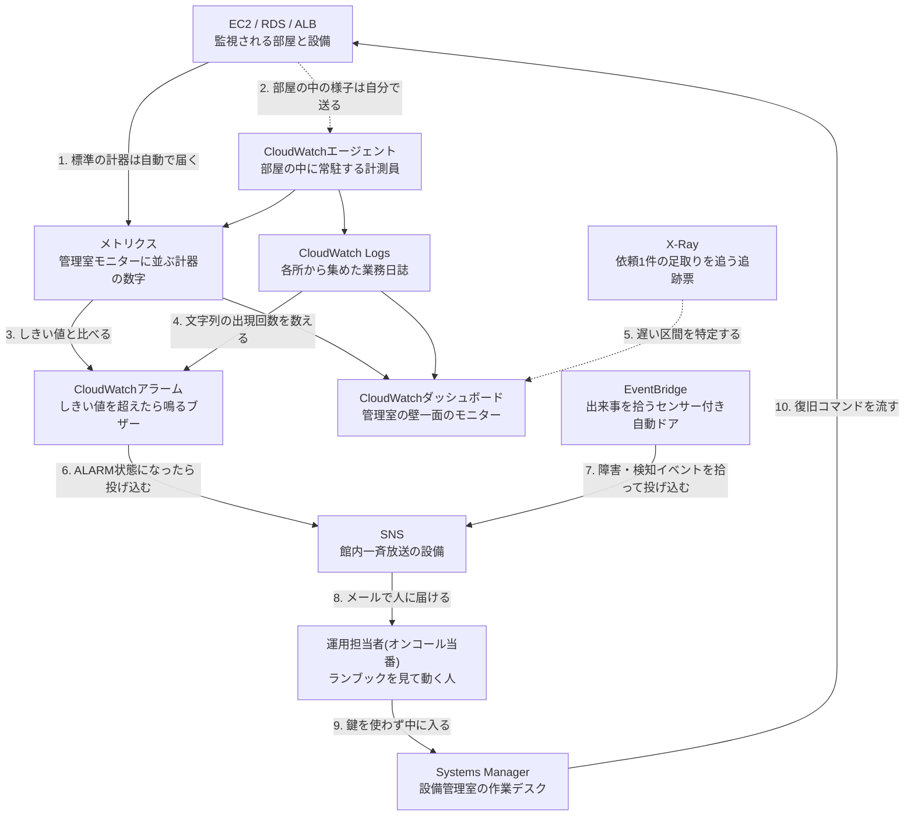

# AWS用語集 ⑦監視・運用

> 📖 [用語集トップ(索引)に戻る](../02-glossary.md) ｜ [← 前: ⑥セキュリティ・ID管理](06-security-identity.md) ｜ [次: ⑧IaCとCI/CD →](08-iac-cicd.md)

## この章で扱う範囲

この章は「作ったあと」の話です。サーバーは構築した瞬間が完成ではなく、そこから何年も動き続ける必要があります。CPUが張り付いた、ディスクが埋まった、深夜にサイトが落ちた——そういう出来事に**気づき・伝え・直す**ための用語をまとめたページです。

前半の[7-1](#7-1-監視の基本用語)〜[7-4](#7-4-アラームと可視化)では、AWSの監視の中心である**Amazon CloudWatch**を、「メトリクス(数値)」「ログ(文字)」「アラーム(判定)」の3つに分解して整理します。ここは初心者が最も混乱するところなので、名前空間・ディメンション・統計・期間・評価期間という「アラームを1つ作るために必ず埋める5つの欄」を、ひとつずつ丁寧に説明します。[7-5](#7-5-通知とイベント連携)では、気づいた異常を人間に届ける**Amazon SNS**と、AWS内の出来事を拾って処理をつなぐ**Amazon EventBridge**を扱います。[7-6](#7-6-サーバー運用の自動化systems-manager)は、鍵を使わずにサーバーへ入り、コマンドを流し、パッチを当てるための**AWS Systems Manager**です。最後の[7-7](#7-7-運用現場の共通語彙)は、SLO・MTTR・ランブック・オンコールといった、AWSの機能名ではないけれど運用現場で毎日飛び交う言葉を押さえます。

具体的には、[レベル2: EC2で自分のWebサーバーを構築する](../../projects/02-ec2-web-server/README.md)でSession Managerを使って鍵なしでサーバーに入る場面、[レベル4: 本番運用を想定したWordPress環境構築](../../projects/04-wordpress-production/README.md)でCloudWatchアラームとSNSを組み合わせてメール通知を作る場面、[レベル5: セキュアな監視・ガバナンス基盤の構築](../../projects/05-security-monitoring/README.md)でGuardDutyの検知をEventBridge経由でSNSに流す場面で、ここの用語がそのまま登場します。



> 🧠 **覚え方のコツ**: 監視は「**計る → 気づく → 伝える → 直す**」の4段構えです。計器を読む係が[CloudWatch](#cloudwatch)、しきい値を超えたら鳴らす見張り番が[CloudWatchアラーム](#cloudwatchアラーム)、館内放送で人を呼ぶ伝令が[SNS](#sns)、呼ばれた人が中に入って作業する通用口が[Session Manager](#session-manager)です。この4役のうち1つでも欠けると監視は成立しません。「計器・ブザー・放送・通用口」と唱えて覚えてください。

## この章の用語ミニ索引

| 用語 | ひとことで言うと |
|---|---|
| [CloudWatch](#cloudwatch) | AWSリソースの数値とログを集めて監視する、ビルの管理室 |
| [オブザーバビリティ](#オブザーバビリティ) | メトリクス・ログ・トレースから「なぜ起きたか」まで追える状態 |
| [死活監視](#死活監視) | サービスが生きているかを外側から定期的に確かめる監視 |
| [しきい値](#しきい値) | 「ここを超えたら異常」と決めておく境目の数値 |
| [X-Ray](#x-ray) | 1件のリクエストがどこで時間を使ったかを追跡する仕組み |
| [AWS Health](#aws-health) | AWS側の障害や計画メンテを自分のアカウント視点で知らせる窓口 |
| [Trusted Advisor](#trusted-advisor) | コストやセキュリティをAWSが自動点検して助言してくれる仕組み |
| [メトリクス](#メトリクス) | 時刻とセットで記録される、監視のための数値データ |
| [名前空間](#名前空間) | メトリクスをサービスごとに分ける、いちばん外側の入れ物 |
| [ディメンション](#ディメンション) | 「どのインスタンスの数値か」を特定する名前と値の組 |
| [統計](#統計) | 期間内に集まった複数の値を1つにまとめる計算方法 |
| [期間](#期間) | メトリクスを1つの点に集約する時間の幅 |
| [詳細モニタリング](#詳細モニタリング) | EC2のメトリクス取得間隔を5分から1分に上げる有料オプション |
| [カスタムメトリクス](#カスタムメトリクス) | AWS標準では取れない数値を、自分でCloudWatchへ送ったもの |
| [CloudWatchエージェント](#cloudwatchエージェント) | OSの中のメモリ・ディスク・ログを収集して送り出すソフト |
| [CPUUtilization](#cpuutilization) | EC2などのCPU使用率を表す、最も基本的なメトリクス |
| [FreeStorageSpace](#freestoragespace) | RDSの空きストレージ容量をバイト単位で表すメトリクス |
| [HTTPCode_Target_5XX_Count](#httpcode_target_5xx_count) | ALBの背後のサーバーが返したサーバーエラーの件数 |
| [EstimatedCharges](#estimatedcharges) | 当月の推定請求額を表す、請求監視専用のメトリクス |
| [CloudWatch Logs](#cloudwatch-logs) | サーバーやサービスのログを1か所に集めて保管・検索する場所 |
| [ロググループ](#ロググループ) | ログを用途ごとにまとめる引き出し。保持期間はここで決める |
| [ログストリーム](#ログストリーム) | 1つの送信元から届く、時系列に並んだログの1本の流れ |
| [Logs Insights](#logs-insights) | 集めたログを専用のクエリ言語で集計・検索する機能 |
| [CloudWatchアラーム](#cloudwatchアラーム) | メトリクスがしきい値を超えたら通知や自動対処を起こす見張り番 |
| [評価期間](#評価期間) | 何回ぶんのデータを見て異常と判定するかを決める回数 |
| [複合アラーム](#複合アラーム) | 複数のアラームを条件式で束ね、通知の数を減らす親アラーム |
| [CloudWatchダッシュボード](#cloudwatchダッシュボード) | 見たいグラフを1画面に並べた、自作の管理室モニター |
| [SNS](#sns) | 1回の投げ込みを複数の宛先へ同時に配る、通知の一斉放送設備 |
| [トピック](#トピック) | SNSで宛先をまとめる、放送チャンネルにあたる単位 |
| [サブスクリプション](#サブスクリプション) | トピックの放送を受け取る側の登録(メールアドレスなど) |
| [トピックポリシー](#トピックポリシー) | 誰がそのトピックへ投げ込んでよいかを定める、受け手側の許可 |
| [SQS](#sqs) | 処理待ちのメッセージを順番に貯めておく、マネージドな行列 |
| [EventBridge](#eventbridge) | AWS内外の出来事を拾って別の処理へ受け渡す、イベントの中継所 |
| [イベントバス](#イベントバス) | イベントが流れ込む共有のレール。既定・カスタム・パートナーの3種 |
| [EventBridgeルール](#eventbridgeルール) | どのイベントをどこへ渡すかを決める1本の配線 |
| [イベントパターン](#イベントパターン) | 拾いたいイベントの条件をJSONで書いたフィルター |
| [Systems Manager](#systems-manager) | サーバーの運用作業をまとめて行う、AWSの運用管理ツール群 |
| [Session Manager](#session-manager) | 鍵も22番ポートも使わずにサーバーの中へ入れる接続機能 |
| [AmazonSSMManagedInstanceCore](#amazonssmmanagedinstancecore) | Systems Managerで管理されるための最低限の権限を与える管理ポリシー |
| [Run Command](#run-command) | 多数のサーバーへ同じコマンドを一斉に流して実行する機能 |
| [Patch Manager](#patch-manager) | OSやソフトの更新プログラムの適用を、定期実行で回す機能 |
| [State Manager](#state-manager) | 「常にこの状態であれ」を定期的に強制し、ズレを直し続ける機能 |
| [SLI](#sli) | サービスの品質を測るために選んだ、具体的な指標 |
| [SLO](#slo) | そのSLIをどの水準まで満たすかという、自分たちで決める目標値 |
| [MTTR](#mttr) | 障害が起きてから復旧するまでにかかった時間の平均 |
| [ランブック](#ランブック) | 「この障害が出たらこう動く」を、誰でも実行できる手順書にしたもの |
| [オンコール](#オンコール) | 障害発生時に呼び出しを受ける、当番制の対応体制 |

## 7-1. 監視の基本用語

### CloudWatch

**正式名称**: Amazon CloudWatch ｜ **読み方**: クラウドウォッチ ｜ **重要度**: ★★★

**ひとことで言うと**: AWSのリソースやアプリケーションから、数値(メトリクス)とログを集めて保存し、グラフにしたり、異常を検知して知らせたりしてくれる監視サービスです。

**たとえるなら**: ビル全体の「管理室のモニター」です。各階の温度計・電気メーター・人の出入りといった計器の数字が1か所に集まってきて、管理人はそこに座ったまま建物全体の様子を把握できます。異常な数字が出たらブザーが鳴る仕掛けも、この管理室に組み込まれています。

**もう少し詳しく**: CloudWatchは大きく3つの機能のかたまりでできています。1つ目が数値を扱う[メトリクス](#メトリクス)、2つ目が文字列を扱う[CloudWatch Logs](#cloudwatch-logs)、3つ目が「メトリクスが基準を超えたら知らせる」判定役の[CloudWatchアラーム](#cloudwatchアラーム)です。EC2やRDS、ALBといった主要なサービスは、**特別な設定をしなくても標準のメトリクスをCloudWatchに送っています**。一方、OSの中のメモリ使用率やアプリのログは、[CloudWatchエージェント](#cloudwatchエージェント)を入れないと届きません。この「勝手に来るもの」と「自分で送らないと来ないもの」の境目を理解することが、CloudWatchを使いこなす第一歩です。集めた数値やログは[CloudWatchダッシュボード](#cloudwatchダッシュボード)に並べて可視化し、異常時は[SNS](#sns)経由でメールに飛ばす、というのが典型的な組み立て方になります。

**サーバー構築での勘所**:
- CloudWatchは**リージョンごとに独立**しています。東京リージョンで作ったアラームは、東京リージョンのメトリクスしか見られません。CloudFrontのメトリクスや[EstimatedCharges](#estimatedcharges)のようにバージニア北部(`us-east-1`)にしか存在しないものがあるので、「アラームを作ったのに対象メトリクスが選択肢に出てこない」ときは、まず画面右上のリージョン表示を疑ってください。
- ✅ 監視は「作って終わり」にせず、**通知が実際に届くところまで必ずテスト**します。CLIの `aws cloudwatch set-alarm-state` でアラームを一時的に `ALARM` 状態にすると(コンソールにこの操作用のボタンはありません)、本物の障害を起こさずに通知経路を確認できます。状態は次の判定ですぐ元に戻るので、結果はアラームの「履歴」タブで確認します。
- 監視項目を増やしすぎると、誰も見ないグラフと誰も反応しないメールが増えるだけです。まずは「これが壊れたらサービスが止まる」という箇所に絞り、[レベル4](../../projects/04-wordpress-production/README.md)で扱う3点(EC2のCPU・RDSの空き容量・ALBの5xxエラー)から始めるのが現実的です。

**よくあるつまずき**: 「CloudWatchを有効化する」というスイッチを探してしまいがちですが、標準メトリクスの収集に有効化の操作は不要です。逆に、メモリ使用率やアプリログは有効化云々ではなく**エージェントの導入という別作業**が必要です。

**💰 コスト**: 標準メトリクスの収集自体は無料です。課金されるのは主に[カスタムメトリクス](#カスタムメトリクス)の数、[CloudWatchアラーム](#cloudwatchアラーム)の数、[CloudWatch Logs](#cloudwatch-logs)に取り込んだデータ量、[CloudWatchダッシュボード](#cloudwatchダッシュボード)の数です。無料利用枠に一定数のアラーム・カスタムメトリクス・ログ取り込み量が含まれていますので、学習用途なら数十円〜数百円/月に収まることがほとんどです。最新の料金・無料利用枠の条件は必ず公式ページで確認してください([Amazon CloudWatchの料金](https://aws.amazon.com/jp/cloudwatch/pricing/) / [AWS無料利用枠](https://aws.amazon.com/jp/free/))。

**関連用語**: [メトリクス](#メトリクス)、[CloudWatch Logs](#cloudwatch-logs)、[CloudWatchアラーム](#cloudwatchアラーム)、[CloudWatchエージェント](#cloudwatchエージェント)、[オブザーバビリティ](#オブザーバビリティ)

**登場する案件**: [レベル4: 本番運用を想定したWordPress環境構築](../../projects/04-wordpress-production/README.md)、[レベル5: セキュアな監視・ガバナンス基盤の構築](../../projects/05-security-monitoring/README.md)

### オブザーバビリティ

**正式名称**: Observability(可観測性) ｜ **読み方**: オブザーバビリティ ｜ **重要度**: ★★

**ひとことで言うと**: 外から観測できる情報だけを頼りに、システムの内部で何が起きているかを説明できる状態のことです。

**たとえるなら**: 管理室のモニターだけを見ながら「3階の空調が止まっている原因は、2階の分電盤のブレーカーが落ちたからだ」とまで言い当てられる状態です。単に「3階が暑い」と気づけるだけの状態(監視)から一歩進んで、**原因までたどれる**ようになっているのがオブザーバビリティです。

**もう少し詳しく**: 一般に、オブザーバビリティは3つの情報源(3本柱)で語られます。**メトリクス**(数値。いつ・どのくらい異常か)、**ログ**(文字。そのとき何が起きたか)、**トレース**(1件のリクエストが、どのサービスを何ミリ秒かけて通ったか)です。AWSではそれぞれ[メトリクス](#メトリクス)、[CloudWatch Logs](#cloudwatch-logs)、[X-Ray](#x-ray)が担当します。従来の「監視(モニタリング)」が**あらかじめ想定した異常に気づく**ことを目的にしているのに対し、オブザーバビリティは**想定していなかった異常の原因を後から追える**ことを目的にしている、という違いで説明されることが多い言葉です。

**サーバー構築での勘所**:
- 面接で「監視とオブザーバビリティの違いは?」と聞かれたら、「監視は**想定した障害に気づく**仕組み、オブザーバビリティは**想定外の障害でも原因を追える**状態」と答えられれば十分です。
- 初心者のうちは3本柱をすべて揃える必要はありません。まず**メトリクスとログの2本**を確実に集め、アプリケーションが複数サービスにまたがるようになってからトレースを検討する、という順番が現実的です。
- ✅ ログを集めるときは「後から原因を追える形か」を意識してください。リクエストIDやユーザーIDのような**串刺しで追える識別子**がログに含まれていないと、いくら大量にログを集めても原因追跡には使えません。

**関連用語**: [CloudWatch](#cloudwatch)、[メトリクス](#メトリクス)、[CloudWatch Logs](#cloudwatch-logs)、[X-Ray](#x-ray)、[死活監視](#死活監視)

### 死活監視

**読み方**: しかつかんし ｜ **重要度**: ★★★

**ひとことで言うと**: サーバーやサービスが「生きているか、死んでいるか」だけを、外側から定期的に確かめる最も基本的な監視です。

**たとえるなら**: 管理人が定期的に各部屋のドアをノックして、「はい」と返事があるかどうかだけを確認して回る見回りです。中で何をしているかまでは分かりませんが、返事がなければ何かがおかしいと即座に分かります。

**もう少し詳しく**: 死活監視の実装方法はいくつかの層に分かれます。ネットワーク層では `ping` の応答、トランスポート層ではTCPの特定ポートに接続できるか、アプリケーション層では「HTTPで `/health.html` にアクセスして200が返るか」を確認します。**上の層になるほど、実際の利用者体験に近い判定**ができます。AWSでは、[ALB](02-network.md#alb)の[ヘルスチェック](02-network.md#ヘルスチェック)が「振り分け先として使ってよいか」の死活監視、[Route 53](02-network.md#route-53)のヘルスチェックが「そもそもこのサイトに到達できるか」の外形監視、[EC2](03-compute.md#ec2)のステータスチェック(`StatusCheckFailed`)が「インスタンスとホスト基盤が正常か」の死活監視を担当しています。

**サーバー構築での勘所**:
- ⚠️ 死活監視のURLは、**アプリケーションが本当に動いていることを表すもの**にしてください。Webサーバー(Apacheなど)が静的ファイルを返すだけの `/health.html` は「Apacheは生きている」ことしか保証しません。DBに接続できなくなっても200を返し続けるため、[レベル3](../../projects/03-ha-three-tier/README.md)のような3層構成では、いずれ「DBを見に行くヘルスチェック用ページ」への発展を検討します。
- 死活監視の間隔としきい値は「早すぎる判定」と「遅すぎる判定」のバランスです。間隔を短くしすぎると、一瞬の遅延で正常なサーバーを切り離してしまいます。ALBのヘルスチェックは、まず既定値で運用し、誤検知が出てから調整するのが安全です。
- ✅ AWS内部からの監視だけでは「AWSの外からサイトに到達できない」障害に気づけません。CloudWatch Syntheticsのカナリア(定期的に本物のブラウザ操作を再現して外形監視を行う機能)やRoute 53ヘルスチェックのような、**外側からの監視**を1つ持っておくと安心です。

**関連用語**: [ヘルスチェック](02-network.md#ヘルスチェック)、[CloudWatchアラーム](#cloudwatchアラーム)、[SLI](#sli)、[オブザーバビリティ](#オブザーバビリティ)

**登場する案件**: [レベル3: 可用性を高めた3層Webシステム構築](../../projects/03-ha-three-tier/README.md)

### しきい値

**正式名称**: Threshold ｜ **読み方**: しきいち ｜ **重要度**: ★★★

**ひとことで言うと**: 「ここを超えたら異常とみなす」とあらかじめ決めておく境目の数値です。

**たとえるなら**: 部屋の温度計に貼った赤いテープです。テープの位置(=しきい値)を超えたらブザーを鳴らす、という約束を先に決めておくことで、管理人が数字を四六時中にらんでいなくてもよくなります。

**もう少し詳しく**: しきい値は[CloudWatchアラーム](#cloudwatchアラーム)を作るときに必ず入力する項目で、**比較演算子**(より大きい / 以上 / より小さい / 以下)とセットで意味を持ちます。たとえば「CPU使用率が80より大きい」「RDSの空き容量が2GiB未満」といった具合です。しきい値の決め方には大きく2通りあり、1つは「これを超えたらサービスに影響が出る」という**技術的な限界から決める方法**(ディスク空き容量など)、もう1つは「平常時はだいたいこのくらい」という**過去の実績から決める方法**(CPU使用率など)です。後者は、まず1〜2週間グラフを眺めてから決めるのが失敗しにくい進め方です。CloudWatchには実績から自動でしきい値の帯を作る異常検出(Anomaly Detection)という機能もあります。

**サーバー構築での勘所**:
- ⚠️ しきい値は単位を必ず確認してください。[FreeStorageSpace](#freestoragespace)は**バイト単位**なので、「2GiB」のつもりで `2` と入力すると「2バイト未満」という永遠に鳴らないアラームができあがります。
- しきい値だけでなく、[期間](#期間)と[評価期間](#評価期間)をセットで決めます。「80%を1回超えた瞬間」ではなく「5分平均で80%超が2回連続」のように設計すると、一瞬のスパイク(瞬間的な急上昇)で夜中に起こされずに済みます。
- ✅ しきい値には「これを超えたら人を起こす値」と「これを超えたら日中に調べる値」の2段階を用意すると運用が楽になります。前者だけにすると通知が遅れ、後者だけにすると通知が多すぎて誰も読まなくなります。
- 表記について、本ポートフォリオでは「しきい値」に統一しています(AWSのコンソール表示も「しきい値」です)。

**関連用語**: [CloudWatchアラーム](#cloudwatchアラーム)、[評価期間](#評価期間)、[期間](#期間)、[統計](#統計)、[AWS Budgets](01-cloud-basics.md#aws-budgets)

**登場する案件**: [レベル4: 本番運用を想定したWordPress環境構築](../../projects/04-wordpress-production/README.md)

### X-Ray

**正式名称**: AWS X-Ray ｜ **読み方**: エックスレイ ｜ **重要度**: ★

**ひとことで言うと**: 1件のリクエストがどのサービスを通り、どこで何ミリ秒かかったのかを追跡して、遅い箇所や失敗した箇所を可視化する分散トレーシングのサービスです。

**たとえるなら**: 建物の中を歩いた1人の来客に付ける「行動追跡票」です。受付で3分、エレベーター待ちで30秒、応接室で20分——と各地点の滞在時間が記録されるので、「この人が長くかかったのは応接室が原因だ」と一目で分かります。

**もう少し詳しく**: X-Rayでは、1件のリクエスト全体を**トレース**、その中の1区間(ALBでの処理、EC2上のアプリ処理、RDSへのクエリなど)を**セグメント/サブセグメント**と呼びます。集まったトレースからサービス同士の呼び出し関係を図にしたものが**サービスマップ**で、遅延やエラー率が高いノードが色で強調されます。利用するにはアプリケーションにSDKを組み込むか、AWS Distro for OpenTelemetryなどの計装(アプリケーションに計測用のコードや仕組みを組み込むこと)が必要で、EC2上で使う場合はX-Rayデーモン(トレースデータをX-Rayへ転送する常駐プログラム)を動かします。全リクエストを記録するとコストが膨らむため、**サンプリングルール**で一部だけを記録するのが基本です。

**サーバー構築での勘所**:
- インフラ担当としては「サイトが遅い」という報告に対し、**ALB・EC2・RDSのどこが遅いのか**を切り分けられることに価値があります。X-Rayがなければ、各層のメトリクスとログを突き合わせて推測するしかありません。
- 本ポートフォリオの案件では直接は使いませんが、面接で「アプリが遅いときの調査手順」を聞かれた際に、「メトリクスで層を絞り、ログで事象を確認し、必要ならX-Rayでリクエスト単位に追う」と答えられると、[オブザーバビリティ](#オブザーバビリティ)を理解していることが伝わります。

**💰 コスト**: 記録したトレース数と、取得・スキャンしたトレース数に応じた従量課金です。毎月の無料利用枠が用意されています。最新の料金・無料利用枠の条件は必ず公式ページで確認してください([AWS無料利用枠](https://aws.amazon.com/jp/free/))。

**関連用語**: [オブザーバビリティ](#オブザーバビリティ)、[CloudWatch](#cloudwatch)、[Logs Insights](#logs-insights)

### AWS Health

**正式名称**: AWS Health / AWS Health Dashboard ｜ **読み方**: エーダブリューエス ヘルス ｜ **重要度**: ★★

**ひとことで言うと**: AWS側で起きている障害や、これから実施される計画メンテナンスのうち、**自分のアカウントに関係するものだけ**を教えてくれる公式の通知窓口です。

**たとえるなら**: マンションの管理会社から届く「〇月〇日にお住まいの棟で断水があります」というお知らせです。全国のお知らせ一覧ではなく、自分の部屋に関係する情報だけが届くところがポイントです。

**もう少し詳しく**: AWS Health Dashboardには2つの面があります。1つは誰でも見られる**サービス全体の稼働状況**、もう1つはサインインした状態で見られる**自分のアカウント固有のイベント**です。後者には「あなたが使っているEC2インスタンス `i-xxxx` が基盤メンテナンスのため再起動されます」「使用中のRDSの証明書更新期限が近づいています」といった、具体的なリソースIDを伴った通知が並びます。これらのイベントは[EventBridge](#eventbridge)にも `aws.health` という送信元で流れてくるため、[EventBridgeルール](#eventbridgeルール)で拾って[SNS](#sns)に転送すれば、ダッシュボードを見に行かなくてもメールで受け取れます。なお、プログラムから取得するAWS Health APIの利用は、有料のサポートプラン(現行では Business Support+ 以上。旧 Developer / Business / Enterprise On-Ramp は2027年1月1日で提供終了予定)が条件になります。プラン名や条件は改定されることがあるため、最新は[AWS Support のプラン](https://aws.amazon.com/jp/premiumsupport/plans/)で確認してください。

**サーバー構築での勘所**:
- 「自分の設定は変えていないのに、ある日を境に挙動が変わった」という場面では、**まずAWS Healthを確認**します。AWS側の計画メンテナンスやリタイア通知(基盤の老朽化に伴うインスタンスの停止予告)が原因のことがあります。
- ✅ EC2の「インスタンスリタイア」通知は見落とすと、予告日時に**EBSバックドなら強制停止、インスタンスストアバックドなら強制終了(インスタンスストア上のデータは消失)**となります。EventBridge経由でメール通知するルールを1本作っておくと安全です。
- 障害報告を上司や顧客に説明するとき、「AWS Healthに該当イベントが出ている/出ていない」は、自分たちの設定ミスかAWS側の事象かを切り分ける有力な材料になります。

**関連用語**: [EventBridge](#eventbridge)、[SNS](#sns)、[Trusted Advisor](#trusted-advisor)、[SLA](01-cloud-basics.md#sla)

### Trusted Advisor

**正式名称**: AWS Trusted Advisor ｜ **読み方**: トラステッドアドバイザー ｜ **重要度**: ★★

**ひとことで言うと**: 自分のAWSアカウントを、AWSがベストプラクティスに照らして自動点検し、「ここが危ない」「ここは無駄遣いです」と指摘してくれる仕組みです。

**たとえるなら**: 建物を巡回して回る「第三者の設備点検士」です。管理人(自分)が毎日見ていて気づかなくなっている問題——使っていない部屋の電気がついている、非常口の鍵が開けっぱなし——を、外の目でチェックリストに沿って洗い出してくれます。

**もう少し詳しく**: 点検の観点は、コスト最適化・パフォーマンス・セキュリティ・耐障害性・サービスクォータ(上限値)などのカテゴリに分かれています。たとえば「稼働率の低いEC2インスタンスがある」「アタッチされていない[Elastic IP](02-network.md#elastic-ip)がある」「[セキュリティグループ](02-network.md#セキュリティグループ)で特定ポートが全世界に開放されている」「[MFA](06-security-identity.md#mfa)が有効になっていないルートユーザーがある」といった指摘が並びます。**利用できるチェック項目はサポートプランによって異なり**、無料のベーシックプランではサービスクォータと一部のセキュリティチェックに限定されます。Business Support+ 以上のプランでは全チェックが使えるようになり、[EventBridge](#eventbridge)経由での通知やAPI経由の取得も可能になります。

**サーバー構築での勘所**:
- ✅ 学習用アカウントでも、ベーシックプランで見られる範囲だけは月に一度眺める習慣をつけてください。**消し忘れリソースの発見**という意味で、コスト事故の予防に直結します。
- 指摘をすべて直す必要はありません。「なぜその指摘が出ているか」を理解し、対応する/しないを判断して記録に残すことが、[Well-Architected Framework](01-cloud-basics.md#well-architected-framework)的な運用です。
- Trusted Advisorは「点検」であって「監視」ではありません。リアルタイムの異常検知は[CloudWatchアラーム](#cloudwatchアラーム)や[GuardDuty](06-security-identity.md#guardduty)の役割で、両者は役割が違うと整理しておくと混乱しません。

**関連用語**: [AWS Health](#aws-health)、[サービスクォータ](01-cloud-basics.md#サービスクォータ)、[Well-Architected Framework](01-cloud-basics.md#well-architected-framework)、[AWS Config](06-security-identity.md#aws-config)

## 7-2. CloudWatchのメトリクス

### メトリクス

**正式名称**: Metric ｜ **読み方**: メトリクス ｜ **重要度**: ★★★

**ひとことで言うと**: 「いつ・いくつだったか」という時刻と数値の組を、時系列に並べて記録したものです。CPU使用率やリクエスト件数など、監視の土台になるデータです。

**たとえるなら**: 管理室モニターに表示される「個々の計器の数字」です。温度計、電力計、水道メーター——それぞれが1つのメトリクスで、時間とともに針が動いた記録が残っていきます。

**もう少し詳しく**: CloudWatchのメトリクスは、[名前空間](#名前空間)・メトリクス名・[ディメンション](#ディメンション)の3点セットで**一意に特定**されます。たとえば「名前空間 `AWS/EC2`、メトリクス名 `CPUUtilization`、ディメンション `InstanceId=i-0abc...`」で、特定の1台のCPU使用率を指します。同じ `CPUUtilization` でもディメンションが `AutoScalingGroupName=web-asg` なら、そのAuto Scaling Group全体の値になります。**データは古くなるほど粗い粒度にまとめられ**、1分粒度のデータは15日程度、5分粒度は63日程度、1時間粒度は15か月程度で消えていく、という段階的な保持になっています(正確な保持期間は[CloudWatchの概念](https://docs.aws.amazon.com/AmazonCloudWatch/latest/monitoring/cloudwatch_concepts.html)で確認してください)。長期の分析が必要な数値は、別途エクスポートして保管する設計を検討します。

**サーバー構築での勘所**:
- ⚠️ **EC2の標準メトリクスにメモリ使用率とディスク使用率は含まれません**。CloudWatchはEC2を外側(ハイパーバイザー側)から見ているため、OSの中の情報は見えないからです。これらが必要な場合は[CloudWatchエージェント](#cloudwatchエージェント)の導入が必須です。面接でも頻出の論点です。
- メトリクスは**存在しない期間のデータ点が単に無い**(0ではない)という点に注意してください。停止中のEC2はデータを送らないため、グラフは0ではなく途切れます。この違いが[CloudWatchアラーム](#cloudwatchアラーム)の「欠落データの処理」設定に効いてきます。
- ✅ アラームを作る前に、まず対象メトリクスを1〜2週間グラフで眺めてください。平常時の形が分かって初めて、意味のある[しきい値](#しきい値)が決められます。

**💰 コスト**: AWSサービスが自動で発行する標準メトリクスの保存・閲覧は無料です。自分で送る[カスタムメトリクス](#カスタムメトリクス)は、メトリクス数に応じた月額課金になります。最新の料金・無料利用枠の条件は必ず公式ページで確認してください([Amazon CloudWatchの料金](https://aws.amazon.com/jp/cloudwatch/pricing/))。

**関連用語**: [名前空間](#名前空間)、[ディメンション](#ディメンション)、[統計](#統計)、[期間](#期間)、[CloudWatchアラーム](#cloudwatchアラーム)

**登場する案件**: [レベル4: 本番運用を想定したWordPress環境構築](../../projects/04-wordpress-production/README.md)

### 名前空間

**正式名称**: Namespace ｜ **読み方**: なまえくうかん ｜ **重要度**: ★★

**ひとことで言うと**: メトリクスをサービスごとに分けて入れておく、いちばん外側の入れ物です。

**たとえるなら**: 管理室の計器盤に貼られた「空調系」「電気系」「給排水系」というラベルです。同じ「温度」という計器でも、空調系の温度と給湯系の温度は別物なので、まず盤ごとに区切っておく、という発想です。

**もう少し詳しく**: AWSサービスが発行するメトリクスの名前空間は `AWS/` で始まる決まった名前になっています。代表例は、EC2が `AWS/EC2`、RDSが `AWS/RDS`、ALBが `AWS/ApplicationELB`、Auto Scalingが `AWS/AutoScaling`、CloudWatch Logsが `AWS/Logs`、請求が `AWS/Billing` です。**名前空間が違えばメトリクスは完全に別物**として扱われ、コンソールの一覧でも別々の階層に並びます。ただし比較や合成が必要なら、ダッシュボードのグラフに重ねる、あるいはメトリクス計算(Metric Math。複数のメトリクスを式で組み合わせる機能)で名前空間をまたいだ式を組む、という方法があります。自分でメトリクスを送るときは `AWS/` で始まらない任意の名前(たとえば `CWAgent` や `MyApp/Web`)を付けます。[CloudWatchエージェント](#cloudwatchエージェント)が既定で使う名前空間は `CWAgent` です。

**サーバー構築での勘所**:
- CLIで[CloudWatchアラーム](#cloudwatchアラーム)を作るときは `--namespace "AWS/EC2"` のように必ず指定します。ここを間違えると、メトリクス名が正しくても存在しないメトリクスを指してしまい、アラームが `INSUFFICIENT_DATA` から動かなくなります。
- ✅ カスタムメトリクスの名前空間は、**システム単位やチーム単位で命名規則を決めて**から使い始めてください。後から名前空間を変えると、既存のアラームやダッシュボードをすべて作り直すことになります。

**関連用語**: [メトリクス](#メトリクス)、[ディメンション](#ディメンション)、[カスタムメトリクス](#カスタムメトリクス)、[CloudWatchエージェント](#cloudwatchエージェント)

### ディメンション

**正式名称**: Dimension ｜ **読み方**: ディメンション ｜ **重要度**: ★★★

**ひとことで言うと**: 「その数値がどのリソースのものか」を特定するための、名前と値の組です。

**たとえるなら**: 計器に貼られた「103号室」「B棟エレベーター」という部屋番号のシールです。同じ「温度」でも、シールがなければどこの温度なのか分かりません。

**もう少し詳しく**: ディメンションは `InstanceId=i-0abc1234`、`DBInstanceIdentifier=wordpress-db`、`AutoScalingGroupName=web-asg`、`LoadBalancer=app/my-alb/xxxx` のような形をしています。**ディメンションの組み合わせが1つでも違えば、それは別のメトリクス**として扱われます。ここが最も間違えやすいところで、たとえば `CPUUtilization` に `InstanceId` を指定すればそのインスタンス1台の値、`AutoScalingGroupName` を指定すればグループ全体の平均値になり、両者はまったく別のメトリクスです。1つのメトリクスに付けられるディメンションの数には上限がありますので、詳細は[CloudWatchの概念](https://docs.aws.amazon.com/AmazonCloudWatch/latest/monitoring/cloudwatch_concepts.html)を確認してください。

**サーバー構築での勘所**:
- ⚠️ [Auto Scaling Group](03-compute.md#auto-scaling-group)を使う構成では、**アラームのディメンションを `InstanceId` にしてはいけません**。スケールインでそのインスタンスが消えると、アラームは監視対象を失って永久に `INSUFFICIENT_DATA` になります。`AutoScalingGroupName` を指定して「グループ全体の平均CPU」を監視するのが正解です。[レベル4](../../projects/04-wordpress-production/README.md)のアラーム設計もこの考え方に従っています。
- ✅ AWSサービスの名前空間(`AWS/EC2` など)では、ディメンションを指定せずに検索すると「全インスタンスを集約した値」が返ります。コンソールのメトリクス画面でEC2の下に出てくる「Across All Instances(すべてのインスタンス全体)」がこれです。ただしこの集約に含まれるのは[詳細モニタリング](#詳細モニタリング)を有効にしたインスタンスだけで、しかも「どの1台が高いのか」は分かりません。逆に自分で送る[カスタムメトリクス](#カスタムメトリクス)の名前空間では、ディメンションを完全に一致させないとメトリクスは見つかりません。いずれにせよアラームを作るときは、必ずディメンションの階層をたどって目的の1行を選んでください。
- ALBのメトリクスは `LoadBalancer` だけを指定するか、`TargetGroup` も併せて指定するかで意味が変わります。「ALB全体の5xx」なのか「特定ターゲットグループの5xx」なのかを意識して選びます。

**関連用語**: [メトリクス](#メトリクス)、[名前空間](#名前空間)、[CloudWatchアラーム](#cloudwatchアラーム)、[Auto Scaling Group](03-compute.md#auto-scaling-group)

**登場する案件**: [レベル4: 本番運用を想定したWordPress環境構築](../../projects/04-wordpress-production/README.md)

### 統計

**正式名称**: Statistic ｜ **読み方**: とうけい ｜ **重要度**: ★★★

**ひとことで言うと**: 1つの[期間](#期間)の中に集まった複数の値を、1つの代表値にまとめる計算方法です。平均・合計・最大・最小などがあります。

**たとえるなら**: 1時間分の温度計の記録を「平均は22度でした」とまとめるか、「最高は35度でした」とまとめるかの違いです。同じ記録でも、まとめ方によってまったく違う結論になります。

**もう少し詳しく**: CloudWatchで選べる主な統計は、`Average`(平均)、`Sum`(合計)、`Minimum`(最小)、`Maximum`(最大)、`SampleCount`(データ点の数)、そして `p90` `p99` のようなパーセンタイル(全体を小さい順に並べたとき、下から何%の位置にあるかを示す値)です。**メトリクスの性質によって、意味のある統計は決まっています**。CPU使用率のような「率」は `Average` か `Maximum`、リクエスト件数やエラー件数のような「カウント」は `Sum`、レスポンス時間は `Average` に加えて `p99`(遅い1%がどれだけ遅いか)を見る、というのが定石です。件数のメトリクスに `Average` を使うと「1データ点あたりの平均件数」という直感に反する値になり、しきい値の意味が分からなくなります。

**サーバー構築での勘所**:
- ⚠️ [HTTPCode_Target_5XX_Count](#httpcode_target_5xx_count) のような**件数系メトリクスは必ず `Sum`** を選んでください。`Average` のままだと「5分間で10件」というしきい値が機能しません。CLIでは `--statistic Sum` を明示します。
- CPU使用率で `Average` と `Maximum` のどちらを使うかは、目的次第です。「グループ全体が慢性的に高負荷か」を見るなら `Average`、「どれか1台が張り付いていないか」を見るなら `Maximum` が向いています。
- ✅ レスポンス時間の監視は平均だけでは不十分です。平均が0.2秒でも、`p99` が10秒なら100人に1人は10秒待たされています。利用者体験に近いのはパーセンタイルのほうです。

**関連用語**: [期間](#期間)、[しきい値](#しきい値)、[CloudWatchアラーム](#cloudwatchアラーム)、[メトリクス](#メトリクス)、[SLI](#sli)

### 期間

**正式名称**: Period ｜ **読み方**: きかん ｜ **重要度**: ★★★

**ひとことで言うと**: メトリクスを1つの点に集約する時間の幅です。「5分」を選べば、5分ぶんのデータが[統計](#統計)によって1つの値にまとめられます。

**たとえるなら**: 温度計の記録を「1分ごとに1行」書くか「5分ごとに1行」書くかというノートの取り方です。細かく書けば急な変化を見逃しませんが、ノートは早く埋まりますし、書く手間も増えます。

**もう少し詳しく**: 期間は60秒(1分)の倍数で指定するのが基本で、5分(300秒)、15分(900秒)などがよく使われます。1分未満を指定できるのは**高解像度メトリクス**として送信されたものに限られます。データの読み出し(`GetMetricStatistics` など)では1秒・5秒・10秒・30秒、**アラームの期間としては10秒・20秒・30秒**が指定でき、後者は高解像度アラームとして単価も変わります(`--period 5` でアラームを作ろうとするとエラーになります)。ここで重要なのは、**元のメトリクスの発行間隔より短い期間を指定しても意味がない**ということです。EC2の標準メトリクスは既定で5分間隔なので、期間を1分にすると「データがある1分」と「データがない4分」が交互に並び、アラームが不安定になります。1分間隔で監視したい場合は[詳細モニタリング](#詳細モニタリング)を有効にします。逆に[EstimatedCharges](#estimatedcharges)のように**数時間に一度しか更新されない**メトリクスでは、期間を6時間(21600秒)程度に取るのが定石です。

**サーバー構築での勘所**:
- 期間・[統計](#統計)・[しきい値](#しきい値)・[評価期間](#評価期間)の4つはセットで設計します。「5分平均のCPUが80%超を2回連続」は、期間300秒・統計Average・しきい値80・評価期間2という4つの数字に翻訳されます。
- ⚠️ 期間を短くするほど検知は早くなりますが、瞬間的な負荷でも鳴るようになります。**期間を短く&評価期間を長く**するのが、早さと安定のバランスを取る定番の調整方法です。
- ✅ CLIで作るときは秒数で指定します(`--period 300`)。コンソールの「5分」表記と混同しないよう、スクリプト化するときは単位をコメントに残しておくと後で困りません。

**関連用語**: [統計](#統計)、[評価期間](#評価期間)、[詳細モニタリング](#詳細モニタリング)、[しきい値](#しきい値)

### 詳細モニタリング

**正式名称**: Detailed Monitoring ｜ **読み方**: しょうさいモニタリング ｜ **重要度**: ★★

**ひとことで言うと**: EC2インスタンスのメトリクス送信間隔を、既定の5分から1分に上げる有料のオプションです。

**たとえるなら**: 巡回する管理人の見回り頻度を「5分に1回」から「1分に1回」に増やすことです。異常に早く気づけますが、そのぶん人件費(=追加料金)がかかります。

**もう少し詳しく**: EC2は既定で**基本モニタリング**(5分間隔、無料)が有効になっています。詳細モニタリングを有効にすると1分間隔になり、[Auto Scaling Group](03-compute.md#auto-scaling-group)のスケーリング判断も速くなります。有効化はインスタンス単位、または[起動テンプレート](03-compute.md#起動テンプレート)の設定で行えます。注意点として、**「詳細モニタリング」は取得間隔の話であって、取得できるメトリクスの種類が増えるわけではありません**。有効にしてもメモリ使用率やディスク使用率は取得できず、それらは[CloudWatchエージェント](#cloudwatchエージェント)の仕事です。ここを混同している人が非常に多いので、面接で説明できると差がつきます。なお、EC2以外のサービス(RDSの拡張モニタリング、ALBなど)にも似た名前の機能がありますが、仕組みや料金は別物です。

**サーバー構築での勘所**:
- ✅ 学習用の環境では基本モニタリング(5分)で十分です。5分間隔でアラームを作るなら、[期間](#期間)は300秒に合わせてください。
- スケールアウトの反応速度が問題になる本番環境では、詳細モニタリングを有効にすると[スケーリングポリシー](03-compute.md#スケーリングポリシー)の判断が数分早くなります。「ピーク時に間に合わない」場合の改善候補の1つです。

**💰 コスト**: インスタンス1台あたり月額の追加料金がかかります。台数が多い環境では見落とせない額になるため、必要なインスタンスに絞って有効化してください。最新の料金は必ず公式ページで確認してください([Amazon CloudWatchの料金](https://aws.amazon.com/jp/cloudwatch/pricing/))。

**関連用語**: [期間](#期間)、[メトリクス](#メトリクス)、[CloudWatchエージェント](#cloudwatchエージェント)、[Auto Scaling Group](03-compute.md#auto-scaling-group)

### カスタムメトリクス

**正式名称**: Custom Metric ｜ **読み方**: カスタムメトリクス ｜ **重要度**: ★★

**ひとことで言うと**: AWSが標準では取ってくれない数値を、自分でCloudWatchへ送り込んで作ったメトリクスです。

**たとえるなら**: 建物に元から付いていない計器を、自分で買ってきて取り付けることです。「今日の来客数」「厨房の在庫数」といった、その建物の運営者にしか分からない数字を管理室のモニターに出せるようになります。

**もう少し詳しく**: カスタムメトリクスの代表例は、[CloudWatchエージェント](#cloudwatchエージェント)が送るメモリ使用率(`mem_used_percent`)やディスク使用率(`disk_used_percent`)、そしてアプリケーションが送る「注文件数」「ログイン失敗回数」「キュー滞留数」などです。送信方法は主に3つで、エージェント経由、CLI/SDKの `PutMetricData` 呼び出し、そして[CloudWatch Logs](#cloudwatch-logs)のメトリクスフィルター(ログに特定の文字列が現れた回数を数えてメトリクス化する機能)です。3つ目は**アプリを改修せずにログからメトリクスを作れる**ため、既存システムに後付けする際にとても便利です。CLIから1件送る例は次のとおりです。

```bash
aws cloudwatch put-metric-data \
  --namespace "MyApp/Web" \
  --metric-name "OrderCount" \
  --dimensions Env=prod \
  --value 12 \
  --unit Count
```

**サーバー構築での勘所**:
- ⚠️ カスタムメトリクスは**メトリクス数(名前空間・メトリクス名・ディメンションの組み合わせの数)で課金**されます。ディメンションに `InstanceId` を入れ、インスタンスが100台あれば100メトリクスです。ディメンションに一意な値(リクエストIDなど)を入れると、際限なくメトリクスが増えて請求が跳ね上がるので絶対に避けてください。
- ✅ 「ビジネス上の異常」を監視できるのがカスタムメトリクスの本領です。CPUが正常でも「注文が1時間ゼロ件」なら明らかに異常、という気づき方ができます。
- 送信間隔を細かくしたい場合は高解像度メトリクス(1秒単位)も指定できますが、コストが上がるため必要な箇所に絞ります。

**💰 コスト**: メトリクス1つあたりの月額課金で、`PutMetricData` のAPIリクエストにも課金があります。無料利用枠に一定数のカスタムメトリクスが含まれます。最新の料金・無料利用枠の条件は必ず公式ページで確認してください([Amazon CloudWatchの料金](https://aws.amazon.com/jp/cloudwatch/pricing/) / [AWS無料利用枠](https://aws.amazon.com/jp/free/))。

**関連用語**: [CloudWatchエージェント](#cloudwatchエージェント)、[名前空間](#名前空間)、[ディメンション](#ディメンション)、[CloudWatch Logs](#cloudwatch-logs)

### CloudWatchエージェント

**正式名称**: Amazon CloudWatch Agent(統合CloudWatchエージェント) ｜ **読み方**: クラウドウォッチエージェント ｜ **重要度**: ★★★

**ひとことで言うと**: サーバーのOSの中にインストールして、メモリ・ディスク使用率などのメトリクスと、各種ログファイルをCloudWatchへ送り出す常駐ソフトです。

**たとえるなら**: 部屋の**中**に住み込みで常駐する計測員です。管理室(CloudWatch)からは廊下側のメーターしか見えないので、部屋の中の温度や在庫を知りたければ、中の人に報告してもらうしかありません。

**もう少し詳しく**: CloudWatchがEC2について標準で取得できるのは、ハイパーバイザー(仮想サーバーを動かす基盤ソフト)側から観測できる情報だけです。したがって、**OSの中のメモリ使用率・ファイルシステムの空き容量・アプリケーションのログ**は、エージェントを入れないと一切見えません。導入手順は、パッケージのインストール(Amazon Linuxなら `sudo dnf install -y amazon-cloudwatch-agent` など)、設定ファイルの作成(付属のウィザード `amazon-cloudwatch-agent-config-wizard` が使えます)、そして起動の3ステップです。設定ファイルは[Parameter Store](06-security-identity.md#parameter-store)に置いて複数台へ配布する運用がよく使われます。エージェントを動かすEC2には、`CloudWatchAgentServerPolicy` を含む[IAMロール](06-security-identity.md#iamロール)を[インスタンスプロファイル](06-security-identity.md#インスタンスプロファイル)として付与しておく必要があります。

**サーバー構築での勘所**:
- ⚠️ **エージェントが送るのは[カスタムメトリクス](#カスタムメトリクス)です**。台数×メトリクス数のぶんだけ課金されるため、`disk_used_percent` と `mem_used_percent` に絞るなど、送る項目を最初に決めておいてください。ウィザードの既定設定は項目が多めです。
- ✅ 導入は[ユーザーデータ](03-compute.md#ユーザーデータ)や[State Manager](#state-manager)で自動化します。手作業で1台ずつ入れると、[Auto Scaling Group](03-compute.md#auto-scaling-group)で増えたインスタンスにエージェントが入っておらず、監視の穴になります。
- 動かないときの確認は `sudo systemctl status amazon-cloudwatch-agent` と、エージェント自身のログ(`/opt/aws/amazon-cloudwatch-agent/logs/` 配下)です。多くの場合、原因はIAMロールの権限不足か設定ファイルのJSON構文ミスです。

**よくあるつまずき**: 「メモリ使用率のアラームを作りたいのにメトリクスが選択肢に出てこない」という詰まり方が定番です。これはエージェント未導入か、エージェントは動いているがIAM権限不足で送信に失敗しているかのどちらかです。

**💰 コスト**: エージェント自体は無料ですが、送信されるメトリクスとログはカスタムメトリクス・ログ取り込み量として課金対象になります。最新の料金は必ず公式ページで確認してください([Amazon CloudWatchの料金](https://aws.amazon.com/jp/cloudwatch/pricing/))。

**関連用語**: [カスタムメトリクス](#カスタムメトリクス)、[CloudWatch Logs](#cloudwatch-logs)、[Systems Manager](#systems-manager)、[Parameter Store](06-security-identity.md#parameter-store)

**登場する案件**: [レベル2: EC2で自分のWebサーバーを構築する](../../projects/02-ec2-web-server/README.md)

### CPUUtilization

**読み方**: シーピーユーユーティライゼーション ｜ **重要度**: ★★★

**ひとことで言うと**: EC2やRDSなどのCPUがどれだけ使われているかを、パーセントで表す最も基本的なメトリクスです。

**たとえるなら**: 部屋の作業員がどれだけ手を動かしているかを示す「稼働率」の掲示です。100%に張り付いていれば、これ以上の仕事は捌けないというサインになります。

**もう少し詳しく**: 名前空間は対象サービスによって変わり、EC2なら `AWS/EC2`、RDSなら `AWS/RDS`、ElastiCacheなら `AWS/ElastiCache` です。単位はパーセントで、[統計](#統計)は `Average`(全体傾向)か `Maximum`(一番苦しい瞬間)を使います。[Auto Scaling Group](03-compute.md#auto-scaling-group)を組む場合は、ディメンションに `AutoScalingGroupName` を指定してグループ平均を監視するのが基本形です。[レベル4](../../projects/04-wordpress-production/README.md)では「ASG平均CPUが80%超を5分×2回連続」でアラームを鳴らす設計にしています。

**サーバー構築での勘所**:
- ⚠️ `t` 系の**バースト可能インスタンス**では、CPUクレジット(平常時に貯めておき、高負荷時に使う性能の預金)の残高が挙動を左右します。standardモード(T2の既定)ではクレジットを使い切ると性能に上限がかかり、CPU使用率が低いのに動作が遅くなります。unlimitedモード(T3/T3a/T4gの既定)では性能は絞られない代わりに、超過ぶんがサープラスクレジット(借り越したクレジット)として追加課金されます。どちらの場合も `CPUCreditBalance`(unlimitedなら `CPUSurplusCreditBalance` も)を併せて監視してください。CPU使用率だけを見ていると、遅さの原因にも想定外の請求にもたどり着けません。
- ✅ CPU使用率が高いこと自体は障害ではありません。「CPUが高い」かつ「レスポンス時間が悪化している」ときに初めて対処が必要です。可能なら[HTTPCode_Target_5XX_Count](#httpcode_target_5xx_count)や応答時間のメトリクスと[複合アラーム](#複合アラーム)で組み合わせます。
- 逆に「CPU使用率が異常に低い」ことも監視の価値があります。アクセスが来ていない=[ALB](02-network.md#alb)から外れている、という障害のサインかもしれません。

**関連用語**: [メトリクス](#メトリクス)、[統計](#統計)、[ディメンション](#ディメンション)、[Auto Scaling Group](03-compute.md#auto-scaling-group)

**登場する案件**: [レベル4: 本番運用を想定したWordPress環境構築](../../projects/04-wordpress-production/README.md)

### FreeStorageSpace

**読み方**: フリーストレージスペース ｜ **重要度**: ★★★

**ひとことで言うと**: RDSのDBインスタンスに残っているストレージの空き容量を、**バイト単位**で表すメトリクスです。

**たとえるなら**: 金庫室の「残りの棚の空き」を示すメーターです。ゼロになった瞬間、新しい書類を一切しまえなくなり、金庫室の機能そのものが止まります。

**もう少し詳しく**: 名前空間は `AWS/RDS`、ディメンションは `DBInstanceIdentifier` です。**このメトリクスがゼロに近づくとDBインスタンスは書き込みを受け付けられなくなり、ストレージフル状態(`storage-full`)に陥ります**。この状態は自動では復旧せず、ストレージの拡張が必要になるため、Webサイト全体が長時間停止する典型的な障害原因です。空き容量が減る原因は、データの純増だけでなく、バイナリログ(データベースの更新内容を記録したログ)や一時ファイル、[自動バックアップ](05-database.md#自動バックアップ)の増加などさまざまです。[レベル4](../../projects/04-wordpress-production/README.md)では「空き容量が2GiB未満」でアラームを鳴らす設計にしています。

**サーバー構築での勘所**:
- ⚠️ **単位はバイトです**。2GiBをしきい値にしたければ `2147483648`(= 2 × 1024 × 1024 × 1024)と入力します。`2` と入れてしまう事故が非常に多いので、CLIでもコンソールでも桁数を指を折って数えてください。
- [統計](#統計)は `Minimum` か `Average` を使います。空き容量は「一番少なかった瞬間」が問題になるので、`Minimum` のほうが安全側の判定になります。
- ✅ 空き容量アラームは**必ずストレージ自動拡張と併用**してください。自動拡張だけでは上限に達したときに黙って止まり、アラームだけでは深夜に人が起きて対応することになります。両方あって初めて「自動で伸びつつ、伸びたことに気づける」運用になります。

**関連用語**: [しきい値](#しきい値)、[統計](#統計)、[CloudWatchアラーム](#cloudwatchアラーム)、[RDS](05-database.md#rds)

**登場する案件**: [レベル4: 本番運用を想定したWordPress環境構築](../../projects/04-wordpress-production/README.md)

### HTTPCode_Target_5XX_Count

**読み方**: エイチティーティーピーコード ターゲット ゴエックス カウント ｜ **重要度**: ★★★

**ひとことで言うと**: ALBの背後にいるサーバー(ターゲット)が返した、500番台のサーバーエラーの件数を数えるメトリクスです。

**たとえるなら**: 受付(ALB)が案内した先の席で、店員が「すみません、対応できません」と答えてしまった回数の記録です。受付そのものではなく、**案内先で起きた失敗**を数えているのがポイントです。

**もう少し詳しく**: 名前空間は `AWS/ApplicationELB`、[統計](#統計)は必ず `Sum` を使います。ここで絶対に区別してほしいのが、よく似た名前の `HTTPCode_ELB_5XX_Count` との違いです。

| 観点 | HTTPCode_Target_5XX_Count | HTTPCode_ELB_5XX_Count |
|---|---|---|
| 誰が5xxを返したか | ALBの背後のサーバー(EC2など) | ALB自身 |
| 代表的な原因 | アプリのエラー、DB接続失敗、PHPのFatal Error | 正常なターゲットが1台もいない(503)、ターゲットが応答しない・タイムアウト(502/504) |
| 疑うべき層 | アプリケーション層・DB層 | [ターゲットグループ](02-network.md#ターゲットグループ)、[ヘルスチェック](02-network.md#ヘルスチェック)、[セキュリティグループ](02-network.md#セキュリティグループ) |
| 対処の入口 | アプリのエラーログ(`/var/log/httpd/error_log` など) | ALBの「ターゲットの正常性」画面 |

> 🧠 **覚え方のコツ**: **「Targetはお店の中の失敗、ELBは受付の失敗」**と覚えてください。Targetが増えているならサーバーの中(アプリやDB)を見に行く、ELBが増えているなら「そもそも案内できる席があるか(ヘルスチェックが通っているか)」を見に行く。この振り分けができるだけで、障害の初動が数分縮まります。

**サーバー構築での勘所**:
- ✅ 本番環境では**両方のメトリクスにアラームを張る**のが理想です。本ポートフォリオでも[レベル4のREADME](../../projects/04-wordpress-production/README.md)では `HTTPCode_Target_5XX_Count`、[ハンズオンキット](../../projects/04-wordpress-production/handson/README.md)では `HTTPCode_ELB_5XX_Count` を例示しており、着目する層が異なります。
- しきい値は「5分間で10件以上」のように件数で決めます。1件でも鳴らす設定にすると、ボットからの不正なリクエストなどで頻繁に通知が飛びます。
- ⚠️ 5xxがゼロ件のときはデータ点自体が発行されない場合があります。アラームの「欠落データの処理」を `notBreaching`(欠落は正常とみなす)にしておかないと、平和なのに `INSUFFICIENT_DATA` が続いて紛らわしくなります。

**関連用語**: [統計](#統計)、[CloudWatchアラーム](#cloudwatchアラーム)、[ALB](02-network.md#alb)、[ターゲットグループ](02-network.md#ターゲットグループ)、[ヘルスチェック](02-network.md#ヘルスチェック)

**登場する案件**: [レベル4: 本番運用を想定したWordPress環境構築](../../projects/04-wordpress-production/README.md)

### EstimatedCharges

**読み方**: エスティメイテッドチャージ ｜ **重要度**: ★★★

**ひとことで言うと**: 当月これまでに発生した**推定請求額**を表す、請求監視のための特別なメトリクスです。

**たとえるなら**: 電気メーターの横に付けた「今月ここまでで何円」という料金表示です。月末の請求書を待たずに、使いすぎに気づけます。

**もう少し詳しく**: 名前空間は `AWS/Billing`、ディメンションは通貨を表す `Currency=USD` などです。このメトリクスには**強い制約が3つ**あります。1つ目は**バージニア北部リージョン(`us-east-1`)にしか存在しない**こと。東京リージョンの画面でいくら探しても見つかりません。2つ目は、事前に請求コンソールの設定で「請求アラートを受け取る」を有効にしないと発行が始まらないこと。3つ目は、更新頻度が数時間に一度である(リアルタイムではない)ことです。そのため[期間](#期間)は6時間(21600秒)程度、[統計](#統計)は `Maximum` を使うのが定石です。[コスト管理ガイド](../03-cost-management.md)にCLIでの設定例を載せています。

**サーバー構築での勘所**:
- ⚠️ 学習用アカウントでは、**本格的な構築を始める前に**このアラーム(または[AWS Budgets](01-cloud-basics.md#aws-budgets))を必ず設定してください。消し忘れた[NATゲートウェイ](02-network.md#natゲートウェイ)や[ElastiCache](05-database.md#elasticache)は、気づかないうちに時間課金が積み上がります。
- 現在のAWSでは、より柔軟な[AWS Budgets](01-cloud-basics.md#aws-budgets)のほうが推奨されています。`EstimatedCharges` によるアラームは古典的な方法ですが、CloudWatchアラームの練習題材としては分かりやすく、面接でも話題にしやすい題材です。
- ✅ 通知先の[SNS](#sns)トピックも `us-east-1` に作る必要があります。アラームとトピックのリージョンが違うと指定できません。ここは初心者が必ず一度は詰まるポイントです。

**💰 コスト**: メトリクス自体は無料です。アラームは1つあたりの月額課金が発生しますが、事故を防ぐ保険と考えれば桁違いに安い投資です。最新の料金・無料利用枠の条件は必ず公式ページで確認してください([AWS無料利用枠](https://aws.amazon.com/jp/free/))。

**関連用語**: [CloudWatchアラーム](#cloudwatchアラーム)、[しきい値](#しきい値)、[SNS](#sns)、[AWS Budgets](01-cloud-basics.md#aws-budgets)

**登場する案件**: [コスト管理と無料利用枠ガイド](../03-cost-management.md)

## 7-3. CloudWatchのログ

### CloudWatch Logs

**正式名称**: Amazon CloudWatch Logs ｜ **読み方**: クラウドウォッチログズ ｜ **重要度**: ★★★

**ひとことで言うと**: サーバーやAWSサービスが出力するログを1か所に集めて保管し、検索できるようにするサービスです。

**たとえるなら**: 各部屋に置きっぱなしになっている業務日誌を、毎日管理室に集めて書棚に並べる仕組みです。部屋(サーバー)が取り壊されても日誌は書棚に残るので、後から「あの日何があったか」を調べられます。

**もう少し詳しく**: ログの送り方はいくつかあります。EC2上のファイル(`/var/log/messages`、Apacheの `access_log` / `error_log` など)は[CloudWatchエージェント](#cloudwatchエージェント)が送ります。Lambdaや[VPCフローログ](02-network.md#vpcフローログ)、RDSのエラーログなどは、AWS側の設定を有効にするだけで自動的に届きます。届いたログは[ロググループ](#ロググループ)と[ログストリーム](#ログストリーム)という2階層で整理され、コンソールから検索したり、[Logs Insights](#logs-insights)でクエリをかけたりできます。さらに、**特定の文字列が現れた回数をメトリクス化するメトリクスフィルター**を設定すれば、ログを[CloudWatchアラーム](#cloudwatchアラーム)の材料にできます。「`ERROR` という文字列が5分で10回以上出たら通知」といった監視は、この仕組みで実現します。

**サーバー構築での勘所**:
- ✅ **ログをサーバーの中だけに置かない**のがクラウド運用の鉄則です。[Auto Scaling Group](03-compute.md#auto-scaling-group)でインスタンスが自動で入れ替わる構成では、障害を起こしたインスタンスがログごと消えてしまいます。ログの外出しは、[ステートレス](03-compute.md#ステートレス)なサーバー設計とセットで考えてください。
- ⚠️ **ログに機密情報を流さない**よう注意してください。パスワード、アクセストークン、クレジットカード番号などが平文でログに出ていると、CloudWatch Logsの閲覧権限を持つ全員に見えてしまいます。CloudWatch Logsにはデータ保護ポリシー(機密データを検出してマスクする機能)もありますが、まずは出さない設計が第一です。
- 取り込むログは選別してください。デバッグログを全台から全量送ると、取り込み量課金がすぐに膨らみます。

**💰 コスト**: 主な課金軸は**取り込んだデータ量(GB単位)**で、加えて保存量、[Logs Insights](#logs-insights)のスキャン量にも課金されます。無料利用枠に一定量の取り込み・保存が含まれます。最新の料金・無料利用枠の条件は必ず公式ページで確認してください([Amazon CloudWatchの料金](https://aws.amazon.com/jp/cloudwatch/pricing/) / [AWS無料利用枠](https://aws.amazon.com/jp/free/))。

**関連用語**: [ロググループ](#ロググループ)、[ログストリーム](#ログストリーム)、[Logs Insights](#logs-insights)、[CloudWatchエージェント](#cloudwatchエージェント)、[CloudWatchアラーム](#cloudwatchアラーム)

**登場する案件**: [レベル5: セキュアな監視・ガバナンス基盤の構築](../../projects/05-security-monitoring/README.md)

### ロググループ

**正式名称**: Log Group ｜ **読み方**: ロググループ ｜ **重要度**: ★★★

**ひとことで言うと**: 同じ用途のログをまとめる引き出しで、**保持期間とアクセス権限をここで決めます**。

**たとえるなら**: 書棚の「Apacheアクセスログ」「システムログ」といった段(だん)です。日誌をどの段にしまうかで、何年保管するか、誰が閲覧できるかが決まります。

**もう少し詳しく**: ロググループ名には `/var/log/messages`、`/aws/lambda/<関数名>`、`/aws/rds/instance/<DB名>/error` のような**パス風の名前**が使われるのが慣例です。ここで最も重要な設定が**保持期間(Retention)**で、**既定は「無期限(Never expire)」**です。つまり、何も設定しないとログは永久に残り続け、保存料金も増え続けます。保持期間は1日から10年程度まで、決められた選択肢の中から選べます。また、[KMS](06-security-identity.md#kms)のキーによる暗号化、ログのS3へのエクスポート、リアルタイム転送のためのサブスクリプションフィルターも、ロググループ単位で設定します。

**サーバー構築での勘所**:
- ⚠️ **ロググループを作ったら、その場で保持期間を設定する**のを習慣にしてください。「無期限」のまま放置されたロググループは、数か月後にコスト調査で必ず引っかかります。アクセスログは30〜90日、監査目的のログは1年以上、といった具合に用途で決めます。
- ✅ 長期保管が必要なログは、CloudWatch Logsに置き続けるより[S3](04-storage.md#s3)へエクスポートして[ストレージクラス](04-storage.md#ストレージクラス)を落としたほうが安価です。「直近は検索性重視でCloudWatch Logs、それ以前は保管重視でS3」という二段構えが定番です。
- ロググループ名には[タグ](01-cloud-basics.md#タグ)を付けておくと、コスト配分や一括操作がしやすくなります。

**関連用語**: [CloudWatch Logs](#cloudwatch-logs)、[ログストリーム](#ログストリーム)、[S3](04-storage.md#s3)、[保持期間](04-storage.md#保持期間)

### ログストリーム

**正式名称**: Log Stream ｜ **読み方**: ログストリーム ｜ **重要度**: ★★

**ひとことで言うと**: 1つの送信元(1台のサーバー、1つのLambda実行環境など)から届くログの、時系列に並んだ1本の流れです。

**たとえるなら**: 書棚の1つの段(ロググループ)の中に並んだ、**部屋ごとの日誌1冊**です。「103号室の日誌」「104号室の日誌」がそれぞれ1つのログストリームにあたります。

**もう少し詳しく**: ログストリーム名には、既定でインスタンスIDやホスト名、日付などが使われます。[CloudWatchエージェント](#cloudwatchエージェント)の設定では `log_stream_name` として `{instance_id}` のようなプレースホルダーを指定でき、これによって「どのサーバーから来たログか」を後から特定できるようになります。ロググループとログストリームの関係は「引き出し」と「その中のノート」で、**検索は普通ロググループ単位で横断的に行い**、特定の1台を追いたいときにログストリームを絞り込む、という使い方をします。

**サーバー構築での勘所**:
- ⚠️ ログストリーム名を全台で同じ固定文字列にしてしまうと、複数台のログが1本に混ざって、どのサーバーの出力か分からなくなります。**必ずインスタンスIDやホスト名を含めて**ください。
- ✅ 障害調査では「まずロググループ全体を時刻で絞って検索し、怪しい行が見つかったらそのログストリーム(=そのサーバー)に絞って前後を読む」という順番が効率的です。
- Auto Scalingでインスタンスが消えても、ログストリームは残ります。「消えたインスタンスのログが読める」ことがログ外出しの最大の価値です。

**関連用語**: [ロググループ](#ロググループ)、[CloudWatch Logs](#cloudwatch-logs)、[CloudWatchエージェント](#cloudwatchエージェント)、[Logs Insights](#logs-insights)

### Logs Insights

**正式名称**: Amazon CloudWatch Logs Insights ｜ **読み方**: ログズインサイト ｜ **重要度**: ★★

**ひとことで言うと**: CloudWatch Logsに集めたログを、専用のクエリ言語で絞り込み・集計・並べ替えできる検索機能です。

**たとえるなら**: 書棚の日誌を1冊ずつめくるのではなく、「先月の全日誌から『停電』という単語を含む記述を抜き出し、部屋ごとの件数で多い順に並べて」と司書に頼めるサービスです。

**もう少し詳しく**: クエリは `fields`(表示する項目を選ぶ)、`filter`(条件で絞る)、`parse`(ログの行から値を切り出す)、`stats`(集計する)、`sort`(並べ替える)、`limit`(件数を絞る)といったコマンドをパイプ `|` でつないで書きます。たとえばApacheのアクセスログから、5分ごとの5xx件数を数えるなら次のような形になります。

```
fields @timestamp, @message
| filter @message like /HTTP\/1\.1" 5\d\d/
| stats count() as errors by bin(5m) as time
| sort time desc
```

ここでのポイントは、`stats ... by bin(5m)` で集計した時点で結果に残るのは**集計のキーと集計値だけ**になり、`@timestamp` は消えてしまうことです。そのまま `sort @timestamp desc` と書くとエラーになるので、上のように `as` でエイリアス(別名)を付け、その名前を `sort` に渡します。

Lambdaのログのように**JSON形式で出力されているログは自動的に項目が解析され**、`filter level = "ERROR"` のようにフィールド名で直接絞り込めます。これはログ設計上の大きな利点で、アプリのログをJSONで出す価値がここにあります。検索対象のロググループは複数まとめて指定できます。

**サーバー構築での勘所**:
- ⚠️ **課金はスキャンしたデータ量**に対して発生します。まず時間範囲を必要最小限(直近1時間など)に絞ってからクエリを実行してください。「過去1か月×全ロググループ」を何度も流すと、思わぬ請求になります。
- ✅ よく使うクエリは**保存クエリとして登録**しておくと、障害時に落ち着いて実行できます。これは[ランブック](#ランブック)に載せるべき具体的な資産の1つです。
- 「特定の1文字列を探すだけ」なら、ロググループのフィルター検索のほうが手軽です。集計や項目抽出が必要になったらLogs Insightsに切り替える、という使い分けが実用的です。

**💰 コスト**: クエリでスキャンしたデータ量に応じた従量課金です。最新の料金は必ず公式ページで確認してください([Amazon CloudWatchの料金](https://aws.amazon.com/jp/cloudwatch/pricing/))。

**関連用語**: [CloudWatch Logs](#cloudwatch-logs)、[ロググループ](#ロググループ)、[オブザーバビリティ](#オブザーバビリティ)、[ランブック](#ランブック)

## 7-4. アラームと可視化

### CloudWatchアラーム

**正式名称**: Amazon CloudWatch Alarm ｜ **読み方**: クラウドウォッチアラーム ｜ **重要度**: ★★★

**ひとことで言うと**: 指定したメトリクスを見張り、[しきい値](#しきい値)を超えた状態が続いたら通知や自動対処を起こしてくれる見張り番です。

**たとえるなら**: 管理室の計器に取り付けた「異常値を検知したら鳴るブザー」です。管理人が席を外していても、ブザーが鳴れば異常に気づけます。

**もう少し詳しく**: アラームは常に3つの状態のいずれかにいます。`OK`(しきい値の範囲内)、`ALARM`(しきい値を超えている)、`INSUFFICIENT_DATA`(判定に必要なデータが足りない)です。**通知は「状態が変わった瞬間」に1回だけ飛びます**。`ALARM` の間ずっとメールが届き続けるわけではないので、「1通しか来なかった=1回しか異常が起きていない」とは限りません。アラームを1つ作るには、監視対象を決める[名前空間](#名前空間)・メトリクス名・[ディメンション](#ディメンション)と、判定方法を決める[統計](#統計)・[期間](#期間)・[しきい値](#しきい値)・比較演算子・[評価期間](#評価期間)を埋めます。もう1つ重要なのが**欠落データの処理**で、`missing`(既定。データが無い期間は判定に使わない)、`notBreaching`(正常とみなす)、`breaching`(異常とみなす)、`ignore`(直前の状態を維持)から選びます。アクションとしては、[SNS](#sns)への通知のほか、[Auto Scaling Group](03-compute.md#auto-scaling-group)のスケーリング、EC2の再起動・停止・復旧、[Systems Manager](#systems-manager)のOpsItem作成などを指定できます。CLIでの作成例は次のとおりです。

```bash
aws cloudwatch put-metric-alarm \
  --alarm-name "ec2-high-cpu" \
  --namespace "AWS/EC2" \
  --metric-name "CPUUtilization" \
  --dimensions Name=AutoScalingGroupName,Value=wordpress-prod-asg \
  --statistic Average \
  --period 300 \
  --evaluation-periods 2 \
  --threshold 80 \
  --comparison-operator GreaterThanThreshold \
  --treat-missing-data notBreaching \
  --alarm-actions "arn:aws:sns:ap-northeast-1:<アカウントID>:wordpress-prod-alerts"
```

**サーバー構築での勘所**:
- ✅ **正常に戻ったときの通知(`--ok-actions`)も設定**してください。「鳴りっぱなしなのか、もう直ったのか」が分からない監視は、深夜の対応で最も消耗します。
- ⚠️ アラームを作ったら必ず疎通テストをします。`aws cloudwatch set-alarm-state --alarm-name "ec2-high-cpu" --state-value ALARM --state-reason "test"` で強制的に鳴らし、メールが届くことを確認してください。本番障害のときに初めて「SNSのサブスクリプションが未承認だった」と気づくのが最悪のパターンです。
- ⚠️ [Auto Scaling Group](03-compute.md#auto-scaling-group)構成では、ディメンションを `InstanceId` にしないこと。スケールインで対象が消えると `INSUFFICIENT_DATA` のまま動かなくなります。
- 通知が多すぎると人は反応しなくなります(アラート疲れ)。「鳴ったら必ず何か行動する」ものだけをアラームにし、参考情報は[CloudWatchダッシュボード](#cloudwatchダッシュボード)で見る、と役割を分けてください。

**よくあるつまずき**: アラームがずっと `INSUFFICIENT_DATA` から動かない場合、原因は(1)ディメンションの指定違い、(2)対象リソースが停止中でメトリクスを送っていない、(3)[期間](#期間)がメトリクスの発行間隔より短い、(4)リージョン違い、のいずれかであることがほとんどです。

**💰 コスト**: 標準解像度のアラームは1つあたり月額の課金が発生し、高解像度アラームや[複合アラーム](#複合アラーム)は単価が異なります。無料利用枠に一定数のアラームが含まれます。最新の料金・無料利用枠の条件は必ず公式ページで確認してください([Amazon CloudWatchの料金](https://aws.amazon.com/jp/cloudwatch/pricing/) / [AWS無料利用枠](https://aws.amazon.com/jp/free/))。

**関連用語**: [しきい値](#しきい値)、[評価期間](#評価期間)、[統計](#統計)、[期間](#期間)、[SNS](#sns)、[複合アラーム](#複合アラーム)

**登場する案件**: [レベル4: 本番運用を想定したWordPress環境構築](../../projects/04-wordpress-production/README.md)、[コスト管理と無料利用枠ガイド](../03-cost-management.md)

### 評価期間

**正式名称**: Evaluation Periods ｜ **読み方**: ひょうかきかん ｜ **重要度**: ★★★

**ひとことで言うと**: 「何回ぶんのデータを見て異常と判定するか」を決める回数です。[期間](#期間)が1回の長さ、評価期間が回数だと考えてください。

**たとえるなら**: 「体温が37.5度を1回超えただけでは休ませない。2回続けて超えたら休ませる」という判断ルールです。1回きりの数字に振り回されないための仕組みです。

**もう少し詳しく**: [期間](#期間)を300秒(5分)、評価期間を2にすると、「直近10分のうち2つのデータ点がどちらもしきい値を超えたら `ALARM`」という判定になります。CloudWatchにはさらに柔軟な**M/N判定(アラームを実行するデータポイント)**があり、「直近5回のうち3回超えたら鳴らす」といった指定ができます。CLIでは `--evaluation-periods 5 --datapoints-to-alarm 3` と書きます。これは、たまに正常値に戻るような不安定な負荷でも取りこぼさず、かつ1回のスパイクでは鳴らない、という現実的な設定を可能にします。

**サーバー構築での勘所**:
- **検知までにかかる時間 = 期間 × 評価期間**です。5分×2回なら、異常発生から最短でも10分は通知されません。「1分以内に気づきたい」なら、[詳細モニタリング](#詳細モニタリング)を有効にして期間を60秒にする必要があります。この計算を口頭で説明できると、面接で監視設計を理解していることが伝わります。
- ✅ 緊急度の高いもの(サービス停止に直結)は評価期間を短く、傾向を見るもの(ディスク使用率の増加)は長く、と使い分けます。
- ⚠️ 評価期間を長くしすぎると、「障害には気づいたが、気づいたときには30分経っていた」となります。[SLO](#slo)や[MTTR](#mttr)の目標から逆算して決めるのが本来の姿です。

**関連用語**: [期間](#期間)、[しきい値](#しきい値)、[CloudWatchアラーム](#cloudwatchアラーム)、[MTTR](#mttr)

### 複合アラーム

**正式名称**: Composite Alarm ｜ **読み方**: ふくごうアラーム ｜ **重要度**: ★★

**ひとことで言うと**: 複数のアラームの状態を `AND` / `OR` の条件式で束ね、「本当に対応が必要なとき」だけ鳴らす親アラームです。

**たとえるなら**: 「火災報知器が鳴った」だけでは通報せず、「火災報知器 かつ 煙センサーの両方が鳴った」ときだけ消防に通報する、という上位の判断ルールです。誤報での出動を減らせます。

**もう少し詳しく**: 複合アラームは、既存のアラーム名を使ったルール式で定義します。たとえば `ALARM("alb-5xx-error") AND ALARM("rds-high-cpu")` と書けば、「アプリのエラーが増えている、かつDBの負荷も高い」という組み合わせだけを検知できます。これによって、単独では意味を持ちにくい指標を組み合わせた**精度の高い通知**が作れます。もう1つの重要な使い方が**通知の抑制(suppressor alarm)**で、「メンテナンス中アラームが `ALARM` のときは通知しない」といった設定ができ、計画停止のたびに監視を止めて戻す手間がなくなります。なお、複合アラームから起動できるアクションは通常のメトリクスアラームと同一ではありません(スケーリングアクションなどは指定できません)。詳細は[CloudWatchアラームの公式ドキュメント](https://docs.aws.amazon.com/AmazonCloudWatch/latest/monitoring/AlarmThatSendsEmail.html)で確認してください。

**サーバー構築での勘所**:
- 初心者のうちは無理に使う必要はありません。まず単体アラームを正しく作り、「通知が多すぎて誰も読まない」という課題が出てきたときに検討するのが自然な順番です。
- ✅ 子アラームは**通知アクションを付けずに作る**のがコツです。子にも親にも通知を付けると、1つの障害でメールが3通来ることになります。
- 面接で「アラート疲れをどう防ぐか」と聞かれたら、複合アラームによる集約と、抑制アラームによるメンテナンス時の抑止を挙げると具体性が出ます。

**💰 コスト**: 複合アラームには通常のアラームとは別の単価が設定されています。最新の料金は必ず公式ページで確認してください([Amazon CloudWatchの料金](https://aws.amazon.com/jp/cloudwatch/pricing/))。

**関連用語**: [CloudWatchアラーム](#cloudwatchアラーム)、[しきい値](#しきい値)、[オンコール](#オンコール)、[SNS](#sns)

### CloudWatchダッシュボード

**正式名称**: Amazon CloudWatch Dashboard ｜ **読み方**: クラウドウォッチダッシュボード ｜ **重要度**: ★★

**ひとことで言うと**: 見たいメトリクスのグラフやログの結果を1つの画面に並べ、システム全体の様子をひと目で見られるようにした自作の画面です。

**たとえるなら**: 管理室の壁一面に並んだモニターです。各階の計器を1枚ずつ見に行かなくても、椅子に座ったまま建物全体の状態を把握できます。

**もう少し詳しく**: ウィジェット(グラフや数値、テキスト、ログクエリ結果などの部品)を自由に配置して作ります。**リージョンやアカウントをまたいだメトリクスを1画面に並べられる**のが、個別のメトリクス画面にはない利点です。ダッシュボードの定義はJSONで表現されるため、[Terraform](08-iac-cicd.md#terraform)や[CloudFormation](08-iac-cicd.md#cloudformation)でコード管理でき、環境ごとに同じダッシュボードを再現できます。アラームウィジェットを置けば、現在 `ALARM` 状態のものが一覧できます。

**サーバー構築での勘所**:
- ✅ ダッシュボードは「**上から見て、下に降りる**」構成にすると使いやすくなります。最上段に利用者から見た指標(レスポンス時間、エラー率)、中段にALB・EC2、下段にRDS・ElastiCacheを置く、という順です。障害時に上から順に見ていけば、どの層で問題が起きているか自然に絞り込めます。
- ⚠️ 「全部載せ」のダッシュボードは、結局どこを見ればいいか分からなくなります。1画面には**そのシステムの健康状態を判断できる10個前後**に絞るのが実用的です。
- ダッシュボードは障害時だけでなく、リリース直後の様子見にも使います。デプロイ直後にエラー率とレスポンス時間を並べて眺める習慣は、[カナリアリリース](08-iac-cicd.md#カナリアリリース)などの安全なデプロイ手法の土台になります。

**💰 コスト**: ダッシュボード数に応じた月額課金です。無料利用枠に一定数のダッシュボードが含まれます。最新の料金・無料利用枠の条件は必ず公式ページで確認してください([Amazon CloudWatchの料金](https://aws.amazon.com/jp/cloudwatch/pricing/) / [AWS無料利用枠](https://aws.amazon.com/jp/free/))。

**関連用語**: [メトリクス](#メトリクス)、[CloudWatchアラーム](#cloudwatchアラーム)、[Logs Insights](#logs-insights)、[オブザーバビリティ](#オブザーバビリティ)

## 7-5. 通知とイベント連携

### SNS

**正式名称**: Amazon Simple Notification Service ｜ **読み方**: エスエヌエス ｜ **重要度**: ★★★

**ひとことで言うと**: 1回メッセージを投げ込むだけで、登録されている複数の宛先(メール、SMS、Lambda、SQSなど)へ同時に配信してくれる通知サービスです。

**たとえるなら**: ビルの「一斉放送システム」です。管理人がマイクに向かって1回話せば、各フロアのスピーカーから同じ内容が同時に流れます。誰のスピーカーに流すかは、あらかじめ配線(サブスクリプション)しておきます。

**もう少し詳しく**: SNSは**発行者と購読者を切り離す**(パブリッシュ/サブスクライブ型の)仕組みです。メッセージを送る側([CloudWatchアラーム](#cloudwatchアラーム)や[EventBridge](#eventbridge))は「誰が受け取るか」を知る必要がなく、[トピック](#トピック)に投げ込むだけで済みます。受け取る側は[サブスクリプション](#サブスクリプション)としてトピックに登録します。この分離のおかげで、通知先を1人から3人に増やしたいときも、アラーム側の設定を一切変えずにサブスクリプションを足すだけで対応できます。トピックにはスタンダードとFIFO(順序保証つき)の2種類がありますが、FIFOは配信先の種類に制約があるため、**メール通知が目的なら通常はスタンダード**を選びます。本ポートフォリオでは[レベル4](../../projects/04-wordpress-production/README.md)の `wordpress-prod-alerts`、[レベル5](../../projects/05-security-monitoring/README.md)の `security-alerts`、[レベル6](../../projects/06-iac-cicd/README.md)の承認通知用トピックと、繰り返し登場します。

**サーバー構築での勘所**:
- ⚠️ **Eメールのサブスクリプションは、届いた確認メールのリンクをクリックするまで有効になりません**。ステータスが `PendingConfirmation` のままだと通知は1通も届きません。「アラームは `ALARM` になっているのにメールが来ない」の原因は、体感でこれが最も多いです。
- ✅ 通知先は個人のメールアドレスではなく、**チームのメーリングリストや共有アドレス**にしてください。担当者が退職・異動したときに通知が届かなくなる事故を防げます。
- SNSのメール本文はJSONそのままで読みにくいことがあります。読みやすい文面にしたい場合は、SNSの前段に[Lambda](03-compute.md#lambda)を挟んで整形するか、EventBridgeの入力トランスフォーマー機能を使います。

**💰 コスト**: リクエスト数と配信先ごとの通知数に応じた従量課金で、メール通知には毎月の無料利用枠があります。学習用途で数十通のメールを送る程度なら、ほぼ無料の範囲に収まります。最新の料金・無料利用枠の条件は必ず公式ページで確認してください([Amazon SNSの料金](https://aws.amazon.com/jp/sns/pricing/) / [AWS無料利用枠](https://aws.amazon.com/jp/free/))。

**関連用語**: [トピック](#トピック)、[サブスクリプション](#サブスクリプション)、[トピックポリシー](#トピックポリシー)、[EventBridge](#eventbridge)、[CloudWatchアラーム](#cloudwatchアラーム)

**登場する案件**: [レベル4: 本番運用を想定したWordPress環境構築](../../projects/04-wordpress-production/README.md)、[レベル5: セキュアな監視・ガバナンス基盤の構築](../../projects/05-security-monitoring/README.md)、[レベル6: Infrastructure as CodeとCI/CDによる自動構築](../../projects/06-iac-cicd/README.md)

### トピック

**正式名称**: SNS Topic ｜ **読み方**: トピック ｜ **重要度**: ★★★

**ひとことで言うと**: SNSで「この放送はここへ投げ込む」と決めた、通知チャンネルの単位です。

**たとえるなら**: 一斉放送システムの「チャンネル」です。「防災放送チャンネル」「業務連絡チャンネル」のように用途で分けておけば、聞きたい人だけがそれぞれのチャンネルを購読できます。

**もう少し詳しく**: トピックには[ARN](01-cloud-basics.md#arn)(`arn:aws:sns:ap-northeast-1:123456789012:wordpress-prod-alerts` のような一意な識別子)が振られ、[CloudWatchアラーム](#cloudwatchアラーム)や[EventBridgeルール](#eventbridgeルール)の通知先には、このARNを指定します。**トピックはリージョンに属します**。東京リージョンのアラームからバージニア北部のトピックへは通知できないので、[EstimatedCharges](#estimatedcharges)の請求アラームを作るときは、トピックも `us-east-1` に作る必要があります。トピックの分け方は、「用途」または「緊急度」で分けるのが一般的です。すべてを1つのトピックに集約すると、緊急度の低い通知に埋もれて重要な通知を見落とします。

**サーバー構築での勘所**:
- ✅ 最低でも「**すぐ起きて対応すべき通知**」と「**翌営業日に確認すればよい通知**」の2つのトピックに分けてください。前者は電話やチャットツール、後者はメールというように配信先も変えられます。
- トピック名には環境名を入れます(`wordpress-prod-alerts` / `wordpress-dev-alerts`)。検証環境の通知が本番のトピックに混ざると、本番障害の通知を見落とす原因になります。
- ⚠️ トピックを削除すると、そこに紐づくサブスクリプションもすべて消えます。アラームは残ったままになり、通知先を失った「鳴っても誰にも届かないアラーム」になるので、削除時はアラーム側も見直してください。

**関連用語**: [SNS](#sns)、[サブスクリプション](#サブスクリプション)、[トピックポリシー](#トピックポリシー)、[ARN](01-cloud-basics.md#arn)

**登場する案件**: [レベル4: 本番運用を想定したWordPress環境構築](../../projects/04-wordpress-production/README.md)

### サブスクリプション

**正式名称**: SNS Subscription ｜ **読み方**: サブスクリプション ｜ **重要度**: ★★★

**ひとことで言うと**: 「このトピックの放送を、この宛先で受け取ります」という購読の登録です。

**たとえるなら**: 一斉放送を自分の部屋のスピーカーにつなぐ「配線工事の申込書」です。申込みをして、届いた確認書にサインを返して初めて放送が流れてきます。

**もう少し詳しく**: サブスクリプションでは**プロトコル(受け取り方法)**と**エンドポイント(宛先)**を指定します。プロトコルには Eメール、Eメール(JSON)、SMS、HTTP/HTTPS、[SQS](#sqs)、[Lambda](03-compute.md#lambda)、モバイルプッシュなどがあります。Eメールを選んだ場合、指定アドレスに `AWS Notification - Subscription Confirmation` という確認メールが届き、**そのリンクをクリックするまでステータスは `PendingConfirmation` のまま**です。もう1つ知っておきたいのが**フィルターポリシー**で、サブスクリプション単位で「このメッセージ属性のときだけ受け取る」という条件を付けられます。1つのトピックに集めておいて、受け取り側で緊急度によって振り分ける、といった設計が可能になります。

**サーバー構築での勘所**:
- ⚠️ 確認メールは**迷惑メールフォルダに入りがち**です。届かないときは迷惑メールを確認し、それでも無い場合はSNSコンソールから「確認リクエストの再送信」を行ってください。
- ✅ 構築が終わったら、`aws sns list-subscriptions-by-topic --topic-arn <トピックARN>` で全サブスクリプションのステータスが `arn:aws:sns:...` になっている(= `PendingConfirmation` が残っていない)ことを確認する習慣をつけると、通知漏れを防げます。
- HTTPSエンドポイントを使うと、チャットツールへの通知連携もできます。ただし宛先側でSNSの署名検証を行う実装が必要です。

**関連用語**: [SNS](#sns)、[トピック](#トピック)、[トピックポリシー](#トピックポリシー)、[SQS](#sqs)

**登場する案件**: [レベル5: セキュアな監視・ガバナンス基盤の構築](../../projects/05-security-monitoring/README.md)

### トピックポリシー

**正式名称**: SNS Topic Policy(リソースベースポリシー) ｜ **読み方**: トピックポリシー ｜ **重要度**: ★★

**ひとことで言うと**: 「誰がこのトピックにメッセージを投げ込んでよいか」を、トピック側に書いておく許可のルールです。

**たとえるなら**: 放送室のドアに貼られた「このチャンネルにマイクをつなげるのは、管理室と防災センターだけ」という掲示です。話す側の身分証(IAMポリシー)だけでなく、**受け入れる側にも許可が要る**という二段構えになっています。

**もう少し詳しく**: [IAMポリシー](06-security-identity.md#iamポリシー)が「操作する側」に付ける許可であるのに対し、トピックポリシーは「操作される側(リソース)」に付ける許可です。AWSサービスからSNSへ通知させる場合、そのサービスのサービスプリンシパル(`events.amazonaws.com` など、AWSサービス自身を表す識別子)に `sns:Publish` を許可する必要があります。本ポートフォリオでも、[レベル5のハンズオンキット](../../projects/05-security-monitoring/handson/README.md)に、EventBridgeからのPublishを許可するトピックポリシーの雛形(`policies/sns-topic-policy.template.json`)を用意しています。書き方の骨格は次のとおりです。

```json
{
  "Version": "2012-10-17",
  "Statement": [
    {
      "Sid": "AllowEventBridgePublish",
      "Effect": "Allow",
      "Principal": { "Service": "events.amazonaws.com" },
      "Action": "sns:Publish",
      "Resource": "arn:aws:sns:ap-northeast-1:<アカウントID>:security-alerts"
    }
  ]
}
```

同一アカウント内で[CloudWatchアラーム](#cloudwatchアラーム)から通知する場合は、既定のトピックポリシーのままでも動くことが多い一方、**EventBridgeや別アカウントから投げ込ませる場合は明示的な許可が必要**になります。

**サーバー構築での勘所**:
- ⚠️ 「EventBridgeルールを作ったのに通知が来ない」ときは、イベントパターンの誤りと並んで**トピックポリシーの許可漏れ**が定番の原因です。EventBridgeルールの「モニタリング」でルールは発火しているのに届かない、という場合はここを疑ってください。
- ✅ `Principal` に `"AWS": "*"` と書いて全員に開放するのは絶対に避けてください。誰でもあなたのトピックに任意のメッセージを投げ込めてしまい、偽の障害通知でチームを混乱させる攻撃が成立します。条件キー `aws:SourceArn` などで送信元を限定するのが安全です。
- クロスアカウント連携(監査用アカウントに通知を集約するなど)では、このトピックポリシーが設計の要になります。

**関連用語**: [トピック](#トピック)、[SNS](#sns)、[EventBridge](#eventbridge)、[IAMポリシー](06-security-identity.md#iamポリシー)、[最小権限の原則](06-security-identity.md#最小権限の原則)

**登場する案件**: [レベル5: セキュアな監視・ガバナンス基盤の構築](../../projects/05-security-monitoring/README.md)

### SQS

**正式名称**: Amazon Simple Queue Service ｜ **読み方**: エスキューエス ｜ **重要度**: ★★

**ひとことで言うと**: 処理してほしい仕事を「待ち行列(キュー)」に貯めておき、受け取る側が自分のペースで取り出して処理できるようにするサービスです。

**たとえるなら**: 飲食店の「注文伝票を差しておくレール」です。ホール係(送信側)は伝票を差すだけで次の接客に戻れ、厨房(受信側)は手が空いた順に伝票を取って調理します。ホールと厨房が互いを待たずに済むのがポイントです。

**もう少し詳しく**: [SNS](#sns)が「投げたら即座に全員へ配る(プッシュ型)」なのに対し、SQSは「貯めておいて受け手が取りに来る(プル型)」です。受け手が落ちていてもメッセージはキューに残るため、**処理の取りこぼしを防げる**のが最大の価値です。主な仕組みとして、取り出したメッセージを一定時間ほかの受け手から隠す**可視性タイムアウト**、何度処理に失敗したメッセージを退避させる**デッドレターキュー**、メッセージの保持期間(既定は数日程度、上限は2週間程度)などがあります。キューにはスタンダード(順序は保証されないが高スループット)とFIFO(順序と重複排除を保証)の2種類があります。監視文脈では、`SNS → SQS → Lambda` のようにSNSとSQSを組み合わせ、通知の取りこぼしを防ぐ構成がよく使われます。正確な既定値・上限は[Amazon SQSのドキュメント](https://docs.aws.amazon.com/AWSSimpleQueueService/latest/SQSDeveloperGuide/welcome.html)で確認してください。

**サーバー構築での勘所**:
- SNSとSQSの違いを一言で言えば「**SNSは同報(みんなに一斉)、SQSは分担(誰か1人が処理)**」です。面接でよく聞かれる比較なので、この一文で答えられるようにしておいてください。
- ✅ インフラ運用の文脈では、`ApproximateNumberOfMessagesVisible`(未処理メッセージ数)を[CloudWatchアラーム](#cloudwatchアラーム)で監視するのが定番です。この数が増え続けているなら、受け手側の処理が追いついていないか、止まっています。
- ⚠️ デッドレターキューを設定していないと、失敗し続けるメッセージが延々とリトライされ、正常なメッセージの処理を妨げます。本番でSQSを使うなら、デッドレターキューはほぼ必須です。

**💰 コスト**: リクエスト数に応じた従量課金で、毎月の無料利用枠があります。最新の料金・無料利用枠の条件は必ず公式ページで確認してください([Amazon SQSの料金](https://aws.amazon.com/jp/sqs/pricing/) / [AWS無料利用枠](https://aws.amazon.com/jp/free/))。

**関連用語**: [SNS](#sns)、[EventBridge](#eventbridge)、[Lambda](03-compute.md#lambda)、[CloudWatchアラーム](#cloudwatchアラーム)

### EventBridge

**正式名称**: Amazon EventBridge(旧 Amazon CloudWatch Events) ｜ **読み方**: イベントブリッジ ｜ **重要度**: ★★★

**ひとことで言うと**: AWS内外で起きた「出来事(イベント)」を受け取り、条件に一致したものを別のサービスへ受け渡してくれる、イベントの中継所です。

**たとえるなら**: 「センサー付きの自動ドア」です。人が近づいた(=何かが起きた)ことをセンサーが検知すると、自動的に次の動作(ドアが開く=別の処理が動く)が始まります。人がボタンを押す必要はありません。

**もう少し詳しく**: EventBridgeには2種類のきっかけがあります。1つは**イベント駆動**で、AWSサービスの状態変化(EC2が停止した、[GuardDuty](06-security-identity.md#guardduty)が脅威を検知した、[AWS Config](06-security-identity.md#aws-config)がルール違反を検知した、[AWS Health](#aws-health)が障害を通知した、など)を[イベントバス](#イベントバス)で受け取り、[EventBridgeルール](#eventbridgeルール)の[イベントパターン](#イベントパターン)に一致したものをターゲットへ送ります。もう1つは**スケジュール駆動**で、`rate(5 minutes)` や `cron(0 18 * * ? *)` のような式で定期実行できます(cron式はUTC基準である点に注意してください)。旧称のCloudWatch Eventsという名前が資料に残っていることがありますが、機能的には同じ系譜のサービスです。[レベル5](../../projects/05-security-monitoring/README.md)では、GuardDutyの検知結果をEventBridgeで拾い、[SNS](#sns)へ流してメール通知する構成を作ります。

**サーバー構築での勘所**:
- ✅ 「AWSの中で何かが起きたら自動で何かをしたい」と思ったら、まずEventBridgeを検討してください。ポーリング(定期的に問い合わせて変化を探す方式)のスクリプトを自作するより、はるかに簡単で確実です。
- ⚠️ EventBridgeは「イベントが発生したときだけ」動きます。**イベントが発生しない異常(サーバーが黙って固まった、など)は検知できません**。その領域は[CloudWatchアラーム](#cloudwatchアラーム)や[死活監視](#死活監視)の担当で、両者は補完関係にあります。
- スケジュール実行のcron式は、[Linuxのcron](09-linux-server-basics.md#cron)と似ていますが**フィールド数が異なり、UTC基準**です。「日本時間の朝9時」は「UTCの0時」なので、時差を忘れると1日ずれた通知が飛びます。

**💰 コスト**: AWSサービスが発行するイベントの受信は無料利用枠が広く、カスタムイベントの発行数などに課金があります。学習用途ではほぼ無視できる額です。最新の料金は必ず公式ページで確認してください([AWS無料利用枠](https://aws.amazon.com/jp/free/))。

**関連用語**: [イベントバス](#イベントバス)、[EventBridgeルール](#eventbridgeルール)、[イベントパターン](#イベントパターン)、[SNS](#sns)、[AWS Health](#aws-health)

**登場する案件**: [レベル5: セキュアな監視・ガバナンス基盤の構築](../../projects/05-security-monitoring/README.md)

### イベントバス

**正式名称**: Event Bus ｜ **読み方**: イベントバス ｜ **重要度**: ★★

**ひとことで言うと**: イベントが流れ込んでくる共有のレールで、ルールはこのレールの上を流れるイベントを見張ります。

**たとえるなら**: 建物の各所から集まった連絡票が流れる「ベルトコンベア」です。コンベアの脇に立った担当者(ルール)が、自分の担当する種類の連絡票だけを取り上げて次の工程へ回します。

**もう少し詳しく**: イベントバスには3種類あります。**デフォルトイベントバス**は、AWSサービスが発行するイベントが自動的に流れ込む標準のバスです。**カスタムイベントバス**は、自分のアプリケーションが発行する独自イベントを流すために作るバスで、業務イベントとAWS運用イベントを分離できます。**パートナーイベントバス**は、SaaS(インターネット経由で提供されるソフトウェアサービス)からのイベントを受け取るためのバスです。1つのアカウント・リージョンに複数のバスを持てますが、**AWSサービスのイベントとスケジュールルールはデフォルトバスを使う**のが基本です。

**サーバー構築での勘所**:
- 監視・運用の用途では、まずデフォルトイベントバスだけを覚えれば十分です。カスタムバスが必要になるのは、アプリケーション同士をイベントで疎結合につなぐ設計をするときです。
- ✅ イベントバスはアカウント・リージョン単位です。マルチアカウント構成で「全アカウントのセキュリティイベントを監査アカウントに集約する」場合は、各アカウントのルールから監査アカウントのイベントバスへ転送する設計を取ります。
- どんなイベントが流れているか分からないときは、「すべてのイベントを[CloudWatch Logs](#cloudwatch-logs)に出す」ルールを一時的に作ると、実際のイベントのJSON構造を確認できます。[イベントパターン](#イベントパターン)を書く前の調査に有効です。

**関連用語**: [EventBridge](#eventbridge)、[EventBridgeルール](#eventbridgeルール)、[イベントパターン](#イベントパターン)

### EventBridgeルール

**正式名称**: EventBridge Rule ｜ **読み方**: イベントブリッジルール ｜ **重要度**: ★★★

**ひとことで言うと**: 「どのイベントを拾って、どこへ渡すか」を1本ぶん定義した配線です。

**たとえるなら**: ベルトコンベアの脇に立つ「担当者1人ぶんの持ち場」です。「赤い連絡票が来たら3階へ回す」という担当を1人置くことが、1つのルールを作ることにあたります。

**もう少し詳しく**: ルールは大きく「**何を拾うか**」と「**どこへ渡すか**」の2つで構成されます。前者は[イベントパターン](#イベントパターン)またはスケジュール式、後者は**ターゲット**です。ターゲットには[SNS](#sns)トピック、[Lambda](03-compute.md#lambda)関数、[SQS](#sqs)キュー、Step Functions、[Systems Manager](#systems-manager)の[Run Command](#run-command)、ECSタスクなど多くのサービスを指定でき、1つのルールに複数のターゲット(上限あり)を設定できます。ルールにはターゲットを呼び出すための権限が必要で、[Lambda](03-compute.md#lambda)やSNSのようにリソース側で許可するもの(SNSなら[トピックポリシー](#トピックポリシー))と、EventBridge用の[IAMロール](06-security-identity.md#iamロール)が必要なものがあります。**入力トランスフォーマー**を使うと、イベントのJSONから必要な項目だけを抜き出し、人間が読みやすい文面に整形してから通知できます。

**サーバー構築での勘所**:
- ✅ ルールが動いているかは、EventBridgeコンソールのルール詳細にある「モニタリング」タブで確認できます。`TriggeredRules`(発火回数)が0なら[イベントパターン](#イベントパターン)が合っていない、発火しているのに通知が来ないなら[トピックポリシー](#トピックポリシー)やターゲット側の権限を疑う、という切り分けができます。
- ⚠️ ルールを作る前に、**まず本物のイベントJSONを見る**ことを強くおすすめします。想像でパターンを書くと、キー名の大文字小文字や階層のわずかな違いで一致せず、原因が分からないまま時間を溶かします。
- スケジュールルールを作るときは、実行に失敗した場合の扱い(デッドレターキューの設定)も検討してください。何も設定しないと、失敗は静かに捨てられます。

**関連用語**: [EventBridge](#eventbridge)、[イベントパターン](#イベントパターン)、[イベントバス](#イベントバス)、[SNS](#sns)、[Run Command](#run-command)

**登場する案件**: [レベル5: セキュアな監視・ガバナンス基盤の構築](../../projects/05-security-monitoring/README.md)

### イベントパターン

**正式名称**: Event Pattern ｜ **読み方**: イベントパターン ｜ **重要度**: ★★★

**ひとことで言うと**: 拾いたいイベントの条件を、JSONで書いたフィルターです。

**たとえるなら**: 担当者に渡す「取り上げる連絡票の見本」です。見本と形が一致する票だけを拾い上げ、それ以外は素通りさせます。

**もう少し詳しく**: イベントパターンは、実際に流れてくるイベントJSONと**同じ構造で、絞り込みたい項目だけを書く**のがルールです。値は必ず配列で書き、配列内の複数の値は「どれかに一致すればよい(OR)」の意味になります。[レベル5](../../projects/05-security-monitoring/README.md)で使うGuardDuty向けのパターンは次のとおりです。

```json
{
  "source": ["aws.guardduty"],
  "detail-type": ["GuardDuty Finding"],
  "detail": {
    "severity": [{ "numeric": [">=", 4] }]
  }
}
```

`source` はイベントの発生元サービス(`aws.guardduty`、`aws.health`、`aws.ec2`、`aws.config` など)、`detail-type` はイベントの種類、`detail` はサービスごとの詳細です。単純な値の一致だけでなく、数値比較(`numeric`)、前方一致(`prefix`)、項目の存在有無(`exists`)、否定(`anything-but`)といった**コンテンツフィルター**が使えます。

> 🧠 **覚え方のコツ**: イベントパターンは「**書いた項目だけが条件になる**」と覚えてください。書かなかった項目は「何でもよい」という意味になります。だから、条件を細かく書くほど拾えるイベントは減り、書かなければ書かないほど広く拾います。「絞りすぎて何も拾わない無線」にならないよう、まず広めに書いて実際に届くことを確認してから絞る、という順番が安全です。

**サーバー構築での勘所**:
- ⚠️ **`source` のスペルミス**が最頻出の失敗です。`aws.guardduty` は全て小文字で、`aws.GuardDuty` ではありません。EventBridgeコンソールの「サンプルイベント」機能でテストしてから保存してください。
- ✅ コンソールにはパターンとサンプルイベントを突き合わせる**テスト機能**があります。保存前に必ず「一致しました」の表示を確認する習慣をつけると、無駄なデバッグが激減します。
- 重要度(severity)などの数値でフィルターするときは、絞りすぎに注意してください。GuardDutyの検知は低severityのものが多く、しきい値を高くしすぎると「何も通知が来ない=平和だ」と誤解する危険があります。

**関連用語**: [EventBridgeルール](#eventbridgeルール)、[EventBridge](#eventbridge)、[GuardDuty](06-security-identity.md#guardduty)、[AWS Config](06-security-identity.md#aws-config)

**登場する案件**: [レベル5: セキュアな監視・ガバナンス基盤の構築](../../projects/05-security-monitoring/README.md)

## 7-6. サーバー運用の自動化(Systems Manager)

### Systems Manager

**正式名称**: AWS Systems Manager(略称 SSM) ｜ **読み方**: システムズマネージャー ｜ **重要度**: ★★★

**ひとことで言うと**: サーバーへの接続・コマンド実行・パッチ適用・設定値の保管といった「運用作業」を、AWSのコンソールやAPIからまとめて行えるようにするツール群です。

**たとえるなら**: ビルの「設備管理室の作業デスク」です。各部屋に足を運ばなくても、このデスクから照明を点け、空調の設定を変え、点検の予定を組める。管理人が座る中央の作業台にあたります。

**もう少し詳しく**: Systems Managerは単一の機能ではなく、多数の機能の集合体です。本章で扱う[Session Manager](#session-manager)(鍵なし接続)、[Run Command](#run-command)(一斉コマンド実行)、[Patch Manager](#patch-manager)(パッチ適用)、[State Manager](#state-manager)(状態の維持)のほか、設定値を保管する[Parameter Store](06-security-identity.md#parameter-store)、インストール済みソフトを棚卸しするインベントリ、障害チケットを管理するOpsCenterなどがあります。これらを使うには、対象サーバーが**マネージドノード**としてSystems Managerに認識されている必要があり、そのための条件が3つあります。**(1) SSM Agentが動いていること**(Amazon Linux 2 / 2023 などの主要なAMIには最初から入っています)、**(2) `AmazonSSMManagedInstanceCore` を含む[IAMロール](06-security-identity.md#iamロール)が[インスタンスプロファイル](06-security-identity.md#インスタンスプロファイル)として付いていること**、**(3) SSMのエンドポイントへ通信できること**(インターネット経由なら[NATゲートウェイ](02-network.md#natゲートウェイ)や[インターネットゲートウェイ](02-network.md#インターネットゲートウェイ)、閉じた構成なら `ssm` / `ssmmessages` / `ec2messages` の[VPCエンドポイント](02-network.md#vpcエンドポイント))です。

**サーバー構築での勘所**:
- ⚠️ 「Session Managerで接続しようとしたらインスタンスが一覧に出てこない」ときは、上の3条件のどれかが欠けています。**IAMロール → ネットワーク → エージェント**の順に確認するのが早い切り分けです。Fleet Managerの画面で対象がマネージドノードとして見えているかを最初に見てください。
- ✅ [プライベートサブネット](02-network.md#プライベートサブネット)のサーバーを、NATゲートウェイを置かずに管理したい場合は、[VPCエンドポイント](02-network.md#vpcエンドポイント)を3つ作る構成が定番です。NATゲートウェイの時間課金を避けられるうえ、通信がAWS内部で完結するのでセキュリティ面でも優れています。
- Systems Managerを使いこなせると、「[SSH](02-network.md#sshプロトコル)ができないと運用できない」という状態から抜け出せます。これは実務での評価が高いポイントです。

**💰 コスト**: [Session Manager](#session-manager)、[Run Command](#run-command)、[Patch Manager](#patch-manager)、[State Manager](#state-manager)といった中核機能の多くは追加料金なしで利用できます。ただし、セッションログの保存先([S3](04-storage.md#s3) / [CloudWatch Logs](#cloudwatch-logs))や、[VPCエンドポイント](02-network.md#vpcエンドポイント)を作った場合の時間課金は別途かかります。最新の料金は必ず公式ページで確認してください([AWS Systems Manager](https://docs.aws.amazon.com/systems-manager/latest/userguide/what-is-systems-manager.html))。

**関連用語**: [Session Manager](#session-manager)、[Run Command](#run-command)、[Patch Manager](#patch-manager)、[State Manager](#state-manager)、[AmazonSSMManagedInstanceCore](#amazonssmmanagedinstancecore)、[Parameter Store](06-security-identity.md#parameter-store)

**登場する案件**: [レベル2: EC2で自分のWebサーバーを構築する](../../projects/02-ec2-web-server/README.md)、[レベル4: 本番運用を想定したWordPress環境構築](../../projects/04-wordpress-production/README.md)

### Session Manager

**正式名称**: AWS Systems Manager Session Manager ｜ **読み方**: セッションマネージャー ｜ **重要度**: ★★★

**ひとことで言うと**: [キーペア](03-compute.md#キーペア)も22番ポートの開放もなしに、ブラウザやCLIからサーバーの中へ入れる接続機能です。

**たとえるなら**: 「顔パス入館」です。物理的な鍵(キーペア)も、専用の裏口(22番ポート)も要らず、身分証([IAMロール](06-security-identity.md#iamロール))の確認だけで中に入れます。誰がいつ入ったかは自動的に記録されます。

**もう少し詳しく**: 従来のSSH接続では、(1)秘密鍵ファイル(`.pem`)を安全に保管し、(2)[セキュリティグループ](02-network.md#セキュリティグループ)で22番ポートを開け、(3)踏み台サーバーを用意する、という手間とリスクがありました。Session Managerでは、サーバー側のSSM Agentが**AWS側へ外向きに接続を張る**方式のため、**インバウンドの許可が一切不要**です。接続の可否は[IAMポリシー](06-security-identity.md#iamポリシー)で制御でき、「このタグが付いたインスタンスにだけ接続を許可する」といった細かい制御ができます。さらに、セッション中の操作内容を[S3](04-storage.md#s3)や[CloudWatch Logs](#cloudwatch-logs)へ記録でき、[KMS](06-security-identity.md#kms)による暗号化にも対応します。ポートフォワーディング(手元の端末のポートを、サーバー側のポートへ転送する機能)にも対応しているため、[プライベートサブネット](02-network.md#プライベートサブネット)のRDSへ手元のGUIツールから接続する、といった使い方も可能です。接続はCLIからも行えます。

```bash
aws ssm start-session --target i-0123456789abcdef0
```

なお、この `aws ssm start-session` を手元の端末から実行するには、AWS CLIとは別に **Session Manager plugin**(CLIからセッションを張るための追加プログラム)のインストールが必要です。入っていないと `SessionManagerPlugin is not found` というエラーで失敗します。マネジメントコンソールのブラウザ接続を使う場合はプラグインは不要です。

**サーバー構築での勘所**:
- ✅ **本番環境では22番ポートを一切開けない**という設計が実現できます。「SSH用に自分のIPだけ開けています」よりも一段上の答えとして、面接で強いアピールになります。[レベル2](../../projects/02-ec2-web-server/README.md)の発展課題でも、Session Managerへの完全移行を推奨しています。
- ⚠️ **セッションログをS3やCloudWatch Logsに保存するには、追加の権限が必要**です。`AmazonSSMManagedInstanceCore` だけでは保存できないので、ログ出力先への書き込み権限をインスタンスのロールに追加してください。
- ✅ 誰がいつどのサーバーに入ったかは[CloudTrail](06-security-identity.md#cloudtrail)にも記録されます。SSHでは「鍵を持っている誰か」までしか分からなかった操作が、**IAMプリンシパル単位で追える**ようになるのが、監査上の大きな利点です。

**よくあるつまずき**: 接続対象の一覧にインスタンスが出てこない場合、ほぼ確実に[AmazonSSMManagedInstanceCore](#amazonssmmanagedinstancecore)の付与漏れか、SSMエンドポイントへの経路がないかのどちらかです。IAMロールを後から付けた場合は、反映まで数分かかることがあります。

**💰 コスト**: Session Manager自体に追加料金はかかりません。セッションログの保存先の料金と、[VPCエンドポイント](02-network.md#vpcエンドポイント)を使う場合の時間課金は別途発生します。最新の料金・無料利用枠の条件は必ず公式ページで確認してください([AWS無料利用枠](https://aws.amazon.com/jp/free/))。

**関連用語**: [Systems Manager](#systems-manager)、[AmazonSSMManagedInstanceCore](#amazonssmmanagedinstancecore)、[キーペア](03-compute.md#キーペア)、[IAMロール](06-security-identity.md#iamロール)、[CloudTrail](06-security-identity.md#cloudtrail)

**登場する案件**: [レベル2: EC2で自分のWebサーバーを構築する](../../projects/02-ec2-web-server/README.md)、[レベル4: 本番運用を想定したWordPress環境構築](../../projects/04-wordpress-production/README.md)

### AmazonSSMManagedInstanceCore

**正式名称**: AmazonSSMManagedInstanceCore(AWS管理ポリシー) ｜ **読み方**: アマゾン エスエスエム マネージド インスタンス コア ｜ **重要度**: ★★★

**ひとことで言うと**: EC2をSystems Managerの管理下に置くために必要な、最低限の権限をまとめたAWS提供のポリシーです。

**たとえるなら**: 設備管理室と会話するための「業務用インカムの使用許可証」です。これを持っていないサーバーは、管理室から呼びかけても返事ができません。

**もう少し詳しく**: これは自分で書くポリシーではなく、AWSがあらかじめ用意している[管理ポリシー](06-security-identity.md#管理ポリシー)です。中身は、SSM Agentが「自分はここにいます」とAWSへ登録し、コマンドを受け取り、結果を返すために必要なAPI呼び出しの許可です。使い方は、EC2用の[IAMロール](06-security-identity.md#iamロール)を作り、このポリシーをアタッチし、そのロールを[インスタンスプロファイル](06-security-identity.md#インスタンスプロファイル)としてEC2に割り当てる、という流れです。**ここで重要なのは、これはあくまで「Systems Managerで管理される」ための権限であり、そのサーバーがやりたい業務の権限は含まれていない**という点です。たとえば[Secrets Manager](06-security-identity.md#secrets-manager)からパスワードを取得したいなら、その権限は別途追加する必要があります。[レベル4のハンズオンキット](../../projects/04-wordpress-production/handson/README.md)でも、シークレット読み取り・メディアバケット読み書き・`AmazonSSMManagedInstanceCore` の3つを組み合わせた構成を取っています。

**サーバー構築での勘所**:
- ✅ [起動テンプレート](03-compute.md#起動テンプレート)にこのロールを含めておけば、[Auto Scaling Group](03-compute.md#auto-scaling-group)で増えたインスタンスにも自動的に付きます。手作業で1台ずつ付けると、増えたインスタンスにだけ入れない、という事態になります。
- ⚠️ 名前が長いのでコンソールの検索欄でタイプミスしがちです。`SSMManagedInstance` あたりまで入力して候補から選ぶのが確実です。似た名前の `AmazonSSMFullAccess` は権限が広すぎるので、[最小権限の原則](06-security-identity.md#最小権限の原則)の観点から通常は使いません。
- セッションログの保存やCloudWatchエージェントの利用など、追加でやりたいことが増えたら、その都度必要な権限だけを足していきます。「とりあえず `AdministratorAccess`」は絶対に避けてください。

**関連用語**: [Session Manager](#session-manager)、[Systems Manager](#systems-manager)、[IAMロール](06-security-identity.md#iamロール)、[インスタンスプロファイル](06-security-identity.md#インスタンスプロファイル)、[管理ポリシー](06-security-identity.md#管理ポリシー)

**登場する案件**: [レベル2: EC2で自分のWebサーバーを構築する](../../projects/02-ec2-web-server/README.md)、[レベル4: 本番運用を想定したWordPress環境構築](../../projects/04-wordpress-production/handson/README.md)

### Run Command

**正式名称**: AWS Systems Manager Run Command ｜ **読み方**: ランコマンド ｜ **重要度**: ★★

**ひとことで言うと**: 多数のサーバーに対して、同じコマンドやスクリプトを一斉に実行させる機能です。

**たとえるなら**: 設備管理室から全部屋へ向けて出す「一斉指示」です。「全室、換気扇を回してください」と1回指示すれば、100部屋あっても同時に実行されます。

**もう少し詳しく**: 実行内容は**SSMドキュメント**という定義に従います。よく使うのはAWS提供の `AWS-RunShellScript`(Linuxでシェルコマンドを実行)や `AWS-RunPowerShellScript`(Windows向け)です。対象は、インスタンスIDを個別に指定するほか、**[タグ](01-cloud-basics.md#タグ)で指定**(`Environment=prod` が付いた全インスタンス、など)することもでき、これが実務では圧倒的に便利です。同時実行数の上限(コンカレンシー)やエラー許容数(何台失敗したら中断するか)を設定できるため、全台同時に失敗して全滅する事故を防げます。実行結果は画面で確認できるほか、[S3](04-storage.md#s3)や[CloudWatch Logs](#cloudwatch-logs)へ出力できます。CLIの実行例は次のとおりです。

```bash
aws ssm send-command \
  --document-name "AWS-RunShellScript" \
  --targets "Key=tag:Environment,Values=prod" \
  --parameters 'commands=["sudo systemctl restart httpd"]' \
  --comment "Apacheの再起動"
```

**サーバー構築での勘所**:
- ✅ [Auto Scaling Group](03-compute.md#auto-scaling-group)で台数が変動する構成では、**インスタンスIDではなくタグで対象を指定**してください。台数が増えても指示の書き方を変えずに済みます。
- ⚠️ Run Commandは強力なので、実行権限は慎重に配ってください。`AWS-RunShellScript` を実行できる権限は、実質的にそのサーバー上で何でもできる権限と同じです。[IAMポリシー](06-security-identity.md#iamポリシー)の条件でドキュメント名やタグを限定するのが安全です。
- [EventBridgeルール](#eventbridgeルール)のターゲットにRun Commandを指定すると、「特定のイベントが起きたら自動で復旧コマンドを流す」という自動化が組めます。

**関連用語**: [Systems Manager](#systems-manager)、[State Manager](#state-manager)、[Patch Manager](#patch-manager)、[EventBridgeルール](#eventbridgeルール)、[タグ](01-cloud-basics.md#タグ)

### Patch Manager

**正式名称**: AWS Systems Manager Patch Manager ｜ **読み方**: パッチマネージャー ｜ **重要度**: ★★

**ひとことで言うと**: OSやミドルウェアの更新プログラム(パッチ)の適用を、決めたルールとスケジュールに沿って自動で回す機能です。

**たとえるなら**: 建物の「定期補修工事の年間計画」です。どの部位を(パッチベースライン)、どの棟から(パッチグループ)、いつ(メンテナンスウィンドウ)補修するかを決めておけば、あとは工務店が自動で回してくれます。

**もう少し詳しく**: 中心となる概念は3つです。**パッチベースライン**は「どのパッチを適用対象とするか」のルールで、「重要度がCriticalのものを、公開から7日経過したら適用する」といった条件を書きます。**パッチグループ**は、`Patch Group` というキーの[タグ](01-cloud-basics.md#タグ)でサーバーをグループ分けし、グループごとに違うベースラインを当てる仕組みです。**メンテナンスウィンドウ**は、作業してよい時間帯(毎週日曜の深夜2時から3時間、など)の定義です。実行は「スキャンのみ(適用せず状態だけ確認)」と「スキャンしてインストール」を選べ、結果はコンプライアンスレポートとして「何台が最新で、何台が未適用か」の形で確認できます。

**サーバー構築での勘所**:
- ✅ **検証環境に先に当て、数日後に本番へ当てる**のが基本です。パッチグループを `dev` と `prod` に分け、メンテナンスウィンドウの日程をずらすことでこれを仕組み化できます。
- ⚠️ パッチ適用は再起動を伴うことがあります。[Auto Scaling Group](03-compute.md#auto-scaling-group)を使っている場合、実は「パッチを当てて再起動する」より「**パッチ適用済みの新しい[AMI](03-compute.md#ami)を作り、インスタンスを入れ替える**」(イミュータブルな更新)ほうが安全で、実務では後者が主流になりつつあります。両方の考え方を説明できると理解の深さが伝わります。
- パッチを当てないまま放置されたサーバーは、脆弱性(セキュリティ上の弱点)を抱えたまま公開され続けます。「面倒だから当てていない」は、監査で最も指摘されやすい運用です。

**関連用語**: [Systems Manager](#systems-manager)、[Run Command](#run-command)、[State Manager](#state-manager)、[AMI](03-compute.md#ami)、[Amazon Inspector](06-security-identity.md#amazon-inspector)

### State Manager

**正式名称**: AWS Systems Manager State Manager ｜ **読み方**: ステートマネージャー ｜ **重要度**: ★★

**ひとことで言うと**: 「サーバーは常にこの状態であってほしい」という定義を登録し、定期的にチェックしてズレていたら直し続ける機能です。

**たとえるなら**: 「毎朝の開店前チェックリストを、管理人が自動で実行して回る仕組み」です。照明が消えていたら点け、看板が倒れていたら立て直す。誰かが勝手に変えても、次の巡回で元に戻ります。

**もう少し詳しく**: State Managerでは、SSMドキュメントと対象、実行スケジュールの組み合わせを**アソシエーション**として登録します。たとえば「全インスタンスに[CloudWatchエージェント](#cloudwatchエージェント)がインストールされ、起動している状態を30分ごとに確認・修復する」といった定義です。[Run Command](#run-command)が「今この瞬間、1回だけ実行する」ものであるのに対し、State Managerは「**あるべき状態を維持し続ける**」点が違います。この「宣言した状態に収束させる」という考え方は、[IaC](08-iac-cicd.md#iac)や[冪等性](08-iac-cicd.md#冪等性)(何度実行しても結果が同じになる性質)と同じ発想で、面接で構成管理の話題になったときに結びつけて語れると理解の深さが伝わります。

**サーバー構築での勘所**:
- ✅ [Auto Scaling Group](03-compute.md#auto-scaling-group)で増えたインスタンスにも自動で適用されるため、「新しく起動したサーバーだけエージェントが入っていない」という監視の穴を塞げます。[ユーザーデータ](03-compute.md#ユーザーデータ)による初期設定と役割が近いですが、ユーザーデータは**起動時に1回だけ**、State Managerは**定期的に繰り返し**という違いがあります。
- ⚠️ 実行間隔を短くしすぎると、[Run Command](#run-command)の実行履歴が大量に溜まり、確認したい情報が埋もれます。30分〜数時間程度から始めるのが現実的です。
- 適用状況は「コンプライアンス」の画面で一覧できます。ここが全台グリーンであることを定期確認する、というのがそのまま運用手順([ランブック](#ランブック))の1項目になります。

**関連用語**: [Systems Manager](#systems-manager)、[Run Command](#run-command)、[CloudWatchエージェント](#cloudwatchエージェント)、[冪等性](08-iac-cicd.md#冪等性)、[IaC](08-iac-cicd.md#iac)

## 7-7. 運用現場の共通語彙

### SLI

**正式名称**: Service Level Indicator(サービスレベル指標) ｜ **読み方**: エスエルアイ ｜ **重要度**: ★★

**ひとことで言うと**: 「このサービスの品質を測るなら、この数字を見る」と決めた具体的な指標です。

**たとえるなら**: 飲食店で「サービスの良し悪しを測るなら、注文から提供までの時間で測ろう」と決めることです。何を測るかを決めなければ、良くなったのか悪くなったのかを誰も判断できません。

**もう少し詳しく**: Webシステムでよく使われるSLIは、**可用性**(全リクエストのうち成功した割合)、**レイテンシ**(応答時間。「1秒以内に返せたリクエストの割合」という形にすることが多い)、**エラー率**(5xxを返した割合)などです。重要なのは、SLIは**利用者から見た体験に近いものを選ぶ**という点です。CPU使用率は運用者にとって重要な指標ですが、利用者はCPU使用率を体験しません。CPUが80%でもページが1秒で表示されているなら、利用者にとっては問題ないのです。AWSでは、[ALB](02-network.md#alb)の `TargetResponseTime` や `HTTPCode_Target_5XX_Count` から、これらのSLIを組み立てられます。

**サーバー構築での勘所**:
- ✅ SLIは**多くて3〜5個**に絞ります。「可用性・レイテンシ・エラー率」の3つがあれば、多くのWebシステムでは十分に語れます。
- 面接で「監視項目をどう決めますか」と聞かれたら、「CPUやメモリのようなリソース指標だけでなく、利用者体験に近いSLIを先に決め、そこから逆算してリソース指標を選びます」と答えられると、単なる作業者ではなく設計ができる人という印象になります。
- SLIを決めることは、そのまま[CloudWatchダッシュボード](#cloudwatchダッシュボード)の最上段に何を置くかを決めることでもあります。

**関連用語**: [SLO](#slo)、[メトリクス](#メトリクス)、[死活監視](#死活監視)、[SLA](01-cloud-basics.md#sla)

### SLO

**正式名称**: Service Level Objective(サービスレベル目標) ｜ **読み方**: エスエルオー ｜ **重要度**: ★★

**ひとことで言うと**: 選んだ[SLI](#sli)を「どの水準まで満たすか」という、自分たちで決める目標値です。

**たとえるなら**: 「注文から提供まで、95%のお客様に10分以内でお出しする」という店内の目標です。お客様との契約ではなく、**自分たちの運営基準**として掲げる数字です。

**もう少し詳しく**: SLOは「30日間の可用性99.9%以上」「95パーセンタイルの応答時間が1秒以内」のように、指標・目標値・期間の3点セットで書きます。混同されやすい[SLA](01-cloud-basics.md#sla)との違いは明確で、**SLAは顧客との契約(違反すると返金などの補償が発生する)、SLOは自分たちの目標(違反しても罰則はないが、改善のトリガーになる)**です。一般にSLOはSLAより厳しく設定します。SLOから導かれる重要な概念が**エラーバジェット**で、「99.9%が目標なら、残りの0.1%までは失敗してよい」という許容量のことです。30日間で0.1%は約43分にあたり、この予算が残っているうちは新機能のリリースを進め、使い切ったら安定化を優先する、という判断に使えます。

**サーバー構築での勘所**:
- ⚠️ 「可用性100%」を目標にしてはいけません。達成不可能な目標は、達成できないことが常態化して形骸化します。**まず現状を測り、少し上の現実的な数字を置く**のが正しい順番です。
- ✅ SLOは[しきい値](#しきい値)設計の根拠になります。「SLOが応答時間1秒以内なので、0.8秒を超えたらアラームを鳴らして先手を打つ」というように、目標から逆算してアラームを設計できるのが理想です。
- 「9(ナイン)がいくつか」という言い方をします。99.9%は「スリーナイン」、99.99%は「フォーナイン」です。ナインが1つ増えるごとに、許容できるダウンタイムは10分の1になり、必要なコストは跳ね上がります。

**関連用語**: [SLI](#sli)、[しきい値](#しきい値)、[MTTR](#mttr)、[SLA](01-cloud-basics.md#sla)、[可用性](01-cloud-basics.md#可用性)

### MTTR

**正式名称**: Mean Time To Repair / Mean Time To Recovery(平均復旧時間) ｜ **読み方**: エムティーティーアール ｜ **重要度**: ★★

**ひとことで言うと**: 障害が起きてから復旧するまでにかかった時間の平均で、「どれだけ早く直せるチームか」を表す指標です。

**たとえるなら**: 「エレベーターが止まってから、再び動き出すまでの平均時間」です。止まらないようにする努力(故障率を下げる)と同じくらい、**止まったときに早く直せる**ことが、利用者の満足度を左右します。

**もう少し詳しく**: MTTRは「検知にかかった時間 + 原因調査の時間 + 復旧作業の時間 + 確認の時間」の合計です。関連する指標として、故障と故障の間隔の平均を表す**MTBF**(Mean Time Between Failures)や、検知までの平均時間を表す**MTTD**(Mean Time To Detect)があります。クラウド時代の考え方では、**MTBFを無限に伸ばそうとするより、MTTRを短くするほうが投資効率が良い**とされます。壊れることを前提に、[冗長化](01-cloud-basics.md#冗長化)で影響を局所化し、監視で早く気づき、[ランブック](#ランブック)で迷わず対処する。この3点セットがMTTR短縮の王道です。

**サーバー構築での勘所**:
- ✅ MTTRを縮める最も効果的な一手は、実は**検知の高速化**です。[評価期間](#評価期間)の設計で説明したとおり「期間×評価期間」がそのまま検知の遅れになります。3時間の障害のうち2時間が「誰も気づいていなかった時間」というのは珍しくありません。
- 障害のたびに**ポストモーテム**(障害の振り返り記録。個人を責めず、仕組みの改善点を洗い出す)を残し、そこで見つかった対処を[ランブック](#ランブック)に追記していくと、MTTRは着実に短くなります。
- 面接で「障害対応で心がけること」を聞かれたら、「まず影響範囲の特定と一次対応(復旧)を優先し、原因究明は復旧後に行う」「対応内容を時系列で記録し、後で振り返れるようにする」と答えられると、実務感覚があると評価されます。

**関連用語**: [SLO](#slo)、[ランブック](#ランブック)、[オンコール](#オンコール)、[RTO](01-cloud-basics.md#rto)、[評価期間](#評価期間)

### ランブック

**正式名称**: Runbook ｜ **読み方**: ランブック ｜ **重要度**: ★★

**ひとことで言うと**: 「この事象が起きたら、この順番でこう対処する」を、当番の誰が読んでも同じように動ける形にまとめた手順書です。

**たとえるなら**: 管理人室の壁に貼ってある「非常時対応マニュアル」です。ベテランが休みの日に新人が当番でも、この紙のとおりに動けば最低限の初動ができる、という状態を作るためのものです。

**もう少し詳しく**: 良いランブックは、アラーム1件ごとに1ページの構成になっています。**(1) このアラームは何を意味するか、(2) 利用者にどんな影響が出ているか、(3) まず確認すること(見るべき[CloudWatchダッシュボード](#cloudwatchダッシュボード)やログのクエリ)、(4) 一次対応の手順(実行するコマンドをコピー&ペーストできる形で)、(5) 解決しない場合のエスカレーション先**、の5点が書かれていれば実用に耐えます。AWSでは[Systems Manager](#systems-manager)のオートメーションドキュメントとして手順を実行可能な形にでき、「手順書を読んで手で打つ」から「手順書のボタンを押す」へ進化させられます。なお、**プレイブック**という言葉が使われることもあり、「ランブック=定型的な作業手順」「プレイブック=判断を伴う調査の進め方」と使い分ける現場もあります。

**サーバー構築での勘所**:
- ✅ **アラームを新しく作るときに、同時にランブックを1ページ書く**というルールにしてください。「鳴ったけど、これ何のアラームだっけ」という状態のアラームは、存在しないのと同じです。
- ⚠️ ランブックは書いたら終わりではなく、**実際に使って更新する**ものです。使ってみて手順が違っていたらその場で直す、という運用にしないと、1年後には誰も信用しないドキュメントになります。
- 本ポートフォリオの各案件READMEにある「よくあるトラブルと対処法」の表は、実はランブックの原型です。**症状 → 想定される原因 → 確認方法**という3列の形は、そのまま実務のランブックで使えます。

**関連用語**: [オンコール](#オンコール)、[MTTR](#mttr)、[CloudWatchアラーム](#cloudwatchアラーム)、[Systems Manager](#systems-manager)、[Logs Insights](#logs-insights)

### オンコール

**正式名称**: On-call ｜ **読み方**: オンコール ｜ **重要度**: ★★

**ひとことで言うと**: 障害発生時に呼び出しを受けて対応する、当番制の体制のことです。

**たとえるなら**: マンションの「夜間・休日の緊急連絡当番」です。当番の人は自宅にいても携帯を手放さず、呼び出しがあれば駆けつけます。当番表があるから、住民は「いつでも誰かが対応してくれる」と安心できます。

**もう少し詳しく**: オンコール体制の設計要素は、**当番表(ローテーション)**、**通知手段**(メールでは寝ている人を起こせないので、電話やプッシュ通知を使う)、**エスカレーション**(一次担当が一定時間応答しなければ二次担当へ、さらに上長へ)、そして**引き継ぎ**(当番交代時に、進行中の事象や気になっている兆候を伝える)です。AWSの[SNS](#sns)は通知の入口として使えますが、当番表の管理やエスカレーションといった機能は持っていないため、実務では専用のインシデント管理サービスやチャットツール連携と組み合わせるのが一般的です。なお、AWSのSystems Manager Incident Managerは2025年11月に新規受付を終了したため、これから使い始めることはできません。AWS内で運用課題を管理するなら[Systems Manager](#systems-manager)のOpsCenter、呼び出し・当番管理はサードパーティ製サービスが選択肢になります(最新の提供状況は公式ドキュメントで確認してください)。

**サーバー構築での勘所**:
- ⚠️ オンコールを機能させる前提は、**「鳴ったら必ず何かする」アラームだけが飛んでくる状態**です。1日に何十通も通知が来る環境では、人は必ず通知を無視するようになります([複合アラーム](#複合アラーム)による集約が効くのはここです)。
- ✅ 未経験からの応募でも、面接で「オンコール体制はどうなっていますか」「一次対応の範囲はどこまでですか」と質問できると、運用の現実を理解している候補者として好印象です([面接での伝え方](../04-interview-prep.md)にも同趣旨の逆質問例があります)。
- オンコール当番が安心して眠れる仕組みを作ることが、結果として[MTTR](#mttr)の短縮と担当者の定着につながります。「監視は人を守るために作る」という視点を持ってください。

**関連用語**: [ランブック](#ランブック)、[MTTR](#mttr)、[SNS](#sns)、[複合アラーム](#複合アラーム)、[死活監視](#死活監視)

## 関連して覚えておきたい用語(ミニ表)

| 用語 | ひとことで言うと | 覚え方 |
|---|---|---|
| メトリクスフィルター | ログに特定の文字列が現れた回数を数え、メトリクスに変換する設定 | 「日誌の中の『事故』の字を数えて計器にする」。アプリを改修せず監視を足せる |
| サブスクリプションフィルター | ロググループのログをリアルタイムで別サービスへ転送する設定 | 「日誌を書いた端から複写して隣室へ送る」 |
| 欠落データの処理 | データが無い期間をアラームがどう扱うかの設定 | 「返事が無いのは元気な証拠か、倒れている証拠か」を先に決めておく |
| 高解像度メトリクス | 1秒単位で記録できる、より細かい粒度のメトリクス | 「秒針付きの計器」。細かく見える代わりに単価が上がる |
| メトリクス計算 | 複数のメトリクスを式で組み合わせて新しいグラフを作る機能 | 「計器同士を足し算・割り算する電卓」。エラー率の算出に使う |
| 異常検出 | 過去の推移から「通常の範囲」を機械学習で推定する機能 | 「いつもと違う」を機械に判断させる。固定しきい値が決めにくい指標向け |
| Contributor Insights | ログから「上位で影響しているのは誰か」を抽出する機能 | 「いちばん騒いでいる部屋はどこか」を探す |
| CloudWatch Synthetics | 定期的に本物のアクセスを再現し、外形から監視するカナリア機能 | 「覆面調査員を定期的に送り込む」 |
| OpsCenter | 運用上の課題(OpsItem)を1か所に集めて、担当と対処状況を管理するSystems Managerの機能 | 「運用の困りごと受付窓口」。アラームやConfigの指摘がチケットとして並ぶ(かつて同じ用途で紹介されたIncident Managerは2025年11月に新規受付を終了) |
| Automation | Systems Managerで復旧手順そのものを自動実行する仕組み | 「手順書のボタン化」。ランブックの実行可能版 |
| インベントリ | サーバーにインストール済みのソフトや設定を棚卸しする機能 | 「各部屋の備品台帳」。脆弱性調査の出発点 |
| Fleet Manager | マネージドノードの一覧と状態をまとめて見る画面 | 「管理下にある部屋の一覧表」。SSMで繋がらないときの最初の確認先 |
| メンテナンスウィンドウ | 保守作業を実施してよい時間帯の定義 | 「工事してよい時間の張り紙」。パッチ適用の実行枠 |
| EventBridge Scheduler | 大量の定期実行を柔軟に管理できる、スケジュール専用の機能 | 「予定表専門の秘書」。タイムゾーン指定もできる |
| Amazon Managed Grafana | 収集したメトリクスを高機能に可視化するマネージドなダッシュボード | 「壁一面モニターの高級版」。複数のデータ源を1画面に集約する |
| アラート疲れ | 通知が多すぎて、人が反応しなくなってしまう状態 | 「オオカミ少年」。鳴りすぎるブザーは、鳴っていないのと同じ |

## 🧠 この章の覚え方まとめ

監視・運用の用語は、**「ビルの管理室で夜勤をしている1人の管理人の1日」**として並べると一気につながります。

1. **計器を集める**: 建物中の計器の数字が管理室([CloudWatch](#cloudwatch))に集まります。計器1つが[メトリクス](#メトリクス)、計器盤のラベルが[名前空間](#名前空間)、計器に貼った部屋番号シールが[ディメンション](#ディメンション)、1時間ぶんをどうまとめるかが[統計](#統計)、まとめる時間の幅が[期間](#期間)です。廊下からは見えない**部屋の中**の様子は、住み込みの計測員([CloudWatchエージェント](#cloudwatchエージェント))が[カスタムメトリクス](#カスタムメトリクス)として報告してくれます。見回り頻度を上げる有料オプションが[詳細モニタリング](#詳細モニタリング)です。
2. **日誌を集める**: 数字では分からないことは、各部屋の日誌([CloudWatch Logs](#cloudwatch-logs))を書棚の段([ロググループ](#ロググループ))に集めます。部屋ごとの1冊が[ログストリーム](#ログストリーム)で、司書に頼んで一気に集計してもらうのが[Logs Insights](#logs-insights)です。段に**保管年数(保持期間)を貼り忘れると永久に溜まり続ける**ので要注意。
3. **ブザーを付ける**: 計器に赤いテープ([しきい値](#しきい値))を貼り、超えたら鳴るブザー([CloudWatchアラーム](#cloudwatchアラーム))を付けます。1回で鳴らすか2回続けてから鳴らすかが[評価期間](#評価期間)、複数のブザーを束ねて誤報を減らすのが[複合アラーム](#複合アラーム)、壁一面のモニターが[CloudWatchダッシュボード](#cloudwatchダッシュボード)です。
4. **人を呼ぶ**: ブザーが鳴ったら館内放送([SNS](#sns))で人を呼びます。放送のチャンネルが[トピック](#トピック)、スピーカーの配線が[サブスクリプション](#サブスクリプション)、放送室にマイクをつなぐ許可が[トピックポリシー](#トピックポリシー)。計器以外の**出来事**を拾う自動ドアのセンサーが[EventBridge](#eventbridge)で、連絡票が流れるコンベアが[イベントバス](#イベントバス)、脇に立つ担当者が[EventBridgeルール](#eventbridgeルール)、拾う票の見本が[イベントパターン](#イベントパターン)、仕事を順番に貯めておくレールが[SQS](#sqs)です。
5. **中に入って直す**: 呼ばれた管理人は、鍵を持たずに顔パス([Session Manager](#session-manager))で部屋に入ります。そのための入館許可証が[AmazonSSMManagedInstanceCore](#amazonssmmanagedinstancecore)、作業デスク全体が[Systems Manager](#systems-manager)。全室への一斉指示が[Run Command](#run-command)、定期補修計画が[Patch Manager](#patch-manager)、あるべき状態を保ち続ける巡回が[State Manager](#state-manager)です。
6. **翌朝、振り返る**: 何を品質の物差しにするかが[SLI](#sli)、その目標値が[SLO](#slo)、直すのにかかった時間が[MTTR](#mttr)、次の当番が迷わないための手順書が[ランブック](#ランブック)、その当番制そのものが[オンコール](#オンコール)です。

> 🧠 **覚え方のコツ**: 章全体は **「計・記・鳴・呼・入・省」** の6文字で覚えてください。**計**器を集め(メトリクス)、日誌を**記**録し(ログ)、ブザーを**鳴**らし(アラーム)、人を**呼**び(SNS/EventBridge)、部屋に**入**って直し(Systems Manager)、翌朝**省**みる(SLO/MTTR/ランブック)。監視の設計で迷ったら「いま自分はこの6段のどこを作っているのか」を確認すると、抜けている段が見つかります。合言葉は**「鳴らすまでが監視、直すまでが運用」**です。

## ✅ 理解度チェック(一問一答)

| # | 問題 | 答え |
|---|---|---|
| 1 | EC2の標準メトリクスに含まれないのに、監視でよく必要になる指標を2つ挙げてください | メモリ使用率とディスク(ファイルシステム)使用率です。CloudWatchはEC2を外側から見ているためOS内部が見えず、[CloudWatchエージェント](#cloudwatchエージェント)の導入が必要です |
| 2 | メトリクスを一意に特定する3要素は何ですか | [名前空間](#名前空間)・メトリクス名・[ディメンション](#ディメンション)の3つです |
| 3 | Auto Scaling Group構成のCPUアラームで、ディメンションに `InstanceId` を使ってはいけないのはなぜですか | スケールインでそのインスタンスが消えると監視対象を失い、`INSUFFICIENT_DATA` のまま動かなくなるためです。`AutoScalingGroupName` を指定します |
| 4 | 「5分平均のCPUが80%超を2回連続で検知」は、どの設定項目に対応しますか | [期間](#期間)300秒・[統計](#統計)Average・[しきい値](#しきい値)80・[評価期間](#評価期間)2です。検知までの最短時間は10分です |
| 5 | エラー件数のメトリクスで統計に `Average` を使うと何が起きますか | 「1データ点あたりの平均件数」になり、「5分で10件以上」というしきい値が意図どおりに機能しません。件数系は `Sum` を使います |
| 6 | `HTTPCode_Target_5XX_Count` と `HTTPCode_ELB_5XX_Count` の違いは何ですか | 前者は背後のサーバーが返した5xx(アプリ・DBを疑う)、後者はALB自身が返した5xx(正常なターゲットが無い・応答しないなどを疑う)です |
| 7 | 請求額のアラームを作るとき、必ず注意すべきリージョンはどこですか | バージニア北部(`us-east-1`)です。[EstimatedCharges](#estimatedcharges)はここにしか存在せず、通知先の[SNS](#sns)トピックも同じリージョンに必要です |
| 8 | ロググループの保持期間の既定値は何ですか | 無期限(Never expire)です。設定しないとログが永久に残り、保存料金が増え続けます |
| 9 | アラームの通知は `ALARM` 状態の間ずっと届き続けますか | 届きません。通知は状態が遷移した瞬間に1回だけです。復旧に気づけるよう、`OK` 状態への遷移も通知先に設定します |
| 10 | SNSのEメール通知が届かないとき、最初に確認すべきことは何ですか | [サブスクリプション](#サブスクリプション)のステータスです。確認メールのリンクを踏んでいないと `PendingConfirmation` のままで、1通も届きません |
| 11 | EventBridgeからSNSへ通知させるとき、SNS側に必要な設定は何ですか | [トピックポリシー](#トピックポリシー)で、`events.amazonaws.com` に `sns:Publish` を許可することです |
| 12 | SNSとSQSの違いを一言で説明してください | SNSは1件を複数の宛先へ同時に配る同報(プッシュ型)、SQSは貯めておいて受け手が取りに来る分担(プル型)です |
| 13 | Session ManagerでEC2に接続するために必要な3条件は何ですか | (1) SSM Agentが動作していること、(2) [AmazonSSMManagedInstanceCore](#amazonssmmanagedinstancecore)を含むIAMロールが付いていること、(3) SSMエンドポイントへの通信経路(NATゲートウェイまたはVPCエンドポイント)があることです |
| 14 | Session Managerを使うと、セキュリティ面で何が改善しますか | 22番ポートのインバウンドを一切開けずに済み、鍵ファイルの管理も不要になります。加えて誰が接続したかがIAMプリンシパル単位で[CloudTrail](06-security-identity.md#cloudtrail)に残ります |
| 15 | Run CommandとState Managerの違いは何ですか | Run Commandは「今1回だけ実行する」、State Managerは「あるべき状態を定期的に確認して維持し続ける」機能です |
| 16 | SLAとSLOの違いは何ですか | SLAは顧客との契約(違反時に補償が発生しうる)、SLOは自分たちで決める運用目標(違反しても罰則はないが改善のきっかけになる)です |
| 17 | MTTRを短くするために、最も効果が大きい打ち手は何ですか | 検知の高速化です。障害時間の多くは「まだ誰も気づいていない時間」であることが多く、アラームの[評価期間](#評価期間)設計が直接効きます |
| 18 | 新しくアラームを作るとき、同時に用意すべきものは何ですか | [ランブック](#ランブック)です。「鳴ったが何のアラームか分からない」通知は、存在しないのと同じになってしまいます |

## よくあるトラブルと原因になりやすい用語

| 症状 | 疑うべき用語・設定 | 確認方法 |
|---|---|---|
| アラームがずっと `INSUFFICIENT_DATA` のまま | [ディメンション](#ディメンション)、[期間](#期間)、リージョン、対象リソースの停止 | メトリクス画面で同じ名前空間・メトリクス名・ディメンションのグラフに実データが描かれるかを確認する。期間がメトリクスの発行間隔より短くないかも見る |
| アラームは `ALARM` なのにメールが来ない | [サブスクリプション](#サブスクリプション)、[トピック](#トピック)、[トピックポリシー](#トピックポリシー) | SNSコンソールでサブスクリプションが「確認済み」かを確認する。`PendingConfirmation` なら確認メールのリンクを踏む。迷惑メールフォルダも見る |
| メモリ使用率のメトリクスが選択肢に出てこない | [CloudWatchエージェント](#cloudwatchエージェント)、[IAMロール](06-security-identity.md#iamロール) | `sudo systemctl status amazon-cloudwatch-agent` でエージェントの起動を確認し、インスタンスのロールに `CloudWatchAgentServerPolicy` があるかを見る |
| Session ManagerでEC2が接続先一覧に出てこない | [AmazonSSMManagedInstanceCore](#amazonssmmanagedinstancecore)、[VPCエンドポイント](02-network.md#vpcエンドポイント)、[NATゲートウェイ](02-network.md#natゲートウェイ) | Fleet Managerでマネージドノードとして見えているかを確認する。見えなければIAMロール → 通信経路 → エージェントの順に切り分ける |
| GuardDutyの検知通知が届かない | [イベントパターン](#イベントパターン)、[EventBridgeルール](#eventbridgeルール)、[トピックポリシー](#トピックポリシー) | ルールの「モニタリング」で `TriggeredRules` が増えているかを見る。0ならパターンの `source` / `detail-type` のスペルを確認、増えているならトピックポリシーの許可を確認する |
| RDSが突然書き込みを受け付けなくなった | [FreeStorageSpace](#freestoragespace)、[しきい値](#しきい値) | 空き容量メトリクスの推移を確認する。しきい値をバイト単位で正しく設定していたか(`2` ではなく `2147483648`)も併せて見直す |
| 5xxのアラームが鳴らないまま障害に気づけなかった | [統計](#統計)、欠落データの処理、[HTTPCode_Target_5XX_Count](#httpcode_target_5xx_count) | 統計が `Sum` になっているかを確認する。エラーがゼロのときデータ点が発行されず `INSUFFICIENT_DATA` になっていないかも見る |
| CloudWatchの請求が想定より高い | [カスタムメトリクス](#カスタムメトリクス)、[CloudWatch Logs](#cloudwatch-logs)、[Logs Insights](#logs-insights) | カスタムメトリクスのディメンションに一意な値を入れていないか、ロググループの保持期間が無期限のままでないか、広範囲のクエリを繰り返していないかを確認する |
| インスタンスが自動で再起動していた | [AWS Health](#aws-health)、[CloudWatchアラーム](#cloudwatchアラーム)のEC2アクション | AWS Health Dashboardで計画メンテナンスやリタイア通知が出ていないかを確認する。自動復旧アクション付きのアラームが動いた可能性も見る |
| 増えたばかりのインスタンスだけ監視されていない | [State Manager](#state-manager)、[ユーザーデータ](03-compute.md#ユーザーデータ)、[起動テンプレート](03-compute.md#起動テンプレート) | エージェント導入とIAMロール付与が起動テンプレートに含まれているかを確認する。State Managerのアソシエーションで定期的に是正する構成も検討する |
| 通知が多すぎて誰も見なくなっている | [複合アラーム](#複合アラーム)、[しきい値](#しきい値)、[ランブック](#ランブック) | 「鳴っても何もしないアラーム」を棚卸しして削除または[CloudWatchダッシュボード](#cloudwatchダッシュボード)へ降格する。残すものには必ずランブックを用意する |

## 参考リンク(公式ドキュメント)

- [Amazon CloudWatch ユーザーガイド](https://docs.aws.amazon.com/AmazonCloudWatch/latest/monitoring/WhatIsCloudWatch.html)
- [CloudWatchの概念(メトリクス・名前空間・ディメンション・統計・期間)](https://docs.aws.amazon.com/AmazonCloudWatch/latest/monitoring/cloudwatch_concepts.html)
- [Amazon CloudWatch アラームの使用](https://docs.aws.amazon.com/AmazonCloudWatch/latest/monitoring/AlarmThatSendsEmail.html)
- [CloudWatchエージェントのインストール](https://docs.aws.amazon.com/AmazonCloudWatch/latest/monitoring/Install-CloudWatch-Agent.html)
- [Amazon CloudWatch Logs ユーザーガイド](https://docs.aws.amazon.com/AmazonCloudWatch/latest/logs/WhatIsCloudWatchLogs.html)
- [CloudWatch Logs Insightsによるログデータの分析](https://docs.aws.amazon.com/AmazonCloudWatch/latest/logs/AnalyzingLogData.html)
- [Amazon SNS デベロッパーガイド](https://docs.aws.amazon.com/sns/latest/dg/welcome.html)
- [Amazon SQS デベロッパーガイド](https://docs.aws.amazon.com/AWSSimpleQueueService/latest/SQSDeveloperGuide/welcome.html)
- [Amazon EventBridge ユーザーガイド](https://docs.aws.amazon.com/eventbridge/latest/userguide/eb-what-is.html)
- [AWS Systems Manager ユーザーガイド](https://docs.aws.amazon.com/systems-manager/latest/userguide/what-is-systems-manager.html)
- [AWS Systems Manager Session Manager](https://docs.aws.amazon.com/systems-manager/latest/userguide/session-manager.html)
- [AWS Systems Manager Run Command](https://docs.aws.amazon.com/systems-manager/latest/userguide/execute-remote-commands.html)
- [AWS Systems Manager Patch Manager](https://docs.aws.amazon.com/systems-manager/latest/userguide/systems-manager-patch.html)
- [AWS Systems Manager State Manager](https://docs.aws.amazon.com/systems-manager/latest/userguide/systems-manager-state.html)
- [AWS Health ユーザーガイド](https://docs.aws.amazon.com/health/latest/ug/what-is-aws-health.html)
- [AWS Trusted Advisor](https://docs.aws.amazon.com/awssupport/latest/user/trusted-advisor.html)
- [AWS X-Ray デベロッパーガイド](https://docs.aws.amazon.com/xray/latest/devguide/aws-xray.html)
- [AWS Well-Architected Framework 運用上の優秀性の柱](https://docs.aws.amazon.com/wellarchitected/latest/operational-excellence-pillar/welcome.html)
- [Amazon CloudWatchの料金](https://aws.amazon.com/jp/cloudwatch/pricing/)
- [Amazon SNSの料金](https://aws.amazon.com/jp/sns/pricing/)
- [Amazon SQSの料金](https://aws.amazon.com/jp/sqs/pricing/)
- [AWS無料利用枠](https://aws.amazon.com/jp/free/)
- [AWS Well-Architected Framework](https://aws.amazon.com/jp/architecture/well-architected/)

## 関連ドキュメント

- [用語集トップ(索引)](../02-glossary.md)
- [AWS基礎知識(超入門)](../01-aws-basics-for-beginners.md)
- [コスト管理と無料利用枠ガイド](../03-cost-management.md)
- [面接での伝え方](../04-interview-prep.md)
- [ポートフォリオ全体トップ](../../README.md)
- [前の章: ⑥セキュリティ・ID管理](06-security-identity.md)
- [次の章: ⑧IaCとCI/CD](08-iac-cicd.md)
- [①クラウドとAWSアカウントの基礎(可用性・SLA・AWS Budgets)](01-cloud-basics.md)
- [②ネットワーク(ALB・ヘルスチェック・VPCエンドポイント)](02-network.md)
- [③コンピューティング(EC2・Auto Scaling Group・起動テンプレート)](03-compute.md)
- [④ストレージ(S3・ログの長期保管)](04-storage.md)
- [⑤データベース(RDS・FreeStorageSpaceの監視対象)](05-database.md)
- [⑥セキュリティ・ID管理(IAMロール・CloudTrail・GuardDuty)](06-security-identity.md)
- [⑨Linux・サーバー運用の基礎(systemd・journalctl・cron)](09-linux-server-basics.md)
- [⑩略語一覧と総まとめテスト](10-abbreviations-and-quiz.md)
- [レベル2: EC2で自分のWebサーバーを構築する](../../projects/02-ec2-web-server/README.md)
- [レベル4: 本番運用を想定したWordPress環境構築](../../projects/04-wordpress-production/README.md)
- [レベル5: セキュアな監視・ガバナンス基盤の構築](../../projects/05-security-monitoring/README.md)
