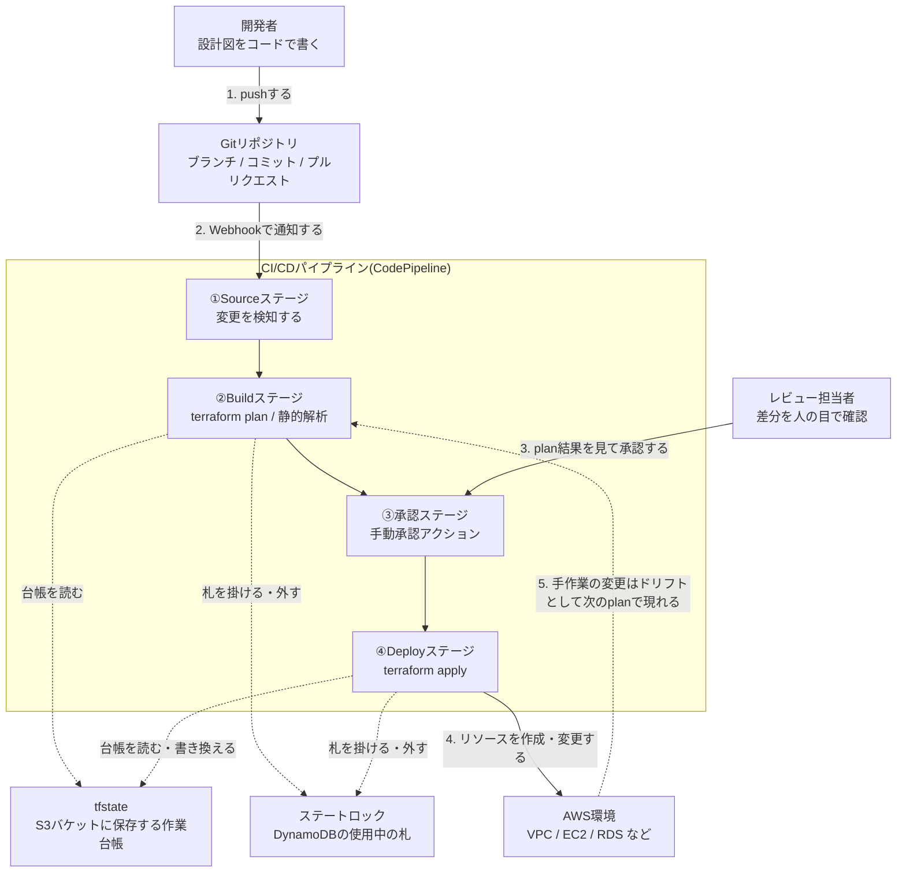

# AWS用語集 ⑧IaCとCI/CD

> 📖 [用語集トップ(索引)に戻る](../02-glossary.md) ｜ [← 前: ⑦監視・運用](07-monitoring-operations.md) ｜ [次: ⑨Linux・サーバー運用の基礎 →](09-linux-server-basics.md)

## この章で扱う範囲

この章は「手作業を卒業するための用語」をまとめたページです。①〜⑦で覚えてきたVPC・EC2・RDS・IAM・CloudWatchといった部品を、**画面をクリックして作る**のではなく**コードとして書き、レビューして、自動で反映する**段階に進みます。

前半は、そもそもIaC(Infrastructure as Code。インフラの構成をコードとして管理する考え方)とは何か、宣言型・冪等性・ドリフトという3つのキーワードで整理します。中盤はAWS純正のCloudFormationと、実務求人でよく名前が挙がるTerraformを比較しながら、HCLの書き方とtfstate(状態ファイル)の管理設計を扱います。後半はGit・プルリクエストによるレビュー文化と、CodePipeline/CodeBuild/GitHub Actionsによる自動化、そして本番へ安全に反映するためのデプロイ戦略と環境分離を扱います。

ここの用語は[レベル6: IaCとCI/CD](../../projects/06-iac-cicd/README.md)でそのまま登場します。「手で作れる」に加えて「コードで再現でき、チームでレビューしながら安全に変更できる」ことを説明できると、面接での評価が一段変わる領域です。



> 🧠 **覚え方のコツ**: この章の全体像は「**設計図 → 台帳 → 稟議 → 施工**」の4段構えです。設計図(コード)をGitに置き、工務店(Terraform)が台帳(tfstate)と現況を見比べて見積(plan)を出し、稟議書にハンコ(手動承認)が押されて初めて施工(apply)されます。①〜⑦が「建物そのものの用語」だったのに対し、⑧は「その建物をどう建て、どう直すか」という**工事の進め方の用語**だと考えてください。

## この章の用語ミニ索引

| 用語 | ひとことで言うと |
|---|---|
| [IaC](#iac) | インフラの構成をコードとして書き、実行して再現する考え方 |
| [ClickOps](#clickops) | コンソール画面を手作業でクリックして構築する運用スタイル |
| [宣言型](#宣言型) | 手順ではなく「あるべき最終形」を書く記述スタイル |
| [冪等性](#冪等性) | 何回実行しても結果が同じになる性質 |
| [ドリフト](#ドリフト) | コードの定義と実際のAWS上の状態がズレること |
| [JSON](#json) | 波かっこと角かっこでデータ構造を表すテキスト形式 |
| [YAML](#yaml) | インデント(字下げ)で構造を表す、人が読みやすいテキスト形式 |
| [CloudFormation](#cloudformation) | AWS純正の、テンプレートからリソースを構築するIaCサービス |
| [テンプレート](#テンプレート) | CloudFormationに渡す「作るものの設計図」ファイル |
| [スタック](#スタック) | テンプレートから作られたリソース一式の管理単位 |
| [変更セット](#変更セット) | 適用前に「何がどう変わるか」を確認できる差分プレビュー |
| [AWS CDK](#aws-cdk) | 普通のプログラミング言語でCloudFormationを生成する仕組み |
| [Terraform](#terraform) | HashiCorp社製の、マルチクラウド対応のIaCツール |
| [HCL](#hcl) | Terraformの設定を書くための専用記法 |
| [プロバイダ](#プロバイダ) | Terraformが各クラウドのAPIを操作するための差し込み部品 |
| [リソースブロック](#リソースブロック) | 「このリソースを1つ作る」を宣言するHCLの基本単位 |
| [データソース](#データソース) | 既存のリソース情報を読み取り専用で参照する仕組み |
| [変数](#変数) | コードを書き換えずに値を差し替えるための入力口 |
| [tfvars](#tfvars) | 変数の値をまとめて書いておくファイル |
| [出力値](#出力値) | 構築結果として受け取るIDやIPアドレスなどの値 |
| [モジュール](#モジュール) | 複数のリソースをまとめて再利用できる部品化の単位 |
| [Terraform Registry](#terraform-registry) | プロバイダと公開モジュールが集まる公式カタログ |
| [terraform init](#terraform-init) | 作業ディレクトリを初期化し、部品を取り寄せるコマンド |
| [terraform validate](#terraform-validate) | 構文と整合性だけを先に確認するコマンド |
| [terraform fmt](#terraform-fmt) | HCLの書式を公式スタイルに自動整形するコマンド |
| [terraform plan](#terraform-plan) | 適用前に追加・変更・削除の差分を確認するコマンド |
| [terraform apply](#terraform-apply) | 差分を実際のAWS環境に反映するコマンド |
| [terraform destroy](#terraform-destroy) | 管理下のリソースをまとめて削除するコマンド |
| [tfstate](#tfstate) | Terraformが現況を記録している状態ファイル(台帳) |
| [バックエンド](#バックエンド) | tfstateをどこに保存するかを決める設定 |
| [ステートロック](#ステートロック) | 同時実行による台帳の破壊を防ぐ排他制御 |
| [force-unlock](#force-unlock) | 残ってしまったロックを手動で強制解除する操作 |
| [Terraform Workspace](#terraform-workspace) | 同じコードのまま状態ファイルだけを切り替える機能 |
| [Git](#git) | 変更履歴を分散管理する、事実上の標準バージョン管理システム |
| [リポジトリ](#リポジトリ) | コードと変更履歴を保管する入れ物 |
| [ブランチ](#ブランチ) | 本流から枝分かれして作業するための作業線 |
| [コミット](#コミット) | 変更をひとまとまりの履歴として確定させる操作 |
| [プルリクエスト](#プルリクエスト) | 「この変更を取り込んでよいか」をレビューに出す仕組み |
| [ブランチ保護ルール](#ブランチ保護ルール) | 本番ブランチへの直接pushやレビュー省略を禁止する設定 |
| [Webhook](#webhook) | 何かが起きたときに外部へ自動でHTTP通知を送る仕組み |
| [CI](#ci) | 変更のたびに自動でビルド・テストして壊れを早期に見つける習慣 |
| [CD](#cd) | テストを通った変更を、自動で配布・反映できる状態にする習慣 |
| [パイプライン](#パイプライン) | Source→Build→承認→Deployを順につないだ処理の流れ |
| [ステージ](#ステージ) | パイプラインを構成する1つ1つの工程 |
| [アーティファクト](#アーティファクト) | ステージ間で受け渡される成果物ファイル |
| [手動承認](#手動承認) | 先に進める前に人のハンコを必須にするアクション |
| [CodePipeline](#codepipeline) | AWSのCI/CDパイプラインを管理する司令塔サービス |
| [CodeBuild](#codebuild) | ビルドやテストのコマンドを実行するマネージド実行環境 |
| [buildspec](#buildspec) | CodeBuildに「何をどの順で実行するか」を指示するYAMLファイル |
| [CodeCommit](#codecommit) | AWSが提供するプライベートなGitリポジトリサービス |
| [CodeStar Connections](#codestar-connections) | GitHubなど外部リポジトリとAWSを安全につなぐ接続機能 |
| [CodeDeploy](#codedeploy) | EC2やECS、Lambdaへの配布と切り替えを担当するサービス |
| [GitHub Actions](#github-actions) | GitHub上でワークフローを自動実行するCI/CDの仕組み |
| [OIDC](#oidc) | 長期のアクセスキーを置かずに一時認証情報を得る連携方式 |
| [tfsec](#tfsec) | 適用前にTerraformコードの危険な設定を検出する静的解析ツール |
| [shellcheck](#shellcheck) | シェルスクリプトの危ない書き方を指摘する静的解析ツール |
| [デプロイ](#デプロイ) | 作った成果物を実際に動く環境へ反映する作業 |
| [ローリングアップデート](#ローリングアップデート) | 稼働させたまま少しずつ入れ替えるデプロイ方式 |
| [ブルーグリーンデプロイ](#ブルーグリーンデプロイ) | 新旧2つの環境を用意し、向き先を一気に切り替える方式 |
| [カナリアリリース](#カナリアリリース) | まず一部の利用者にだけ新版を出して様子を見る方式 |
| [環境分離](#環境分離) | dev/stg/prodを互いに影響しないよう分けて持つ設計 |

## 8-1. IaCの考え方

### IaC

**正式名称**: Infrastructure as Code ｜ **読み方**: アイエーシー(インフラストラクチャー・アズ・コード) ｜ **重要度**: ★★★

**ひとことで言うと**: サーバーやネットワークの構成を「手順書」ではなく「コード」として書き、実行することで同じ環境を何度でも再現できるようにする考え方です。

**たとえるなら**: 「口頭伝達ではなく設計図の文書化」です。ベテランの職人が頭の中だけで建てる家は本人しか同じものを再現できませんが、設計図があれば誰が読んでも同じ建物が建ちます。Terraformはその設計図から自動で建物を建ててくれる工務店にあたります。

**もう少し詳しく**: IaCは特定のツールの名前ではなく「考え方」です。実現手段はCloudFormation・Terraform・[AWS CDK](#aws-cdk)・Ansibleなど複数あります。IaCが解決する問題は大きく3つです。(1)**再現性**: 同じコードを実行すれば、誰がやってもdev環境とprod環境が同じ形になります。(2)**レビュー可能性**: 変更が[コミット](#コミット)の差分として見えるため、[プルリクエスト](#プルリクエスト)でアプリのコードと同じようにレビューできます。(3)**変更履歴**: 「いつ・誰が・なぜ」その設定にしたかがGitの履歴として残り、障害調査や監査に使えます。逆に言うと、IaCを導入しても「コードを直さずコンソールから直接触る」運用を続けると、この3つの利点はすべて失われます。

**サーバー構築での勘所**:
- **手作業を経験してからIaC化する**のが遠回りに見えて近道です。VPCやサブネットの意味を知らないままHCLだけ覚えると、エラーメッセージの意味が読めません。このポートフォリオがレベル1〜5をコンソール、レベル6をコードにしているのはそのためです。
- IaC化の対象は「壊れたら困るもの」から順に広げます。まずネットワーク(VPC・サブネット・ルートテーブル)、次に計算資源(EC2・ASG)、最後にデータストア(RDS・S3)という順が扱いやすいです。
- 「一度手で作ったものをコードに起こす」場合は、`terraform import` やCloudFormationのリソースインポートで既存リソースを管理下に取り込む方法もあります。ただし取り込み作業は思ったより手間がかかるため、最初からコードで作るほうが結果的に楽です。
- IaCは[冪等性](#冪等性)と[宣言型](#宣言型)という2つの性質があって初めて安心して使えます。この2つはセットで理解してください。

**よくあるつまずき**: 「IaC化すれば全部自動になる」と思って、IAMの権限設計やネットワーク設計まで自動で決まると誤解することです。IaCが自動化するのは「決めたことを実行する部分」だけで、**何を作るかを決める設計の仕事は減りません**。むしろ、決めた内容が全部コードに書き出されるので、設計の甘さが可視化されます。

**💰 コスト**: IaCツール自体(CloudFormation、Terraform CLI)の利用料は基本的にかかりません。課金されるのは、コードによって実際に作られたAWSリソースと、それを実行する[CodeBuild](#codebuild)などの実行環境です。最新の料金・無料利用枠の条件は必ず公式ページで確認してください([AWS無料利用枠](https://aws.amazon.com/jp/free/))。

**関連用語**: [ClickOps](#clickops)、[宣言型](#宣言型)、[冪等性](#冪等性)、[ドリフト](#ドリフト)、[Terraform](#terraform)、[CloudFormation](#cloudformation)

**登場する案件**: [レベル6: IaCとCI/CD](../../projects/06-iac-cicd/README.md)

### ClickOps

**読み方**: クリックオプス ｜ **重要度**: ★★

**ひとことで言うと**: AWSマネジメントコンソール(ブラウザからAWSの各サービスを操作できる管理画面)を手作業でクリックしながらインフラを作っていく運用スタイルを指す、やや皮肉を含んだ言葉です。

**たとえるなら**: 「図面を描かずに現場で口頭指示だけで建てる工事」です。腕のいい大工なら1回目はうまく建ちますが、2軒目がまったく同じにならず、しかも誰がどこを直したのか後から分かりません。

**もう少し詳しく**: ClickOpsは常に悪ではありません。学習中や検証中、あるいは1回きりの調査作業では、コンソールのほうが速く、画面の項目名から仕様を学べるという大きな利点があります。問題になるのは、**本番環境の恒久的な構成をClickOpsで維持し続ける**ケースです。変更履歴が残らない、同じ環境を再現できない、レビューを挟めない、担当者が辞めると誰も構成を説明できない、といった属人化が起きます。実務では「調査・一時対応はコンソール可、恒久的な変更は必ずコード経由」という線引きをチームのルールとして決めておくのが一般的です。

**サーバー構築での勘所**:
- IaC導入後にコンソールから直接変更すると[ドリフト](#ドリフト)が発生します。緊急対応でやむを得ず手を入れた場合は、**必ず後からコードへ反映する**という後追いルールをセットで決めておきます。
- 本番アカウントではIAMで「読み取りは全員可、書き込みはCI/CD実行ロールのみ」と権限を絞ると、ルールが仕組みとして守られます([最小権限の原則](06-security-identity.md#最小権限の原則))。
- 面接では「ClickOpsの何が問題か」を聞かれることがあります。「手が遅いから」ではなく「再現性・レビュー可能性・変更履歴の3つが失われるから」と答えられるようにしておきます。

**関連用語**: [IaC](#iac)、[ドリフト](#ドリフト)、[AWSマネジメントコンソール](01-cloud-basics.md#awsマネジメントコンソール)

**登場する案件**: [レベル6: IaCとCI/CD](../../projects/06-iac-cicd/README.md)

### 宣言型

**重要度**: ★★

**ひとことで言うと**: 「どういう手順で作るか」ではなく「最終的にどうなっていてほしいか」を書く記述スタイルです。

**たとえるなら**: 工務店への発注書の書き方の違いです。手続き型は「まず基礎を打って、次に柱を立てて…」と工程を全部指示する方式、宣言型は「完成形はこの間取り図の通りにしてください」と結果だけを渡し、工程はプロに任せる方式です。

**もう少し詳しく**: TerraformやCloudFormationは宣言型です。コードには「VPCが1つ、サブネットが2つ、EC2が1台ある状態」を書くだけで、作成順序(VPC→サブネット→EC2)はツールが依存関係から自動的に判断します。対義語は**手続き型(命令型)**で、シェルスクリプトやAWS CLIを並べた構築スクリプトがこれにあたります。手続き型は「今の状態がどうであっても同じ手順を実行する」ため、2回目の実行で「すでに存在します」エラーになりがちです。宣言型は「あるべき姿と現状の差分だけ」を実行するため、2回目は「変更なし」で正常終了します。この違いがそのまま[冪等性](#冪等性)につながります。

**サーバー構築での勘所**:
- 宣言型では**書いていないものは消える**ことがあります。コードからリソースブロックを削除して[terraform apply](#terraform-apply)すると、そのリソースは削除対象になります。「消したつもりはなかった」という事故は[terraform plan](#terraform-plan)の差分確認で防ぎます。
- 依存関係は基本的に自動解決されますが、AWS側の都合で順序を明示したい場合はTerraformの `depends_on` を使います。多用すると読みにくくなるため、まずは参照(`aws_vpc.main.id` のような書き方)で自然に依存を作るのが定石です。
- [ユーザーデータ](03-compute.md#ユーザーデータ)のようなシェルスクリプト部分は手続き型のままです。宣言型のコードの中に手続き型が同居することを理解しておくと、境界で迷いません。

**関連用語**: [IaC](#iac)、[冪等性](#冪等性)、[リソースブロック](#リソースブロック)、[terraform plan](#terraform-plan)

### 冪等性

**読み方**: べきとうせい ｜ **重要度**: ★★★

**ひとことで言うと**: 同じ操作を何回実行しても、結果が同じ状態に落ち着く性質のことです。

**たとえるなら**: 部屋の照明の「スイッチ」ではなく「明るさの指定」です。スイッチを押す操作(手続き型)は押すたびにON/OFFが入れ替わりますが、「明るさ100%にしてください」という指定(宣言型)は何回言っても部屋は100%のままです。

**もう少し詳しく**: IaCが安心して使える最大の理由が冪等性です。`terraform apply` を1回実行しても10回実行しても、コードに書かれた状態と一致していれば「変更なし(No changes)」で終わります。逆に冪等でないスクリプトは、2回目の実行でリソースが二重に作られたり、エラーで途中停止したりします。冪等性はIaCだけの話ではありません。[ユーザーデータ](03-compute.md#ユーザーデータ)のスクリプトも「すでにインストール済みなら何もしない」と書いておけば、AMI化や再実行に耐えられます。[S3イベント通知](04-storage.md#s3イベント通知)やSQSのメッセージのように「同じ通知が2回届くかもしれない」仕組みを扱うときも、受け取る側を冪等に作るのが定石です。

**サーバー構築での勘所**:
- 冪等なスクリプトを書くコツは「作る前に存在確認をする」「`mkdir -p` や `dnf install -y`(すでに入っていれば何もしない)のような、繰り返しに強いコマンドを選ぶ」の2つです。
- CI/CDでは同じジョブがリトライされることが前提です。**リトライして壊れる処理はCIに載せてはいけません**。
- 「冪等性とは何か」は面接の頻出質問です。「何度やっても同じ結果になること」に加えて「だからリトライしても安全で、自動化に載せられる」という**効果まで**セットで答えると評価が上がります。

**よくあるつまずき**: 「冪等=何も起きない」と誤解することです。正しくは「あるべき状態と違えば直しに行き、同じなら何もしない」です。誰かがコンソールで設定を変えていれば、次の実行はきちんと元に戻しに行きます。

**関連用語**: [宣言型](#宣言型)、[IaC](#iac)、[ドリフト](#ドリフト)、[terraform apply](#terraform-apply)

### ドリフト

**読み方**: ドリフト ｜ **重要度**: ★★★

**ひとことで言うと**: コードに書かれた定義と、実際のAWS上のリソースの状態がズレてしまうことです。

**たとえるなら**: 「間取り図と現況のズレ」です。図面には壁があることになっているのに、現場では誰かが勝手に壁を壊して通路にしてしまった状態。次の工事のとき、図面通りに進めると想定外の場所が元に戻ってしまいます。

**もう少し詳しく**: ドリフトの主な原因は、緊急対応や検証でコンソールから直接リソースを変更することです。Terraformでは、`terraform plan` を実行したときに「コードでは変えていないのに差分が出る」という形で表面化します。CloudFormationには**ドリフト検出**という専用機能があり、スタック単位で実際の設定との差分を一覧できます。ドリフトを見つけたときの対応は2択です。(1)**コンソール側の変更が正しい**なら、コードをその内容に合わせて修正します。(2)**コード側が正しい**なら、apply して実態を戻します。どちらにせよ「勝手に直す」のではなく、なぜその変更が入ったのかをチームで確認してから決めるのが安全です。

**サーバー構築での勘所**:
- ドリフトを予防する最も効果的な方法は、**本番アカウントで人間に書き込み権限を渡さない**ことです。変更はCI/CD実行ロール経由に限定します。
- 検知の仕組みとしては、CIで定期的に `terraform plan` を実行して差分が出たら通知する運用や、[AWS Config](06-security-identity.md#aws-config)の[Configルール](06-security-identity.md#configルール)で「あるべき設定から外れていないか」を継続的に評価する方法があります。
- Terraformでは、意図的に管理対象外にしたい属性(例: 外部ツールが書き換えるタグ)を `lifecycle { ignore_changes = [...] }` で除外できます。乱用するとドリフトを見逃すため、理由をコメントに残して使います。

**よくあるつまずき**: `terraform plan` の差分が巨大になり、慌てて `apply` して大事故になるパターンです。差分が想定より大きいときは、**まず apply しない**。プロバイダのバージョンが上がって既定値が変わっただけなのか、誰かの手作業なのかを切り分けてから判断します。

**関連用語**: [ClickOps](#clickops)、[terraform plan](#terraform-plan)、[tfstate](#tfstate)、[変更セット](#変更セット)

**登場する案件**: [レベル6: IaCとCI/CD](../../projects/06-iac-cicd/README.md)

### JSON

**正式名称**: JavaScript Object Notation ｜ **読み方**: ジェイソン ｜ **重要度**: ★★

**ひとことで言うと**: 波かっこ `{}` と角かっこ `[]` を使って、データの構造をテキストで表す代表的な形式です。

**たとえるなら**: 「入れ子になった箱のラベル付き荷物リスト」です。箱の中に箱があり、それぞれに名前(キー)と中身(値)が書いてあります。

**もう少し詳しく**: AWSではいたるところでJSONが登場します。代表格が[IAMポリシー](06-security-identity.md#iamポリシー)で、`Version` / `Statement` / `Effect` / `Action` / `Resource` という構造はすべてJSONです。ほかにもAWS CLIの出力(既定はJSON)、CloudFormationテンプレート、[tfstate](#tfstate)の中身、[buildspec](#buildspec)のJSON版などがJSONで書かれます。JSONの重要な制約は、**コメントが書けない**ことと、**末尾のカンマが許されない**ことです。この2点が初心者のつまずきポイントの大半を占めます。

**サーバー構築での勘所**:
- 手書きのJSONは必ず機械で検証します。`python3 -m json.tool policy.json` や `jq . policy.json` を通せば、括弧の閉じ忘れや余計なカンマをその場で見つけられます(このリポジトリの [scripts/validate.sh](../../scripts/validate.sh) も同じ方法でJSONを検証しています)。
- IAMポリシーをコピー&ペーストで作るときは、`Resource` に `*` が残っていないかを毎回確認します。JSONの構文が正しいことと、権限設計が正しいことは別問題です。
- Terraformでは `jsonencode({...})` を使うと、HCLの構造からJSONを生成できます。ポリシーをヒアドキュメントの文字列で貼り付けるより、閉じ忘れが起きにくくおすすめです。

**関連用語**: [YAML](#yaml)、[テンプレート](#テンプレート)、[IAMポリシー](06-security-identity.md#iamポリシー)

### YAML

**読み方**: ヤムル ｜ **重要度**: ★★

**ひとことで言うと**: インデント(行頭の字下げ)で階層を表現する、人が読み書きしやすい設定ファイル形式です。

**たとえるなら**: 「箇条書きの議事録」です。JSONが括弧だらけの契約書だとすると、YAMLはインデントで親子関係を示す見やすいメモ書きにあたります。

**もう少し詳しく**: CI/CDの世界ではYAMLが事実上の標準です。[buildspec](#buildspec)、[GitHub Actions](#github-actions)のワークフロー、CloudFormationテンプレート(YAML版)、Kubernetesのマニフェストなど、この章で扱うファイルの多くがYAMLです。JSONの上位互換にあたり、コメント(`#`)が書ける、文字列のクォートを省略できる、という利点があります。一方で落とし穴も多く、**タブ文字が使えない(半角スペースのみ)**、インデントのズレがそのまま構造の誤りになる、`yes` / `no` / `on` / `off` のような単語が真偽値として解釈されることがある、といった点に注意が必要です。バージョン番号 `1.10` を数値と解釈されて `1.1` になるといった事故も起こり得るため、意図がある文字列はクォートで囲みます。

**サーバー構築での勘所**:
- YAMLも必ず機械で検証します。CIに `python3 -c "import yaml,sys; yaml.safe_load(open(sys.argv[1]))"` のようなチェックを入れておくと、パイプラインを流す前に構文エラーを潰せます。
- エディタで「タブをスペースに変換」する設定を必ず有効にしておきます。見た目では気づけない事故の第一位です。
- CloudFormationはJSONとYAMLの両方を受け付けますが、コメントを書けるYAMLのほうが実務では好まれます。

**よくあるつまずき**: インデントを2スペースと4スペースで混在させ、リストの階層が意図とズレるパターンです。1ファイル内でスペース数を統一してください。

**関連用語**: [JSON](#json)、[buildspec](#buildspec)、[テンプレート](#テンプレート)、[GitHub Actions](#github-actions)

## 8-2. CloudFormation

### CloudFormation

**正式名称**: AWS CloudFormation ｜ **読み方**: クラウドフォーメーション ｜ **重要度**: ★★★

**ひとことで言うと**: AWS純正のIaCサービスで、テンプレートというファイルに書いた構成を読み込んで、リソース一式をまとめて作成・更新・削除してくれます。

**たとえるなら**: 「AWSという1つの国でしか通じない母国語を話す工務店」です。他の国(他社クラウド)では通じませんが、その国のことは誰よりも詳しく、役所への申請書類(状態管理)も全部代行してくれます。

**もう少し詳しく**: 利用者は[テンプレート](#テンプレート)([JSON](#json)または[YAML](#yaml))を書き、それを[スタック](#スタック)という単位で適用します。Terraformとの最大の違いは**状態管理をAWSが持ってくれる**点で、[tfstate](#tfstate)に相当するファイルを自分で保管する必要がありません。また、更新に失敗すると自動でロールバック(変更前の状態へ巻き戻す動作)する仕組みが標準で備わっています。追加機能として、適用前に差分を確認する[変更セット](#変更セット)、設定のズレを調べる**ドリフト検出**、複数アカウント・複数リージョンへ一括展開する**StackSets**があります。AWS Serverless Application Model(SAM)や[AWS CDK](#aws-cdk)も、最終的にはCloudFormationのテンプレートを生成して実行しています。

**サーバー構築での勘所**:
- 「AWSしか使わない」「状態ファイルの管理まで自分で面倒を見たくない」「AWSの新機能にいち早く追随したい」という状況ではCloudFormationが有力です。逆に「他社クラウドも扱う」「差分表示の読みやすさを重視する」場合はTerraformが選ばれやすくなります。
- スタックは**削除の単位でもあります**。うっかりスタックごと削除すると中のリソースも消えます。消えては困るリソースには削除保護(Deletion Policy の `Retain` など)を設定します。
- テンプレートには `Parameters`(入力)、`Resources`(必須。作るもの)、`Outputs`(出力)というセクションがあり、それぞれTerraformの[変数](#変数)、[リソースブロック](#リソースブロック)、[出力値](#出力値)にほぼ対応します。この対応関係で覚えると、両方を同時に理解できます。

**よくあるつまずき**: 更新に失敗して `UPDATE_ROLLBACK_FAILED` という状態で止まり、次の更新も受け付けなくなることがあります。手作業でリソースを消してしまった場合に起きやすいため、**スタック管理下のリソースをコンソールから直接削除しない**のが鉄則です。

**💰 コスト**: CloudFormationそのものの利用料は、AWSリソース型を使う一般的な範囲では無料とされています(サードパーティ製リソース型などでは操作数に応じた課金があります)。課金されるのは作成されたリソース側です。最新の料金・無料利用枠の条件は必ず公式ページで確認してください([AWS無料利用枠](https://aws.amazon.com/jp/free/))。

**関連用語**: [テンプレート](#テンプレート)、[スタック](#スタック)、[変更セット](#変更セット)、[AWS CDK](#aws-cdk)、[Terraform](#terraform)

**登場する案件**: [レベル6: IaCとCI/CD](../../projects/06-iac-cicd/README.md)

### テンプレート

**重要度**: ★★

**ひとことで言うと**: CloudFormationに渡す「何をどう作るか」を書いた設計図ファイルです。

**たとえるなら**: 工務店に提出する「建築確認申請の図面一式」です。この図面のとおりに建物(スタック)が建ちます。

**もう少し詳しく**: テンプレートは[YAML](#yaml)または[JSON](#json)で書き、主なセクションは次のとおりです。`AWSTemplateFormatVersion`(書式のバージョン)、`Description`(説明)、`Parameters`(実行時に外から渡す値)、`Mappings`(リージョンごとの値などの対応表)、`Conditions`(環境によって作る・作らないを切り替える条件)、`Resources`(**唯一の必須セクション**。作成するリソース)、`Outputs`(他スタックや利用者へ渡す値)。テンプレート内では `!Ref`(値の参照)や `!GetAtt`(リソースの属性取得)、`!Sub`(文字列の中に値を差し込む)といった組み込み関数を使います。

**サーバー構築での勘所**:
- 1つのテンプレートに何もかも詰め込むと、レビューも再利用も難しくなります。ネットワーク用・アプリ用・DB用のようにライフサイクル(変更の頻度)で分割し、`Outputs` と `Export`/`ImportValue` でつなぐのが定番です。
- テンプレートは必ずGitで管理します。コンソールで直接編集できてしまいますが、それをやると[ドリフト](#ドリフト)と同じ問題が起きます。
- `Parameters` に `NoEcho: true` を付けると、パスワードなどの値がコンソールに表示されなくなります。ただしテンプレートに機密情報を書くこと自体を避け、[Secrets Manager](06-security-identity.md#secrets-manager)や[Parameter Store](06-security-identity.md#parameter-store)から参照するのが安全です。

**関連用語**: [CloudFormation](#cloudformation)、[スタック](#スタック)、[YAML](#yaml)、[JSON](#json)

### スタック

**重要度**: ★★

**ひとことで言うと**: 1つのテンプレートから作られたAWSリソースの集まりを、まとめて扱うための管理単位です。

**たとえるなら**: 「1件の工事案件」です。その案件で建てた建物・配管・電気工事がひとまとめに管理され、案件ごと中止すれば全部撤去されます。

**もう少し詳しく**: スタックを作成すると、CloudFormationがテンプレートを読んで依存関係を解決しながらリソースを順に作ります。作成中に失敗すると、既定では作成済みのリソースも巻き戻されます(ロールバック)。作成後にテンプレートを書き換えて更新すると、差分のあるリソースだけが更新されます。このとき、変更内容によっては**リソースの再作成(置換)**が発生する点に注意が必要です。たとえばEC2の一部の属性やRDSの識別子を変えると、既存リソースが削除されて新しく作られます。スタック内のリソースは「論理ID(テンプレート上の名前)」と「物理ID(実際のAWS上のID)」の対応で管理されており、この対応表がTerraformの[tfstate](#tfstate)に相当します。

**サーバー構築での勘所**:
- 更新の前には必ず[変更セット](#変更セット)を作り、「置換(Replacement: True)」と表示されるリソースがないかを確認します。本番DBの置換は事故に直結します。
- 大規模構成では**ネストされたスタック**(親スタックが子スタックを呼ぶ)や**StackSets**(複数アカウント・リージョンへ展開)を使います。Terraformの[モジュール](#モジュール)に近い発想です。
- スタック単位で[タグ](01-cloud-basics.md#タグ)を付けると、配下の全リソースにタグが伝播し、コスト配分の集計が一気に楽になります。

**関連用語**: [CloudFormation](#cloudformation)、[テンプレート](#テンプレート)、[変更セット](#変更セット)、[tfstate](#tfstate)

### 変更セット

**別名**: チェンジセット(Change Set) ｜ **重要度**: ★★

**ひとことで言うと**: CloudFormationで、実際に適用する前に「何がどう変わるか」を一覧で確認できる差分プレビューです。

**たとえるなら**: 工事前に出してもらう「変更見積書」です。どの部屋を直すのか、壁を壊す必要があるのか(=リソースの置換が起きるのか)を、着工前に文書で確認できます。

**もう少し詳しく**: 変更セットを作成すると、追加(Add)・変更(Modify)・削除(Remove)されるリソースと、変更の際に**置換が必要か(Replacement)**が表示されます。ここで実行を承認すると初めて適用され、承認しなければ変更セットを破棄するだけで何も起きません。役割としてはTerraformの[terraform plan](#terraform-plan)に相当しますが、planのほうが属性単位の差分まで細かく色分け表示されるため、レビューのしやすさではTerraformに軍配が上がる、というのが一般的な評価です。

**サーバー構築での勘所**:
- 本番スタックの更新は「直接更新」ではなく「変更セット経由」に統一します。CI/CDに組み込む場合も、変更セット作成→人が確認→実行、という[手動承認](#手動承認)を挟む形にします。
- 置換(Replacement)が `True` または `Conditional` のリソースは要注意です。特にRDS・EBS・Elastic IPなど、状態やアドレスを持つリソースの置換は影響が大きくなります。

**関連用語**: [CloudFormation](#cloudformation)、[スタック](#スタック)、[terraform plan](#terraform-plan)、[手動承認](#手動承認)

### AWS CDK

**正式名称**: AWS Cloud Development Kit ｜ **読み方**: シーディーケー ｜ **重要度**: ★

**ひとことで言うと**: TypeScriptやPythonなど普通のプログラミング言語でインフラを書き、それをCloudFormationテンプレートに変換して実行する仕組みです。

**たとえるなら**: 「図面を手描きするのではなく、CADソフトで描く」ようなものです。最終的に提出される図面(テンプレート)は同じですが、部品の再利用やミスの検出がしやすくなります。

**もう少し詳しく**: CDKでは「コンストラクト」という部品を組み合わせてインフラを記述します。`cdk synth` でCloudFormationテンプレートを生成し、`cdk deploy` でスタックとして適用します。プログラミング言語の機能(ループ、条件分岐、型チェック、IDEの補完)がそのまま使えるため、似た構成を大量に作る場合に効率的です。一方で、生成されるテンプレートが大きくなりがちで、何が作られるのかが直感的に分かりにくいという指摘もあります。インフラ担当としては、まずCloudFormationかTerraformのどちらかを宣言型でしっかり書けるようになってから触るのが順当です。

**サーバー構築での勘所**:
- CDKは「CloudFormationの上に乗った層」です。トラブル時には結局、生成されたテンプレートとスタックのイベントを読むことになるため、CloudFormationの知識が前提になります。
- 未経験からの学習では優先度を下げて構いません。ただし「CDKとは何か」「なぜCloudFormationと別物ではないのか」は説明できるようにしておくと安心です。

**関連用語**: [CloudFormation](#cloudformation)、[テンプレート](#テンプレート)、[IaC](#iac)

## 8-3. Terraform

### Terraform

**読み方**: テラフォーム ｜ **重要度**: ★★★

**ひとことで言うと**: HashiCorp社が開発している、AWSを含む多くのクラウドを同じ書き方で構築できるIaCツールです。

**たとえるなら**: 「設計図から自動で建物を建てる工務店」です。しかもこの工務店は、どの国(クラウド)へ行っても通じる共通言語を話します。

**もう少し詳しく**: Terraformは[HCL](#hcl)という記法で書かれた `.tf` ファイルを読み、[プロバイダ](#プロバイダ)を通じて各クラウドのAPIを呼び出します。動作の中心にあるのが[tfstate](#tfstate)で、「コードに書かれたあるべき姿」「tfstateに記録された前回の状態」「実際のクラウドの状態」の3つを突き合わせ、差分だけを実行します。基本の流れは `terraform init` → `terraform plan` → `terraform apply` の3段階です。このポートフォリオでTerraformを採用した理由は、(1)マルチクラウドでも通用する汎用スキルであること、(2)求人で名前が挙がる頻度が高いこと、(3)`plan` の差分表示がレビューしやすくCI/CDと相性が良いこと、の3点です。

**サーバー構築での勘所**:
- バージョン差でエラーになりやすいツールです。`required_version` と `required_providers` のバージョン制約をコードに明記し、CIとローカルで同じバージョンを使えるようにします。
- `terraform init` が生成する `.terraform.lock.hcl`(依存バージョンの固定ファイル)は**Gitにコミットします**。逆に `.terraform/` ディレクトリや `*.tfstate`、機密を含む `*.tfvars` は `.gitignore` で除外します。
- Terraformは「作る」だけでなく「壊す」力も持ちます。実行ロールの権限は[最小権限の原則](06-security-identity.md#最小権限の原則)で絞り、本番と検証でAWSアカウント自体を分けるのが安全です。
- 学習では、まず[レベル2](../../projects/02-ec2-web-server/README.md)で手作業構築したVPC+EC2をコードで再現するのが近道です。手で作った画面項目とHCLの属性名が1対1で対応していることが体感できます。

**よくあるつまずき**: ローカルで `apply` した後にチームメンバーが別の `apply` を実行し、状態ファイルが食い違うパターンです。最初から[バックエンド](#バックエンド)をS3にし、[ステートロック](#ステートロック)を有効にしてから始めてください。

**💰 コスト**: Terraform CLI本体の利用にライセンス費用はかかりません。課金されるのは作成されたAWSリソースと、tfstate保管用のS3・ロック用のDynamoDB・実行環境([CodeBuild](#codebuild)など)です。最新の料金・無料利用枠の条件は必ず公式ページで確認してください([AWS無料利用枠](https://aws.amazon.com/jp/free/))。

**関連用語**: [HCL](#hcl)、[プロバイダ](#プロバイダ)、[tfstate](#tfstate)、[terraform plan](#terraform-plan)、[CloudFormation](#cloudformation)

**登場する案件**: [レベル6: IaCとCI/CD](../../projects/06-iac-cicd/README.md)

### HCL

**正式名称**: HashiCorp Configuration Language ｜ **読み方**: エイチシーエル ｜ **重要度**: ★★★

**ひとことで言うと**: Terraformの設定を書くための専用記法です。

**たとえるなら**: 工務店に通じる「専用の図面記号」です。JSONやYAMLという一般的な文字でも書けなくはありませんが、この記号を覚えたほうが図面がずっと読みやすくなります。

**もう少し詳しく**: HCLは `ブロック種別 "ラベル1" "ラベル2" { 属性 = 値 }` という構造の繰り返しでできています。主なブロック種別は `terraform`(Terraform自体の設定)、`provider`、`resource`、`data`、`variable`、`output`、`module`、`locals` です。値には文字列・数値・真偽値・リスト(`[]`)・マップ(`{}`)が使え、`"${var.project_name}-vpc"` のように文字列の中へ変数を埋め込めます。コメントは `#` または `//`、複数行は `/* */` です。JSONと違ってコメントが書ける点が、レビュー前提の運用では効いてきます。

**サーバー構築での勘所**:
- 書式は[terraform fmt](#terraform-fmt)に任せます。人間がインデントを揃える作業に時間を使わないでください。
- 同じ値を何度も書くときは `locals` ブロックにまとめます。`local.name_prefix` のように参照でき、命名規則の統一に役立ちます。
- 同じ構成を複数作るときは `count`(個数指定)か `for_each`(キー付きの集合)を使います。後から要素を増減する予定があるなら、インデックスがずれない `for_each` のほうが安全です。

**よくあるつまずき**: 属性の書き方をコピー元のバージョンから変えずに使い、プロバイダのバージョンが違ってエラーになることです。エラーメッセージに出る属性名で公式ドキュメントを検索する癖を付けてください。

**関連用語**: [Terraform](#terraform)、[リソースブロック](#リソースブロック)、[変数](#変数)、[terraform fmt](#terraform-fmt)

### プロバイダ

**読み方**: プロバイダ(Provider) ｜ **重要度**: ★★★

**ひとことで言うと**: Terraformが「どのサービスのAPIを操作するか」を担当する差し込み部品(プラグイン)です。

**たとえるなら**: 工務店が持っている「その国の建築基準に対応した工具箱」です。AWS用の工具箱を差し込めばAWSの建物が建ち、別の工具箱に差し替えれば別の国の建物が建ちます。

**もう少し詳しく**: AWSを操作するなら `hashicorp/aws` プロバイダを使います。宣言は2か所に分かれます。1つは `terraform { required_providers { aws = { source = "hashicorp/aws", version = "~> 5.0" } } }` というバージョン制約、もう1つは `provider "aws" { region = "ap-northeast-1" }` という接続設定です。認証情報はコードに書かず、環境変数・AWS CLIのプロファイル・EC2やCodeBuildに割り当てた[IAMロール](06-security-identity.md#iamロール)から自動的に読み込ませます。同じプロバイダを別設定で複数使いたい場合は `alias` を使います。典型例が「CloudFront用のACM証明書だけは `us-east-1` で発行する」ケースで、`provider "aws" { alias = "virginia", region = "us-east-1" }` を追加し、リソース側で `provider = aws.virginia` と指定します。

**サーバー構築での勘所**:
- バージョンは必ず制約付きで固定します。`~> 5.0` は「5系の中で最新」を意味し、メジャーバージョンの破壊的変更を防げます。実際の固定値は `.terraform.lock.hcl` に記録されます。
- プロバイダのアップグレードは、必ず `terraform plan` の差分を確認してから行います。既定値の変更によって、コードを触っていないのに差分が出ることがあります。
- 認証情報をHCLに直書きするのは厳禁です。Gitに機密が入り込む事故の典型パターンです。

**関連用語**: [Terraform](#terraform)、[terraform init](#terraform-init)、[ACM](06-security-identity.md#acm)、[IAMロール](06-security-identity.md#iamロール)

### リソースブロック

**重要度**: ★★★

**ひとことで言うと**: 「このAWSリソースを1つ、この設定で作る」ことを宣言する、HCLの基本単位です。

**たとえるなら**: 図面に書かれた「部品1つ分の記載」です。この記載が1つあれば、実際の部屋が1つ建ちます。

**もう少し詳しく**: `resource "aws_vpc" "main" { cidr_block = "10.0.0.0/16" }` のように、`resource` の後ろに**リソースタイプ**(`aws_vpc`)と**ローカル名**(`main`)を書きます。この2つを組み合わせた `aws_vpc.main` がコード内での住所になり、他のブロックから `aws_vpc.main.id` のように参照できます。この参照関係がそのまま依存関係になり、Terraformは自動的に「VPCを作ってからサブネットを作る」という順序を判断します。よく使うメタ引数(共通で指定できるオプション)は次のとおりです。`count` / `for_each`(複数作成)、`depends_on`(明示的な依存)、`provider`(使うプロバイダの指定)、`lifecycle`(`create_before_destroy`、`prevent_destroy`、`ignore_changes`)。

**サーバー構築での勘所**:
- ローカル名は「役割」で付けます(`main`、`public`、`web`)。`vpc1` のような通し番号は、後から順番が変わると意味が失われます。
- 消えたら困るリソース(本番RDS、tfstate用のS3バケットなど)には `lifecycle { prevent_destroy = true }` を付けておくと、`destroy` の巻き添えを防げます。
- `tags` は全リソースに一貫して付けます。プロバイダの `default_tags` を使うと、共通タグを一括で適用できて漏れがなくなります。
- リソースタイプの名前と属性名は、コンソールの画面項目とほぼ対応しています。分からない属性が出てきたら、コンソールで同じ画面を開いて突き合わせると理解が早いです。

**よくあるつまずき**: ローカル名を変更すると、Terraformは「古いリソースを削除して新しく作る」と判断します。名前だけ変えたいときは `terraform state mv` で状態側の住所を移してから、コードを変更します。

**関連用語**: [HCL](#hcl)、[データソース](#データソース)、[tfstate](#tfstate)、[terraform plan](#terraform-plan)

### データソース

**重要度**: ★★

**ひとことで言うと**: すでに存在するリソースや値を、読み取り専用で参照するための仕組みです。

**たとえるなら**: 「既存の建物の登記情報を役所で調べる」作業です。自分では建てませんが、その情報を使って隣に新しい建物を建てられます。

**もう少し詳しく**: `data "aws_ami" "amazon_linux_2023" { most_recent = true, owners = ["amazon"], filter { ... } }` のように書き、`data.aws_ami.amazon_linux_2023.id` で参照します。典型的な用途は、(1)最新の[AMI](03-compute.md#ami) IDを毎回自動で取得する、(2)手作業で作った既存VPCのIDを引いてくる、(3)自分のアカウントIDやリージョン名を取得する(`data "aws_caller_identity"`、`data "aws_region"`)、(4)IAMポリシーのJSONを組み立てる(`data "aws_iam_policy_document"`)、です。AMI IDのようにリージョンごと・更新ごとに変わる値をコードへ直書きしないための必須テクニックです。

**サーバー構築での勘所**:
- AMI IDは[Parameter Store](06-security-identity.md#parameter-store)のパブリックパラメータ(`/aws/service/ami-amazon-linux-latest/...` のようなパス)から取得する方法もあります。どちらの方式でも「直書きしない」ことが重要です。
- `most_recent = true` は便利ですが、実行のたびにAMIが変わり得るため、`plan` に予期しない差分が出ることがあります。本番では取得したAMI IDを変数として固定し、更新のタイミングを人がコントロールする設計も検討します。
- データソースは読み取り専用です。参照先が存在しないとエラーになるため、他チームが管理するリソースを参照する場合は「消されたら壊れる」という依存があることを認識しておきます。

**関連用語**: [リソースブロック](#リソースブロック)、[AMI](03-compute.md#ami)、[Parameter Store](06-security-identity.md#parameter-store)

**登場する案件**: [レベル6: IaCとCI/CD](../../projects/06-iac-cicd/README.md)

### 変数

**重要度**: ★★★

**ひとことで言うと**: コード本体を書き換えずに、環境ごとに違う値を外から差し込むための入力口です。

**たとえるなら**: 工務店の「注文フォーム」です。同じ設計図でも、色・広さ・台数の欄を書き換えるだけで別の建物が建ちます。

**もう少し詳しく**: `variable "instance_type" { description = "EC2インスタンスタイプ", type = string, default = "t3.micro" }` のように宣言し、コード内では `var.instance_type` で参照します。`type` には `string` / `number` / `bool` / `list(...)` / `map(...)` / `object({...})` を指定でき、想定外の値を早期に弾けます。`validation` ブロックを付ければ「CIDR形式であること」のような独自チェックも書けます。`sensitive = true` を付けると `plan` / `apply` の出力からその値が伏せられます(ただし[tfstate](#tfstate)には記録されるため、機密の完全な保護にはなりません)。値の指定方法は複数あり、優先順位は高いほうから **コマンドラインの `-var` / `-var-file` → `*.auto.tfvars` → `terraform.tfvars` → 環境変数 `TF_VAR_名前` → `default`** の順です。

**サーバー構築での勘所**:
- `description` は必ず書きます。数か月後の自分と、レビュアーのための説明です。
- パスワードやAPIキーは変数で渡さず、[Secrets Manager](06-security-identity.md#secrets-manager)や[Parameter Store](06-security-identity.md#parameter-store)から実行時に取得する設計にします。変数で渡すとtfstateとCIのログに残るリスクがあります。
- CI上では `TF_VAR_名前` という環境変数が便利です。たとえばCodeBuildの環境変数に `TF_VAR_my_ip_cidr` を設定しておけば、`terraform.tfvars` をリポジトリに置かずに値を渡せます。
- モジュールの入力変数は「その部品にとって本当に環境差があるもの」だけに絞ります。何でも変数化すると、注文フォームが100項目になって誰も使えなくなります。

**関連用語**: [tfvars](#tfvars)、[出力値](#出力値)、[モジュール](#モジュール)、[HCL](#hcl)

**登場する案件**: [レベル6: IaCとCI/CD](../../projects/06-iac-cicd/README.md)

### tfvars

**読み方**: ティーエフバーズ ｜ **重要度**: ★★

**ひとことで言うと**: 変数の値をまとめて書いておくファイル(`terraform.tfvars` など)です。

**たとえるなら**: 記入済みの「注文フォームの控え」です。フォームの様式(`variables.tf`)と、実際に書き込んだ内容(`terraform.tfvars`)を分けて持つイメージです。

**もう少し詳しく**: `terraform.tfvars` と `*.auto.tfvars` は自動で読み込まれ、それ以外の名前のファイルは `terraform plan -var-file=prod.tfvars` のように明示して渡します。中身は `instance_type = "t3.micro"` のような単純な代入の羅列です。環境ごとの差分をここに閉じ込めることで、`main.tf` は共通のまま使い回せます。

**サーバー構築での勘所**:
- 自分のグローバルIPや踏み台のIPなど、公開したくない値を含む `*.tfvars` は `.gitignore` に登録します。代わりに `terraform.tfvars.example` のようなサンプルをコミットしておくと、他の人が何を書けばよいか分かります。
- パスワードやトークンはtfvarsにも書きません。Gitに入らなくても、開発者のPC上に平文で残り続けます。
- 環境分離の方式としては「環境ごとにディレクトリを分ける」「同じコードに `-var-file` で環境別tfvarsを渡す」の2通りがあります。前者のほうが事故が起きにくく、初学者にはおすすめです。

**関連用語**: [変数](#変数)、[環境分離](#環境分離)、[Terraform Workspace](#terraform-workspace)

**登場する案件**: [レベル6: IaCとCI/CD](../../projects/06-iac-cicd/README.md)

### 出力値

**重要度**: ★★

**ひとことで言うと**: 構築の結果として受け取りたい値(IDやIPアドレスなど)を、外に取り出すための宣言です。

**たとえるなら**: 工事完了時に受け取る「引き渡し伝票」です。部屋番号(インスタンスID)や電話番号(パブリックIP)が書かれていて、次の作業に使えます。

**もう少し詳しく**: `output "web_server_public_ip" { description = "作成したEC2のパブリックIP", value = module.ec2.public_ip }` のように書きます。`terraform output` コマンドで確認でき、`terraform output -raw 名前` とすればスクリプトから値だけを取り出せます。モジュールでは出力値が「外に見せるインターフェース」になり、親モジュールから `module.vpc.vpc_id` の形で参照されます。つまり、モジュールの[変数](#変数)が入力、出力値が戻り値にあたります。

**サーバー構築での勘所**:
- 出力値は「次の作業で使うもの」に絞ります。すべての属性を出力すると、CIのログが読みにくくなります。
- 機密値には `sensitive = true` を付けます。CIのビルドログは広く共有されがちなので、この一手間が重要です。
- 別のTerraform構成から参照したい場合は、`terraform_remote_state` データソースで他のtfstateを読む方法があります。ただし構成間の結合が強くなるため、まずは同じ構成にまとめられないかを検討します。

**関連用語**: [変数](#変数)、[モジュール](#モジュール)、[tfstate](#tfstate)

### モジュール

**重要度**: ★★★

**ひとことで言うと**: 複数のリソース定義をひとまとめにして、名前付きの部品として再利用できるようにする仕組みです。

**たとえるなら**: 「レゴブロックの部品箱」です。`modules/` が部品箱、`environments/` がその部品で組み立てた完成品(dev用の街、prod用の街)にあたります。

**もう少し詳しく**: どんなTerraform構成にも、コマンドを実行するディレクトリ自体である**ルートモジュール**が存在します。そこから `module "vpc" { source = "../../modules/vpc", project_name = "handson-dev" }` のように呼び出されるのが**子モジュール**です。`source` にはローカルパスのほか、[Terraform Registry](#terraform-registry)のアドレスやGitのURLも指定できます。レジストリやGitから取得する場合は `version` を必ず固定します。モジュール化の狙いは「同じ構成をdev/prodで作り分ける」「VPCの作り方をチームの標準として1か所に集約する」ことです。

**サーバー構築での勘所**:
- 最初から細かくモジュール化しないでください。1つのディレクトリに素直に書き、「2回目の複製が必要になった時点で切り出す」のが失敗しにくい順序です。
- モジュールの粒度は「ライフサイクル(変更の頻度)が同じもの」でまとめます。滅多に変わらないVPCと、頻繁に入れ替わるEC2を1つのモジュールに混ぜると、小さな変更のたびに大きな`plan`を読むことになります。
- 公開モジュールは便利ですが中身がブラックボックスになりがちです。学習段階では、まず自分で `modules/vpc` と `modules/ec2` を書いてみるほうが力が付きます。
- モジュール内では[プロバイダ](#プロバイダ)の設定を書かず、呼び出し元から引き継ぐのが原則です。モジュール内にプロバイダ設定を書くと、後から削除しにくくなります。

**関連用語**: [変数](#変数)、[出力値](#出力値)、[Terraform Registry](#terraform-registry)、[環境分離](#環境分離)

**登場する案件**: [レベル6: IaCとCI/CD](../../projects/06-iac-cicd/README.md)

### Terraform Registry

**読み方**: テラフォーム・レジストリ ｜ **重要度**: ★★

**ひとことで言うと**: プロバイダと、世界中で公開されている再利用可能なモジュールが集まっている公式カタログサイトです。

**たとえるなら**: 「建材メーカーのカタログ」です。自分で一から作らなくても、実績のある既製部品を取り寄せて組み込めます。

**もう少し詳しく**: `terraform init` を実行すると、Terraformはここから `hashicorp/aws` などの[プロバイダ](#プロバイダ)を自動的にダウンロードします。プロバイダのドキュメント(各リソースタイプにどんな属性があるか)もこのサイトで公開されており、実務ではAWS公式ドキュメントと並ぶ一次情報になります。モジュールも `source = "terraform-aws-modules/vpc/aws"` のように指定するだけで利用できます。

**サーバー構築での勘所**:
- モジュールを使うときは `version` を必ず指定します。指定しないと、あるとき突然メジャーバージョンが上がって構成が壊れる可能性があります。
- サードパーティのモジュールは、**中で何のリソースが作られるか**を必ず確認します。知らないうちにNATゲートウェイのような時間課金のリソースが作られ、料金が跳ね上がる事故が起こり得ます。
- プロバイダのドキュメントには、各属性が「変更するとリソースの再作成が必要(Forces new resource)」かどうかが書かれています。`plan` で置換が出た理由を調べるときに役立ちます。

**関連用語**: [プロバイダ](#プロバイダ)、[モジュール](#モジュール)、[terraform init](#terraform-init)

### terraform init

**読み方**: テラフォーム・イニット ｜ **重要度**: ★★★

**ひとことで言うと**: 作業ディレクトリを初期化し、必要なプロバイダやモジュールを取り寄せて、状態ファイルの保存先に接続するコマンドです。

**たとえるなら**: 工事の「着工準備」です。工具箱(プロバイダ)を運び込み、部品(モジュール)を発注し、台帳を保管する金庫(バックエンド)の鍵を受け取ります。ここが済まないと何も始まりません。

**もう少し詳しく**: `terraform init` が行う主な仕事は3つです。(1)`required_providers` に書かれた[プロバイダ](#プロバイダ)を[Terraform Registry](#terraform-registry)からダウンロードし、`.terraform/` ディレクトリに配置します。(2)`module` ブロックの `source` を解決して取得します。(3)`backend` ブロックの設定を読み、リモートの[tfstate](#tfstate)へ接続します。同時に `.terraform.lock.hcl` という依存関係ロックファイルを作成・更新します。これは「実際に使ったプロバイダのバージョンとハッシュ値」を記録するファイルで、**Gitにコミットして共有します**。これにより、自分のPCとCI環境で同じバージョンのプロバイダが使われることが保証されます。

**サーバー構築での勘所**:
- CI上では `terraform init -input=false` のように、対話入力を求めないオプションを付けます。入力待ちで固まるとビルドがタイムアウトします。
- バックエンドの設定を変えた後は `-reconfigure`(接続し直す)または `-migrate-state`(既存の状態を新しい保存先へ移す)が必要になります。どちらを使うかを取り違えると状態を見失うため、実行前に必ずtfstateのバックアップを取ります。
- プロバイダを新しいバージョンに上げたいときは `terraform init -upgrade` を使い、その後に必ず `terraform plan` で差分を確認します。
- `.terraform/` ディレクトリはダウンロードされた実体で、サイズも大きくなります。`.gitignore` に必ず含めてください。

**よくあるつまずき**: `Error: Failed to get existing workspaces` や `NoSuchBucket` は、`backend.tf` に書いたバケット名が実在しない・タイプミス・リージョン違いのときに出ます。まずはバケットが本当にその名前・そのリージョンにあるかを確認します。

**関連用語**: [プロバイダ](#プロバイダ)、[バックエンド](#バックエンド)、[モジュール](#モジュール)、[terraform plan](#terraform-plan)

**登場する案件**: [レベル6: IaCとCI/CD](../../projects/06-iac-cicd/README.md)

### terraform validate

**重要度**: ★★

**ひとことで言うと**: 書いたHCLに構文エラーや設定の食い違いがないかを、AWSに接続せずに確認するコマンドです。

**たとえるなら**: 図面を役所に提出する前の「社内チェック」です。線が閉じていない、部屋番号が重複している、といった図面上の不備をその場で見つけます。

**もう少し詳しく**: `terraform validate` は、括弧の閉じ忘れのような構文エラーに加え、存在しない属性名を指定している、必須の引数が足りない、型が合わない、といった問題を検出します。実際のAWS環境やtfstateを参照しないため高速で、CIの早い段階に置くのに向いています。ただしプロバイダのスキーマ(属性の定義情報)が必要なので、**実行前に `terraform init` が必要**です。あくまで静的なチェックであり、「そのCIDRが他のサブネットとぶつかる」「その名前のバケットはすでに世界中の誰かが使っている」といった実行時のエラーは検出できません。

**サーバー構築での勘所**:
- CIでは `terraform fmt -check` → `terraform validate` → `terraform plan` の順に並べます。軽くて早く落ちるチェックを前に置くのが基本です。
- `validate` が通ったからといって `apply` が成功するわけではありません。「文法は正しいが設計は間違っている」ケースを見つけるのが、後続の `plan` とレビューの役目です。

**関連用語**: [terraform init](#terraform-init)、[terraform fmt](#terraform-fmt)、[terraform plan](#terraform-plan)、[CI](#ci)

### terraform fmt

**重要度**: ★★

**ひとことで言うと**: HCLファイルのインデントや `=` の位置を、公式の標準スタイルに自動で整形するコマンドです。

**たとえるなら**: 図面の「線の太さと文字の大きさを社内標準に揃える」作業です。内容は変わりませんが、揃っているだけでレビューの速度が上がります。

**もう少し詳しく**: `terraform fmt` を実行するとファイルが書き換えられ、`-recursive` を付ければサブディレクトリも対象になります。`-check` を付けると書き換えずに「整形が必要なファイルがあるか」だけを判定し、必要があれば終了コード1を返します。CIではこの `-check` を使い、整形されていないコードがマージされないようにします。このリポジトリの [scripts/validate.sh](../../scripts/validate.sh) も `terraform fmt -check -recursive` で検査しています。

**サーバー構築での勘所**:
- 書式の議論はレビューの時間を無駄に消費します。「整形はツールに任せ、レビューでは設計だけを議論する」というルールをチームで決めてください。
- エディタの保存時フォーマットを有効にしておけば、CIで落ちること自体がほぼなくなります。

**関連用語**: [HCL](#hcl)、[terraform validate](#terraform-validate)、[CI](#ci)

### terraform plan

**読み方**: テラフォーム・プラン ｜ **重要度**: ★★★

**ひとことで言うと**: 実際に反映する前に「何が追加・変更・削除されるか」を一覧で見せてくれるコマンドです。

**たとえるなら**: 「レントゲン写真」です。まだ何も起きていない、事前の見立てだけ。レントゲンを見ずにいきなり手術する医者がいないのと同じで、planを見ずにapplyするのは実務では厳禁です。

**もう少し詳しく**: `terraform plan` は、(1)コードに書かれたあるべき姿、(2)[tfstate](#tfstate)に記録された前回の状態、(3)実際のAWSの現況、の3つを突き合わせて差分を計算します。出力の記号は次のとおりです。`+` は作成、`-` は削除、`~` は変更(その場で更新)、`-/+` は**置換**(いったん削除してから作り直す)、`<=` はデータソースの読み取りです。最後に `Plan: 3 to add, 1 to change, 0 to destroy.` のようなサマリーが表示されます。`-out=tfplan` を付けると計算結果をファイルとして保存でき、そのファイルを `terraform apply tfplan` に渡すことで「レビューした内容」と「反映される内容」を完全に一致させられます。CI/CDで[手動承認](#手動承認)を挟むときは、必ずこの保存済みプランを[アーティファクト](#アーティファクト)として次のステージへ渡します。

**サーバー構築での勘所**:
- **`-/+`(置換)を最重要でチェックします。** RDSやEBS、Elastic IPの置換はデータ損失やIP変更を伴います。置換の理由はplan出力に `# forces replacement` として表示されます。
- 差分が想定外に大きいときは、[ドリフト](#ドリフト)かプロバイダのバージョン変更を疑います。慌てて `apply` しないことが最大の防御です。
- `terraform plan` は読み取り操作が中心ですが、`Describe` 系のAPIを大量に呼びます。実行ロールには読み取り権限が必要です。
- `-refresh-only` を付けると「実態に合わせてtfstateだけを更新する」プランになります。手作業の変更を追認したいときに使います。

**よくあるつまずき**: 保存したプランファイル(`tfplan`)には、変数の値や一部の属性が**平文で含まれることがあります**。CIのアーティファクトとして保存する場合は、保存先のS3バケットを非公開・暗号化し、閲覧できる人を限定してください。

**関連用語**: [terraform apply](#terraform-apply)、[ドリフト](#ドリフト)、[変更セット](#変更セット)、[手動承認](#手動承認)

**登場する案件**: [レベル6: IaCとCI/CD](../../projects/06-iac-cicd/README.md)

### terraform apply

**読み方**: テラフォーム・アプライ ｜ **重要度**: ★★★

**ひとことで言うと**: planで確認した差分を、実際のAWS環境へ反映するコマンドです。

**たとえるなら**: 「実際の手術」です。ここから先は本当にリソースが作られ、変更され、削除されます。

**もう少し詳しく**: 引数なしで `terraform apply` を実行すると、内部でplanを計算して差分を表示し、`yes` の入力を求めてから反映します。`terraform apply tfplan` のように保存済みプランを渡した場合は、確認プロンプトなしでその内容がそのまま適用されます。CI上では `-input=false -auto-approve` を付けて対話を無効化しますが、**無条件の自動適用は危険**です。だからこそCI/CDでは、planの結果を人が確認する[手動承認](#手動承認)を間に挟み、承認された同じプランファイルを適用する設計にします。apply中はtfstateが更新され、途中で失敗した場合は「そこまでに作られたリソース」がtfstateに記録された状態で止まります(CloudFormationのような自動ロールバックはありません)。エラーを直して再実行すれば、続きから進みます。

**サーバー構築での勘所**:
- apply中に[ステートロック](#ステートロック)が取得されます。CIとローカルで同時に実行しないよう、チームのルールを決めておきます。
- 実行ロールの権限は、apply時に初めて不足が判明することがよくあります。`plan` は通るのに `apply` で `UnauthorizedOperation` が出る場合、書き込み系のアクション許可が足りていません。
- 本番へのapplyは、必ず「誰が・いつ・どのコミットを」適用したかが残る経路(CI/CD)から行います。ローカルPCからの本番applyは、記録が残らないためClickOpsと同じ問題を抱えます。

**よくあるつまずき**: `apply` の途中でターミナルを閉じたり、CIをキャンセルしたりすると、ロックが残ったままになることがあります。この場合の対処は[force-unlock](#force-unlock)を参照してください。

**関連用語**: [terraform plan](#terraform-plan)、[ステートロック](#ステートロック)、[手動承認](#手動承認)、[冪等性](#冪等性)

**登場する案件**: [レベル6: IaCとCI/CD](../../projects/06-iac-cicd/README.md)

### terraform destroy

**重要度**: ★★

**ひとことで言うと**: そのTerraform構成が管理しているリソースを、まとめて削除するコマンドです。

**たとえるなら**: 「建物の解体工事」です。案件単位でまとめて更地に戻せますが、間違った案件で実行すると取り返しがつきません。

**もう少し詳しく**: `terraform destroy` は、tfstateに記録されている全リソースを依存関係の逆順で削除します(`terraform apply -destroy` と同じ動作です)。学習用途では非常に重要なコマンドで、**検証が終わったら destroy して課金を止める**のが鉄則です。特にNATゲートウェイ・RDS・ElastiCache・ALBのような「起動しているだけで時間課金される」リソースは、消し忘れると想定外の請求につながります。一部だけ消したい場合は `-target` オプションがありますが、依存関係が壊れやすいため常用は避け、原則はコードからリソースブロックを削除して `apply` する方法を取ります。

**サーバー構築での勘所**:
- 本番環境では、実行ロールに削除系の権限を与えない、あるいは重要リソースに `lifecycle { prevent_destroy = true }` を設定して事故を防ぎます。
- destroyしてもtfstate自体は残ります(中身が空になります)。tfstate保管用のS3バケットやロック用のDynamoDBテーブルは、その構成の管理外(手作業またはCLIで作成)にしておくのが定番です。自分の足場を自分で壊さないための設計です。
- destroy前に `terraform plan -destroy` で「何が消えるのか」を確認する習慣を付けてください。

**💰 コスト**: 学習でいちばん効くコスト対策が、このコマンドの実行です。削除順序に迷ったときは[コスト管理と無料利用枠ガイド](../03-cost-management.md)の削除手順を参照してください。最新の料金・無料利用枠の条件は必ず公式ページで確認してください([AWS無料利用枠](https://aws.amazon.com/jp/free/))。

**関連用語**: [terraform apply](#terraform-apply)、[tfstate](#tfstate)、[リソースブロック](#リソースブロック)

**登場する案件**: [レベル6: IaCとCI/CD](../../projects/06-iac-cicd/README.md)

## 8-4. Terraformのstate管理

### tfstate

**読み方**: ティーエフステート ｜ **重要度**: ★★★

**ひとことで言うと**: Terraformが「いま何をどこまで作ったか」を記録している状態ファイルです。

**たとえるなら**: 工務店が持つ「現在の建築状況を記した台帳」です。この台帳を見て、図面との差分だけを工事します。台帳をなくすと、工務店は「この建物が自分の作ったものかどうか」すら分からなくなります。

**もう少し詳しく**: 中身はJSON形式で、コード上の住所(`aws_vpc.main`)と実際のAWS上のID(`vpc-0abc…`)の対応、および取得した属性値が記録されています。既定ではカレントディレクトリの `terraform.tfstate` に保存され、更新前の内容が `terraform.tfstate.backup` に残ります。ここで最重要の注意点があります。**tfstateにはDBのパスワードや接続情報が平文で含まれることがあります。** `sensitive = true` を付けた変数も、表示が伏せられるだけでtfstate内には記録されます。したがってtfstateは「機密ファイル」として扱い、Gitにコミットしてはいけません。状態を手で編集したくなったときは、直接ファイルを書き換えるのではなく `terraform state list`(一覧)、`terraform state show`(詳細)、`terraform state mv`(住所の変更)、`terraform state rm`(管理対象から外す)、`terraform import`(既存リソースを取り込む)といった専用コマンドを使います。

**サーバー構築での勘所**:
- 個人の検証を除き、tfstateは必ずリモートの[バックエンド](#バックエンド)(S3など)に置きます。保存先のS3バケットは、パブリックアクセスブロック・[バージョニング](04-storage.md#バージョニング)・デフォルト暗号化の3点セットを有効にします。バージョニングは「壊したtfstateを1つ前に戻す」ための保険です。
- `.gitignore` には `*.tfstate`、`*.tfstate.*`、`.terraform/` を必ず入れます。
- tfstateへのアクセス権は、CI/CD実行ロールと必要最小限の担当者だけに絞ります。tfstateを読めるということは、そこに書かれた機密情報を読めるということです。
- チームでは「1つのtfstateに全社の全リソースを入れる」のではなく、システム単位・環境単位で分割します。1つが巨大になるとplanが遅くなり、事故の影響範囲も広がります。

**よくあるつまずき**: tfstateを削除してしまうと、Terraformは既存リソースの存在を忘れ、次のapplyで同じリソースを二重に作ろうとして名前の重複エラーになります。バージョニングを有効にしていれば、S3の以前のバージョンから復元できます。

**💰 コスト**: tfstateのファイルサイズは通常数KB〜数百KB程度で、S3の保管料はごくわずかです。無料利用枠の範囲に収まることが多いですが、最新の料金・無料利用枠の条件は必ず公式ページで確認してください([AWS無料利用枠](https://aws.amazon.com/jp/free/))。

**関連用語**: [バックエンド](#バックエンド)、[ステートロック](#ステートロック)、[terraform plan](#terraform-plan)、[ドリフト](#ドリフト)

**登場する案件**: [レベル6: IaCとCI/CD](../../projects/06-iac-cicd/README.md)

### バックエンド

**読み方**: バックエンド(Backend) ｜ **重要度**: ★★★

**ひとことで言うと**: tfstateをどこに保存し、どう共有するかを決める設定のことです。

**たとえるなら**: 「作業台帳を保管する金庫の場所」です。自分の机の引き出し(ローカル)に置くか、全員がアクセスできる共用の金庫(S3)に置くか、という選択です。

**もう少し詳しく**: 何も設定しないとローカルバックエンド(手元のファイル)になります。チーム開発ではこれが破綻します。他の人のPCにあるtfstateは見えないため、同じリソースを二重に作ってしまうからです。AWSでの定番は**S3バックエンド**で、次のように書きます。

```hcl
terraform {
  backend "s3" {
    bucket  = "handson-tfstate-<自分のアカウント固有の文字列>"
    key     = "dev/terraform.tfstate"
    region  = "ap-northeast-1"
    encrypt = true
  }
}
```

`key` は保存先のパスで、ここを `dev/…` と `prod/…` に分けることで、同じバケットを使いながら環境ごとに状態を完全に分離できます。同時実行を防ぐ[ステートロック](#ステートロック)については、従来はDynamoDBテーブルを併用する `dynamodb_table` の指定が定番でしたが、近年のTerraformではS3自身のロック機能を使う書き方も追加されています。**どの書き方が推奨かはバージョンによって変わるため、使用するバージョンの公式ドキュメントで確認してください**([Terraform公式ドキュメント](https://developer.hashicorp.com/terraform/language))。

**サーバー構築での勘所**:
- バックエンドの設定ブロックには変数が使えません(初期化時点で変数が評価できないためです)。環境ごとに値を変えたい場合は、`backend.tf` を環境ディレクトリごとに置くか、`terraform init -backend-config=…` で外から渡します。
- tfstate用のS3バケットとロック用テーブルは、Terraform管理下に置かず手作業やCLIで先に作るのが安全です。自分の台帳を自分で消してしまう事故を防げます。
- バケットポリシーで、CI/CD実行ロール以外からのアクセスを拒否しておくとより堅牢です。

**関連用語**: [tfstate](#tfstate)、[ステートロック](#ステートロック)、[terraform init](#terraform-init)、[環境分離](#環境分離)

**登場する案件**: [レベル6: IaCとCI/CD](../../projects/06-iac-cicd/README.md)

### ステートロック

**読み方**: ステートロック(State Lock) ｜ **重要度**: ★★★

**ひとことで言うと**: 複数人が同時にplanやapplyを実行して状態ファイルを壊すことを防ぐ、排他制御の仕組みです。

**たとえるなら**: 台帳に掛ける「使用中」の札です。札が掛かっている間、他の人は台帳に触れません。2人が同時に書き込んで内容がぐちゃぐちゃになる事故を防げます。

**もう少し詳しく**: S3バックエンドでは、伝統的にDynamoDBテーブルを使ってロックを実現します。テーブルは**パーティションキーが `LockID`(型: 文字列)**であればよく、キャパシティモードはオンデマンド(あらかじめ性能枠を予約せず、使ったリクエスト数だけ課金される方式)で十分です。`terraform plan` / `apply` の開始時にロックのレコードが書き込まれ、終了時に削除されます。誰かが実行中に別の実行を試みると `Error acquiring the state lock` というエラーで止まります。これは異常ではなく、**設計どおりに守られている**状態です。なお、新しいバージョンのTerraformではDynamoDBを使わずS3側の機能でロックする方式も提供されているため、採用する方式は使用バージョンの公式ドキュメントに従ってください。

**サーバー構築での勘所**:
- ロックが取れないときは、まず「本当に他の実行が走っていないか」を確認します。CIの実行履歴と、チームメンバーへの確認が先です。
- CIが異常終了するとロックが残る場合があります。残ったロックの扱いは[force-unlock](#force-unlock)を参照してください。
- ロック用DynamoDBテーブルは、環境ごとに分ける必要はありません。`LockID` が環境ごとに異なるため、1テーブルを共用できます。

**💰 コスト**: ロック用途のDynamoDBはリクエスト数が非常に少なく、オンデマンドモードなら月あたりごくわずかな金額に収まるのが一般的です。最新の料金・無料利用枠の条件は必ず公式ページで確認してください([AWS無料利用枠](https://aws.amazon.com/jp/free/))。

**関連用語**: [tfstate](#tfstate)、[バックエンド](#バックエンド)、[force-unlock](#force-unlock)、[DynamoDB](05-database.md#dynamodb)

**登場する案件**: [レベル6: IaCとCI/CD](../../projects/06-iac-cicd/README.md)

### force-unlock

**読み方**: フォース・アンロック ｜ **重要度**: ★★

**ひとことで言うと**: 異常終了などで残ってしまった状態ファイルのロックを、手動で強制的に解除する操作です。

**たとえるなら**: 「使用中の札を、担当者不在のまま管理者権限で外す」行為です。本当に誰も使っていないと確認できたときだけ許される最終手段です。

**もう少し詳しく**: `terraform force-unlock <LOCK_ID>` の形で実行します。`LOCK_ID` はロック取得失敗時のエラーメッセージに表示されるほか、DynamoDBのロックテーブルのレコードからも確認できます。エラーメッセージには「誰が(Who)」「いつ(Created)」「どの操作で(Operation)」ロックを取ったかも表示されるので、それを手がかりに本当に停止しているのかを判断します。**実行中のapplyがある状態でロックを外すと、2つのプロセスが同時にtfstateを書き換え、状態ファイルが壊れる可能性があります。** 壊れた場合はS3の[バージョニング](04-storage.md#バージョニング)から復元することになるため、バージョニングは必ず有効にしておいてください。

**サーバー構築での勘所**:
- 手順は「①エラーに表示されたWho/Createdを確認 → ②CIの実行履歴とチームに確認 → ③誰も実行していないと確定 → ④force-unlock」の順です。①〜③を飛ばさないでください。
- CIでキャンセルされたジョブのロックが残りやすいので、パイプラインの異常終了時にロック状態を確認する運用手順([ランブック](07-monitoring-operations.md#ランブック))を用意しておくと安心です。

**関連用語**: [ステートロック](#ステートロック)、[tfstate](#tfstate)、[terraform apply](#terraform-apply)

**登場する案件**: [レベル6: IaCとCI/CD](../../projects/06-iac-cicd/README.md)

### Terraform Workspace

**読み方**: テラフォーム・ワークスペース ｜ **重要度**: ★

**ひとことで言うと**: 同じコードのまま、状態ファイル(tfstate)だけを複数に切り替えて使える機能です。

**たとえるなら**: 「同じ設計図を使い回して、台帳だけを案件ごとに分ける」やり方です。図面は1枚、台帳は複数冊、というイメージです。

**もう少し詳しく**: `terraform workspace new dev`(作成)、`terraform workspace select prod`(切り替え)、`terraform workspace list`(一覧)で操作します。初期状態は `default` という名前のワークスペースです。コード内では `terraform.workspace` でワークスペース名を参照でき、リソース名にプレフィックスを付けるといった使い分けができます。ただし、**環境分離の手段としては注意が必要**です。ワークスペースは同じバックエンド設定・同じコードを共有するため、「devとprodでAWSアカウントを分ける」「prodだけMulti-AZにする」といった構成差が大きいケースには向きません。切り替えを忘れたまま `apply` して本番を壊す、という事故も起こり得ます。

**サーバー構築での勘所**:
- dev/stg/prodのように**構成差や権限差が大きい環境**は、ワークスペースではなくディレクトリ分割(`environments/dev`、`environments/prod`)で分けるのが安全です。このポートフォリオもディレクトリ分割方式を採用しています。
- ワークスペースが向くのは「同じ構成をレビュー用に一時的にもう1セット作る」「開発者ごとの使い捨て環境を作る」といった、短命で同型の環境です。
- 使う場合は、プロンプトやCIのログに現在のワークスペース名を必ず表示させ、取り違えを防ぎます。

**関連用語**: [環境分離](#環境分離)、[バックエンド](#バックエンド)、[tfvars](#tfvars)

**登場する案件**: [レベル6: IaCとCI/CD](../../projects/06-iac-cicd/README.md)

## 8-5. Gitとバージョン管理

### Git

**読み方**: ギット ｜ **重要度**: ★★★

**ひとことで言うと**: ファイルの変更履歴を記録・共有し、複数人での並行作業を可能にする、事実上の標準となっているバージョン管理システムです。

**たとえるなら**: 工事の「変更履歴付き設計図バインダー」です。いつ誰がどこを直したかが全ページに残り、必要ならどの時点の図面にも戻せます。

**もう少し詳しく**: Gitは**分散型**である点が特徴で、各開発者の手元に履歴の完全な複製があります。だからネットワークがなくてもコミットでき、中央サーバーが壊れても履歴を復元できます。基本操作は `git clone`(複製)、`git add`(変更を記録対象に加える)、`git commit`(履歴として確定)、`git push`(共有先へ送る)、`git pull`(共有先から取り込む)、`git branch` / `git merge`(枝分かれと合流)です。IaCの文脈では、Gitはただのファイル置き場ではなく「**インフラ変更の唯一の入口**」として機能します。GitにないものはAWSに存在しないはず、という状態を目指すのがIaC運用のゴールです。

**サーバー構築での勘所**:
- **機密情報を絶対にコミットしない**のが最優先です。アクセスキー、`*.tfvars`、`*.tfstate`、秘密鍵(`*.pem`)は `.gitignore` に登録します。一度コミットしてしまうと履歴に残り続けるため、誤ってpushした鍵は**削除ではなく無効化(ローテーション)**が必要です。
- ホスティングサービス(GitHub、GitLab、[CodeCommit](#codecommit)など)とGit本体は別物です。Gitは仕組み、GitHubはそれを預かるサービスです。
- インフラエンジニアも、`git log`・`git diff`・`git blame`(その行を最後に変更した人と理由を調べる)くらいは使えるようにしておくと、障害対応で「いつからこの設定なのか」を素早く追えます。

**関連用語**: [リポジトリ](#リポジトリ)、[ブランチ](#ブランチ)、[コミット](#コミット)、[プルリクエスト](#プルリクエスト)

**登場する案件**: [レベル6: IaCとCI/CD](../../projects/06-iac-cicd/README.md)

### リポジトリ

**重要度**: ★★

**ひとことで言うと**: コード本体と、その変更履歴をまとめて保管する入れ物です。

**たとえるなら**: 「案件ごとの図面キャビネット」です。1つのキャビネットに、その案件の図面と過去の改訂履歴がすべて収まっています。

**もう少し詳しく**: 手元のPCにあるものをローカルリポジトリ、GitHubなどサーバー側にあるものをリモートリポジトリと呼びます。`git clone` でリモートから複製し、`git push` / `git pull` で同期します。IaCの構成では「アプリのコードとインフラのコードを同じリポジトリに入れるか、分けるか」がよく議論になります。同じリポジトリ(モノレポ)なら関連する変更を1つのプルリクエストにまとめられ、分ける(マルチレポ)なら権限やCIの設定を分離しやすくなります。インフラのコードは影響範囲が広いため、**リポジトリを分けて権限を絞る**構成が選ばれることも多いです。

**サーバー構築での勘所**:
- リポジトリの直下には、README(何のリポジトリか)、`.gitignore`(除外設定)、CIの設定ファイルを最低限置きます。他人が最初に見る場所です。
- インフラのリポジトリは、閲覧権限も絞るのが基本です。構成そのものが攻撃者へのヒントになり得ます。
- 公開リポジトリにする場合は、アカウントIDやドメイン名などの実値をサンプル値に置き換えたか、公開前に必ず確認します。

**関連用語**: [Git](#git)、[ブランチ](#ブランチ)、[CodeCommit](#codecommit)、[環境分離](#環境分離)

### ブランチ

**重要度**: ★★★

**ひとことで言うと**: 本流のコードから枝分かれして、他の人の作業に影響を与えずに変更を進めるための作業線です。

**たとえるなら**: 「図面のコピーを取って、そこに改修案を描き込む」作業です。原本(main)はそのまま残るので、案が没になっても本番の図面は無傷です。

**もう少し詳しく**: 既定の本流は `main` という名前が一般的です(かつては `master` が使われていました)。作業は `git switch -c feature/add-vpc-module` のようにブランチを切って行い、完成したら[プルリクエスト](#プルリクエスト)を出して `main` に合流(マージ)します。運用モデルはいくつかありますが、初学者やインフラチームには**GitHub Flow**(mainは常にデプロイ可能な状態に保ち、短命な作業ブランチを切ってはPRでマージする)がシンプルでおすすめです。ブランチが長生きすると、他の変更との衝突(コンフリクト)が起きやすくなるため、「小さく作って早くマージする」のが原則です。

**サーバー構築での勘所**:
- ブランチ名は `feature/`(機能追加)、`fix/`(修正)、`chore/`(雑務)のような接頭辞を付けると、一覧で目的が分かります。
- 環境ごとにブランチを分ける方式(`dev` ブランチ→dev環境、`main` ブランチ→prod環境)は分かりやすい反面、ブランチ間の差分が溜まりやすい欠点があります。**環境差はブランチではなく[tfvars](#tfvars)やディレクトリで表現する**のが、IaCでは主流の考え方です。
- `main` への直接pushは[ブランチ保護ルール](#ブランチ保護ルール)で禁止します。

**関連用語**: [Git](#git)、[コミット](#コミット)、[プルリクエスト](#プルリクエスト)、[ブランチ保護ルール](#ブランチ保護ルール)

### コミット

**重要度**: ★★

**ひとことで言うと**: 変更内容をひとまとまりの履歴として確定させる操作、またはその履歴1つ分のことです。

**たとえるなら**: 「図面の改訂に日付とハンコを押して1版として確定する」行為です。誰が・いつ・なぜ直したかがセットで残ります。

**もう少し詳しく**: `git add` で対象を選び、`git commit -m "メッセージ"` で確定します。各コミットにはハッシュ値(`3f9a1c…` のような識別子)が付き、これが後から「その時点」を指す住所になります。IaCではコミットメッセージの価値が特に高くなります。**「何を変えたか」はdiffを見れば分かるので、メッセージには「なぜ変えたか」を書きます。** 「SGの許可元をALBのSGに変更」ではなく「踏み台からの直接アクセスを廃止し、多層防御のためALB経由に限定」と書けば、半年後の自分やレビュアーが判断の背景を追えます。

**サーバー構築での勘所**:
- 1コミット1目的にします。「VPCのCIDR変更」と「タイポ修正」を混ぜると、片方だけ切り戻すことができません。
- コミット前に必ず `git diff --staged` で内容を確認します。機密ファイルの混入をここで止められます。
- 障害対応では `git log --oneline` と `git show <ハッシュ>` で「いつからこの設定になったか」を追えます。[CloudTrail](06-security-identity.md#cloudtrail)がAWS側の操作記録なら、Gitログはコード側の操作記録です。

**関連用語**: [Git](#git)、[ブランチ](#ブランチ)、[プルリクエスト](#プルリクエスト)

### プルリクエスト

**別名**: PR、マージリクエスト(GitLabでの呼び方) ｜ **重要度**: ★★★

**ひとことで言うと**: 「このブランチの変更を本流に取り込んでよいか」をチームに提案し、レビューを受けるための仕組みです。

**たとえるなら**: 「改修案の回覧板」です。図面の変更案を関係者に回し、コメントをもらい、承認が揃って初めて原本に反映されます。

**もう少し詳しく**: GitHubやGitLabが提供する機能で、Git本体の機能ではありません。PRを作ると、変更差分・コミット履歴・レビューコメントが1画面にまとまり、CIの実行結果(テストが通ったか)も表示されます。IaCにおけるPRの価値は非常に大きく、「インフラの変更を、アプリのコードと同じようにレビューできる」というのがIaC最大の利点の1つです。さらに一歩進めた運用として、**PRに `terraform plan` の結果を自動でコメントさせる**方法があります。レビュアーはコードの差分だけでなく「実際に何が作られ、何が消えるのか」を見た上で承認できます。

**サーバー構築での勘所**:
- PRは小さく保ちます。1000行のPRは実質レビューされません。「レビューできる大きさ」が、そのままインフラの安全性になります。
- PRの説明には「何のために」「影響範囲」「切り戻し方法」を書きます。インフラ変更では特に切り戻し手順が重要です。
- レビュー観点をテンプレート化しておくと品質が安定します。例: セキュリティグループの許可元は必要最小か、削除や置換が発生していないか、タグが付いているか、機密情報がコードに含まれていないか。
- 「レビューを必須にする」は運用ルールではなく**設定**で担保します([ブランチ保護ルール](#ブランチ保護ルール))。

**関連用語**: [ブランチ](#ブランチ)、[ブランチ保護ルール](#ブランチ保護ルール)、[terraform plan](#terraform-plan)、[CI](#ci)

**登場する案件**: [レベル6: IaCとCI/CD](../../projects/06-iac-cicd/README.md)

### ブランチ保護ルール

**重要度**: ★★

**ひとことで言うと**: `main` のような重要ブランチに対して、直接pushの禁止やレビュー必須といった制約を設定する機能です。

**たとえるなら**: 「原本キャビネットの鍵」です。誰でも原本を差し替えられる状態をやめ、承認された改訂だけが原本になるようにします。

**もう少し詳しく**: GitHubでは「Settings」→「Branches」から設定します。よく使う項目は、(1)マージ前にプルリクエストを必須にする、(2)一定人数以上の承認を必須にする、(3)CIのチェック(ステータスチェック)の成功を必須にする、(4)push できる人を制限する、(5)管理者にも同じルールを適用する、です。IaCでは(3)が特に効きます。`terraform fmt -check`・`terraform validate`・[tfsec](#tfsec)の各チェックを必須にしておけば、書式が崩れたコードや危険な設定が本流に入ること自体を仕組みで防げます。

**サーバー構築での勘所**:
- 「レビューしましょう」という口約束は必ず形骸化します。守らせたいルールは設定として強制するのが鉄則です。
- 承認者を1人以上必須にしつつ、緊急時の例外手順(誰の許可でどう回避するか)も決めておきます。例外を定義しないと、緊急時にルールごと無視される運用になります。
- CI/CDのパイプラインは、保護された `main` へのマージをトリガーにするのが基本形です。これで「レビューを通っていない変更が本番へ流れる」経路がなくなります。

**関連用語**: [プルリクエスト](#プルリクエスト)、[ブランチ](#ブランチ)、[CI](#ci)、[パイプライン](#パイプライン)

**登場する案件**: [レベル6: IaCとCI/CD](../../projects/06-iac-cicd/README.md)

### Webhook

**読み方**: ウェブフック ｜ **重要度**: ★★

**ひとことで言うと**: 何かのイベントが起きたときに、あらかじめ登録しておいたURLへ自動的にHTTPリクエストを送って知らせる仕組みです。

**たとえるなら**: 「工事現場に設置した呼び鈴」です。誰かが図面を差し替えたら、その場で事務所の呼び鈴が鳴り、次の工程が動き出します。

**もう少し詳しく**: GitHubでは、pushやプルリクエストの作成といったイベントをきっかけに、指定したURLへJSON形式のデータをPOSTできます。CI/CDの世界では「コードが変わったことをパイプラインに知らせる」役目を担います。定期的に問い合わせに行くポーリング方式に比べ、反応が速く無駄がないのが利点です。AWSでは、[CodeStar Connections](#codestar-connections)を使ってGitHubと連携する場合、この通知の仕組みはAWS側が自動的に設定してくれるため、利用者が手作業でWebhookを作る場面は減っています。AWS内部でも[EventBridge](07-monitoring-operations.md#eventbridge)や[SNS](07-monitoring-operations.md#sns)のHTTPSサブスクリプションが、似た「起きたら知らせる」役割を担っています。

**サーバー構築での勘所**:
- Webhookの受け口は基本的にインターネット公開されるため、署名(シークレット)の検証が必須です。検証しないと、第三者が偽の通知を送ってパイプラインを起動できてしまいます。
- 通知は届かないこともあれば、二重に届くこともあります。受け取る側は[冪等性](#冪等性)を持たせて作ります。
- 通知が来ないときは、まず送信側(GitHubのWebhook配信履歴)でHTTPステータスコードを確認します。送っていないのか、送ったが受け側が失敗しているのかで切り分けが変わります。

**関連用語**: [CodeStar Connections](#codestar-connections)、[CodePipeline](#codepipeline)、[EventBridge](07-monitoring-operations.md#eventbridge)、[冪等性](#冪等性)

**登場する案件**: [レベル6: IaCとCI/CD](../../projects/06-iac-cicd/README.md)

## 8-6. CI/CDとAWSのCodeシリーズ

### CI

**正式名称**: Continuous Integration(継続的インテグレーション) ｜ **読み方**: シーアイ ｜ **重要度**: ★★★

**ひとことで言うと**: コードを変更するたびに自動でビルド・テスト・検査を行い、壊れをできるだけ早く見つける習慣と仕組みです。

**たとえるなら**: 「部材が届くたびに寸法を検品する」工程です。完成間際にまとめて検品して不良が見つかると、やり直しの被害が甚大になります。

**もう少し詳しく**: CIの本質は自動化そのものではなく「**小さな変更をこまめに本流へ統合し、壊れを早期に検出する**」という開発の進め方です。IaCにおけるCIの具体的な中身は、`terraform fmt -check`(書式)、`terraform validate`(構文)、[tfsec](#tfsec)などの静的解析(危険な設定)、そして `terraform plan`(差分の可視化)です。この4つを[プルリクエスト](#プルリクエスト)のたびに自動実行すれば、レビュアーは「機械が判定できること」を人力で見る必要がなくなり、設計の議論に集中できます。このリポジトリでも、[scripts/validate.sh](../../scripts/validate.sh) を [GitHub Actions](#github-actions) から自動実行し、シェルの構文・[shellcheck](#shellcheck)・[JSON](#json)/[YAML](#yaml)の妥当性・Markdownの相対リンク・`terraform fmt` をpushのたびに検査しています。

**サーバー構築での勘所**:
- CIは「速いこと」が価値の大半です。1回30分かかるCIは実行されなくなります。軽いチェックを先に置き、重い処理は必要なときだけ動かします。
- CIが落ちたまま放置される状態(壊れ窓)を作らないことが最重要です。落ちたら最優先で直す、というチームの合意が必要です。
- インフラのCIは、実際のAWSリソースを作らずにできる検査(静的解析とplan)が中心になります。「本当に動くか」の確認は、検証環境への[デプロイ](#デプロイ)で行います。

**関連用語**: [CD](#cd)、[パイプライン](#パイプライン)、[CodeBuild](#codebuild)、[GitHub Actions](#github-actions)

**登場する案件**: [レベル6: IaCとCI/CD](../../projects/06-iac-cicd/README.md)

### CD

**正式名称**: Continuous Delivery(継続的デリバリー)/ Continuous Deployment(継続的デプロイ) ｜ **読み方**: シーディー ｜ **重要度**: ★★★

**ひとことで言うと**: テストを通った変更を、いつでも安全に本番へ届けられる状態にしておく習慣と仕組みです。

**たとえるなら**: 「検品済みの部材を、いつでも現場へ搬入できるようトラックに積んだ状態にしておく」ことです。搬入するかどうか(=本番反映するか)の判断だけを人が握ります。

**もう少し詳しく**: CDには2つの意味があり、区別できると面接で差が付きます。**継続的デリバリー**は「本番へ反映できる状態まで自動化し、最後の反映判断は人が行う」方式。**継続的デプロイ**は「テストを通ったら人の判断なしに本番まで自動反映する」方式です。インフラ変更は影響範囲が広く切り戻しも難しいため、実務では前者(デリバリー)+[手動承認](#手動承認)の組み合わせが一般的です。このポートフォリオのレベル6も、`plan` までは自動、`apply` の前に人の承認を挟む設計にしています。

**サーバー構築での勘所**:
- 「なぜ apply を全自動にしないのか」は面接の頻出質問です。「CI/CDの目的は速さだけでなく安全性でもあり、影響の大きいインフラ変更では人のレビューを残すほうが総合的なリスクが低いから」と答えられるようにしておきます。
- 自動化の度合いは環境ごとに変えます。dev環境は全自動、prod環境は承認必須、という設計が現実的です。
- 切り戻し(ロールバック)の手順が自動化されていない自動デプロイは、事故を早く広げるだけの仕組みになります。前進だけでなく後退の道も用意します。

**関連用語**: [CI](#ci)、[手動承認](#手動承認)、[デプロイ](#デプロイ)、[ブルーグリーンデプロイ](#ブルーグリーンデプロイ)

**登場する案件**: [レベル6: IaCとCI/CD](../../projects/06-iac-cicd/README.md)

### パイプライン

**重要度**: ★★★

**ひとことで言うと**: ソース取得→ビルド→承認→デプロイといった工程を順番につないだ、自動処理の流れ全体です。

**たとえるなら**: 「工場のベルトコンベア」です。コードが流れてくると、決められた工程を順に通って製品(反映済みのインフラ)になります。

**もう少し詳しく**: [CodePipeline](#codepipeline)では、パイプラインは複数の[ステージ](#ステージ)からなり、各ステージはさらに複数のアクションからなります。前のステージの成果物([アーティファクト](#アーティファクト))が次のステージの入力になり、途中でどれか1つでも失敗するとそこで停止します。この「止まる」ことが重要で、テストに失敗したコードが本番へ進まないことを保証します。パイプラインの設計で押さえるべきは、(1)どのイベントで起動するか(mainへのマージなど)、(2)どの順序で何を検査するか、(3)どこに人の判断を挟むか、(4)失敗したらどう気づくか(通知)、の4点です。

**サーバー構築での勘所**:
- 環境ごとにパイプラインを分けるのが基本です。dev用とprod用を1本にまとめると、dev向けの実行のたびに本番用の承認が現れて混乱します。
- 失敗の通知先を必ず設定します。[SNS](07-monitoring-operations.md#sns)や[EventBridge](07-monitoring-operations.md#eventbridge)経由でチャットやメールへ飛ばし、「誰も気づかないまま止まっている」状態を防ぎます。
- パイプライン自体もIaCで管理できます。パイプラインをコンソールで手作りすると、それこそが[ClickOps](#clickops)になります。

**関連用語**: [ステージ](#ステージ)、[CodePipeline](#codepipeline)、[アーティファクト](#アーティファクト)、[CD](#cd)

**登場する案件**: [レベル6: IaCとCI/CD](../../projects/06-iac-cicd/README.md)

### ステージ

**重要度**: ★★

**ひとことで言うと**: パイプラインを構成する1つ1つの工程のことです。

**たとえるなら**: ベルトコンベア上の「持ち場」です。検品の持ち場、組み立ての持ち場、出荷の持ち場、と役割が分かれています。

**もう少し詳しく**: レベル6のパイプラインは、①Source(GitHubの変更を取得)、②Build(`terraform plan` を実行)、③承認(人が確認)、④Deploy(`terraform apply` を実行)という4つのステージで構成されます。CodePipelineの各ステージには1つ以上のアクションを置け、アクションの種類はSource・Build・Test・Deploy・Approval・Invokeなどがあります。同じステージ内のアクションは並列にも直列にも構成できるため、たとえばBuildステージで「plan」と「セキュリティスキャン」を同時に走らせる、といった構成も可能です。

**サーバー構築での勘所**:
- ステージの分け方は「失敗したときにどこまで戻ればよいか」で決めると分かりやすくなります。
- ステージ間の受け渡しは[アーティファクト](#アーティファクト)経由です。前のステージで作ったファイルを次で使いたい場合は、出力アーティファクトとして明示する必要があります。
- ステージ名は「Source」「Plan」「Approval」「Apply」のように、何をするステージか一目で分かる名前にします。

**関連用語**: [パイプライン](#パイプライン)、[アーティファクト](#アーティファクト)、[手動承認](#手動承認)

### アーティファクト

**読み方**: アーティファクト(Artifact) ｜ **重要度**: ★★

**ひとことで言うと**: パイプラインの各ステージが生み出し、次のステージへ受け渡す成果物ファイルのことです。

**たとえるなら**: 工程間で手渡しされる「半製品と作業指示書のセット」です。前の持ち場が作ったものを、次の持ち場がそのまま使います。

**もう少し詳しく**: CodePipelineでは、アーティファクトは自動的にS3のアーティファクトストア(パイプライン作成時に用意されるバケット)へzip形式で保存され、次のステージがそこから取り出します。Sourceステージの出力はリポジトリのソースコード一式、Buildステージの出力は成果物です。IaCの文脈で最重要のアーティファクトが、`terraform plan -out=tfplan` で作られる**プランファイル**です。これを承認後のApplyステージへ渡すことで、「レビューした内容」と「実際に反映される内容」の食い違いをなくせます。Applyステージで `plan` をやり直してしまうと、承認後に状況が変わっていた場合に別の内容が適用される可能性があります。

**サーバー構築での勘所**:
- プランファイルには機密が含まれ得ます。アーティファクト用S3バケットは、パブリックアクセスブロックと暗号化を必ず有効にします。
- アーティファクトは溜まり続けるとストレージ費用になります。S3の[ライフサイクルルール](04-storage.md#ライフサイクルルール)で古いものを自動削除する設定を検討します。
- ビルドの再現性のため、アーティファクトには「どのコミットから作られたか」が分かる情報を含めておくと、障害調査が楽になります。

**💰 コスト**: アーティファクト保存用S3の保管料と、リクエスト料が発生します。少量であればごくわずかですが、最新の料金・無料利用枠の条件は必ず公式ページで確認してください([AWS無料利用枠](https://aws.amazon.com/jp/free/))。

**関連用語**: [ステージ](#ステージ)、[terraform plan](#terraform-plan)、[CodePipeline](#codepipeline)、[S3](04-storage.md#s3)

**登場する案件**: [レベル6: IaCとCI/CD](../../projects/06-iac-cicd/README.md)

### 手動承認

**重要度**: ★★★

**ひとことで言うと**: パイプラインを次の工程へ進める前に、人が内容を確認して承認する操作を必須にするアクションです。

**たとえるなら**: 「稟議書のハンコ」です。稟議書(plan結果)に上長のハンコが押されて初めて、その内容どおりに実行されます。

**もう少し詳しく**: CodePipelineでは「承認(Approval)」というアクションタイプとして追加します。承認待ちになると、指定した[SNS](07-monitoring-operations.md#sns)トピック経由で担当者に通知が飛び、担当者はコンソールでレビュー用URLやコメントを確認して「承認」または「却下」を選びます。承認されればパイプラインが進み、却下されればそこで停止します。承認待ちの状態は無期限ではなく、一定期間を過ぎると期限切れで失敗扱いになります(期間の既定値は公式ドキュメントで確認してください)。IaCでは、この承認の直前に `terraform plan` の結果を提示し、承認後は**その同じプランファイル**を適用するのが定石です。

**サーバー構築での勘所**:
- 承認者には「何を見て判断すべきか」を明示します。具体的には、削除・置換されるリソースがないか、セキュリティグループの許可範囲が広がっていないか、コストが大きく増えるリソース(NATゲートウェイ、RDS、ElastiCacheなど)が追加されていないか、の3点です。
- 承認者と実装者を分けます。自分の変更を自分で承認できる運用では、承認は形だけになります。
- 承認通知は必ず人が見る場所(チャットなど)に飛ばします。メールだけだと埋もれます。

**関連用語**: [CD](#cd)、[terraform plan](#terraform-plan)、[アーティファクト](#アーティファクト)、[SNS](07-monitoring-operations.md#sns)

**登場する案件**: [レベル6: IaCとCI/CD](../../projects/06-iac-cicd/README.md)

### CodePipeline

**正式名称**: AWS CodePipeline ｜ **読み方**: コードパイプライン ｜ **重要度**: ★★★

**ひとことで言うと**: ソース取得からビルド、承認、デプロイまでを自動でつなぐ、AWSのCI/CD司令塔サービスです。

**たとえるなら**: 「工場のベルトコンベアそのもの」です。各持ち場(CodeBuildなど)に実作業を任せ、コンベア自体は「順番に流す」ことに専念します。

**もう少し詳しく**: CodePipeline自身はビルドを実行しません。各[ステージ](#ステージ)で[CodeBuild](#codebuild)、[CodeDeploy](#codedeploy)、CloudFormation、Lambda、ECSなどのアクションを呼び出し、成功・失敗に応じて次へ進めるかを判断する司令塔です。ソースは[CodeCommit](#codecommit)、S3、そして[CodeStar Connections](#codestar-connections)経由のGitHubなどが使えます。パイプラインの状態変化は[EventBridge](07-monitoring-operations.md#eventbridge)のイベントとして扱えるため、失敗時に[SNS](07-monitoring-operations.md#sns)へ通知する構成が定番です。

**サーバー構築での勘所**:
- CodePipelineに渡すサービスロールと、各アクション(CodeBuildなど)が使うロールは別物です。権限エラーが出たときは、どちらのロールの話かをまず切り分けます。
- アーティファクト保存用のS3バケットは、パイプラインと同じリージョンに必要です。クロスリージョン構成では追加のバケットが要ります。
- GitHub Actionsと比べると、AWS内で完結し[IAM](06-security-identity.md#iam)で権限管理できる点、承認アクションが標準で用意されている点が強みです。一方、リポジトリ上でCIの結果が見やすいのはGitHub Actionsです。両者を併用し、「PR時の検査はGitHub Actions、本番反映はCodePipeline」と役割分担する構成もよく見られます。

**💰 コスト**: アクティブなパイプライン単位の月額課金と、実行時間に応じた課金の体系があります(体系はタイプにより異なります)。パイプラインを作りっぱなしにすると、使っていなくても課金が続く点に注意してください。最新の料金・無料利用枠の条件は必ず公式ページで確認してください([AWS CodePipelineの料金](https://aws.amazon.com/jp/codepipeline/pricing/)、[AWS無料利用枠](https://aws.amazon.com/jp/free/))。

**関連用語**: [パイプライン](#パイプライン)、[CodeBuild](#codebuild)、[手動承認](#手動承認)、[CodeStar Connections](#codestar-connections)

**登場する案件**: [レベル6: IaCとCI/CD](../../projects/06-iac-cicd/README.md)

### CodeBuild

**正式名称**: AWS CodeBuild ｜ **読み方**: コードビルド ｜ **重要度**: ★★★

**ひとことで言うと**: ビルドやテストのコマンドを実行してくれる、マネージド型の使い捨て実行環境です。

**たとえるなら**: ベルトコンベア上の「組み立て工程の作業台」です。必要なときだけ作業台が用意され、作業が終わると片付けられます。

**もう少し詳しく**: CodeBuildは、指定したコンテナイメージ(実行環境一式をパッケージ化したひな形)を起動し、[buildspec](#buildspec)に書かれたコマンドを順に実行し、終わると環境ごと破棄します。毎回まっさらな環境から始まるため再現性が高いのが利点です。実行環境にはAWS提供の標準イメージのほか、カスタムイメージを指定できます。**CodeBuildの標準イメージにはTerraformが同梱されていないため**、Terraformを動かすなら `hashicorp/terraform` のようなTerraform入りのイメージを指定するか、buildspecのinstallフェーズでインストールする必要があります。AWSへのアクセス権限は、CodeBuildプロジェクトに割り当てた**サービスロール**([IAMロール](06-security-identity.md#iamロール))から得ます。アクセスキーを環境変数に置く必要はありません。

**サーバー構築での勘所**:
- サービスロールは[最小権限の原則](06-security-identity.md#最小権限の原則)で設計します。`AdministratorAccess` を付けると、CI経由で何でもできてしまい、リポジトリへの侵入がAWSアカウント全体の乗っ取りに直結します。
- ビルドログは[CloudWatch Logs](07-monitoring-operations.md#cloudwatch-logs)に出力されます。**ログに機密情報を出力しない**よう、`echo` でのデバッグ出力には注意してください。
- 環境変数に機密を直書きせず、`parameter-store` や `secrets-manager` からの参照機能を使います([Parameter Store](06-security-identity.md#parameter-store)、[Secrets Manager](06-security-identity.md#secrets-manager))。
- VPC内のリソース(プライベートサブネットのRDSなど)に接続する必要がある場合は、CodeBuildをVPCに配置する設定を行います。その場合はインターネットへの経路([NATゲートウェイ](02-network.md#natゲートウェイ)など)の用意も必要です。

**💰 コスト**: ビルドの実行時間と、選んだコンピューティングタイプに応じた従量課金です。待機中は課金されません。一定の無料枠が用意されていますが、最新の料金・無料利用枠の条件は必ず公式ページで確認してください([AWS CodeBuildの料金](https://aws.amazon.com/jp/codebuild/pricing/)、[AWS無料利用枠](https://aws.amazon.com/jp/free/))。

**関連用語**: [buildspec](#buildspec)、[CodePipeline](#codepipeline)、[CI](#ci)、[IAMロール](06-security-identity.md#iamロール)

**登場する案件**: [レベル6: IaCとCI/CD](../../projects/06-iac-cicd/README.md)

### buildspec

**読み方**: ビルドスペック ｜ **重要度**: ★★★

**ひとことで言うと**: CodeBuildに「どんなコマンドを、どの順番で実行するか」を指示するYAML形式の設定ファイルです。

**たとえるなら**: 作業台に貼られた「作業手順書」です。作業員(CodeBuild)は、この手順書に書かれたとおりに上から順に作業します。

**もう少し詳しく**: 既定ではリポジトリ直下の `buildspec.yml` が読まれますが、CodeBuildプロジェクトの設定で別のパスを指定できます(レベル6では `buildspec/plan.yml` と `buildspec/apply.yml` に分けています)。主要な構造は次のとおりです。`version: 0.2`(書式のバージョン)、`env`(環境変数。Parameter StoreやSecrets Managerからの取得も指定可能)、`phases`(`install` → `pre_build` → `build` → `post_build` の順に実行)、`artifacts`(次のステージへ渡すファイル)、`cache`(実行間で再利用するディレクトリ)、`reports`(テスト結果の取り込み)。**各コマンドは独立したシェルで実行されるわけではありませんが、`cd` の効果はフェーズをまたいで保証されないため、ディレクトリ移動は同じフェーズ内でまとめて書く**のが安全です。

**サーバー構築での勘所**:
- planとapplyでbuildspecを分けると、それぞれのCodeBuildプロジェクトに与える権限も分けられます。planは読み取り中心、applyは書き込みあり、という分離はセキュリティ上有効です。
- CI上では対話入力ができないため、Terraformのコマンドには必ず `-input=false` を付けます。
- ログに出したくない値は `echo` しない、`set -x` を安易に使わない、という基本を守ります。
- YAMLなので、インデントの崩れが直接エラーになります([YAML](#yaml)の注意点を参照)。CIに載せる前にローカルで構文チェックしておくと時間を無駄にしません。

**関連用語**: [CodeBuild](#codebuild)、[YAML](#yaml)、[アーティファクト](#アーティファクト)、[terraform plan](#terraform-plan)

**登場する案件**: [レベル6: IaCとCI/CD](../../projects/06-iac-cicd/README.md)

### CodeCommit

**正式名称**: AWS CodeCommit ｜ **読み方**: コードコミット ｜ **重要度**: ★

**ひとことで言うと**: AWSが提供する、プライベートなGitリポジトリのマネージドサービスです。

**たとえるなら**: 「社内専用の保管庫つきGit」です。社外のサービスを使わず、社内の金庫室に図面を保管するイメージです。

**もう少し詳しく**: リポジトリへのアクセス権限を[IAM](06-security-identity.md#iam)で管理でき、保管時の暗号化や[CloudTrail](06-security-identity.md#cloudtrail)による操作記録がAWSの仕組みでそのまま使えるのが利点です。一方で、プルリクエストのレビュー体験やエコシステムの広さではGitHubに軍配が上がります。**重要な注意点として、CodeCommitは新規のお客様への提供が終了しており、これから新しく始める場合は選択できません**(既存利用者は継続利用できます)。そのため現在の一般的な構成は、GitHubなど外部のGitホスティングを使い、[CodeStar Connections](#codestar-connections)でAWSと連携する形です。最新の提供状況は公式ドキュメントで確認してください。

**サーバー構築での勘所**:
- 用語としては知っておく価値があります。既存システムの引き継ぎで登場することがあり、面接でも「AWS純正のGitサービス」として名前が出ます。
- これから学ぶなら、Gitのホスティングは GitHub を前提にして問題ありません。CI/CD側の考え方(Source→Build→承認→Deploy)は、どのホスティングでも変わりません。

**関連用語**: [Git](#git)、[リポジトリ](#リポジトリ)、[CodeStar Connections](#codestar-connections)、[CodePipeline](#codepipeline)

### CodeStar Connections

**別名**: AWS CodeConnections(近年の名称) ｜ **読み方**: コードスター・コネクションズ ｜ **重要度**: ★★

**ひとことで言うと**: GitHubなど外部のコードリポジトリと、AWSのサービスを安全につなぐための認証済み接続機能です。

**たとえるなら**: 社外の図面業者とやり取りするための「正式な取引口座の開設」です。一度きちんと開設しておけば、以後は担当者の個人アカウントに依存せずに図面を受け取れます。

**もう少し詳しく**: マネジメントコンソールの「Developer Tools」→「設定」→「接続」から作成し、GitHub側で認証・対象リポジトリの許可を行います。作成した接続を[CodePipeline](#codepipeline)のSourceステージで指定すると、pushの検知からソース取得までを、個人のアクセストークンを使わずに実現できます。接続にはステータスがあり、認証が完了していないと「保留中(Pending)」のままになります。**パイプラインが起動しないときは、まずこの接続ステータスが「利用可能(Available)」かどうかを確認**してください。サービス名は近年 AWS CodeConnections へと変わってきているため、コンソールやドキュメントで両方の名称を見かけることがあります。

**サーバー構築での勘所**:
- 接続は個人のGitHubアカウントに紐づく形で作成されることがあります。担当者の退職でパイプラインが止まらないよう、組織(Organization)のアカウントで作成・管理するのが安全です。
- 接続に対する操作権限も[IAM](06-security-identity.md#iam)で制御できます。誰でも新しい接続を作れる状態にしないよう注意します。

**関連用語**: [CodePipeline](#codepipeline)、[Webhook](#webhook)、[Git](#git)

**登場する案件**: [レベル6: IaCとCI/CD](../../projects/06-iac-cicd/README.md)

### CodeDeploy

**正式名称**: AWS CodeDeploy ｜ **読み方**: コードデプロイ ｜ **重要度**: ★★

**ひとことで言うと**: EC2・オンプレミスサーバー・ECS・Lambdaに対して、アプリケーションの配布と切り替えを安全に行うサービスです。

**たとえるなら**: 「営業中の店舗を、客を止めずに改装していく施工班」です。全席を一度に閉めるのか、半分ずつ閉めるのか、隣に新店舗を建てて看板を付け替えるのかを選べます。

**もう少し詳しく**: CodeDeployは、`appspec.yml` という定義ファイルに従って配置とフック処理(停止・インストール・起動・検証)を実行します。EC2では各インスタンスにCodeDeployエージェントの導入が必要です。デプロイ方式として、稼働中のインスタンスを順に入れ替える**インプレース(=[ローリングアップデート](#ローリングアップデート))**と、新環境を用意して切り替える**[ブルーグリーンデプロイ](#ブルーグリーンデプロイ)**が選べます。ECSやLambdaでは、一部のトラフィックだけを新版へ流す**カナリア**や、時間をかけて段階的に比率を上げる**リニア**といった設定も利用できます。切り替え後にCloudWatchアラームが発報したら自動でロールバックする、といった安全装置も設定できます。

**サーバー構築での勘所**:
- インフラそのもの(VPCやEC2)を作るのはTerraformやCloudFormationの仕事、その上で動くアプリを配るのがCodeDeployの仕事、という役割分担で覚えると混乱しません。
- [Auto Scaling Group](03-compute.md#auto-scaling-group)と組み合わせる場合、スケールアウトで増えたインスタンスにも最新版が入るように、[起動テンプレート](03-compute.md#起動テンプレート)側の[AMI](03-compute.md#ami)や[ユーザーデータ](03-compute.md#ユーザーデータ)との整合を設計する必要があります。
- 自動ロールバックの条件として[CloudWatchアラーム](07-monitoring-operations.md#cloudwatchアラーム)を指定できます。監視の設計とデプロイの設計はつながっている、という好例です。

**💰 コスト**: EC2/オンプレミス以外(LambdaやECS)へのデプロイに対する追加料金の扱いはサービスごとに異なります。最新の料金・無料利用枠の条件は必ず公式ページで確認してください([AWS無料利用枠](https://aws.amazon.com/jp/free/))。

**関連用語**: [デプロイ](#デプロイ)、[ブルーグリーンデプロイ](#ブルーグリーンデプロイ)、[ローリングアップデート](#ローリングアップデート)、[CodePipeline](#codepipeline)

### GitHub Actions

**読み方**: ギットハブ・アクションズ ｜ **重要度**: ★★★

**ひとことで言うと**: GitHubのリポジトリ上で、pushやプルリクエストをきっかけにワークフローを自動実行できるCI/CDの仕組みです。

**たとえるなら**: 「図面キャビネットに内蔵された検品ロボット」です。図面を差し替えると、キャビネットの中で勝手に検品が走り、その結果が図面の横に表示されます。

**もう少し詳しく**: `.github/workflows/` 配下に[YAML](#yaml)ファイルを置くと、その定義に従ってワークフローが実行されます。構成要素は、`on`(起動条件)、`jobs`(並列に走る仕事の単位)、`steps`(その中の手順)、`runs-on`(実行環境)、`uses`(公開されたアクションの再利用)です。このリポジトリでも [.github/workflows/validate.yml](../../.github/workflows/validate.yml) が [scripts/validate.sh](../../scripts/validate.sh) を実行し、pushのたびに静的検証を行っています。AWSと連携する場合、以前はアクセスキーをGitHubのシークレットに保存する方式が主流でしたが、現在は[OIDC](#oidc)でIAMロールを引き受ける方式が推奨されます。長期の認証情報をGitHub側に置かずに済むためです。

**サーバー構築での勘所**:
- CodePipelineとの使い分けは「PR時の検査・軽量なCIはGitHub Actions、本番反映の承認フローが必要な部分はCodePipeline」という併用が現実的です。片方に統一しなければならない決まりはありません。
- サードパーティ製のアクション(`uses:` で読み込むもの)は、実質的に他人のコードを自分のCI権限で動かす行為です。信頼できる提供元のものを、バージョン(できればコミットハッシュ)を固定して使います。
- ワークフローの `permissions` は必要最小限にします。OIDCを使う場合は `id-token: write` が必要になります。

**💰 コスト**: パブリックリポジトリでは標準のランナーが無料で使えるなど、条件によって課金体系が異なります。最新の条件はGitHubの公式ドキュメントで確認してください([GitHub Actions ドキュメント](https://docs.github.com/en/actions))。

**関連用語**: [CI](#ci)、[OIDC](#oidc)、[YAML](#yaml)、[Webhook](#webhook)

**登場する案件**: [レベル1: 静的Webサイト公開](../../projects/01-static-website/README.md)、[レベル6: IaCとCI/CD](../../projects/06-iac-cicd/README.md)

### OIDC

**正式名称**: OpenID Connect ｜ **読み方**: オーアイディーシー ｜ **重要度**: ★★★

**ひとことで言うと**: 外部のCIサービスなどが、長期のアクセスキーを持たずに、その場限りの一時認証情報でAWSを操作できるようにする連携方式です。

**たとえるなら**: 「社員証のコピーを業者に預ける」のをやめて、「業者が来るたびに受付で身元確認をして、当日限りの入館証を発行する」方式に切り替えることです。預けっぱなしの社員証が漏れる心配がなくなります。

**もう少し詳しく**: AWS側でIAMのIDプロバイダとしてGitHubなどを登録し、[IAMロール](06-security-identity.md#iamロール)の信頼ポリシーに「どのリポジトリの、どのブランチからの要求を信頼するか」という条件を書きます。ワークフロー実行時、GitHubは署名付きのトークンを発行し、AWSはそれを検証して一時認証情報を返します([AssumeRole](06-security-identity.md#assumerole)の一種です)。これにより、GitHubのシークレットに[アクセスキー](06-security-identity.md#アクセスキー)を保存する必要がなくなります。アクセスキーの流出はクラウド事故の代表的な原因なので、**そもそも長期の鍵を作らない**というこの発想は非常に重要です。

**サーバー構築での勘所**:
- 信頼ポリシーの条件(`sub` の絞り込み)は必ずリポジトリ名・ブランチ名まで指定します。ワイルドカードで広く許可すると、他人のリポジトリから自分のAWSアカウントを操作されるおそれがあります。
- 考え方はEC2に[IAMロール](06-security-identity.md#iamロール)を付けるのと同じです。「サーバーにもCIにも、長期の鍵を置かない」が共通の原則です。
- 「アクセスキーを使わない設計にした」というのは、面接で語れる具体的なセキュリティ配慮のエピソードになります。

**関連用語**: [GitHub Actions](#github-actions)、[IAMロール](06-security-identity.md#iamロール)、[AssumeRole](06-security-identity.md#assumerole)、[アクセスキー](06-security-identity.md#アクセスキー)

### tfsec

**読み方**: ティーエフセック ｜ **重要度**: ★★

**ひとことで言うと**: Terraformのコードを適用する前にスキャンして、セキュリティ上まずい設定を指摘してくれる静的解析ツールです。

**たとえるなら**: 着工前に図面をチェックする「安全審査員」です。「この部屋、外から丸見えの壁ですよ」と、建てる前に教えてくれます。

**もう少し詳しく**: `0.0.0.0/0` からのSSH(22番ポート)を許可している、S3バケットの暗号化が無効、パブリックアクセスがブロックされていない、といった典型的な危険設定をルールベースで検出します。CIに組み込めば、危険な設定を含むプルリクエストをマージ前に止められます。同種のツールにcheckovやTerrascanがあり、tfsec自体は開発元によってTrivyという総合スキャナへの統合が進められています。**採用前に最新の状況を公式リポジトリで確認してください。**

**サーバー構築での勘所**:
- 静的解析は「絶対に安全」を保証するものではありません。検出されなかった=安全、ではないので、レビューを置き換えるものではなく補助として使います。
- 意図的に許可している設定(検証環境で一時的に開けているポートなど)は、無視設定(ignore コメント)に**理由を書いて**登録します。理由のない無視は将来の事故のもとです。
- 導入直後は大量に指摘が出ます。まず重大度の高いものから潰し、段階的に厳しくしていくのが続けるコツです。

**関連用語**: [Terraform](#terraform)、[CI](#ci)、[shellcheck](#shellcheck)、[セキュリティグループ](02-network.md#セキュリティグループ)

**登場する案件**: [レベル6: IaCとCI/CD](../../projects/06-iac-cicd/README.md)

### shellcheck

**読み方**: シェルチェック ｜ **重要度**: ★★

**ひとことで言うと**: シェルスクリプトを解析して、バグにつながる書き方を指摘してくれる静的解析ツールです。

**たとえるなら**: 作業手順書の「日本語校正ツール」です。曖昧な指示や書き間違いを、現場に渡す前に見つけてくれます。

**もう少し詳しく**: 変数をクォートしていないためスペースを含むパスで壊れる(`SC2086`)、未定義変数を参照している、`cd` の失敗を確認していない、といった典型的な問題を `SC####` という番号付きで指摘します。シェルスクリプトは書けてしまうがゆえに事故が多い領域で、特に**削除処理を含むスクリプト**では変数の展開ミスが致命傷になります。このリポジトリでも [scripts/validate.sh](../../scripts/validate.sh) が `bash -n`(構文チェック)と `shellcheck` の2段構えで全 `.sh` を検査しています。

**サーバー構築での勘所**:
- インフラエンジニアはシェルスクリプトを書く機会が多い職種です。[ユーザーデータ](03-compute.md#ユーザーデータ)、cleanupスクリプト、[buildspec](#buildspec)内のコマンドなど、どれも壊れると影響が大きい場所です。
- 指摘を抑止する場合は `# shellcheck disable=SC1090` のように**番号を明示**します。全部抑止するのは、ツールを入れていないのと同じです。
- スクリプトの冒頭に `set -euo pipefail` を書く習慣とセットで使うと、失敗に気づかず処理が進む事故を減らせます。

**関連用語**: [CI](#ci)、[tfsec](#tfsec)、[ユーザーデータ](03-compute.md#ユーザーデータ)

## 8-7. デプロイ戦略と環境分離

### デプロイ

**読み方**: デプロイ(Deploy) ｜ **重要度**: ★★

**ひとことで言うと**: 作った成果物(アプリやインフラ構成)を、実際に動く環境へ反映して使える状態にする作業です。

**たとえるなら**: 「完成した内装を実際の店舗に搬入して、営業を始められる状態にする」ことです。

**もう少し詳しく**: インフラの世界では、デプロイは大きく2種類あります。1つはアプリケーションのデプロイ(新しいコードをサーバーへ配る)、もう1つはインフラのデプロイ(`terraform apply` などで構成を変える)です。どちらも「本番に触る瞬間」であり、いちばん事故が起きやすい工程です。だからこそデプロイ戦略(どう切り替えるか)と切り戻し手順(どう戻すか)を、実行前に決めておく必要があります。デプロイの良し悪しは「反映の速さ」ではなく「**問題が起きたときにどれだけ早く元に戻せるか**」で評価すると、判断を誤りません。

**サーバー構築での勘所**:
- デプロイ前に必ず用意するものは3つです。(1)切り戻し手順、(2)成功したと判断する基準(監視すべきメトリクスとその値)、(3)影響が出たときの連絡先。
- 深夜や休日のデプロイは、人が少なく復旧が遅れます。切り戻しが自動化されていない状態での大型変更は、人が揃う時間帯に行うのが原則です。
- デプロイ直後は[CloudWatchアラーム](07-monitoring-operations.md#cloudwatchアラーム)とエラーログを重点的に監視します。「デプロイしたら終わり」ではありません。

**関連用語**: [CD](#cd)、[ローリングアップデート](#ローリングアップデート)、[ブルーグリーンデプロイ](#ブルーグリーンデプロイ)、[カナリアリリース](#カナリアリリース)

### ローリングアップデート

**重要度**: ★★

**ひとことで言うと**: サービスを動かしたまま、サーバーを何台かずつ順番に新しいものへ入れ替えていくデプロイ方式です。

**たとえるなら**: 「営業しながら客席を数席ずつ改装していく」方式です。全席を閉めないので店は開き続けられますが、改装中は新旧の席が混在します。

**もう少し詳しく**: [Auto Scaling Group](03-compute.md#auto-scaling-group)の**インスタンスリフレッシュ**が、AWSでこれを実現する標準的な手段です。「最低でも何%は正常な状態を維持する」という設定をしておけば、[ALB](02-network.md#alb)の[ヘルスチェック](02-network.md#ヘルスチェック)で正常と判定されたインスタンスだけに通信が流れ、利用者から見た停止時間をほぼゼロにできます。利点は追加コストがほぼかからないこと、欠点は**切り替え途中に新旧のバージョンが同時に動く**ことと、切り戻しに再度の入れ替え時間がかかることです。新旧が混在してもよいように、アプリ側は後方互換(古いバージョンでも新しいDBスキーマで動く、など)を意識して作る必要があります。

**サーバー構築での勘所**:
- ローリング中はサーバー台数が一時的に減ることがあります。最小台数に余裕がないと、入れ替え中に処理能力が不足します。
- DBスキーマ(テーブルや列の定義)の変更を伴うデプロイでは、新旧どちらのバージョンでも動く状態を先に作る(カラムを追加してから使い始める、削除は全部入れ替わってから)という段階的な進め方が必要です。
- 切り戻しに時間がかかる方式なので、影響の大きい変更では[ブルーグリーンデプロイ](#ブルーグリーンデプロイ)のほうが向くこともあります。

**関連用語**: [デプロイ](#デプロイ)、[Auto Scaling Group](03-compute.md#auto-scaling-group)、[ブルーグリーンデプロイ](#ブルーグリーンデプロイ)、[CodeDeploy](#codedeploy)

### ブルーグリーンデプロイ

**重要度**: ★★★

**ひとことで言うと**: 現行(ブルー)と新版(グリーン)の2つの環境を並べて用意し、動作確認が済んだら通信の向き先を一気に切り替えるデプロイ方式です。

**たとえるなら**: 「隣に新店舗を建てておいて、準備が整った日に看板と入口だけを付け替える」方式です。問題があれば看板を元の店に戻すだけで済みます。

**もう少し詳しく**: AWSでの実装方法はいくつかあります。[ALB](02-network.md#alb)の[ターゲットグループ](02-network.md#ターゲットグループ)を新旧2つ用意してリスナーの向き先を切り替える方法、[Route 53](02-network.md#route-53)のレコードを切り替える方法、[CodeDeploy](#codedeploy)のBlue/Greenデプロイ機能を使う方法などです。最大の利点は**切り戻しが一瞬**であることです。新版に問題が見つかっても、向き先を戻すだけで元の状態に復帰できます。欠点は、切り替え期間中は2セット分のリソースが必要になるためコストが増えること、そしてDBのように**共有される状態を持つ部分は簡単に2セットにできない**ことです。

**サーバー構築での勘所**:
- 「切り戻しの速さ」を買う方式です。影響が大きい変更ほど価値が出ます。
- DBは通常ブルーとグリーンで共有します。したがって、DBスキーマの変更は**新旧どちらのアプリからも使える形**にしておく必要があります。ここを軽視すると、切り戻したときに壊れます。
- Route 53で切り替える場合、DNSのキャッシュ(TTL。レコードが各所にキャッシュされる時間)のせいで切り替わりが即時にならない点に注意します。ALBのリスナー切り替えのほうが速く確実です。
- 切り替え後、旧環境をすぐ消さずに一定期間残しておくと、切り戻しの選択肢が保てます。ただし残す間はコストがかかります。

**💰 コスト**: 切り替え期間中は環境が2セット分になるため、その間の費用が増えます。旧環境の削除忘れは無駄な課金に直結するので、削除までを手順に含めてください。最新の料金・無料利用枠の条件は必ず公式ページで確認してください([AWS無料利用枠](https://aws.amazon.com/jp/free/))。

**関連用語**: [デプロイ](#デプロイ)、[カナリアリリース](#カナリアリリース)、[ローリングアップデート](#ローリングアップデート)、[ALB](02-network.md#alb)

### カナリアリリース

**重要度**: ★★

**ひとことで言うと**: まず一部の利用者にだけ新版を提供し、問題がないことを確認してから全体へ広げていくデプロイ方式です。

**たとえるなら**: 新メニューを「まず1テーブルにだけ出して反応を見る」やり方です。全席に出してから不評だと被害が大きいですが、1テーブルなら引っ込められます。

**もう少し詳しく**: 名前は、炭鉱で有毒ガスの検知にカナリアを使った故事に由来します。AWSでは、[Route 53](02-network.md#route-53)の加重ルーティングでトラフィックを1割だけ新環境へ流す方法、ALBのターゲットグループに重みを設定する方法、[CodeDeploy](#codedeploy)のカナリア/リニア設定を使う方法などで実現できます。重要なのは**判定の基準を先に決めておく**ことです。「エラー率が何%を超えたら中止」「レイテンシ(応答にかかる時間)がどれだけ悪化したら戻す」という基準を[CloudWatchアラーム](07-monitoring-operations.md#cloudwatchアラーム)として用意し、自動で切り戻せる状態にしておくのが理想です。

**サーバー構築での勘所**:
- 少量のトラフィックでは異常が統計的に見えにくいことがあります。判定に十分なリクエスト数と観測時間を確保してください。
- 新旧が同時に動くため、[ローリングアップデート](#ローリングアップデート)と同じく後方互換への配慮が必要です。
- インフラそのものの変更(VPCやサブネットの構成変更)をカナリアで行うのは困難です。カナリアが向くのは主にアプリケーションのリリースです。

**関連用語**: [デプロイ](#デプロイ)、[ブルーグリーンデプロイ](#ブルーグリーンデプロイ)、[CodeDeploy](#codedeploy)、[Route 53](02-network.md#route-53)

### 環境分離

**重要度**: ★★★

**ひとことで言うと**: 開発(dev)・検証(stg)・本番(prod)といった環境を、互いに影響しないように分けて持つ設計のことです。

**たとえるなら**: 「試作用の工房」と「実際にお客様が来る店舗」を別の建物にしておくことです。工房で失敗しても、店舗の営業は止まりません。

**もう少し詳しく**: 分離の粒度には段階があります。(1)**AWSアカウントごと分ける**: 最も強力な分離です。権限もコストも完全に分かれ、検証環境の操作ミスが本番に届きません。[AWS Organizations](01-cloud-basics.md#aws-organizations)と[サービスコントロールポリシー](06-security-identity.md#サービスコントロールポリシー)で統制するのが定番です。(2)**VPCを分ける**: 同一アカウント内でネットワークを分離します。(3)**タグや名前だけで分ける**: 手軽ですが、操作ミスが本番に波及するリスクが残ります。Terraformでの実現方法は主に2つで、`environments/dev` と `environments/prod` のように**ディレクトリを分ける**方式(このポートフォリオが採用)と、[Terraform Workspace](#terraform-workspace)で切り替える方式です。いずれの場合も[tfstate](#tfstate)は環境ごとに完全に分離します(S3バックエンドの `key` を `dev/terraform.tfstate` と `prod/terraform.tfstate` に分けるなど)。

**サーバー構築での勘所**:
- 環境ごとに「同じコード・違うパラメータ」にするのが理想です。dev専用の分岐がコードに増えると、devで動いたのにprodで動かない、という状況が生まれます。
- コストのために、dev環境では[Multi-AZ](05-database.md#multi-az)をやめる、インスタンスサイズを下げる、夜間停止する、といった差を付けるのは合理的です。ただし**構成の形そのものは揃える**べきで、devにALBが無いとdev環境で検証した意味が薄れます。
- 本番アカウントの権限は特に絞ります。人間には読み取りのみ、書き込みはCI/CD実行ロールのみ、という形が理想です。
- 環境名は必ずリソース名と[タグ](01-cloud-basics.md#タグ)に含めます。コンソールを開いた瞬間に「これは本番か」が分かることが、事故防止に直結します。

**よくあるつまずき**: 環境の切り替えを忘れたまま `apply` して本番を変更してしまう事故です。ディレクトリ分割方式にする、プロンプトに環境名を表示する、本番はCI/CD経由でしか実行できないようにする、という三重の対策で防ぎます。

**💰 コスト**: 環境を増やすとその分だけ費用も増えます。学習用途では、検証が終わったら[terraform destroy](#terraform-destroy)で環境ごと削除するのが最も効果的な節約です。最新の料金・無料利用枠の条件は必ず公式ページで確認してください([AWS無料利用枠](https://aws.amazon.com/jp/free/))。

**関連用語**: [Terraform Workspace](#terraform-workspace)、[tfvars](#tfvars)、[バックエンド](#バックエンド)、[モジュール](#モジュール)

**登場する案件**: [レベル6: IaCとCI/CD](../../projects/06-iac-cicd/README.md)

## 関連して覚えておきたい用語(ミニ表)

フルエントリにするほどではありませんが、この章の周辺でよく目にする用語です。

| 用語 | ひとことで言うと | 覚え方 |
|---|---|---|
| OpenTofu | Terraformから派生した、コミュニティ主導のIaCツール | 同じ図面記号(HCL)が通じる「別ブランドの工務店」 |
| Ansible | サーバーの中身(ミドルウェア設定)を構成管理するツール | Terraformが「建物を建てる」、Ansibleが「部屋の内装を整える」 |
| Packer | 設定済みのマシンイメージ(AMIなど)を自動で作るツール | 内装済みの部屋を丸ごと写真に撮って量産する道具 |
| `.terraform.lock.hcl` | 実際に使ったプロバイダのバージョンを固定する依存ロックファイル | 「使った工具の型番リスト」。**コミットして共有する** |
| `terraform import` | 手作業で作った既存リソースをTerraform管理下に取り込む操作 | 「既にある建物を台帳に登録する」手続き |
| `terraform state mv` | 状態ファイル上のリソースの住所(名前)を変更する操作 | 台帳の記載名だけを書き換え、建物には触らない |
| `count` / `for_each` | 同じリソースを複数作るためのメタ引数 | 「同じ部屋を3つ」か「名前付きの部屋をセットで」かの違い |
| `locals` | コード内で使い回す値に名前を付けておくブロック | 図面の凡例。何度も出る値を1か所で定義する |
| `lifecycle` | 作成順序や削除禁止など、リソースの扱い方を細かく指定するブロック | 「この壁は絶対に壊すな」という注意書き |
| コンフリクト | 同じ箇所を複数人が別々に変更し、自動で合流できない状態 | 2人が同じ図面の同じ壁を別々に描き直した状態 |
| `.gitignore` | Gitの管理対象から除外するファイルを列挙する設定ファイル | 「このファイルは持ち出し禁止」というラベル |
| トランクベース開発 | 長生きするブランチを作らず、短命なブランチで頻繁にmainへ合流する進め方 | 改修案を小分けにして、こまめに原本へ反映する |
| `appspec.yml` | CodeDeployに配置手順とフック処理を指示する定義ファイル | 搬入業者向けの「搬入・据付手順書」 |
| StackSets | 複数アカウント・複数リージョンへCloudFormationスタックを一括展開する機能 | 同じ図面を全支社へ一斉配布する仕組み |
| SAM | サーバーレス構成を簡潔に書けるCloudFormationの拡張 | サーバーレス専用の「略式申請書」 |
| ロールバック | 変更を適用前の状態へ戻すこと | 改装を白紙に戻して元の内装へ復旧する |

## 🧠 この章の覚え方まとめ

この章の用語は、**手作業の工務店がコード化されたゼネコンに生まれ変わるまでの物語**として並べると一気につながります。

1. **手作業をやめる決心をする**: これまでの現場は職人の勘だけで建てる**ClickOps**でした。そこで、図面を文書化する**IaC**へ切り替えます。図面は工程ではなく完成形を書く**宣言型**、何度読み直しても同じ建物が建つのが**冪等性**、図面と現況がズレることを**ドリフト**と呼びます。図面のファイル形式は**JSON**と**YAML**の2種類です。
2. **工務店を選ぶ**: AWSという国の言葉しか話さない地元業者が**CloudFormation**。渡す図面が**テンプレート**、1件の工事案件が**スタック**、着工前の変更見積が**変更セット**、図面をCADで描く方式が**AWS CDK**です。もう一方は、どの国でも通じる**Terraform**。専用の図面記号が**HCL**、国ごとの工具箱が**プロバイダ**、部品1つ分の記載が**リソースブロック**、既存物件の登記調査が**データソース**、注文フォームが**変数**、記入済みの控えが**tfvars**、引き渡し伝票が**出力値**、レゴの部品箱が**モジュール**、部品カタログが**Terraform Registry**です。
3. **工事の手順を守る**: 着工準備が**terraform init**、社内チェックが**terraform validate**、図面の書式統一が**terraform fmt**、レントゲン写真が**terraform plan**、実際の手術が**terraform apply**、解体工事が**terraform destroy**。工事状況を書いた台帳が**tfstate**、その金庫の場所が**バックエンド**、台帳に掛ける使用中の札が**ステートロック**、その札を強制的に外す最終手段が**force-unlock**、台帳だけ複数冊持つ方式が**Terraform Workspace**です。
4. **チームで回す**: 履歴付きの図面バインダーが**Git**、案件ごとのキャビネットが**リポジトリ**、図面のコピーに改修案を描くのが**ブランチ**、ハンコを押して1版に確定するのが**コミット**、改修案の回覧板が**プルリクエスト**、原本キャビネットの鍵が**ブランチ保護ルール**、差し替えを知らせる呼び鈴が**Webhook**です。
5. **自動化する**: 部材が届くたびの検品が**CI**、いつでも搬入できる状態が**CD**。ベルトコンベアが**パイプライン**、その持ち場が**ステージ**、工程間で手渡す半製品が**アーティファクト**、稟議書のハンコが**手動承認**。コンベア本体が**CodePipeline**、作業台が**CodeBuild**、作業手順書が**buildspec**、社内専用の保管庫が**CodeCommit**、社外業者との取引口座が**CodeStar Connections**、搬入班が**CodeDeploy**。キャビネット内蔵の検品ロボットが**GitHub Actions**、当日限りの入館証を発行する方式が**OIDC**、図面の安全審査員が**tfsec**、手順書の校正ツールが**shellcheck**です。
6. **安全に切り替える**: 反映作業そのものが**デプロイ**。営業しながら数席ずつ改装するのが**ローリングアップデート**、隣に新店舗を建てて看板を付け替えるのが**ブルーグリーンデプロイ**、まず1テーブルだけに新メニューを出すのが**カナリアリリース**、工房と店舗を別の建物にするのが**環境分離**です。

> 🧠 **覚え方のコツ**: 合言葉は「**図・台・判・流**(ずだいはんりゅう)」の4文字です。**図**面(コード)を書き、**台**帳(tfstate)で現況を管理し、人の**判**断(plan確認と手動承認)を挟んでから、パイプラインに**流**す。⑧のどの用語も、この4つのどれかに属します。そしてこの章を貫く鉄則が1つあります。それは「**本番に触れる経路を1本にする**」。IaCもブランチ保護も承認ステージもOIDCも、すべて「誰でもどこからでも本番を変えられる状態をなくす」ための道具だと理解すると、バラバラの暗記ではなく1本の筋として頭に残ります。

## ✅ 理解度チェック(一問一答)

| # | 問題 | 答え |
|---|---|---|
| 1 | IaCの利点を3つ挙げるとしたら | 再現性(誰がやっても同じ環境が作れる)、レビュー可能性(差分をPRで確認できる)、変更履歴(いつ誰がなぜ変えたかが残る)の3つです |
| 2 | 宣言型と手続き型の違いは | 宣言型は「あるべき最終形」を書き、手順はツールが決めます。手続き型は「実行する手順そのもの」を書きます |
| 3 | 冪等性とは何か、なぜ重要か | 何度実行しても同じ結果になる性質です。リトライしても壊れないため、自動化に載せられるようになります |
| 4 | ドリフトが起きる主な原因と対策は | コンソールからの直接変更が原因です。本番の書き込み権限をCI/CD実行ロールに限定し、定期的な `terraform plan` やAWS Configで検知します |
| 5 | TerraformとCloudFormationの主な違いは | Terraformはマルチクラウド対応で状態ファイルを自分で管理します。CloudFormationはAWS専用で状態管理をAWSが行います |
| 6 | tfstateをGitにコミットしてはいけない理由は | パスワードなどの機密情報が平文で含まれることがあり、かつ複数人が別々に更新すると状態が食い違うためです |
| 7 | S3バックエンドで有効にすべき設定3つは | パブリックアクセスブロック、バージョニング(壊れたときの復元用)、デフォルト暗号化の3つです |
| 8 | ステートロックは何を防ぐ仕組みか | 複数人や複数のCI実行が同時にtfstateを書き換えて、状態ファイルが壊れることを防ぎます |
| 9 | 「Error acquiring the state lock」が出たらまず何をするか | 他の実行が本当に走っていないかをCI履歴とチームに確認します。確認せずに force-unlock してはいけません |
| 10 | `terraform plan` の `-/+` は何を意味するか | 置換(いったん削除して作り直す)です。RDSやEBSでは特に影響が大きいので必ず内容を確認します |
| 11 | `plan` の結果をファイルに保存して `apply` に渡す理由は | 「レビューして承認した内容」と「実際に反映される内容」を完全に一致させるためです |
| 12 | CIで実行すべきTerraform関連のチェックは | `terraform fmt -check`(書式)、`terraform validate`(構文)、tfsecなどの静的解析、`terraform plan`(差分)です |
| 13 | 継続的デリバリーと継続的デプロイの違いは | デリバリーは本番反映の直前まで自動化し最後は人が判断、デプロイは本番反映まで人の判断なしで自動化します |
| 14 | インフラ変更で apply を全自動にしない理由は | 影響範囲が広く切り戻しが難しいため、planを人が確認する手動承認を挟むほうが総合的なリスクが低いからです |
| 15 | CI/CDからAWSを操作するとき、アクセスキーを使わない方法は | OIDCでIAMロールを引き受け、その場限りの一時認証情報を得る方式です。信頼ポリシーでリポジトリとブランチを限定します |
| 16 | ブルーグリーンデプロイの利点と注意点は | 切り戻しが一瞬で済むのが利点、切り替え中は2セット分のコストがかかることと、共有するDBのスキーマ互換に注意が必要な点が欠点です |
| 17 | dev/prodを分けるとき、Terraformでの推奨方式は | 構成差や権限差が大きい場合はディレクトリ分割です。Workspaceは同型で短命な環境向きで、切り替え忘れの事故に注意します |
| 18 | ブランチ保護ルールで最低限有効にしたい設定は | マージ前のプルリクエスト必須、承認1件以上、CIのステータスチェック成功必須の3つです |

## よくあるトラブルと原因になりやすい用語

| 症状 | 疑うべき用語・設定 | 確認方法 |
|---|---|---|
| `terraform apply` が「Error acquiring the state lock」で止まる | [ステートロック](#ステートロック)の残留、他の実行との競合 | エラーに出るWho/Createdを確認し、CI履歴とチームに照会。誰も実行していないと確定した場合のみ[force-unlock](#force-unlock)を実行する |
| `terraform plan` の差分が想定外に大きい | [ドリフト](#ドリフト)、[プロバイダ](#プロバイダ)のバージョン変更 | まず `apply` しない。コンソールでの手動変更履歴を[CloudTrail](06-security-identity.md#cloudtrail)で確認し、プロバイダのバージョンが上がっていないかも見る |
| `terraform init` が `NoSuchBucket` で失敗する | [バックエンド](#バックエンド)のバケット名・リージョンの誤り | `backend.tf` の `bucket` / `region` と、実際のS3バケットの名前・リージョンを突き合わせる |
| tfstateを消してしまい、同じリソースを二重作成しようとする | [tfstate](#tfstate)の消失、[バージョニング](04-storage.md#バージョニング)の未設定 | S3のバージョニングから以前のtfstateを復元する。復元できない場合は `terraform import` で1つずつ取り込む |
| CodeBuildで「UnauthorizedOperation」や認証エラーが出る | サービスロールの権限不足、[CodeStar Connections](#codestar-connections)の接続ステータス | CodeBuildのサービスロールに必要なアクションがあるかIAMポリシーを確認し、接続が「利用可能(Available)」かも見る |
| CodeBuildで `terraform: command not found` になる | 実行環境イメージにTerraformが入っていない | Terraform同梱のカスタムイメージを指定するか、[buildspec](#buildspec)のinstallフェーズでインストールする |
| GitHubにpushしてもパイプラインが起動しない | [Webhook](#webhook)/[CodeStar Connections](#codestar-connections)、Sourceステージのブランチ指定 | 接続ステータスと、Sourceステージで指定したブランチ名(`main` かどうか)を確認する |
| CIが `terraform fmt` で落ちる | [terraform fmt](#terraform-fmt)未実行 | ローカルで `terraform fmt -recursive` を実行してコミットする。エディタの保存時フォーマットを有効化する |
| buildspecが「YAMLの解析エラー」で失敗する | [YAML](#yaml)のインデント、タブ文字の混入 | タブを半角スペースに置換し、ローカルでYAMLの構文チェックを通してからpushする |
| PRで承認なしにmainへマージされてしまった | [ブランチ保護ルール](#ブランチ保護ルール)の未設定、管理者への未適用 | GitHubの「Settings」→「Branches」で保護ルールと「管理者にも適用」の設定を確認する |
| 検証環境のつもりが本番を変更してしまった | [環境分離](#環境分離)の不足、ディレクトリ/[Terraform Workspace](#terraform-workspace)の取り違え | 実行前に作業ディレクトリと `terraform workspace show` を確認する。本番はCI/CD経由のみに制限する |
| 使っていないのにCI/CD関連の料金が発生し続ける | [CodePipeline](#codepipeline)のパイプライン数課金、[アーティファクト](#アーティファクト)用S3の蓄積 | 不要なパイプラインを削除し、アーティファクト用S3に[ライフサイクルルール](04-storage.md#ライフサイクルルール)を設定する([コスト管理ガイド](../03-cost-management.md)) |

## 参考リンク(公式ドキュメント)

- [AWS CloudFormation ユーザーガイド](https://docs.aws.amazon.com/AWSCloudFormation/latest/UserGuide/Welcome.html)
- [AWS CDK デベロッパーガイド](https://docs.aws.amazon.com/cdk/v2/guide/home.html)
- [AWS CodePipeline ユーザーガイド](https://docs.aws.amazon.com/codepipeline/latest/userguide/welcome.html)
- [AWS CodePipeline の料金](https://aws.amazon.com/jp/codepipeline/pricing/)
- [AWS CodeBuild ユーザーガイド](https://docs.aws.amazon.com/codebuild/latest/userguide/welcome.html)
- [AWS CodeBuild buildspec リファレンス](https://docs.aws.amazon.com/codebuild/latest/userguide/build-spec-ref.html)
- [AWS CodeBuild の料金](https://aws.amazon.com/jp/codebuild/pricing/)
- [AWS CodeDeploy ユーザーガイド](https://docs.aws.amazon.com/codedeploy/latest/userguide/welcome.html)
- [AWS IAM ユーザーガイド](https://docs.aws.amazon.com/IAM/latest/UserGuide/introduction.html)
- [Amazon S3 ユーザーガイド](https://docs.aws.amazon.com/AmazonS3/latest/userguide/Welcome.html)
- [Amazon DynamoDB デベロッパーガイド](https://docs.aws.amazon.com/amazondynamodb/latest/developerguide/Introduction.html)
- [Terraform ドキュメント(HashiCorp)](https://developer.hashicorp.com/terraform/docs)
- [Terraform 言語リファレンス(HashiCorp)](https://developer.hashicorp.com/terraform/language)
- [Terraform CLI リファレンス(HashiCorp)](https://developer.hashicorp.com/terraform/cli)
- [Terraform Registry](https://registry.terraform.io/)
- [Git 公式ドキュメント](https://git-scm.com/doc)
- [GitHub Actions ドキュメント](https://docs.github.com/en/actions)
- [AWS 無料利用枠](https://aws.amazon.com/jp/free/)
- [AWS Well-Architected Framework](https://aws.amazon.com/jp/architecture/well-architected/)

## 関連ドキュメント

- [用語集トップ(索引)](../02-glossary.md)
- [AWS基礎知識(超入門)](../01-aws-basics-for-beginners.md)
- [コスト管理と無料利用枠ガイド](../03-cost-management.md)
- [面接での伝え方](../04-interview-prep.md)
- [ポートフォリオ全体トップ](../../README.md)
- [前のページ: ⑦監視・運用編](07-monitoring-operations.md)
- [次のページ: ⑨Linux・サーバー運用の基礎編](09-linux-server-basics.md)
- [レベル6: IaCとCI/CDによる自動構築](../../projects/06-iac-cicd/README.md)
- [レベル6のハンズオンキット](../../projects/06-iac-cicd/handson/README.md)
- [レベル1: 静的Webサイト公開(GitHub Actionsによる自動デプロイの発展課題)](../../projects/01-static-website/README.md)
- [検証スクリプト scripts/validate.sh](../../scripts/validate.sh)
