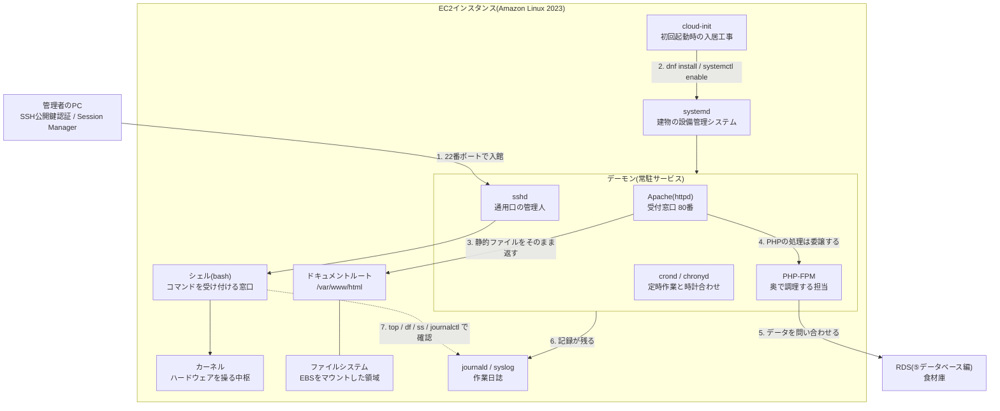

# AWS用語集 ⑨Linux・サーバー運用の基礎

> 📖 [用語集トップ(索引)に戻る](../02-glossary.md) ｜ [← 前: ⑧IaCとCI/CD](08-iac-cicd.md) ｜ [次: ⑩略語一覧と総まとめテスト →](10-abbreviations-and-quiz.md)

## この章で扱う範囲

この章は、**EC2にログインした「あと」に必要になる知識**をまとめたページです。ここまでの章は「部屋を借りて、鍵をかけて、電気を通す」までの話でしたが、部屋を借りただけではWebサイトは1ページも表示されません。部屋の中に入って、ソフトを入れて、常駐させて、動かなくなったら原因を調べる。この一連の作業を担うのがLinux(サーバーで最も広く使われている基本ソフト)の知識です。

サーバー構築エンジニアの面接では、AWSの構成図を説明できても「では、そのEC2にログインして `httpd` が起動しているかをどう確認しますか?」に答えられないと、「AWSのコンソールは触れるがサーバーは触れない人」という評価になってしまいます。この章は、その一線を越えるための章です。

具体的には、[レベル2: EC2 Webサーバー構築](../../projects/02-ec2-web-server/README.md)で `ssh` → `dnf install httpd` → `systemctl enable httpd` を実行する場面、[レベル3: 高可用性3層構成](../../projects/03-ha-three-tier/README.md)でユーザーデータ(EC2の初回起動時に自動実行されるスクリプト)にシェルスクリプトを書く場面、[レベル4: WordPress本番構成](../../projects/04-wordpress-production/README.md)でPHPとWordPressを載せ、`chown apache:apache` でファイルの持ち主を整える場面が、まるごとこの章の守備範囲です。



> 🧠 **覚え方のコツ**: この章の全体像は「**入る → 入れる → 常駐させる → 覗く**」の4段構えです。SSHで**入る**、dnfでソフトを**入れる**、systemdで**常駐させる**、top・df・ss・journalctlで**覗く**。AWSの用語は「建物の外側の話」、Linuxの用語は「建物の内側の話」と切り分けて、この4段の順に思い出してください。

## この章の用語ミニ索引

| 用語 | ひとことで言うと |
|---|---|
| [Linux](#linux) | サーバー用途で最も広く使われている無償の基本ソフト(OS) |
| [ディストリビューション](#ディストリビューション) | Linuxを実際に使える形にまとめた「配布版」の種類 |
| [Amazon Linux](#amazon-linux) | AWSが自ら開発・保守しているEC2向けのディストリビューション |
| [カーネル](#カーネル) | ハードウェアとソフトの間に立つ、OSの中核部分 |
| [シェル](#シェル) | 入力したコマンドを解釈してOSに伝える対話窓口 |
| [bash](#bash) | Linuxで最も標準的に使われているシェルの実装 |
| [rootユーザー](#rootユーザー) | Linux上で何でもできる最上位の管理者アカウント |
| [ec2-user](#ec2-user) | Amazon LinuxのEC2に最初から用意される作業用ユーザー |
| [sudo](#sudo) | 一時的に管理者権限でコマンドを実行するための仕組み |
| [パーミッション](#パーミッション) | ファイルごとに決められた「誰が何をしてよいか」の権限 |
| [chmod](#chmod) | ファイルのパーミッションを変更するコマンド |
| [chown](#chown) | ファイルの所有者・所有グループを変更するコマンド |
| [パッケージマネージャ](#パッケージマネージャ) | ソフトの導入・更新・削除を一元管理する仕組み |
| [dnf](#dnf) | Amazon Linux 2023などで使うパッケージマネージャ |
| [systemd](#systemd) | サービスの起動順や常駐を管理する、現在の標準の仕組み |
| [systemctl](#systemctl) | systemdへ「起動して」「自動起動にして」と指示するコマンド |
| [デーモン](#デーモン) | 画面を持たず、裏で常駐し続けるサービスのプロセス |
| [プロセス](#プロセス) | 実行中のプログラム1つ1つを指すOS上の単位 |
| [SSH公開鍵認証](#ssh公開鍵認証) | パスワードではなく鍵ペアで本人確認するログイン方式 |
| [sshd](#sshd) | サーバー側でSSH接続を待ち受けているデーモン |
| [scp](#scp) | SSHの通り道を使ってファイルを安全にコピーするコマンド |
| [cloud-init](#cloud-init) | 初回起動時にユーザーデータを実行する初期設定の仕組み |
| [ミドルウェア](#ミドルウェア) | OSとアプリの間に入り、土台の機能を提供するソフト群 |
| [Webサーバー](#webサーバー) | ブラウザからのリクエストを受けてページを返すソフト |
| [Apache](#apache) | 歴史が長く実績豊富な代表的Webサーバー(httpd) |
| [Nginx](#nginx) | 同時接続に強い、軽量で高速な代表的Webサーバー |
| [ドキュメントルート](#ドキュメントルート) | WebサーバーがWeb公開の起点にするディレクトリ |
| [リバースプロキシ設定](#リバースプロキシ設定) | リクエストを受けて背後の別プロセスへ中継する設定 |
| [PHP](#php) | WordPressなどWebアプリで広く使われるプログラミング言語 |
| [PHP-FPM](#php-fpm) | PHPの処理を専用の常駐プロセス群にまかせる仕組み |
| [WordPress](#wordpress) | 世界中で使われている代表的なPHP製のCMS |
| [CMS](#cms) | 記事や画像をブラウザから更新できるコンテンツ管理システム |
| [3層アーキテクチャ](#3層アーキテクチャ) | Web層・アプリ層・DB層に役割を分けた基本の構成 |
| [ファイルシステム](#ファイルシステム) | ディスク上にファイルを整理して置くための書式・仕組み |
| [マウント](#マウント) | ディスクをディレクトリの木構造に取り付けて使える状態にする操作 |
| [スワップ](#スワップ) | メモリが足りないときにディスクを一時的な代わりに使う領域 |
| [ロードアベレージ](#ロードアベレージ) | 実行待ちを含めた「サーバーの混み具合」を表す数値 |
| [top](#top) | CPU・メモリ・プロセスの状況をリアルタイムに見るコマンド |
| [df](#df) | ディスクの空き容量を確認するコマンド |
| [ss](#ss) | どのポートで何が待ち受けているかを確認するコマンド |
| [ポートリッスン](#ポートリッスン) | プロセスが特定のポートで接続を待ち受けている状態 |
| [syslog](#syslog) | OSやミドルウェアのログを集約する昔ながらの仕組み |
| [journalctl](#journalctl) | systemdが集めたログを検索・表示するコマンド |
| [curl](#curl) | コマンドラインからHTTPなどの通信を試せるツール |
| [dig](#dig) | 名前解決(DNS)の結果をコマンドで確認するツール |
| [jq](#jq) | JSONを整形・抽出するためのコマンドラインツール |
| [base64](#base64) | データを文字列だけで表現できる形に変換する符号化方式 |
| [cron](#cron) | 決まった時刻に決まった処理を自動実行する仕組み |
| [UTC](#utc) | 世界共通の基準時刻。AWSの既定はこちら |
| [タイムゾーン](#タイムゾーン) | どの地域の時刻でシステムを動かすかの設定 |
| [NTP](#ntp) | ネットワーク越しにサーバーの時計を正確に合わせる仕組み |
| [SELinux](#selinux) | プロセス単位でアクセスを強制的に制限するLinuxのセキュリティ機能 |

## 9-1. Linuxとは

### Linux

**読み方**: リナックス ｜ **重要度**: ★★★

**ひとことで言うと**: サーバー用途で最も広く使われている、無償で使えるOS(オペレーティングシステム。ハードウェアとアプリの橋渡しをする基本ソフト)です。

**たとえるなら**: 建物の「電気・水道・空調といった基礎設備一式」です。部屋(EC2)を借りただけでは何もできませんが、この設備が動いているからこそ、その上でお店(Webサーバーやアプリ)を開けます。

**もう少し詳しく**: AWSでEC2を起動するとき、[AMI](03-compute.md#ami)(サーバーの復元イメージ)として選ぶ選択肢の多くがLinuxです。WindowsサーバーがGUI(画面上のアイコンやボタンを操作する方式)中心なのに対し、Linuxサーバーは基本的にCUI(文字のコマンドで操作する方式)で運用します。最初は「黒い画面が怖い」と感じますが、逆に言えば**操作がすべて文字で表せる**ため、手順書にそのまま書け、[ユーザーデータ](03-compute.md#ユーザーデータ)や[IaC](08-iac-cicd.md#iac)で自動化しやすいという大きな利点があります。AWSの[責任共有モデル](01-cloud-basics.md#責任共有モデル)では、EC2の場合「OSより上は利用者の責任」です。つまりLinuxの設定・更新・セキュリティは、AWSではなく**あなたの仕事**になります。ここがマネージドサービス([RDS](05-database.md#rds)など)との決定的な違いです。

**サーバー構築での勘所**:
- 未経験からの学習では「コマンドを暗記する」より「**どこにファイルがあるか(`/etc` は設定、`/var/log` はログ、`/var/www` はWeb公開領域)**」を先に覚えるほうが早く実務に届きます。
- 面接では「LinuxとAWS、どちらの知識が必要ですか」と聞かれることがあります。答えは「両方」です。AWSはインフラの外側、Linuxは内側で、障害の原因はどちらにもあり得るためです。
- Linuxの操作に慣れるほど、EC2の[ユーザーデータ](03-compute.md#ユーザーデータ)や[Terraform](08-iac-cicd.md#terraform)の記述が正確になります。手で打てないコマンドは、自動化のコードにも書けません。

**よくあるつまずき**: 「Linuxが動かない」と感じる場面の多くは、実際にはLinuxではなくネットワーク側([セキュリティグループ](02-network.md#セキュリティグループ)やルートテーブル)の問題です。切り分けの原則は「**サーバーの中から自分自身を叩いて動くなら、原因は外側**」です(例: サーバー内で `curl http://localhost` が成功するなら、Webサーバーは正常でネットワーク側を疑います)。

**関連用語**: [ディストリビューション](#ディストリビューション)、[カーネル](#カーネル)、[シェル](#シェル)、[Amazon Linux](#amazon-linux)

**登場する案件**: [レベル2: EC2 Webサーバー構築](../../projects/02-ec2-web-server/README.md)

### ディストリビューション

**読み方**: ディストリビューション ｜ **重要度**: ★★

**ひとことで言うと**: Linuxの中核部分に、必要なツールや管理の仕組みをひとまとめにして配布している「製品としてのLinux」の種類です。

**たとえるなら**: 同じ「マンション」でも、施工会社によって設備の型番や配管の流儀が違うようなものです。骨組み(カーネル)は共通でも、備え付けの設備(コマンドや設定ファイルの置き場所)が微妙に異なります。

**もう少し詳しく**: 代表的な系統は大きく2つに分かれます。1つはRed Hat系(Red Hat Enterprise Linux、Rocky Linux、[Amazon Linux](#amazon-linux) など)で、パッケージ管理に `dnf`/`yum` を使い、Webサーバーの設定は `/etc/httpd/` に置かれます。もう1つはDebian系(Debian、Ubuntu など)で、パッケージ管理に `apt` を使い、設定は `/etc/apache2/` に置かれます。**同じApacheを入れても、コマンドもファイルの場所も違う**ため、ネット上の手順書をそのまま真似して動かない原因の多くはここにあります。「その手順書はどのディストリビューション向けか」を最初に確認する癖をつけてください。

**サーバー構築での勘所**:
- 業務では「案件で指定されたディストリビューションに合わせる」のが基本です。自分の好みで選べる場面は多くありません。
- 迷ったら、自分が今どれを使っているかを `cat /etc/os-release` で確認します。1コマンドで判別できます。
- 同じ系統でもバージョンが上がると既定値が変わります(例: Amazon Linux 2は `yum`、Amazon Linux 2023は `dnf` が標準)。

**関連用語**: [Linux](#linux)、[Amazon Linux](#amazon-linux)、[パッケージマネージャ](#パッケージマネージャ)、[dnf](#dnf)

### Amazon Linux

**読み方**: アマゾンリナックス ｜ **重要度**: ★★★

**ひとことで言うと**: AWSが自ら開発・保守している、EC2で使うことを前提としたLinuxディストリビューションです。

**たとえるなら**: そのマンションを建てた施工会社が、自社の建物専用に用意した「純正の設備パッケージ」です。他社製でも動きますが、純正品は最初から配線が合っていて、サポート窓口も同じです。

**もう少し詳しく**: このポートフォリオでは全レベルを通じて **Amazon Linux 2023** を使っています。EC2向けに最適化されており、AWS CLI や[SSM Agent](07-monitoring-operations.md#systems-manager)といった、AWS運用でほぼ必ず使うツールが初めから入っている(または導入が容易な)点が最大の利点です。[Session Manager](07-monitoring-operations.md#session-manager)で鍵なし接続ができるのも、この Agent が同梱されているおかげです。Amazon Linux 2023 は Amazon Linux 2 の後継で、パッケージ管理が `yum` から [dnf](#dnf) に、ログの見方が `/var/log/messages` 中心から [journalctl](#journalctl) 中心に変わっています。**ネットの古い記事は Amazon Linux 2 向けであることが多い**ため、コマンドが通らないときはまずこの世代差を疑ってください。AMIの利用自体に追加のライセンス料はかかりません(Red Hat Enterprise Linux などの商用ディストリビューションでは、AMI利用料に相当する追加費用が発生します)。サポート期間や更新方針の最新情報は、必ず[公式ドキュメント](https://aws.amazon.com/jp/linux/amazon-linux-2023/)で確認してください。

**サーバー構築での勘所**:
- 起動テンプレートやTerraformにAMI IDを直書きしないのが定石です。AMI IDはリージョンごとに異なり、更新のたびに変わるため、[Parameter Store](06-security-identity.md#parameter-store)の公開パラメータ(`/aws/service/ami-amazon-linux-latest/...`)から最新IDを取得します。
- Amazon Linux 2023 では時刻の既定が[UTC](#utc)、[SELinux](#selinux)の既定が警告のみのモードなど、Amazon Linux 2 と既定値が異なる項目があります。移行時はここを必ず確認します。
- 「なぜAmazon Linuxを選んだのか」は面接で説明できるようにしておきます。AWSとの親和性・追加ライセンス費用が不要・SSM Agent同梱の3点で十分な理由になります。

**よくあるつまずき**: Amazon Linux 2023 で `sudo yum install` と打っても動くことがありますが、これは互換のための入口が用意されているだけです。手順書には `dnf` と書くほうが誤解がありません。また、Amazon Linux 2 向けの記事にある `amazon-linux-extras` は Amazon Linux 2023 には存在しません。

**💰 コスト**: Amazon LinuxのAMI自体に追加費用はかからず、[EC2](03-compute.md#ec2)の稼働時間と[EBS](04-storage.md#ebs)の容量に対してのみ課金されます。最新の料金・無料利用枠の条件は必ず公式ページで確認してください([AWS無料利用枠](https://aws.amazon.com/jp/free/))。

**関連用語**: [ディストリビューション](#ディストリビューション)、[dnf](#dnf)、[ec2-user](#ec2-user)、[cloud-init](#cloud-init)

**登場する案件**: [レベル2: EC2 Webサーバー構築](../../projects/02-ec2-web-server/README.md)、[レベル3: 高可用性3層構成](../../projects/03-ha-three-tier/README.md)、[レベル4: WordPress本番構成](../../projects/04-wordpress-production/README.md)

### カーネル

**読み方**: カーネル ｜ **重要度**: ★★

**ひとことで言うと**: CPU・メモリ・ディスク・ネットワークといったハードウェアを直接管理する、OSの中核プログラムです。

**たとえるなら**: 建物の「電気室・配電盤」です。普段の生活で住人が触ることはありませんが、ここが止まると建物全体が止まります。

**もう少し詳しく**: 私たちがコマンドで行う操作(ファイルを読む、通信する、プロセスを起動する)は、最終的にすべてカーネルへの依頼として処理されます。厳密に言うと「Linux」という言葉が指すのはこのカーネル部分で、そこにコマンド群や管理ツールを組み合わせて製品化したものが[ディストリビューション](#ディストリビューション)です。EC2ではカーネルのバージョンを `uname -r` で確認できます。カーネルの更新を反映するには基本的に**OSの再起動が必要**で、これが「セキュリティパッチを当てたのに再起動していないので効いていない」という事故につながりがちです。[Auto Scaling Group](03-compute.md#auto-scaling-group)を使っている環境では、サーバーに入ってパッチを当てるより、**更新済みの[AMI](03-compute.md#ami)を作り直してインスタンスごと置き換える**ほうが確実で、これがクラウドらしい運用の考え方です。

**サーバー構築での勘所**:
- 台数が増えたらパッチ適用は手作業では回りません。[Patch Manager](07-monitoring-operations.md#patch-manager)で計画的に適用するか、AMIを作り直す運用に切り替えます。
- 「メモリ不足でプロセスが突然消えた」ときは、カーネルのOOM Killer(メモリ枯渇時にプロセスを強制終了する仕組み)が働いた可能性があります。`journalctl` や `dmesg` に記録が残ります。

**関連用語**: [Linux](#linux)、[プロセス](#プロセス)、[スワップ](#スワップ)、[journalctl](#journalctl)

### シェル

**読み方**: シェル ｜ **重要度**: ★★★

**ひとことで言うと**: 人間が入力したコマンドを解釈して、OS(カーネル)に実行を依頼してくれる対話用のプログラムです。

**たとえるなら**: 建物の「管理人室の受付窓口」です。住人は電気室(カーネル)に直接立ち入らず、窓口(シェル)に用件を伝えます。窓口は用件を正しい部署に取り次いでくれます。

**もう少し詳しく**: SSHでEC2に接続したときに表示される `[ec2-user@ip-10-0-1-10 ~]$` というプロンプトが、シェルが入力を待っている状態です。シェルは単にコマンドを渡すだけでなく、複数のコマンドをパイプ(`|`)でつないだり、出力をファイルへリダイレクト(`>`)したり、変数や条件分岐を使ってスクリプトを書いたりできます。この「**複数の作業を1本の手順として書き残せる**」性質が、サーバー運用の自動化の出発点です。EC2の[ユーザーデータ](03-compute.md#ユーザーデータ)に貼り付けるスクリプトも、[CodeBuild](08-iac-cicd.md#codebuild)の `buildspec.yml` に書くコマンドも、中身はシェルのコマンド列です。

**サーバー構築での勘所**:
- 先頭行の `#!/bin/bash`(シバンと呼びます)は「このファイルをどのシェルで実行するか」の宣言です。ユーザーデータでは、これが無いと期待どおりに実行されないことがあります。
- 破壊的なコマンド(`rm -rf` など)は、実行前に必ず対象パスを `ls` で確認する癖をつけてください。Linuxのシェルに「元に戻す」機能はありません。
- 対話操作で慣れたコマンドを、そのままスクリプト化していくのが上達の最短ルートです。

**関連用語**: [bash](#bash)、[Linux](#linux)、[cloud-init](#cloud-init)、[cron](#cron)

### bash

**正式名称**: Bourne-Again SHell ｜ **読み方**: バッシュ ｜ **重要度**: ★★★

**ひとことで言うと**: Linuxで最も標準的に使われているシェルの実装で、対話操作にもスクリプトにも使われます。

**たとえるなら**: 受付窓口(シェル)に配属されている「いちばん経験豊富な標準スタッフ」です。他のスタッフ(zshやshなど)もいますが、まずはこの人の作法を覚えれば大抵の現場で通用します。

**もう少し詳しく**: Amazon Linuxにログインすると、既定ではbashが起動します。実務で頻出するのは次の書き方です。変数展開 `${VAR}`、コマンド置換 `$(コマンド)`、パイプ `コマンドA | コマンドB`、リダイレクト `> file`(上書き)と `>> file`(追記)。たとえばレベル3のユーザーデータにある `INSTANCE_ID=$(curl -s http://169.254.169.254/latest/meta-data/instance-id)` は、「curlの実行結果を変数に入れる」というコマンド置換そのものです。このポートフォリオのハンズオンキット(`build.sh` / `cleanup.sh`)もbashスクリプトで書かれています。

**サーバー構築での勘所**:
- 変数は必ず `"${VAR}"` のようにダブルクォートで囲みます。空白を含む値でコマンドが壊れる事故を防げます。
- 自動化スクリプトの冒頭に `set -euo pipefail` を書くと、「エラーが起きたのに処理が進んでしまう」事故を防げます(`-e` はエラーで停止、`-u` は未定義変数をエラー、`pipefail` はパイプ途中の失敗も検知)。
- 手元のPCがmacOSやWSL(Windows上でLinuxを動かす仕組み)の場合、同じbashでもバージョン差でオプションが通らないことがあります。ハンズオンキットの前提環境の記載を確認してください。

**関連用語**: [シェル](#シェル)、[cloud-init](#cloud-init)、[base64](#base64)、[jq](#jq)

**登場する案件**: [レベル3: 高可用性3層構成](../../projects/03-ha-three-tier/README.md)、[レベル6: IaCとCI/CD](../../projects/06-iac-cicd/README.md)

## 9-2. ユーザーと権限

### rootユーザー

**読み方**: ルートユーザー ｜ **重要度**: ★★★

**ひとことで言うと**: Linuxのサーバー内部で、あらゆるファイル操作・設定変更ができる最上位の管理者アカウントです。

**たとえるなら**: 建物の「マスターキーを持つ管理人」です。すべての部屋を開けられるので便利ですが、そのぶん間違えたときの被害も最大になります。

**⚠️ AWSの「ルートユーザー」とは別物です**: ①クラウド編に出てくる[ルートユーザー](01-cloud-basics.md#ルートユーザー)は、**AWSアカウント全体を管理する、AWS側の最上位アカウント**です。一方この章のrootユーザーは、**EC2というサーバー1台の中だけの管理者**です。名前は同じでも管理する範囲がまったく異なるので、面接や実務で取り違えないよう注意してください。

**もう少し詳しく**: Linuxではユーザーごとにできることが決まっており、ソフトのインストール(`/usr` への書き込み)や設定変更(`/etc` への書き込み)には管理者権限が要ります。しかし普段からrootとしてログインして作業すると、`rm` のタイプミス1つでシステムを破壊しかねません。そこで現在の標準的な運用は、「**普段は一般ユーザーで作業し、管理者権限が必要な瞬間だけ[sudo](#sudo)を付ける**」というスタイルです。Amazon LinuxのEC2では、そもそもrootでの直接SSHログインが無効化されており、rootで接続しようとすると「`Please login as the user "ec2-user" rather than the user "root"`」という趣旨のメッセージが表示されます。これは不便な制限ではなく、**攻撃者がユーザー名を推測しにくくするための安全設計**です。

**サーバー構築での勘所**:
- 手順書に「rootで実行」と書かず、「`sudo` を付けて実行」と書きます。誰が実行しても同じ結果になり、[sudo](#sudo)のログに操作者が残ります。
- rootでのSSHログイン可否は `/etc/ssh/sshd_config` の `PermitRootLogin` で決まります。本番環境では無効のままにします。
- [ユーザーデータ](03-compute.md#ユーザーデータ)や[cloud-init](#cloud-init)のスクリプトは**root権限で実行される**ため、その中では `sudo` を書く必要がありません(レベル3のユーザーデータに `sudo` が無いのはこのためです)。

**関連用語**: [sudo](#sudo)、[ec2-user](#ec2-user)、[パーミッション](#パーミッション)、[sshd](#sshd)

### ec2-user

**読み方**: イーシーツーユーザー ｜ **重要度**: ★★★

**ひとことで言うと**: Amazon LinuxのEC2に最初から用意されている、SSHでログインするための既定の作業用ユーザーです。

**たとえるなら**: 入居時に渡される「あなた名義の部屋の鍵と入館証」です。マスターキー(root)ではありませんが、管理人に一声かければ(sudo)必要な作業はできます。

**もう少し詳しく**: EC2にSSH接続するときのユーザー名は**AMIごとに決まっています**。Amazon Linuxは `ec2-user`、Ubuntuは `ubuntu`、Debianは `admin` または `debian`、RHELは `ec2-user` または `root` といった具合です。接続時に指定した[キーペア](03-compute.md#キーペア)の公開鍵は、[cloud-init](#cloud-init)によって `/home/ec2-user/.ssh/authorized_keys` に自動的に書き込まれます。つまり「鍵をAWSに登録する」という操作の実体は、「起動時にこのファイルへ公開鍵を1行追記する」処理です。ec2-userは既定でパスワードなしの `sudo` が使えるよう設定されているため、実質的にサーバーの全権を持ちます。**このユーザーの鍵を失うことは、サーバーの管理権限を失うことと同義**です。

**サーバー構築での勘所**:
- 複数人で運用する場合、全員でec2-userを共用すると「誰がやったか」が追えなくなります。人ごとにOSユーザーを作るか、そもそも[Session Manager](07-monitoring-operations.md#session-manager)へ移行してAWS側のログで追跡できるようにします。
- Webの公開ファイルはec2-userではなくWebサーバーの実行ユーザー(Amazon LinuxのApacheでは `apache`)が読める必要があります。ここが[chown](#chown)の出番です。
- 秘密鍵(`.pem`)を紛失するとSSHでは入れなくなります。保険として、あらかじめ[Session Manager](07-monitoring-operations.md#session-manager)で入れるように[IAMロール](06-security-identity.md#iamロール)を付けておくと安全です。

**よくあるつまずき**: `ssh -i key.pem root@<IP>` や `ssh -i key.pem ubuntu@<IP>` としてしまい `Permission denied (publickey)` になるのは典型的な失敗です。まずAMIに対応した既定ユーザー名を確認してください。

**関連用語**: [SSH公開鍵認証](#ssh公開鍵認証)、[rootユーザー](#rootユーザー)、[sudo](#sudo)、[cloud-init](#cloud-init)

**登場する案件**: [レベル2: EC2 Webサーバー構築](../../projects/02-ec2-web-server/README.md)

### sudo

**正式名称**: superuser do ｜ **読み方**: スドゥ/サドゥ ｜ **重要度**: ★★★

**ひとことで言うと**: 一般ユーザーのまま、そのコマンドの実行時だけ管理者(root)権限を借りるための仕組みです。

**たとえるなら**: 「管理人に立ち会ってもらって、共用部の鍵を1回だけ開けてもらう」手続きです。マスターキーそのものを渡されるわけではないので、開けた記録も残ります。

**もう少し詳しく**: `sudo dnf install -y httpd` のようにコマンドの前に付けて使います。誰がどのコマンドをsudoで実行できるかは `/etc/sudoers`(および `/etc/sudoers.d/` 配下)で定義され、実行内容はログに記録されます。この「**権限を常時持たせず、必要なときだけ借りる**」という考え方は、AWSの[IAMロール](06-security-identity.md#iamロール)や[最小権限の原則](06-security-identity.md#最小権限の原則)とまったく同じ発想です。面接で「最小権限を実務でどう意識していますか」と聞かれたとき、AWS側のIAMだけでなくOS側のsudo運用まで答えられると、理解の深さが伝わります。

**サーバー構築での勘所**:
- リダイレクトはsudoの効果が及ばない点に注意します。`sudo echo "text" > /var/www/html/index.html` は、書き込みを行うのがsudoではなくシェル自身のため権限エラーになります。レベル2の手順が `echo ... | sudo tee /var/www/html/index.html` となっているのはこれが理由です。
- `sudo -i` や `sudo su -` でroot状態に居座るのは避けます。作業のたびにsudoを付けるほうが、誤操作の範囲を小さく保てます。
- ⚠️ `/etc/sudoers` を直接編集するときは必ず `visudo` を使います。文法ミスのまま保存すると、誰もsudoを使えなくなる可能性があります。

**関連用語**: [rootユーザー](#rootユーザー)、[ec2-user](#ec2-user)、[パーミッション](#パーミッション)、[最小権限の原則](06-security-identity.md#最小権限の原則)

**登場する案件**: [レベル2: EC2 Webサーバー構築](../../projects/02-ec2-web-server/README.md)、[レベル4: WordPress本番構成](../../projects/04-wordpress-production/README.md)

### パーミッション

**読み方**: パーミッション ｜ **重要度**: ★★★

**ひとことで言うと**: ファイルやディレクトリごとに設定された「所有者・グループ・その他の人が、それぞれ何をしてよいか」という権限のことです。

**たとえるなら**: 部屋ごとに決められた「本人・同じ部署の人・それ以外の人」の入室ルールです。同じ建物の中でも、部屋によって入れる人が違います。

**もう少し詳しく**: `ls -l` を実行すると `-rw-r--r--` のような文字列が表示されます。これは先頭1文字が種別(`-` はファイル、`d` はディレクトリ)、続く3文字ずつが「所有者(user)」「グループ(group)」「その他(other)」の権限で、`r`=読み取り(4)、`w`=書き込み(2)、`x`=実行(4ではなく1)を表します。数字表記はこの合計で、`644` なら「所有者は読み書き、他は読み取りのみ」、`755` なら「所有者は全部、他は読み取りと実行」、`600` なら「所有者だけが読み書き」です。**ディレクトリの `x` は「その中に入れる(通過できる)」を意味する**点が、初心者がつまずきやすいところです。読み取り権限があっても `x` がないディレクトリは中身をたどれません。

**サーバー構築での勘所**:
- Webの公開ファイルは、ディレクトリ `755` / ファイル `644` が基本です。誰でも書き込める `777` は、侵入されたときにファイルを改ざんされる入口になるため、原則として使いません。
- SSHの鍵ファイルは厳格です。秘密鍵は `600`(または `400`)、`~/.ssh` ディレクトリは `700` にします。緩いと[sshd](#sshd)が接続を拒否します。
- 「権限を緩めれば動く」は最後の手段です。まず「**誰の権限で動いているプロセスが、どのファイルを触ろうとして失敗したのか**」を特定してから、必要最小限だけを緩めます。

**よくあるつまずき**: WordPressの管理画面で「ファイルを書き込めません」と出るのは、`/var/www/html` 配下の所有者がWebサーバーの実行ユーザー(`apache`)になっていないことが原因のことが多いです。パーミッションを `777` にして解決するのではなく、[chown](#chown)で所有者を正すのが正しい対処です。

**関連用語**: [chmod](#chmod)、[chown](#chown)、[SSH公開鍵認証](#ssh公開鍵認証)、[ドキュメントルート](#ドキュメントルート)

**登場する案件**: [レベル2: EC2 Webサーバー構築](../../projects/02-ec2-web-server/README.md)、[レベル4: WordPress本番構成](../../projects/04-wordpress-production/README.md)

### chmod

**正式名称**: change mode ｜ **読み方**: チモド/シェンジモード ｜ **重要度**: ★★★

**ひとことで言うと**: ファイルやディレクトリのパーミッション(権限)を変更するコマンドです。

**たとえるなら**: 部屋の入室ルールを書き換える手続きです。「この部屋は本人だけ」「この部屋は誰でも閲覧可」と札を付け替えるイメージです。

**もう少し詳しく**: 数字で指定する方法(`chmod 600 key.pem`)と、記号で指定する方法(`chmod u+x script.sh` = 所有者に実行権限を追加)の2通りがあります。実務で最初に必ず出会うのが、レベル2の手順にある `chmod 400 handson-key.pem` です。これは「所有者だけが読める、書き込みも実行もできない」状態にする操作で、これを行わないと[sshd](#sshd)側が「鍵ファイルの権限が緩すぎる」と判断して接続を拒否します。鍵ファイルは他人に読めた時点で価値を失うため、SSHはあえて厳しくチェックしているのです。

**サーバー構築での勘所**:
- ⚠️ ディレクトリ配下をまとめて変える `-R`(再帰)は便利ですが危険です。ファイルとディレクトリで適切な値が違う(`644` と `755`)ため、`find` と組み合わせて分けて適用するほうが安全です。
- スクリプトを直接実行したい場合は `chmod +x` が必要です。ただし `bash script.sh` と呼び出す形なら実行権限は不要です。
- Windows環境からコピーした鍵ファイルは権限が正しく引き継がれないことがあります。WSLやGit Bashで接続できないときは、まず `ls -l` で権限を確認してください。

**関連用語**: [パーミッション](#パーミッション)、[chown](#chown)、[SSH公開鍵認証](#ssh公開鍵認証)

**登場する案件**: [レベル2: EC2 Webサーバー構築](../../projects/02-ec2-web-server/README.md)

### chown

**正式名称**: change owner ｜ **読み方**: チャウン ｜ **重要度**: ★★

**ひとことで言うと**: ファイルやディレクトリの「所有者」と「所有グループ」を変更するコマンドです。

**たとえるなら**: 部屋の名義変更です。鍵のルール(パーミッション)を変えなくても、名義が変われば入れる人が変わります。

**もう少し詳しく**: 書式は `chown ユーザー:グループ 対象` です。レベル4のWordPress構築で実行する `sudo chown -R apache:apache /var/www/html` は、「`/var/www/html` 以下すべての持ち主を、Apacheの実行ユーザーである `apache` にする」という意味です。なぜ必要かというと、WordPressはプラグインの導入・テーマの更新・画像のアップロードといった処理を**Webサーバーのプロセスの権限で**行うためです。持ち主が `root` や `ec2-user` のままだと、書き込みが必要な操作がすべて失敗します。逆に、書き込みが不要なファイルまでApache所有にすると、侵入されたときに改ざんできる範囲が広がるため、**書き込みが必要な場所だけをApache所有にする**のが本来望ましい形です。

**サーバー構築での勘所**:
- WordPressで所有者をApacheにしたい代表格は `wp-content/uploads`(アップロード先)です。全体をApache所有にするのは手軽ですが、セキュリティとのトレードオフを理解したうえで選びます。
- `-R` を付けた再帰変更は取り消しが効きません。対象パスの打ち間違いに注意してください。
- そもそも複数台構成では、アップロードファイルをサーバー内に持たず[S3](04-storage.md#s3)へ逃がすのが定石です(レベル4のメディアオフロード)。所有者問題そのものが小さくなります。

**関連用語**: [パーミッション](#パーミッション)、[chmod](#chmod)、[Apache](#apache)、[WordPress](#wordpress)

**登場する案件**: [レベル4: WordPress本番構成](../../projects/04-wordpress-production/README.md)

> 🧠 **覚え方のコツ**: パーミッションの数字は「**読(4)・書(2)・実行(1)**」の足し算だけで読めます。4+2+1=7で全部、4+2=6で読み書き、4+1=5で読み取りと実行。あとは3桁を「**本人・仲間・他人**」の順に並べるだけです。だから `644` は「本人は読み書き、仲間と他人は読むだけ」、`755` は「本人は全部、仲間と他人は読んで通れる」、`400` は「本人が読むだけ、他は何もできない」。SSHの秘密鍵を `400` にするのは、この最後の形が「自分以外は一切触れない」という意味だからです。合言葉は「**シ・ニ・イチ(4・2・1)を、ホン・ナカ・タ(本人・仲間・他人)の順に**」です。

## 9-3. ソフトウェアの導入と起動

### パッケージマネージャ

**読み方**: パッケージマネージャ ｜ **重要度**: ★★★

**ひとことで言うと**: ソフトの導入・更新・削除と、その依存関係の解決を一括で面倒みてくれる仕組みです。

**たとえるなら**: 建物の「設備の手配窓口」です。エアコンを1台頼めば、必要な配管や電源工事もまとめて手配してくれます。自分で部品を1つずつ買い集める必要はありません。

**もう少し詳しく**: Linuxでソフトを入れる方法には、公式サイトからソースコードをダウンロードして自分でビルドする方法もありますが、実務ではまずパッケージマネージャを使います。理由は3つあります。(1)**依存する別のソフトも自動で入れてくれる**、(2)**更新をコマンド1つでまとめて適用できる**、(3)**何が入っているかを一覧でき、監査に耐える**からです。Red Hat系では[dnf](#dnf)(旧 `yum`)、Debian系では `apt` が使われ、どのパッケージをどこから取得するかは「リポジトリ」という配布元の設定で決まります。

**サーバー構築での勘所**:
- ネットの記事にある `make install` 手順を安易に使わないでください。更新もアンインストールも手作業になり、後任が困ります。
- [プライベートサブネット](02-network.md#プライベートサブネット)のEC2は、そのままでは配布元に到達できません。[NATゲートウェイ](02-network.md#natゲートウェイ)経由で外に出るか、[VPCエンドポイント](02-network.md#vpcエンドポイント)を使う設計が必要です。「ユーザーデータでdnfが止まる」原因の多くはこれです。
- 本番環境では「いつでも最新に更新」は必ずしも正解ではありません。更新でアプリが動かなくなるリスクがあるため、[Patch Manager](07-monitoring-operations.md#patch-manager)で検証環境から順に当てるのが実務です。

**関連用語**: [dnf](#dnf)、[ディストリビューション](#ディストリビューション)、[Amazon Linux](#amazon-linux)、[ミドルウェア](#ミドルウェア)

### dnf

**正式名称**: Dandified YUM ｜ **読み方**: ディーエヌエフ ｜ **重要度**: ★★★

**ひとことで言うと**: Amazon Linux 2023 などのRed Hat系ディストリビューションで使う、標準のパッケージマネージャコマンドです。

**たとえるなら**: 設備の手配窓口(パッケージマネージャ)に置かれた「注文書」そのものです。品名を書いて出せば、必要な部材ごと届きます。

**もう少し詳しく**: このポートフォリオで最初に打つLinuxコマンドが `sudo dnf install -y httpd` です。`-y` は確認プロンプトへ自動的に「はい」と答えるオプションで、対話できないユーザーデータやスクリプトの中では**必須**です。よく使う操作は次のとおりです。

```bash
sudo dnf update -y                 # 導入済みパッケージをまとめて更新
sudo dnf install -y httpd php-fpm  # 複数まとめて導入
dnf list installed | grep httpd    # 導入済みか確認
dnf provides '*/dig'               # そのコマンドがどのパッケージに含まれるか調べる
sudo dnf remove -y httpd           # 削除
```

Amazon Linux 2023 には、同じAMIから起動する限り同じパッケージ構成が再現されるよう更新を固定する仕組みが用意されています。詳細な挙動は[Amazon Linux 2023の公式ページ](https://aws.amazon.com/jp/linux/amazon-linux-2023/)で確認してください。

**サーバー構築での勘所**:
- `dnf provides` は非常に便利です。`dig` が見つからないときに「`bind-utils` を入れればよい」とすぐ分かります。
- ユーザーデータ内では対話ができないため、`-y` の付け忘れは「起動したのにApacheが入っていない」という無言の失敗になります。
- 更新に失敗するときは、まず外に出られるか(`curl -I https://aws.amazon.com` など)を確認します。原因はdnfではなくネットワーク設定であることがほとんどです。

**よくあるつまずき**: Amazon Linux 2 向けの記事にある `yum install -y amazon-linux-extras` などのコマンドは、Amazon Linux 2023 では通りません。まず `cat /etc/os-release` で世代を確認してください。

**関連用語**: [パッケージマネージャ](#パッケージマネージャ)、[Amazon Linux](#amazon-linux)、[systemctl](#systemctl)、[cloud-init](#cloud-init)

**登場する案件**: [レベル2: EC2 Webサーバー構築](../../projects/02-ec2-web-server/README.md)、[レベル3: 高可用性3層構成](../../projects/03-ha-three-tier/README.md)、[レベル4: WordPress本番構成](../../projects/04-wordpress-production/README.md)

### systemd

**読み方**: システムディー ｜ **重要度**: ★★★

**ひとことで言うと**: OSの起動時にどのサービスをどの順番で立ち上げるかを管理し、常駐サービスの面倒を見続ける、現在のLinuxの標準的な仕組みです。

**たとえるなら**: 建物の「設備管理システム(BAS)」です。朝になったら照明・空調・エレベーターを決まった順に立ち上げ、止まった設備があれば検知して再起動します。

**もう少し詳しく**: systemdは、管理対象を「ユニット」という単位で扱います。サービスを表す `.service`(例: `httpd.service`)、まとまった状態を表す `.target`、時刻起動を表す `.timer` などがあります。ユニットの定義ファイルは `/usr/lib/systemd/system/`(パッケージが提供するもの)や `/etc/systemd/system/`(管理者が上書きするもの)に置かれ、その中に「起動コマンド」「異常終了したときに再起動するか」「どのサービスの後に起動するか」といった条件が書かれています。**サーバーが再起動してもサービスが自動で立ち上がるのは、systemdに「自動起動する」と登録されているから**であり、この登録操作が [systemctl](#systemctl) の `enable` です。

**サーバー構築での勘所**:
- ユニットファイルを編集・追加したら `sudo systemctl daemon-reload` が必要です。これを忘れると変更が反映されません。
- `Restart=always` のような設定で、プロセスが落ちても自動復旧させられます。ただしこれは1台の中の話で、**サーバーごと落ちた場合は救えません**。その役割は[Auto Scaling Group](03-compute.md#auto-scaling-group)が担います。「OS内の自動復旧(systemd)」と「インスタンスの自動復旧(ASG)」は別レイヤーだと整理してください。
- ログは[journalctl](#journalctl)に集約されます。「起動しない」ときは、まず `systemctl status` と `journalctl -u <サービス名>` の2つを見ます。

**関連用語**: [systemctl](#systemctl)、[デーモン](#デーモン)、[journalctl](#journalctl)、[cron](#cron)

### systemctl

**読み方**: システムシーティーエル ｜ **重要度**: ★★★

**ひとことで言うと**: systemdに対して「起動して」「止めて」「自動起動にして」「今どうなっている?」と指示・確認するためのコマンドです。

**たとえるなら**: 設備管理システムの「操作パネル」です。ボタンひとつで空調を入れたり、朝の自動運転を予約したりできます。

**もう少し詳しく**: サーバー構築で覚えるべきサブコマンドは、実質この5つだけです。

```bash
sudo systemctl start httpd     # 今すぐ起動する(再起動すると消える)
sudo systemctl enable httpd    # OS起動時の自動起動を登録する
sudo systemctl enable --now httpd  # 上の2つを同時に行う
systemctl status httpd         # 状態を確認する(active (running) が正常)
sudo systemctl restart httpd   # 設定変更後に反映する
```

ここで**最重要なのが `start` と `enable` の違い**です。`start` は「今この場で起動する」だけなので、EC2を再起動するとサービスは止まったままになります。`enable` は「次回以降のOS起動時にも自動で立ち上げる」という登録です。レベル2の手順が `start` と `enable` の両方を実行しているのはこのためで、レベル4では両方をまとめた `systemctl enable --now httpd php-fpm` を使っています。設定ファイルを書き換えたときは `restart`(停止して起動)か、対応しているサービスなら接続を切らずに再読み込みする `reload` を使います。

**サーバー構築での勘所**:
- `enable` の付け忘れは、**普段は気づかず、再起動やAuto Scalingでの入れ替え時に初めて発覚する**やっかいな事故です。手順書には必ずセットで書きます。
- `systemctl status` の出力には、直近のログ数行も一緒に表示されます。まずここを読むのが調査の第一歩です。
- Apacheの設定変更時は、`sudo apachectl configtest`(または `httpd -t`)で構文を検証してから `restart` すると、設定ミスでサービスが上がらなくなる事故を防げます。

**よくあるつまずき**: 「昨日は見えていたページが、インスタンスを再起動したら見えない」の典型原因が `enable` 忘れです。`systemctl is-enabled httpd` で登録状況を確認できます。

**関連用語**: [systemd](#systemd)、[デーモン](#デーモン)、[Apache](#apache)、[journalctl](#journalctl)

**登場する案件**: [レベル2: EC2 Webサーバー構築](../../projects/02-ec2-web-server/README.md)、[レベル3: 高可用性3層構成](../../projects/03-ha-three-tier/README.md)、[レベル4: WordPress本番構成](../../projects/04-wordpress-production/README.md)

### デーモン

**読み方**: デーモン ｜ **重要度**: ★★

**ひとことで言うと**: 画面を持たず、裏側で常駐し続けて要求を待っているサービスのプロセスです。

**たとえるなら**: 建物に常駐している「窓口スタッフ」です。お客が来ても来なくても持ち場に立ち続け、来たらすぐ対応します。

**もう少し詳しく**: 名前の末尾に `d` が付くものが多いのが特徴で、Webサーバーの `httpd`、SSHの `sshd`、時刻同期の `chronyd`、定時実行の `crond` などが代表例です。デーモンは起動すると特定の[ポート](02-network.md#ポート番号)で待ち受け([ポートリッスン](#ポートリッスン))、リクエストが来るたびに処理します。「サーバーが動いている」という状態は、正確には「必要なデーモンが起動し、想定したポートで待ち受けている」状態のことです。逆に言えば、障害調査は「**そのデーモンは生きているか([systemctl](#systemctl) status)**」「**想定のポートで待っているか([ss](#ss))**」の2点確認から始めれば、大半の切り分けができます。

**サーバー構築での勘所**:
- デーモンには実行ユーザーがあります。Apacheは `apache`、PHP-FPMも既定では `apache` として動くことが多く、この実行ユーザーが[パーミッション](#パーミッション)の話に直結します。
- 「起動しているのに応答しない」ときは、デーモンがフリーズしているか、ワーカープロセスを使い切っている可能性があります。`top` や `ss` の状態も併せて確認します。
- [CloudWatchエージェント](07-monitoring-operations.md#cloudwatchエージェント)やSSM Agentも、EC2上で動くデーモンの一種です。監視が来ないときは、これらの死活も確認します。

**関連用語**: [systemd](#systemd)、[プロセス](#プロセス)、[ポートリッスン](#ポートリッスン)、[sshd](#sshd)

### プロセス

**読み方**: プロセス ｜ **重要度**: ★★

**ひとことで言うと**: 実行中のプログラム1つ1つを表す、OS上の管理単位です。

**たとえるなら**: 建物の中で今まさに働いている「作業員1人ひとり」です。同じ業務(プログラム)でも、人数(プロセス数)が増えればそのぶん場所(メモリ)と手間(CPU)を使います。

**もう少し詳しく**: 各プロセスにはPID(プロセスID)という番号が振られ、`ps aux` や [top](#top) で一覧できます。プロセスは親子関係を持ち、たとえばApacheは親プロセスが1つと、実際にリクエストを捌く子プロセス(ワーカー)が複数という構成をとります。[PHP-FPM](#php-fpm)も同様に、親プロセスが子プロセス群を管理します。ここを理解していると、「アクセスが増えたときにメモリを食い潰す理由」がわかります。**同時アクセス数が増える=子プロセスが増える=メモリ使用量が増える**ため、小さいインスタンスでは同時実行数の上限設定が重要になるのです。

**サーバー構築での勘所**:
- プロセスが応答しないときは `kill <PID>`(丁寧な終了要求)を先に試し、`kill -9`(強制終了)は最後の手段にします。強制終了はデータの書きかけを壊す可能性があります。
- メモリ不足でプロセスがOSに強制終了された場合、`journalctl` や `dmesg` に記録が残ります。「勝手にMySQLが落ちた」の正体はこれであることが多いです。
- 「どのプロセスが80番ポートを掴んでいるか」は `sudo ss -lntp` で分かります。ポート競合の調査で頻出します。

**関連用語**: [デーモン](#デーモン)、[top](#top)、[ロードアベレージ](#ロードアベレージ)、[スワップ](#スワップ)

## 9-4. サーバーへの接続

### SSH公開鍵認証

**正式名称**: Secure Shell public key authentication ｜ **読み方**: エスエスエッチこうかいかぎにんしょう ｜ **重要度**: ★★★

**ひとことで言うと**: パスワードの代わりに「秘密鍵と公開鍵のペア」で本人確認を行う、SSHの標準的なログイン方式です。

**たとえるなら**: 「合鍵システム」です。公開鍵はドアに取り付ける錠前、秘密鍵は自分だけが持つ鍵。錠前(公開鍵)は誰に見られても構いませんが、鍵(秘密鍵)を渡した時点で部屋は他人のものになります。

**もう少し詳しく**: 仕組みはこうです。EC2起動時に指定した[キーペア](03-compute.md#キーペア)の公開鍵が、[cloud-init](#cloud-init)によってサーバー側の `/home/ec2-user/.ssh/authorized_keys` に書き込まれます。接続時、クライアントは手元の秘密鍵で「確かにこの鍵の持ち主である」ことを証明し、サーバーは登録済みの公開鍵でそれを検証します。**秘密鍵そのものはネットワーク上を流れません**。ここがパスワード認証より安全な理由です。実行するコマンドは次のとおりです。

```bash
chmod 400 handson-key.pem
ssh -i handson-key.pem ec2-user@<Elastic IPアドレス>
```

初回接続時には「このサーバーの指紋を信用しますか」と尋ねられ、承諾すると `~/.ssh/known_hosts` に記録されます。以後、同じIPで別のサーバーが応答すると警告が出る仕組みで、なりすまし対策として機能します。

**サーバー構築での勘所**:
- ⚠️ 秘密鍵(`.pem`)はダウンロード時にしか入手できません。紛失したら同じ鍵での再発行はできないため、保管場所を最初に決めておきます。Gitリポジトリへのコミットは厳禁です。
- ⚠️ 22番ポートの許可元は「マイIP」に絞ります。`0.0.0.0/0` で開けると、短時間で総当たり攻撃の対象になります。
- そもそも鍵と22番ポートを無くす選択肢が[Session Manager](07-monitoring-operations.md#session-manager)です。実務ではこちらが推奨される場面が増えています。「鍵運用の課題を理解したうえでSession Managerを選んだ」と説明できると、面接での評価が上がります。

**よくあるつまずき**: `Permission denied (publickey)` の原因は、(1)ユーザー名の間違い(`root` を指定している)、(2)鍵ファイルの指定違い、(3)`chmod 400` の未実施、のいずれかがほとんどです。一方 `Connection timed out` はサーバーまで届いていないので、SSHではなく[セキュリティグループ](02-network.md#セキュリティグループ)・ルートテーブル・IGWを疑います。**「Permission deniedは中の問題、timed outは外の問題」**と覚えると切り分けが速くなります。

**関連用語**: [sshd](#sshd)、[scp](#scp)、[ec2-user](#ec2-user)、[chmod](#chmod)、[SSHプロトコル](02-network.md#sshプロトコル)

**登場する案件**: [レベル2: EC2 Webサーバー構築](../../projects/02-ec2-web-server/README.md)

### sshd

**正式名称**: SSH daemon ｜ **読み方**: エスエスエッチディー ｜ **重要度**: ★★

**ひとことで言うと**: サーバー側で常駐し、SSHの接続要求を待ち受けている[デーモン](#デーモン)です。

**たとえるなら**: 通用口の内側に立っている「管理人」です。鍵の形が合っているかを毎回自分の目で確かめ、合わなければ扉を開けません。

**もう少し詳しく**: 設定ファイルは `/etc/ssh/sshd_config` です。実務で意識する項目は、`Port`(待ち受けポート。既定は22)、`PermitRootLogin`(rootの直接ログイン可否)、`PasswordAuthentication`(パスワード認証の可否)の3つです。Amazon Linuxでは既定でパスワード認証が無効、rootログインも実質無効になっており、これは**安全側に倒された良い初期設定**です。設定を変更したら `sudo systemctl restart sshd` で反映しますが、**設定を誤ると自分自身が締め出される**ため、必ず現在のSSHセッションを開いたまま、別のターミナルで新規接続できることを確認してから元のセッションを閉じます。

**サーバー構築での勘所**:
- ログは `journalctl -u sshd` で確認できます。「どのIPから、どのユーザー名で、何回失敗したか」が記録されており、攻撃の痕跡調査に使います。
- ポート番号を22から変える対策(ポート変更)は気休め程度です。許可元IPを絞る、あるいは[Session Manager](07-monitoring-operations.md#session-manager)に移行するほうが本質的です。
- 締め出し対策として、[Session Manager](07-monitoring-operations.md#session-manager)で入れる[IAMロール](06-security-identity.md#iamロール)を先に付けておくと安心です。

**関連用語**: [SSH公開鍵認証](#ssh公開鍵認証)、[デーモン](#デーモン)、[ポートリッスン](#ポートリッスン)、[journalctl](#journalctl)

### scp

**正式名称**: secure copy ｜ **読み方**: エスシーピー ｜ **重要度**: ★★

**ひとことで言うと**: SSHの安全な通り道を使って、手元のPCとサーバーの間でファイルをコピーするコマンドです。

**たとえるなら**: 同じ通用口(SSH)を使った「宅配便」です。人が通る扉と同じ扉を使うので、扉が開いていない(22番が塞がっている)と荷物も届きません。

**もう少し詳しく**: 書式は「コピー元 → コピー先」の順です。

```bash
# 手元 → サーバー
scp -i handson-key.pem ./index.html ec2-user@<IPアドレス>:/tmp/
# サーバー → 手元
scp -i handson-key.pem ec2-user@<IPアドレス>:/var/log/cloud-init-output.log ./
```

サーバー側に直接置きたい先が `/var/www/html` のような管理者権限が要る場所の場合、scpは一般ユーザーとして接続するため書き込めません。**いったん `/tmp` に置いてから、SSH接続して `sudo mv` する**のが定番の手順です。

**サーバー構築での勘所**:
- AWSの実務では、scpよりも[S3](04-storage.md#s3)を経由する方法(`aws s3 cp`)がよく使われます。[プライベートサブネット](02-network.md#プライベートサブネット)のサーバーにも届き、IAMで権限管理でき、転送の記録も残るためです。
- [Session Manager](07-monitoring-operations.md#session-manager)にはポートフォワーディング機能があり、22番を開けずにファイル転送を行う構成も組めます。
- 秘密鍵の指定(`-i`)や `chmod 400` の条件は、SSHとまったく同じです。

**関連用語**: [SSH公開鍵認証](#ssh公開鍵認証)、[sshd](#sshd)、[S3](04-storage.md#s3)

### cloud-init

**読み方**: クラウドイニット ｜ **重要度**: ★★★

**ひとことで言うと**: クラウド上の仮想サーバーが初回起動するときに、ホスト名の設定・公開鍵の配置・[ユーザーデータ](03-compute.md#ユーザーデータ)の実行といった初期設定を自動で行う仕組みです。

**たとえるなら**: 入居初日に段取りしてくれる「引っ越し業者兼内装工事の担当者」です。鍵を渡し(公開鍵の配置)、指定どおりの内装(ユーザーデータ)を済ませてから、あなたに部屋を引き渡します。

**もう少し詳しく**: EC2の「高度な詳細」に貼り付けたユーザーデータのスクリプトを、実際に実行しているのがこのcloud-initです。実行は**root権限**で、既定では**初回起動時の1回だけ**行われます(2回目以降の起動では再実行されません)。そして最も重要なのが**ログの場所**です。

```bash
sudo cat /var/log/cloud-init-output.log   # スクリプトの標準出力・エラー(まずここ)
sudo cat /var/log/cloud-init.log          # cloud-init自身の詳細ログ
```

レベル3・レベル4で「Auto Scalingが起動したインスタンスがヘルスチェックに通らない」ときの調査は、まずこの `cloud-init-output.log` を読むところから始めます。dnfが外に出られず失敗した、`-y` を付け忘れて対話待ちで止まった、[Secrets Manager](06-security-identity.md#secrets-manager)の取得でIAM権限が足りなかった、といった原因がそのまま文字で残っています。

**サーバー構築での勘所**:
- ユーザーデータは初回1回きりです。「起動テンプレートのユーザーデータを直したのに反映されない」ときは、既存インスタンスではなく[インスタンスリフレッシュ](03-compute.md#auto-scaling-group)などで**作り直す**必要があります。
- ⚠️ ユーザーデータに**パスワードなどの機密情報を書いてはいけません**。[インスタンスメタデータ](03-compute.md#インスタンスメタデータ)経由で読み出せてしまうためです。[Secrets Manager](06-security-identity.md#secrets-manager)や[Parameter Store](06-security-identity.md#parameter-store)から取得します。
- 冒頭の `#!/bin/bash` を忘れると、スクリプトとして扱われず何も起きないことがあります。
- 処理が長いと、インスタンスが「実行中」になってもWebサーバーはまだ立ち上がっていません。レベル6の手順で「1〜2分待ってから `curl` する」としているのはこのためです。

**関連用語**: [ユーザーデータ](03-compute.md#ユーザーデータ)、[bash](#bash)、[dnf](#dnf)、[systemctl](#systemctl)、[ec2-user](#ec2-user)

**登場する案件**: [レベル3: 高可用性3層構成](../../projects/03-ha-three-tier/README.md)、[レベル4: WordPress本番構成](../../projects/04-wordpress-production/README.md)、[レベル6: IaCとCI/CD](../../projects/06-iac-cicd/README.md)

> 🧠 **覚え方のコツ**: 接続できないときの切り分けは、**エラーメッセージが答えを半分教えてくれます**。`Permission denied` は「建物までは着いたが管理人に止められた」状態なので、原因は鍵・ユーザー名・パーミッションという**中の問題**です。`Connection timed out` は「建物にすら着いていない」状態なので、原因はセキュリティグループ・ルートテーブル・IGWという**外の問題**です。そして `Connection refused` は「建物には着いたが、その窓口が開いていない」、つまりデーモンが起動していない状態です。「**拒否は中、時間切れは外、拒絶は窓口**」と3つセットで覚えてください。

## 9-5. Webサーバーとミドルウェア

### ミドルウェア

**読み方**: ミドルウェア ｜ **重要度**: ★★★

**ひとことで言うと**: OSとアプリケーションの中間に位置し、Web配信やデータ管理といった土台の機能を提供するソフトウェア群の総称です。

**たとえるなら**: 建物とテナントの間にある「共用設備一式(受付カウンター・厨房設備・冷蔵倉庫)」です。テナント(アプリ)が自前で用意しなくても、これらがあるから営業できます。

**もう少し詳しく**: 代表的なミドルウェアは、Webサーバー([Apache](#apache) / [Nginx](#nginx))、アプリケーション実行環境([PHP-FPM](#php-fpm)、Tomcatなど)、データベース(MySQL、PostgreSQL)、キャッシュ([Redis](05-database.md#redis))です。サーバー構築エンジニアの仕事は、多くの場合「OSを整え、これらのミドルウェアを載せ、正しく連携するよう設定し、動き続けるように監視する」ことです。AWSではミドルウェアの一部を**マネージドサービスに置き換えられる**点が重要で、たとえばMySQLは[RDS](05-database.md#rds)に、Redisは[ElastiCache](05-database.md#elasticache)に置き換えられます。この置き換えによって、バックアップ・パッチ適用・フェイルオーバーの運用をAWS側に任せられます。

**サーバー構築での勘所**:
- 「どこまで自分で運用し、どこからマネージドに任せるか」は設計上の判断ポイントです。レベル4でDBをEC2に載せずRDSにしているのは、この判断を実践した例です。
- ミドルウェアのバージョンは、アプリの動作要件から決まります(例: WordPressの推奨PHPバージョン)。OSの標準パッケージのバージョンで足りるかを事前に確認します。
- 設定ファイルは必ず変更前にバックアップを取り、可能なら[IaC](08-iac-cicd.md#iac)や構成管理で再現できる形にしておきます。

**関連用語**: [Webサーバー](#webサーバー)、[PHP-FPM](#php-fpm)、[3層アーキテクチャ](#3層アーキテクチャ)、[マネージドサービス](01-cloud-basics.md#マネージドサービス)

**登場する案件**: [レベル4: WordPress本番構成](../../projects/04-wordpress-production/README.md)

### Webサーバー

**読み方**: ウェブサーバー ｜ **重要度**: ★★★

**ひとことで言うと**: ブラウザからのHTTPリクエストを受け取り、HTMLや画像などを返すソフトウェア(またはその役割を担うサーバー)です。

**たとえるなら**: 店舗の「受付窓口」です。お客(ブラウザ)の注文を受け、棚にある商品(静的ファイル)ならその場で渡し、調理が必要なら厨房([PHP-FPM](#php-fpm))へ回します。

**もう少し詳しく**: Webサーバーの仕事は大きく2つに分かれます。1つは**静的コンテンツの配信**で、[ドキュメントルート](#ドキュメントルート)に置かれたHTML・CSS・画像をそのまま返します。もう1つは**動的処理の取り次ぎ**で、PHPなどの処理は自分では行わず、専用のプロセスへ渡して結果を受け取ります。EC2で `sudo dnf install -y httpd` して `systemctl enable --now httpd` すると、そのサーバーは80番ポートで待ち受けるWebサーバーになります。なお「Webサーバー」という言葉は、文脈によってソフト(Apacheなど)を指す場合と、そのソフトが動いているマシン(EC2)を指す場合があります。会話では区別を意識してください。

**サーバー構築での勘所**:
- ブラウザで表示できない場合の切り分け順は「(1)サーバーの中から `curl http://localhost` は成功するか → (2)[ss](#ss)で80番を待ち受けているか → (3)[セキュリティグループ](02-network.md#セキュリティグループ)で80番が開いているか」です。内側から外側へ向かって確認します。
- HTTPS化はWebサーバー自身に証明書を入れる方法もありますが、AWSでは[ALB](02-network.md#alb)や[CloudFront](02-network.md#cloudfront)で[ACM](06-security-identity.md#acm)の証明書を終端させるのが定石です。証明書の自動更新をAWS側に任せられます。
- [ALB](02-network.md#alb)配下では、ヘルスチェック専用のパス(レベル3の `/health.html` など)を用意します。トップページを使うと、DBが落ちただけで全台が異常判定されることがあります。

**関連用語**: [Apache](#apache)、[Nginx](#nginx)、[ドキュメントルート](#ドキュメントルート)、[ポートリッスン](#ポートリッスン)、[ヘルスチェック](02-network.md#ヘルスチェック)

**登場する案件**: [レベル2: EC2 Webサーバー構築](../../projects/02-ec2-web-server/README.md)、[レベル3: 高可用性3層構成](../../projects/03-ha-three-tier/README.md)

### Apache

**正式名称**: Apache HTTP Server ｜ **読み方**: アパッチ ｜ **重要度**: ★★★

**ひとことで言うと**: 世界中で長年使われてきた、代表的なオープンソースのWebサーバーソフトです。Linux上でのサービス名・コマンド名は `httpd` です。

**たとえるなら**: 老舗百貨店の「ベテラン受付」です。対応できる要望の幅が広く、館内ルール(`.htaccess`)を売り場ごとに変えることもできます。

**もう少し詳しく**: Amazon Linuxでは `sudo dnf install -y httpd` で導入し、`sudo systemctl enable --now httpd` で常駐+自動起動にします。**パッケージ名・サービス名が `apache` ではなく `httpd`** である点が、初心者が最初に混乱するポイントです(Debian系では `apache2` です)。主な設定ファイルは `/etc/httpd/conf/httpd.conf`、追加設定は `/etc/httpd/conf.d/` 配下に置くのが作法です。ログは既定で `/var/log/httpd/access_log`(アクセスの記録)と `/var/log/httpd/error_log`(エラーの記録)に出力されます。500系エラーの原因調査では、まず `error_log` を見ます。

**サーバー構築での勘所**:
- 設定変更後は、`sudo apachectl configtest` で構文チェックしてから `sudo systemctl restart httpd` します。構文エラーのまま再起動すると、サービスが上がらずサイトが落ちます。
- リクエストごとにプロセスまたはスレッドを使うため、同時接続が増えるとメモリを消費します。小さいインスタンスでは同時接続数の上限設定を意識します。
- [ALB](02-network.md#alb)や[CloudFront](02-network.md#cloudfront)の背後に置くと、アクセスログの送信元IPがすべてALBのIPになります。実際の利用者のIPは `X-Forwarded-For` ヘッダーに入るため、ログの書式を調整して記録します。

**よくあるつまずき**: `systemctl status httpd` が `active (running)` なのにページが出ない場合、ドキュメントルートにファイルが無い(`ls -l /var/www/html/`)か、[セキュリティグループ](02-network.md#セキュリティグループ)で80番が閉じているかのどちらかであることがほとんどです。

**関連用語**: [Webサーバー](#webサーバー)、[Nginx](#nginx)、[ドキュメントルート](#ドキュメントルート)、[PHP-FPM](#php-fpm)、[chown](#chown)

**登場する案件**: [レベル2: EC2 Webサーバー構築](../../projects/02-ec2-web-server/README.md)、[レベル3: 高可用性3層構成](../../projects/03-ha-three-tier/README.md)、[レベル4: WordPress本番構成](../../projects/04-wordpress-production/README.md)

### Nginx

**読み方**: エンジンエックス ｜ **重要度**: ★★

**ひとことで言うと**: 少ないメモリで大量の同時接続をさばくことを得意とする、Apacheと並ぶ代表的なWebサーバーソフトです。

**たとえるなら**: 効率重視の「セルフレジ方式の受付」です。1人ずつ丁寧に対応するのではなく、たくさんの人を並行して手早くさばく作りになっています。

**もう少し詳しく**: 設定ファイルは `/etc/nginx/nginx.conf` で、追加設定は `/etc/nginx/conf.d/` 配下に置きます。Apacheと違って `.htaccess` のようなディレクトリ単位の設定ファイルは使わず、設定は中央のファイルに集約する思想です。静的ファイルの配信と[リバースプロキシ設定](#リバースプロキシ設定)が得意なため、「Nginxが前面で受けて、背後のアプリケーションサーバーへ流す」という構成でよく使われます。レベル2の手順では `httpd` の代わりに `nginx` と読み替えれば同じ流れで構築できます。ドキュメントルートの既定値はディストリビューションやパッケージによって異なるため(Amazon Linuxの標準パッケージでは `/usr/share/nginx/html` が使われます)、必ず設定ファイルの `root` ディレクティブで確認してください。

**サーバー構築での勘所**:
- 設定変更後は `sudo nginx -t` で構文チェックしてから `sudo systemctl reload nginx` します。`reload` なら接続を切らずに反映できます。
- ApacheとNginxを同じサーバーで同時に起動すると、80番ポートの取り合いになって後から起動したほうが失敗します。`sudo ss -lntp` で確認します。
- 「どちらを使うべきか」の一般解はありません。既存の資産・チームの慣れ・アプリの要件で決まります。面接では「同時接続が多い静的配信中心ならNginx、`.htaccess` を含む既存資産があるならApache」と整理して答えられれば十分です。

**関連用語**: [Webサーバー](#webサーバー)、[Apache](#apache)、[リバースプロキシ設定](#リバースプロキシ設定)、[ポートリッスン](#ポートリッスン)

**登場する案件**: [レベル2: EC2 Webサーバー構築](../../projects/02-ec2-web-server/README.md)

### ドキュメントルート

**読み方**: ドキュメントルート ｜ **重要度**: ★★★

**ひとことで言うと**: Webサーバーが「このディレクトリ以下をWebで公開する」と定めた起点のディレクトリです。

**たとえるなら**: 店舗の「売り場フロア」です。ここに並べた商品だけがお客の目に触れ、バックヤード(それ以外のディレクトリ)にある物は見えません。

**もう少し詳しく**: Amazon LinuxのApacheでは既定で `/var/www/html` がドキュメントルートです。ここに `index.html` を置けば `http://<IPアドレス>/` で表示され、`about.html` を置けば `http://<IPアドレス>/about.html` で表示されます。**URLのパスとディレクトリ構造が対応している**というこの単純な対応関係が、Webサーバーの基本です。レベル2で `echo ... | sudo tee /var/www/html/index.html` を実行するのも、レベル3でヘルスチェック用に `/var/www/html/health.html` を置くのも、レベル4でWordPress本体を `/var/www/html` へ展開するのも、すべて「売り場に商品を並べる」操作にあたります。

**サーバー構築での勘所**:
- ⚠️ ドキュメントルートの中に、設定ファイルやバックアップ(`wp-config.php.bak`、`db_dump.sql` など)を置いてはいけません。**URLを直接叩かれると中身が読まれてしまいます**。
- 権限は「ディレクトリ `755` / ファイル `644`、所有者は書き込みが必要な範囲だけ `apache`」が基本形です([chown](#chown)参照)。
- 複数台構成では、各サーバーのドキュメントルートの内容が食い違うと「更新したのに古いページが出る」現象が起きます。デプロイ手段を[CodeDeploy](08-iac-cicd.md#codedeploy)などで統一するか、アップロード物は[S3](04-storage.md#s3)へ逃がします。

**関連用語**: [Apache](#apache)、[Nginx](#nginx)、[パーミッション](#パーミッション)、[WordPress](#wordpress)

**登場する案件**: [レベル2: EC2 Webサーバー構築](../../projects/02-ec2-web-server/README.md)、[レベル3: 高可用性3層構成](../../projects/03-ha-three-tier/README.md)

### リバースプロキシ設定

**読み方**: リバースプロキシせってい ｜ **重要度**: ★★

**ひとことで言うと**: Webサーバーが利用者からのリクエストをいったん受け止め、背後で動く別のプロセスやサーバーへ中継するように行う設定です。

**たとえるなら**: 受付が注文票を受け取って「これは厨房へ」「これは倉庫へ」と振り分ける段取りです。お客は厨房の場所を知らなくても注文できます。

**もう少し詳しく**: OS内の代表例が、Webサーバーから[PHP-FPM](#php-fpm)への中継です。Apacheでは `proxy_fcgi` モジュールを使って `/etc/httpd/conf.d/php.conf` 相当の設定で `.php` へのリクエストをPHP-FPMへ渡し、NginxではPHP用のブロックで `fastcgi_pass` を書きます。この設定があるおかげで、**PHPの実行環境をWebサーバーとは別プロセス・別ユーザーで動かせる**わけです。なお、AWSにおける同じ役割の「外側の中継役」が[ALB](02-network.md#alb)や[CloudFront](02-network.md#cloudfront)で、ネットワーク的な考え方は②ネットワーク編の[リバースプロキシ](02-network.md#リバースプロキシ)と共通です。**OSの中の中継がリバースプロキシ設定、AWS側の中継がALB/CloudFront**と整理してください。

**サーバー構築での勘所**:
- 中継が入ると、背後のアプリから見た接続元は中継役のIPになります。利用者の本当のIPは `X-Forwarded-For` ヘッダーで渡されるため、ログ書式やアプリ側の設定を合わせます。
- HTTPSをALBで終端すると、EC2にはHTTPで届きます。アプリが「HTTPSなのにHTTP扱い」でリダイレクトループを起こすことがあるため、`X-Forwarded-Proto` を見る設定が必要になる場合があります(WordPressで頻出します)。
- 中継先のプロセスが落ちていると、Webサーバー自体は動いていても502や503が返ります。エラーコードから「前段は生きていて後段が死んでいる」と読み取れるようにしておきます。

**関連用語**: [Nginx](#nginx)、[Apache](#apache)、[PHP-FPM](#php-fpm)、[ALB](02-network.md#alb)、[リバースプロキシ](02-network.md#リバースプロキシ)

### PHP

**正式名称**: PHP: Hypertext Preprocessor ｜ **読み方**: ピーエイチピー ｜ **重要度**: ★★

**ひとことで言うと**: Webページを動的に生成する用途で広く使われている、サーバー側で動くプログラミング言語です。

**たとえるなら**: 店舗の「調理担当」です。棚の商品(静的ファイル)をそのまま渡すのではなく、注文に応じてその場で作って提供します。

**もう少し詳しく**: [WordPress](#wordpress)がPHPで作られているため、サーバー構築の現場ではPHPの実行環境を整える機会が非常に多くなります。レベル4では `sudo dnf install -y php php-mysqlnd php-fpm php-gd php-mbstring php-xml` のように、本体と拡張モジュールをまとめて導入しています。それぞれ役割があり、`php-mysqlnd` はMySQL(RDS)への接続、`php-gd` は画像処理、`php-mbstring` は日本語などマルチバイト文字の処理、`php-xml` はXML処理に必要です。**必要な拡張が足りないと、インストール直後の画面で「要件を満たしていません」と止まる**ため、アプリの要件を先に確認しておきます。設定は `/etc/php.ini` と `/etc/php.d/` 配下で行い、`memory_limit`(1リクエストが使えるメモリ上限)、`upload_max_filesize` と `post_max_size`(アップロード可能なファイルサイズ)、`max_execution_time`(実行時間の上限)が実務での定番です。

**サーバー構築での勘所**:
- 「画像がアップロードできない」の原因は、`upload_max_filesize` と `post_max_size` の両方を上げないと効かない点にあります。片方だけの変更でハマる定番です。
- 設定変更を反映するには、Webサーバーではなく[PHP-FPM](#php-fpm)の再起動が必要です(`sudo systemctl restart php-fpm`)。
- PHPのバージョンはアプリの対応状況に強く依存します。標準パッケージのバージョンで足りるかを、構築前に必ず確認します。

**関連用語**: [PHP-FPM](#php-fpm)、[WordPress](#wordpress)、[ミドルウェア](#ミドルウェア)、[Apache](#apache)

**登場する案件**: [レベル4: WordPress本番構成](../../projects/04-wordpress-production/README.md)

### PHP-FPM

**正式名称**: PHP FastCGI Process Manager ｜ **読み方**: ピーエイチピーエフピーエム ｜ **重要度**: ★★

**ひとことで言うと**: PHPの実行を専用の常駐プロセス群にまかせ、Webサーバーからの依頼をそこで処理させる仕組みです。

**たとえるなら**: 受付とは別に構えた「専任の厨房チーム」です。受付(Webサーバー)は注文を通すだけ、調理はチームが並行して行うので、混雑時も受付が詰まりません。

**もう少し詳しく**: 昔はApacheの中でPHPを動かす方式が主流でしたが、現在はPHP-FPMとして分離するのが標準です。分離の利点は3つあります。(1)**Webサーバーとは別のユーザー・別の設定で動かせる**、(2)**プロセス数の上限を独立して制御できる**、(3)**PHPだけを再起動できる**。設定は `/etc/php-fpm.d/www.conf` にあり、`pm`(プロセスの増やし方)、`pm.max_children`(最大子プロセス数)が最重要項目です。Webサーバーとの接続は、既定ではUNIXドメインソケット(`/run/php-fpm/www.sock` など)経由になっていることが多く、レベル4で `systemctl enable --now httpd php-fpm` と**2つ同時に起動している**のは、この2つが揃って初めてPHPページが表示されるからです。

**サーバー構築での勘所**:
- `pm.max_children` は「1プロセスあたりのメモリ使用量 × 子プロセス数 ≦ 使えるメモリ」に収まるように決めます。大きくしすぎると、アクセス集中時にメモリを使い切って[スワップ](#スワップ)が発生し、かえって全体が遅くなります。
- PHPの設定(`php.ini`)を変えたのに反映されない、はPHP-FPMの再起動忘れが原因です。Apacheの再起動だけでは足りません。
- 502 Bad Gateway が出たら、まず `systemctl status php-fpm` を確認します。Webサーバーは生きていて、中継先が死んでいるサインです。

**関連用語**: [PHP](#php)、[Apache](#apache)、[リバースプロキシ設定](#リバースプロキシ設定)、[プロセス](#プロセス)、[デーモン](#デーモン)

**登場する案件**: [レベル4: WordPress本番構成](../../projects/04-wordpress-production/README.md)

### WordPress

**読み方**: ワードプレス ｜ **重要度**: ★★★

**ひとことで言うと**: PHPとMySQLで動く、世界中で広く使われている代表的なCMS(ブラウザからサイトを更新できるソフト)です。

**たとえるなら**: 「調理する人(Web/PHP)」と「食材庫(データベース)」がセットで初めて営業できる飲食店です。レベル4の構成では、調理場(EC2)と食材庫([RDS](05-database.md#rds))が別の建物にある状態になっています。

**もう少し詳しく**: サーバー構築の案件でもっとも遭遇しやすいのがWordPress環境の構築です。動作に必要なのは「PHPが動くWebサーバー」と「MySQL互換のデータベース」の2つで、接続情報は `wp-config.php` に書かれます。レベル4では、この接続情報を直書きせず[Secrets Manager](06-security-identity.md#secrets-manager)から実行時に取得する設計にしています。クラウドで複数台構成にするときの最重要ポイントは、**WordPressが本来サーバーのローカルディスクに書き込むもの(アップロード画像・キャッシュ)をどう扱うか**です。[Auto Scaling Group](03-compute.md#auto-scaling-group)で台数が増減する構成では、ローカルに保存した画像は「アクセスしたサーバーによって見えたり見えなかったり」します。これを避けるため、レベル4では画像を[S3](04-storage.md#s3)へオフロードし、[CloudFront](02-network.md#cloudfront)から配信しています。この「サーバーに状態を持たせない」考え方が[ステートレス](03-compute.md#ステートレス)です。

**サーバー構築での勘所**:
- `/wp-admin` と `/wp-login.php` は総当たり攻撃の主要な標的です。[ALB](02-network.md#alb)のリスナールールで送信元IPを絞る、[AWS WAF](06-security-identity.md#aws-waf)で保護する、といった対策をセットで考えます。
- プラグインは増えるほど脆弱性の混入経路と更新負荷が増えます。「入れる理由」を説明できるものだけに絞ります。
- 1リクエストで多数のDB問い合わせが発生する構造のため、アクセス増加時は[ElastiCache](05-database.md#elasticache)によるオブジェクトキャッシュが効きます。

**よくあるつまずき**: `Error establishing a database connection` は「DBそのものが落ちている」とは限りません。[セキュリティグループ](02-network.md#セキュリティグループ)で3306番が許可されていない、[Secrets Manager](06-security-identity.md#secrets-manager)の取得に必要なIAM権限が足りない、といったAWS側の設定漏れが原因のことが多いです。

**関連用語**: [CMS](#cms)、[PHP](#php)、[PHP-FPM](#php-fpm)、[ドキュメントルート](#ドキュメントルート)、[3層アーキテクチャ](#3層アーキテクチャ)

**登場する案件**: [レベル4: WordPress本番構成](../../projects/04-wordpress-production/README.md)

### CMS

**正式名称**: Content Management System ｜ **読み方**: シーエムエス ｜ **重要度**: ★★

**ひとことで言うと**: HTMLを直接書かなくても、ブラウザの管理画面から記事や画像を追加・更新できるようにするソフトウェアです。

**たとえるなら**: 店内の「メニュー看板を、店員が自分で書き替えられる仕組み」です。看板屋(エンジニア)に毎回発注しなくても、お店の人が更新できます。

**もう少し詳しく**: 代表格が[WordPress](#wordpress)で、ほかにDrupal、Movable Typeなどがあります。CMSは記事の本文や設定をデータベースに保存し、アクセスのたびにPHPなどのプログラムがHTMLを組み立てて返します。ここがレベル1で作った[静的ウェブサイトホスティング](04-storage.md#静的ウェブサイトホスティング)との決定的な違いです。静的サイトは完成済みのHTMLを返すだけなので[S3](04-storage.md#s3)と[CloudFront](02-network.md#cloudfront)だけで成立しますが、CMSは**プログラムを実行するサーバーとデータベースが必要**になります。「なぜレベル4になってEC2とRDSが必要になったのか」を説明する軸が、この違いです。

**サーバー構築での勘所**:
- 動的サイトは静的サイトよりも構成要素が多く、守るべき面も広がります。管理画面の保護・DBの認証情報管理・バックアップの3点は必ずセットで設計します。
- 「更新頻度が低く、フォームも会員機能も不要」であれば、そもそもCMSを使わず静的サイト化するほうが安く・速く・安全です。要件から構成を選べることが設計力です。

**関連用語**: [WordPress](#wordpress)、[PHP](#php)、[3層アーキテクチャ](#3層アーキテクチャ)

**登場する案件**: [レベル1: 静的Webサイト公開](../../projects/01-static-website/README.md)、[レベル4: WordPress本番構成](../../projects/04-wordpress-production/README.md)

### 3層アーキテクチャ

**読み方**: さんそうアーキテクチャ ｜ **重要度**: ★★★

**ひとことで言うと**: システムを「Web層(受付)・アプリケーション層(処理)・データベース層(保管)」の3つに役割分担させる、Webシステムの基本構成です。

**たとえるなら**: 「オフィスビルの受付・執務フロア・金庫室」です。受付([ALB](02-network.md#alb))は誰でも入れますが、執務フロア(EC2)は社員証がないと入れず、金庫室([RDS](05-database.md#rds))はさらに限られた人しか入れません。

**もう少し詳しく**: レベル3で構築するのがまさにこの構成です。AWS上では、Web層を[パブリックサブネット](02-network.md#パブリックサブネット)のALB、アプリ層を[プライベートサブネット](02-network.md#プライベートサブネット)のEC2、DB層をさらに別のプライベートサブネットのRDSに配置し、それぞれに専用の[セキュリティグループ](02-network.md#セキュリティグループ)を割り当てます。ポイントは、**各層のセキュリティグループの許可元を「1つ前の層のセキュリティグループ」にする**ことです。IPアドレスではなくセキュリティグループを指定することで、Auto Scalingで台数やIPが変わってもルールを書き換えずに済みます。この「層ごとに到達範囲を絞る」考え方が[多層防御](06-security-identity.md#多層防御)で、合言葉は「IPを覚えるな、SGを信頼せよ」です。

**サーバー構築での勘所**:
- 小規模構成では、Web層とアプリ層が同じEC2(Apache+PHP-FPM)に同居することがよくあります。**物理的に3台に分かれていなくても、役割として3層に分かれていれば3層アーキテクチャ**です。
- 各層を複数の[アベイラビリティゾーン](01-cloud-basics.md#アベイラビリティゾーン)に分散させて初めて可用性が上がります。層を分けるだけでは冗長化にはなりません。
- 面接で「3層に分けた設計意図は」と問われたら、(1)役割分担による見通しの良さ、(2)層ごとに独立してスケールできること、(3)多層防御によるセキュリティ、の3点で答えられるようにしておきます。

**関連用語**: [ミドルウェア](#ミドルウェア)、[Webサーバー](#webサーバー)、[WordPress](#wordpress)、[多層防御](06-security-identity.md#多層防御)

**登場する案件**: [レベル3: 高可用性3層構成](../../projects/03-ha-three-tier/README.md)、[レベル4: WordPress本番構成](../../projects/04-wordpress-production/README.md)

> 🧠 **覚え方のコツ**: 1回のリクエストがたどる道を、飲食店の流れとして声に出して覚えましょう。「**受付(Apache/Nginx)→ 売り場にあればそのまま渡す(ドキュメントルート)→ 調理が要るなら厨房へ回す(リバースプロキシ設定 → PHP-FPM)→ 食材を取りに行く(RDS)**」。この4段のどこで止まったかが、エラーコードに現れます。売り場に商品が無ければ**404**、厨房が閉まっていれば**502**、厨房が満員で手が回らなければ**503**、調理中に失敗すれば**500**。「404は売り場、50xは厨房」とだけ覚えておけば、調査を始める場所を間違えません。

## 9-6. ディスクとファイルシステム

### ファイルシステム

**読み方**: ファイルシステム ｜ **重要度**: ★★

**ひとことで言うと**: ディスクという「ただの記憶領域」の上で、ファイルとディレクトリを整理して扱えるようにする書式・仕組みです。

**たとえるなら**: 倉庫の「棚割りと管理台帳」です。同じ広さの倉庫でも、棚の組み方と台帳の付け方が決まっていなければ、物を出し入れできません。

**もう少し詳しく**: Amazon Linux 2023 では `xfs` という形式がよく使われます。Linuxの特徴は、**ドライブレターがなく、すべてが `/`(ルート)から始まる1本の木構造にまとめられる**点です。追加した[EBS](04-storage.md#ebs)も、[マウント](#マウント)して `/data` のようなディレクトリに割り当てることで初めて使えるようになります。ファイルシステムはファイルの実体だけでなく「inode」という管理情報の枠も持っており、**容量が余っていてもinodeを使い切ると新しいファイルを作れなくなる**点が、知らないとハマる落とし穴です(小さなファイルを大量に作るシステムで起こります)。`df -i` で確認できます。

**サーバー構築での勘所**:
- EBSボリュームを大きくしただけでは、OSから見えるサイズは増えません。パーティションとファイルシステムの拡張操作(`growpart` と `xfs_growfs` など)が別途必要です。
- 「書き込めない」ときは、容量(`df -h`)・inode(`df -i`)・[パーミッション](#パーミッション)・読み取り専用マウントの4つを順に疑います。
- 複数のEC2から同じファイルを読み書きしたい場合、EBSでは基本的にできません。[EFS](04-storage.md#efs)などの[ファイルストレージ](04-storage.md#ファイルストレージ)を使うか、[S3](04-storage.md#s3)へ逃がす設計にします。

**関連用語**: [マウント](#マウント)、[df](#df)、[EBS](04-storage.md#ebs)、[スワップ](#スワップ)

### マウント

**読み方**: マウント ｜ **重要度**: ★★

**ひとことで言うと**: ディスク(ボリューム)を、ディレクトリの木構造の特定の場所に取り付けて、読み書きできる状態にする操作です。

**たとえるなら**: 新しく借りた倉庫を、建物の「この扉の先」として接続する工事です。倉庫を借りただけでは中に入れず、扉(マウントポイント)を付けて初めて使えます。

**もう少し詳しく**: EC2に[EBS](04-storage.md#ebs)を追加でアタッチしただけでは、OSからは「接続されたが未使用のデバイス」として見えるだけです。使えるようにするには、(1)`lsblk` でデバイス名を確認し、(2)必要ならファイルシステムを作成し(`mkfs`)、(3)マウント先ディレクトリを作り、(4)`mount` する、という手順を踏みます。そして**最重要なのが、再起動後も自動でマウントされるように `/etc/fstab` へ登録すること**です。これを忘れると、OS再起動後に「データが消えた」ように見えます(実際にはマウントされていないだけです)。`/etc/fstab` にはデバイス名(`/dev/xvdf` など)ではなくUUID(ボリューム固有の識別子)で書くのが定石です。デバイス名は接続順で変わることがあるためです。

**サーバー構築での勘所**:
- ⚠️ `/etc/fstab` の記述を誤ると**OSが起動しなくなる**ことがあります。編集後は `sudo mount -a` で文法とマウントを検証してから再起動します。
- 現在の状態は `df -h` や `lsblk`、`mount | column -t` で確認できます。
- [EFS](04-storage.md#efs)も同じくマウントして使いますが、複数のEC2から同時にマウントできる点がEBSと異なります。

**よくあるつまずき**: 「マウントポイントにするディレクトリに元々ファイルがあった」場合、マウント後はそのファイルが見えなくなります(消えたわけではなく、上から重ねられた状態です)。空のディレクトリをマウント先にするのが安全です。

**関連用語**: [ファイルシステム](#ファイルシステム)、[df](#df)、[EBS](04-storage.md#ebs)、[EFS](04-storage.md#efs)

### スワップ

**読み方**: スワップ ｜ **重要度**: ★★

**ひとことで言うと**: 物理メモリが足りなくなったときに、メモリの内容を一時的にディスクへ退避させて使う領域です。

**たとえるなら**: 作業机(メモリ)が手狭になったときに使う「床置きの一時置き場」です。置けることは置けますが、取りに行くのに時間がかかるので、作業効率は確実に落ちます。

**もう少し詳しく**: EC2の多くのインスタンスでは、既定でスワップ領域が用意されていません。そのためメモリを使い切ると、カーネルのOOM Killerが動いてプロセスが強制終了されます。「WordPressの更新中に接続が切れた」「MySQLが突然落ちた」といった現象の背後にはこれがあることがあります。小さなインスタンス(メモリが1GiB程度のもの)でPHPのビルドやWordPressの更新を行う場合、応急処置としてスワップファイルを作る方法があります(`fallocate` または `dd` でファイルを作り、`mkswap` → `swapon`、必要なら `/etc/fstab` に登録)。ただし**スワップはあくまで延命策**です。スワップが常時使われている状態は「メモリが足りていない」というサインなので、本来はインスタンスタイプの見直しや、PHP-FPMの `pm.max_children` の調整で解決すべきです。

**サーバー構築での勘所**:
- メモリ使用率はEC2の標準メトリクスに含まれません。監視するには[CloudWatchエージェント](07-monitoring-operations.md#cloudwatchエージェント)の導入が必要です。「CPUは低いのに落ちる」の正体はメモリ不足であることが多く、ここを監視していないと原因に気づけません。
- 現在の状況は `free -h` で確認します。`available` が極端に小さければ危険信号です。
- [EBS](04-storage.md#ebs)上にスワップを置くと、その読み書きもEBSの性能とコストに影響します。

**💰 コスト**: スワップファイルはEBSの容量を消費するため、そのぶんのストレージ料金がかかります。最新の料金・無料利用枠の条件は必ず公式ページで確認してください([AWS無料利用枠](https://aws.amazon.com/jp/free/))。

**関連用語**: [ロードアベレージ](#ロードアベレージ)、[top](#top)、[プロセス](#プロセス)、[ファイルシステム](#ファイルシステム)

## 9-7. 状態を調べるコマンド

### ロードアベレージ

**読み方**: ロードアベレージ ｜ **重要度**: ★★

**ひとことで言うと**: 実行中および実行待ちのプロセス数の平均で表される、「サーバーがどれだけ混んでいるか」を示す数値です。

**たとえるなら**: レジの「行列の平均の長さ」です。1台のレジ(1コア)に対して行列が1人なら順調、5人並んでいれば待たされている状態です。

**もう少し詳しく**: `top` や `uptime` の先頭に `load average: 0.52, 0.31, 0.20` のように3つ表示され、それぞれ**直近1分・5分・15分の平均**です。判断の基準は**CPUのコア数(vCPU数)との比較**で、2コアのサーバーでロードアベレージが2.0前後なら「ちょうど使い切っている」、それを大きく超えていれば「待ちが発生している」と読みます。Linuxのロードアベレージは、CPU待ちだけでなく**ディスクI/O待ちのプロセスも含む**点が特徴です。そのため「CPU使用率は低いのにロードアベレージが高い」場合は、ディスクやネットワークの待ちを疑うことになります。3つの数字の並びを見れば、「今だけ跳ねたのか(1分だけ高い)」「継続的に高いのか(15分も高い)」の判断ができます。

**サーバー構築での勘所**:
- CloudWatchの標準メトリクスにはロードアベレージは含まれません。EC2の `CPUUtilization` と併せて見たい場合は、[CloudWatchエージェント](07-monitoring-operations.md#cloudwatchエージェント)でカスタムメトリクスとして送ります。
- 「重い」という報告を受けたら、まず `uptime` で3つの数字を見て、瞬間的な事象か継続的な傾向かを判断します。
- 継続的に高いなら、[Auto Scaling Group](03-compute.md#auto-scaling-group)のスケーリング設定か、インスタンスタイプの見直しを検討します。

**関連用語**: [top](#top)、[プロセス](#プロセス)、[スワップ](#スワップ)、[メトリクス](07-monitoring-operations.md#メトリクス)

### top

**読み方**: トップ ｜ **重要度**: ★★

**ひとことで言うと**: CPU・メモリの使用状況と、負荷の高いプロセスの一覧を、リアルタイムに表示するコマンドです。

**たとえるなら**: 管理室のモニターを「今この瞬間の映像」で見ることです。[CloudWatch](07-monitoring-operations.md#cloudwatch)が録画と傾向分析なら、topは目の前のライブ映像です。

**もう少し詳しく**: `top` を実行すると数秒ごとに画面が更新され、上部に[ロードアベレージ](#ロードアベレージ)・タスク数・CPU内訳・メモリ使用量、下部にプロセスの一覧が表示されます。CPU内訳の読み方が重要で、`us`(ユーザープロセス)が高ければアプリの処理、`sy`(システム)が高ければカーネル処理、`wa`(I/O待ち)が高ければディスクやネットワークの待ち、`st`(steal)が高ければ仮想化基盤側でCPUを取られている状態です。プロセス一覧では `%CPU` や `%MEM` で並べ替えができ(`P` キー/`M` キー)、犯人のプロセスを特定します。終了は `q` キーです。スクリプトから使うときは、画面更新せず1回だけ出力する `top -b -n1` を使います。

**サーバー構築での勘所**:
- `wa` が高いのにCPU使用率が低い、という状態はディスクI/Oのボトルネックのサインです。[EBS](04-storage.md#ebs)のボリュームタイプやサイズ(性能はサイズにも関係します)の見直しを検討します。
- メモリ列の見方が分かりにくい場合は `free -h` を併用します。
- topは「今」しか見られません。過去にさかのぼる調査は[CloudWatch](07-monitoring-operations.md#cloudwatch)や[CloudWatch Logs](07-monitoring-operations.md#cloudwatch-logs)の仕事です。**リアルタイムはtop、過去はCloudWatch**と役割分担で覚えます。

**関連用語**: [ロードアベレージ](#ロードアベレージ)、[プロセス](#プロセス)、[スワップ](#スワップ)、[CloudWatch](07-monitoring-operations.md#cloudwatch)

### df

**正式名称**: disk free ｜ **読み方**: ディーエフ ｜ **重要度**: ★★

**ひとことで言うと**: ファイルシステムごとの容量と空きを一覧表示するコマンドです。

**たとえるなら**: 倉庫の「残りスペース確認」です。棚が満杯なら、どんなに優秀な作業員がいても新しい荷物は入りません。

**もう少し詳しく**: 実務では人が読みやすい単位で表示する `df -h` を使います。出力の `Use%` が100%に近い行が危険で、特に `/`(ルート)が満杯になると、ログも書けずログインすらできなくなることがあります。**ディスクフルはサーバー障害の古典的かつ最頻出の原因**で、原因の大半はログファイルの肥大化です。容量が足りているのに書き込めない場合は、`df -i` でinode(ファイル管理用の枠)の枯渇を確認します。どのディレクトリが太っているかは `sudo du -sh /var/* | sort -h` のように `du` と組み合わせて調べます。

**サーバー構築での勘所**:
- ディスク使用率はEC2の標準メトリクスに含まれません。[CloudWatchエージェント](07-monitoring-operations.md#cloudwatchエージェント)で収集し、80%程度で[CloudWatchアラーム](07-monitoring-operations.md#cloudwatchアラーム)を上げるのが定番です。「気づいたときには手遅れ」を避けられます。
- ログは放置すると必ず増えます。`logrotate` によるログローテーション(古いログを圧縮・削除する仕組み)が効いているかを確認します。
- ファイルを消したのに空きが増えない場合、そのファイルをプロセスが開いたままのことがあります。`sudo lsof | grep deleted` で確認し、該当サービスを再起動します。

**関連用語**: [ファイルシステム](#ファイルシステム)、[マウント](#マウント)、[EBS](04-storage.md#ebs)、[CloudWatchアラーム](07-monitoring-operations.md#cloudwatchアラーム)

### ss

**正式名称**: socket statistics ｜ **読み方**: エスエス ｜ **重要度**: ★★

**ひとことで言うと**: どのポートで何のプロセスが待ち受けているか、どんな接続が確立しているかを一覧表示するコマンドです。

**たとえるなら**: 建物の「開いている窓口の一覧表」です。どの番号の窓口が開いていて、誰が担当しているかが一目で分かります。

**もう少し詳しく**: 実務でまず覚えるのは次の1行です。

```bash
sudo ss -lntp
```

`-l` は待ち受け(listen)中のみ、`-n` は名前解決せず数値で表示、`-t` はTCP、`-p` はプロセス名の表示です(`-p` の情報を見るには管理者権限が必要です)。出力の `Local Address:Port` 列が最重要で、`0.0.0.0:80` なら「すべてのネットワークインターフェースの80番で待ち受け」、`127.0.0.1:80` なら「サーバー自身からの接続しか受け付けない」という意味になります。**この違いを読めるかどうかが、切り分け力の分かれ目**です。かつて広く使われた `netstat` は非推奨扱いとなり、現在は `ss` が標準です(Amazon Linux 2023 では `netstat` が既定で入っていないことがあります)。

**サーバー構築での勘所**:
- [ALB](02-network.md#alb)のヘルスチェックが通らないとき、`127.0.0.1` にしか待ち受けていないケースは典型的な原因です。ALBは別のホストから接続してくるため、`0.0.0.0` での待ち受けが必要です。
- ポート競合(`Address already in use`)でサービスが起動しないときも、まず `ss -lntp` で誰が掴んでいるかを確認します。
- 「サーバー内では待ち受けているのに外から繋がらない」なら、原因はOSの外([セキュリティグループ](02-network.md#セキュリティグループ)やルートテーブル)です。

**関連用語**: [ポートリッスン](#ポートリッスン)、[デーモン](#デーモン)、[ポート番号](02-network.md#ポート番号)、[ヘルスチェック](02-network.md#ヘルスチェック)

### ポートリッスン

**読み方**: ポートリッスン ｜ **重要度**: ★★

**ひとことで言うと**: プロセスが特定のポート番号で接続を待ち構えている状態のことです。

**たとえるなら**: 窓口の番号札を掲げて「ここは80番窓口です」と待機している状態です。番号札が出ていない窓口に並んでも、誰も応対してくれません。

**もう少し詳しく**: サーバーへの通信が成立するには、(1)ネットワーク的に到達でき、(2)[セキュリティグループ](02-network.md#セキュリティグループ)で許可され、(3)**その番号でプロセスが待ち受けている**、という3つがすべて揃う必要があります。3つ目が欠けている場合の症状は「接続がすぐ拒否される(Connection refused)」で、2つ目が欠けている場合は「無反応のままタイムアウトする(Connection timed out)」です。**refusedは中まで届いている、timed outは届いていない**、という読み分けが、原因の切り分けを一気に短くします。待ち受けアドレスの `0.0.0.0`(すべての経路から受ける)と `127.0.0.1`(自分自身からのみ)の違いも、この文脈で重要です。

**サーバー構築での勘所**:
- 1つのポートは同時に1つのプロセスしか使えません。ApacheとNginxを両方 `enable` にしてしまい、片方が起動失敗するのは初心者の定番事故です。
- 1024番未満のポート(80や443)で待ち受けるには、管理者権限で起動する必要があります。Webサーバーが親プロセスのみroot、子プロセスは一般ユーザー、という構成をとるのはこのためです。
- サーバー内から `curl http://localhost` が成功し、外から繋がらないなら、原因はOSの外側にあります。

**関連用語**: [ss](#ss)、[デーモン](#デーモン)、[Webサーバー](#webサーバー)、[ポート番号](02-network.md#ポート番号)

### syslog

**読み方**: シスログ ｜ **重要度**: ★★

**ひとことで言うと**: OSやミドルウェアが出すログを、重要度と種別を付けて1か所に集約する、古くからあるログの仕組みです。

**たとえるなら**: 建物の「共用の業務日誌」です。各設備の担当者が、それぞれの出来事を同じ日誌に書き込んでいきます。

**もう少し詳しく**: 従来のRed Hat系Linuxでは `rsyslog` というデーモンがこの役割を担い、`/var/log/messages`(一般的なシステムログ)、`/var/log/secure`(認証関連)といったファイルにログが書かれてきました。ただし**Amazon Linux 2023 では rsyslog が既定で導入されておらず、`/var/log/messages` が作られない構成になっていることがあります**。ログは[journalctl](#journalctl)から参照するのが基本です。ネットの記事どおりに `tail -f /var/log/messages` を実行して「ファイルが無い」と戸惑うのは、この世代差が原因です。一方、Apacheのように**独自のログファイルを持つミドルウェア**もあります(`/var/log/httpd/error_log` など)。「systemd管理下のサービスの起動ログはjournalctl、ミドルウェア独自のログは各自のログファイル」と整理してください。

**サーバー構築での勘所**:
- 複数台構成では、サーバー内のログは「そのサーバーが消えたら一緒に消える」ものです。重要なログは[CloudWatch Logs](07-monitoring-operations.md#cloudwatch-logs)へ転送し、サーバーの外に残します。
- ログの重要度(emerg / alert / crit / err / warning / notice / info / debug)を知っておくと、フィルタ条件を組み立てやすくなります。
- ログは増え続けます。ローテーションと保持期間を設計しないと、いずれ[df](#df)で見るディスクを食い潰します。

**関連用語**: [journalctl](#journalctl)、[df](#df)、[CloudWatch Logs](07-monitoring-operations.md#cloudwatch-logs)、[CloudWatchエージェント](07-monitoring-operations.md#cloudwatchエージェント)

### journalctl

**読み方**: ジャーナルシーティーエル ｜ **重要度**: ★★★

**ひとことで言うと**: systemdが収集したログを、サービス単位・時間単位で検索・表示するためのコマンドです。

**たとえるなら**: 業務日誌を「設備ごと・時間帯ごとに検索できる電子化された日誌」です。全部を読まなくても、知りたい設備の、知りたい時間帯だけを引き出せます。

**もう少し詳しく**: 実務で使う形はほぼこの4つです。

```bash
journalctl -u httpd                 # httpdサービスのログだけを見る
journalctl -u httpd -n 50           # 直近50行だけを見る
journalctl -u httpd -f              # 追記をリアルタイムで追う(tail -f 相当)
journalctl --since "10 min ago"     # 直近10分のログを時系列で見る
```

障害調査の型は「`systemctl status <サービス>` で状態を見る → `journalctl -u <サービス>` で理由を読む」です。この2つで、起動失敗の原因(設定ファイルの構文エラー、ポート競合、権限不足など)の多くが判明します。時刻表示は**サーバーの[タイムゾーン](#タイムゾーン)に従う**ため、EC2が[UTC](#utc)のままなら日本時間より9時間前の表記になります。障害の時刻を報告するときは、必ずどちらの時刻かを明記してください。

**サーバー構築での勘所**:
- 再起動をまたいだ調査には `journalctl -b -1`(1つ前の起動時のログ)が使えます。ただし保存設定によっては再起動で消える場合があるため、長期保存が必要なログは[CloudWatch Logs](07-monitoring-operations.md#cloudwatch-logs)へ送ります。
- [cloud-init](#cloud-init)の失敗調査は、journalctlよりも `/var/log/cloud-init-output.log` のほうが直接的で分かりやすいことが多いです。
- 出力が長い場合は `--no-pager` を付けるとスクリプトで扱いやすくなります。

**関連用語**: [systemd](#systemd)、[systemctl](#systemctl)、[syslog](#syslog)、[cloud-init](#cloud-init)

### curl

**読み方**: カール ｜ **重要度**: ★★★

**ひとことで言うと**: コマンドラインからHTTPなどの通信を送り、応答を確認できるツールです。

**たとえるなら**: 「自分の店に自分で電話をかけてみる」動作です。お客からのクレームを待つのではなく、自分でかけて本当に繋がるかを確かめます。

**もう少し詳しく**: サーバー構築の現場でもっとも出番の多い調査コマンドです。よく使う形は次のとおりです。

```bash
curl http://localhost                    # サーバー自身からWebサーバーの応答を確認
curl -I https://example.com              # ヘッダーだけを見る(ステータスコードの確認)
curl -s https://checkip.amazonaws.com    # 自分のグローバルIPを確認(SG設定で使用)
curl -v http://<ALBのDNS名>/health.html  # 通信の詳細を見ながら確認
```

真価は**切り分け**にあります。ブラウザで表示できないときに、サーバーの中で `curl http://localhost` が成功すれば、Webサーバーは正常でネットワーク側(SG・ルートテーブル・ALB)の問題だと確定できます。逆に中でも失敗するなら、原因はサーバーの中です。EC2の[インスタンスメタデータ](03-compute.md#インスタンスメタデータ)の取得にも使い、[IMDSv2](03-compute.md#imdsv2)ではトークンの取得が先に必要です。

```bash
TOKEN=$(curl -sX PUT "http://169.254.169.254/latest/api/token" \
  -H "X-aws-ec2-metadata-token-ttl-seconds: 21600")
curl -s -H "X-aws-ec2-metadata-token: ${TOKEN}" \
  http://169.254.169.254/latest/meta-data/instance-id
```

**サーバー構築での勘所**:
- `-I`(ヘッダーのみ)でステータスコードを見る癖をつけます。403はアクセス拒否、404は対象なし、502/503は背後のプロセス側の異常、というように、コードから原因の当たりを付けられます。
- ヘッダーを見れば、[CloudFront](02-network.md#cloudfront)のキャッシュに当たったかどうか(`x-cache` ヘッダー)も分かります。レベル1のキャッシュ検証で使います。
- レベル6のように[ユーザーデータ](03-compute.md#ユーザーデータ)でWebサーバーを入れる構成では、起動直後は応答しません。1〜2分待ってから `curl` してください。

**関連用語**: [Webサーバー](#webサーバー)、[dig](#dig)、[jq](#jq)、[ポートリッスン](#ポートリッスン)

**登場する案件**: [レベル1: 静的Webサイト公開](../../projects/01-static-website/README.md)、[レベル3: 高可用性3層構成](../../projects/03-ha-three-tier/README.md)、[レベル6: IaCとCI/CD](../../projects/06-iac-cicd/README.md)

### dig

**正式名称**: domain information groper ｜ **読み方**: ディグ ｜ **重要度**: ★★

**ひとことで言うと**: ドメイン名からIPアドレスを引く名前解決(DNS)の結果を、コマンドで確認するツールです。

**たとえるなら**: 電話帳([Route 53](02-network.md#route-53))を自分でめくって、「この会社名の番号は本当にこれか」を確かめる作業です。

**もう少し詳しく**: 使い方はシンプルです。

```bash
dig +short example.com              # IPアドレスだけを簡潔に表示
dig example.com A                   # Aレコードの詳細(TTLを含む)
dig @8.8.8.8 example.com            # 参照するDNSサーバーを指定して確認
```

ドメインを設定した直後に「ブラウザで開けない」となったとき、原因が**DNSなのかサーバーなのか**を切り分けるのがdigの役割です。digで期待したIPやALBのDNS名が返ってくるならDNSは正常で、問題はその先にあります。返ってこない、または古いIPが返るなら、[TTL](02-network.md#ttl)(そのレコードをキャッシュしてよい秒数)の期間だけ古い情報が残っている可能性があります。**DNSの変更は即座に世界中へ反映されるものではない**という前提を持っておくことが大切です。Amazon Linuxでdigが見つからない場合は `sudo dnf install -y bind-utils` で導入できます。

**サーバー構築での勘所**:
- [ALB](02-network.md#alb)や[CloudFront](02-network.md#cloudfront)のDNS名は、複数のIPアドレスを返し、時間とともに変わります。**IPアドレスを固定値として扱ってはいけません**。必ずDNS名で参照します。
- レベル1で独自ドメインを設定するときは、`dig` で[エイリアスレコード](02-network.md#エイリアスレコード)の解決結果を確認してからブラウザで試すと、原因の切り分けが速くなります。
- 大きな切り替え作業の前にTTLを短くしておくと、切り戻しが速くなります。

**関連用語**: [curl](#curl)、[DNS](02-network.md#dns)、[Route 53](02-network.md#route-53)、[TTL](02-network.md#ttl)

### jq

**読み方**: ジェイキュー ｜ **重要度**: ★★

**ひとことで言うと**: JSON(構造化されたデータを表す代表的なテキスト形式)を整形したり、必要な値だけを抜き出したりできるコマンドラインツールです。

**たとえるなら**: 分厚い契約書から「必要な条項だけを付箋で抜き出す」道具です。全文を目で追わずに、欲しい行だけを取り出せます。

**もう少し詳しく**: AWS CLIの出力は既定でJSONです。人の目で読むには詰まっていることが多く、スクリプトから値を取り出すにはなおさら扱いにくいため、jqを挟みます。

```bash
aws secretsmanager get-secret-value --secret-id wordpress/prod/db \
  --query SecretString --output text | jq .          # 整形して表示
aws ec2 describe-instances | jq -r '.Reservations[].Instances[].InstanceId'
```

`-r`(raw output)を付けるとダブルクォートなしで出力されるため、シェル変数に入れる用途ではほぼ必須です。なお、AWS CLIには `--query`(JMESPathという記法で絞り込む)と `--output text` が用意されており、**簡単な抽出ならjqなしでも書けます**。jqが必要かどうかは、加工の複雑さと、実行環境にjqを導入できるかで判断します。

**サーバー構築での勘所**:
- CI/CDのビルド環境や最小構成のサーバーにはjqが入っていないことがあります。スクリプトの前提ツールとしてREADMEに明記しておきます(レベル4のハンズオンキットが必要ツールを明記しているのはこのためです)。
- ⚠️ 認証情報を含むJSONをjqで表示すると、**画面やCI/CDのログに平文で残ります**。取り扱いには十分注意してください。
- 移植性を重視するなら、AWS CLIの `--query` だけで完結させる書き方も検討します。

**関連用語**: [bash](#bash)、[curl](#curl)、[AWS CLI](01-cloud-basics.md#aws-cli)、[Secrets Manager](06-security-identity.md#secrets-manager)

**登場する案件**: [レベル4: WordPress本番構成](../../projects/04-wordpress-production/README.md)

### base64

**読み方**: ベースろくじゅうよん ｜ **重要度**: ★★

**ひとことで言うと**: 任意のデータを、英数字と一部記号だけの文字列に変換する符号化方式(およびその変換コマンド)です。

**たとえるなら**: 荷物を「郵便で送れる規格の封筒に詰め替える」作業です。中身が変わるわけではなく、運べる形に包み直しているだけです。暗号化ではないので、開ければ誰でも中身を読めます。

**もう少し詳しく**: **暗号化ではない**という点が最重要です。base64は誰でも `base64 -d` で元に戻せるため、機密情報を隠す手段にはなりません。ではなぜ使うかというと、改行や特殊文字を含むデータを、テキストしか通せない場所に安全に載せるためです。AWSでの代表例が[ユーザーデータ](03-compute.md#ユーザーデータ)です。マネジメントコンソールではそのまま貼り付けられますが、APIレベルではbase64で符号化した文字列として渡します。AWS CLIでは扱いが分かれ、`aws ec2 run-instances --user-data file://script.sh` のようにファイル指定する場合はCLIが自動で符号化してくれますが、`aws ec2 create-launch-template` のようにJSON構造の中へ埋め込む場合は**自分でbase64に変換した文字列を入れる必要があります**。レベル4のハンズオンキットが必要ツールに `base64` を挙げているのは、まさにこの処理のためです。

```bash
base64 -w 0 user-data.sh > user-data.b64   # 1行にまとめて符号化(GNU coreutilsの場合)
base64 -d user-data.b64                    # 元に戻して中身を確認
```

**サーバー構築での勘所**:
- 符号化結果に改行が混ざると、貼り付け先によっては壊れます。GNU環境では `-w 0` で改行を抑止できますが、macOSなどBSD系のbase64にはこのオプションがありません。実行環境の差に注意してください。
- ユーザーデータの中身を確認したいときは `base64 -d` で復号すれば読めます。裏を返せば、**ユーザーデータにパスワードを書けば誰でも読める**ということです。機密は[Secrets Manager](06-security-identity.md#secrets-manager)へ。
- Kubernetesのシークレットなど、他の技術でもbase64は頻出します。「符号化であって暗号化ではない」は、面接でも確認されやすい基本知識です。

**関連用語**: [cloud-init](#cloud-init)、[ユーザーデータ](03-compute.md#ユーザーデータ)、[bash](#bash)、[Secrets Manager](06-security-identity.md#secrets-manager)

**登場する案件**: [レベル4: WordPress本番構成](../../projects/04-wordpress-production/README.md)

## 9-8. その他の運用設定

### cron

**読み方**: クロン ｜ **重要度**: ★★★

**ひとことで言うと**: 「毎日3時に」「5分おきに」といった決まったタイミングで、決まった処理を自動実行するLinuxの仕組みです。

**たとえるなら**: 建物の「定時清掃・定期点検のスケジュール表」です。誰かが指示しなくても、決まった時刻に決まった作業が始まります。

**もう少し詳しく**: 実行するのは `crond` という[デーモン](#デーモン)で、設定は利用者ごとの `crontab -e`、またはシステム全体の `/etc/cron.d/` 配下のファイルに書きます。書式は左から「分 時 日 月 曜日 実行するコマンド」の5つのフィールドです。

```
0 3 * * *  /usr/local/bin/backup.sh    # 毎日3時0分に実行
*/5 * * * * /usr/local/bin/check.sh     # 5分おきに実行
```

**AWSでも同じ考え方の書式が使われます**。[AWS Backup](04-storage.md#aws-backup)のバックアッププランや[EventBridge](07-monitoring-operations.md#eventbridge)のスケジュールで指定する `cron(0 18 * * ? *)` がそれです。ただし完全に同じではありません。AWSのcron式は**6つのフィールド(分 時 日 月 曜日 年)**で、日または曜日の一方に `?`(指定なし)を書く決まりがあり、**時刻はUTC基準**で解釈されます。レベル4で「日本時間3:00のバックアップ」を `cron(0 18 * * ? *)` と書くのは、UTCの18:00が日本時間の翌日3:00にあたるためです。

**サーバー構築での勘所**:
- cronから実行されるコマンドは、ログイン時とは環境変数(特に `PATH`)が異なります。**手で打つと動くのにcronだと動かない**の最大の原因がこれです。コマンドは絶対パスで書きます。
- 実行結果は放置せず、`>> /var/log/xxx.log 2>&1` でログに残します。出力を捨てると、失敗に何か月も気づけません。
- ⚠️ 複数台構成でcronを設定すると、**全台で同時に同じ処理が走ります**。バックアップやメール送信では二重実行の事故になるため、実行を1台に限定する仕組みか、[EventBridge](07-monitoring-operations.md#eventbridge)+[Run Command](07-monitoring-operations.md#run-command)のようなAWS側の仕組みへ寄せる設計を検討します。
- [WordPress](#wordpress)の定期処理(`wp-cron`)は既定でページアクセスを契機に動くため、アクセスが少ないと予定どおりに動きません。実運用ではOSのcronから定期的に呼び出す構成に変えることがあります。

**関連用語**: [デーモン](#デーモン)、[UTC](#utc)、[タイムゾーン](#タイムゾーン)、[systemd](#systemd)、[AWS Backup](04-storage.md#aws-backup)

**登場する案件**: [レベル4: WordPress本番構成](../../projects/04-wordpress-production/README.md)

### UTC

**正式名称**: Coordinated Universal Time(協定世界時) ｜ **読み方**: ユーティーシー ｜ **重要度**: ★★★

**ひとことで言うと**: 世界共通の基準となる時刻で、AWSの各種サービスやEC2の既定の時刻はこれに従います。

**たとえるなら**: 世界中の支社が共通で使う「本社の時計」です。各地の現地時間はバラバラでも、記録は本社時計に統一しておくと突き合わせができます。

**もう少し詳しく**: 日本標準時(JST)はUTC+9で、**UTCに9時間足すと日本時間**になります。逆に日本時間から9時間引くとUTCです。ここを間違えると、バックアップが意図した時刻に走らない、アラートの発生時刻がログと合わない、といった実務上の混乱が起きます。レベル4のバックアップ設定で「日本時間3:00 = UTC 18:00(前日)」としているのがまさにその例です。AWSの[CloudWatch](07-monitoring-operations.md#cloudwatch)や[CloudTrail](06-security-identity.md#cloudtrail)は内部的にUTCで記録し、コンソール上ではブラウザのタイムゾーンに合わせて表示されることが多いため、**「保存はUTC、表示は現地時間」**という二重構造を意識しておく必要があります。

**サーバー構築での勘所**:
- 日付をまたぐ換算に注意します。日本時間の朝5:00はUTCでは前日の20:00です。曜日指定のスケジュールでは、曜日そのものがずれる場合があります。
- サーバーの時刻をJSTに変えるか、UTCのままにするかは設計判断です。複数リージョンにまたがるシステムでは、**サーバーはUTCで統一し、人が見る画面だけ現地時間に変換する**方針が扱いやすくなります。
- 障害報告書に時刻を書くときは、必ず「JST」「UTC」を明記します。これは実務のマナーです。

**関連用語**: [タイムゾーン](#タイムゾーン)、[NTP](#ntp)、[cron](#cron)、[journalctl](#journalctl)

**登場する案件**: [レベル4: WordPress本番構成](../../projects/04-wordpress-production/README.md)

### タイムゾーン

**読み方**: タイムゾーン ｜ **重要度**: ★★

**ひとことで言うと**: そのサーバーが「どの地域の時刻」で動作し、ログを記録するかという設定です。

**たとえるなら**: 事務所の壁に掛ける時計を「ロンドン時間にするか、東京時間にするか」を決めることです。時刻そのものが変わるわけではなく、表示の基準が変わります。

**もう少し詳しく**: EC2のAmazon Linuxは、既定でUTCに設定されています。現在の設定は `timedatectl` で確認でき、日本時間に変更する場合は次のコマンドを使います。

```bash
timedatectl                                    # 現在のタイムゾーンを確認
sudo timedatectl set-timezone Asia/Tokyo       # 日本時間に変更
```

変更すると、[journalctl](#journalctl)の表示や、Apacheのアクセスログに記録される時刻がJSTになります。ただし**すでに起動しているサービスは、再起動するまで古いタイムゾーンでログを書き続けることがある**ため、変更後は関連サービスを再起動してください。また、アプリケーション側にも独自のタイムゾーン設定があることが多く(PHPの `date.timezone`、MySQLの `time_zone` など)、OSだけ変えても表示が変わらない場合があります。**OS・ミドルウェア・アプリの3層で設定が揃っているか**を確認するのが実務の勘所です。

**サーバー構築での勘所**:
- タイムゾーンを変えるかどうかは、チームで統一します。1台だけJSTのサーバーがあると、障害時のログ突き合わせで必ず混乱します。
- [ユーザーデータ](03-compute.md#ユーザーデータ)や[AMI](03-compute.md#ami)にタイムゾーン設定を含めておくと、Auto Scalingで増えたサーバーにも自動で適用されます。手作業では必ず漏れます。
- AWSのスケジュール設定([AWS Backup](04-storage.md#aws-backup)や[EventBridge](07-monitoring-operations.md#eventbridge))はOSのタイムゾーン設定の影響を受けません。あくまでAWS側の指定に従います。

**関連用語**: [UTC](#utc)、[NTP](#ntp)、[cron](#cron)、[journalctl](#journalctl)

### NTP

**正式名称**: Network Time Protocol ｜ **読み方**: エヌティーピー ｜ **重要度**: ★★

**ひとことで言うと**: ネットワーク越しに正確な時刻を取得して、サーバーの時計のずれを自動的に補正する仕組みです。

**たとえるなら**: 建物中の時計を、電波時計のように「標準時に自動で合わせ続ける」仕組みです。時計が狂った建物では、点検記録も勤怠も信用できなくなります。

**もう少し詳しく**: サーバーの時刻がずれると、実害が広範囲に及びます。ログの前後関係が分からなくなる、TLS証明書の有効期限判定に失敗する、AWS APIへのリクエスト署名が「時刻が離れすぎている」として拒否される、といった具合です。Amazon Linux 2023 では `chronyd` というデーモンが時刻同期を担当し、既定でAmazon Time Sync Service を参照するよう設定されています。このサービスは**リンクローカルアドレス `169.254.169.123` 経由で提供され、インターネットに出られない[プライベートサブネット](02-network.md#プライベートサブネット)のEC2からも利用できる**点が実務上の大きな利点です。同期状況は次のコマンドで確認できます。

```bash
chronyc sources     # 参照している時刻源の一覧
chronyc tracking    # 現在のずれ(オフセット)の状況
timedatectl         # 「System clock synchronized: yes」を確認
```

**サーバー構築での勘所**:
- 「AWS CLIが `SignatureDoesNotMatch` で失敗する」ときは、時刻ずれを疑ってください。意外に多い原因です。
- 独自のNTPサーバーを参照する要件がある場合でも、アウトバウンドのUDP 123番が許可されているかを確認します。
- 時刻同期は「動いていて当たり前」の機能なので、壊れていることに気づきにくい部分です。構築時に一度は `timedatectl` で同期状態を確認する手順を入れておくと確実です。

**💰 コスト**: Amazon Time Sync Serviceの利用に追加料金はかかりません。最新の条件は公式ドキュメントで確認してください。

**関連用語**: [UTC](#utc)、[タイムゾーン](#タイムゾーン)、[デーモン](#デーモン)、[cron](#cron)

### SELinux

**正式名称**: Security-Enhanced Linux ｜ **読み方**: エスイーリナックス/セリナックス ｜ **重要度**: ★★

**ひとことで言うと**: 通常のパーミッションとは別に、「どのプロセスがどのファイル・ポートを使ってよいか」をラベルで強制的に制限するLinuxのセキュリティ機能です。

**たとえるなら**: 通常の鍵(パーミッション)に加えて、館内に立つ「独自ルールを持つ警備員」です。鍵を持っていても、「この職種の人はこのエリアに入ってはいけない」というルールで止められることがあります。

**もう少し詳しく**: 動作モードは3つあります。`enforcing`(違反を実際に遮断する)、`permissive`(遮断せず記録だけ残す)、`disabled`(無効)です。現在の状態は `getenforce` で確認できます。Amazon Linux 2023 では既定で `permissive` として有効になっている構成が案内されており(Amazon Linux 2 では既定で無効でした)、この違いを知らないと移行時に戸惑うことがあります。最新の既定値と設定方法は[Amazon Linux 2023の公式ページ](https://aws.amazon.com/jp/linux/amazon-linux-2023/)で確認してください。SELinuxが有効な環境では、パーミッションが正しいのにApacheがファイルを読めない、標準以外のポートで待ち受けられない、といった一見不可解な現象が起こります。原因を切り分けるには `/var/log/audit/audit.log` を確認します。

**サーバー構築での勘所**:
- ⚠️ **「動かないからSELinuxを無効化する」は最後の手段**です。まずは記録を確認し、必要なラベル付け(`restorecon` や `semanage` など)で正す方針を検討します。無効化を選ぶ場合も、その判断と理由を記録に残します。
- ドキュメントルートを標準以外の場所(`/opt/app` など)に置いたときは、SELinuxのラベル設定が必要になる場合があります。
- 面接で「SELinuxは切っていますか」と聞かれたときに、「切りました」ではなく「モードを確認し、要件と運用体制を踏まえてこう判断しました」と答えられると、セキュリティへの姿勢が伝わります。

**関連用語**: [パーミッション](#パーミッション)、[Apache](#apache)、[Amazon Linux](#amazon-linux)、[多層防御](06-security-identity.md#多層防御)

## 関連して覚えておきたい用語(ミニ表)

フルエントリにするほどではありませんが、この章の周辺でよく目にする用語です。

| 用語 | ひとことで言うと | 覚え方 |
|---|---|---|
| ps | 実行中のプロセスを一覧表示するコマンド | topが動画なら、psは「その瞬間のスナップ写真」 |
| free | メモリの使用量と空きを表示するコマンド | 作業机の「空きスペース確認」 |
| tail | ファイルの末尾を表示する。`-f` で追記を追い続ける | ログを「今まさに書かれている行から」眺める望遠鏡 |
| grep | 文字列を含む行だけを抽出するコマンド | 大量の日誌から付箋を貼りたい行だけを拾う |
| vi / vim | Linuxにほぼ必ず入っているテキストエディタ | 「`i` で書き始め、`Esc` → `:wq` で保存して閉じる」だけ覚えれば戦える |
| PATH | コマンドを探しに行くディレクトリの一覧を持つ環境変数 | 「どの棚を順番に探すか」のメモ。cronで動かない原因の常連 |
| 環境変数 | プロセスに引き渡される設定値。`export` で設定する | 作業員に手渡す「作業条件のメモ」 |
| シバン | スクリプト先頭の `#!/bin/bash` の行 | 「この書類はどの担当者が読むか」の宛名書き |
| /etc | 設定ファイルが集まるディレクトリ | 建物の「設定図面が置かれた棚」 |
| /var/log | ログファイルが集まるディレクトリ | 建物の「日誌の書庫」。太りやすいので容量に注意 |
| logrotate | 古いログを圧縮・削除して肥大化を防ぐ仕組み | 書庫の「古い日誌を年度ごとに整理する係」 |
| tar | 複数ファイルを1つにまとめる(圧縮も行う)コマンド | 引っ越しの「段ボール詰め」。`tar -xzf` で開梱 |
| rsync | 差分だけを効率よく同期・コピーするコマンド | 「変わったところだけ運ぶ」引っ越し業者 |
| wget | URLを指定してファイルをダウンロードするコマンド | curlが「試しに電話する」なら、wgetは「取り寄せる」 |
| known_hosts | 一度接続したサーバーの指紋を記録するファイル | 「前に会った相手の顔写真」。別人が来たら警告が出る |
| firewalld | OS側のファイアウォール機能 | 部屋の内側にもう1枚ある扉。AWSではSGが主役で、無効のことも多い |

## 🧠 この章の覚え方まとめ

この章の用語は、**EC2という空き部屋に入って、店を開き、営業を続ける一日**として並べると一本につながります。

1. **鍵を開けて入る**: 手元の秘密鍵で**SSH公開鍵認証**を行い、通用口の管理人(**sshd**)に開けてもらいます。名乗る名前は**ec2-user**。鍵ファイルは**chmod** で `400` に絞っておかないと管理人が渋ります。荷物を持ち込むなら**scp**。中に入ると受付窓口(**シェル** = **bash**)が待っていて、その奥に電気室(**カーネル**)があります。建物そのものが**Linux**、その施工会社の純正仕様が**Amazon Linux**、施工会社の流儀の違いが**ディストリビューション**です。
2. **入居工事は自動で終わっている**: 実は入る前に、**cloud-init**が内装工事(ユーザーデータの実行)を済ませています。工事の記録は `/var/log/cloud-init-output.log`。工事内容の受け渡しには**base64**という封筒が使われます。
3. **設備を入れて常駐させる**: 手配窓口(**パッケージマネージャ**)に**dnf**で注文し、設備管理システム(**systemd**)へ**systemctl**で「今すぐ動かして(start)」「明日からも自動で(enable)」と登録します。こうして常駐した窓口スタッフが**デーモン**、働いている作業員一人ひとりが**プロセス**です。
4. **店を開く**: 共用設備一式が**ミドルウェア**。受付が**Webサーバー**で、その実装が**Apache**か**Nginx**。売り場が**ドキュメントルート**、注文を厨房へ回す段取りが**リバースプロキシ設定**、厨房の言語が**PHP**、専任の厨房チームが**PHP-FPM**。そこに載る看板商品が**WordPress**で、その仕組みの総称が**CMS**。受付・執務・金庫の役割分担が**3層アーキテクチャ**です。
5. **倉庫を整える**: 棚割りが**ファイルシステム**、新しい倉庫をつなぐ工事が**マウント**、机が狭いときの床置き場が**スワップ**。名義と入室ルールが**chown**と**パーミッション**、管理人権限を一時的に借りるのが**sudo**、マスターキーの持ち主が(AWSアカウントのルートユーザーとは別物の)**rootユーザー**です。
6. **様子を見る**: 行列の長さが**ロードアベレージ**、ライブ映像が**top**、倉庫の空きが**df**、開いている窓口の一覧が**ss**、その窓口が開いている状態が**ポートリッスン**。日誌は**syslog**の流儀から**journalctl**へ。外から電話をかけてみるのが**curl**、電話帳を引くのが**dig**、返ってきた書類から必要な行を抜くのが**jq**です。
7. **時計と定時業務を整える**: 定時清掃の予定表が**cron**、世界共通の本社時計が**UTC**、壁時計をどの地域に合わせるかが**タイムゾーン**、その時計を狂わせない仕組みが**NTP**。そして、鍵とは別ルールで動く独自の警備員が**SELinux**です。

> 🧠 **覚え方のコツ**: 障害調査の順番は「**上から下へ、中から外へ**」の8文字で覚えてください。**上から下へ**は `systemctl status`(サービスは生きているか)→ `journalctl`(なぜ死んだか)→ `df` / `free`(資源は足りているか)の順。**中から外へ**は `curl http://localhost`(中では動くか)→ `ss -lntp`(正しいポートで待っているか)→ セキュリティグループ(外から入れるか)の順です。この2本の軸だけで、サーバー障害の切り分けの大半は前に進みます。

## ✅ 理解度チェック(一問一答)

| # | 問題 | 答え |
|---|---|---|
| 1 | `systemctl start` と `systemctl enable` の違いは | `start` は今すぐ起動するだけで、OSを再起動すると止まります。`enable` は次回以降の自動起動を登録する操作です |
| 2 | Amazon LinuxのEC2にSSHするときの既定のユーザー名は | `ec2-user` です。AMIごとに異なり、Ubuntuなら `ubuntu` になります |
| 3 | `.pem` ファイルに `chmod 400` を実行する理由は | 所有者しか読めない状態にするためです。権限が緩いとSSHクライアント・sshd側が接続を拒否します |
| 4 | SSHで `Permission denied (publickey)` と `Connection timed out` の切り分けは | 前者はサーバーまで届いており鍵やユーザー名の問題、後者は届いておらずSGやルートテーブルの問題です |
| 5 | ユーザーデータのスクリプトが失敗したとき、最初に見るファイルは | `/var/log/cloud-init-output.log` です。標準出力とエラーがそのまま残っています |
| 6 | ユーザーデータの中に `sudo` を書かなくてよい理由は | cloud-initがroot権限でスクリプトを実行するためです |
| 7 | Apacheのパッケージ名・サービス名は | Amazon Linuxなど Red Hat系では `httpd` です(Debian系では `apache2`) |
| 8 | ドキュメントルートの既定の場所(Amazon LinuxのApache)は | `/var/www/html` です。ここに置いたファイルがURLのパスに対応します |
| 9 | `ss -lntp` の出力で `0.0.0.0:80` と `127.0.0.1:80` の違いは | 前者はどこからの接続も受け付け、後者はサーバー自身からの接続しか受け付けません。ALBのヘルスチェックが通らない典型原因です |
| 10 | 「ブラウザで見えない」ときの切り分けの第一手は | サーバーの中で `curl http://localhost` を実行することです。成功すれば原因はネットワーク側、失敗すればサーバー側です |
| 11 | ロードアベレージは何と比較して判断するか | CPUのコア数(vCPU数)です。Linuxではディスク待ちのプロセスも含まれる点に注意します |
| 12 | メモリ使用率とディスク使用率がCloudWatchに出ないのはなぜか | EC2の標準メトリクスに含まれないためです。CloudWatchエージェントを導入して収集します |
| 13 | `chown apache:apache /var/www/html` を実行する理由は | WordPressがWebサーバーのプロセス権限でファイルを書き込むためです。`777` にするのは誤った対処です |
| 14 | Linuxのcron式とAWSのcron式の違いは | Linuxは5フィールド、AWSは年を含む6フィールドで、日か曜日の一方に `?` を使い、時刻はUTC基準で解釈されます |
| 15 | 日本時間3:00にバックアップを取るためのAWSのcron指定は | UTCでは前日18:00にあたるため `cron(0 18 * * ? *)` と指定します |
| 16 | base64は暗号化か | 違います。誰でも `base64 -d` で復号できる符号化です。機密はSecrets Managerなどで管理します |
| 17 | Amazon Linux 2023 で `/var/log/messages` が無いことがあるのはなぜか | rsyslogが既定で導入されておらず、ログがsystemdのjournalに集約されるためです。`journalctl` で参照します |

## よくあるトラブルと原因になりやすい用語

| 症状 | 疑うべき用語・設定 | 確認方法 |
|---|---|---|
| SSHで `Permission denied (publickey)` になる | [ec2-user](#ec2-user)以外のユーザー名指定、鍵ファイルの違い、[chmod](#chmod)未実施 | 接続コマンドのユーザー名と `-i` の鍵パスを確認し、`ls -l` で鍵が `400`/`600` かを確認する |
| SSHがタイムアウトする | [セキュリティグループ](02-network.md#セキュリティグループ)、ルートテーブル、IGW | 自分のグローバルIPを `curl -s https://checkip.amazonaws.com` で確認し、SGの許可元と一致するか見る |
| 再起動したらWebページが見えなくなった | [systemctl](#systemctl)の `enable` 忘れ | `systemctl is-enabled httpd` を確認し、`sudo systemctl enable --now httpd` を実行する |
| Auto Scalingで起動したEC2がヘルスチェックに通らない | [cloud-init](#cloud-init)の失敗、[ポートリッスン](#ポートリッスン)のアドレス、ヘルスチェックパス | `/var/log/cloud-init-output.log` を確認し、`sudo ss -lntp` で `0.0.0.0:80` を待ち受けているか見る |
| `dnf install` がユーザーデータ内で止まる・失敗する | `-y` の付け忘れ、[NATゲートウェイ](02-network.md#natゲートウェイ)未設定で外に出られない | ログにプロンプト待ちやタイムアウトが出ていないか確認し、プライベートサブネットの経路を見直す |
| WordPressで「ファイルを書き込めません」と出る | [chown](#chown)、[パーミッション](#パーミッション)、[SELinux](#selinux) | 対象ディレクトリの所有者が `apache` か確認し、`getenforce` の状態と `/var/log/audit/audit.log` も見る |
| ページが502や503を返す | [PHP-FPM](#php-fpm)の停止、[リバースプロキシ設定](#リバースプロキシ設定)の中継先 | `systemctl status php-fpm` と `/var/log/httpd/error_log` を確認する |
| プロセスが突然終了している | メモリ不足(OOM)、[スワップ](#スワップ)なし | `journalctl` や `dmesg` にOOMの記録がないか確認し、`free -h` でメモリの余裕を見る |
| ディスクに空きがあるのに書き込めない | inodeの枯渇、削除済みファイルをプロセスが保持 | `df -i` でinodeを確認し、`sudo lsof \| grep deleted` で保持中のファイルを探す |
| バックアップが想定と違う時刻に走る | [UTC](#utc)と[タイムゾーン](#タイムゾーン)の混同、AWSのcron式の解釈 | スケジュール指定がUTC基準であることを前提に、JSTとの9時間差で再計算する |
| AWS CLIが署名エラーで失敗する | [NTP](#ntp)による時刻同期のずれ | `timedatectl` で `System clock synchronized: yes` を確認し、`chronyc tracking` でずれを見る |
| 設定を変えたのに反映されない | [systemd](#systemd)の `daemon-reload` 忘れ、サービス再起動忘れ | ユニット変更なら `sudo systemctl daemon-reload`、PHP設定なら `sudo systemctl restart php-fpm` を実行する |

## 参考リンク(公式ドキュメント)

- [Amazon Linux 2023](https://aws.amazon.com/jp/linux/amazon-linux-2023/)
- [Amazon EC2 ユーザーガイド](https://docs.aws.amazon.com/ec2/)
- [AWS Systems Manager Session Manager](https://docs.aws.amazon.com/systems-manager/latest/userguide/session-manager.html)
- [Amazon CloudWatch ユーザーガイド](https://docs.aws.amazon.com/AmazonCloudWatch/latest/monitoring/WhatIsCloudWatch.html)
- [Amazon EBS のドキュメント](https://docs.aws.amazon.com/ebs/)
- [Amazon EFS ユーザーガイド](https://docs.aws.amazon.com/efs/latest/ug/whatisefs.html)
- [AWS Backup 開発者ガイド](https://docs.aws.amazon.com/aws-backup/latest/devguide/whatisbackup.html)
- [Amazon EventBridge ユーザーガイド](https://docs.aws.amazon.com/eventbridge/latest/userguide/eb-what-is.html)
- [AWS Secrets Manager ユーザーガイド](https://docs.aws.amazon.com/secretsmanager/latest/userguide/intro.html)
- [AWS CLI ユーザーガイド](https://docs.aws.amazon.com/cli/latest/userguide/cli-chap-welcome.html)
- [AWS IAM ユーザーガイド](https://docs.aws.amazon.com/IAM/latest/UserGuide/introduction.html)
- [AWS 無料利用枠](https://aws.amazon.com/jp/free/)
- [AWS Well-Architected Framework](https://aws.amazon.com/jp/architecture/well-architected/)

## 関連ドキュメント

- [用語集トップ(索引)](../02-glossary.md)
- [AWS基礎知識(超入門)](../01-aws-basics-for-beginners.md)
- [コスト管理と無料利用枠ガイド](../03-cost-management.md)
- [面接での伝え方](../04-interview-prep.md)
- [ポートフォリオ全体トップ](../../README.md)
- [前のページ: ⑧IaCとCI/CD編](08-iac-cicd.md)
- [次のページ: ⑩略語一覧と総まとめテスト](10-abbreviations-and-quiz.md)
- [③コンピューティング編(EC2・ユーザーデータ)](03-compute.md)
- [⑦監視・運用編(CloudWatch・Session Manager)](07-monitoring-operations.md)
- [レベル2: EC2 Webサーバー構築](../../projects/02-ec2-web-server/README.md)
- [レベル3: 高可用性3層構成](../../projects/03-ha-three-tier/README.md)
- [レベル4: WordPress本番構成](../../projects/04-wordpress-production/README.md)
