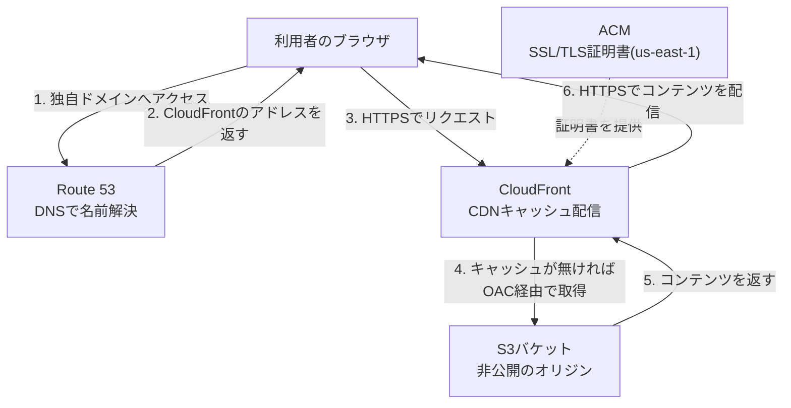

# レベル1: 静的Webサイト公開環境の構築(S3 + CloudFront + Route 53 + ACM)

## この案件の位置づけ

このプロジェクトは、ポートフォリオ全体の中で**最初に取り組む一番シンプルな案件**です。AWSアカウントを作ったら、まず「自分の手で何か1つ、インターネットに公開してみる」ことがAWS操作に慣れる一番の近道だと考えています。

ここで作るのは、HTML1枚(と画像やCSS)だけで完結する「静的Webサイト(サーバー側でプログラムを実行せず、あらかじめ用意したHTML・CSS・画像などのファイルをそのまま表示するだけのシンプルなWebサイト)」です。サーバーの中身(OSやミドルウェア=OSとアプリの間で動く土台のソフトウェア、たとえばWebサーバーソフトなど)を自分でインストール・設定するEC2(Amazon Elastic Compute Cloud。AWS上に自分専用の仮想サーバーを1台まるごと立てられるサービス。レベル2で扱います)とは違い、この案件ではOSやミドルウェアの管理が発生しません。その分、**AWSのコンソール操作そのもの**と**「安全に公開する」という設計思想**に集中して学べます。ここで得る「オリジン(配信元となる本体データの置き場所)を直接公開せず、CDN(Content Delivery Network。世界中の拠点にコンテンツのコピーを配って高速かつ安全に届ける仕組み)を間に挟む」という考え方は、レベル2以降でも繰り返し登場する基本パターンです。

## この案件で身につくスキル

- AWSマネジメントコンソールの基本操作(サービスの探し方、リージョンの切り替え方など)
- 静的コンテンツを安全にインターネット公開する仕組み(オリジンとCDNの役割分担)
- 独自ドメインの取得・DNS(ドメイン名とサーバーの住所を結びつける、インターネットの電話帳のような仕組み)設定 → HTTPS(通信を暗号化して盗み見や改ざんを防ぐ仕組み。ブラウザの鍵アイコンでおなじみです)化までの一連の流れ
- 「ストレージを直接公開しない」というAWSセキュリティの基本発想

## 全体構成図

> 🧠 **覚え方のコツ**: S3は「鍵のかかった倉庫」、CloudFrontは「倉庫の鍵を持っている受付窓口」とイメージしてください。お客さん(利用者)は倉庫に直接は入れず、必ず受付窓口(CloudFront)を通してしか商品(コンテンツ)を受け取れません。「窓口を1つに絞る」がこの構成の一番のキモです。

## 使用するAWSサービスと役割

| サービス | 役割 | ひとことメモ |
|---|---|---|
| Amazon S3(Simple Storage Service。ファイルを保管する倉庫のようなストレージサービス) | 静的サイトのファイル一式を保管する「オリジン(配信元となる本体データの置き場所)」 | パブリックアクセスは一切許可しない |
| Amazon CloudFront | 世界中の配信拠点(エッジロケーション)にキャッシュ(よく使うデータを手元に置いて高速化する仕組み)を配って配信するCDN(Content Delivery Network) | HTTPS化とキャッシュ配信を担当する「顔」の部分 |
| Amazon Route 53 | 独自ドメインのDNS(ドメイン名とサーバーの住所を結びつける電話帳のような仕組み)を管理するサービス | ホストゾーンとレコードでドメインとCloudFrontを結びつける |
| AWS Certificate Manager(ACM) | Webサイトの暗号化通信に使うSSL/TLS証明書(サイトが本物であることを証明し、通信を暗号化するための電子証明書)を無料で発行・自動更新してくれるサービス | 必ず us-east-1(バージニア北部)で発行する |
| AWS IAM(Identity and Access Management) | 「誰が」「何を」操作してよいかを管理する権限管理サービス | 作業用の最小権限(必要な操作だけに絞った権限)ユーザーを用意する |

## 前提条件

- AWSアカウントを作成済みであること(無料利用枠(一定の利用量までAWSの利用料が無料になる制度)の範囲で進められます)
- 独自ドメインを1つ用意していること(Route 53で新規取得、または他社レジストラ(ドメインを販売・管理する事業者。お名前.comなどが有名です)のドメインをRoute 53に委任する形でもOK)
- 普段の作業はルートユーザー(最強権限のアカウント)ではなくIAMユーザーで行うこと

## ハンズオン構築手順

### STEP0: IAMユーザーの準備(最小権限)

1. IAMコンソール →「ユーザー」→「ユーザーを作成」を開き、ユーザー名 `portfolio-builder` を入力します。
2. 「AWSマネジメントコンソールへのアクセスを提供する」にチェックを入れ、パスワードを設定します。
3. 許可ポリシーは `AmazonS3FullAccess`・`CloudFrontFullAccess`・`AmazonRoute53FullAccess`・`AWSCertificateManagerFullAccess` を最小限アタッチ(付与)します(学習目的のため。本番運用ではさらに絞り込みます)。
4. 以降の作業はこのIAMユーザーでログインし直して行います。

### STEP1: S3バケットの作成

1. S3コンソール →「バケットを作成」を開きます。
2. バケット名は世界中で一意である必要があります。他人と衝突しないよう `your-portfolio-site-2026` のように末尾に数字を付けるのがおすすめです(すべて小文字・ハイフン区切り)。
3. リージョンは自分に近い場所(例: アジアパシフィック(東京) `ap-northeast-1`)を選びます。
4. 「このバケットのブロックパブリックアクセス設定」は**4項目すべてチェックが入ったまま(パブリックアクセスは全てブロック)**にします。ここを緩めないのが今回いちばん大事なポイントです。
5. 「バケットを作成」をクリックします。
6. 注意: S3の「静的ウェブサイトホスティング」機能(プロパティタブのオプション)は**有効にしません**。今回OACが使うのはS3の標準アクセス用アドレス(REST APIエンドポイントと呼ばれる `バケット名.s3.リージョン.amazonaws.com` 形式のURL)であり、静的サイトホスティング専用のエンドポイントは使わないためです。

### STEP2: index.htmlのアップロード

1. 作成したバケットを開き、「オブジェクト」タブ →「アップロード」→ `index.html`(必要なら `error.html`、CSSや画像も)を追加してアップロードします。
2. パブリックアクセスの許可は求められません(ブロック設定のままなので正常です)。

### STEP3: CloudFrontディストリビューションの作成(OAC設定)

1. CloudFrontコンソール →「ディストリビューションを作成」を開きます。
2. 「オリジンドメイン」でSTEP1のS3バケットを選択します(候補にREST APIエンドポイントが表示されます)。
3. 「オリジンアクセス」を **Origin access control settings(推奨)** にし、「新しいOAC(オリジンアクセスコントロール。CloudFrontだけがS3に直接アクセスできるようにする専用通行証のような仕組み)を作成」を選びます。署名方式はデフォルトの SigV4(AWSがリクエストの正当性を確認するために使う電子署名の方式)のままでOKです。
4. 作成すると「S3バケットポリシーの更新が必要です」という警告が出ます。「ポリシーをコピー」→ S3バケットの「アクセス許可」タブ →「バケットポリシー(そのバケットへの読み書きを誰に許可するかをJSON形式で定義するルール)」に貼り付けて保存します(コンソールの「ポリシーを自動更新」ボタンで完結する場合もあります)。これでCloudFrontからのみ、このディストリビューション経由でS3への読み取りが許可されます。
5. 「Viewer Protocol Policy」は **Redirect HTTP to HTTPS** を選択し、HTTP(80番ポート)を強制的にHTTPS(443番ポート)へリダイレクトします。
6. 「許可されたHTTPメソッド」は `GET, HEAD` のみで十分です。
7. 「デフォルトルートオブジェクト」に `index.html` を入力します。
8. 「代替ドメイン名(CNAME。独自ドメインをこのCloudFrontディストリビューションに結びつけるための別名設定)」に独自ドメイン(例: `www.example.com`)を追加します(証明書はSTEP4で用意してから紐付けます)。
9. このまま作成し、デプロイ完了(ステータスが「有効」)まで数分〜十数分待ちます。

> 🧠 **覚え方のコツ**: OAC は「Origin **Access Control**」の略で、以前あった OAI(Origin Access Identity)の後継です。OAIは古い仕組みで、S3の暗号化(KMSという鍵管理サービスを使った暗号化)などに対応しきれない弱点がありました。「迷ったら新しい方=OACを選ぶ」、これだけ覚えておけばOKです。

### STEP4: ACMでのSSL/TLS証明書発行(必ずus-east-1で!)

1. **画面右上のリージョン選択を「米国東部(バージニア北部) us-east-1」に切り替えてから**ACMコンソールを開きます。⚠️ 初心者が最もハマるポイントです。他リージョン(東京など)で発行した証明書はCloudFrontのプルダウンに一切表示されません。
2. 「証明書をリクエスト」→「パブリック証明書をリクエスト」→ドメイン名に `example.com` と `www.example.com` を追加します。
3. 検証方法は「DNS検証」を選びます。Route 53管理下なら証明書詳細画面の「Route 53でレコードを作成」ボタン一発で検証用CNAMEが自動作成されます。
4. ステータスが「発行済み」になるまで数分〜数十分待ち、CloudFrontの「カスタムSSL証明書」でこの証明書を選択して保存します。

> 🧠 **覚え方のコツ**: 「証明書はバージニアさん専属」と語呂で覚えてください。CloudFront用のACM証明書は、CloudFrontがグローバルサービス(特定の1リージョンに属さず世界中で使えるサービス)であることに合わせて **us-east-1固定** というAWS側の仕様です。他のリージョンではどれだけ探しても出てきません。

### STEP5: Route 53でのドメイン設定

1. Route 53コンソール →「ホストゾーン(そのドメインのDNS設定情報をまとめて管理する箱のようなもの)」→「ホストゾーンを作成」→ドメイン名(例: `example.com`)を入力し、タイプは「パブリックホストゾーン」を選びます。
2. 作成するとNS(ネームサーバー。「このドメインの管理をどのDNSサービスに任せているか」を外部に示すレコード)が4つ自動生成されます。
3. 他社レジストラ(お名前.comなど)でドメインを取得している場合は、そのレジストラの管理画面でネームサーバー設定をRoute 53発行の4つに書き換えます。Route 53で直接取得した場合は不要です。
4. 同じホストゾーンで「レコードを作成」→レコード名は空欄(ルートドメイン)または `www`、タイプは `A`(ドメイン名を宛先の情報に結びつけるレコードの種類)、「エイリアス(AWSのリソースを直接指し示せるRoute 53独自のレコード形式)」をオンにし、ルーティング先で「CloudFrontディストリビューションへのエイリアス」を選び、STEP3のディストリビューションを指定します。
5. ネームサーバーの反映(DNS伝播)には数分〜最大48時間程度かかります。

### STEP6: キャッシュの無効化(invalidation)

1. サイトを更新してもブラウザに反映されない場合、CloudFrontがまだ古いキャッシュ(invalidation=キャッシュの無効化。CDNに残る古いコピーを消して最新版を取りに行かせる操作)を配信しています。
2. CloudFrontコンソール → 対象ディストリビューション →「無効化」タブ →「無効化を作成」→パスに `/*` と入力すると全ファイルのキャッシュが無効化されます(`/index.html` のように個別指定も可)。
3. 数分待って再確認します。ブラウザ自体のキャッシュが残る場合はシークレットウィンドウも試してください。

> 🧠 **覚え方のコツ**: キャッシュは「街のあちこちに配った写真のコピー」、invalidationはその写真をすべて回収して「新しい写真に差し替えて」と指示することです。古い写真(キャッシュ)は指示が届くまで数分は出回り続けるので、反映まで少し待つのが正常です。「更新したのに見た目が変わらない」と焦ったら、まずこの言葉を思い出してください。

### STEP7: 動作確認

1. ブラウザで `https://www.example.com`(独自ドメイン)にアクセスし、index.htmlが表示され、アドレスバーに鍵アイコン(HTTPS)が出ることを確認します。
2. `http://` でアクセスしても自動的に `https://` にリダイレクトされることを確認します。
3. 開発者ツールのネットワークタブで、レスポンスヘッダーに `x-cache: Hit from cloudfront` があれば、CloudFront経由で正しく配信されている証拠です。

## セキュリティのポイント

| ポイント | 考え方 |
|---|---|
| S3を直接公開しない | 直接公開すると、CloudFrontを迂回した裏口URL(`バケット名.s3.amazonaws.com/…`)が生まれ、HTTPS強制・キャッシュ・アクセスログ一元管理といった利点をすべて素通りされます。入り口を1つに絞るのが基本発想です |
| OAC(旧OAIとの違い) | OAIは、AWSの鍵管理サービス(KMS)で暗号化したS3オブジェクトへの対応に制約があるなどの弱点を持つ古い仕組みで、現在はOACが推奨されています。OACはSigV4(なりすまし防止のための電子署名の方式)でより厳密にアクセスを制御できます |
| HTTPS強制 | 「Viewer Protocol Policy」を `Redirect HTTP to HTTPS` にし、平文の80番ポート通信を許さず常に443番ポートの暗号化通信へ統一します |

## 💰 コスト概算

| サービス | 目安 | 補足 |
|---|---|---|
| S3 | 数円程度/月 | 無料利用枠(ストレージ5GB等)の範囲内ならほぼ0円 |
| CloudFront | 0円〜数十円/月 | データ転送・リクエスト数に無料利用枠あり |
| Route 53(ホストゾーン) | 約0.5USD/月 | ホストゾーン自体は無料利用枠の対象外。ドメイン取得費用は別途 |
| ACM | 0円 | パブリック証明書の発行・更新は無料 |
| IAM | 0円 | ユーザー・ポリシーの利用自体に費用はかからない |

> 詳細な無料利用枠の条件は [AWS無料利用枠](https://aws.amazon.com/jp/free/) で必ず最新情報を確認してください。

## ⚠️ トラブルシューティング

| 症状 | 主な原因 | 対処 |
|---|---|---|
| CloudFront経由で403 Forbidden | OACの設定漏れ、またはS3バケットポリシーが未更新 | STEP3の手順に戻り、バケットポリシーにCloudFrontを許可する記述が反映されているか確認する |
| ACMの証明書がCloudFrontのプルダウンに出てこない | us-east-1以外のリージョンで証明書を発行してしまった | 画面右上でus-east-1に切り替えて証明書を発行し直す |
| 独自ドメインでアクセスできない | ネームサーバーの切り替えが反映されていない、DNS伝播待ち | レジストラ側のネームサーバー設定を再確認し、数時間〜最大48時間待つ |
| 更新した内容がブラウザに反映されない | CloudFrontの古いキャッシュが残っている | STEP6の手順で無効化(invalidation)を実行する |

## 発展課題

1. **GitHub Actions(GitHubにコードをpushしたことなどをきっかけに、テストやデプロイを自動実行してくれるCI/CDの仕組み)によるS3への自動デプロイ(構築した成果物を実際の公開環境に反映させること)**: mainブランチにpushしたら自動でS3にファイルを同期し、CloudFrontの無効化(invalidation)まで実行するワークフローを組んでみましょう。実は、このポートフォリオ自体をこの構成でデプロイしてみるのもおすすめです。
2. **CloudFrontのアクセスログをS3に保存・分析**: ディストリビューションの設定でアクセスログを別のS3バケットに出力し、どんなアクセスが来ているかを集計してみましょう。

## ✅ 面接でのアピールポイント

**Q. なぜS3バケットを直接公開せず、CloudFrontを経由させたのですか?**
A. 直接公開するとCloudFrontを迂回した経路が生まれ、HTTPS強制・キャッシュによる高速化・アクセスログ一元管理といった仕組みが素通りされてしまうためです。オリジンへの経路を1つに絞り、攻撃対象領域(攻撃者が狙える侵入口の数)を最小化する考え方で設計しました。

**Q. OACとは何ですか?なぜOACを選んだのですか?**
A. CloudFrontだけがS3の非公開オブジェクトにアクセスできるようにする仕組みです。旧OAI(Origin Access Identity)は暗号化オブジェクトへの対応などに制約があり、AWSは現在OACを推奨しているため、新規構築ということもありOACを採用しました。

## 参考リンク

- [Amazon S3 ユーザーガイド](https://docs.aws.amazon.com/AmazonS3/latest/userguide/Welcome.html)
- [Amazon CloudFront デベロッパーガイド](https://docs.aws.amazon.com/AmazonCloudFront/latest/DeveloperGuide/Introduction.html)
- [Amazon Route 53 デベロッパーガイド](https://docs.aws.amazon.com/Route53/latest/DeveloperGuide/Welcome.html)
- [AWS IAM ユーザーガイド](https://docs.aws.amazon.com/IAM/latest/UserGuide/introduction.html)
- [AWS無料利用枠](https://aws.amazon.com/jp/free/)

## ハンズオンキット(そのまま実行できるスクリプト)

この案件の構成を AWS CLI / Terraform で自動構築・削除できるキットを [handson/](handson/README.md) に用意しています。本編の手順をコンソールで一度体験したあと、キットで「コードによる再現」を試すと理解が定着します。⚠️ 実行前に必ず [handson/README.md](handson/README.md) の課金注意と削除手順を読んでください。

## 関連ドキュメント

- [ポートフォリオ全体トップ](../../README.md)
- [AWS基礎知識](../../docs/01-aws-basics-for-beginners.md)
- [用語集](../../docs/02-glossary.md)
- [次のプロジェクト(レベル2: EC2 Webサーバー構築)](../02-ec2-web-server/README.md)
