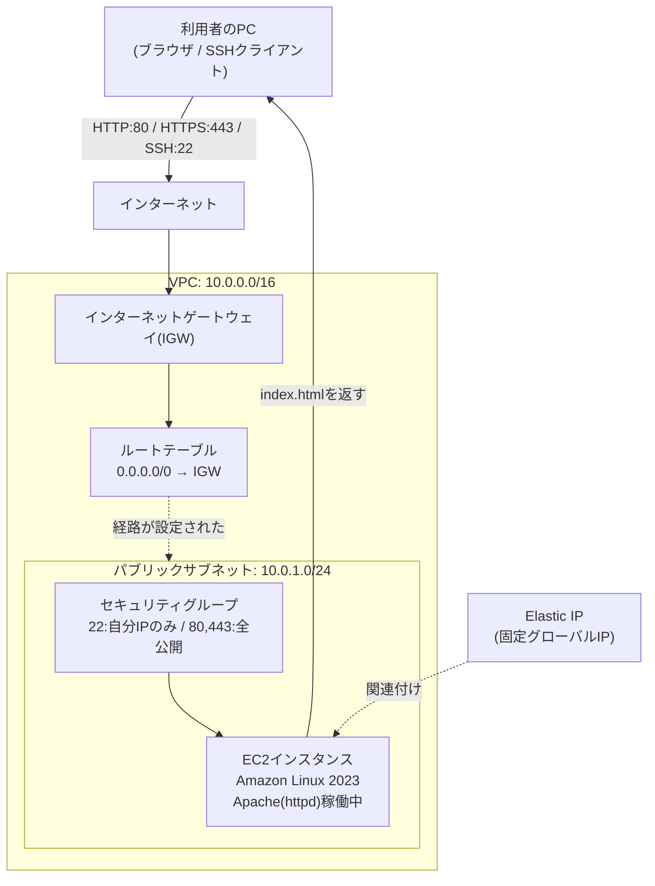

# レベル2: EC2で自分のWebサーバーを構築する(VPC自作 + EC2 + Apache/Nginx)

## この課題の位置づけ

このプロジェクトは、「サーバー構築エンジニア」を名乗るうえで避けて通れない、最も基礎的で最も重要な案件です。レベル1では静的サイトをS3で公開しましたが、今回はネットワークの土台であるVPC(AWS上に自分専用に区切って作る仮想ネットワーク。マンションの敷地のようなもの)を自分の手でゼロから設計し、そのうえにサーバー本体であるEC2(Elastic Compute Cloud。クラウド上で必要な時だけ借りられる仮想サーバー。レンタルパソコンのようなもの)を立て、Webサーバーソフトを動かして世界に公開するところまでを一気通貫でやり切ります。

本ポートフォリオ全体の中でも、ここが「核」となる基礎回です。ここで扱うVPC・サブネット・ルーティング・アクセス制御の考え方は、レベル3以降のより複雑な構成(冗長化・多層アーキテクチャなど)にもそのまま積み上がっていきます。

## 身につくスキル

- VPC・サブネット・ルートテーブル・インターネットゲートウェイの関係を自分で設計できる(それぞれの役割は次の章の図と表で説明します)
- EC2インスタンスの起動、SSH(Secure Shell。手元のPCから離れたサーバーへ安全に接続し、コマンドで操作するための通信方式)接続、Webサーバーソフトのインストールと公開
- セキュリティグループによる最小権限のアクセス制御(ホワイトリスト方式)
- SSH接続がうまくいかないときに、原因を順番に切り分けて特定する能力

## 全体構成図



※ 図中の「AZ」はアベイラビリティゾーン(独立した電源・空調・回線を持つデータセンターのまとまり。1つのリージョンの中に複数存在します)の略です。詳しくはハンズオン手順2で説明します。

> 🧠 **覚え方のコツ**: VPCは「マンションの敷地」、サブネット(VPCをさらに小さく区切った区画。敷地内の「棟」のようなもの)は「敷地内の棟」、EC2は「棟の中の1部屋」とイメージすると整理しやすいです。敷地(VPC)がないと棟(サブネット)は建てられず、棟がないと部屋(EC2)も置けません。だから構築の順番は必ず「VPC → サブネット → EC2」になります。

## 使用するAWSサービスと役割

| サービス・用語 | 役割 |
|---|---|
| VPC | 自分専用の仮想ネットワークの土台。CIDR(「◯◯.◯◯.◯◯.◯◯/xx」形式のIPアドレス範囲の表記)でアドレス範囲を決める |
| パブリックサブネット | VPCを区切った、インターネットと直接通信できる区画。EC2をここに配置する |
| インターネットゲートウェイ(IGW) | VPCとインターネットをつなぐ「玄関口」。これがないと外部と通信できない |
| ルートテーブル | 「この宛先へはこの経路で行け」という交通整理表。IGWへの経路を書いて初めて外部通信が可能になる |
| EC2 | クラウド上で借りる仮想サーバー本体。ここにWebサーバーソフトを入れる |
| AMI(Amazon Machine Image) | EC2を起動するための「雛形(テンプレート)」。OSやソフトの初期状態がまとめて入っている |
| インスタンスタイプ | CPU・メモリなど、EC2 1台あたりの性能(大きさ)を表す規格。レンタカーの「車種選び」に近い |
| セキュリティグループ | EC2の手前に立つ「受付」。許可した通信だけを通すファイアウォール |
| Elastic IP | 固定のグローバルIP(インターネット上で機器を一意に識別する住所)アドレス。インスタンス再起動時もIPが変わらない |
| キーペア | SSH接続用の「合鍵」。公開鍵をAWS側に、秘密鍵(.pemファイル)を自分のPCに保管する |

## アーキテクチャ設計のポイント: なぜこの順番で「初めて」通信できるのか

VPCを自作すると、最初はどこともつながっていない「密室」の状態です。次の4点がすべて揃って初めて、外部のブラウザからEC2にアクセスできます。

1. IGWが作成され、VPCにアタッチされている(玄関そのものがある)
2. ルートテーブルに「0.0.0.0/0(すべてのIPアドレスを表すCIDR表記)→IGW」の経路が書かれ、パブリックサブネットに関連付けられている(玄関までの道がある)
3. EC2にパブリックIPまたはElastic IPが割り当てられている(相手から見える住所がある)
4. セキュリティグループが該当ポート(通信の入り口を区別する番号。例: 80番はWeb閲覧(HTTP)用の入り口)のインバウンド(外部から内部方向へ入ってくる通信のこと。逆に内部から外部へ出ていく通信はアウトバウンドと呼ぶ)通信を許可している(玄関の鍵が開いている)

> 🧠 **覚え方のコツ**: 「IGW=玄関」「ルートテーブル=玄関までの案内標識」「セキュリティグループ=玄関の鍵」と覚えると、どれか1つでも欠けると通信できない理由が直感的にわかります。標識(ルートテーブル)がなければ玄関(IGW)があっても辿り着けませんし、鍵(SG)が閉まっていれば玄関の前まで来ても中には入れません。

## ハンズオン手順

### フェーズ1: ネットワークの土台を作る(VPC・サブネット)

1. **VPCを作成する**: マネジメントコンソールで「VPC」サービスを開き、「VPCを作成」→「VPCのみ」を選択。名前タグに `handson-web-vpc`、IPv4 CIDRブロックに `10.0.0.0/16` を入力します。IPv6 CIDRブロックは「IPv6 CIDRブロックなし」のままでよく、そのまま作成します。
2. **パブリックサブネットを作成する**: 左メニューの「サブネット」→「サブネットを作成」。先ほどのVPCを選び、サブネット名は `handson-public-subnet-1a`、アベイラビリティゾーン(AZ。独立した電源・ネットワークを持つデータセンターのまとまり)は `ap-northeast-1a` を選択し、IPv4 CIDRブロックに `10.0.1.0/24` を入力します。

### フェーズ2: インターネットへの出入り口を作る(IGW・ルートテーブル)

3. **インターネットゲートウェイを作成しアタッチする**: 「インターネットゲートウェイ」→「作成」で名前タグ `handson-igw` を入力して作成。作成後、対象を選択し「アクション」→「VPCにアタッチ」で先ほどのVPCを指定します。
4. **ルートテーブルを設定する**: VPCに紐づくルートテーブルを選択し、「ルート」タブ→「ルートを編集」→「ルートを追加」。送信先に `0.0.0.0/0`、ターゲットに手順3のIGWを指定して保存。続けて「サブネットの関連付け」タブから手順2のパブリックサブネットを関連付けます。この2つが揃って、サブネットは名実ともに「パブリック」になります。

### フェーズ3: アクセス制御を設計する(セキュリティグループ)

5. **セキュリティグループを作成する**: EC2画面の「セキュリティグループ」→「セキュリティグループを作成」。名前は `handson-web-sg`、対象VPCを選択し、インバウンドルール(外部から入ってくる通信をどこまで許可するかの設定)を次の表の通り設定します。

| タイプ | ポート | ソース | 理由 |
|---|---|---|---|
| SSH | 22 | マイIP(自分の現在のグローバルIP。インターネット上で自分の回線を一意に示す住所)のみ | サーバー管理用の接続。世界中に開けると総当たり攻撃の標的になる |
| HTTP | 80 | 0.0.0.0/0(どこからでも) | Webサーバーとして誰からでも閲覧できる必要がある |
| HTTPS | 443 | 0.0.0.0/0(どこからでも) | 同上。暗号化通信用 |

アウトバウンド(内部から外部へ出ていく通信)はデフォルトの「すべて許可」のままで問題ありません。

> 🧠 **覚え方のコツ**: セキュリティグループは「ブラックリスト方式(悪いものだけ弾く)」ではなく「ホワイトリスト方式(良いものだけ通す)」です。合言葉は「疑わしきは通さず」。デフォルトはすべて拒否で、必要な穴だけを自分で開けていく、と覚えましょう。

> 🧠 **覚え方のコツ**: よく使う3つのポート番号は語呂合わせで覚えると忘れません。「22番=SSH: 兄(2)に兄(2)しか教えない秘密の裏口」「80番=HTTP: は(8)お(0)っぴろげの正面玄関」「443番=HTTPS: よ(4)よ(4)さ(3)ん、鍵(暗号化)を忘れずに」。数字と役割をセットでイメージしておくと、セキュリティグループ設定のたびに迷わなくなります。

### フェーズ4: サーバーを起動する(EC2・Elastic IP)

6. **EC2インスタンスを起動する**: 「インスタンスを起動」を選択し、以下の内容で設定します。
   - 名前: `handson-web-server`
   - AMI(Amazon Machine Image。OSやミドルウェアの初期設定をまとめた「サーバーの雛形」): Amazon Linux 2023(無料利用枠の対象と表示されているもの)
   - インスタンスタイプ(CPU・メモリの大きさを表す規格): `t2.micro` または `t3.micro`
   - キーペア: 「新しいキーペアを作成」→ 名前 `handson-key`、タイプ RSA、形式 `.pem` を選択しダウンロード(⚠️ このファイルは**このタイミングでしか入手できません**。紛失すると再発行できないため安全な場所に保管してください)
   - ネットワーク設定: 手順1・2のVPCとパブリックサブネットを選択し、「パブリックIPの自動割り当て」を有効化
   - ファイアウォール: 「既存のセキュリティグループを選択」→ `handson-web-sg`
   - ストレージ: デフォルト(EBS。EC2に取り付ける仮想ディスクのこと。8GiB, gp3〈バランス型の汎用SSD〉)のままでOK

   起動後、「Elastic IP」画面で「Elastic IPアドレスを割り当てる」を実行し、「アクション」→「Elastic IPアドレスの関連付け」でこのインスタンスに紐付けます。

> 🧠 **覚え方のコツ**: 通常のパブリックIP(インスタンス起動時に自動で付くグローバルIP)はインスタンスを再起動するたびに変わってしまいます。Elastic IPは「固定電話番号」、通常のパブリックIPは「その場限りの使い捨て番号」とイメージすると違いが覚えやすいです。

### フェーズ5: Webサーバーソフトを入れて公開する

7. **SSHで接続する**: ダウンロードした.pemファイルの権限を絞ってから接続します。

```bash
chmod 400 handson-key.pem
ssh -i handson-key.pem ec2-user@<割り当てたElastic IPアドレス>
```

   Amazon Linuxのデフォルトユーザー名は `ec2-user` です。`chmod 400` は「所有者本人だけが読み取り専用でアクセスできる」権限に絞る操作で、これを行わないとSSHクライアントが「鍵ファイルが緩すぎる」と警告して接続を拒否することがあります。

8. **Webサーバーソフトをインストールして自動起動を設定する**:

```bash
sudo dnf update -y
sudo dnf install -y httpd
sudo systemctl start httpd
sudo systemctl enable httpd
echo "<h1>Hello from my first EC2 web server!</h1>" | sudo tee /var/www/html/index.html
```

   `systemctl enable` を実行しておくことで、EC2を再起動してもApache(httpd。Webサーバーソフトウェアの一つ。ブラウザからのリクエストを受け取ってHTMLなどを返す役割を持つ)が自動的に立ち上がるようになります。Nginxを使いたい場合は `httpd` の部分を `nginx` に置き換えてください。

9. **ブラウザで動作確認する**: ブラウザのアドレスバーに `http://<割り当てたElastic IPアドレス>` を入力し、手順8で設置したページが表示されれば成功です。

### フェーズ6(発展): キーペアなしで接続する

10. 実は、キーペアと.pemファイルがなくても、AWS Systems Manager(AWSリソースの運用管理をまとめて行うサービス)の「セッションマネージャー(ブラウザやCLIからEC2に鍵なしで安全に接続できる機能)」を使えば、EC2にIAMロール(人ではなくAWSのサービスに一時的に貸し出す「入館証」のような権限。ここではAmazonSSMManagedInstanceCoreポリシーを付与)を割り当てるだけで、鍵不要・22番ポート開放不要でコンソールから接続できます。実務ではこちらが推奨されることも多いので、余力があれば試してみてください。

## ⚠️ セキュリティのポイント

- ✅ セキュリティグループは常に「ホワイトリスト方式」で、必要な通信だけを最小限開けます。「とりあえず全部開けておく」は絶対にNGです。
- ⚠️ SSH(22番)を `0.0.0.0/0` に開放するのは危険です。インターネット上には常時ポートスキャン(空いている入り口=ポートがないか手当たり次第調べる行為)を行うボットが存在し、開いていれば数時間以内に総当たり攻撃(ブルートフォース)の標的になります。必ず「マイIP」など自分の接続元に絞りましょう。
- ⚠️ 自宅回線などは接続のたびにグローバルIPが変わることがあります。SSHが急にできなくなった場合は、まずマイIPが変わっていないかを疑いましょう(詳細はトラブルシューティング参照)。
- 💰 Elastic IPは「EC2にアタッチされている間」は無料ですが、停止・削除してElastic IPだけが未アタッチのまま残ると課金対象になります。使い終わったら必ず「アドレスの解放」まで行いましょう。

## 💰 コスト概算

| 項目 | 無料枠・料金の目安 | 注意点 |
|---|---|---|
| EC2 (t2.micro / t3.micro) | 12か月間、月750時間まで無料 | 750時間は1台常時起動でも収まる時間数。複数台同時起動は注意 |
| EBSストレージ(EC2に取り付ける仮想ディスク。8GiB gp3) | 月30GBまで無料枠の対象 | 本ハンズオンの8GiBは範囲内 |
| Elastic IP | アタッチ中は無料 | 💰 未アタッチや停止中の放置は課金対象 |
| データ転送(アウト) | 月1GBまで無料枠の対象 | 動作確認程度なら通常は範囲内 |

最新の無料利用枠の条件は必ず公式ページで確認してください([AWS無料利用枠](https://aws.amazon.com/jp/free/))。

## ⚠️ トラブルシューティング

### SSHが接続できない・タイムアウトする場合のチェックリスト

| 順番 | 確認項目 | 具体的な確認方法 |
|---|---|---|
| 1 | セキュリティグループのインバウンドルール | `handson-web-sg` にSSH(22番)のルールがあるか、ソースが正しいか確認 |
| 2 | 自分のグローバルIPが変わっていないか | 「マイIP」で登録した時点のIPと現在のIPが一致しているか確認し、変わっていればルールを更新 |
| 3 | ルートテーブルの設定漏れ | 0.0.0.0/0 → IGW の経路がサブネットに関連付けたルートテーブルに存在するか確認 |
| 4 | IGWのアタッチ漏れ | インターネットゲートウェイがVPCに「Attached」状態になっているか確認 |
| 5 | 接続先IP・鍵ファイルの指定ミス | Elastic IPのアドレスと `.pem` ファイルのパスが正しいか、`chmod 400` を実行済みか確認 |

> 🧠 **覚え方のコツ**: SSHが繋がらない時は「近い順」に疑うのがコツです。まず自分側(IP・鍵)→SG→ルートテーブル→IGWの順に、玄関に近いところから外側に向かって確認すると効率的に原因を絞り込めます。

### ブラウザでページが表示されない場合のチェックリスト

| 順番 | 確認項目 | 具体的な確認方法 |
|---|---|---|
| 1 | セキュリティグループの80番許可 | HTTP(80番)のインバウンドルールが `0.0.0.0/0` で許可されているか確認 |
| 2 | Webサーバーが起動しているか | SSH接続後に `sudo systemctl status httpd` を実行し、`active (running)` になっているか確認 |
| 3 | index.htmlが配置されているか | `/var/www/html/index.html` が存在するか `ls -l /var/www/html/` で確認 |

## 📌 発展課題

- **HTTPS化**: Let's Encrypt(無料のSSL/TLS証明書発行サービス)とCertbot(証明書の取得・更新を自動化するツール)を使い、独自ドメインを取得したうえでHTTPS通信に対応させる
- **CloudWatchエージェント導入**: EC2にCloudWatch(AWSのモニタリング・監視サービス)エージェントを導入し、CPU使用率だけでなくメモリ使用率やディスク使用率もメトリクス(監視のために収集される数値データ)として収集・監視できるようにする
- **Session Managerへの完全移行**: フェーズ6で試したセッションマネージャーを常用にし、キーペアの管理そのものが要らない運用に慣れておく。実務では鍵の紛失・漏えいリスクを減らせるため評価されやすいポイントです

## ✅ 面接でのアピールポイント

**Q. なぜデフォルトVPCを使わず、わざわざ自分でVPCを作ったのですか?**

A. デフォルトVPCはアカウント作成時に各リージョンへ自動生成され、全AZにパブリックサブネットが用意された「誰でもすぐ使える」構成です。しかし実務では、既存ネットワークとのIPアドレス重複を避けたり、用途ごとにサブネットを分離したりするため、CIDR設計から自分で行う場面がほとんどです。今回あえて自作VPCで構築したのは、IGWやルートテーブルがどう繋がって初めて通信が成立するのかという「仕組みそのもの」を体で理解するためです。デフォルトVPCをただ使うだけでは、この繋がりはブラックボックスのままでした。この経験は、AWS Well-Architected Framework(セキュリティや信頼性など複数の観点でAWS環境の設計を評価するためのベストプラクティス集)が重視する「最小権限」の考え方にも直結していると考えています。

**Q. SSHの22番ポートを世界中に公開しなかったのはなぜですか?**

A. インターネット上には常時ポートスキャンを行うボットが存在し、22番ポートを `0.0.0.0/0` に開放すると数時間以内に総当たり攻撃の標的になり得るためです。今回はセキュリティグループのソースを「マイIP」に絞り、管理用の通信経路を自分だけに限定しました。また、自宅回線でグローバルIPが変わりSSHが突然できなくなる事象も実際に経験したため、「自分側→SG→ルートテーブル→IGW」の順で近いところから疑うトラブルシューティングの型を身につけました。発展課題として試したセッションマネージャーのように、そもそも22番ポートを開けずに運用する方法があることも理解しています。

## 参考リンク

- [Amazon VPCのドキュメント](https://docs.aws.amazon.com/vpc/)
- [Amazon EC2のドキュメント](https://docs.aws.amazon.com/ec2/)
- [AWS IAM ユーザーガイド](https://docs.aws.amazon.com/IAM/latest/UserGuide/introduction.html)
- [Amazon CloudWatch ユーザーガイド](https://docs.aws.amazon.com/AmazonCloudWatch/latest/monitoring/WhatIsCloudWatch.html)
- [AWS無料利用枠](https://aws.amazon.com/jp/free/)
- [AWS Well-Architected Framework](https://aws.amazon.com/jp/architecture/well-architected/)

## 関連ドキュメント

- [ポートフォリオ全体トップ](../../README.md)
- [AWS基礎知識](../../docs/01-aws-basics-for-beginners.md)
- [用語集](../../docs/02-glossary.md)
- [前のプロジェクト(レベル1: 静的Webサイト)](../01-static-website/README.md)
- [次のプロジェクト(レベル3: 高可用性3層構成)](../03-ha-three-tier/README.md)
