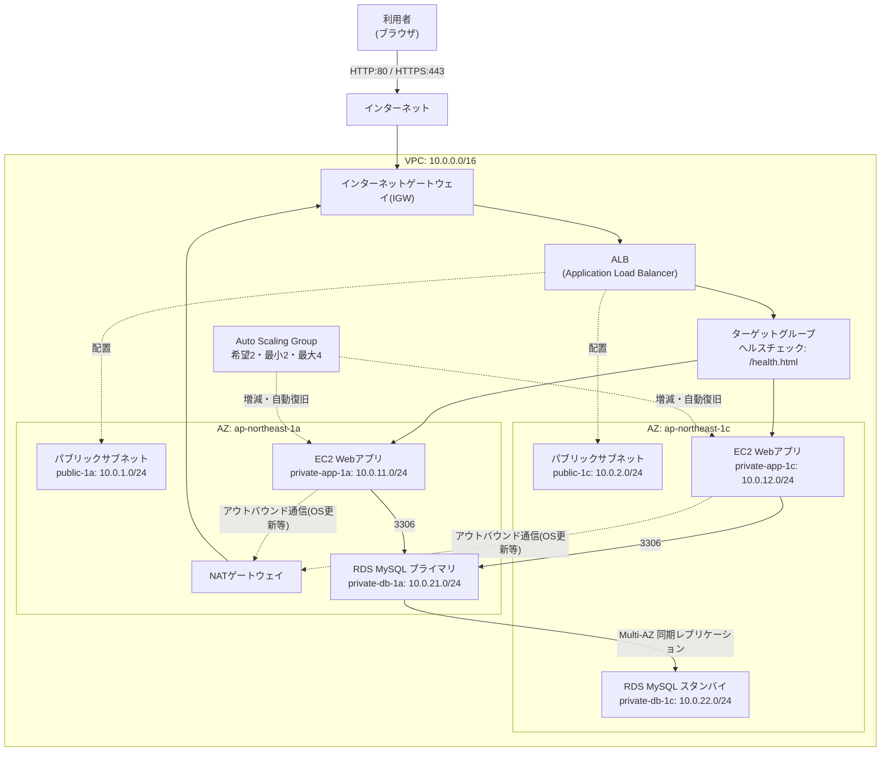

# レベル3: 可用性を高めた3層Webシステム構築(ALB + Auto Scaling + Multi-AZ RDS)

## この課題の位置づけ

レベル2では1台のEC2(Elastic Compute Cloud。必要なときに必要な分だけ借りられるAWS上の仮想サーバー)でWebサーバーを公開しました。しかし、この構成には致命的な弱点があります。それは「そのEC2が壊れたら、サイト全体が止まる」ことです。実務の本番環境では、これは許されません。

このプロジェクトでは、1台のサーバーが壊れても、AZ(アベイラビリティゾーン。独立した電源・空調・ネットワークを持つ、物理的に離れたデータセンターのまとまり。複数のAZが集まって1つのリージョン=地理的な地域を構成します)ごと障害が起きても、システム全体は止まらない「落ちない設計」を学びます。具体的には、ロードバランサー(利用者からの通信を複数のサーバーに振り分ける、受付のような仕組み)で通信を複数のサーバーに分散し、Auto Scaling(サーバー台数を自動で増減・復旧させる仕組み)で健康なサーバー台数を保ち、データベースもMulti-AZ(2つのAZにまたがってデータベースを冗長化する構成)で二重化します。

Webサーバー層(EC2)・アプリケーション層(EC2上のアプリ処理)・データベース層(RDS)という「3層アーキテクチャ」を、それぞれ独立したセキュリティグループ(SG。EC2やRDSへの通信を許可・拒否する、仮想的なファイアウォールのような設定)とサブネット(VPCという大きな敷地を、目的ごとにさらに細かく区切った区画)で分離して設計する、実務の本番環境構築に最も近い基礎パターンです。

## 身につくスキル

- 複数AZにまたがる冗長構成(1つが壊れても他が肩代わりできる設計)の設計力
- ロードバランサーによる負荷分散とヘルスチェック(サーバーが正常に動いているかを定期的に確認する仕組み)の理解
- Auto Scalingによる自動復旧・自動増減の設計
- 3層構造でセキュリティグループを分ける「多層防御」の設計思想
- RDSのMulti-AZによるデータベース高可用性の理解

## 全体構成図



> 🧠 **覚え方のコツ**: レベル2は「1部屋しかないアパート」でした。レベル3は「同じ間取りの部屋を2つの棟(AZ)に用意し、受付(ALB)がどちらの部屋が空いているか(ヘルスチェック)を見て案内する」イメージです。片方の棟が停電しても、もう片方の棟で営業を続けられます。

## 使用するAWSサービスと役割

| サービス | 役割 |
|---|---|
| VPC(Virtual Private Cloud) | AWS上に自分専用に区切って作る仮想ネットワークの土台(マンションの敷地のようなもの)。2つのAZにまたがり、今回は計4種類・6つのサブネットで構成 |
| NATゲートウェイ | プライベートサブネットのEC2に、インターネットへの「片道通行」の出口を与える |
| ALB(Application Load Balancer) | 利用者からの通信を受け取り、複数のEC2に振り分ける「受付・交通整理役」 |
| ターゲットグループ | ALBが振り分け先として管理するEC2の集まり。ヘルスチェックで正常なものだけに振り分ける |
| 起動テンプレート(Launch Template) | 「どのAMI(Amazon Machine Image。OSやソフトウェアを設定済みのEC2起動用ひな型)で、どのインスタンスタイプ(サーバーの性能・料金プラン)で、どんな初期設定でEC2を起動するか」を定義した設計図 |
| Auto Scaling Group(ASG) | 起動テンプレートをもとに、EC2の台数を自動で増減・復旧させる管理者役 |
| EC2(プライベートサブネット配置) | 実際にアプリケーションを動かすサーバー本体。インターネットから直接アクセスできない場所に置く |
| RDS(MySQL, Multi-AZ) | マネージド型(AWSが運用・保守を代行してくれる)のリレーショナルデータベース(表形式でデータを管理し、SQLで操作するデータベース)。2つのAZで二重化する |

## アーキテクチャ設計のポイント: なぜ3層に分けるのか

このシステムは、役割ごとに次の3つの層(レイヤー)に分かれています。

1. **配送層(パブリックサブネット)**: ALBが置かれ、インターネットからの通信を最初に受け止める層
2. **アプリケーション層(プライベートAPPサブネット)**: EC2が置かれ、実際の処理を行う層。インターネットから直接到達できない
3. **データ層(プライベートDBサブネット)**: RDSが置かれ、最も機密性が高いデータを扱う層。アプリケーション層からしか到達できない

この「層ごとに到達範囲を絞る」設計を多層防御(1つの防御が破られても、次の層が守ってくれる考え方)と呼びます。万が一ALBより先の層に侵入されても、その先のEC2・RDSにはさらに別のセキュリティグループの壁があるため、被害を最小限に食い止められます。

> 🧠 **覚え方のコツ**: 3層アーキテクチャは「オフィスビルの受付・執務フロア・金庫室」に例えると覚えやすいです。受付(ALB)は誰でも入れますが、執務フロア(EC2)は社員証(SGの許可)がないと入れず、金庫室(RDS)はさらに一部の社員(EC2からの通信)しか入れません。

## サブネット設計

VPC全体のCIDR(IPアドレスの範囲を「◯◯.◯◯.◯◯.◯◯/xx」の形式で表す表記)は `10.0.0.0/16` とし、2つのAZに、役割ごとに計6つのサブネットを配置します。

| 名前 | CIDR | AZ | パブリック/プライベート | 用途 |
|---|---|---|---|---|
| public-1a | 10.0.1.0/24 | ap-northeast-1a | パブリック | ALB、NATゲートウェイ |
| public-1c | 10.0.2.0/24 | ap-northeast-1c | パブリック | ALB |
| private-app-1a | 10.0.11.0/24 | ap-northeast-1a | プライベート | EC2(Webアプリ層) |
| private-app-1c | 10.0.12.0/24 | ap-northeast-1c | プライベート | EC2(Webアプリ層) |
| private-db-1a | 10.0.21.0/24 | ap-northeast-1a | プライベート | RDS(プライマリ) |
| private-db-1c | 10.0.22.0/24 | ap-northeast-1c | プライベート | RDS(スタンバイ) |

> 🧠 **覚え方のコツ**: CIDRの3オクテット目を「1〜2番台=パブリック」「11〜12番台=APP」「21〜22番台=DB」のように層でグルーピングしておくと、後からルートテーブルやSGを見返したときに、数字だけで「どの層のサブネットか」が一目でわかります。実務でも桁を揃えた採番ルールはよく使われます。

## ハンズオン手順

### フェーズ1: VPCとサブネットを作る

1. VPCコンソールで「VPCを作成」→「VPCのみ」を選択。名前タグ `ha-three-tier-vpc`、IPv4 CIDRブロック `10.0.0.0/16` を入力して作成します。
2. 「サブネット」→「サブネットを作成」で、上記サブネット設計表の6行分をすべて作成します。それぞれAZとCIDRを表の通りに指定してください。
3. パブリックサブネット(public-1a, public-1c)は、サブネット詳細画面で「アクション」→「サブネットの設定を変更」→「パブリックIPv4アドレスの自動割り当てを有効化」にチェックを入れます。

### フェーズ2: インターネットゲートウェイとルートテーブル

4. 「インターネットゲートウェイ」→「作成」で名前タグ `ha-three-tier-igw` を作成し、VPCにアタッチします。
5. パブリック用のルートテーブル(ルートテーブル。そのサブネットが出す通信を、どこ宛てに転送するか定めた経路表)である `ha-public-rt` を作成し、送信先 `0.0.0.0/0` → ターゲットIGWのルートを追加。「サブネットの関連付け」でpublic-1a・public-1cの2つを関連付けます。

### フェーズ3: NATゲートウェイを作る

6. **NATゲートウェイを作成する**: 「NATゲートウェイ」→「NATゲートウェイを作成」。サブネットは `public-1a` を選択し、「Elastic IPを割り当て」をクリックして新規のElastic IP(削除するまで固定で使い続けられるグローバルIPアドレス)を割り当てます。

   プライベートサブネットに置いたEC2は、インターネットから直接到達させたくありません(セキュリティ上の理由)。しかし、OSアップデートやパッケージのダウンロードのために、EC2側からインターネットへ「出ていく」通信は必要です。NATゲートウェイは、この「行きは自由、帰りは行った相手からの応答のみ許可」という片道通行の出口を、パブリックサブネット経由で提供します。

7. プライベートAPP用のルートテーブル(`ha-private-app-rt`)を作成し、送信先 `0.0.0.0/0` → ターゲットに手順6のNATゲートウェイを指定するルートを追加。private-app-1a・private-app-1cを関連付けます(DB用サブネットにはインターネットへの経路は不要なので関連付けません)。

> 🧠 **覚え方のコツ**: NATゲートウェイは「代表者だけが外に買い出しに行けるマンションの通用口」です。部屋(EC2)の住人は直接外と行き来できませんが、代表者(NAT)が代わりに出入りし、頼んだ荷物(応答パケット)だけを部屋まで届けてくれます。外から部屋を直接ノックすることはできません。

### フェーズ4: セキュリティグループを3層で設計する

8. **ALB用SG(`ha-alb-sg`)を作成する**: インバウンドにHTTP(80)・HTTPS(443)を、ソース `0.0.0.0/0` で許可します。

9. **EC2用SG(`ha-app-sg`)を作成する**: インバウンドにHTTP(80)を許可しますが、ソースにはIPアドレスではなく、**手順8で作成したALB用SG(`ha-alb-sg`)そのものを指定**します。

10. **RDS用SG(`ha-db-sg`)を作成する**: インバウンドにMySQL/Aurora(3306)を許可しますが、ソースには**手順9のEC2用SG(`ha-app-sg`)を指定**します。

| SG名 | インバウンドルール | ソース | 理由 |
|---|---|---|---|
| ha-alb-sg | HTTP:80, HTTPS:443 | 0.0.0.0/0 | 誰からでもアクセスできる公開窓口だから |
| ha-app-sg | HTTP:80 | ha-alb-sg(SG ID) | ALBを経由した通信だけを信用するため |
| ha-db-sg | MySQL/Aurora:3306 | ha-app-sg(SG ID) | アプリ層からの通信だけを信用するため |

この「ソースにIPアドレスではなく、前段のセキュリティグループを指定する」設計が本プロジェクトの核心です。IPアドレスで許可すると、EC2の台数が増減するたびにIPが変わり、その都度SGを書き換える必要が出てきます。一方、SGをソースに指定すれば「ALBのSGが付いた通信元なら誰でも」という許可の仕方になるため、Auto Scalingでインスタンスが何台に増減しても、IPアドレスを意識せず自動的に正しいアクセス制御が効き続けます。

> 🧠 **覚え方のコツ**: この仕組みは「前の受付を通ってきた人だけを信用する」チェーン式の身分証チェックです。ALB受付(ha-alb-sg)を通過した人だけがアプリフロア(ha-app-sg)に入れ、アプリフロアの職員証を持つ人だけが金庫室(ha-db-sg)に入れます。合言葉は「IPを覚えるな、SGを信頼せよ」です。

### フェーズ5: 起動テンプレートを作る

11. EC2コンソール「起動テンプレート」→「起動テンプレートを作成」。名前 `ha-app-launch-template`、AMIはAmazon Linux 2023、インスタンスタイプは小規模な検証用途に向く安価な `t3.micro`、セキュリティグループは手順9の `ha-app-sg` を選択します(サブネットはここでは指定せず、ASG側で指定します)。
12. 「高度な詳細」の「ユーザーデータ」欄に、以下のシェルスクリプトを貼り付けます。これはEC2起動時に自動実行され、Webサーバーの導入とヘルスチェック用ファイルの配置を行います。

```bash
#!/bin/bash
dnf update -y
dnf install -y httpd
systemctl start httpd
systemctl enable httpd

# ALBのヘルスチェックが見に来る専用ファイル
echo "OK" > /var/www/html/health.html

# どのインスタンスが応答しているかを確認するためのページ
INSTANCE_ID=$(curl -s http://169.254.169.254/latest/meta-data/instance-id)
echo "<h1>Hello from Auto Scaling! Instance ID: ${INSTANCE_ID}</h1>" > /var/www/html/index.html
```

上記の `169.254.169.254` は、インスタンスメタデータ(そのEC2自身のインスタンスIDなどの情報を取得できる、AWSが用意した特別なアドレス)です。インターネットには出ていかず、EC2の内部だけで完結する通信なので、NATゲートウェイなしでも取得できます。

### フェーズ6: Auto Scaling Groupを作る

13. EC2コンソール「Auto Scaling グループ」→「Auto Scaling グループを作成」。名前 `ha-app-asg`、起動テンプレートに手順11の `ha-app-launch-template` を選択します。
14. ネットワーク設定でVPCを選択し、サブネットは `private-app-1a` と `private-app-1c` の2つにチェックを入れます(プライベートサブネットなのでパブリックIPは付与されません)。
15. 「ロードバランシング」で「既存のロードバランサーにアタッチ」を選び、フェーズ7で作るターゲットグループを後から指定します(先にALBを作ってから戻ってきても構いません)。ヘルスチェックのタイプは「ELB」を選択し、ALBのヘルスチェック結果もASGの正常性判定に使うようにします。
16. グループサイズは、希望する容量 `2`、最小キャパシティ `2`、最大キャパシティ `4` を入力します。
17. スケーリングポリシーで「ターゲット追跡スケーリングポリシー」を選択し、メトリクスタイプ「平均CPU使用率」、ターゲット値 `70`(%)を設定します。これにより、平均CPU使用率が70%を超えると自動的にインスタンスが追加され、負荷が下がれば自動的に縮小されます。

> 🧠 **覚え方のコツ**: Auto Scalingの「最小2」は「常に2人は店番を置く」というルールです。1人が体調不良(障害)で抜けても、ASGは自動的にもう1人を補充して常に2人体制を保とうとします。これが「自動復旧」の正体です。

### フェーズ7: ALBとターゲットグループを作る

18. EC2コンソール「ターゲットグループ」→「作成」。ターゲットタイプ「インスタンス」、プロトコル HTTP・ポート 80、VPCは今回のVPCを選択します。
19. ヘルスチェックの設定で、パスに `/health.html` を入力します(手順12のユーザーデータで配置したファイルです)。正常しきい値・非正常しきい値・タイムアウト・間隔はデフォルト値のままで問題ありません。
20. 「ロードバランサー」→「作成」→「Application Load Balancer」。名前 `ha-app-alb`、スキーム(ALBをインターネットに公開するか、VPC内部だけに閉じるかの区分)は「インターネット向け」、VPCを選択し、アベイラビリティゾーンで `public-1a` と `public-1c` の2つのサブネットを指定します。
21. セキュリティグループは手順8の `ha-alb-sg` を選択します。リスナー(ALBがどのポート・プロトコルで通信を受け付けるかの設定)はHTTP:80を追加し、デフォルトアクションで手順18のターゲットグループに転送するよう設定します。
22. ALB作成後、手順15のASGの「ロードバランシング」設定に戻り、この手順18のターゲットグループを紐付けて完了です。

### フェーズ8: RDS(MySQL, Multi-AZ)を作る

23. **DBサブネットグループを先に作る**: RDSコンソール「サブネットグループ」→「DBサブネットグループを作成」。名前 `ha-db-subnet-group`、VPCを選択し、サブネットに `private-db-1a` と `private-db-1c` を追加します。RDSのMulti-AZ構成には、異なるAZにまたがる最低2つのサブネットが必須です。
24. 「データベースを作成」→標準作成、エンジンタイプ「MySQL」を選択します。テンプレートは「本番稼働用」を選ぶと、可用性と耐久性の設定でMulti-AZデプロイが自動的に有効になります(手動選択の場合は「可用性と耐久性」欄で「マルチAZ DB インスタンス」を選択します)。
25. DBインスタンスクラスは(EC2と同様に)小規模向けの安価な `db.t3.micro`、ストレージはgp3(汎用SSDタイプのストレージ)・20GiBとします。認証情報は「Amazon RDSに管理させる」を選択すると、パスワードが自動生成されSecrets Manager(パスワードなどの機密情報を安全に保管・自動ローテーションできるサービス)に安全に保管されます。
26. 「接続」の設定で、VPCは今回のVPC、DBサブネットグループは手順23の `ha-db-subnet-group`、パブリックアクセスは「なし」、既存のVPCセキュリティグループとして手順10の `ha-db-sg` を選択します。

## セキュリティのポイント

- ✅ EC2・RDSは共にプライベートサブネットに配置し、インターネットから直接到達できないようにしています。攻撃者はまずALBという1枚目の壁を突破しない限り、EC2にすら到達できません。
- ✅ セキュリティグループのソースを「IPアドレス」ではなく「前段のSG」にすることで、インスタンスの増減・入れ替えがあってもアクセス制御ルールを書き換える必要がなくなります。これはスケーラブルな設計の基本です。
- ⚠️ RDSの「パブリックアクセス」は必ず「なし」に設定してください。誤って「あり」にすると、正しいパスワードさえあればインターネットから直接DBにログインできてしまいます。
- 💰 NATゲートウェイは検証が終わったら忘れず削除しましょう(詳細は次のコスト概算を参照)。

## コスト概算

| 項目 | 課金の目安 | 注意点 |
|---|---|---|
| NATゲートウェイ | 稼働時間課金 + 処理データ量課金(GB単位) | ⚠️ **停止しても削除しない限り時間課金が発生し続けます**。検証が終わったら必ず削除してください。無料利用枠の対象外です |
| ALB | 稼働時間課金 + LCU(処理リクエスト量などに応じた従量課金)単位の課金 | 無料利用枠の対象外。放置すると常に課金が発生する |
| Auto Scaling(EC2本体分) | 起動しているEC2インスタンス数 × EC2の利用料 | 希望容量2台構成でも、EC2 2台分の料金がかかる点に注意 |
| RDS Multi-AZ(db.t3.micro) | シングルAZ構成のおおよそ2倍の料金目安(プライマリ+スタンバイの2台分) | Multi-AZは無料利用枠の対象外。検証後は忘れずに削除する |

最新かつ正確な料金・無料利用枠の条件は、必ず公式ページで確認してください([AWS無料利用枠](https://aws.amazon.com/jp/free/))。

> 🧠 **覚え方のコツ**: 「NAT・ALB・RDS Multi-AZ」の3つは、いずれも“待機しているだけ”でも時間課金される代表格です。合言葉は「使わない日は落とすか消す」。検証が終わったリソースは、次の学習に進む前に必ず削除する癖をつけましょう。

## トラブルシューティング

| 症状 | よくある原因 | 確認・対処方法 |
|---|---|---|
| ALBのターゲットが Unhealthy になる | ヘルスチェックパスの誤り、またはEC2側SGでALBからの80番通信を許可していない | ターゲットグループの「ヘルスチェック」設定が `/health.html` になっているか、`ha-app-sg` のインバウンドで `ha-alb-sg` からの80番を許可しているかを確認する |
| Auto Scalingでインスタンスが起動しない、または起動後すぐ終了する | 起動テンプレートのAMI指定ミス、サブネット指定ミス、ユーザーデータのスクリプトエラー | ASGの「アクティビティ」タブでエラーメッセージを確認し、起動テンプレートのAMI IDがリージョンと一致しているか、ASGに指定したサブネットがVPC内に実在するかを確認する |
| アプリケーションからRDSに接続できない | RDS用SGでEC2側SGを許可していない、エンドポイント名の入力ミス、DBサブネットグループの設定ミス | `ha-db-sg` のインバウンドで `ha-app-sg` からの3306番を許可しているか、RDSの「接続とセキュリティ」タブに表示されるエンドポイント(ホスト名)を正確にコピーしているかを確認する |

> 🧠 **覚え方のコツ**: 通信トラブルはいつも「相手に近い順」に疑います。ALB↔EC2で詰まったらまずEC2側SGを、EC2↔RDSで詰まったらまずRDS側SGを見る。「疑うべきは常に着信側のSG」と覚えておくと調査が速くなります。

## 発展課題

- **クロスゾーン負荷分散**: ALBが複数AZのターゲットへ均等にトラフィックを分散する設定を確認し、AZごとの台数に偏りがあっても公平に振り分けられる仕組みを理解する
- **スティッキーセッション**: 同じ利用者からの通信を毎回同じEC2に固定する設定を試し、ログインセッションを保持するアプリでどう挙動が変わるかを検証する
- **RDSリードレプリカの追加**: 読み取り専用の複製インスタンスを追加し、参照系のクエリを分散させることで、Multi-AZ(可用性目的)とリードレプリカ(性能拡張目的)の役割の違いを体感する

## 面接でのアピールポイント

**Q. なぜNATゲートウェイが必要だったのですか? EC2に直接パブリックIPを振ればよいのでは?**

A. EC2にパブリックIPを振ると、インターネットから直接到達できる状態になってしまい、攻撃対象が広がります。今回はEC2をプライベートサブネットに置き、インバウンド(外からの着信)を一切許可しない代わりに、NATゲートウェイを使ってアウトバウンド(OSアップデートなどEC2から外への発信)だけを許可しました。これにより「外からは見えないが、自分からは必要な通信ができる」という非対称な状態を作り、攻撃面を最小化しています。

**Q. セキュリティグループを3層に分けた設計意図を教えてください。**

A. ALB用・EC2用・RDS用にSGを分け、それぞれ「1つ前の層のSGだけ」を許可元に指定しました。これにより、仮にALBより先が突破されても、EC2用SGとRDS用SGという2枚目・3枚目の壁が残ります。またIPアドレスではなくSGを許可元にしたことで、Auto Scalingでインスタンスの台数やIPが変わっても、ルールを書き換えずに済むという運用面のメリットも得られます。これはAWS Well-Architected Framework(信頼性・セキュリティなど複数の観点でAWS環境の設計を評価するベストプラクティス集)が掲げる「多層防御」と「最小権限」の両方を、具体的な構成として体現したものだと考えています。

## 参考リンク

- [Amazon VPCのドキュメント](https://docs.aws.amazon.com/vpc/)
- [Amazon EC2のドキュメント](https://docs.aws.amazon.com/ec2/)
- [Elastic Load Balancingのドキュメント](https://docs.aws.amazon.com/elasticloadbalancing/)
- [Amazon EC2 Auto Scalingのドキュメント](https://docs.aws.amazon.com/autoscaling/)
- [Amazon RDSのドキュメント](https://docs.aws.amazon.com/AmazonRDS/latest/UserGuide/Welcome.html)
- [AWS Secrets Managerのドキュメント](https://docs.aws.amazon.com/secretsmanager/latest/userguide/intro.html)
- [AWS無料利用枠](https://aws.amazon.com/jp/free/)
- [AWS Well-Architected Framework](https://aws.amazon.com/jp/architecture/well-architected/)

## 関連ドキュメント

- [ポートフォリオ全体トップ](../../README.md)
- [AWS基礎知識](../../docs/01-aws-basics-for-beginners.md)
- [用語集](../../docs/02-glossary.md)
- [前のプロジェクト(レベル2: EC2 Webサーバー)](../02-ec2-web-server/README.md)
- [次のプロジェクト(レベル4: WordPress本番構成)](../04-wordpress-production/README.md)
