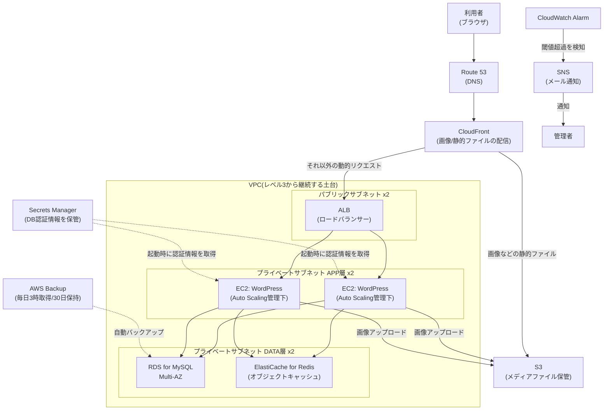

# レベル4: 本番運用を想定したWordPress環境構築(EC2/RDS/ElastiCache/S3/CloudFront + バックアップ設計)

## この課題の位置づけ

インフラ未経験者が受託・自社問わず最も遭遇しやすい案件が「WordPress構築」です。CMS(コンテンツ管理システム。プログラミング知識がなくてもWebサイトを更新できる仕組み)としてのWordPressは世界中で使われており、サーバー構築エンジニアはその裏側の土台を任されます。

レベル4では、レベル3で構築した「ALB(ロードバランサー)+ Auto Scaling + RDS Multi-AZ」の高可用性3層構成を前提とし、その上にWordPress本体を載せ、実運用に欠かせない「キャッシュ・バックアップ・監視」まで設計します。本ドキュメントは**レベル3との差分のみ**を詳しく解説するため、VPC・サブネット・ALB・Auto Scalingの基本手順は[レベル3のドキュメント](../03-ha-three-tier/README.md)を先に参照してください。

## 身につくスキル

- レベル3の冗長構成の上にミドルウェア(OSとアプリの間で動く土台。ここではPHP/WordPress)を載せる力
- ElastiCache(AWSのインメモリ型キャッシュサービス。よく使うデータを高速なメモリ上に一時保存する仕組み)導入によるパフォーマンス設計
- メディアファイル(画像・動画)をS3にオフロード(サーバー本体から専用サービスへ処理・保存を切り出すこと)する設計
- 自動バックアップと復旧計画の立て方(RPO/RTOという考え方)
- 監視アラートの設計(CloudWatch Alarm → SNS通知)

## 全体構成図



> 🧠 **覚え方のコツ**: 「入口(CloudFront)→受付(ALB)→作業員(EC2)→倉庫(RDS/Redis/S3)」という飲食店の厨房をイメージすると整理しやすいです。画像という「出来合いの惣菜」はCloudFrontという「陳列棚」から直接渡し、調理(動的処理)だけを厨房(EC2)が担当します。

## 使用するAWSサービスと役割

| サービス | 役割 | 位置づけ |
|---|---|---|
| ALB / Auto Scaling / RDS Multi-AZ | Web・アプリ・DB層の冗長構成 | レベル3で構築済み(詳細はレベル3参照) |
| ElastiCache for Redis | ページ・クエリ結果をメモリにキャッシュし応答を高速化 | 今回新規追加 |
| S3 | アップロード画像・動画などメディアファイルの保管先 | 今回新規追加 |
| CloudFront | S3上のメディアをエッジロケーション(利用者に地理的に近い配信拠点)経由で配信するCDN | 今回新規追加 |
| Secrets Manager | DBのユーザー名・パスワードなど機密情報を暗号化して一元管理 | 今回新規追加 |
| AWS Backup | RDSやEBS(EC2にアタッチする仮想ディスク)のバックアップを一元管理・自動化 | 今回新規追加 |
| CloudWatch Alarm + SNS | メトリクスが閾値を超えたら検知し、SNS(通知配信を仲介するサービス)経由でメール通知 | 今回新規追加 |

## ハンズオン手順

### フェーズ1: EC2にPHPとWordPress本体をセットアップする

レベル3のApp層EC2(Amazon Linux 2023)にセッションマネージャーなどで接続し、以下を実行します。

```bash
sudo dnf install -y php php-mysqlnd php-fpm php-gd php-mbstring php-xml wget

cd /tmp
wget https://ja.wordpress.org/latest-ja.tar.gz
tar -xzf latest-ja.tar.gz
sudo rsync -a wordpress/ /var/www/html/
sudo chown -R apache:apache /var/www/html
sudo systemctl enable --now httpd php-fpm
```

> 🧠 **覚え方のコツ**: WordPressの動作には「Web/PHP(調理する人)」と「MySQL/DB(食材庫)」の両方が必要です。今回はWeb/PHPをEC2に、DBはレベル3で作ったRDSに分離しているので、「調理場と食材庫が別の建物にある」状態だとイメージしてください。

### フェーズ2: DB接続情報をSecrets Managerで管理する

`wp-config.php` にDB認証情報を直書きすると、コード漏えい時にパスワードごと流出し、パスワード変更のたびに全EC2の設定を書き換える運用負荷も発生します。そこでSecrets Managerに認証情報を保管し、EC2はIAMロール(EC2に付与する「権限の帽子」。認証情報を持たずに一時的な権限だけを借りられる仕組み)経由で実行時に取得する設計にします。

1. **シークレットを作成する**: Secrets Managerで「新しいシークレットを保存する」→種類「Amazon RDSのデータベースの認証情報」を選び、ユーザー名・パスワード・対象RDSを指定。名前は `wordpress/prod/db` のようにします。
2. **IAMロールに最小権限を付与する**: アクションを `secretsmanager:GetSecretValue` のみ、リソースを手順1のシークレットARN(AWSのリソースを一意に指す識別子)のみに絞ったポリシーをEC2のIAMロールに追加します。
3. **wp-config.phpから取得する**: `wp-settings.php` 読み込み前に、AWS SDK for PHPでシークレットを取得しDB接続定数を動的に定義します。

```php
<?php
require '/var/www/vendor/autoload.php';
use Aws\SecretsManager\SecretsManagerClient;

$client = new SecretsManagerClient(['region' => 'ap-northeast-1', 'version' => '2017-10-17']);
$secret = json_decode($client->getSecretValue(['SecretId' => 'wordpress/prod/db'])['SecretString'], true);

define('DB_NAME', $secret['dbname']);
define('DB_USER', $secret['username']);
define('DB_PASSWORD', $secret['password']);
define('DB_HOST', $secret['host']);
```

> 🧠 **覚え方のコツ**: Secrets Managerは「金庫」、IAMロールは「金庫を開けられる社員証」です。社員証を持つEC2だけが金庫を開けられ、パスワードそのものはソースコードにもサーバー内にも一切書かれません。

### フェーズ3: ElastiCache(Redis)でキャッシュ層を追加する

WordPressは1リクエストで何十回もDBに問い合わせが発生しがちで、アクセス増加時にDBがボトルネック(全体速度を決める最も遅い部分)になります。ElastiCache for Redisをオブジェクトキャッシュ(DBへの問い合わせ結果をメモリに保存し、同じ問い合わせにはDBに聞かず即答する仕組み)として挟み、負荷とレスポンスを改善します。

1. **サブネットグループを作成する**: レベル3のプライベートサブネット(DATA層)を指定して作成します。
2. **セキュリティグループを設定する**: App層EC2のSGからのインバウンドのみ許可(タイプ「カスタムTCP」・ポート `6379`〈Redisの標準ポート〉)する新規SGを作成します。
3. **Redisクラスターを作成する**: ノードタイプ `cache.t4g.micro` など、本番想定ならレプリカ1以上を指定し、手順1・2を紐付けます。
4. **プラグインを導入する**: 「Redis Object Cache」のようなオブジェクトキャッシュプラグインを有効化し、`wp-config.php` にRedisのエンドポイント(接続先を示すホスト名)を追記します。

```php
define('WP_REDIS_HOST', 'your-cluster.xxxxxx.ng.0001.apne1.cache.amazonaws.com');
define('WP_REDIS_PORT', 6379);
```

> 🧠 **覚え方のコツ**: キャッシュは「よく聞かれる質問への回答を付箋にメモしておく受付係」です。毎回本棚(DB)まで調べに行かず、付箋(Redis)にあれば即答する。付箋が増えるほど本棚への往復が減り、対応スピードが上がります。

### フェーズ4: メディアファイルをS3にオフロードしCloudFrontで配信する

Auto Scalingで台数が増減するEC2のローカルディスクに画像を保存すると、アクセス先サーバーによってアップロード画像が見えたり見えなかったりします。そこでアップロード画像をS3に集約し、配信はCloudFrontに任せます。

1. **S3バケットを作成する**: `wordpress-prod-media-<自分のアカウント固有の文字列>` のようにグローバルで一意な名前にし、パブリックアクセスはブロックしたまま作成します。
2. **EC2用IAMロールに書き込み権限を追加する**: `s3:PutObject` / `s3:GetObject` を対象バケットに限定して付与します。
3. **メディアオフロード用プラグインを導入する**: S3へメディアをオフロードするタイプのプラグインを有効化し、バケット名とリージョンを設定します。新規アップロード画像はS3に保存され、記事内URLもS3(またはCloudFront)のドメインに書き換わります。
4. **CloudFrontディストリビューションを作成する**: オリジン(配信元)にS3バケットを指定し、OAC(Origin Access Control。CloudFront経由以外のS3への直接アクセスを禁止する仕組み)を設定。払い出されたドメイン名をプラグインのCDN設定欄に入力します。

> 🧠 **覚え方のコツ**: 「S3=倉庫」「CloudFront=倉庫の近くに置く自動販売機」です。全員が東京の倉庫まで買いに行くのではなく、世界各地の自動販売機(エッジロケーション)がキャッシュ済みの商品(画像)をその場で渡すので体感速度が上がります。

### フェーズ5: AWS Backupで自動バックアップを設定する

1. **バックアップボールトを作成する**: バックアップの保管場所となるボールトを作成(デフォルトボールト利用も可)。
2. **バックアッププランを作成する**: 「新しいプランを構築」でルール名 `daily-3am-30days`、頻度「毎日」、開始時刻は日本時間3:00(UTC基準のため前日18:00を指定)、保持期間 **30日** を設定します。
3. **対象をタグで紐付ける**: `Environment: production` のタグをRDSとEBSの両方に付け、リソース割り当てで「タグによって選択」しそのタグを指定します。

```bash
aws backup list-backup-plans --query "BackupPlansList[*].{Name:BackupPlanName,Id:BackupPlanId}"
```

> 🧠 **覚え方のコツ**: バックアップ設計は「RPO(Recovery Point Objective。どこまで新しいデータまで戻せるか=許容できるデータ消失量)」と「RTO(Recovery Time Objective。障害発生から復旧までの許容時間)」の2軸で数字を決めます。「毎日3時取得・30日保持」はRPO最大24時間、遡れる範囲30日という設計だと覚えましょう。

### フェーズ6: CloudWatch Alarm + SNSで監視通知を設定する

1. **SNSトピックを作成する**: タイプ「スタンダード」、名前 `wordpress-prod-alerts` を作成し、サブスクリプションでプロトコル「Eメール」を登録します(届く確認メールでの承認が必要)。
2. **代表的なアラームを作成する**: 以下の3つを設定し、通知先に手順1のSNSトピックを指定します。

| アラーム名の例 | 対象メトリクス | しきい値の例 | 検知したい問題 |
|---|---|---|---|
| ec2-high-cpu | EC2 CPUUtilization | 80%超が5分間 × 連続2回 | 想定外の高負荷やスケール遅延 |
| rds-low-storage | RDS FreeStorageSpace | 空き容量が2GiB未満 | ディスクフルによるDB停止の予兆 |
| alb-5xx-error | ALB HTTPCode_Target_5XX_Count | 5分間で10件以上 | アプリ層・DB接続エラーなどの異常発生 |

```bash
aws cloudwatch put-metric-alarm \
  --alarm-name "ec2-high-cpu" \
  --namespace "AWS/EC2" \
  --metric-name "CPUUtilization" \
  --statistic Average \
  --period 300 \
  --evaluation-periods 2 \
  --threshold 80 \
  --comparison-operator GreaterThanThreshold \
  --alarm-actions "arn:aws:sns:ap-northeast-1:<アカウントID>:wordpress-prod-alerts"
```

> 🧠 **覚え方のコツ**: 監視は「見張り番(CloudWatch Alarm)」と「伝令(SNS)」の2段構えです。見張り番が異常に気づいても、伝令がいなければ誰にも伝わりません。この2つがセットで初めて「気づいたら人間に届く」監視になります。

## セキュリティのポイント

- ✅ DB認証情報はコードに直書きせず、必ずSecrets Manager経由で取得します。ソースコードが誤って公開されても、パスワードそのものは流出しません。
- ⚠️ WordPress管理画面(`/wp-admin` `/wp-login.php`)は総当たり攻撃の標的です。ALBのリスナールール(条件付きでリクエストを振り分ける設定)でパスパターンを指定し、送信元IPを自宅・社内の固定IPのみに絞ることで、攻撃者がログイン画面にたどり着けない設計にします。
- 💰⚠️ プラグインは必要最小限にとどめます。増えるほど脆弱性(セキュリティ上の弱点)混入リスクと更新・検証の運用負荷が比例して増えるためです。

## コスト概算

| 項目 | 月額の目安(東京リージョン、常時稼働) | 注意点 |
|---|---|---|
| EC2(t3.small × 2台、Auto Scaling想定) | 数千円〜 | インスタンスタイプ・稼働時間で変動 |
| RDS for MySQL(Multi-AZ、db.t3.micro相当) | 数千円〜 | Multi-AZは同等スペック1台構成の約2倍のコスト |
| ElastiCache for Redis(cache.t4g.micro) | 数千円〜 | ⚠️ **無料利用枠がありません**。作成時点から課金されるため検証後は必ず削除する |
| CloudFront | 数百円〜(転送量に応じた従量課金) | 最初の1TB/月は無料利用枠の対象(詳細は公式ページで要確認) |
| S3 | 数百円未満〜(保存量・リクエスト数に応じた従量課金) | メディア量が少ないうちは軽微な費用に収まりやすい |

最新の料金・無料利用枠の条件は必ず公式ページで確認してください([AWS無料利用枠](https://aws.amazon.com/jp/free/))。

## トラブルシューティング

| 症状 | 想定される主な原因 | 確認・対処方法 |
|---|---|---|
| サイトの表示が重い | オブジェクトキャッシュが効いていない/DBのスロークエリ(実行に時間がかかるSQL) | プラグイン管理画面でキャッシュの有効状態を確認。RDSのパフォーマンスインサイトなどで時間のかかるクエリを特定する |
| `Error establishing a database connection`が出る | Secrets ManagerへのIAM権限不足/DB接続用SGの許可漏れ | EC2のIAMロールに`secretsmanager:GetSecretValue`があるか確認。RDSのSGでApp層EC2のSGからのポート3306(MySQLの標準ポート)が許可されているか確認 |
| アップロード画像が消える・表示されない | S3オフロードプラグインの設定ミス(バケット名/リージョン/IAM権限の不一致) | プラグイン設定画面でバケット名・リージョンを再確認。EC2のIAMロールに対象バケットへの`s3:PutObject`権限があるか確認 |

## 発展課題

- **Blue/Greenデプロイでのアップデート**: 新バージョンを載せた別環境(Green)を用意しALBの向き先を切り替えることで、無停止かつ切り戻し可能な更新フローを実現する
- **WAFによるWordPress特有の攻撃対策**: ログイン試行の総当たり攻撃やSQLインジェクションなど、WordPress特有の攻撃パターンをWAF(Webアプリケーションファイアウォール)のルールでブロックする。この強化は[レベル5のドキュメント](../05-security-monitoring/README.md)で扱います

## 面接でのアピールポイント

**Q. なぜキャッシュ層(ElastiCache)を導入したのですか?**

A. WordPressは1ページの表示に多数のDBクエリが発生する構造上、アクセス増加時にRDSがボトルネックになりやすい性質があります。ElastiCache for Redisをオブジェクトキャッシュとして挟み、同一クエリへの再問い合わせをメモリ上の応答に置き換えることで、RDSの負荷とレスポンスタイムを改善できると判断しました。あわせてElastiCacheには無料利用枠が無く常時課金が発生する点も理解したうえで、コストと性能のバランスを踏まえて導入しています。

**Q. バックアップの保持期間はどのように決めましたか?**

A. RPO(どこまでのデータ消失を許容するか)を最大24時間、つまり「毎日1回のバックアップで直近1日分のデータ消失までは許容する」前提で取得頻度を1日1回にしました。保持期間30日は、月次単位での不具合発覚にも遡って対応できる期間として設定しています。実際の案件ではビジネス側の許容度やコンプライアンス要件から逆算すべき数字であり、「なんとなく30日」ではなく根拠を持って決める必要があると考えています。

## 参考リンク

- [Amazon EC2のドキュメント](https://docs.aws.amazon.com/ec2/)
- [Amazon RDSユーザーガイド](https://docs.aws.amazon.com/AmazonRDS/latest/UserGuide/Welcome.html)
- [Amazon ElastiCache for Redisユーザーガイド](https://docs.aws.amazon.com/AmazonElastiCache/latest/red-ug/WhatIs.html)
- [Amazon S3ユーザーガイド](https://docs.aws.amazon.com/AmazonS3/latest/userguide/Welcome.html)
- [Amazon CloudFront開発者ガイド](https://docs.aws.amazon.com/AmazonCloudFront/latest/DeveloperGuide/Introduction.html)
- [AWS Secrets Managerユーザーガイド](https://docs.aws.amazon.com/secretsmanager/latest/userguide/intro.html)
- [AWS Backup開発者ガイド](https://docs.aws.amazon.com/aws-backup/latest/devguide/whatisbackup.html)
- [Amazon CloudWatchユーザーガイド](https://docs.aws.amazon.com/AmazonCloudWatch/latest/monitoring/WhatIsCloudWatch.html)
- [AWS無料利用枠](https://aws.amazon.com/jp/free/)
- [AWS Well-Architected Framework](https://aws.amazon.com/jp/architecture/well-architected/)

## ハンズオンキット(そのまま実行できるスクリプト)

この案件の構成を AWS CLI / Terraform で自動構築・削除できるキットを [handson/](handson/README.md) に用意しています。本編の手順をコンソールで一度体験したあと、キットで「コードによる再現」を試すと理解が定着します。⚠️ 実行前に必ず [handson/README.md](handson/README.md) の課金注意と削除手順を読んでください。

## 関連ドキュメント

- [ポートフォリオ全体トップ](../../README.md)
- [AWS基礎知識](../../docs/01-aws-basics-for-beginners.md)
- [用語集](../../docs/02-glossary.md)
- [前のプロジェクト(レベル3: 高可用性3層構成)](../03-ha-three-tier/README.md)
- [次のプロジェクト(レベル5: セキュリティ監視)](../05-security-monitoring/README.md)
