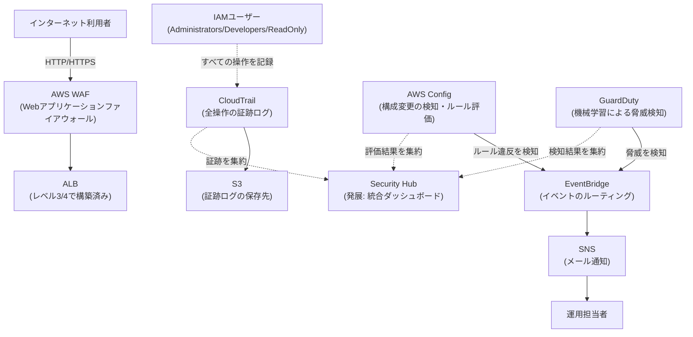

# レベル5: セキュアな監視・ガバナンス基盤の構築(IAM設計 + CloudTrail + GuardDuty + Config + WAF)

## この課題の位置づけ

レベル2〜4では「動くインフラを作る」ことに主眼を置いてきました。しかし実務のインフラエンジニアの仕事は、構築して終わりではありません。「誰が・いつ・何をしたか」を追跡できる状態を保ち、設定ミスや攻撃の兆候にいち早く気づき、必要な人に必要な権限だけを与え続ける──この「守り続ける」運用こそが、本番環境を任される上で最も評価されるスキルです。

レベル5では、これまでの構成(レベル2のEC2単体、レベル3の高可用性3層構成、レベル4のWordPress本番環境)を横断する形で、セキュリティ運用・監査・脅威検知のレイヤーを追加します。特定のシステムに紐づく案件ではなく、「AWSアカウント全体をどう安全に運用するか」というガバナンス(組織としての統制・管理の仕組み)の視点を持つ案件として位置づけています。

## 身につくスキル

- IAM(Identity and Access Management。AWSの各種リソースへのアクセス権限を一元管理する仕組み)のユーザー/グループ/ロール/ポリシーを、**最小権限の原則**(業務に必要な権限だけを過不足なく与える考え方)で設計する力
- 操作ログ(証跡)を残し、後から「誰が何をしたか」を追跡できる仕組みの理解
- 構成変更の自動検知・脅威検知の仕組みの理解
- Webアプリケーションファイアウォール(WAF。Webアプリケーションへの攻撃をHTTP/HTTPSのレベルで検知・遮断する仕組み)による攻撃防御の基礎

## 全体構成図



> 🧠 **覚え方のコツ**: このレイヤーは「門番(WAF)」「録画カメラ(CloudTrail)」「定点監視員(Config)」「警備AI(GuardDuty)」「通報係(EventBridge+SNS)」の5役だと覚えましょう。門番は入口で不審者を弾き、録画カメラは全員の行動を記録し、定点監視員は「配置が変わっていないか」を見張り、警備AIは異常行動そのものを見抜き、通報係がそれを人間に伝える。役割が分かれているからこそ、1つが見逃しても他でカバーできます。

## 使用するAWSサービスと役割

| サービス | 役割 | なぜ必要か(1文) |
|---|---|---|
| IAM | ユーザー・グループ・ロール・ポリシーによる権限管理 | 権限管理が甘いと、退職者のアカウントや漏えいした認証情報が本番環境の全権を握ったままになるリスクを防げない |
| CloudTrail | 全操作の証跡(いつ・誰が・何をしたかのログ)を記録 | CloudTrailが無いと「誰が何をしたか」が分からず、障害調査もインシデント対応(セキュリティ事故発生時の対応)も勘に頼るしかなくなる |
| AWS Config | リソース構成の変更履歴を記録し、あらかじめ決めたルールに沿っているか継続的に評価 | 意図しない設定変更(例: セキュリティグループの誤った開放)を検知できないと、脆弱な状態が放置されたまま気づけない |
| GuardDuty | 機械学習と脅威インテリジェンスを使い、不審な通信や乗っ取りの兆候を自動検知 | 攻撃者は人間が気づく前に痕跡を消そうとするため、機械的・継続的な監視が無いと侵入に気づくのが手遅れになる |
| AWS WAF | ALBに関連付け、SQLインジェクション(悪意あるSQL文をリクエストに混入させる攻撃)やXSS(悪意あるスクリプトを混入させる攻撃)などWebアプリへの攻撃をリクエスト単位でブロック | アプリ側のコード修正だけでは防ぎきれない既知の攻撃パターンを、通信の入口でまとめて遮断できる |
| EventBridge + SNS | GuardDuty/Configの検知結果をイベントとして拾い、SNS(通知の配信を仲介するサービス)経由でメール通知 | 検知しても人に届かなければ意味が無く、通知の自動化が初動対応の速さを決める |
| Security Hub(発展) | CloudTrail・Config・GuardDutyなど複数サービスの結果を1つのダッシュボードに統合 | 複数サービスの画面を毎回行き来しなくても、全体のセキュリティ状態を一目で把握できるようにする |

## ハンズオン手順

### フェーズ1: IAMを最小権限で設計する

まず「誰が・何を・どこまでできるか」を決めるIAM設計を行います。個々のIAMユーザーに直接ポリシーを付けるのではなく、役割ごとのグループにポリシーをまとめて付与し、ユーザーはそのグループに所属させるのが基本形です。あわせて、MFA(Multi-Factor Authentication。パスワードに加えてスマートフォンの認証アプリなどでもう1段階本人確認する仕組み)をどのグループに必須とするかもここで決めておきます。

| グループ名 | 主な用途 | 付与するポリシーの考え方 | MFA |
|---|---|---|---|
| Administrators | インフラ全体の設計・変更を行う少数の管理者 | AWS管理ポリシー`AdministratorAccess`相当を付与するが、対象人数は最小限に絞る | 必須(最重要アカウントのため特に厳格に) |
| Developers | アプリのデプロイ・ログ確認などを行う開発者 | EC2/S3/CloudWatch Logsなど「業務上必要なサービスの範囲」に絞ったカスタムポリシーを付与し、IAMやVPCなど基盤設定の変更権限は含めない | 必須 |
| ReadOnly | 参照のみで良い担当者(学習者・監査担当など) | AWS管理ポリシー`ReadOnlyAccess`相当を付与し、作成・変更・削除の権限は一切含めない | 必須 |

1. **IAMコンソールでグループを3つ作成する**: 「ユーザーグループ」→「グループを作成」で `Administrators` `Developers` `ReadOnly` という名前のグループをそれぞれ作成します。
2. **各グループにAWS管理ポリシーをアタッチする**: Administratorsには`AdministratorAccess`、ReadOnlyには`ReadOnlyAccess`をアタッチします。Developersには、上表の考え方に沿ってEC2・S3・CloudWatch Logsなど必要なサービスのアクションのみを許可するカスタムポリシーを作成してアタッチします。
3. **MFAを強制するガードレールポリシーを作成する**: IAMの「ポリシー」→「ポリシーを作成」でJSONタブに以下を貼り付け、名前を`ForceMFA`として作成します。全グループにアタッチしますが、特にDevelopers・ReadOnlyのように所属人数が増えやすいグループでは、この条件式による機械的な強制が欠かせません。

```json
{
  "Version": "2012-10-17",
  "Statement": [
    {
      "Sid": "DenyMostActionsWithoutMFA",
      "Effect": "Deny",
      "NotAction": [
        "iam:CreateVirtualMFADevice",
        "iam:EnableMFADevice",
        "iam:ListMFADevices",
        "iam:ListVirtualMFADevices",
        "iam:ResyncMFADevice",
        "sts:GetSessionToken"
      ],
      "Resource": "*",
      "Condition": {
        "BoolIfExists": {
          "aws:MultiFactorAuthPresent": "false"
        }
      }
    }
  ]
}
```

`aws:MultiFactorAuthPresent`は「このAPIリクエストがMFA認証済みのセッションから来ているか」を表す条件キーです。この値が`false`(=MFA未認証)の場合、MFAデバイス自体の登録操作以外の**すべての操作を明示的にDeny**します。`BoolIfExists`を使う理由は、この条件キー自体が存在しないリクエスト(一部のAPI呼び出し)でエラーにせず安全側に倒すためです。

4. **IAMユーザーを作成しMFAデバイスを登録する**: 各ユーザーの「セキュリティ認証情報」タブから「MFAデバイスの割り当て」を行い、仮想MFAデバイス(スマートフォンの認証アプリなど)を登録します。

> 🧠 **覚え方のコツ**: 最小権限の原則は「ホテルのカードキー」で覚えましょう。宿泊客のカードキーは自分の部屋しか開かず、清掃スタッフのカードキーは客室フロアの共用部まで、支配人のマスターキーだけが全室を開けられます。全員にマスターキーを渡すホテルは無いはずです。IAMのポリシー設計も同じで、「その人の仕事に必要な扉(権限)だけ」を渡すのが基本です。

### フェーズ2: CloudTrailで全リージョンの証跡を作成する

1. **CloudTrailコンソールで証跡を作成する**: 「証跡」→「証跡の作成」を選択し、証跡名を`org-management-trail`とします。
2. **「すべてのリージョンに適用」を有効にする**: 特定リージョンだけ有効にすると、普段使わないリージョン(例: バージニア北部)で行われた不正なIAM操作などが記録されず、調査の抜け穴になります。全リージョンを対象にすることで、どこで何が起きても取りこぼしません。
3. **保存先S3バケットを指定する**: 新規バケット`cloudtrail-logs-<自分のアカウントID>`のようにグローバルで一意な名前で作成します。
4. **「ログファイルの検証を有効にする」をオンにする**: ログファイルごとにハッシュ値のチェーン(digest file)を生成し、後からログが改ざん・削除されていないかを検証できるようにする機能です。これが無いと、万が一ログが書き換えられても気づく手段が無く、「証跡としての信頼性」そのものが揺らいでしまいます。

```bash
# 証跡の状態(ロギングが有効か)をCLIで確認する例
aws cloudtrail get-trail-status --name org-management-trail --query "IsLogging"
```

### フェーズ3: AWS Configで構成変更を継続的に監視する

1. **Configの記録を開始する**: AWS Configコンソールで「今すぐ始める」を選び、記録対象リソースを「このリージョンでサポートされているすべてのリソースを記録する」に設定します。
2. **配信先S3バケットを指定する**: `config-bucket-<自分のアカウントID>`のような新規バケットを作成し、構成スナップショットの保存先とします。
3. **代表的なマネージドルール(AWSがあらかじめ用意した評価ルール)を追加する**: 「ルール」→「ルールを追加」から以下を有効化します。

| マネージドルール名 | チェック内容 |
|---|---|
| `s3-bucket-public-read-prohibited` | S3バケットが誰でも読み取り可能な公開状態になっていないか |
| `restricted-ssh` | セキュリティグループでSSH(ポート22)が`0.0.0.0/0`(インターネット全体)に対して開放されていないか |

4. **違反にどう気づくか**: ルールに違反するリソースがあると、Configダッシュボード上でそのリソースが「非準拠(Noncompliant)」と表示されます。さらにフェーズ4と同じ仕組み(EventBridge→SNS)を使えば、違反が発生した瞬間にメール通知を受け取ることもでき、ダッシュボードを毎回見に行かなくても異常に気づける体制になります。

```bash
# restricted-sshルールの評価結果(準拠/非準拠)をCLIで確認する例
aws configservice describe-compliance-by-config-rule --config-rule-names restricted-ssh
```

> 🧠 **覚え方のコツ**: Configは「間取り図と現況の突き合わせを毎日行う管理人」だとイメージしてください。最初に決めた正しい間取り(あるべき設定)と、今の実際の部屋の状態(実際の設定)を常に見比べ、勝手に壁が取り払われていたら(=ルール違反があれば)「非準拠」の札を立てて教えてくれます。

### フェーズ4: GuardDutyを有効化しEventBridge経由でSNS通知する

1. **GuardDutyを有効化する**: GuardDutyコンソールで「今すぐ始める」→「GuardDutyを有効にする」を選択します(初回30日間は無料トライアル)。有効化するだけで、VPCフローログやDNSログ、CloudTrailの証跡などを裏側で分析し始めます。
2. **SNSトピックを作成する**: SNS画面で「トピックの作成」→タイプ「スタンダード」、名前`security-alerts`を作成し、「サブスクリプションの作成」でプロトコル「Eメール」・エンドポイントに通知先メールアドレスを登録します(確認メールでの承認が必要です)。
3. **EventBridgeルールを作成する**: EventBridgeコンソールで「ルールを作成」し、イベントパターンとして以下のようにGuardDutyの検知結果(Finding)のみを拾う条件を指定します。

```json
{
  "source": ["aws.guardduty"],
  "detail-type": ["GuardDuty Finding"],
  "detail": {
    "severity": [{ "numeric": [">=", 4] }]
  }
}
```

4. **ターゲットにSNSトピックを指定する**: ルールのターゲットとして手順2で作成した`security-alerts`トピックを選択します。これで、severity(深刻度。0〜8.9で表され、数値が高いほど深刻)が4以上の検知結果が出るたびに、自動でメールが届くようになります。

> 🧠 **覚え方のコツ**: GuardDuty→EventBridge→SNSの流れは「警備AI→無線→伝令」の3段構えです。警備AI(GuardDuty)が異常を見つけても、無線(EventBridgeのイベントパターン)がその情報を正しく拾わなければ、伝令(SNS)にすら情報が渡りません。イベントパターンの条件を絞りすぎると「何も拾わない無線」になってしまう点に注意しましょう。

### フェーズ5: AWS WAFでALBを保護する

1. **Web ACL(Web Access Control List。WAFのルールをまとめたセット)を作成する**: WAF & Shieldコンソールで「Web ACLを作成」を選び、リソースタイプは「リージョンリソース」、リージョンはレベル3/4のALBが存在するリージョンを選択します。
2. **AWSマネージドルールグループを追加する**: 「ルールとルールグループを追加」→「AWSマネージドルールグループを追加」から、コアルールセット相当の`AWSManagedRulesCommonRuleSet`(SQLインジェクションやXSSなど、代表的なWeb攻撃パターンをあらかじめ検知できるようにした既製のルール集)を有効化します。
3. **デフォルトアクションを確認する**: デフォルトアクションは「許可(Allow)」のままにします。これにより、マネージドルールに一致した怪しいリクエストだけがブロックされ、通常のアクセスはそのまま通過します。
4. **レベル3/4で構築したALBに関連付ける**: Web ACLの「関連付けられたAWSリソース」画面で、対象のALBを選択して関連付けます。

```bash
# 作成済みのWeb ACLをALBに関連付けるCLI例
aws wafv2 associate-web-acl \
  --web-acl-arn "arn:aws:wafv2:ap-northeast-1:<アカウントID>:regional/webacl/alb-protection/xxxxxxxx" \
  --resource-arn "arn:aws:elasticloadbalancing:ap-northeast-1:<アカウントID>:loadbalancer/app/xxxxx/xxxxx"
```

> 🧠 **覚え方のコツ**: WAFは「建物の入口に立つ受付兼ボディチェック係」です。ALBという建物の入口に立ち、あらかじめ配られた「不審物リスト(マネージドルール)」に該当する荷物(悪意あるリクエスト)だけを止め、それ以外の来訪者はそのまま通します。リスト自体はAWSが日々更新してくれるため、自分たちで攻撃パターンを1から作り込む必要がない点が大きなメリットです。

### フェーズ6: Policy Simulatorでアクセス拒否をデバッグする

IAMポリシーは「複数のポリシーが重なって最終的な可否が決まる」ため、実際にAPIを叩かずに事前確認できるPolicy Simulator(ポリシーシミュレーター)を使うと、原因の切り分けが速くなります。

1. **Policy Simulatorを開く**: IAMコンソールで対象のユーザー・グループ・ロールの詳細画面から、ポリシーのシミュレーション機能を開きます。
2. **確認したいアクションを選ぶ**: 例えば「Developersグループに所属するユーザーが`ec2:TerminateInstances`(EC2インスタンスの削除)を実行できるか」を選択します。
3. **シミュレートを実行する**: 実際にはAPIを呼び出さず、アタッチされている全ポリシーを評価した上で「許可される見込みか、拒否される見込みか」、拒否ならどのポリシーのどのステートメントが原因かを確認できます。

```bash
# CLIでポリシーシミュレーションを行う例
aws iam simulate-principal-policy \
  --policy-source-arn "arn:aws:iam::<アカウントID>:group/Developers" \
  --action-names "ec2:TerminateInstances"
```

## コスト概算

| サービス | 課金の考え方 | 目安 |
|---|---|---|
| CloudTrail | 証跡(管理イベントの記録)自体は無料。保存先のS3ストレージ料金のみ発生 | 月あたり数十円程度(ログ量が少ないうち) |
| AWS Config | 記録した構成項目数・ルール評価数に応じた従量課金 | 月数百円〜(有効化するルール数に比例) |
| GuardDuty | 分析対象のログ量(VPCフローログ・DNSログなど)に応じた従量課金。初回30日間は無料トライアル | トライアル後は月数百円〜(検証用途の小規模環境なら) |
| AWS WAF | Web ACL作成費用(月額固定)+ルール数に応じた費用+リクエスト数に応じた従量課金 | 月数百円〜(小規模な検証環境の場合) |

⚠️ GuardDuty・Config・WAFはいずれも「有効化している間ずっと課金対象」のサービスです。学習・検証目的で一時的に有効化した場合は、確認が終わったら**無効化または削除**する運用ルールを徹底しましょう。一方で実際の本番運用では、これらは「常時有効にしておくべきセキュリティサービス」である点も合わせて理解しておく必要があります。最新の料金は必ず公式ページで確認してください([AWS無料利用枠](https://aws.amazon.com/jp/free/))。

## トラブルシューティング

| 症状 | 想定される主な原因 | 確認・対処方法 |
|---|---|---|
| ポリシーを付与したのに操作がAccess Deniedになる | 別のポリシーで明示的にDenyされている(Denyは常にAllowより優先される)/ポリシーのリソースARN指定ミス | Policy Simulatorでどのステートメントが原因かを特定する。フェーズ1の`ForceMFA`ポリシーのようにDenyを含むポリシーが他にアタッチされていないか確認する。ポリシー内のResource欄のARN(Amazon Resource Name。サービス名・リージョン・アカウントID・リソースIDなどを含む、AWSリソースを一意に指し示す識別子)に誤りが無いか見直す |
| CloudTrailのログがS3バケットに見当たらない | 証跡が有効化されていない/S3バケットポリシーがCloudTrailからの書き込みを許可していない/リージョン設定の見落とし | CloudTrailコンソールで証跡が「ロギング: オン」になっているか確認する。S3バケットのバケットポリシーに`cloudtrail.amazonaws.com`からの`s3:PutObject`を許可する記述があるか確認する。「すべてのリージョンに適用」が有効か再確認する |
| GuardDutyの通知メールが来ない | EventBridgeのイベントパターン設定ミス(sourceやdetail-typeの記述誤り、severityの絞り込みすぎ)/SNSサブスクリプションが未確認(Pending Confirmation)のまま | EventBridgeルールの「イベントパターン」タブでJSONの構文・キー名(`source`は`aws.guardduty`、`detail-type`は`GuardDuty Finding`)を確認する。SNSコンソールでサブスクリプションのステータスが「確認済み」になっているか確認する |

## 発展課題

- **Security Hubで複数サービスの結果を1画面に集約する**: CloudTrail・Config・GuardDutyなどの結果はそれぞれ別画面で確認する必要がありますが、Security Hubを有効化すると、これらの検出結果や標準ベンチマークとの適合状況を1つのダッシュボードに集約して俯瞰できます。
- **Organizations併用時のガードレール設計(SCP)に触れる**: 複数のAWSアカウントを組織(Organizations)でまとめて管理する場合、SCP(Service Control Policies。アカウント単位で「そもそも実行できないAPI操作」を組織的に制限する仕組み)を使うことで、IAMポリシーよりさらに上位のレイヤーで「誰であってもこの操作は禁止」という組織全体のガードレール(安全柵)を敷くことができます。

## 面接でのアピールポイント

**Q. 最小権限の原則をどう実践しましたか?**

A. まずAdministrators/Developers/ReadOnlyという役割ベースのグループを設計し、個々のユーザーに直接ポリシーを付けるのではなく、必ずグループ経由で権限を管理する形にしました。Developersグループには業務上必要なEC2・S3・CloudWatch Logsなどの操作権限のみを許可し、IAMやネットワークなど基盤設定を変更できる権限は含めませんでした。さらに`aws:MultiFactorAuthPresent`条件を使ったガードレールポリシーで、MFA未認証のセッションからはMFAデバイス登録以外のほぼ全ての操作をDenyする設計にし、「権限を絞る」ことと「本人確認を強制する」ことの両方から最小権限を実現しました。

**Q. インシデント(セキュリティ上の異常事態)が起きたら、どう調査しますか?**

A. まずGuardDutyの検知結果で「何が」「いつ」検知されたかを把握し、次にCloudTrailの証跡で該当時刻の前後に「誰の」「どのAPI操作」があったかを突き合わせます。CloudTrailにはログファイル検証を有効化しているため、調査対象のログ自体が改ざんされていないことも確認できます。あわせてAWS Configの構成変更履歴を見て、セキュリティグループなどの設定が不正に変更されていないかも確認します。初動対応としては、疑わしいIAMユーザーの認証情報を無効化し、影響範囲を切り分けてから原因調査に入るという順序を意識しています。

## 参考リンク

- [AWS Identity and Access Management(IAM)ユーザーガイド](https://docs.aws.amazon.com/IAM/latest/UserGuide/introduction.html)
- [AWS CloudTrailユーザーガイド](https://docs.aws.amazon.com/awscloudtrail/latest/userguide/cloudtrail-user-guide.html)
- [AWS Config開発者ガイド](https://docs.aws.amazon.com/config/latest/developerguide/WhatIsConfig.html)
- [Amazon GuardDutyユーザーガイド](https://docs.aws.amazon.com/guardduty/latest/ug/what-is-guardduty.html)
- [AWS WAF開発者ガイド](https://docs.aws.amazon.com/waf/latest/developerguide/waf-chapter.html)
- [Amazon CloudWatchユーザーガイド](https://docs.aws.amazon.com/AmazonCloudWatch/latest/monitoring/WhatIsCloudWatch.html)
- [AWS無料利用枠](https://aws.amazon.com/jp/free/)
- [AWS Well-Architected Framework](https://aws.amazon.com/jp/architecture/well-architected/)

## ハンズオンキット(そのまま実行できるスクリプト)

この案件の構成を AWS CLI / Terraform で自動構築・削除できるキットを [handson/](handson/README.md) に用意しています。本編の手順をコンソールで一度体験したあと、キットで「コードによる再現」を試すと理解が定着します。⚠️ 実行前に必ず [handson/README.md](handson/README.md) の課金注意と削除手順を読んでください。

## 関連ドキュメント

- [ポートフォリオ全体トップ](../../README.md)
- [AWS基礎知識](../../docs/01-aws-basics-for-beginners.md)
- [用語集](../../docs/02-glossary.md)
- [前のプロジェクト(レベル4: WordPress本番運用)](../04-wordpress-production/README.md)
- [次のプロジェクト(レベル6: IaC/CI-CD)](../06-iac-cicd/README.md)
