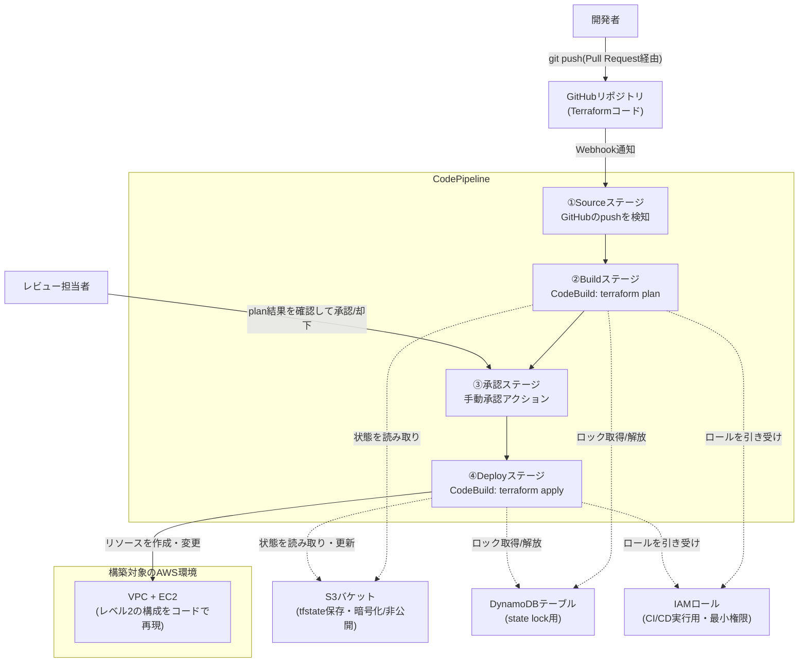

# レベル6: Infrastructure as CodeとCI/CDによる自動構築(Terraform + CodePipeline)

## この課題の位置づけ

レベル1〜5では、AWSマネジメントコンソールを手作業でポチポチ操作する、いわゆる「ClickOps(クリックオプス。コンソール画面をクリックしながら手作業でインフラを作る運用スタイルを揶揄する言葉)」でVPC・EC2・RDS・WAFなどを構築してきました。しかし実務のチーム開発では、この手作業運用には限界があります。「誰が」「いつ」「何を」変更したのか追跡できない、同じ環境をもう一度作ろうとしても手順書通りに再現できない、レビューなしに本番環境が書き換わってしまう、といった問題が起こりやすいためです。

レベル6は本ポートフォリオパックの集大成です。これまで手作業で作ってきた構成の一部(レベル2のVPC+EC2)をTerraform(HashiCorp社が開発するIaCツール)というコードで再現可能にし、さらにそのコードの変更をCodePipeline(ソースコードの変更を検知し、ビルド・テスト・デプロイのステップを自動でつなげるCI/CDパイプライン管理サービス)+ CodeBuild(パイプラインの中でビルドやテストのコマンドを実際に実行するマネージド型サービス)によって自動でテスト・反映する仕組みまで作ります。**「手作業で作れる」ことに加えて「コードで再現でき、チームでレビューしながら安全に変更できる」ことを示せるスキル**は、実務のインフラエンジニア採用において非常に高く評価されるポイントです。

## 身につくスキル

- IaC(Infrastructure as Code。インフラの構成をプログラムのコードとして定義・管理する考え方)が手作業運用と比べてなぜ優れているのかを説明できる
- Terraformの基本構文(HCL。HashiCorp Configuration Languageの略で、Terraform専用の設定ファイル記法)と、再利用しやすいディレクトリ構成(modules/environments)を設計する力
- tfstate(Terraformが管理するリソースの現在の状態を記録したファイル)を、チームで安全に共同編集するための設計力
- CI/CD(Continuous Integration/Continuous Delivery。コードの変更を継続的に自動でテスト・反映していく開発手法の総称)パイプラインでインフラ変更を自動テスト(plan)し、人の目でレビューしたうえで自動反映(apply)する一連の流れ

## 全体構成図



この図の流れを言葉で整理すると次のようになります。開発者がPull Request(PR。コードの変更内容を「これで良いかレビューしてください」とチームに提案するためにGitHub上で作る仕組み)経由でコードをGitHubにpushすると、GitHubがWebhook(GitHub側で何かが起きたときに、あらかじめ登録しておいたAWS側のURLへ自動的に通知を送る仕組み)を通じてCodePipelineのSourceステージへ通知します。以降はCodePipelineが定義された順序でBuild(plan)→承認→Deploy(apply)と処理を進めます。

> 🧠 **覚え方のコツ**: CI/CDパイプラインは「回転寿司の受け渡しレーン」に似ています。開発者がネタ(コード)をGitHubに置く→CodeBuildが「試作(plan)」を握って提示する→レビュー担当者(大将)が味見して合格を出す→初めて本番(apply)としてお客様(本番環境)に提供される。試作なしにいきなり本番に出す店は信用できません。

## 使用するAWSサービスと役割

| サービス | 役割 |
|---|---|
| S3 | tfstate(Terraformの状態ファイル)の保存先。暗号化・バージョニング・非公開設定を必ず行う |
| DynamoDB | 複数人が同時に`terraform apply`しないようにする「state lock(状態ファイルへの同時書き込みを防ぐ排他制御)」の管理テーブル |
| IAM | CI/CD実行用ロールに、必要最小限の権限だけを付与する(最小権限の原則) |
| CodePipeline | Source→Build(plan)→承認→Deploy(apply)という一連の流れを自動でつなぐパイプライン管理サービス |
| CodeBuild | `terraform plan`/`terraform apply`を実際に実行するビルド環境。GitHubのコードを取得し、buildspec.yml(CodeBuildに「何のコマンドをどの順番で実行するか」を指示するYAML形式の設定ファイル)に従って処理する |
| GitHub(連携前提) | Terraformコードの保管場所。CodeStar Connections(GitHubなど外部のコードリポジトリとAWSサービスを安全につなぐための認証済み接続機能)を介してCodePipelineのSourceステージと連携する |

## Terraform vs CloudFormation: なぜTerraformを選ぶか

AWS純正のIaCツールであるCloudFormationという選択肢もありますが、本ポートフォリオではTerraformを採用しました。理由を比較表とともに整理します。

| 観点 | Terraform | CloudFormation |
|---|---|---|
| 提供元 | HashiCorp社(サードパーティ、OSS) | AWS純正 |
| マルチクラウド対応 | ○ 同じHCL構文でAzure/GCPなど他クラウドも扱える | ✕ AWS専用 |
| 学習コスト | HCL(HashiCorp Configuration Language)という専用構文を新たに覚える必要がある | AWSに慣れていればJSON/YAMLの延長で始めやすい |
| State管理 | tfstateを自分たちで管理する必要がある(設計・責任が自分側にある) | AWS側がフルマネージドで管理し、ユーザーは意識しなくてよい |
| 変更差分の見やすさ | `terraform plan`で追加/変更/削除が非常に明確に表示される | チェンジセット(CloudFormationが実際に適用する前に、変更予定の内容をまとめて表示する機能)で確認可能だが情報量はやや簡素 |
| コミュニティ・モジュール資産 | Terraform Registryに世界中の公開モジュールが豊富 | 主にAWS公式のサンプルが中心 |

CloudFormationはState管理をAWSに任せられる手軽さが魅力ですが、Terraformは(1)マルチクラウド案件でも通用する汎用スキルであること、(2)転職市場で「Terraformの実務経験」を求める求人が非常に多いこと、(3)`plan`の差分表示がレビューしやすくCI/CDとの相性が良いこと、から今回はTerraformを選びました。State管理を自分で設計する必要がある分、後述のS3+DynamoDBによる設計そのものが学習ポイントになります。

> 🧠 **覚え方のコツ**: 「Terraform=どの国(クラウド)でも通じる共通言語」「CloudFormation=AWSという1つの国でしか通じない母国語」とイメージすると覚えやすいです。就職活動で見ると、共通言語の話者のほうが応募できる求人の幅が広くなります。

## ディレクトリ構成設計

チームで安全に使い回せるよう、「共通部品(modules)」と「環境ごとの組み合わせ(environments)」を分離した構成にします。

```text
terraform/
├── modules/                  # 再利用可能な部品(リソースの設計図)
│   ├── vpc/
│   │   ├── main.tf
│   │   ├── variables.tf
│   │   └── outputs.tf
│   ├── ec2/
│   │   ├── main.tf
│   │   ├── variables.tf
│   │   └── outputs.tf
│   └── rds/                  # レベル3相当を再現する場合の拡張枠
│       ├── main.tf
│       ├── variables.tf
│       └── outputs.tf
├── environments/              # 環境ごとに部品を組み合わせる場所
│   ├── dev/
│   │   ├── main.tf            # モジュールの呼び出し
│   │   ├── variables.tf
│   │   ├── terraform.tfvars   # dev固有の値
│   │   └── backend.tf         # dev用tfstateの保存先
│   └── prod/
│       ├── main.tf
│       ├── variables.tf
│       ├── terraform.tfvars   # prod固有の値
│       └── backend.tf         # prod用tfstateの保存先
└── buildspec/                 # CodeBuild用の実行手順定義
    ├── plan.yml
    └── apply.yml
```

> 🧠 **覚え方のコツ**: `modules/`は「レゴブロックの部品箱」、`environments/`は「その部品で組み立てた完成品(dev用の街・prod用の街)」です。部品(VPCやEC2の設計)は共通でも、組み立て方(インスタンスタイプやサブネット数)を環境ごとに変えられるのがこの構成の狙いです。

## ハンズオン手順

### フェーズ1: state管理基盤(S3 + DynamoDB)を作る

tfstateには接続情報やリソースIDなど機密性の高い情報が平文で含まれることがあるため、専用の安全な保存場所を先に用意します。

1. **S3バケットを作成する**: マネジメントコンソールでS3を開き「バケットを作成」。バケット名は`handson-tfstate-<自分のアカウント固有の文字列>`(グローバルで一意な名前にする)、リージョンは`ap-northeast-1`。「パブリックアクセスをすべてブロック」は**オンのまま**にします。
2. **バージョニングを有効化する**: 作成後、バケットの「プロパティ」タブ→「バケットのバージョニング」→「有効にする」。誤ってapplyした際にも過去のtfstateへ戻せるようにします。
3. **デフォルト暗号化を有効化する**: 同じ「プロパティ」タブ→「デフォルトの暗号化」→「Amazon S3マネージドキー(SSE-S3)」または「AWS KMSキー(SSE-KMS)」を選択して保存します。
4. **DynamoDBテーブルを作成する**: DynamoDBを開き「テーブルを作成」。テーブル名は`terraform-state-lock`、パーティションキーは`LockID`(タイプ: 文字列)。キャパシティモードは「オンデマンド」を選び、アクセス頻度に応じた従量課金にします。

CLIでまとめて作成する場合は以下の通りです。

```bash
aws s3api create-bucket \
  --bucket handson-tfstate-<自分のアカウント固有の文字列> \
  --region ap-northeast-1 \
  --create-bucket-configuration LocationConstraint=ap-northeast-1

aws s3api put-bucket-versioning \
  --bucket handson-tfstate-<自分のアカウント固有の文字列> \
  --versioning-configuration Status=Enabled

aws s3api put-public-access-block \
  --bucket handson-tfstate-<自分のアカウント固有の文字列> \
  --public-access-block-configuration BlockPublicAcls=true,IgnorePublicAcls=true,BlockPublicPolicy=true,RestrictPublicBuckets=true

aws dynamodb create-table \
  --table-name terraform-state-lock \
  --attribute-definitions AttributeName=LockID,AttributeType=S \
  --key-schema AttributeName=LockID,KeyType=HASH \
  --billing-mode PAY_PER_REQUEST
```

続けて、各環境ディレクトリの`backend.tf`にこの保存先を指定します。

```hcl
# environments/dev/backend.tf
terraform {
  backend "s3" {
    bucket         = "handson-tfstate-<自分のアカウント固有の文字列>"
    key            = "dev/terraform.tfstate"   # 環境ごとにkeyを変えて分離する
    region         = "ap-northeast-1"
    dynamodb_table = "terraform-state-lock"
    encrypt        = true
  }
}
```

`prod`用は`key`を`prod/terraform.tfstate`に変えるだけで、同じS3バケット・同じDynamoDBテーブルを使い回しつつ、状態ファイルは環境ごとに完全に分離できます。

> 🧠 **覚え方のコツ**: S3(tfstate保存)は「作業台帳を保管する金庫」、DynamoDB(state lock)は「今誰が台帳を使用中かを示す『使用中』の札」です。札が掛かっている間は他の人は台帳に触れないので、2人が同時に書き込んで内容が壊れる事故を防げます。

### フェーズ2: Terraformコードでレベル2の構成(VPC+EC2)を再現する

> ⚠️ **注記**: 以下は学習用の**サンプル・参考コード**です。変数のデフォルト値や設計判断は簡略化しています。そのまま本番環境へ投入せず、必ずチームでレビューし、命名規則・タグ付け・暗号化設定などを自分たちのルールに合わせて調整してください。

レベル2で手作業で作ったVPC(`10.0.0.0/16`)・パブリックサブネット(`10.0.1.0/24`)・EC2(Apache稼働)を、モジュール分割したTerraformコードで再現します。

```hcl
# modules/vpc/variables.tf
variable "vpc_cidr" {
  description = "VPCのCIDRブロック"
  type        = string
  default     = "10.0.0.0/16"
}

variable "public_subnet_cidr" {
  description = "パブリックサブネットのCIDRブロック"
  type        = string
  default     = "10.0.1.0/24"
}

variable "availability_zone" {
  description = "サブネットを配置するアベイラビリティゾーン"
  type        = string
  default     = "ap-northeast-1a"
}

variable "project_name" {
  description = "リソース名のプレフィックス"
  type        = string
  default     = "handson"
}
```

```hcl
# modules/vpc/main.tf
resource "aws_vpc" "main" {
  cidr_block           = var.vpc_cidr
  enable_dns_support   = true
  enable_dns_hostnames = true

  tags = {
    Name = "${var.project_name}-vpc"
  }
}

resource "aws_internet_gateway" "main" {
  vpc_id = aws_vpc.main.id

  tags = {
    Name = "${var.project_name}-igw"
  }
}

resource "aws_subnet" "public" {
  vpc_id                  = aws_vpc.main.id
  cidr_block               = var.public_subnet_cidr
  availability_zone        = var.availability_zone
  map_public_ip_on_launch = true

  tags = {
    Name = "${var.project_name}-public-subnet-1a"
  }
}

resource "aws_route_table" "public" {
  vpc_id = aws_vpc.main.id

  route {
    cidr_block = "0.0.0.0/0"
    gateway_id = aws_internet_gateway.main.id
  }

  tags = {
    Name = "${var.project_name}-public-rt"
  }
}

resource "aws_route_table_association" "public" {
  subnet_id      = aws_subnet.public.id
  route_table_id = aws_route_table.public.id
}
```

```hcl
# modules/vpc/outputs.tf
output "vpc_id" {
  description = "作成したVPCのID"
  value       = aws_vpc.main.id
}

output "public_subnet_id" {
  description = "作成したパブリックサブネットのID"
  value       = aws_subnet.public.id
}
```

```hcl
# modules/ec2/variables.tf
variable "vpc_id" {
  description = "セキュリティグループを作成するVPCのID"
  type        = string
}

variable "subnet_id" {
  description = "EC2を配置するサブネットのID"
  type        = string
}

variable "instance_type" {
  description = "EC2インスタンスタイプ"
  type        = string
  default     = "t3.micro"
}

variable "my_ip_cidr" {
  description = "SSH接続を許可する自分のグローバルIP(CIDR形式。例: 203.0.113.10/32)"
  type        = string
}

variable "project_name" {
  description = "リソース名のプレフィックス"
  type        = string
  default     = "handson"
}
```

```hcl
# modules/ec2/main.tf
data "aws_ami" "amazon_linux_2023" {
  most_recent = true
  owners      = ["amazon"]

  filter {
    name   = "name"
    values = ["al2023-ami-*-x86_64"]
  }
}

resource "aws_security_group" "web" {
  name        = "${var.project_name}-web-sg"
  description = "SSHは自分IPのみ、HTTPは全公開"
  vpc_id      = var.vpc_id

  ingress {
    description = "SSH from my IP"
    from_port   = 22
    to_port     = 22
    protocol    = "tcp"
    cidr_blocks = [var.my_ip_cidr]
  }

  ingress {
    description = "HTTP"
    from_port   = 80
    to_port     = 80
    protocol    = "tcp"
    cidr_blocks = ["0.0.0.0/0"]
  }

  egress {
    from_port   = 0
    to_port     = 0
    protocol    = "-1"
    cidr_blocks = ["0.0.0.0/0"]
  }

  tags = {
    Name = "${var.project_name}-web-sg"
  }
}

resource "aws_instance" "web" {
  ami                    = data.aws_ami.amazon_linux_2023.id
  instance_type          = var.instance_type
  subnet_id              = var.subnet_id
  vpc_security_group_ids = [aws_security_group.web.id]

  user_data = <<-EOF
              #!/bin/bash
              dnf install -y httpd
              systemctl enable --now httpd
              echo "<h1>Hello from Terraform-managed EC2</h1>" > /var/www/html/index.html
              EOF

  tags = {
    Name = "${var.project_name}-web-server"
  }
}
```

```hcl
# modules/ec2/outputs.tf
output "instance_id" {
  description = "作成したEC2インスタンスのID"
  value       = aws_instance.web.id
}

output "public_ip" {
  description = "EC2に割り当てられたパブリックIP"
  value       = aws_instance.web.public_ip
}
```

dev環境では、これらのモジュールを組み合わせて呼び出すだけです。

```hcl
# environments/dev/main.tf
module "vpc" {
  source = "../../modules/vpc"

  project_name = "handson-dev"
}

module "ec2" {
  source = "../../modules/ec2"

  project_name  = "handson-dev"
  vpc_id        = module.vpc.vpc_id
  subnet_id     = module.vpc.public_subnet_id
  my_ip_cidr    = var.my_ip_cidr
  instance_type = "t3.micro"
}
```

```hcl
# environments/dev/variables.tf
variable "my_ip_cidr" {
  description = "SSH接続を許可する自分のグローバルIP(CIDR形式)"
  type        = string
}
```

```hcl
# environments/dev/outputs.tf
output "web_server_public_ip" {
  description = "作成したEC2のパブリックIP"
  value       = module.ec2.public_ip
}
```

> 🧠 **覚え方のコツ**: `variables.tf`は「注文フォーム(何を指定できるか)」、`main.tf`は「実際に発注する処理」、`outputs.tf`は「発注結果として受け取る伝票(IDやIPアドレス)」と覚えると、3ファイルの役割分担が整理しやすいです。

### フェーズ3: terraform plan → 手動確認 → terraform apply の基本ワークフロー

Terraformは「いきなり変更を反映する」のではなく、必ず「変更内容を先に確認してから反映する」2段階の流れを基本とします。

1. **初期化する**: 対象ディレクトリで`terraform init`を実行し、backend.tfの設定に従ってS3上のtfstateと接続し、必要なプロバイダをダウンロードします。
2. **構文チェックする**: `terraform validate`で構文エラーがないかを確認します。
3. **差分を確認する(plan)**: `terraform plan`を実行すると、実際に反映する前に「何が追加(`+`)/変更(`~`)/削除(`-`)されるか」が一覧表示されます。ここで想定外の削除が含まれていないかを必ず目視確認します。
4. **反映する(apply)**: 内容に問題がなければ`terraform apply`を実行します。確認プロンプトで`yes`と入力すると初めてAWS上にリソースが作成・変更されます。

```bash
cd terraform/environments/dev

terraform init
terraform validate
terraform plan -var="my_ip_cidr=203.0.113.10/32" -out=tfplan
# ここで出力される+/-/~の差分を必ず人の目で確認する

terraform apply tfplan
```

> 🧠 **覚え方のコツ**: `plan`は「レントゲン写真(まだ何も起きていない、事前の見立てだけ)」、`apply`は「実際の手術(確定した変更)」です。レントゲンを見ずにいきなり手術する医者がいないのと同じで、`plan`を見ずに`apply`するのは実務では厳禁の運用です。

### フェーズ4: IAM実行ロールを最小権限で設計する

CI/CD実行ロール(CodeBuildが引き受けるIAMロール)には、必要なAWSサービスへの必要なアクションだけを許可します。`ec2:*`や`iam:*`のような広すぎる許可(いわゆる「なんでも権限」)は絶対に使わず、実際に使うアクションだけに絞り込みます。

1. **IAMロールを作成する**: マネジメントコンソールでIAMを開き「ロール」→「ロールを作成」。信頼されたエンティティのタイプは「AWSのサービス」、ユースケースは「CodeBuild」を選択します。
2. **ロール名を設定する**: `codebuild-terraform-role`のように、何のためのロールか分かる名前にします。
3. **最小権限ポリシーを作成してアタッチする**: 「ポリシーを作成」から以下のようなJSONカスタムポリシーを新規作成し、手順1のロールにアタッチします。tfstate用のS3バケット・DynamoDBテーブルはリソースARNで対象を限定し、VPC/EC2関連は実際に使うアクションのみを列挙します。

```json
{
  "Version": "2012-10-17",
  "Statement": [
    {
      "Sid": "TerraformStateAccess",
      "Effect": "Allow",
      "Action": [
        "s3:GetObject",
        "s3:PutObject",
        "s3:ListBucket"
      ],
      "Resource": [
        "arn:aws:s3:::handson-tfstate-<自分のアカウント固有の文字列>",
        "arn:aws:s3:::handson-tfstate-<自分のアカウント固有の文字列>/*"
      ]
    },
    {
      "Sid": "TerraformStateLock",
      "Effect": "Allow",
      "Action": [
        "dynamodb:GetItem",
        "dynamodb:PutItem",
        "dynamodb:DeleteItem"
      ],
      "Resource": "arn:aws:dynamodb:ap-northeast-1:<アカウントID>:table/terraform-state-lock"
    },
    {
      "Sid": "VpcEc2Provisioning",
      "Effect": "Allow",
      "Action": [
        "ec2:CreateVpc",
        "ec2:DeleteVpc",
        "ec2:CreateSubnet",
        "ec2:DeleteSubnet",
        "ec2:CreateInternetGateway",
        "ec2:AttachInternetGateway",
        "ec2:CreateRouteTable",
        "ec2:CreateRoute",
        "ec2:AssociateRouteTable",
        "ec2:CreateSecurityGroup",
        "ec2:AuthorizeSecurityGroupIngress",
        "ec2:RunInstances",
        "ec2:TerminateInstances",
        "ec2:Describe*"
      ],
      "Resource": "*"
    }
  ]
}
```

4. **CodeBuildプロジェクトに紐付ける**: フェーズ5で作成する`terraform-plan`・`terraform-apply`両方のCodeBuildプロジェクトの「サービスロール」に、このロールを指定します。

> ⚠️ **補足**: EC2の多くのアクション(`ec2:RunInstances`など)はAWS側の仕様上、対象リソースをARNで細かく絞り込めず`Resource: "*"`が必要になるケースがあります。これは学習用の簡略化したサンプルです。実務ではタグ条件(`Condition`)などを併用してさらに絞り込む、または対象アカウント・リージョンを専用のサンドボックス環境に分けるといった工夫を検討してください。

### フェーズ5: CodePipeline + CodeBuildでCI/CDパイプラインを構築する

1. **(事前準備)承認通知用のSNSトピックを作成する**: Amazon SNS(Simple Notification Service。メールなどで通知を送るためのメッセージ配信サービス)のコンソールで「トピックを作成」→タイプ「スタンダード」→名前`terraform-approval-notifications`を作成します。作成後、「サブスクリプションを作成」からプロトコル「Eメール」で自分のメールアドレスを登録し、届いた確認メールのリンクから購読を確定させます。
2. **GitHubと接続する**: マネジメントコンソールで「Developer Tools」→「設定」→「接続(Connections)」から「接続を作成」を選び、プロバイダーに「GitHub」を指定して認証・対象リポジトリを許可します。
3. **Planステージ用のCodeBuildプロジェクトを作成する**: プロジェクト名`terraform-plan`、ソースはCodePipeline経由、環境イメージは「カスタムイメージ」を選び、イメージに`hashicorp/terraform:1.9`のようなTerraform CLI同梱のDockerイメージを指定します(CodeBuildの標準イメージには既定でTerraformが含まれないため)。サービスロールはフェーズ4で作成した`codebuild-terraform-role`、buildspecは`buildspec/plan.yml`を指定します。
4. **Applyステージ用のCodeBuildプロジェクトを作成する**: プロジェクト名`terraform-apply`、環境イメージ・サービスロールは手順3と同じ、buildspecは`buildspec/apply.yml`を指定します。
5. **CodePipelineを作成する**: 「パイプラインを作成」で以下の4ステージを順に構成します。
   - **Source**: 手順2の接続を選び、対象リポジトリと`main`ブランチを指定(push検知で自動起動)
   - **Build**: 手順3の`terraform-plan`プロジェクトを実行し、planの結果(tfplanファイル)を後続ステージへの出力アーティファクトにする
   - **承認(Approval)**: アクションタイプ「手動承認」を追加し、手順1で作成したSNSトピックを指定してレビュー担当者に通知する
   - **Deploy**: 手順4の`terraform-apply`プロジェクトを実行し、承認済みのtfplanをそのまま`apply`する

```yaml
# buildspec/plan.yml
version: 0.2

phases:
  install:
    commands:
      - terraform version   # フェーズ5で設定した「hashicorp/terraform」カスタムイメージにTerraformが同梱されている前提
  build:
    commands:
      - cd terraform/environments/dev
      - terraform init -input=false
      - terraform validate
      - terraform plan -out=tfplan -input=false
artifacts:
  files:
    - terraform/environments/dev/tfplan
```

```yaml
# buildspec/apply.yml
version: 0.2

phases:
  build:
    commands:
      - cd terraform/environments/dev
      - terraform init -input=false
      - terraform apply -input=false -auto-approve tfplan
```

Applyステージでは新たに`plan`をやり直すのではなく、承認された**同じtfplanファイル**をそのまま適用する点が重要です。これにより「レビューした内容」と「実際に反映される内容」に食い違いが起きません。

> 🧠 **覚え方のコツ**: 承認ステージは「稟議書のハンコ」です。稟議書(plan結果)に上長のハンコ(承認)が押されて初めて、その稟議書の内容通りに実行(apply)されます。ハンコを押した後に稟議書の中身がこっそり書き換わっては困るので、承認済みのtfplanをそのまま使うのが原則です。

### フェーズ6: PRレビューを必須にする運用ルールを整える

1. GitHubリポジトリの「Settings」→「Branches」で`main`ブランチにブランチ保護ルールを追加します。
2. 「Require a pull request before merging」と「Require approvals(1件以上)」を有効化し、レビューなしの直接pushを禁止します。
3. Terraformコードの変更は必ずPRを経由させ、PR上でplanの差分をレビューしてからマージ→パイプライン起動、という流れに統一します。

## セキュリティのポイント

- ⚠️ tfstateにはDBのパスワードやAPIキーなど**機密情報が平文で含まれる**ことがあります。S3バケットは必ずパブリックアクセスブロック・暗号化・バージョニングを有効化し、バケットポリシーでCI/CD実行ロール以外からのアクセスを拒否します。
- ✅ CI/CD実行ロールは`AdministratorAccess`のような包括的な権限を絶対に付与せず、今回構築する範囲(VPC/EC2関連アクションとtfstate用のS3/DynamoDB)に限定した最小権限ポリシーにします。
- ✅ Terraformコードの変更はPull Requestレビューを必須にし、レビューなしに`main`ブランチへ直接pushできない運用ルールを敷きます。コードのレビュー可能性は、手作業運用にはない大きな利点です。
- 💰⚠️ DynamoDBのstate lockレコードは自動で消えないケースがあるため、CI上で異常終了した場合はロックが残ったままにならないか確認する運用も必要です(詳細はトラブルシューティング参照)。

## コスト概算

| 項目 | 月額目安(東京リージョン) | 注意点 |
|---|---|---|
| Terraform CLI本体 | 無料 | OSSツールのためライセンス費用はかからない |
| S3(tfstate保存) | 数十円未満〜 | ファイルサイズは数KB程度で、無料利用枠内に収まることが多い |
| DynamoDB(state lock、オンデマンドモード) | 数円〜 | リクエスト数が少なく実質ごく小額 |
| CodeBuild | 実行時間に応じた従量課金 | `plan`/`apply`実行中のみ課金、待機中は課金されない |
| CodePipeline | パイプライン数に応じた月額 | 無料利用枠の条件を含め最新情報は公式ページで要確認 |

最新の料金・無料利用枠の条件は必ず公式ページで確認してください([AWS無料利用枠](https://aws.amazon.com/jp/free/))。

## トラブルシューティング

| 症状 | 想定される主な原因 | 確認・対処方法 |
|---|---|---|
| `terraform apply`中に「Error acquiring the state lock」が出る | 他の人(または別のCI実行)が同じtfstateに対して同時に`apply`/`plan`を実行中、または異常終了でロックが残ったまま | DynamoDBテーブル`terraform-state-lock`の該当`LockID`を確認し、本当に誰も実行していないと確認できた場合のみ`terraform force-unlock <LOCK_ID>`でロックを解除する。安易な解除は状態破損の原因になるため慎重に判断する |
| `terraform plan`の差分が想定外に大きい | 誰かがマネジメントコンソールから直接手動変更した「ドリフト(コード上の定義と実際のAWS上の状態がズレること)」が発生している | `terraform plan`の出力で何が変わったかを特定し、コード側を実態に合わせて修正するか、コンソール側の手動変更を元に戻すかをチームで判断する。以後は「変更は必ずコード経由」というルールを徹底する |
| CI上で「UnauthorizedAccess」などAWS認証エラーが出る | CodeBuildに付与したIAMロールの権限不足、またはOIDC(GitHub Actions等で使う認証連携)/接続設定のミス | CodeBuildのサービスロールに必要なアクションが揃っているかIAMポリシーを再確認する。CodeStar Connectionsの接続ステータスが「Available」になっているかも確認する |

## 発展課題

- **複数環境(dev/stg/prod)の分離管理**: `environments/`配下のディレクトリ分割方式、またはTerraform Workspace(同じコードのまま状態ファイルだけを複数に切り替えられる機能)を使い、同じコードから複数環境を安全に切り替えて運用する方法を比較検討する
- **静的解析ツールの導入**: tfsec(Terraformコードを実際に`apply`する前に、セキュリティ上危険な設定がないかを自動でスキャンするOSSツール)などの静的解析ツールをCI上に組み込み、パブリックアクセスを許可するSG(セキュリティグループ。EC2などに適用する仮想ファイアウォール)など危険な設定を`apply`前に自動検知する仕組みを追加する

## 面接でのアピールポイント

**Q. 手作業(ClickOps)からIaC化したことで、具体的にどんなメリットが生まれましたか?**

A. 大きく3点あります。1つ目は再現性です。同じ`terraform apply`を実行すれば、誰が操作しても同じ構成のインフラが再現できるようになり、環境ごとの「手順書通りに作ったはずなのに微妙に違う」というブレがなくなりました。2つ目はレビュー可能性です。インフラの変更内容がコードの差分として表現されるため、アプリケーションコードと同じようにPull Requestでレビューでき、変更前に第三者の目でリスクを確認できます。3つ目は変更履歴です。「いつ・誰が・なぜその設定に変更したか」がGitのコミット履歴として残るため、障害調査や監査対応の際にも経緯を追跡できます。手作業運用ではこの3つすべてが属人化・ブラックボックス化しやすいと実感しました。

**Q. なぜ`apply`を自動化しつつ、承認ステージを間に挟んだのですか?**

A. CI/CDの目的は「早く反映すること」だけでなく「安全に反映すること」だと考えています。`plan`の自動実行までは自動化のメリットが大きい一方、本番環境への実際の変更適用(`apply`)を無条件に自動化すると、コードのミスがそのまま本番事故に直結するリスクがあります。そこで人がplan結果を確認して承認するステップを間に挟むことで、自動化によるスピードと、人によるレビューの安全性を両立させる設計にしました。

## 参考リンク

- [Terraformドキュメント(HashiCorp)](https://developer.hashicorp.com/terraform/docs)
- [Amazon VPCのドキュメント](https://docs.aws.amazon.com/vpc/)
- [Amazon EC2のドキュメント](https://docs.aws.amazon.com/ec2/)
- [AWS IAMユーザーガイド](https://docs.aws.amazon.com/IAM/latest/UserGuide/introduction.html)
- [AWS CodePipelineユーザーガイド](https://docs.aws.amazon.com/codepipeline/latest/userguide/welcome.html)
- [AWS CodeBuildユーザーガイド](https://docs.aws.amazon.com/codebuild/latest/userguide/welcome.html)
- [AWS無料利用枠](https://aws.amazon.com/jp/free/)
- [AWS Well-Architected Framework](https://aws.amazon.com/jp/architecture/well-architected/)

## 関連ドキュメント

- [ポートフォリオ全体トップ](../../README.md)
- [AWS基礎知識](../../docs/01-aws-basics-for-beginners.md)
- [用語集](../../docs/02-glossary.md)
- [前のプロジェクト(レベル5: セキュリティ監視)](../05-security-monitoring/README.md)
- [コスト管理ガイド](../../docs/03-cost-management.md)
- [面接対策ガイド](../../docs/04-interview-prep.md)
